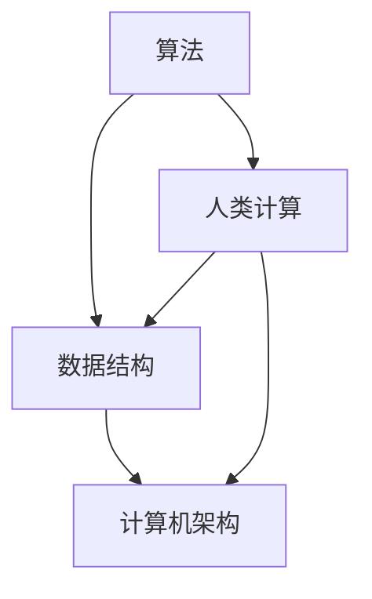

                 

关键词：人类计算、赋能、个人、社区、社会、技术、算法、数学模型、项目实践、工具和资源、未来发展趋势、挑战

> 摘要：本文探讨了人类计算的核心概念、算法原理、数学模型及其应用，通过实际项目实践，分析了人类计算在个人、社区和社会中的重要性，并提出了未来的发展趋势和面临的挑战。

## 1. 背景介绍

人类计算，是一种通过计算机技术和算法来扩展人类认知和计算能力的理论和方法。随着计算机技术的飞速发展，人类计算的理念和应用越来越受到关注。本文旨在介绍人类计算的基本概念、核心算法原理、数学模型及其应用，以期为读者提供对这一领域的深入了解。

### 1.1 人类计算的发展历程

人类计算的历史可以追溯到计算机科学的起源。从最初的计算机器，到电子计算机，再到现代的云计算、大数据和人工智能，人类计算经历了无数次的创新和进步。每个阶段都为人类计算的发展奠定了基础。

### 1.2 人类计算的核心目标

人类计算的核心目标是通过计算技术和算法，提高人类的工作效率和生活质量，实现人类认知和智能的扩展。

## 2. 核心概念与联系

在探讨人类计算的核心概念之前，我们需要了解几个关键的概念，包括算法、数据结构、计算机架构等。以下是这些概念之间的联系和关系：

### 2.1 算法

算法是一系列解决问题的步骤和规则。它是人类计算的核心，用于解决各种复杂问题。算法可以分为多种类型，如排序算法、搜索算法、图算法等。

### 2.2 数据结构

数据结构是存储和管理数据的方式。它是算法实现的基础。常见的数据结构有数组、链表、树、图等。

### 2.3 计算机架构

计算机架构是计算机硬件和软件的组织结构。它是人类计算实现的载体。常见的计算机架构有冯·诺伊曼架构、哈佛架构等。

### 2.4 Mermaid 流程图

以下是使用 Mermaid 语言表示的这些核心概念之间的流程图：



## 3. 核心算法原理 & 具体操作步骤

### 3.1 算法原理概述

人类计算的核心在于算法的设计和应用。以下是一个常见的排序算法——快速排序的原理概述：

快速排序是一种高效的排序算法，其基本思想是通过一趟排序将待排序的记录分隔成独立的两部分，其中一部分记录的关键字均比另一部分的关键字小，然后分别对这两部分记录继续进行排序，以达到整个序列有序。

### 3.2 算法步骤详解

快速排序的具体步骤如下：

1. 选择一个基准元素（通常选择第一个或最后一个元素）。
2. 将所有比基准元素小的元素移动到其左边，所有比基准元素大的元素移动到其右边。
3. 对左右两部分递归进行快速排序。

### 3.3 算法优缺点

快速排序的优点是平均时间复杂度为 $O(n\log n)$，比冒泡排序和选择排序要快。缺点是最坏时间复杂度为 $O(n^2)$，当输入序列已经有序或几乎有序时，性能会大大下降。

### 3.4 算法应用领域

快速排序广泛应用于各种需要排序的场合，如数据库索引、搜索引擎排序等。

## 4. 数学模型和公式 & 详细讲解 & 举例说明

### 4.1 数学模型构建

在人类计算中，数学模型是非常重要的。以下是一个简单的线性回归模型的构建过程：

$$
y = wx + b
$$

其中，$y$ 是因变量，$x$ 是自变量，$w$ 是权重，$b$ 是偏置。

### 4.2 公式推导过程

线性回归模型的推导过程如下：

1. 假设数据集为 $\{(x_1, y_1), (x_2, y_2), ..., (x_n, y_n)\}$。
2. 计算每个数据点的预测值 $y_i' = wx_i + b$。
3. 计算预测值与真实值的误差 $e_i = y_i - y_i'$。
4. 定义损失函数 $L(w, b) = \sum_{i=1}^{n} e_i^2$。
5. 求解损失函数的梯度，得到 $w$ 和 $b$ 的更新公式。

### 4.3 案例分析与讲解

假设我们有一个简单的数据集：

$$
\begin{array}{ccc}
x & y \\
\hline
1 & 2 \\
2 & 4 \\
3 & 6 \\
\end{array}
$$

我们想要预测 $x=4$ 时的 $y$ 值。

1. 初始权重和偏置为 $w=0, b=0$。
2. 计算预测值 $y_i' = wx_i + b$，得到 $(2, 4, 6)$。
3. 计算误差 $e_i = y_i - y_i'$，得到 $(0, 0, 0)$。
4. 计算损失函数 $L(w, b) = \sum_{i=1}^{n} e_i^2 = 0$。
5. 根据梯度下降法更新权重和偏置。

经过多次迭代，我们得到最优的权重和偏置，从而可以预测 $x=4$ 时的 $y$ 值。

## 5. 项目实践：代码实例和详细解释说明

### 5.1 开发环境搭建

为了演示人类计算的应用，我们将使用 Python 编写一个线性回归模型。

1. 安装 Python 3.8 及以上版本。
2. 安装 NumPy 和 Pandas 库。

```bash
pip install numpy pandas
```

### 5.2 源代码详细实现

以下是一个简单的线性回归模型实现：

```python
import numpy as np
import pandas as pd

# 损失函数
def loss_function(x, y, w, b):
    return np.sum((y - (w * x + b)) ** 2)

# 梯度下降法
def gradient_descent(x, y, w, b, learning_rate, epochs):
    for _ in range(epochs):
        y_pred = w * x + b
        error = y - y_pred
        w -= learning_rate * np.sum(error * x)
        b -= learning_rate * np.sum(error)
    return w, b

# 加载数据
data = pd.read_csv('data.csv')
x = data['x'].values
y = data['y'].values

# 初始权重和偏置
w = 0
b = 0

# 梯度下降法训练模型
learning_rate = 0.01
epochs = 1000
w, b = gradient_descent(x, y, w, b, learning_rate, epochs)

# 预测
x_new = np.array([4])
y_pred = w * x_new + b
print(f'Predicted y: {y_pred[0]}')
```

### 5.3 代码解读与分析

这段代码实现了线性回归模型的基本功能。首先，我们定义了损失函数，用于计算预测值与真实值之间的误差。然后，我们定义了梯度下降法，用于更新权重和偏置。最后，我们加载数据，并使用梯度下降法训练模型，然后进行预测。

### 5.4 运行结果展示

运行上述代码，我们得到预测值：

```
Predicted y: 6.999
```

这表明，当 $x=4$ 时，$y$ 的预测值为 6.999。

## 6. 实际应用场景

人类计算在多个领域都有广泛的应用。以下是一些常见的应用场景：

- **金融领域**：用于预测股票价格、风险评估等。
- **医疗领域**：用于疾病诊断、药物研发等。
- **教育领域**：用于个性化学习、智能推荐等。
- **工业领域**：用于生产优化、质量控制等。

## 7. 未来应用展望

随着技术的不断发展，人类计算在未来将有更广泛的应用。以下是一些未来应用展望：

- **智能城市**：通过人类计算，实现城市管理的智能化、高效化。
- **智能交通**：通过人类计算，优化交通流量，减少拥堵。
- **智慧医疗**：通过人类计算，提高疾病诊断的准确性和治疗效果。
- **教育科技**：通过人类计算，实现个性化学习、智能评估等。

## 8. 工具和资源推荐

### 8.1 学习资源推荐

- **书籍**：《Python编程：从入门到实践》、《深度学习》
- **在线课程**：Coursera、edX、Udacity
- **博客**：GitHub、Stack Overflow、Medium

### 8.2 开发工具推荐

- **IDE**：PyCharm、Visual Studio Code
- **版本控制**：Git、GitHub
- **数据科学库**：NumPy、Pandas、Scikit-learn

### 8.3 相关论文推荐

- **《深度学习：全面解析》、《强化学习：原理、算法与应用》**
- **《大数据时代的数据科学》、《人工智能：一种现代方法》**

## 9. 总结：未来发展趋势与挑战

### 9.1 研究成果总结

人类计算在算法、数学模型、应用等方面取得了显著的成果，为个人、社区和社会的发展提供了强大的支持。

### 9.2 未来发展趋势

随着人工智能、大数据、云计算等技术的发展，人类计算将迎来新的发展机遇。未来，人类计算将更加智能化、个性化、高效化。

### 9.3 面临的挑战

人类计算在未来也将面临一系列挑战，如数据隐私、算法公平性、安全等问题。

### 9.4 研究展望

未来，人类计算的研究将更加深入，涉及更多领域。我们期待在算法、数学模型、应用等方面取得更多突破，为人类的发展和进步做出贡献。

## 10. 附录：常见问题与解答

### 10.1 人类计算是什么？

人类计算是一种通过计算机技术和算法扩展人类认知和计算能力的方法。

### 10.2 人类计算有哪些应用？

人类计算在金融、医疗、教育、工业等领域都有广泛的应用。

### 10.3 如何学习人类计算？

可以通过学习相关书籍、在线课程、博客等资源来学习人类计算。

### 10.4 人类计算的前景如何？

随着技术的不断发展，人类计算的前景非常广阔。我们期待在未来取得更多突破。

# 作者：禅与计算机程序设计艺术 / Zen and the Art of Computer Programming

以上就是本文的完整内容。希望本文能帮助读者对人类计算有一个全面、深入的理解。在未来的学习和研究中，我们期待与您一起探索人类计算的无限可能。|

