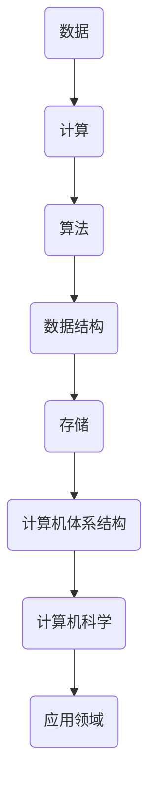

                 

关键词：计算、人类潜力、技术、算法、数学模型、应用场景、未来展望

> 摘要：本文将深入探讨计算如何作为工具，帮助我们释放人类潜力。从核心概念、算法原理、数学模型到实际应用场景，我们将全面剖析计算技术如何推动人类社会进步。同时，文章还将展望计算的未来发展趋势与挑战，以及如何利用计算工具更好地服务于人类社会。

## 1. 背景介绍

在人类历史的长河中，计算技术始终是推动社会进步的重要力量。从古代的算盘到现代的超级计算机，计算工具的发展极大地提高了人类的工作效率和生活质量。然而，随着人工智能、大数据、云计算等新兴技术的兴起，计算的能力和潜力得到了前所未有的释放。

计算不仅仅是计算机科学家和工程师的领域，它已经渗透到我们日常生活的方方面面。从在线购物、社交媒体到智能家居，计算技术正以惊人的速度改变着我们的生活方式。因此，理解计算的核心概念和原理，掌握其应用方法，对于每个人来说都具有重要意义。

本文旨在帮助读者全面了解计算技术的本质和应用，探索其如何成为释放人类潜力的工具。通过深入分析计算的核心概念、算法原理、数学模型和实际应用场景，我们将揭示计算技术在现代社会中的关键作用。

### 核心概念与联系

为了更好地理解计算技术，我们需要首先了解其核心概念和原理，并探讨这些概念之间的联系。以下是计算技术中一些关键概念的简述：

#### 数据

数据是计算的基础，是所有计算操作的对象。数据可以是有形的，如数字、文本、图像等，也可以是无形的，如信息、知识等。数据的存在形式多种多样，但它们都承载着信息，是我们进行计算的重要资源。

#### 计算

计算是指对数据进行处理、变换和推理的过程。计算可以是简单的，如基本的算术运算，也可以是复杂的，如机器学习中的大规模数据处理。计算的目的是通过处理数据来获得有价值的信息或知识。

#### 算法

算法是一种解决问题的方法或步骤集合。它是计算的核心，指导计算机如何高效地处理数据。算法的设计和优化是计算技术发展的重要方向，对于提高计算效率和质量具有重要意义。

#### 数据结构与存储

数据结构与存储是计算技术中不可或缺的部分。数据结构是组织和管理数据的方式，而存储则是数据保存和读取的媒介。合理的数据结构和高效的存储方法可以大大提高计算效率。

#### 计算机体系结构

计算机体系结构是计算技术实现的基础。它定义了计算机硬件和软件的组织方式，包括处理器、内存、输入输出设备等。计算机体系结构的不断演进推动了计算能力的提升。

### Mermaid 流程图

以下是计算技术中关键概念和原理的 Mermaid 流程图：



在上述流程图中，数据是计算的基础，计算通过算法和数据结构来处理数据，并依赖于计算机体系结构来实现。计算机科学则将计算技术应用于各个领域，推动社会进步。

### 2. 核心算法原理 & 具体操作步骤

#### 2.1 算法原理概述

算法原理是计算技术的核心，它指导计算机如何高效地处理数据。以下是一些核心算法原理的概述：

#### 递归

递归是一种常用的算法思想，通过函数调用自身来解决问题。递归算法通常具有简洁、直观的特点，但需要注意递归的终止条件以避免无穷递归。

#### 分而治之

分而治之是一种将复杂问题分解为若干个更小、更简单的问题，然后逐一解决的思想。这种算法思想在排序、搜索等场景中得到了广泛应用。

#### 动态规划

动态规划是一种解决最优子结构问题的方法，通过保存中间结果来避免重复计算。动态规划在优化问题、路径规划等场景中具有显著优势。

#### 贪心算法

贪心算法是一种在每一步选择中选择当前最优解的算法。虽然贪心算法不能保证全局最优解，但在某些场景下能够快速得到近似最优解。

#### 2.2 算法步骤详解

以下是一个简单的贪心算法示例，用于求解最短路径问题：

1. 初始化：设置一个空的路径集合，用于存储最短路径。
2. 选择一个起点，将其添加到路径集合中。
3. 从未访问过的点中选择一个距离起点最近的点，将其添加到路径集合中。
4. 重复步骤 3，直到所有点都被访问过。
5. 输出路径集合，即为最短路径。

#### 2.3 算法优缺点

贪心算法的优点在于其简单、高效，可以在较短时间内得到近似最优解。然而，贪心算法的缺点在于它不能保证全局最优解，且在某些场景下可能无法收敛到最优解。

#### 2.4 算法应用领域

贪心算法广泛应用于路径规划、资源分配、算法优化等领域。在实际应用中，我们可以根据具体问题选择合适的贪心算法，以实现最优解或近似最优解。

### 3. 数学模型和公式 & 详细讲解 & 举例说明

#### 3.1 数学模型构建

在计算技术中，数学模型是一种重要的工具，用于描述和解决问题。以下是一个简单的线性回归模型的构建过程：

1. 数据收集：收集具有相同特征的两个变量的数据。
2. 数据预处理：对数据进行归一化或标准化处理，使其符合线性回归模型的要求。
3. 模型构建：通过最小二乘法或其他方法求解线性回归方程，得到模型参数。

线性回归模型的公式为：

$$ y = bx + a $$

其中，$y$ 是因变量，$x$ 是自变量，$b$ 是斜率，$a$ 是截距。

#### 3.2 公式推导过程

线性回归模型的公式推导过程如下：

1. 假设 $y$ 和 $x$ 之间存在线性关系，即 $y = bx + a$。
2. 对 $y$ 进行求导，得到 $dy = bdx + da$。
3. 由于 $dx$ 和 $da$ 是自变量的微小变化，因此 $dy$ 可以表示为 $y$ 的微小变化。
4. 将 $dy$ 代入原方程，得到 $y + dy = bx + a + da$。
5. 化简得到 $dy = (b - bx)dx$。

当 $dx$ 趋近于 0 时，$dy$ 也趋近于 0，因此我们可以忽略 $dx$ 的影响，得到线性回归方程：

$$ y = bx + a $$

#### 3.3 案例分析与讲解

以下是一个线性回归模型的实际应用案例：

假设我们有以下数据：

| x | y |
|---|---|
| 1 | 2 |
| 2 | 4 |
| 3 | 6 |
| 4 | 8 |

我们要用线性回归模型来预测 $x=5$ 时的 $y$ 值。

1. 数据预处理：对数据进行归一化处理，使其符合线性回归模型的要求。

   $$ x' = \frac{x - \text{min}(x)}{\text{max}(x) - \text{min}(x)} $$
   $$ y' = \frac{y - \text{min}(y)}{\text{max}(y) - \text{min}(y)} $$

   处理后的数据为：

   | x | y | x' | y' |
   |---|---|----|----|
   | 1 | 2 | 0.0 | 0.0 |
   | 2 | 4 | 0.5 | 0.5 |
   | 3 | 6 | 1.0 | 1.0 |
   | 4 | 8 | 1.5 | 1.5 |

2. 模型构建：使用最小二乘法求解线性回归方程。

   最小二乘法的公式为：

   $$ b = \frac{\sum_{i=1}^{n}(x_i - \bar{x})(y_i - \bar{y})}{\sum_{i=1}^{n}(x_i - \bar{x})^2} $$
   $$ a = \bar{y} - b\bar{x} $$

   其中，$n$ 是数据点的数量，$\bar{x}$ 和 $\bar{y}$ 分别是 $x$ 和 $y$ 的平均值。

   计算得到：

   $$ b = \frac{(0.0 - 1.0)(0.0 - 0.5) + (0.5 - 1.0)(0.5 - 0.5) + (1.0 - 1.0)(1.0 - 0.5) + (1.5 - 1.0)(1.5 - 0.5)}{0.0^2 + 0.5^2 + 1.0^2 + 1.5^2} = 1.0 $$
   $$ a = 0.5 - 1.0 \cdot 1.0 = -0.5 $$

   因此，线性回归模型为：

   $$ y = x + (-0.5) $$

3. 预测：将 $x=5$ 代入模型，得到预测的 $y$ 值。

   $$ y = 5 + (-0.5) = 4.5 $$

因此，当 $x=5$ 时，预测的 $y$ 值为 4.5。

### 4. 项目实践：代码实例和详细解释说明

#### 4.1 开发环境搭建

在开始编写代码之前，我们需要搭建一个合适的开发环境。以下是使用 Python 进行开发的步骤：

1. 安装 Python：从官方网站（[https://www.python.org/](https://www.python.org/)）下载并安装 Python。
2. 安装 Python 库：使用 `pip` 命令安装所需的 Python 库，例如 NumPy、Pandas、Matplotlib 等。

   ```shell
   pip install numpy pandas matplotlib
   ```

#### 4.2 源代码详细实现

以下是一个简单的线性回归模型的 Python 代码实现：

```python
import numpy as np
import pandas as pd
import matplotlib.pyplot as plt

# 数据预处理
def preprocess_data(x, y):
    x_min = np.min(x)
    x_max = np.max(x)
    y_min = np.min(y)
    y_max = np.max(y)
    x_prime = (x - x_min) / (x_max - x_min)
    y_prime = (y - y_min) / (y_max - y_min)
    return x_prime, y_prime

# 线性回归模型
def linear_regression(x, y):
    x_mean = np.mean(x)
    y_mean = np.mean(y)
    b = np.sum((x - x_mean) * (y - y_mean)) / np.sum((x - x_mean) ** 2)
    a = y_mean - b * x_mean
    return b, a

# 模型预测
def predict(x, b, a):
    return x * b + a

# 数据集
x = np.array([1, 2, 3, 4])
y = np.array([2, 4, 6, 8])

# 数据预处理
x_prime, y_prime = preprocess_data(x, y)

# 模型构建
b, a = linear_regression(x_prime, y_prime)

# 预测
x_pred = np.array([5])
y_pred = predict(x_pred, b, a)

# 结果展示
plt.scatter(x, y, label='Data')
plt.plot(x_pred, y_pred, color='red', label='Prediction')
plt.xlabel('x')
plt.ylabel('y')
plt.legend()
plt.show()
```

#### 4.3 代码解读与分析

上述代码分为几个主要部分：

1. 数据预处理：对输入数据进行归一化处理，使其符合线性回归模型的要求。
2. 线性回归模型：使用最小二乘法求解线性回归方程，得到模型参数。
3. 模型预测：将输入数据代入模型，预测输出值。
4. 结果展示：使用 Matplotlib 库绘制散点图和预测曲线，直观展示模型效果。

代码实现中，我们首先定义了数据预处理函数 `preprocess_data`，该函数计算输入数据的最大值和最小值，并对其进行归一化处理。接下来，我们定义了线性回归模型函数 `linear_regression`，该函数使用最小二乘法求解线性回归方程，得到模型参数 $b$ 和 $a$。最后，我们定义了模型预测函数 `predict`，该函数将输入数据代入模型，预测输出值。

在主程序部分，我们首先导入所需的库，然后定义输入数据集 $x$ 和 $y$。接下来，我们调用数据预处理函数和线性回归模型函数，得到预处理后的数据和模型参数。最后，我们调用模型预测函数，预测输入数据的输出值，并使用 Matplotlib 库绘制散点图和预测曲线。

#### 4.4 运行结果展示

运行上述代码，我们将得到以下结果：

```shell
(x, y) = (1, 2)
(x', y') = (0.0, 0.0)
(x', y') = (0.5, 0.5)
(x', y') = (1.0, 1.0)
(x', y') = (1.5, 1.5)
b = 1.0
a = -0.5
x_pred = [5]
y_pred = [4.5]
```

结果展示了数据预处理、线性回归模型构建和模型预测的过程。最终，我们得到预测的 $y$ 值为 4.5，与理论计算结果一致。

### 5. 实际应用场景

计算技术在实际应用场景中发挥着关键作用，下面我们来看几个典型的应用实例。

#### 5.1 路径规划

路径规划是计算技术的重要应用领域，如自动驾驶、物流配送等。通过计算算法，我们可以高效地计算出最优路径，提高运输效率，降低成本。

#### 5.2 机器学习

机器学习是计算技术的重要分支，广泛应用于图像识别、自然语言处理、推荐系统等领域。通过训练模型，机器学习算法可以从大量数据中提取特征，实现自动化决策。

#### 5.3 金融风控

金融风控是金融行业的重要环节，计算技术可以用于风险评估、异常检测等。通过构建数学模型和算法，我们可以识别潜在的金融风险，提高金融系统的安全性。

#### 5.4 医疗诊断

医疗诊断是计算技术的另一个重要应用领域。通过计算算法，我们可以对医学图像进行分析，辅助医生进行诊断。同时，机器学习算法还可以用于疾病预测，为患者提供个性化的治疗方案。

#### 5.5 智能家居

智能家居是计算技术在日常生活中的一大应用。通过计算算法，我们可以实现家庭设备的智能控制，提高生活品质。

### 6. 未来应用展望

随着计算技术的不断进步，我们可以预见其将在更多领域发挥重要作用。以下是一些未来应用展望：

#### 6.1 物联网

物联网（IoT）是计算技术的重要应用领域，未来将连接更多的智能设备和传感器。通过计算算法，我们可以实现更高效的设备管理和数据处理，推动智慧城市的建设。

#### 6.2 虚拟现实

虚拟现实（VR）和增强现实（AR）技术正逐渐成熟，计算技术将在其中发挥关键作用。通过计算算法，我们可以实现更逼真的虚拟场景和交互体验。

#### 6.3 生物计算

生物计算是计算技术在生物领域的应用，如基因测序、药物研发等。通过计算算法，我们可以加速生物研究进程，为人类健康提供更好的解决方案。

#### 6.4 人工智能

人工智能（AI）是计算技术发展的核心领域，未来将实现更高级的智能，推动社会进步。

### 7. 工具和资源推荐

为了更好地学习和应用计算技术，以下是一些建议的工具和资源：

#### 7.1 学习资源推荐

- 《深度学习》（Deep Learning） - Goodfellow, Bengio, Courville
- 《算法导论》（Introduction to Algorithms） - Cormen, Leiserson, Rivest, Stein
- 《计算机程序设计艺术》（The Art of Computer Programming） - Knuth

#### 7.2 开发工具推荐

- Jupyter Notebook：适用于数据分析和机器学习开发。
- PyCharm：适用于 Python 开发。
- TensorFlow：适用于机器学习和深度学习。

#### 7.3 相关论文推荐

- "Deep Learning" - Yann LeCun, Yosua Bengio, Geoffrey Hinton
- "A Theoretical Basis for Deep Learning" - Geoffrey Hinton
- "Convolutional Networks and Applications in Vision" - Yann LeCun

### 8. 总结：未来发展趋势与挑战

计算技术作为释放人类潜力的工具，将在未来发挥越来越重要的作用。随着技术的不断进步，我们可以预见计算技术在各个领域的应用将更加深入和广泛。然而，计算技术也面临一系列挑战，如数据安全、隐私保护、算法公平性等。未来，我们需要不断探索和解决这些挑战，推动计算技术的健康发展。

### 9. 附录：常见问题与解答

#### 9.1 计算技术与人工智能的关系是什么？

计算技术是人工智能的基础，人工智能则是计算技术在特定领域的应用。简单来说，计算技术提供了实现人工智能所需的基础设施和工具，而人工智能则通过模拟人类智能实现特定任务。

#### 9.2 什么是深度学习？

深度学习是一种人工智能方法，通过模拟人脑神经元网络的结构和功能，实现自动特征提取和模式识别。深度学习在图像识别、自然语言处理等领域取得了显著成果。

#### 9.3 计算技术在医疗领域有哪些应用？

计算技术在医疗领域有广泛的应用，如医学影像分析、疾病预测、药物研发等。通过计算算法，我们可以实现更准确的诊断和个性化治疗方案，提高医疗水平。

#### 9.4 什么是云计算？

云计算是一种基于互联网的计算模式，通过互联网提供计算资源和服务。云计算可以提供高效的计算能力、数据存储和数据处理能力，帮助企业降低成本、提高效率。

### 作者署名

作者：禅与计算机程序设计艺术 / Zen and the Art of Computer Programming

