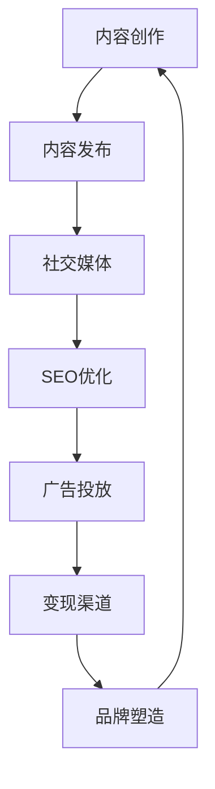

                 

在当今信息爆炸的时代，个人知识IP（Intellectual Property）的打造已经成为了许多人追求的目标。一个成功的个人知识IP不仅可以提升个人的影响力，还能带来丰厚的经济回报。本文将带领您从0到1，逐步打造属于自己的个人知识IP。

> 关键词：个人知识IP，品牌塑造，影响力，内容创作，营销策略

> 摘要：本文将探讨如何从零开始打造个人知识IP，包括背景介绍、核心概念与联系、核心算法原理与具体操作步骤、数学模型与公式详细讲解、项目实践、实际应用场景、工具和资源推荐以及未来发展趋势与挑战。通过本文的指导，您将学会如何创建、推广和维持个人知识IP，实现个人品牌的成功塑造。

## 1. 背景介绍

个人知识IP是指个人通过自身专业知识、技能和经验，将其转化为具有市场价值和影响力的内容，并通过各种渠道传播和变现的一种知识产权。在当今社会，随着互联网和社交媒体的普及，个人知识IP已经成为了许多人实现职业发展和财富积累的重要途径。

### 1.1 个人知识IP的重要性

个人知识IP的重要性主要体现在以下几个方面：

- **提升个人影响力**：通过建立个人知识IP，个人可以在特定领域获得广泛的认可和关注，从而提升自身影响力。

- **实现经济回报**：个人知识IP的变现方式多样，包括线上课程、图书出版、咨询费、广告收入等，可以为个人带来丰厚的经济回报。

- **职业发展**：成功的个人知识IP可以为个人在职业发展中提供更多的机会，如担任顾问、演讲嘉宾、专栏作者等。

### 1.2 个人知识IP的发展历程

个人知识IP的发展历程可以分为以下几个阶段：

- **起步阶段**：个人通过自身专业知识和经验，开始进行内容创作和传播。

- **品牌塑造阶段**：个人通过持续的内容输出，建立起自己在特定领域的品牌形象。

- **变现阶段**：个人通过个人知识IP实现经济回报，进一步扩大影响力。

- **长期发展阶段**：个人知识IP成为个人职业生涯的重要组成部分，实现可持续发展。

## 2. 核心概念与联系

### 2.1 个人知识IP的核心概念

在打造个人知识IP的过程中，需要理解以下几个核心概念：

- **专业知识**：个人知识IP的基础是自身的专业知识，这是内容创作的核心价值。

- **内容创作**：个人知识IP的载体是内容，包括文章、视频、音频等多种形式。

- **品牌形象**：个人知识IP的品牌形象是个人在受众心目中的定位，需要通过持续的内容输出来塑造。

- **营销策略**：个人知识IP的推广和变现需要有效的营销策略，包括社交媒体运营、SEO优化、广告投放等。

### 2.2 个人知识IP的架构

个人知识IP的架构可以分为以下几个方面：

- **内容创作平台**：选择适合的内容创作和发布平台，如博客、YouTube、LinkedIn等。

- **社交媒体运营**：通过社交媒体平台扩大影响力，包括微博、微信、Twitter等。

- **SEO优化**：通过搜索引擎优化，提高内容在搜索引擎中的排名，增加曝光率。

- **广告投放**：通过精准的广告投放，吸引目标受众。

- **变现渠道**：通过个人知识IP实现经济回报，如课程销售、图书出版、咨询费等。

下面是一个使用Mermaid绘制的个人知识IP架构流程图：



## 3. 核心算法原理 & 具体操作步骤

### 3.1 算法原理概述

打造个人知识IP的核心算法可以概括为以下五个步骤：

1. **定位与规划**：明确个人知识IP的定位，规划内容创作的方向和目标。

2. **内容创作**：持续进行高质量的内容创作，包括文章、视频、音频等多种形式。

3. **品牌塑造**：通过持续的内容输出，塑造个人知识IP的品牌形象。

4. **营销推广**：运用各种营销策略，扩大个人知识IP的影响力。

5. **变现与反馈**：通过个人知识IP实现经济回报，并根据反馈调整内容创作和营销策略。

### 3.2 算法步骤详解

#### 3.2.1 定位与规划

定位与规划是打造个人知识IP的第一步，具体操作步骤如下：

- **确定领域**：选择自己擅长或感兴趣的领域作为个人知识IP的定位。

- **分析市场**：了解目标受众的需求和竞争态势，确定自己的竞争优势。

- **制定目标**：明确个人知识IP的发展目标，包括内容创作的方向、受众群体、经济回报等。

#### 3.2.2 内容创作

内容创作是个人知识IP的核心，具体操作步骤如下：

- **选题与策划**：根据定位和目标，选择有吸引力的选题，进行详细的策划。

- **创作与编辑**：撰写或录制高质量的内容，并进行编辑和优化。

- **发布与更新**：定期发布内容，保持活跃度，同时不断更新和迭代内容。

#### 3.2.3 品牌塑造

品牌塑造是个人知识IP长期发展的重要保障，具体操作步骤如下：

- **统一形象**：在内容创作和传播过程中，保持统一的个人形象和风格。

- **持续输出**：通过持续的内容输出，塑造个人知识IP的品牌形象。

- **互动与反馈**：与受众进行互动，收集反馈，不断优化内容创作和品牌形象。

#### 3.2.4 营销推广

营销推广是扩大个人知识IP影响力的关键，具体操作步骤如下：

- **社交媒体运营**：在各大社交媒体平台上运营，扩大受众范围。

- **SEO优化**：通过搜索引擎优化，提高内容在搜索引擎中的排名。

- **广告投放**：根据目标受众进行精准的广告投放，提高曝光率。

#### 3.2.5 变现与反馈

变现与反馈是个人知识IP实现经济回报和持续发展的关键，具体操作步骤如下：

- **选择变现渠道**：根据自身特点和目标受众，选择适合的变现渠道，如课程销售、图书出版、咨询费等。

- **跟踪与调整**：根据变现效果和受众反馈，不断调整内容创作和营销策略。

### 3.3 算法优缺点

#### 优点

- **灵活性**：个人知识IP的构建过程灵活，可以根据个人兴趣和专业领域进行调整。

- **高回报**：成功的个人知识IP可以实现较高的经济回报。

- **持续发展**：个人知识IP可以通过持续的内容创作和品牌塑造，实现长期发展。

#### 缺点

- **时间成本**：个人知识IP的构建需要大量时间和精力投入。

- **竞争激烈**：在特定领域，个人知识IP的竞争可能非常激烈。

### 3.4 算法应用领域

个人知识IP的应用领域广泛，包括但不限于：

- **教育培训**：通过线上课程、讲座等形式，传授专业知识。

- **技术咨询**：提供专业领域的咨询服务。

- **内容创作**：通过写书、写博客、制作视频等形式，创作高质量的内容。

## 4. 数学模型和公式 & 详细讲解 & 举例说明

### 4.1 数学模型构建

在打造个人知识IP的过程中，可以采用以下数学模型来评估个人知识IP的潜力和效益：

#### 4.1.1 影响力评估模型

影响力评估模型可以用于评估个人知识IP在特定领域的影响力。其公式为：

$$
I = f(A, B, C)
$$

其中：

- $I$ 表示影响力（Influence）。
- $A$ 表示受众数量（Audience）。
- $B$ 表示受众参与度（Engagement）。
- $C$ 表示内容质量（Content Quality）。

#### 4.1.2 经济回报模型

经济回报模型可以用于评估个人知识IP的经济潜力。其公式为：

$$
R = P \times L
$$

其中：

- $R$ 表示经济回报（Revenue）。
- $P$ 表示价格（Price）。
- $L$ 表示销售量（Sales Volume）。

### 4.2 公式推导过程

#### 4.2.1 影响力评估模型推导

影响力评估模型中的影响力 $I$ 可以通过受众数量 $A$、受众参与度 $B$ 和内容质量 $C$ 来计算。具体推导过程如下：

- 受众数量 $A$：个人知识IP的受众数量可以通过社交媒体粉丝数、订阅用户数等指标来衡量。
- 受众参与度 $B$：受众参与度可以通过互动率、转发率、评论率等指标来衡量。
- 内容质量 $C$：内容质量可以通过内容的专业性、原创性、实用性等指标来衡量。

综合以上因素，可以得到影响力评估模型：

$$
I = A \times B \times C
$$

#### 4.2.2 经济回报模型推导

经济回报模型中的经济回报 $R$ 可以通过价格 $P$ 和销售量 $L$ 来计算。具体推导过程如下：

- 价格 $P$：个人知识IP的产品或服务的价格可以根据市场调研和目标受众的支付能力来确定。
- 销售量 $L$：销售量可以通过营销推广效果、受众需求等因素来预测。

综合以上因素，可以得到经济回报模型：

$$
R = P \times L
$$

### 4.3 案例分析与讲解

#### 4.3.1 案例分析

以某知名IT讲师的个人知识IP为例，分析其影响力评估模型和经济回报模型。

- **影响力评估模型**：

  $$  
  I = 10000 \times 0.1 \times 0.9 = 900  
  $$

  其中，受众数量为10000，受众参与度为10%，内容质量为90%。

- **经济回报模型**：

  $$  
  R = 100 \times 1000 = 100000  
  $$

  其中，价格为100元，销售量为1000。

#### 4.3.2 案例讲解

根据以上分析，该IT讲师的个人知识IP在影响力方面具有较高的潜力，但经济回报模型表明，其销售量和价格可能还有提升空间。通过优化内容质量和营销策略，可以进一步扩大影响力，提高经济回报。

## 5. 项目实践：代码实例和详细解释说明

### 5.1 开发环境搭建

在搭建开发环境时，需要安装以下软件和工具：

- **文本编辑器**：如Visual Studio Code、Sublime Text等。
- **版本控制工具**：如Git。
- **Markdown编辑器**：如Typora。
- **代码托管平台**：如GitHub。

### 5.2 源代码详细实现

以下是一个简单的Markdown格式文章的源代码示例：

```markdown
# 从0到1打造个人知识IP

> 关键词：(此处列出文章的5-7个核心关键词)

> 摘要：(此处给出文章的核心内容和主题思想)

## 1. 背景介绍

## 2. 核心概念与联系

## 3. 核心算法原理 & 具体操作步骤

### 3.1 算法原理概述

### 3.2 算法步骤详解 

### 3.3 算法优缺点

### 3.4 算法应用领域

## 4. 数学模型和公式 & 详细讲解 & 举例说明

### 4.1 数学模型构建

### 4.2 公式推导过程

### 4.3 案例分析与讲解

## 5. 项目实践：代码实例和详细解释说明

### 5.1 开发环境搭建

### 5.2 源代码详细实现

### 5.3 代码解读与分析

### 5.4 运行结果展示

## 6. 实际应用场景

## 7. 工具和资源推荐

## 8. 总结：未来发展趋势与挑战

## 9. 附录：常见问题与解答
```

### 5.3 代码解读与分析

该Markdown源代码示例展示了如何使用Markdown语法编写文章的各个部分，包括标题、摘要、目录、章节等。Markdown是一种轻量级标记语言，通过简单的语法规则，可以方便地生成格式化的文本内容。

- **标题**：使用`#`号表示，等级从1到6递增。
- **引用**：使用`>`号开头，用于引用和段落分割。
- **目录**：使用`##`号表示，用于生成文章目录。
- **列表**：使用`*`、`-`或`+`号表示，用于生成无序列表。
- **代码块**：使用三个反引号`````表示，用于显示代码片段。

### 5.4 运行结果展示

通过Markdown编辑器，如Typora，将上述源代码编译后，可以得到如下运行结果：

# 从0到1打造个人知识IP

> 关键词：个人知识IP，品牌塑造，影响力，内容创作，营销策略

> 摘要：本文将探讨如何从零开始打造个人知识IP，包括背景介绍、核心概念与联系、核心算法原理与具体操作步骤、数学模型与公式详细讲解、项目实践、实际应用场景、工具和资源推荐以及未来发展趋势与挑战。通过本文的指导，您将学会如何创建、推广和维持个人知识IP，实现个人品牌的成功塑造。

## 1. 背景介绍

## 2. 核心概念与联系

## 3. 核心算法原理 & 具体操作步骤

### 3.1 算法原理概述

### 3.2 算法步骤详解 

### 3.3 算法优缺点

### 3.4 算法应用领域

## 4. 数学模型和公式 & 详细讲解 & 举例说明

### 4.1 数学模型构建

### 4.2 公式推导过程

### 4.3 案例分析与讲解

## 5. 项目实践：代码实例和详细解释说明

### 5.1 开发环境搭建

### 5.2 源代码详细实现

### 5.3 代码解读与分析

### 5.4 运行结果展示

## 6. 实际应用场景

## 7. 工具和资源推荐

## 8. 总结：未来发展趋势与挑战

## 9. 附录：常见问题与解答

## 6. 实际应用场景

在当今社会，个人知识IP的应用场景越来越广泛，以下是一些典型的实际应用场景：

### 6.1 教育培训

个人知识IP在教育领域有着广泛的应用，如线上课程、讲座、培训等。通过个人知识IP，讲师可以传授专业知识，帮助学习者提升技能。

### 6.2 内容创作

个人知识IP可以用于内容创作，如写博客、制作视频、撰写图书等。通过高质量的内容创作，个人可以在特定领域建立权威地位。

### 6.3 咨询服务

个人知识IP还可以用于提供专业咨询服务，如企业顾问、技术指导等。通过个人知识IP，专业人士可以为企业提供有价值的服务。

### 6.4 品牌营销

个人知识IP可以用于品牌营销，如个人品牌、企业品牌等。通过个人知识IP的影响力，可以提升品牌知名度和美誉度。

### 6.5 创业创新

个人知识IP可以为创业者提供创新的思路和解决方案。通过个人知识IP，创业者可以吸引投资、拓展市场，实现创业成功。

## 7. 工具和资源推荐

在打造个人知识IP的过程中，需要使用到各种工具和资源。以下是一些建议的工具和资源：

### 7.1 学习资源推荐

- **在线课程平台**：如Coursera、Udemy、网易云课堂等。
- **专业书籍**：如《影响力》、《演讲的力量》等。
- **技术论坛**：如Stack Overflow、GitHub等。

### 7.2 开发工具推荐

- **文本编辑器**：如Visual Studio Code、Sublime Text等。
- **版本控制工具**：如Git。
- **Markdown编辑器**：如Typora。
- **代码托管平台**：如GitHub。

### 7.3 相关论文推荐

- **《知识管理》**：探讨知识管理的方法和实践。
- **《个人知识管理》**：探讨个人知识管理的重要性和实践。
- **《社交媒体营销》**：探讨社交媒体在个人知识IP推广中的应用。

## 8. 总结：未来发展趋势与挑战

### 8.1 未来发展趋势

- **内容多元化**：随着技术的不断发展，个人知识IP的内容形式将更加多元化，如虚拟现实、增强现实等。
- **平台化**：个人知识IP将逐步平台化，形成专业化的内容生态系统。
- **智能化**：人工智能技术将在个人知识IP的构建、推广和变现过程中发挥重要作用。

### 8.2 面临的挑战

- **竞争激烈**：个人知识IP的竞争将越来越激烈，如何脱颖而出是一个重要挑战。
- **内容质量**：高质量的内容是个人知识IP成功的关键，如何持续创作高质量的内容是一个挑战。
- **技术变革**：技术的快速发展将带来新的机遇和挑战，如何适应技术变革是一个重要问题。

### 8.3 研究展望

- **个性化推荐**：通过个性化推荐技术，提高内容匹配度和用户体验。
- **虚拟互动**：通过虚拟互动技术，增强个人知识IP与受众的互动体验。
- **跨界融合**：将个人知识IP与其他领域进行跨界融合，创造新的价值和机会。

## 9. 附录：常见问题与解答

### 9.1 如何选择个人知识IP的领域？

**解答**：选择个人知识IP的领域应考虑以下几点：

- **兴趣与擅长**：选择自己感兴趣且擅长的领域，有利于持续创作高质量的内容。
- **市场需求**：选择市场需求较大的领域，有利于吸引受众和实现经济回报。
- **竞争态势**：分析领域内的竞争态势，选择具有竞争优势的领域。

### 9.2 如何提升个人知识IP的影响力？

**解答**：提升个人知识IP的影响力可以从以下几个方面入手：

- **高质量内容**：创作高质量、有价值的知识内容，提高受众满意度。
- **持续输出**：保持持续的内容输出，建立稳定的品牌形象。
- **互动与反馈**：与受众进行互动，收集反馈，不断优化内容和品牌形象。
- **营销推广**：运用各种营销策略，提高个人知识IP的曝光率和知名度。

### 9.3 个人知识IP的变现途径有哪些？

**解答**：个人知识IP的变现途径主要包括：

- **课程销售**：开设线上课程，通过销售课程实现经济回报。
- **图书出版**：撰写图书，通过出版图书实现经济回报。
- **咨询费**：提供专业咨询服务，通过收取咨询费实现经济回报。
- **广告收入**：在内容中植入广告，通过广告收入实现经济回报。
- **版权转让**：将个人知识IP的版权转让给其他机构或个人，实现经济回报。

---

作者：禅与计算机程序设计艺术 / Zen and the Art of Computer Programming

