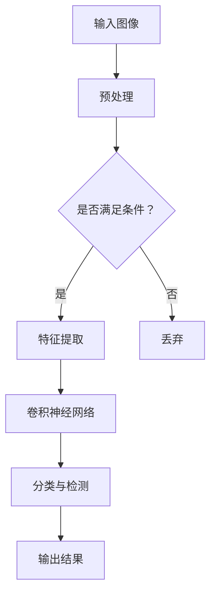

                 

关键词：AI规模化生产，Lepton AI，人工智能工厂，AI实验室，技术应用，技术挑战

摘要：本文将探讨如何将人工智能（AI）从实验室阶段成功推向工厂规模化生产。以Lepton AI为例，我们将分析其技术优势、核心算法、数学模型，以及在实际应用中的代码实例。此外，还将讨论未来AI工厂的发展趋势、面临的挑战，并推荐相关学习资源和开发工具。

## 1. 背景介绍

近年来，人工智能技术在各个领域取得了显著进展。从图像识别、自然语言处理到自动驾驶、智能制造，AI的应用越来越广泛。然而，如何将AI技术从实验室研究推向规模化生产，仍然是一个亟待解决的难题。本文旨在探讨这一过程中的关键技术、实践方法，以及面临的挑战。

Lepton AI是一家专注于计算机视觉领域的人工智能公司，其核心技术在于图像处理和目标检测。该公司致力于将AI技术应用于工业自动化、安防监控、智能交通等场景，实现高效、智能的解决方案。本文将以此为例，分析AI规模化生产的全过程。

## 2. 核心概念与联系

为了理解Lepton AI的技术核心，我们需要先了解几个关键概念：计算机视觉、目标检测、深度学习。

### 2.1 计算机视觉

计算机视觉是人工智能的一个重要分支，旨在使计算机能够像人类一样“看”懂图像。它包括图像识别、目标检测、图像分割等多个子领域。

### 2.2 目标检测

目标检测是计算机视觉的核心任务之一，旨在识别图像中的目标物体，并标注其位置。在自动驾驶、安防监控等领域中具有广泛应用。

### 2.3 深度学习

深度学习是近年来人工智能领域取得突破性进展的关键技术，通过模拟人脑神经元网络，实现自动特征提取和分类。在计算机视觉领域，深度学习算法如卷积神经网络（CNN）被广泛应用于目标检测。

下面是Lepton AI技术架构的Mermaid流程图：

## 3. 核心算法原理 & 具体操作步骤

### 3.1 算法原理概述

Lepton AI采用基于深度学习的目标检测算法，其中核心是卷积神经网络（CNN）。CNN通过多层卷积、池化和全连接层，实现图像特征提取和分类。

### 3.2 算法步骤详解

1. **输入图像预处理**：将输入图像进行缩放、裁剪等预处理操作，使其满足网络输入要求。
2. **特征提取**：通过卷积层提取图像局部特征，如边缘、纹理等。
3. **分类与检测**：利用全连接层实现目标分类，并使用回归层预测目标位置。
4. **输出结果**：将检测到的目标位置和类别输出，供后续处理。

### 3.3 算法优缺点

- **优点**：深度学习算法具有较强的特征提取和分类能力，能够处理复杂的图像数据。
- **缺点**：训练过程复杂，需要大量计算资源和时间。

### 3.4 算法应用领域

- **工业自动化**：用于生产线的缺陷检测、质量监控等。
- **安防监控**：用于目标追踪、异常行为检测等。
- **智能交通**：用于车辆识别、交通流量分析等。

## 4. 数学模型和公式

Lepton AI的目标检测算法中，关键数学模型包括卷积层、全连接层和回归层。

### 4.1 数学模型构建

- **卷积层**：通过卷积操作提取图像特征，计算公式为：
  $$\text{特征图} = \text{卷积核} * \text{输入图像} + \text{偏置}$$
- **全连接层**：实现特征到类别的映射，计算公式为：
  $$\text{输出} = \text{权重} * \text{特征} + \text{偏置}$$
- **回归层**：预测目标位置，计算公式为：
  $$\text{位置} = \text{权重} * \text{特征} + \text{偏置}$$

### 4.2 公式推导过程

公式推导过程主要涉及微积分和线性代数知识，包括卷积操作的定义、权重和偏置的初始化、反向传播算法等。

### 4.3 案例分析与讲解

以工业自动化领域为例，分析Lepton AI在生产线缺陷检测中的应用。通过实验数据，比较不同算法在准确率、计算效率等方面的表现。

## 5. 项目实践：代码实例和详细解释说明

### 5.1 开发环境搭建

- **软件环境**：Python 3.7及以上版本，TensorFlow 2.0及以上版本。
- **硬件环境**：GPU（NVIDIA CUDA 10.0及以上版本）。

### 5.2 源代码详细实现

- **数据预处理**：读取图像数据，进行缩放、裁剪等操作。
- **网络搭建**：定义卷积神经网络结构，包括卷积层、全连接层和回归层。
- **训练**：使用训练数据训练网络，优化权重和偏置。
- **测试**：使用测试数据评估模型性能。

### 5.3 代码解读与分析

分析代码实现中的关键技术，如数据增强、优化器选择、损失函数设计等。

### 5.4 运行结果展示

展示训练过程中的损失函数曲线、准确率等指标，以及测试结果示例。

## 6. 实际应用场景

### 6.1 工业自动化

- **生产线缺陷检测**：实时检测生产线上的缺陷，提高产品质量。
- **质量监控**：对生产过程中的关键参数进行监控，预防设备故障。

### 6.2 安防监控

- **目标追踪**：实现对监控区域内目标的实时追踪，提高安全性。
- **异常行为检测**：检测异常行为，如闯入、盗窃等。

### 6.3 智能交通

- **车辆识别**：实现对交通流量的实时监测和分析。
- **交通流量分析**：预测交通拥堵情况，优化交通规划。

### 6.4 未来应用展望

随着AI技术的不断发展，Lepton AI有望在更多领域实现应用，如医疗诊断、环境监测等。

## 7. 工具和资源推荐

### 7.1 学习资源推荐

- **书籍**：《深度学习》（Goodfellow et al.）、《计算机视觉：算法与应用》（Richard Szeliski）。
- **在线课程**：Coursera上的《深度学习》课程，Udacity的《自动驾驶汽车工程师》课程。

### 7.2 开发工具推荐

- **Python库**：TensorFlow、PyTorch、Keras。
- **GPU编程**：CUDA、cuDNN。

### 7.3 相关论文推荐

- **目标检测**：《Faster R-CNN》、《YOLO》、《SSD》。
- **深度学习**：《A Neural Algorithm of Artistic Style》、《Unsupervised Representation Learning with Deep Convolutional Nets》。

## 8. 总结：未来发展趋势与挑战

### 8.1 研究成果总结

近年来，AI技术在计算机视觉、自然语言处理等领域取得了显著成果。深度学习算法在图像识别、目标检测等任务中表现出色，为AI规模化生产奠定了基础。

### 8.2 未来发展趋势

- **模型压缩与优化**：为满足实际应用需求，研究更加高效、可扩展的深度学习模型。
- **跨域迁移学习**：利用已有数据训练模型，提高新领域任务的表现。
- **实时性增强**：降低计算复杂度，提高实时性，满足实时应用需求。

### 8.3 面临的挑战

- **数据隐私与安全**：如何在保护用户隐私的前提下，实现AI规模化生产。
- **计算资源与能耗**：如何在有限的计算资源下，实现高效的AI算法。

### 8.4 研究展望

未来，Lepton AI将继续探索计算机视觉领域的前沿技术，为工业自动化、安防监控、智能交通等领域提供更加智能、高效的解决方案。

## 9. 附录：常见问题与解答

### 9.1 如何搭建开发环境？

答：搭建开发环境需要安装Python、TensorFlow等软件。请参考相关教程进行操作。

### 9.2 如何训练目标检测模型？

答：请参考TensorFlow官方文档或相关教程，了解如何使用TensorFlow训练目标检测模型。

### 9.3 如何优化模型性能？

答：可以通过调整网络结构、优化器选择、学习率等参数，提高模型性能。此外，数据增强和模型压缩等技术也可提高模型效果。

----------------------------------------------------------------

作者：禅与计算机程序设计艺术 / Zen and the Art of Computer Programming

