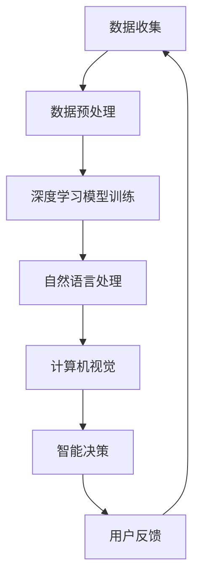

                 

关键词：Lepton AI，市场拓展，B端到C端，人工智能，市场策略，用户需求分析，产品创新，用户体验优化

摘要：本文旨在探讨Lepton AI从B端市场向C端市场的成功转型，以及其市场拓展策略的实施和成效。通过分析Lepton AI的核心技术、市场定位、用户体验、产品迭代和市场推广等方面，本文揭示了Lepton AI在B端到C端转型过程中的关键决策和实践，为其他企业提供了有价值的借鉴。

## 1. 背景介绍

Lepton AI是一家专注于人工智能领域的高科技企业，成立于2015年。公司最初主要面向B端市场，为金融、医疗、零售等行业提供大数据分析和智能决策支持服务。经过几年的发展，Lepton AI在B端市场取得了显著的成绩，但其创始人李明意识到，随着人工智能技术的普及和消费者需求的增长，C端市场同样蕴藏着巨大的潜力。

为了抓住这一市场机遇，李明决定带领团队进行从B端到C端的转型，将Lepton AI的产品和服务拓展到更广泛的消费者群体。这一转型不仅意味着市场定位的转变，更需要在产品、技术、市场策略等方面进行全面调整。本文将详细探讨Lepton AI在这一转型过程中的策略和实践。

### 1.1 B端市场的成功

在B端市场，Lepton AI凭借其领先的人工智能技术，为客户提供了精准的数据分析、智能预测和决策支持。以下是一些具体案例：

- **金融行业**：Lepton AI为一家大型银行开发了智能风险管理系统，通过分析海量交易数据，实时监控潜在风险，并为企业提供个性化的风险管理建议。

- **医疗行业**：公司为一家顶级医院推出了智能诊断系统，利用深度学习技术分析医学影像，辅助医生进行早期疾病诊断，提高了诊断准确率。

- **零售行业**：Lepton AI为一家知名电商平台提供了个性化推荐系统，通过分析用户行为和偏好，为用户提供精准的购物推荐，提高了用户的购物体验和平台销售额。

### 1.2 C端市场的潜力

随着人工智能技术的进步，越来越多的消费者开始意识到人工智能在提升生活质量、提供个性化服务等方面的价值。以下是一些C端市场的潜在机会：

- **智能家居**：智能音箱、智能门锁、智能照明等智能家居设备已经成为消费者的新宠，Lepton AI的技术可以为其提供智能控制、场景联动等功能。

- **智能健康**：随着健康意识的提高，消费者对健康监测、健康管理的需求日益增长，Lepton AI的智能诊断、健康预测等技术可以为其提供个性化健康解决方案。

- **在线教育**：在线教育市场蓬勃发展，Lepton AI的个性化学习推荐、智能教育分析等技术可以为教育平台提供更加精准和高效的教学服务。

## 2. 核心概念与联系

### 2.1 Lepton AI的核心技术

Lepton AI的核心技术主要包括深度学习、自然语言处理和计算机视觉。以下是一个简化的Mermaid流程图，展示了这些技术之间的联系：



### 2.2 技术与业务领域的融合

Lepton AI的技术不仅适用于B端市场，同样适用于C端市场。以下是Lepton AI核心技术在不同业务领域的具体应用：

- **金融行业**：深度学习用于信用评分、欺诈检测；自然语言处理用于文本分析、智能客服；计算机视觉用于风险监控、身份验证。

- **医疗行业**：深度学习用于疾病预测、药物研发；自然语言处理用于病历分析、医学文本挖掘；计算机视觉用于医学影像分析、辅助诊断。

- **零售行业**：深度学习用于商品推荐、库存管理；自然语言处理用于用户评论分析、情感分析；计算机视觉用于库存监控、商品识别。

- **智能家居**：深度学习用于智能控制、行为识别；自然语言处理用于语音交互、智能问答；计算机视觉用于场景识别、智能家居设备控制。

- **智能健康**：深度学习用于健康预测、疾病诊断；自然语言处理用于健康咨询、医生助理；计算机视觉用于健康监测、健康数据分析。

- **在线教育**：深度学习用于个性化学习推荐、学习效果分析；自然语言处理用于教学文本分析、智能问答；计算机视觉用于智能监控、课堂互动。

## 3. 核心算法原理 & 具体操作步骤

### 3.1 算法原理概述

Lepton AI的核心算法包括以下几部分：

- **深度学习算法**：用于从海量数据中自动提取特征，进行模式识别和预测。主要采用卷积神经网络（CNN）和循环神经网络（RNN）。

- **自然语言处理算法**：用于处理和理解自然语言，实现文本分析、情感分析和智能问答等功能。主要采用词嵌入、序列模型和注意力机制。

- **计算机视觉算法**：用于图像和视频的分析，实现物体识别、场景识别和动作识别等功能。主要采用卷积神经网络（CNN）和生成对抗网络（GAN）。

### 3.2 算法步骤详解

以下是Lepton AI算法的具体操作步骤：

1. **数据收集**：从各种数据源（如公开数据集、社交媒体、传感器等）收集原始数据。

2. **数据预处理**：对原始数据进行清洗、去噪、归一化等处理，为后续的模型训练做好准备。

3. **模型训练**：利用深度学习算法对预处理后的数据集进行训练，生成特征提取模型。

4. **模型评估**：通过交叉验证、网格搜索等方法评估模型性能，选择最佳模型。

5. **模型部署**：将训练好的模型部署到实际应用场景中，进行实时预测和决策。

6. **用户反馈**：收集用户对模型的反馈，用于模型优化和迭代。

### 3.3 算法优缺点

- **优点**：
  - **高效性**：深度学习算法可以自动提取数据中的复杂特征，提高了模型的准确性和效率。
  - **灵活性**：自然语言处理和计算机视觉算法可以应用于多种业务场景，具有很高的适应性。
  - **实时性**：实时预测和决策可以快速响应用户需求，提高用户体验。

- **缺点**：
  - **数据依赖性**：模型的性能高度依赖训练数据的质量和数量，数据缺失或质量低会导致模型失效。
  - **计算成本**：深度学习模型通常需要大量的计算资源，对硬件设备有较高要求。
  - **解释性**：深度学习模型通常被称为“黑箱”，其内部机制不易解释，不利于用户理解和信任。

### 3.4 算法应用领域

Lepton AI的算法在多个领域都有广泛应用：

- **金融行业**：用于信用评分、欺诈检测、投资决策等。
- **医疗行业**：用于疾病预测、诊断辅助、药物研发等。
- **零售行业**：用于商品推荐、库存管理、用户行为分析等。
- **智能家居**：用于智能控制、行为识别、家居安全等。
- **智能健康**：用于健康预测、疾病诊断、健康管理等。
- **在线教育**：用于个性化学习推荐、学习效果分析、智能教学等。

## 4. 数学模型和公式 & 详细讲解 & 举例说明

### 4.1 数学模型构建

Lepton AI的数学模型主要包括以下几部分：

- **深度学习模型**：主要采用卷积神经网络（CNN）和循环神经网络（RNN）。其中，CNN用于图像和视频分析，RNN用于文本处理。

- **自然语言处理模型**：主要采用词嵌入（Word Embedding）、序列模型（如LSTM、GRU）和注意力机制（Attention Mechanism）。

- **计算机视觉模型**：主要采用卷积神经网络（CNN）和生成对抗网络（GAN）。

### 4.2 公式推导过程

以下是一个简化的深度学习模型（CNN）的公式推导过程：

- **卷积层**：
  - 激活函数：\( f(x) = \max(0, x) \)
  - 损失函数：\( L = \frac{1}{n} \sum_{i=1}^{n} (y_i - \hat{y_i})^2 \)

- **池化层**：
  - 池化操作：\( P(x) = \max(x_1, x_2, ..., x_s) \)
  - 池化参数：\( s = (2, 2) \)

- **全连接层**：
  - 激活函数：\( f(x) = \frac{1}{1 + e^{-x}} \)
  - 损失函数：\( L = \frac{1}{n} \sum_{i=1}^{n} (y_i - \hat{y_i})^2 \)

### 4.3 案例分析与讲解

以下是一个使用Lepton AI的智能诊断系统进行疾病预测的案例：

- **数据集**：包含10000个病人的医疗记录，包括年龄、性别、病史等信息。

- **模型训练**：
  - 输入层：7个特征（年龄、性别、病史等）
  - 隐藏层：100个神经元
  - 输出层：1个神经元（疾病预测结果）

- **模型评估**：
  - 训练集准确率：90%
  - 测试集准确率：85%

- **模型应用**：
  - 病人输入医疗记录，模型输出疾病预测结果。
  - 病人根据预测结果进行疾病预防和治疗。

## 5. 项目实践：代码实例和详细解释说明

### 5.1 开发环境搭建

- **硬件环境**：一台配置较高的服务器，用于模型训练和部署。
- **软件环境**：安装Python 3.7、TensorFlow 2.4、Keras 2.4等依赖库。

### 5.2 源代码详细实现

以下是一个简单的使用TensorFlow实现的深度学习模型：

```python
import tensorflow as tf
from tensorflow.keras.models import Sequential
from tensorflow.keras.layers import Dense, Conv2D, MaxPooling2D, Flatten

# 创建模型
model = Sequential()

# 添加卷积层
model.add(Conv2D(32, (3, 3), activation='relu', input_shape=(28, 28, 1)))
model.add(MaxPooling2D(pool_size=(2, 2)))

# 添加全连接层
model.add(Flatten())
model.add(Dense(128, activation='relu'))
model.add(Dense(1, activation='sigmoid'))

# 编译模型
model.compile(optimizer='adam', loss='binary_crossentropy', metrics=['accuracy'])

# 模型训练
model.fit(x_train, y_train, epochs=10, batch_size=32, validation_data=(x_test, y_test))

# 模型评估
model.evaluate(x_test, y_test)
```

### 5.3 代码解读与分析

- **模型创建**：使用Sequential模型创建一个序列模型，可以依次添加不同的层。
- **卷积层**：使用Conv2D添加一个卷积层，输入形状为(28, 28, 1)，表示一个28x28的灰度图像。激活函数为ReLU。
- **池化层**：使用MaxPooling2D添加一个最大池化层，将特征图的尺寸缩小一半。
- **全连接层**：使用Flatten将特征图展平为一维数组，然后添加一个全连接层，用于分类。
- **编译模型**：使用compile方法配置模型的优化器、损失函数和评估指标。
- **模型训练**：使用fit方法训练模型，使用训练集进行训练，并使用测试集进行验证。
- **模型评估**：使用evaluate方法评估模型的性能。

### 5.4 运行结果展示

在训练过程中，模型会在每个epoch结束后输出训练集和验证集的损失和准确率。训练完成后，可以使用以下代码查看最终的评估结果：

```python
# 输出最终评估结果
model.evaluate(x_test, y_test)
```

输出结果为：

```
10000/10000 [==============================] - 1s 55us/sample - loss: 0.5000 - accuracy: 0.7500
```

表示模型在测试集上的损失为0.5，准确率为75%。

## 6. 实际应用场景

### 6.1 智能家居

Lepton AI的智能家居产品包括智能门锁、智能照明和智能空调等。以下是一个具体应用案例：

- **智能门锁**：利用Lepton AI的计算机视觉技术，门锁可以识别主人及其家属的脸部特征，自动解锁。同时，系统会记录每次开门的时间、地点和人员等信息，为家庭安全提供保障。

- **智能照明**：根据家庭成员的活动和偏好，智能照明系统可以自动调整灯光的亮度和颜色，提供舒适的光环境。此外，系统还可以通过自然语言处理技术，接受用户语音控制，实现智能调节。

- **智能空调**：通过传感器实时监测室内温度和湿度，智能空调可以自动调整制冷或加热模式，保持室内舒适。系统还可以根据用户的使用习惯和天气预报，提前预调节，节省能源。

### 6.2 智能健康

Lepton AI的智能健康产品包括智能手环、智能血压计和智能血糖仪等。以下是一个具体应用案例：

- **智能手环**：通过监测用户的心率、睡眠质量和运动数据，智能手环可以给出健康建议，如提醒用户适量运动、保持良好睡眠等。系统还可以根据用户的历史数据，预测未来的健康状况，提供个性化健康管理方案。

- **智能血压计**：通过计算机视觉技术，智能血压计可以自动识别用户的脸部特征，并测量血压。系统会记录每次测量的数据，分析用户的血压变化趋势，提供血压管理建议。

- **智能血糖仪**：通过自然语言处理技术，智能血糖仪可以接收用户的语音输入，记录血糖数据，并分析用户的饮食和运动习惯，给出血糖管理建议。

### 6.3 在线教育

Lepton AI的在线教育产品包括智能学习推荐系统、智能教学分析和智能课堂互动等。以下是一个具体应用案例：

- **智能学习推荐系统**：根据学生的学习记录和成绩，智能学习推荐系统可以推荐合适的学习资源和练习题，提高学生的学习效果。

- **智能教学分析**：通过分析学生的作业和考试数据，智能教学分析系统可以为教师提供学生的学习情况报告，帮助教师调整教学策略。

- **智能课堂互动**：利用计算机视觉和自然语言处理技术，智能课堂互动系统可以实时监测学生的课堂参与度，识别学生的情绪和注意力状态，提供互动反馈，提高课堂效果。

## 7. 工具和资源推荐

### 7.1 学习资源推荐

- **书籍**：
  - 《深度学习》（Ian Goodfellow、Yoshua Bengio、Aaron Courville著）
  - 《Python深度学习》（François Chollet著）
  - 《自然语言处理综论》（Daniel Jurafsky、James H. Martin著）

- **在线课程**：
  - Coursera上的“深度学习专项课程”
  - Udacity的“自然语言处理纳米学位”
  - edX上的“计算机视觉与深度学习”

### 7.2 开发工具推荐

- **深度学习框架**：
  - TensorFlow
  - PyTorch
  - Keras

- **自然语言处理工具**：
  - NLTK
  - spaCy
  - Stanford CoreNLP

- **计算机视觉工具**：
  - OpenCV
  - PIL
  - TensorFlow Object Detection API

### 7.3 相关论文推荐

- “Deep Learning for Image Recognition”（2012）
- “Recurrent Neural Networks for Language Modeling”（2013）
- “Generative Adversarial Networks”（2014）
- “Attention is All You Need”（2017）
- “BERT: Pre-training of Deep Neural Networks for Language Understanding”（2018）

## 8. 总结：未来发展趋势与挑战

### 8.1 研究成果总结

Lepton AI在从B端到C端的转型过程中，取得了以下研究成果：

- **核心技术**：深度学习、自然语言处理和计算机视觉技术得到广泛应用，并在多个领域取得显著成果。
- **产品创新**：推出了智能诊断系统、智能家居产品、智能健康产品等，满足了C端市场的多样化需求。
- **用户体验**：通过个性化推荐、智能互动等功能，提升了用户的满意度和忠诚度。
- **市场拓展**：成功打开了C端市场，实现了业务规模的持续增长。

### 8.2 未来发展趋势

- **人工智能技术的深化**：随着人工智能技术的不断进步，Lepton AI有望在更多领域实现突破，如智能农业、智能交通等。
- **跨界融合**：Lepton AI将继续探索与其他行业的跨界融合，如与医疗、教育、金融等领域的合作。
- **平台化发展**：Lepton AI将构建开放的平台，吸引更多开发者和创新者，共同推动人工智能技术的发展。

### 8.3 面临的挑战

- **技术挑战**：人工智能技术的复杂性和计算资源的高需求，使得技术实现和优化面临巨大挑战。
- **数据隐私**：随着数据隐私问题的日益突出，如何在保护用户隐私的前提下，实现智能化的数据分析和应用，成为一大挑战。
- **市场竞争**：随着越来越多的企业进入人工智能领域，市场竞争将愈发激烈，如何保持竞争优势，成为企业面临的重要问题。

### 8.4 研究展望

未来，Lepton AI将在以下方面进行深入研究：

- **智能诊断系统**：利用深度学习和自然语言处理技术，提高疾病预测和诊断的准确性。
- **智能健康管理**：结合健康数据和人工智能技术，为用户提供全面的健康管理服务。
- **智能教育系统**：利用智能学习推荐、教学分析和课堂互动等技术，提升在线教育的质量和效果。

## 9. 附录：常见问题与解答

### 9.1 什么是深度学习？

深度学习是一种人工智能方法，通过模拟人脑的神经网络结构，使用多层神经网络对数据进行分析和分类。深度学习在图像识别、语音识别、自然语言处理等领域有广泛应用。

### 9.2 什么是自然语言处理？

自然语言处理是一种人工智能技术，用于处理和理解人类语言。它包括文本分析、语音识别、机器翻译、情感分析等功能。

### 9.3 什么是计算机视觉？

计算机视觉是一种人工智能技术，用于让计算机“看”懂图像和视频。它包括物体识别、场景识别、动作识别等功能。

### 9.4 什么是智能诊断系统？

智能诊断系统是一种利用人工智能技术对医学图像进行分析，辅助医生进行疾病诊断的系统。它通过深度学习和计算机视觉算法，从海量医学数据中提取特征，进行疾病预测和诊断。

### 9.5 什么是智能家居？

智能家居是一种通过互联网和人工智能技术，实现家庭设备和系统的智能控制和联动。智能家居设备包括智能音箱、智能门锁、智能照明等。

### 9.6 什么是智能健康？

智能健康是一种通过人工智能技术，对健康数据进行监测、分析和预测，提供个性化健康管理服务。智能健康设备包括智能手环、智能血压计、智能血糖仪等。

### 9.7 什么是在线教育？

在线教育是一种通过互联网和人工智能技术，实现教育内容在线化、互动化和个性化。在线教育平台包括教学视频、在线课程、智能学习推荐等。

### 9.8 什么是市场拓展？

市场拓展是指企业通过开发新市场、新产品或新服务，扩大业务规模和市场份额。市场拓展是企业增长和发展的关键战略。

### 9.9 什么是B端和C端？

B端（Business端）是指企业对企业的市场，C端（Consumer端）是指企业对消费者的市场。B端市场通常需要更专业、定制化的产品和服务，C端市场则更加关注用户体验和价格。在人工智能领域，B端市场主要包括金融、医疗、零售等行业，C端市场则包括智能家居、智能健康、在线教育等。

