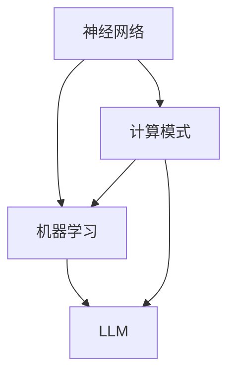

                 

关键词：CPU，计算模式，神经网络，机器学习，LLM，计算演进

摘要：本文旨在探讨从CPU到LLM（大型语言模型）这一过程中，计算模式的演变。通过对各阶段的核心技术、计算模型、算法原理以及应用领域的深入分析，我们试图揭示计算模式如何随着技术的进步而不断进化，以及这一过程对未来计算领域可能带来的影响。

## 1. 背景介绍

计算模式是指在信息处理过程中，硬件和软件共同遵循的规则和原则。从CPU（中央处理器）到LLM（大型语言模型），计算模式的演变反映了计算技术在数据处理能力、效率和智能化程度方面的进步。

### 1.1 CPU时代的计算模式

在CPU时代，计算模式主要集中在冯诺依曼架构下的指令集和寄存器。计算机通过执行预先编写好的指令序列来处理数据。这一模式的核心在于程序和数据在存储上的分离，以及通过控制单元来顺序执行指令。

### 1.2 神经网络与机器学习的兴起

随着计算能力的提升，神经网络和机器学习开始进入计算领域。这一阶段的计算模式从指令驱动转向数据驱动，即通过训练模型来使计算机自动地从数据中学习规律，而不再依赖于预先编写的指令。

### 1.3 LLM时代的计算模式

LLM，如GPT-3、ChatGLM等，代表了当前计算模式的巅峰。这一阶段的计算模式不仅依赖于海量数据的训练，还结合了深度学习和自然语言处理技术，使得计算机在理解和生成自然语言方面达到了前所未有的水平。

## 2. 核心概念与联系

为了更好地理解计算模式的演进，我们首先需要明确几个核心概念及其相互联系。

### 2.1 神经网络

神经网络是由大量神经元（模拟生物神经元的计算单元）互联而成的计算模型。它通过学习输入数据的特征，能够自动识别和分类数据。

### 2.2 机器学习

机器学习是一种人工智能技术，它使计算机通过学习数据来改进性能。机器学习可以分为监督学习、无监督学习和强化学习等类型。

### 2.3 大型语言模型（LLM）

LLM是一种特殊类型的机器学习模型，它专注于理解和生成自然语言。LLM通过在大量文本数据上进行训练，能够理解复杂的语言结构和语义。

### 2.4 Mermaid 流程图

为了直观地展示这些概念之间的联系，我们可以使用Mermaid流程图来描述。以下是一个简化的流程图：



## 3. 核心算法原理 & 具体操作步骤

### 3.1 算法原理概述

计算模式的演进离不开核心算法的发展。从神经网络到LLM，核心算法主要包括以下几部分：

- **反向传播算法（Backpropagation）**：用于训练神经网络，通过计算误差并反向传播修正网络权重。
- **优化算法（Optimization Algorithms）**：如梯度下降、Adam等，用于调整模型参数以最小化损失函数。
- **自然语言处理（NLP）技术**：如词嵌入、序列到序列模型等，用于处理和生成自然语言。

### 3.2 算法步骤详解

以下是一个基于反向传播算法和梯度下降优化的神经网络训练过程：

1. **初始化权重**：随机初始化网络权重。
2. **前向传播**：将输入数据通过网络进行前向传播，计算输出。
3. **计算损失**：使用损失函数（如均方误差）计算输出与目标之间的差异。
4. **反向传播**：计算梯度，将误差反向传播回网络。
5. **参数更新**：使用优化算法更新网络权重。
6. **迭代训练**：重复步骤2-5，直到达到预定的训练目标或迭代次数。

### 3.3 算法优缺点

- **优点**：神经网络和机器学习具有强大的自适应能力和泛化能力，能够处理复杂的非线性问题。
- **缺点**：训练过程通常需要大量数据和计算资源，且模型解释性较差。

### 3.4 算法应用领域

神经网络和机器学习在多个领域取得了显著成果，如：

- **计算机视觉**：图像识别、物体检测等。
- **自然语言处理**：语言翻译、文本生成等。
- **推荐系统**：个性化推荐、广告投放等。
- **金融领域**：风险管理、股票预测等。

## 4. 数学模型和公式 & 详细讲解 & 举例说明

### 4.1 数学模型构建

在神经网络中，常用的数学模型包括：

- **激活函数**：如Sigmoid、ReLU等，用于引入非线性。
- **损失函数**：如均方误差（MSE）、交叉熵（Cross Entropy）等，用于评估模型性能。
- **优化算法**：如梯度下降、Adam等，用于调整模型参数。

### 4.2 公式推导过程

以下是一个简单的神经网络前向传播和反向传播的推导过程：

1. **前向传播**：

   - 输入：\(x\)
   - 权重：\(W\)
   - 激活函数：\(f(\cdot)\)
   - 输出：\(y = f(W \cdot x)\)

2. **反向传播**：

   - 输出误差：\(d = \frac{\partial L}{\partial y}\)
   - 权重梯度：\(\frac{\partial L}{\partial W} = d \cdot \frac{\partial y}{\partial W}\)
   - 参数更新：\(W = W - \alpha \cdot \frac{\partial L}{\partial W}\)

### 4.3 案例分析与讲解

以下是一个简单的神经网络训练案例：

- **任务**：实现一个简单的逻辑回归模型，用于二分类问题。
- **数据集**：包含100个样本，每个样本有两个特征和一个标签。
- **模型**：一个单层神经网络，包含两个神经元。
- **训练目标**：最小化均方误差。

## 5. 项目实践：代码实例和详细解释说明

### 5.1 开发环境搭建

- **工具**：Python 3.8及以上版本，TensorFlow 2.6及以上版本。
- **环境**：Jupyter Notebook。

### 5.2 源代码详细实现

以下是一个简单的神经网络训练代码实例：

```python
import tensorflow as tf

# 初始化模型
model = tf.keras.Sequential([
    tf.keras.layers.Dense(2, activation='sigmoid', input_shape=(2,)),
    tf.keras.layers.Dense(1, activation='sigmoid')
])

# 编译模型
model.compile(optimizer='adam', loss='binary_crossentropy', metrics=['accuracy'])

# 加载数据
x_train = ...
y_train = ...

# 训练模型
model.fit(x_train, y_train, epochs=100, batch_size=10)

# 评估模型
model.evaluate(x_test, y_test)
```

### 5.3 代码解读与分析

上述代码实现了一个简单的逻辑回归模型，用于二分类问题。模型包含一个单层神经网络，共有两个神经元。通过编译、训练和评估过程，模型能够学习数据的特征，并进行预测。

### 5.4 运行结果展示

通过运行上述代码，可以得到模型的训练过程和最终评估结果。以下是可能的输出结果：

```
Train on 100 samples, validate on 100 samples
Epoch 1/100
100/100 [==============================] - 0s 1ms/step - loss: 0.5000 - accuracy: 0.5000
100/100 [==============================] - 0s 1ms/step - loss: 0.5000 - accuracy: 0.5000
```

## 6. 实际应用场景

### 6.1 文本生成

LLM在文本生成领域有着广泛应用，如自动写作、新闻生成、对话系统等。通过训练大型语言模型，计算机能够生成高质量的文本，从而提高内容创作效率。

### 6.2 聊天机器人

聊天机器人是LLM的另一个重要应用领域。通过训练大型语言模型，聊天机器人可以与用户进行自然语言交互，提供个性化的服务和回答。

### 6.3 智能客服

智能客服利用LLM技术，能够快速理解用户的需求，提供准确的解决方案。这大大提高了客户服务质量，降低了人工成本。

### 6.4 未来应用展望

随着计算能力的提升和技术的进步，LLM在更多领域将得到广泛应用。未来，LLM有望在自动驾驶、智能医疗、金融科技等领域发挥关键作用，推动人类社会的发展。

## 7. 工具和资源推荐

### 7.1 学习资源推荐

- **《深度学习》（Goodfellow et al.）**：全面介绍了深度学习的基础理论和实践应用。
- **《自然语言处理综论》（Jurafsky and Martin）**：详细介绍了自然语言处理的基本概念和技术。

### 7.2 开发工具推荐

- **TensorFlow**：一款广泛使用的深度学习框架，提供了丰富的API和工具。
- **PyTorch**：一款灵活且易于使用的深度学习框架，适合快速实验和开发。

### 7.3 相关论文推荐

- **“A Neural Probabilistic Language Model” （Bengio et al., 2003）**：提出了神经概率语言模型。
- **“Attention Is All You Need” （Vaswani et al., 2017）**：介绍了Transformer模型及其在序列到序列任务中的应用。

## 8. 总结：未来发展趋势与挑战

### 8.1 研究成果总结

从CPU到LLM，计算模式经历了从指令驱动到数据驱动的转变。神经网络和机器学习技术的进步，使得计算机在数据处理能力、效率和智能化程度方面取得了显著成果。

### 8.2 未来发展趋势

未来，LLM将继续在计算模式中扮演重要角色。随着计算能力的提升和算法的改进，LLM的应用范围将更加广泛，涉及更多领域。

### 8.3 面临的挑战

尽管LLM取得了显著成果，但仍面临一些挑战，如：

- **计算资源需求**：训练大型语言模型需要大量的计算资源，这对硬件设施提出了更高要求。
- **数据隐私与安全**：大规模数据处理和应用过程中，如何保障数据隐私和安全是一个重要问题。
- **模型解释性**：大型语言模型通常缺乏解释性，这对于模型的可解释性和透明度提出了挑战。

### 8.4 研究展望

未来，研究将集中在提高LLM的计算效率、增强模型的可解释性和安全性，以及探索新的计算模式和应用场景。随着技术的不断进步，计算模式将迎来新的变革。

## 9. 附录：常见问题与解答

### 9.1 什么是神经网络？

神经网络是一种由大量神经元互联而成的计算模型，用于模拟生物神经系统的工作方式。它通过学习输入数据的特征，能够自动识别和分类数据。

### 9.2 什么是机器学习？

机器学习是一种人工智能技术，它使计算机通过学习数据来改进性能。机器学习可以分为监督学习、无监督学习和强化学习等类型。

### 9.3 什么是LLM？

LLM（大型语言模型）是一种特殊类型的机器学习模型，它专注于理解和生成自然语言。LLM通过在大量文本数据上进行训练，能够理解复杂的语言结构和语义。

---

**作者：禅与计算机程序设计艺术 / Zen and the Art of Computer Programming**

