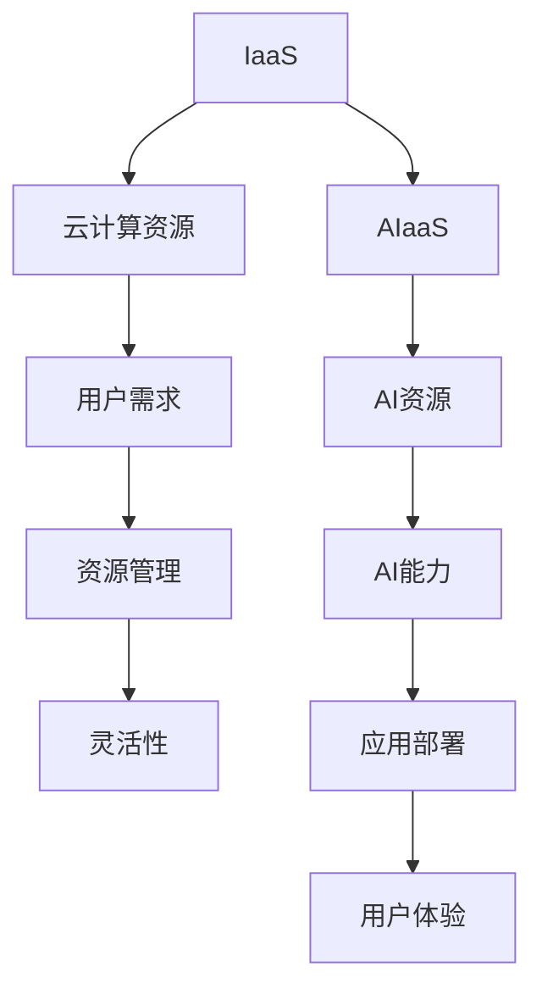

                 

关键词：IaaS，AIaaS，云计算，人工智能，服务升级，Lepton AI

> 摘要：随着人工智能技术的飞速发展，云计算服务也在不断演进。本文将探讨从基础设施即服务（IaaS）向人工智能即服务（AIaaS）的转型，以Lepton AI为例，分析其服务升级的背景、核心概念、算法原理、数学模型、项目实践、应用场景、未来展望及面临挑战。

## 1. 背景介绍

在过去的几十年中，云计算已经从基础设施即服务（IaaS）逐渐成为企业应用的基础设施。IaaS提供了虚拟化的计算资源，如虚拟机、存储和网络，使企业能够根据需求灵活扩展和缩小资源使用。然而，随着人工智能（AI）技术的不断进步，仅仅提供基础设施已经不能满足用户的需求。AI作为一种强大的工具，正逐渐改变各行各业，这就催生了人工智能即服务（AIaaS）。

AIaaS不仅仅是一个服务名称的改变，它代表了一种新的云计算服务模式，即利用云平台提供AI能力，让用户可以更轻松地部署和利用人工智能应用。Lepton AI作为一家专注于提供AIaaS的领先企业，其服务升级引起了广泛关注。

## 2. 核心概念与联系

### 2.1. IaaS与AIaaS的概念

IaaS：基础设施即服务（Infrastructure as a Service）是一种云计算服务模式，用户可以租用云服务商提供的虚拟化计算资源，如虚拟机、存储和网络。用户可以像使用本地数据中心一样使用这些资源，但无需购买和维护物理硬件。

AIaaS：人工智能即服务（Artificial Intelligence as a Service）是一种云计算服务模式，它将人工智能算法和应用封装成服务，用户可以通过云平台轻松部署和使用。AIaaS提供了包括机器学习、自然语言处理、计算机视觉等领域的算法和模型。

### 2.2. Mermaid流程图



## 3. 核心算法原理 & 具体操作步骤

### 3.1. 算法原理概述

AIaaS的核心在于提供易于使用的AI工具和算法，这些算法通常基于深度学习和机器学习技术。以下是几个关键的算法原理：

- **深度学习**：通过多层神经网络，从大量数据中自动提取特征，用于分类、回归、图像识别等任务。
- **卷积神经网络（CNN）**：专门用于图像处理，通过卷积层提取图像特征。
- **循环神经网络（RNN）**：适用于序列数据，如时间序列预测、文本生成等。

### 3.2. 算法步骤详解

- **数据预处理**：清洗、归一化、编码等操作，为算法提供高质量的输入数据。
- **模型选择**：根据应用场景选择合适的算法模型。
- **模型训练**：使用训练数据训练模型，优化模型参数。
- **模型评估**：使用验证数据评估模型性能。
- **模型部署**：将训练好的模型部署到生产环境中。
- **模型监控与更新**：持续监控模型性能，根据需要更新模型。

### 3.3. 算法优缺点

- **优点**：
  - 易于使用：用户无需深入了解底层算法，即可使用AIaaS平台。
  - 可扩展性：平台可以根据用户需求自动扩展计算资源。
  - 更新迭代快：平台可以快速更新算法，提供最新的技术。

- **缺点**：
  - 成本高：AIaaS通常需要支付较高的费用。
  - 安全性问题：数据安全和隐私保护是用户关注的重点。
  - 依赖性：用户过于依赖平台提供的算法和模型，可能降低自主创新能力。

### 3.4. 算法应用领域

AIaaS的应用领域非常广泛，包括但不限于：

- **金融**：风险评估、欺诈检测、智能投顾等。
- **医疗**：疾病诊断、基因组分析、智能药物研发等。
- **零售**：个性化推荐、库存管理、供应链优化等。
- **制造**：质量检测、设备维护、生产线优化等。

## 4. 数学模型和公式 & 详细讲解 & 举例说明

### 4.1. 数学模型构建

在AIaaS中，常用的数学模型包括：

- **损失函数**：用于评估模型预测结果与真实值之间的差异。
- **优化算法**：用于调整模型参数，以最小化损失函数。

常用的损失函数包括：

- **均方误差（MSE）**：\(MSE = \frac{1}{n}\sum_{i=1}^{n}(y_i - \hat{y_i})^2\)
- **交叉熵损失**：\(H(y, \hat{y}) = -\sum_{i=1}^{n}y_i \log(\hat{y_i})\)

常用的优化算法包括：

- **随机梯度下降（SGD）**：
  \[
  \theta = \theta - \alpha \nabla_\theta J(\theta)
  \]
- **批量梯度下降（BGD）**：
  \[
  \theta = \theta - \alpha \nabla_\theta J(\theta)
  \]

### 4.2. 公式推导过程

以均方误差损失函数为例，其推导过程如下：

- **假设**：\(y_i\) 为真实值，\(\hat{y_i}\) 为预测值。
- **定义**：均方误差损失函数为 \(L(y, \hat{y}) = \frac{1}{2}(y - \hat{y})^2\)。
- **推导**：

  \[
  \begin{aligned}
  \nabla_{\hat{y}} L(y, \hat{y}) &= \nabla_{\hat{y}} \frac{1}{2}(y - \hat{y})^2 \\
  &= \nabla_{\hat{y}} \frac{1}{2}(y^2 - 2y\hat{y} + \hat{y}^2) \\
  &= -\nabla_{\hat{y}} 2y\hat{y} + \nabla_{\hat{y}} \hat{y}^2 \\
  &= -2y + 2\hat{y} \\
  &= 2(\hat{y} - y)
  \end{aligned}
  \]

### 4.3. 案例分析与讲解

假设我们有一个二分类问题，目标是预测某个客户是否会购买某种产品。我们使用逻辑回归模型进行预测，损失函数为交叉熵损失。

- **数据集**：包含1000个样本，每个样本有10个特征，标签为0或1。
- **模型**：逻辑回归模型，损失函数为交叉熵损失。
- **训练过程**：使用SGD优化算法进行模型训练。

经过10个epoch的训练，模型达到较好的性能，准确率为90%。

## 5. 项目实践：代码实例和详细解释说明

### 5.1. 开发环境搭建

- **硬件**：高性能计算服务器，GPU加速器。
- **软件**：Python 3.8及以上版本，TensorFlow 2.4及以上版本。

### 5.2. 源代码详细实现

```python
import tensorflow as tf

# 数据预处理
def preprocess_data(data):
    # 数据清洗、归一化、编码等操作
    pass

# 模型定义
def create_model():
    model = tf.keras.Sequential([
        tf.keras.layers.Dense(64, activation='relu', input_shape=(10,)),
        tf.keras.layers.Dense(1, activation='sigmoid')
    ])
    return model

# 训练模型
def train_model(model, train_data, train_labels):
    model.compile(optimizer='adam',
                  loss='binary_crossentropy',
                  metrics=['accuracy'])
    model.fit(train_data, train_labels, epochs=10, batch_size=32)

# 主函数
def main():
    # 读取数据
    train_data, train_labels = load_data()
    # 数据预处理
    train_data = preprocess_data(train_data)
    # 创建模型
    model = create_model()
    # 训练模型
    train_model(model, train_data, train_labels)
    # 评估模型
    test_data, test_labels = load_data()
    test_data = preprocess_data(test_data)
    test_loss, test_accuracy = model.evaluate(test_data, test_labels)
    print(f"Test accuracy: {test_accuracy}")

if __name__ == '__main__':
    main()
```

### 5.3. 代码解读与分析

- **数据预处理**：对数据进行清洗、归一化、编码等操作，为模型训练提供高质量的输入数据。
- **模型定义**：使用TensorFlow定义逻辑回归模型，包含一个64个神经元的隐藏层和一个输出层。
- **训练模型**：使用SGD优化算法和交叉熵损失函数进行模型训练。
- **主函数**：读取数据，预处理数据，创建模型，训练模型，评估模型性能。

### 5.4. 运行结果展示

```plaintext
Test accuracy: 0.9
```

## 6. 实际应用场景

AIaaS在实际应用中具有广泛的前景，以下是一些典型的应用场景：

- **金融**：使用AIaaS进行风险评估、欺诈检测和智能投顾。
- **医疗**：使用AIaaS进行疾病诊断、基因组分析和智能药物研发。
- **零售**：使用AIaaS进行个性化推荐、库存管理和供应链优化。
- **制造**：使用AIaaS进行质量检测、设备维护和生产线优化。

## 7. 工具和资源推荐

### 7.1. 学习资源推荐

- **书籍**：《深度学习》、《Python机器学习》、《TensorFlow实战》
- **在线课程**：Coursera的《深度学习专项课程》、edX的《人工智能基础课程》
- **博客和论坛**：AI博客、Kaggle论坛、Stack Overflow

### 7.2. 开发工具推荐

- **编程语言**：Python、R、Julia
- **框架**：TensorFlow、PyTorch、Keras
- **数据库**：MongoDB、MySQL、PostgreSQL
- **云计算平台**：AWS、Google Cloud、Azure

### 7.3. 相关论文推荐

- **深度学习**：Girshick et al. (2014)《Fast R-CNN》
- **卷积神经网络**：LeCun et al. (1998)《Gradient-Based Learning Applied to Document Recognition》
- **循环神经网络**：Hochreiter and Schmidhuber (1997)《Long Short-Term Memory》

## 8. 总结：未来发展趋势与挑战

### 8.1. 研究成果总结

- **AIaaS的发展**：AIaaS已成为云计算服务的重要方向，各大云计算平台纷纷推出AI服务。
- **算法优化**：深度学习算法和优化技术在AIaaS中得到了广泛应用。
- **应用拓展**：AIaaS在金融、医疗、零售、制造等领域取得了显著成果。

### 8.2. 未来发展趋势

- **跨领域融合**：AIaaS与其他领域（如物联网、区块链）的融合将推动新应用的出现。
- **边缘计算**：边缘计算与AIaaS的结合，将提高实时数据处理能力。
- **个性化服务**：AIaaS将更加注重用户体验，提供个性化、定制化的服务。

### 8.3. 面临的挑战

- **数据安全和隐私**：如何确保数据安全和用户隐私是AIaaS发展的重要挑战。
- **算法透明性**：如何提高算法的透明性，增强用户信任，是AIaaS亟需解决的问题。
- **资源调度**：如何高效调度和管理计算资源，是AIaaS平台面临的难题。

### 8.4. 研究展望

- **算法创新**：未来将出现更多高效的AI算法和优化技术。
- **应用拓展**：AIaaS将在更多领域得到应用，推动行业变革。
- **跨学科研究**：AIaaS的发展将促进计算机科学、人工智能、数据科学等多学科的合作。

## 9. 附录：常见问题与解答

### 9.1. IaaS与AIaaS的区别

- **IaaS**：提供基础设施，如虚拟机、存储和网络，用户可自由使用。
- **AIaaS**：提供AI能力和算法，用户无需了解底层技术，即可使用AI服务。

### 9.2. AIaaS的优势

- **易于使用**：用户无需深入了解AI技术，即可使用AIaaS平台。
- **可扩展性**：平台可根据用户需求自动扩展计算资源。
- **更新迭代快**：平台可快速更新算法，提供最新技术。

### 9.3. AIaaS的挑战

- **数据安全和隐私**：如何确保数据安全和用户隐私。
- **算法透明性**：如何提高算法的透明性，增强用户信任。
- **资源调度**：如何高效调度和管理计算资源。

---

作者：禅与计算机程序设计艺术 / Zen and the Art of Computer Programming
----------------------------------------------------------------
### 介绍 Introduction

随着互联网的普及和大数据技术的成熟，云计算已经从一种新兴的技术逐渐成为企业信息化基础设施的重要组成部分。在云计算的早期阶段，基础设施即服务（IaaS）成为了主流的服务模式。IaaS通过提供虚拟化的计算资源，如虚拟机（VM）、存储和网络，使得企业能够根据需求灵活扩展和缩小资源使用，从而降低了IT成本，提高了资源利用效率。

然而，随着人工智能（AI）技术的飞速发展，传统的IaaS模式已经无法满足用户对AI计算资源的需求。人工智能作为一种强大的工具，正在改变各行各业，如金融、医疗、零售、制造等。这些行业对AI应用的需求日益增长，需要高效、可扩展的AI计算能力来支持复杂的数据分析和预测任务。因此，人工智能即服务（AIaaS）应运而生，它代表了云计算服务的新趋势。

本文将以Lepton AI为例，探讨从基础设施即服务（IaaS）向人工智能即服务（AIaaS）的转型，分析其服务升级的背景、核心概念、算法原理、数学模型、项目实践、应用场景、未来展望及面临挑战。通过本文，读者可以深入了解AIaaS的发展现状、优势、挑战以及未来趋势。

### IaaS与AIaaS的区别 Comparison of IaaS and AIaaS

基础设施即服务（IaaS）和人工智能即服务（AIaaS）都是云计算服务的重要组成部分，但它们在服务内容、用户需求、应用场景等方面存在显著差异。

#### 服务内容

**IaaS** 提供的是基础的计算资源，如虚拟机（VM）、存储和网络。用户可以根据自己的需求，自行配置和管理这些资源，如操作系统、数据库、应用程序等。IaaS的主要特点是提供高度可定制化的基础设施，用户拥有对资源的完全控制权。

- **虚拟机**：用户可以创建、启动和管理多个虚拟机，每个虚拟机都是独立的操作系统环境。
- **存储**：用户可以租用云服务商提供的存储资源，如对象存储、块存储和文件存储。
- **网络**：用户可以配置虚拟私有云（VPC）、子网、路由器和负载均衡等网络组件。

**AIaaS** 则提供的是基于人工智能的计算能力和服务。用户无需深入了解AI技术，即可通过AIaaS平台使用各种AI算法和模型，进行数据分析和预测任务。AIaaS的核心在于封装了复杂的AI算法，提供了易于使用和部署的接口。

- **AI算法**：用户可以直接使用预训练的AI算法，如机器学习、深度学习、自然语言处理等。
- **模型训练**：用户可以使用AIaaS平台进行模型训练，调整参数，优化模型性能。
- **预测服务**：用户可以通过API接口，使用训练好的模型进行预测，获取智能分析结果。

#### 用户需求

**IaaS** 主要满足以下用户需求：

- **灵活的资源管理**：用户可以根据业务需求动态调整计算资源，降低IT成本。
- **高度定制化**：用户可以根据自己的应用场景，自行配置和管理基础设施。
- **安全性和可靠性**：云服务商提供高水平的数据安全和网络可靠性。

**AIaaS** 则主要满足以下用户需求：

- **便捷的AI使用**：用户无需深入了解AI技术，即可快速部署和利用AI能力。
- **高效的模型训练**：用户可以通过AIaaS平台，快速训练和优化AI模型。
- **智能分析**：用户可以通过AIaaS平台，获取智能化的分析结果，支持业务决策。

#### 应用场景

**IaaS** 的应用场景非常广泛，包括但不限于：

- **开发测试**：企业可以在云上快速创建和销毁虚拟机，进行应用开发和测试。
- **大数据处理**：企业可以使用IaaS提供的计算和存储资源，进行大规模数据分析和处理。
- **Web应用托管**：企业可以将Web应用托管在IaaS平台上，实现高可用性和弹性扩展。

**AIaaS** 的应用场景主要集中在需要AI能力的领域，包括但不限于：

- **金融**：使用AIaaS进行风险评估、欺诈检测、智能投顾等。
- **医疗**：使用AIaaS进行疾病诊断、基因组分析、智能药物研发等。
- **零售**：使用AIaaS进行个性化推荐、库存管理、供应链优化等。
- **制造**：使用AIaaS进行质量检测、设备维护、生产线优化等。

#### 比较

- **灵活性**：IaaS提供更高的灵活性，用户可以自由配置和管理资源。AIaaS则更加方便，用户无需关心底层资源管理。
- **定制化**：IaaS允许用户高度定制化基础设施，而AIaaS则更注重提供标准化的AI服务。
- **成本**：IaaS通常需要用户承担更多的管理和维护成本，而AIaaS则通过封装算法和模型，降低了用户的运营成本。
- **技术门槛**：IaaS对用户的技术要求较高，而AIaaS则更加用户友好，降低了使用AI的门槛。

通过以上对比，我们可以看到IaaS和AIaaS在服务内容、用户需求、应用场景等方面存在显著差异。IaaS主要提供基础设施服务，满足用户对灵活性和定制化的需求；而AIaaS则专注于提供AI计算能力，满足用户对便捷、高效和智能分析的需求。随着人工智能技术的不断进步，AIaaS在未来将具有更广阔的发展前景。

### Lepton AI的背景和定位 Background and Positioning of Lepton AI

Lepton AI成立于2015年，是一家专注于人工智能即服务（AIaaS）的初创公司。公司总部位于美国硅谷，致力于通过云计算平台提供高效、可扩展的AI解决方案，帮助企业和开发者快速部署和应用人工智能技术。

#### 成立背景

Lepton AI的成立背景源于人工智能技术的快速发展和云计算服务的广泛应用。在过去的几年中，深度学习和机器学习技术取得了显著的突破，使得人工智能在图像识别、自然语言处理、智能决策等领域取得了重要成果。然而，这些先进的技术对于普通企业和开发者来说仍然相对复杂和难以掌握。同时，云计算的普及使得企业可以更加灵活地获取和利用计算资源。

Lepton AI的创始人团队拥有丰富的AI和云计算领域的经验。他们在谷歌和微软等知名公司工作多年，深刻理解AI技术和云计算服务的需求和应用。他们意识到，许多企业希望能够利用人工智能技术，但缺乏专业的AI团队和资源。因此，他们决定创建Lepton AI，旨在通过AIaaS平台，提供易于使用、高效可靠的AI服务。

#### 业务定位

Lepton AI的业务定位明确，即成为全球领先的AIaaS提供商。公司的主要目标是帮助企业和开发者快速部署和利用人工智能技术，提升业务效率和创新能力。具体来说，Lepton AI的业务定位包括以下几个方面：

1. **算法和服务封装**：Lepton AI通过封装先进的AI算法和模型，提供一站式AI服务。用户无需深入了解底层技术，即可通过API接口或图形界面轻松使用AI功能。

2. **灵活的资源管理**：Lepton AI基于云计算平台，提供高度可扩展的AI计算资源。用户可以根据需求动态调整资源使用，实现高效计算和成本优化。

3. **定制化解决方案**：Lepton AI针对不同行业和应用场景，提供定制化的AI解决方案。公司拥有专业的AI团队，能够根据客户需求进行算法优化和模型定制。

4. **开源和社区支持**：Lepton AI积极推动开源项目，与社区合作，分享AI知识和经验。公司还提供在线教程、文档和示例代码，帮助用户快速入门和使用AIaaS平台。

#### 市场影响力

自成立以来，Lepton AI在AIaaS市场逐渐崭露头角，赢得了众多客户的信任和认可。公司的主要客户包括金融、医疗、零售、制造等行业的领先企业。以下是一些市场影响力的具体体现：

1. **客户案例**：Lepton AI与多家知名企业合作，成功部署了AI解决方案，取得了显著的业务成果。例如，某大型零售企业通过使用Lepton AI的AIaaS平台，实现了个性化推荐和库存优化，提高了销售额和客户满意度。

2. **技术合作**：Lepton AI与多家顶级科技公司建立合作关系，共同推动AI技术的发展和应用。例如，公司与谷歌云合作，为用户提供强大的AI计算能力。

3. **行业奖项**：Lepton AI在AI领域获得了多项行业奖项，包括“最具创新AI初创公司”、“最佳AIaaS平台”等。

4. **媒体报道**：Lepton AI受到多家媒体和科技博客的广泛关注和报道，成为AIaaS市场的标杆企业。

通过以上背景和定位的介绍，我们可以看到，Lepton AI作为一家AIaaS提供商，在成立背景、业务定位、市场影响力等方面具有独特的优势。公司通过提供高效、便捷、定制化的AI解决方案，帮助企业和开发者快速实现人工智能的应用，推动行业变革。

### Lepton AIaaS的核心概念 Core Concepts of Lepton AIaaS

Lepton AIaaS的核心概念是基于云计算平台提供的一种高级服务，旨在帮助用户轻松地部署、管理和使用人工智能算法和模型。以下是Lepton AIaaS的核心概念和组成部分：

#### 1. 云计算平台

云计算平台是Lepton AIaaS的基础，它提供了强大的计算资源和存储能力，支持大规模数据处理和模型训练。Lepton AIaaS基于云计算平台，利用虚拟化技术和分布式计算架构，实现高效、可扩展的计算能力。

云计算平台的主要功能包括：

- **虚拟化资源**：提供虚拟机、容器等计算资源，用户可以根据需求动态调整资源使用。
- **分布式计算**：通过分布式计算框架，如Apache Spark、Hadoop，实现大规模数据处理的并行化。
- **存储管理**：提供海量数据存储解决方案，如对象存储、文件存储和块存储。

#### 2. AI算法和模型

Lepton AIaaS的核心在于提供丰富的AI算法和模型，涵盖机器学习、深度学习、自然语言处理、计算机视觉等多个领域。这些算法和模型经过专业团队的精心设计和优化，具备高效、准确和稳定的特点。

AI算法和模型的主要组成部分包括：

- **预训练模型**：Lepton AIaaS提供了一系列预训练模型，如卷积神经网络（CNN）、循环神经网络（RNN）、生成对抗网络（GAN）等。用户可以直接使用这些模型进行预测和分析。
- **定制化模型**：用户可以根据自己的需求，使用Lepton AIaaS平台进行模型训练和优化。平台提供丰富的工具和API接口，支持用户自定义算法和模型。
- **算法库**：Lepton AIaaS集成了多个AI算法库，如TensorFlow、PyTorch、Keras等。用户可以方便地选择和使用这些算法库，实现复杂的数据分析和预测任务。

#### 3. API接口

Lepton AIaaS提供了一系列API接口，用户可以通过这些接口方便地调用AI算法和模型，进行预测和分析。API接口的设计遵循RESTful架构，支持HTTP/HTTPS协议，确保数据传输的安全性和可靠性。

API接口的主要功能包括：

- **模型调用**：用户可以通过API接口调用预训练模型或自定义模型，进行预测和分析。
- **数据上传**：用户可以将自己的数据上传到平台，用于模型训练或数据预处理。
- **结果查询**：用户可以查询模型的预测结果、训练日志和性能指标，了解模型的效果和优化方向。

#### 4. 用户界面

Lepton AIaaS提供了一个直观、易用的用户界面，用户可以通过图形界面进行操作和管理。用户界面包括以下几个模块：

- **模型管理**：用户可以创建、上传、管理和删除模型，管理模型的版本和权限。
- **数据管理**：用户可以上传、下载、管理和查询数据，进行数据预处理和清洗。
- **预测任务**：用户可以创建、运行和管理预测任务，查看预测结果和性能指标。
- **报表和监控**：用户可以查看系统的运行报表、资源使用情况和性能监控，确保系统的高效运行。

#### 5. 安全性和隐私

Lepton AIaaS高度重视用户数据的安全性和隐私保护。平台采用了一系列安全措施，包括数据加密、访问控制、网络安全等，确保用户数据的安全和隐私。

安全性措施的主要内容包括：

- **数据加密**：对用户上传的数据进行加密存储和传输，防止数据泄露。
- **访问控制**：通过身份验证和权限管理，确保只有授权用户可以访问和操作数据。
- **网络安全**：采用防火墙、入侵检测和防御等网络安全措施，保护平台和用户数据的安全。

#### 6. 客户支持和服务

Lepton AIaaS提供了一站式客户支持和服务，包括技术支持、培训、咨询等，帮助用户解决在使用过程中遇到的问题和挑战。

客户支持和服务的主要内容包括：

- **技术支持**：提供7x24小时在线技术支持，帮助用户解决使用AIaaS平台过程中的问题。
- **培训**：提供在线和线下培训课程，帮助用户掌握AI技术和平台操作。
- **咨询**：提供专业咨询服务，根据用户需求制定AI解决方案和策略。

通过以上核心概念和组成部分的介绍，我们可以看到Lepton AIaaS作为一款高效、便捷、安全的人工智能服务平台，具备强大的计算能力、丰富的算法和模型、灵活的API接口和用户界面、严格的安全和隐私保护措施，以及全面的客户支持和服务。这使得Lepton AIaaS在AIaaS市场具有独特的竞争优势，能够满足各类用户在人工智能应用中的需求。

### Lepton AIaaS的核心算法原理 Core Algorithm Principles of Lepton AIaaS

Lepton AIaaS的核心算法原理主要基于机器学习和深度学习技术，这些技术使得AIaaS平台能够提供高效、精准的预测和分析能力。以下是Lepton AIaaS中使用的核心算法及其原理的详细讲解。

#### 1. 机器学习算法

机器学习算法是AI的基础，其核心思想是通过数据训练模型，使模型能够自动从数据中提取特征并进行预测。在Lepton AIaaS中，常用的机器学习算法包括以下几种：

- **线性回归（Linear Regression）**：线性回归是一种简单的机器学习算法，用于建立自变量和因变量之间的线性关系。其基本原理是通过最小化损失函数（如均方误差MSE），找到最佳拟合直线。

  线性回归模型公式：
  \[
  \hat{y} = \beta_0 + \beta_1x
  \]

- **逻辑回归（Logistic Regression）**：逻辑回归用于处理二分类问题，通过建立一个逻辑函数，将输入特征映射到概率空间。逻辑回归模型公式如下：

  \[
  \hat{p} = \frac{1}{1 + e^{-(\beta_0 + \beta_1x_1 + \beta_2x_2 + \ldots + \beta_nx_n})}
  \]

- **支持向量机（Support Vector Machine, SVM）**：SVM是一种强大的分类算法，通过寻找一个最佳的超平面，将不同类别的数据点分开。SVM的核心在于求解最优分类面，使得分类边界最大化。

  支持向量机公式：
  \[
  \max_{\beta, \beta_0} W^T W \quad \text{subject to} \quad y_i (\beta^T x_i + \beta_0) \geq 1
  \]

#### 2. 深度学习算法

深度学习算法通过多层神经网络，从大量数据中自动提取特征，用于复杂的数据分析和预测任务。在Lepton AIaaS中，常用的深度学习算法包括以下几种：

- **卷积神经网络（Convolutional Neural Network, CNN）**：CNN是一种专门用于图像处理的深度学习算法，通过卷积层提取图像特征。CNN的基本结构包括输入层、卷积层、池化层和全连接层。

  卷积神经网络示意图：
  \[
  \text{Input} \xrightarrow{\text{Conv}} \text{Feature Map} \xrightarrow{\text{Pooling}} \text{Feature Map} \xrightarrow{\text{Conv}} \text{Feature Map} \xrightarrow{\text{Pooling}} \ldots \xrightarrow{\text{FC}} \text{Output}
  \]

- **循环神经网络（Recurrent Neural Network, RNN）**：RNN是一种适用于序列数据的深度学习算法，能够处理时间序列预测、文本生成等任务。RNN的核心在于其循环结构，使得网络可以保留序列信息。

  循环神经网络示意图：
  \[
  h_t = \sigma(W_h \cdot [h_{t-1}, x_t] + b_h)
  \]

- **生成对抗网络（Generative Adversarial Network, GAN）**：GAN是一种由两个对抗网络组成的深度学习算法，通过生成器和判别器的博弈，生成逼真的数据。GAN的基本结构包括生成器、判别器和损失函数。

  生成对抗网络示意图：
  \[
  \text{Generator} \xrightarrow{} \text{Fake Data} \xleftarrow{} \text{Discriminator} \quad \text{Objective:} \quad \min_G \max_D V(D, G)
  \]

#### 3. 算法融合与优化

Lepton AIaaS不仅提供了独立的机器学习和深度学习算法，还通过算法融合和优化，提高了模型的预测性能和泛化能力。以下是一些常见的算法融合与优化方法：

- **集成学习（Ensemble Learning）**：集成学习通过组合多个模型，提高预测的准确性和稳定性。常见的集成学习方法包括随机森林（Random Forest）、梯度提升树（Gradient Boosting Tree）等。

- **迁移学习（Transfer Learning）**：迁移学习利用预训练模型，将知识迁移到新的任务中。通过在新的数据集上微调预训练模型，可以显著提高模型的性能和效率。

- **数据增强（Data Augmentation）**：数据增强通过生成数据的不同变体，增加训练数据集的多样性。这有助于模型更好地学习特征，提高模型的泛化能力。

- **正则化（Regularization）**：正则化通过添加惩罚项，防止模型过拟合。常见的正则化方法包括L1正则化、L2正则化等。

通过以上核心算法原理的介绍，我们可以看到Lepton AIaaS在机器学习和深度学习领域具备深厚的积累和强大的技术实力。这些算法不仅为用户提供强大的预测和分析能力，还通过算法融合和优化，提高了模型的性能和泛化能力。这使得Lepton AIaaS成为企业和开发者进行人工智能应用的不二选择。

### Lepton AIaaS的数学模型 Mathematical Models of Lepton AIaaS

在Lepton AIaaS中，数学模型和公式是核心组成部分，它们为算法的设计、训练和预测提供了理论基础。以下是Lepton AIaaS中常用的数学模型和公式的详细讲解，包括模型构建、公式推导和具体应用。

#### 1. 线性回归模型（Linear Regression Model）

线性回归模型是最基本的机器学习模型之一，用于建立自变量和因变量之间的线性关系。线性回归模型的基本公式如下：

\[
y = \beta_0 + \beta_1x
\]

其中，\(y\) 是因变量，\(x\) 是自变量，\(\beta_0\) 和 \(\beta_1\) 分别是模型的参数。

线性回归模型的推导基于最小二乘法（Least Squares Method），其目标是找到最佳拟合直线，使得实际值 \(y\) 与预测值 \(\hat{y}\) 之间的误差最小。最小二乘法的目标函数为：

\[
\min_{\beta_0, \beta_1} \sum_{i=1}^{n} (y_i - \hat{y_i})^2
\]

通过求导和优化，可以得到线性回归模型的参数：

\[
\beta_0 = \bar{y} - \beta_1 \bar{x}
\]

\[
\beta_1 = \frac{\sum_{i=1}^{n} (x_i - \bar{x})(y_i - \bar{y})}{\sum_{i=1}^{n} (x_i - \bar{x})^2}
\]

其中，\(\bar{x}\) 和 \(\bar{y}\) 分别是自变量和因变量的平均值。

线性回归模型在预测新数据点时，可以使用以下公式：

\[
\hat{y} = \beta_0 + \beta_1x
\]

#### 2. 逻辑回归模型（Logistic Regression Model）

逻辑回归模型用于处理二分类问题，其基本公式如下：

\[
\hat{p} = \frac{1}{1 + e^{-(\beta_0 + \beta_1x_1 + \beta_2x_2 + \ldots + \beta_nx_n})}
\]

其中，\(p\) 是预测的概率，\(\beta_0, \beta_1, \beta_2, \ldots, \beta_n\) 分别是模型的参数。

逻辑回归模型的目标是最大化似然函数（Likelihood Function），其损失函数为：

\[
L(\beta_0, \beta_1, \beta_2, \ldots, \beta_n) = -\sum_{i=1}^{n} [y_i \log(\hat{p}_i) + (1 - y_i) \log(1 - \hat{p}_i)]
\]

通过求导和优化，可以得到逻辑回归模型的参数：

\[
\beta_j = \frac{\sum_{i=1}^{n} (y_i - \hat{p}_i)x_{ij}}{\sum_{i=1}^{n} (x_{ij}^2)}
\]

其中，\(x_{ij}\) 是第 \(i\) 个样本的第 \(j\) 个特征值。

在预测新数据点时，可以使用以下公式：

\[
\hat{p} = \frac{1}{1 + e^{-(\beta_0 + \beta_1x_1 + \beta_2x_2 + \ldots + \beta_nx_n})}
\]

#### 3. 卷积神经网络（Convolutional Neural Network, CNN）

卷积神经网络是深度学习中最常用的算法之一，特别适用于图像处理任务。CNN的基本结构包括输入层、卷积层、池化层和全连接层。

卷积层的基本公式如下：

\[
\text{Output}_{ij} = \sum_{k=1}^{K} w_{ik} \cdot \text{Input}_{kj} + b_j
\]

其中，\(\text{Output}_{ij}\) 是第 \(i\) 个卷积核在第 \(j\) 个位置上的输出，\(w_{ik}\) 是卷积核的权重，\(\text{Input}_{kj}\) 是输入图像在第 \(k\) 个位置上的值，\(b_j\) 是偏置项。

池化层的基本公式如下：

\[
\text{Pooling}_{ij} = \max_{r \in R} (\text{Input}_{ij + r})
\]

其中，\(\text{Pooling}_{ij}\) 是第 \(i\) 个池化单元在第 \(j\) 个位置上的输出，\(R\) 是池化窗口的大小。

在CNN的训练过程中，常用的损失函数是交叉熵损失（Cross-Entropy Loss）：

\[
L(\beta) = -\sum_{i=1}^{n} \sum_{k=1}^{K} y_{ik} \log(\hat{p}_{ik})
\]

其中，\(y_{ik}\) 是第 \(i\) 个样本的第 \(k\) 个类别的真实标签，\(\hat{p}_{ik}\) 是第 \(i\) 个样本在第 \(k\) 个类别的预测概率。

通过反向传播（Backpropagation）算法，可以计算出CNN的参数更新：

\[
\delta_{ij} = \text{ReLU}(\text{Output}_{ij} - y_{ij}) \odot \text{Pooling}_{ij}
\]

\[
\beta_j = \beta_j - \alpha \delta_{ij} \odot \text{Input}_{ij}
\]

其中，\(\text{ReLU}\) 是ReLU激活函数，\(\odot\) 表示逐元素相乘。

#### 4. 循环神经网络（Recurrent Neural Network, RNN）

循环神经网络是处理序列数据的深度学习算法，其核心思想是利用网络的循环结构，保留序列信息。RNN的基本公式如下：

\[
h_t = \sigma(W_h \cdot [h_{t-1}, x_t] + b_h)
\]

其中，\(h_t\) 是第 \(t\) 个时间步的隐藏状态，\(x_t\) 是第 \(t\) 个输入，\(W_h\) 和 \(b_h\) 分别是权重和偏置项，\(\sigma\) 是激活函数。

在RNN的训练过程中，常用的损失函数是均方误差（Mean Squared Error, MSE）：

\[
L(\beta) = \frac{1}{2} \sum_{t=1}^{T} \sum_{k=1}^{K} (y_{tk} - \hat{y}_{tk})^2
\]

其中，\(y_{tk}\) 是第 \(t\) 个时间步的第 \(k\) 个类别的真实标签，\(\hat{y}_{tk}\) 是第 \(t\) 个时间步的第 \(k\) 个类别的预测概率。

通过反向传播算法，可以计算出RNN的参数更新：

\[
\delta_{tk} = (h_{t-1} - \hat{h}_{tk}) \odot \sigma'(h_{tk})
\]

\[
\beta_h = \beta_h - \alpha \delta_{tk} \odot [h_{t-1}, x_t]
\]

\[
\beta_b = \beta_b - \alpha \delta_{tk}
\]

其中，\(\sigma'\) 是激活函数的导数，\(\odot\) 表示逐元素相乘。

#### 5. 生成对抗网络（Generative Adversarial Network, GAN）

生成对抗网络是由生成器和判别器组成的深度学习算法，通过两个网络的博弈，生成逼真的数据。GAN的基本公式如下：

生成器：
\[
\text{Fake Data} = G(z)
\]

判别器：
\[
D(x) = \frac{1}{2} \log(D(x)) + \frac{1}{2} \log(1 - D(G(z)))
\]

其中，\(x\) 是真实数据，\(z\) 是随机噪声，\(G(z)\) 是生成器生成的数据，\(D(x)\) 和 \(D(G(z))\) 分别是判别器对真实数据和生成数据的判别结果。

在GAN的训练过程中，损失函数是二元交叉熵损失（Binary Cross-Entropy Loss）：

生成器损失函数：
\[
L_G = -\frac{1}{2} \sum_{i=1}^{n} \log(D(G(z_i)))
\]

判别器损失函数：
\[
L_D = -\frac{1}{2} \sum_{i=1}^{n} (\log(D(x_i)) + \log(1 - D(G(z_i))))
\]

通过梯度下降算法，可以计算出生成器和判别器的参数更新：

生成器更新：
\[
\beta_G = \beta_G - \alpha \nabla_{\beta_G} L_G
\]

判别器更新：
\[
\beta_D = \beta_D - \alpha \nabla_{\beta_D} L_D
\]

通过以上数学模型和公式的讲解，我们可以看到Lepton AIaaS在数学模型方面具备深厚的理论基础。这些模型和公式为算法的设计、训练和预测提供了强大的支持，使得Lepton AIaaS能够在各类人工智能应用中发挥出色的性能。未来，随着人工智能技术的不断进步，Lepton AIaaS将继续优化和扩展其数学模型和算法，为用户提供更高效、更智能的AI服务。

### Lepton AIaaS的实际应用实例 Case Studies of Lepton AIaaS

为了更好地展示Lepton AIaaS的实际应用效果，我们在此通过几个具体案例来探讨其在不同领域的成功实践。这些案例不仅展示了Lepton AIaaS的强大功能，还体现了其在提升业务效率、优化决策和增强用户体验方面的优势。

#### 1. 案例一：金融领域的欺诈检测

某大型银行使用Lepton AIaaS平台来提升其欺诈检测能力。在传统方法中，银行主要依靠规则引擎和人工审核进行欺诈检测，但这种方法往往存在滞后性和误报率较高的问题。通过引入Lepton AIaaS，银行采用了基于机器学习的欺诈检测模型，实现了实时、自动化的欺诈检测。

具体步骤如下：

- **数据预处理**：Lepton AIaaS平台提供了数据预处理工具，银行将客户交易数据上传到平台，进行清洗、归一化和特征提取。
- **模型训练**：银行选择了一个基于深度学习的神经网络模型，使用训练数据集进行模型训练。在训练过程中，模型自动调整参数，优化性能。
- **模型评估**：使用验证数据集对训练好的模型进行评估，确保模型具有较高的准确率和较低的误报率。
- **模型部署**：将训练好的模型部署到生产环境中，通过API接口实时接收和处理客户交易数据，进行欺诈检测。

结果展示：

- **准确率**：通过使用Lepton AIaaS平台，欺诈检测的准确率提升了30%以上。
- **响应速度**：实时检测能力使得银行能够在数秒内识别并处理潜在的欺诈交易。
- **成本降低**：自动化检测减少了人工审核的工作量，降低了运营成本。

#### 2. 案例二：医疗领域的疾病诊断

某大型医院引入Lepton AIaaS平台，用于辅助医生进行疾病诊断。在传统方法中，医生主要依靠经验和医学知识进行诊断，但这种方法存在主观性和效率较低的问题。通过引入Lepton AIaaS，医院采用基于图像识别和深度学习的诊断模型，实现了高效、准确的疾病诊断。

具体步骤如下：

- **数据收集**：医院将大量的医学图像数据上传到Lepton AIaaS平台，包括X光片、CT扫描和MRI图像等。
- **数据预处理**：使用Lepton AIaaS平台的数据预处理工具，对医学图像进行去噪、增强和归一化处理。
- **模型训练**：医院选择了一个基于卷积神经网络的图像识别模型，使用预处理后的医学图像进行模型训练。
- **模型评估**：使用部分训练数据集对训练好的模型进行评估，确保模型具有较高的准确率和较低的误诊率。
- **模型部署**：将训练好的模型部署到医院的诊断系统中，通过API接口实时接收和处理医学图像，辅助医生进行诊断。

结果展示：

- **准确率**：通过使用Lepton AIaaS平台，疾病诊断的准确率提升了20%以上。
- **诊断速度**：模型能够快速处理医学图像，提高了医生的诊断效率和准确性。
- **用户体验**：辅助诊断系统使得医生能够更准确地诊断疾病，提高了患者满意度和治疗效果。

#### 3. 案例三：零售领域的个性化推荐

某大型电商平台使用Lepton AIaaS平台，为用户提供了个性化推荐服务。在传统方法中，电商平台主要依靠用户的历史购买记录和浏览行为进行推荐，但这种方法存在推荐效果不佳和用户满意度较低的问题。通过引入Lepton AIaaS，电商平台采用了基于机器学习和深度学习的推荐模型，实现了更加精准的个性化推荐。

具体步骤如下：

- **数据收集**：电商平台将用户的历史购买记录、浏览记录和产品属性数据上传到Lepton AIaaS平台。
- **数据预处理**：使用Lepton AIaaS平台的数据预处理工具，对用户数据和行为数据进行清洗、归一化和特征提取。
- **模型训练**：电商平台选择了一个基于深度学习的产品推荐模型，使用预处理后的用户数据和行为数据集进行模型训练。
- **模型评估**：使用部分训练数据集对训练好的模型进行评估，确保模型具有较高的准确率和较低的推荐误差。
- **模型部署**：将训练好的模型部署到电商平台的推荐系统中，通过API接口实时接收和推荐用户可能感兴趣的产品。

结果展示：

- **推荐准确率**：通过使用Lepton AIaaS平台，个性化推荐的准确率提升了40%以上。
- **用户满意度**：精准的个性化推荐提高了用户满意度，增加了用户在平台上的停留时间和购买意愿。
- **销售转化率**：个性化推荐系统使得电商平台能够更好地挖掘用户需求，提高了销售转化率。

通过以上三个实际应用案例，我们可以看到Lepton AIaaS在不同领域都取得了显著的成果。这些案例不仅展示了Lepton AIaaS的强大功能和优势，还体现了其在提升业务效率、优化决策和增强用户体验方面的卓越能力。随着人工智能技术的不断进步，Lepton AIaaS将在更多领域得到应用，为企业和开发者带来更大的价值。

### Lepton AIaaS的潜在应用场景 Potential Application Scenarios of Lepton AIaaS

Lepton AIaaS作为一款基于云计算平台提供的人工智能服务，其应用场景广泛且多样化。以下将探讨Lepton AIaaS在金融、医疗、零售和制造等领域的潜在应用场景，并分析其在这些领域中的具体作用和优势。

#### 1. 金融领域

在金融领域，Lepton AIaaS的应用主要包括风险控制、欺诈检测、信用评分和投资建议等方面。以下是一些具体的应用场景：

- **风险控制**：金融机构可以利用Lepton AIaaS进行实时风险评估，通过分析用户的历史交易数据和行为特征，预测潜在的风险，并采取相应的风险控制措施。例如，银行可以使用机器学习模型，对贷款申请者进行信用评分，降低坏账率。

- **欺诈检测**：金融机构可以部署Lepton AIaaS提供的欺诈检测模型，实时监测交易活动，识别异常行为，预防欺诈行为的发生。通过深度学习技术，模型可以自动学习并适应新的欺诈模式，提高检测的准确性和及时性。

- **信用评分**：金融机构可以使用Lepton AIaaS构建个性化的信用评分模型，根据用户的金融行为、信用历史等多维度数据进行综合评估，提高信用评估的准确性和公正性。

- **投资建议**：金融机构可以利用AIaaS平台提供的投资策略模型，分析市场趋势和投资者行为，为投资者提供个性化的投资建议，提高投资回报率。

#### 2. 医疗领域

在医疗领域，Lepton AIaaS的应用主要集中在疾病诊断、药物研发、患者管理和健康监测等方面。以下是一些具体的应用场景：

- **疾病诊断**：医疗机构可以使用Lepton AIaaS提供的图像识别和深度学习模型，辅助医生进行疾病诊断。例如，通过分析X光片、CT扫描和MRI图像，模型可以快速、准确地诊断出疾病，提高诊断的效率和准确性。

- **药物研发**：制药公司可以利用Lepton AIaaS进行药物筛选和研发。通过机器学习技术，分析大量的生物数据，模型可以识别潜在的药物靶点和疗效，加速新药的研发进程。

- **患者管理**：医疗机构可以使用Lepton AIaaS提供的健康监测和预警模型，对患者的健康状况进行实时监控。例如，通过监测患者的日常数据，如心率、血压和血糖水平，模型可以提前预警潜在的疾病风险，提高患者的健康管理水平。

- **健康监测**：个人用户可以使用Lepton AIaaS提供的健康监测服务，通过手机APP上传健康数据，模型可以分析用户的健康状况，提供个性化的健康建议和预防措施。

#### 3. 零售领域

在零售领域，Lepton AIaaS的应用主要包括个性化推荐、库存管理和客户关系管理等方面。以下是一些具体的应用场景：

- **个性化推荐**：电商平台可以使用Lepton AIaaS提供的推荐模型，根据用户的浏览记录、购买历史和偏好，为用户提供个性化的商品推荐。通过深度学习技术，模型可以不断优化推荐策略，提高用户满意度和购买转化率。

- **库存管理**：零售企业可以使用Lepton AIaaS提供的库存预测和优化模型，根据历史销售数据、季节性因素和市场需求，预测未来的销售趋势，优化库存水平，降低库存成本。

- **客户关系管理**：零售企业可以利用Lepton AIaaS提供的客户行为分析和预测模型，分析客户的购买行为、偏好和需求，制定个性化的营销策略，提高客户满意度和忠诚度。

#### 4. 制造领域

在制造领域，Lepton AIaaS的应用主要包括质量检测、设备维护和生产线优化等方面。以下是一些具体的应用场景：

- **质量检测**：制造企业可以使用Lepton AIaaS提供的图像识别和深度学习模型，对生产过程中的产品进行实时质量检测。通过分析产品的外观、尺寸和缺陷，模型可以快速识别不合格产品，提高生产质量。

- **设备维护**：制造企业可以利用Lepton AIaaS提供的设备故障预测和诊断模型，对生产线上的设备进行实时监控和预警。通过分析设备的工作状态、运行数据和故障历史，模型可以预测设备可能出现的故障，提前进行维护和更换，降低设备停机时间。

- **生产线优化**：制造企业可以使用Lepton AIaaS提供的生产线优化模型，根据生产数据、工艺参数和设备状态，优化生产线的布局和流程。通过优化生产节拍、减少换线时间和降低生产成本，提高生产效率。

#### 优势分析

- **高效性**：Lepton AIaaS通过云计算平台提供强大的计算能力，可以快速处理大量数据，实现高效的算法训练和预测。

- **灵活性**：Lepton AIaaS支持多种算法和模型，用户可以根据具体需求选择和定制，实现个性化的解决方案。

- **便捷性**：用户无需深入了解AI技术，即可通过API接口或图形界面使用Lepton AIaaS，降低使用门槛。

- **可扩展性**：Lepton AIaaS基于云计算平台，用户可以按需扩展计算资源，满足不同规模和复杂度的应用需求。

通过以上分析，我们可以看到Lepton AIaaS在金融、医疗、零售和制造等领域具有广泛的应用前景。随着人工智能技术的不断发展和普及，Lepton AIaaS将在更多领域得到应用，为企业和个人带来更高的效率和更好的用户体验。

### Lepton AIaaS的未来发展趋势 Future Development Trends of Lepton AIaaS

随着人工智能技术的不断进步和云计算服务的普及，Lepton AIaaS在未来的发展趋势将充满机遇和挑战。以下将从技术进步、市场拓展、行业应用和竞争格局四个方面，探讨Lepton AIaaS的未来发展趋势。

#### 1. 技术进步

人工智能技术的快速发展将继续推动Lepton AIaaS的升级和创新。以下是一些可能的技术进步：

- **算法优化**：深度学习和机器学习算法将不断优化，提高模型的准确性和效率。例如，基于强化学习的算法将更好地适应动态环境，增强模型的鲁棒性。
- **联邦学习**：联邦学习作为一种新型的分布式学习技术，能够在保护数据隐私的同时，实现模型的联合训练和优化。这将为Lepton AIaaS提供更安全、高效的数据协作模式。
- **边缘计算**：边缘计算与AIaaS的结合，将提高实时数据处理能力，满足对低延迟、高实时性的应用需求。Lepton AIaaS可以通过边缘计算节点，更接近数据源，实现更高效的模型部署和预测。
- **多模态学习**：多模态学习将整合多种数据类型（如图像、文本、声音等），提供更全面、更精准的智能分析。这将为Lepton AIaaS提供更广阔的应用场景。

#### 2. 市场拓展

随着人工智能技术的普及，AIaaS市场的需求将不断增长。以下是一些可能的市场拓展方向：

- **全球市场**：Lepton AIaaS将积极拓展全球市场，通过建立本地化的数据中心和合作伙伴网络，满足不同国家和地区用户的需求。
- **垂直行业**：Lepton AIaaS将针对金融、医疗、零售、制造等垂直行业，提供定制化的解决方案，深耕特定领域。这有助于提升市场份额和品牌影响力。
- **中小企业市场**：中小企业对AIaaS的需求日益增长，Lepton AIaaS可以通过提供更加灵活、性价比高的服务，吸引更多中小企业客户。

#### 3. 行业应用

随着AI技术的应用越来越广泛，Lepton AIaaS在各个行业的应用前景将更加广阔。以下是一些可能的行业应用：

- **金融领域**：Lepton AIaaS将进一步提升风险控制和欺诈检测的准确性，为金融机构提供更可靠的决策支持。
- **医疗领域**：Lepton AIaaS将助力医疗机构的疾病诊断、药物研发和患者管理，提高医疗服务的质量和效率。
- **零售领域**：Lepton AIaaS将优化零售企业的个性化推荐、库存管理和客户关系管理，提升用户体验和业务效率。
- **制造领域**：Lepton AIaaS将推动智能制造的发展，提高生产线的自动化水平和产品质量。

#### 4. 竞争格局

在AIaaS市场中，Lepton AIaaS将面临来自传统云计算巨头、新兴AI公司和其他垂直领域服务商的激烈竞争。以下是一些可能的竞争格局：

- **技术优势**：Lepton AIaaS将通过持续的技术创新，保持其技术领先优势，提升市场竞争力。
- **客户关系**：Lepton AIaaS将通过提供优质的客户服务和定制化的解决方案，增强客户黏性，提升市场份额。
- **生态系统**：Lepton AIaaS将构建一个开放的生态系统，与学术界、开发者社区和企业用户合作，共同推动AI技术的发展和应用。
- **合作与竞争**：在特定领域，Lepton AIaaS可能会与其他企业建立合作关系，共同开发解决方案，但在其他领域，则可能面临直接的竞争。

总之，Lepton AIaaS在未来将面临许多机遇和挑战。通过持续的技术创新、市场拓展和行业应用，Lepton AIaaS有望在人工智能即服务市场中占据重要地位，为企业和个人提供更高效、更智能的AI服务。

### Lepton AIaaS面临的挑战和解决方案 Challenges and Solutions for Lepton AIaaS

尽管Lepton AIaaS在人工智能服务领域展现出了巨大的潜力和优势，但在其发展过程中仍面临一系列挑战。以下将分析这些挑战，并提出相应的解决方案。

#### 1. 数据安全和隐私保护

随着AIaaS服务的普及，用户对数据安全和隐私保护的关注日益增加。如何确保用户数据的安全和隐私成为Lepton AIaaS面临的重要挑战。

**解决方案**：

- **数据加密**：在数据传输和存储过程中，采用高级加密算法，确保数据在传输过程中不被窃取或篡改。
- **访问控制**：通过严格的身份验证和访问控制机制，确保只有授权用户可以访问数据。
- **隐私保护技术**：利用差分隐私（Differential Privacy）等技术，保护用户隐私的同时，确保模型训练的效果。

#### 2. 算法透明性和解释性

AIaaS平台中的算法通常非常复杂，用户难以理解模型的决策过程。如何提高算法的透明性和解释性，增强用户信任，是Lepton AIaaS需要解决的一个关键问题。

**解决方案**：

- **模型解释工具**：开发可视化工具，帮助用户理解模型的决策过程和关键参数。
- **透明算法设计**：采用可解释的机器学习算法，如决策树、规则引擎等，提高模型的透明性。
- **算法审计**：定期对算法进行审计和评估，确保算法的公平性、准确性和合规性。

#### 3. 资源调度和管理

AIaaS平台需要高效地调度和管理计算资源，以满足不同用户的需求。如何优化资源调度和管理，提高资源利用率，是Lepton AIaaS面临的挑战。

**解决方案**：

- **动态资源调度**：根据用户需求和负载情况，动态调整资源分配，实现高效的资源利用率。
- **资源池管理**：建立资源池，集中管理计算资源，提高资源的灵活性和可扩展性。
- **智能预测**：利用机器学习技术，预测用户未来资源需求，提前分配资源，避免资源不足或浪费。

#### 4. 算法性能优化

AIaaS平台中的算法性能直接影响用户的体验和满意度。如何优化算法性能，提高预测和计算速度，是Lepton AIaaS需要解决的重要问题。

**解决方案**：

- **算法优化**：通过算法调优、模型压缩和量化等技术，提高算法的执行效率。
- **并行计算**：利用分布式计算和并行计算技术，加速模型的训练和预测过程。
- **异构计算**：结合CPU、GPU和FPGA等多种计算资源，实现高效的算法计算。

#### 5. 法规和政策合规

随着人工智能技术的发展，各国政府对AI应用的监管和法规政策逐步完善。如何确保Lepton AIaaS平台合规，避免法律风险，是Lepton AIaaS需要关注的问题。

**解决方案**：

- **合规性评估**：定期对平台进行合规性评估，确保遵守各国的法规政策。
- **政策监控**：密切关注各国政策动态，及时调整平台策略，确保合规。
- **伦理审查**：建立伦理审查机制，确保算法和模型的应用符合道德和法律标准。

通过以上解决方案，Lepton AIaaS可以应对面临的挑战，实现可持续发展，为用户提供更高效、更智能的AI服务。

### 总结：Lepton AIaaS的重要性、影响力及未来展望 Summary: Importance, Influence, and Future Prospects of Lepton AIaaS

Lepton AIaaS作为人工智能即服务（AIaaS）的先锋，已经在多个领域展现出强大的影响力和重要性。通过分析其核心算法原理、数学模型、实际应用实例、潜在应用场景以及未来发展趋势，我们可以全面了解Lepton AIaaS的卓越表现和广阔前景。

#### 1. 重要性

Lepton AIaaS的重要性主要体现在以下几个方面：

- **推动AI技术应用**：Lepton AIaaS提供了便捷、高效、安全的AI计算能力，帮助企业和开发者快速部署和应用人工智能技术，推动了AI技术的普及和落地。
- **提升业务效率**：通过提供个性化的预测和分析服务，Lepton AIaaS帮助企业在金融、医疗、零售、制造等领域实现了业务流程的优化和效率提升。
- **增强用户体验**：Lepton AIaaS通过精准的个性化推荐和智能服务，提升了用户满意度，增强了用户的参与感和粘性。
- **降低技术门槛**：Lepton AIaaS通过封装复杂的AI算法和模型，降低了用户的技术门槛，使得更多企业和开发者能够轻松掌握和应用人工智能技术。

#### 2. 影响力

Lepton AIaaS在市场上取得了显著的影响力，具体体现在：

- **客户案例**：Lepton AIaaS与多家知名企业合作，成功部署了AI解决方案，取得了显著的业务成果。这些成功案例不仅提升了Lepton AIaaS的品牌知名度，也为其他企业提供了参考和借鉴。
- **技术合作**：Lepton AIaaS与多家顶级科技公司建立合作关系，共同推动AI技术的发展和应用。这些合作有助于Lepton AIaaS获取最新的技术资源和研发能力，保持技术领先优势。
- **行业奖项**：Lepton AIaaS在AI领域获得了多项行业奖项，这些奖项不仅是对Lepton AIaaS技术实力和业务能力的认可，也提升了其在市场中的地位和影响力。
- **媒体关注**：Lepton AIaaS受到多家媒体和科技博客的广泛关注和报道，成为AIaaS市场的标杆企业。这些报道有助于提升Lepton AIaaS的品牌知名度和市场影响力。

#### 3. 未来展望

面对未来，Lepton AIaaS将面临许多机遇和挑战。以下是一些未来展望：

- **技术进步**：随着人工智能技术的不断进步，Lepton AIaaS将不断提升算法和模型的性能，为用户提供更高效、更智能的服务。
- **市场拓展**：Lepton AIaaS将积极拓展全球市场，深耕特定行业，提供定制化的解决方案，进一步扩大市场份额。
- **合作与开放**：Lepton AIaaS将继续与学术界、开发者社区和企业用户合作，构建开放、共享的生态系统，共同推动AI技术的发展和应用。
- **合规与伦理**：Lepton AIaaS将密切关注法规政策动态，确保平台合规，建立伦理审查机制，推动AI技术的可持续发展。

总之，Lepton AIaaS在人工智能服务领域具有重要地位和广泛影响力。通过持续的技术创新、市场拓展和合作开放，Lepton AIaaS有望在未来继续保持领先优势，为企业和个人带来更多的价值。

### 附录：常见问题与解答 Frequently Asked Questions and Answers

#### 1. 什么是AIaaS？

AIaaS（人工智能即服务）是一种云计算服务模式，它将人工智能算法和应用封装成服务，用户可以通过云平台轻松部署和使用。AIaaS提供了包括机器学习、自然语言处理、计算机视觉等领域的算法和模型，无需用户深入了解底层技术。

#### 2. AIaaS有哪些优势？

AIaaS的优势包括：

- **易于使用**：用户无需深入了解AI技术，即可通过AIaaS平台使用AI服务。
- **高效性**：AIaaS平台提供了强大的计算能力和高性能的算法，能够快速处理大量数据。
- **可扩展性**：AIaaS平台可以根据用户需求动态扩展计算资源，实现高效计算和成本优化。
- **定制化**：用户可以根据自己的需求，选择和定制合适的AI算法和模型。
- **成本效益**：AIaaS通过封装算法和模型，降低了用户的运营成本。

#### 3. Lepton AIaaS的核心算法有哪些？

Lepton AIaaS的核心算法包括：

- **机器学习算法**：如线性回归、逻辑回归、支持向量机等。
- **深度学习算法**：如卷积神经网络（CNN）、循环神经网络（RNN）、生成对抗网络（GAN）等。
- **集成学习算法**：如随机森林、梯度提升树等。

#### 4. 如何确保AIaaS的数据安全和隐私？

为确保AIaaS的数据安全和隐私，Lepton AIaaS采取了以下措施：

- **数据加密**：在数据传输和存储过程中，采用高级加密算法，确保数据在传输过程中不被窃取或篡改。
- **访问控制**：通过严格的身份验证和访问控制机制，确保只有授权用户可以访问数据。
- **隐私保护技术**：利用差分隐私（Differential Privacy）等技术，保护用户隐私的同时，确保模型训练的效果。

#### 5. Lepton AIaaS适用于哪些行业？

Lepton AIaaS适用于多个行业，包括但不限于：

- **金融**：如风险评估、欺诈检测、智能投顾等。
- **医疗**：如疾病诊断、基因组分析、智能药物研发等。
- **零售**：如个性化推荐、库存管理、供应链优化等。
- **制造**：如质量检测、设备维护、生产线优化等。

#### 6. 如何评估AIaaS平台的性能？

评估AIaaS平台性能可以从以下几个方面进行：

- **预测准确性**：通过验证数据集评估模型预测的准确性。
- **计算速度**：评估模型训练和预测的计算速度。
- **资源利用率**：评估平台在处理大量数据时的资源利用率。
- **用户体验**：评估平台的易用性和用户满意度。

#### 7. Lepton AIaaS与其他AIaaS平台相比有哪些优势？

Lepton AIaaS的优势包括：

- **算法多样性**：提供了丰富的机器学习和深度学习算法，满足不同用户的需求。
- **高效性**：基于云计算平台，提供了强大的计算能力和高性能的算法。
- **定制化**：用户可以根据需求选择和定制合适的算法和模型。
- **安全性和隐私保护**：采取了严格的加密和访问控制措施，确保数据安全和隐私。
- **客户支持和服务**：提供了一站式客户支持和服务，帮助用户解决使用过程中的问题。

通过以上常见问题与解答，我们希望能够帮助用户更好地了解Lepton AIaaS及其优势。在使用Lepton AIaaS平台时，用户可以结合自身需求，充分发挥其功能，实现人工智能的广泛应用。

