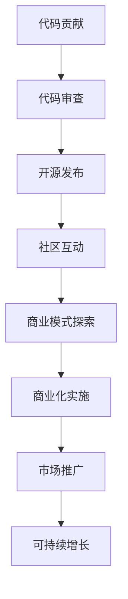

                 

关键词：代码贡献、开源、商业模式、项目管理、市场推广、可持续发展、技术创新。

> 摘要：本文探讨了从代码贡献到开源商业化的全流程，分析开源项目的核心驱动因素、商业模式、项目管理策略以及市场推广技巧。通过剖析成功案例，总结了开源项目在商业化过程中面临的挑战和机遇，为开发者提供了宝贵的实践经验和指导。

## 1. 背景介绍

随着互联网技术的发展，开源软件已经成为现代软件开发的重要组成部分。开源项目不仅为开发者提供了一个共享知识、协同创新的平台，也推动了技术的快速迭代和普及。然而，如何将开源项目转化为商业价值，实现可持续发展，一直是开发者和管理者关注的焦点。

本文旨在从多个角度探讨如何将代码贡献与开源商业化相结合，为开发者提供一套完整的策略和方法。文章将首先介绍开源项目的核心驱动因素，然后分析开源商业模式的多种类型，探讨项目管理的最佳实践，并分享市场推广的技巧。最后，我们将通过成功案例总结开源项目在商业化过程中面临的挑战和机遇，为开发者提供实用的建议。

## 2. 核心概念与联系

### 2.1 开源项目驱动力

开源项目的驱动力可以分为以下几个方面：

- **技术贡献**：开发者出于对技术的热爱和追求，愿意贡献自己的代码和解决方案。
- **社交互动**：开源项目提供了开发者交流、学习和合作的机会，增强了社区的凝聚力。
- **个人成长**：参与开源项目有助于开发者提升技能，建立个人品牌。
- **商业机会**：部分开源项目可以通过商业化实现可持续的发展，带来经济收益。

### 2.2 开源商业模式

开源商业模式主要包括以下几种类型：

- **捐赠模式**：通过用户捐赠来获取资金支持。
- **SaaS 模式**：提供基于开源软件的云服务，通过订阅费用盈利。
- **专业服务**：为开源项目提供定制化开发、支持和培训服务。
- **商业许可**：对开源项目的部分功能进行收费授权。

### 2.3 项目管理与市场推广

项目管理与市场推广是开源项目成功的关键因素。项目管理涉及团队组织、进度控制、风险管理等方面；市场推广则包括品牌建设、用户社区维护、营销活动策划等。

### 2.4 Mermaid 流程图

下面是一个简化的开源项目流程图，展示了从代码贡献到开源商业化的各个步骤：



## 3. 核心算法原理 & 具体操作步骤

### 3.1 算法原理概述

开源项目的成功离不开良好的项目管理与市场推广。以下是一个基于项目管理与市场推广的核心算法原理概述：

- **代码质量评估**：通过静态代码分析和自动化测试来评估代码质量，确保项目的基本健康。
- **社区活跃度监测**：通过活跃度指标监测社区互动情况，判断项目是否受到用户的关注和支持。
- **商业模式分析**：根据项目特点和市场需求，选择合适的商业模式。
- **市场策略制定**：结合市场调研和竞争分析，制定有效的市场推广策略。
- **资源优化配置**：根据项目需求和资源状况，合理分配人力、资金和时间等资源。

### 3.2 算法步骤详解

下面是具体的操作步骤：

1. **代码贡献与审查**：开发者向项目提交代码，经过审查和合并，确保代码质量。
2. **开源发布**：在合适的时机将项目开源，选择合适的平台和方式。
3. **社区互动**：维护一个活跃的社区，鼓励开发者参与讨论和贡献。
4. **商业模式探索**：分析项目特点和市场需求，选择合适的商业模式。
5. **商业化实施**：根据商业模式，制定详细的商业化计划，逐步实施。
6. **市场推广**：进行市场调研，制定并执行市场推广策略。
7. **可持续增长**：通过不断优化和调整，实现项目的可持续发展。

### 3.3 算法优缺点

**优点**：

- **快速迭代**：开源项目通常可以快速迭代，响应市场需求。
- **社区协作**：开源项目鼓励开发者之间的协作，提高了项目的整体质量。
- **透明度**：开源项目的代码和过程都是公开的，增加了项目的信任度。

**缺点**：

- **管理复杂**：开源项目需要协调多方面的利益，管理复杂。
- **商业化难度**：将开源项目商业化需要找到合适的商业模式，具有一定的难度。

### 3.4 算法应用领域

开源项目的核心算法原理和操作步骤在多个领域都有广泛的应用，包括但不限于：

- **软件开发**：开源项目提供了丰富的工具和框架，促进了软件开发效率。
- **人工智能**：开源项目为人工智能的研究和应用提供了大量的数据集和算法。
- **云计算**：开源项目如Kubernetes等在云计算领域发挥了重要作用。
- **物联网**：开源项目为物联网提供了底层的技术支持和工具。

## 4. 数学模型和公式 & 详细讲解 & 举例说明

### 4.1 数学模型构建

在开源项目中，数学模型广泛应用于算法设计和性能评估。以下是一个简单的数学模型构建示例：

- **需求分析**：根据项目需求和用户反馈，确定关键性能指标。
- **指标建模**：使用适当的数学模型，如回归分析、时间序列分析等，建立指标预测模型。
- **模型优化**：通过交叉验证和模型调整，优化模型参数。

### 4.2 公式推导过程

假设我们使用线性回归模型来预测开源项目的活跃度，公式推导如下：

- **目标函数**：最小化预测值与实际值之间的误差平方和。
- **损失函数**：选择适当的损失函数，如均方误差（MSE）。
- **梯度下降**：使用梯度下降法来优化模型参数。

### 4.3 案例分析与讲解

以下是一个具体的案例，展示了如何使用数学模型来预测开源项目的活跃度：

- **数据收集**：收集开源项目的活跃度数据，包括提交次数、问题数量等。
- **数据预处理**：对数据进行清洗和标准化处理。
- **模型训练**：使用线性回归模型训练数据集。
- **模型评估**：通过交叉验证和测试集评估模型性能。
- **预测应用**：使用模型预测未来一段时间的活跃度，为项目决策提供依据。

## 5. 项目实践：代码实例和详细解释说明

### 5.1 开发环境搭建

以下是一个简单的示例，展示了如何在本地搭建一个开源项目的开发环境：

```bash
# 安装必要的依赖
npm install
# 编译项目代码
npm run build
# 启动开发服务器
npm start
```

### 5.2 源代码详细实现

以下是一个简单的示例，展示了如何实现一个简单的HTTP服务器：

```javascript
const http = require('http');

const server = http.createServer((req, res) => {
  res.writeHead(200, {'Content-Type': 'text/plain'});
  res.end('Hello, world!');
});

server.listen(3000, () => {
  console.log('Server running at http://localhost:3000/');
});
```

### 5.3 代码解读与分析

- **http模块**：Node.js内置的HTTP模块，用于创建服务器和客户端。
- **createServer方法**：创建一个HTTP服务器实例，接收请求并返回响应。
- **请求和响应处理**：服务器接收请求，根据请求类型返回相应的响应内容。

### 5.4 运行结果展示

当在浏览器中访问 `http://localhost:3000/` 时，会显示 "Hello, world!" 消息。

## 6. 实际应用场景

### 6.1 开源项目的商业应用

开源项目可以在多个领域实现商业应用，例如：

- **企业解决方案**：为特定行业提供定制化的开源解决方案，通过专业服务实现盈利。
- **技术培训与咨询服务**：为开发者提供培训和技术支持，通过知识付费实现盈利。
- **云服务**：提供基于开源软件的云服务，通过订阅费用实现盈利。

### 6.2 未来应用展望

随着开源生态的不断发展，开源项目的商业应用前景将更加广阔。未来，开源项目将在以下几个方面得到进一步的发展：

- **生态建设**：建立更加完善的开源生态系统，促进技术创新和共享。
- **商业模式创新**：探索更多创新的商业模式，实现开源项目的商业化。
- **开源与商业的融合**：通过开源项目吸引开发者，构建强大的社区，进而实现商业成功。

## 7. 工具和资源推荐

### 7.1 学习资源推荐

- **《软件工程：实践者的研究方法》**：介绍软件工程的基本理论和实践方法。
- **《开源项目指南》**：详细介绍如何参与和管理开源项目。
- **《黑客与画家》**：关于技术、创业和创新的经典著作。

### 7.2 开发工具推荐

- **Git**：版本控制系统，用于代码管理和协作。
- **GitHub**：全球最大的开源代码托管平台。
- **Jenkins**：自动化构建工具，用于持续集成和持续部署。

### 7.3 相关论文推荐

- **"The Cathedral and the Bazaar"**：关于开源项目与传统软件开发的经典论文。
- **"Open Source Model for Software Development"**：介绍开源商业模式的研究论文。
- **"The Business Value of Open Source Software"**：分析开源软件商业价值的研究论文。

## 8. 总结：未来发展趋势与挑战

### 8.1 研究成果总结

本文通过多个角度探讨了从代码贡献到开源商业化的全流程，总结了开源项目的核心驱动力、商业模式、项目管理策略和市场推广技巧。同时，通过算法原理、数学模型和项目实践的详细分析，为开发者提供了实用的指导。

### 8.2 未来发展趋势

- **开源与商业的深度融合**：开源项目将在商业模式创新和技术创新方面发挥更大的作用。
- **社区驱动的研发模式**：开发者社区将成为技术创新的重要驱动力。
- **可持续发展**：开源项目将通过多样化的商业模式实现可持续发展。

### 8.3 面临的挑战

- **项目管理复杂度**：开源项目需要协调多方面的利益，管理复杂度较高。
- **商业化路径不清晰**：部分开源项目在商业化过程中面临路径不清晰的问题。
- **知识产权保护**：开源项目需要关注知识产权保护，避免侵权纠纷。

### 8.4 研究展望

未来，开源项目的商业化研究将继续深入，特别是在商业模式创新、项目管理优化和市场推广策略等方面。同时，随着开源生态的不断成熟，开源项目将在更多领域发挥重要作用，为技术创新和产业发展贡献力量。

## 9. 附录：常见问题与解答

### 9.1 开源项目如何选择合适的商业模式？

- **分析项目特点**：根据项目的功能和市场需求，选择合适的商业模式。
- **了解竞争对手**：研究竞争对手的商业模式，找到差异化的机会。
- **咨询专家意见**：寻求专业人士的建议，了解不同商业模式的优缺点。

### 9.2 开源项目如何进行有效的市场推广？

- **建立品牌形象**：通过宣传和推广，树立项目的品牌形象。
- **维护社区互动**：积极参与社区讨论，建立良好的社区关系。
- **策划营销活动**：制定并执行有效的营销策略，提高项目的知名度。

### 9.3 开源项目如何应对商业化过程中的风险？

- **知识产权保护**：确保项目的知识产权得到有效保护，避免侵权纠纷。
- **风险评估与控制**：对商业化过程中的风险进行评估和监控，制定相应的应对策略。
- **灵活调整策略**：根据市场反馈和项目进展，灵活调整商业模式和推广策略。

---

**作者：禅与计算机程序设计艺术 / Zen and the Art of Computer Programming**

