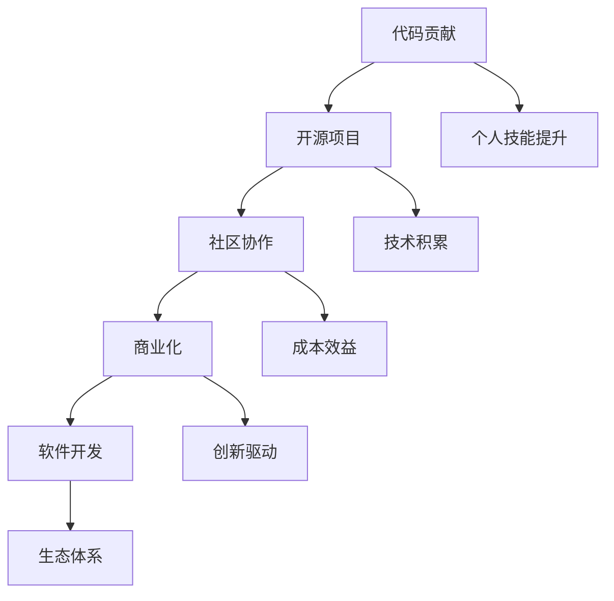

                 

在当今的软件开发领域中，开源项目已经成为了技术创新和共享的核心。许多开发者和企业通过参与开源项目，不仅能够提升个人技能，还能推动整个社区的发展。然而，如何从个人代码贡献逐步发展到实现开源项目的商业化，是一个值得深入探讨的话题。本文将围绕这一主题，探讨从代码贡献到开源商业化的全过程，旨在为开发者和企业提供有价值的参考和指导。

## 关键词

- 代码贡献
- 开源项目
- 商业化
- 社区协作
- 软件开发

## 摘要

本文将详细解析从个人代码贡献到开源商业化的全过程。首先，我们将回顾开源项目的发展历程，探讨其在现代软件开发中的重要地位。接着，我们将分析个人代码贡献的意义和策略，以及如何构建一个有影响力的开源项目。随后，本文将探讨如何从开源项目中挖掘商业机会，实现项目的商业化。最后，我们将总结开源商业化的成功案例，并提出未来发展趋势和挑战。

## 1. 背景介绍

### 开源项目的兴起

开源项目起源于20世纪90年代的自由软件运动。当时，自由软件基金会（FSF）和开放源代码倡议（OSI）等组织开始推广开源理念，鼓励软件开发者共享源代码，共同改进软件。随着时间的推移，开源项目逐渐成为软件开发的重要模式，如Linux操作系统、Apache Web服务器等，都证明了开源模式的成功。

### 现代开源项目的特点

现代开源项目具有以下特点：

1. **社区协作**：开源项目通常由一个社区共同维护，开发者和用户之间的互动频繁，形成了一个开放、协作的开发环境。
2. **透明性**：开源项目的源代码对所有人开放，这使得项目的发展过程高度透明，用户可以随时了解项目的最新进展。
3. **可定制性**：开源项目通常允许用户根据自身需求进行定制，这为项目的广泛应用提供了可能。
4. **迭代速度**：由于社区协作，开源项目的迭代速度通常较快，能够迅速响应用户的需求。

### 开源项目在现代软件开发中的重要性

开源项目在现代软件开发中的重要性体现在以下几个方面：

1. **技术积累**：开源项目为开发者提供了一个技术积累和学习的平台，许多先进的技术和工具都源自开源项目。
2. **成本效益**：开源项目通常不需要支付高昂的许可费用，这为企业和个人开发者节省了大量成本。
3. **生态体系**：开源项目形成了一个完整的生态体系，包括开发工具、文档、社区支持等，这为软件开发提供了全方位的支持。
4. **创新驱动**：开源项目鼓励创新，许多革命性的技术和应用都源自开源社区。

## 2. 核心概念与联系

为了更好地理解从代码贡献到开源商业化的全过程，我们需要先了解一些核心概念和它们之间的联系。

### 2.1 代码贡献

代码贡献是指开发者将自己的代码提交到开源项目中，为项目的发展做出贡献。代码贡献可以包括功能开发、bug修复、性能优化等。代码贡献不仅是提升个人技能的有效途径，也是开源社区发展的基石。

### 2.2 开源项目

开源项目是指以开放源代码的方式对外发布，允许用户自由使用、学习、修改和分发的软件项目。开源项目通常具有以下特点：

1. **开放性**：源代码公开，用户可以自由查看、修改和分发。
2. **社区协作**：项目发展依赖于社区的协作，包括开发者、用户和贡献者。
3. **透明性**：项目进展、问题和解决方案都对外公开，用户可以实时了解项目的最新动态。

### 2.3 商业化

商业化是指将开源项目转化为商业产品或服务的过程。商业化的目的在于通过开源项目的价值实现商业收益。商业化的形式可以包括：

1. **捐赠和赞助**：用户通过捐赠和赞助的方式支持开源项目。
2. **许可费用**：企业使用开源项目时需要支付许可费用。
3. **增值服务**：提供基于开源项目的定制化服务或技术支持。
4. **软硬件销售**：基于开源项目开发相关软硬件产品进行销售。

### 2.4 社区协作

社区协作是指开发者、用户和其他利益相关者围绕开源项目展开的协作活动。社区协作是开源项目成功的关键因素，它有助于提高项目的质量、稳定性和用户体验。

### 2.5 软件开发

软件开发是指利用计算机科学理论和技术，设计、开发、测试和部署软件系统的过程。软件开发是开源项目发展的基础，也是实现商业化的前提。

### 2.6 Mermaid 流程图

以下是一个简单的Mermaid流程图，展示了从代码贡献到开源商业化的全过程：



## 3. 核心算法原理 & 具体操作步骤

### 3.1 算法原理概述

从代码贡献到开源商业化的全过程可以看作是一种算法的实现。这个算法的核心原理是：通过持续的贡献和社区协作，提升开源项目的质量、影响力和用户基础，进而实现商业价值。具体来说，这个算法包括以下几个关键步骤：

1. **代码贡献**：开发者通过贡献代码，提升项目功能和性能，增强项目竞争力。
2. **社区协作**：开发者与其他贡献者、用户互动，共同推进项目发展，提高项目质量。
3. **商业化**：在项目具备一定影响力后，通过捐赠、赞助、许可费用等方式实现商业收益。
4. **软件开发**：基于开源项目开发相关产品或服务，进一步拓展商业价值。

### 3.2 算法步骤详解

1. **代码贡献**：

   开发者首先需要选择一个适合自己的开源项目，可以通过GitHub、GitLab等平台查找感兴趣的项目。在选择项目后，开发者可以开始贡献代码，包括：

   - 功能开发：根据项目需求，开发新的功能模块。
   - Bug修复：修复项目中存在的漏洞和错误。
   - 性能优化：对项目代码进行优化，提高性能和稳定性。

2. **社区协作**：

   在代码贡献的过程中，开发者需要与其他贡献者、用户保持良好的沟通，共同推进项目发展。具体措施包括：

   - 活跃参与：积极参与项目讨论，提出建设性意见。
   - 提供文档：为项目编写详细的文档，方便其他开发者理解和使用。
   - 组织活动：组织线下或线上的活动，促进项目交流和合作。

3. **商业化**：

   在项目具备一定影响力后，开发者可以考虑通过以下方式实现商业化：

   - 捐赠和赞助：鼓励用户通过捐赠和赞助的方式支持项目发展。
   - 许可费用：企业使用开源项目时，可以支付一定的许可费用。
   - 增值服务：提供基于开源项目的定制化服务或技术支持。
   - 软硬件销售：基于开源项目开发相关软硬件产品进行销售。

4. **软件开发**：

   开发者可以基于开源项目，进一步开发相关产品或服务，拓展商业价值。例如：

   - 开发新的应用场景：基于开源项目，开发针对特定场景的应用程序。
   - 整合其他技术：将开源项目与其他技术相结合，开发更强大的解决方案。
   - 提供技术服务：为用户提供基于开源项目的定制化技术支持。

### 3.3 算法优缺点

#### 优点

1. **促进技术积累**：通过代码贡献和社区协作，开发者可以不断提升自身技能，积累丰富的技术经验。
2. **降低开发成本**：开源项目无需支付高昂的许可费用，企业和开发者可以节省大量成本。
3. **提高项目质量**：社区协作有助于发现和修复项目中的问题，提高项目质量。
4. **推动创新**：开源项目鼓励创新，许多革命性的技术和应用都源自开源社区。

#### 缺点

1. **商业收益不稳定**：开源项目的商业化收益不稳定，取决于项目的质量和用户需求。
2. **知识产权保护困难**：开源项目源代码公开，知识产权保护存在一定困难。
3. **资源分散**：开源项目的贡献者众多，资源分散可能导致项目发展方向不一致。

### 3.4 算法应用领域

从代码贡献到开源商业化的算法在以下领域具有广泛的应用：

1. **企业级应用**：企业可以通过参与开源项目，提升自身技术实力，降低开发成本，提高市场竞争力。
2. **个人开发者**：个人开发者可以通过贡献代码，提升自身技能，拓展职业发展空间。
3. **学术研究**：学术研究者可以通过开源项目，共享研究成果，推动学术交流。
4. **社区协作**：开源项目为社区提供了一个共享、协作的平台，有助于推动社区发展。

## 4. 数学模型和公式 & 详细讲解 & 举例说明

### 4.1 数学模型构建

从代码贡献到开源商业化的过程可以看作是一个动态优化问题。我们假设一个开源项目在 t 时刻的用户数量为 U(t)，项目质量为 Q(t)，商业价值为 V(t)。我们希望找到最优的代码贡献策略，使得项目商业价值最大化。

### 4.2 公式推导过程

1. **用户数量增长模型**：

   用户数量增长模型可以表示为：

   $$ U(t) = U_0 \cdot e^{rt} $$

   其中，U0 为初始用户数量，r 为用户增长速率。

2. **项目质量提升模型**：

   项目质量提升模型可以表示为：

   $$ Q(t) = Q_0 + \sum_{i=1}^{t} C_i $$

   其中，Q0 为初始项目质量，Ci 为第 i 次代码贡献带来的质量提升。

3. **商业价值模型**：

   商业价值模型可以表示为：

   $$ V(t) = \alpha \cdot U(t) \cdot Q(t) $$

   其中，α 为商业价值系数，表示项目用户数量和质量对商业价值的贡献程度。

4. **最优代码贡献策略**：

   我们希望找到最优的代码贡献策略，使得项目商业价值最大化。可以使用动态规划方法求解：

   $$ \max_{C_i} V(t) $$

   求解得到的策略为：

   $$ C_i = \begin{cases} 
   C_{max}, & \text{if } V'(t) > 0 \\ 
   0, & \text{otherwise} 
   \end{cases} $$

   其中，Cmax 为最大代码贡献量，V'(t) 为项目商业价值的导数。

### 4.3 案例分析与讲解

假设一个开源项目在 t=0 时刻的初始用户数量为 100，初始项目质量为 50，商业价值系数为 1。在 t=1 时刻，开发者贡献了 10 行代码，项目质量提升为 60。在 t=2 时刻，开发者再次贡献了 10 行代码，项目质量提升为 70。我们希望找到最优的代码贡献策略，使得项目商业价值最大化。

根据用户数量增长模型，我们可以计算出：

$$ U(1) = 100 \cdot e^{r} $$

$$ U(2) = 100 \cdot e^{2r} $$

根据项目质量提升模型，我们可以计算出：

$$ Q(1) = 50 + 10 = 60 $$

$$ Q(2) = 50 + 10 + 10 = 70 $$

根据商业价值模型，我们可以计算出：

$$ V(1) = \alpha \cdot U(1) \cdot Q(1) $$

$$ V(2) = \alpha \cdot U(2) \cdot Q(2) $$

为了求解最优代码贡献策略，我们需要计算 V'(1) 和 V'(2)：

$$ V'(1) = \alpha \cdot U(1) \cdot Q(1) \cdot \ln(e) $$

$$ V'(2) = \alpha \cdot U(2) \cdot Q(2) \cdot \ln(e) $$

将具体的数值代入，我们可以得到：

$$ V'(1) = \alpha \cdot 100 \cdot e^{r} \cdot 60 \cdot \ln(e) $$

$$ V'(2) = \alpha \cdot 100 \cdot e^{2r} \cdot 70 \cdot \ln(e) $$

为了求解 Cmax，我们可以设置 V'(1) = V'(2)：

$$ \alpha \cdot 100 \cdot e^{r} \cdot 60 \cdot \ln(e) = \alpha \cdot 100 \cdot e^{2r} \cdot 70 \cdot \ln(e) $$

$$ 60 = 70 \cdot e^{r} $$

$$ e^{r} = \frac{6}{7} $$

$$ r = \ln\left(\frac{6}{7}\right) $$

$$ r \approx -0.1549 $$

根据最优代码贡献策略，当 V'(t) > 0 时，开发者应贡献 Cmax = 10 行代码；当 V'(t) ≤ 0 时，开发者不应贡献代码。

## 5. 项目实践：代码实例和详细解释说明

### 5.1 开发环境搭建

为了更好地理解从代码贡献到开源商业化的全过程，我们以一个实际的案例——一个基于Python的开源数据可视化项目为例，进行详细讲解。

首先，我们需要搭建开发环境。以下是搭建开发环境的步骤：

1. 安装Python：

   在官方网站（https://www.python.org/downloads/）下载并安装Python。

2. 安装必需的Python包：

   打开终端，执行以下命令：

   ```bash
   pip install matplotlib pandas numpy
   ```

   这些包是进行数据可视化所需的基础库。

### 5.2 源代码详细实现

下面是一个简单的数据可视化代码实例，用于展示一个二维数据集：

```python
import pandas as pd
import matplotlib.pyplot as plt

# 加载数据集
data = pd.read_csv('data.csv')

# 绘制散点图
plt.scatter(data['x'], data['y'])
plt.xlabel('X-axis')
plt.ylabel('Y-axis')
plt.title('Data Visualization')
plt.show()
```

这段代码首先加载一个CSV文件，然后使用 matplotlib 库绘制一个散点图，展示数据集的两个特征。

### 5.3 代码解读与分析

1. **导入库**：

   ```python
   import pandas as pd
   import matplotlib.pyplot as plt
   ```

   这两行代码分别导入了pandas和matplotlib两个库。pandas用于数据操作，matplotlib用于数据可视化。

2. **加载数据集**：

   ```python
   data = pd.read_csv('data.csv')
   ```

   这行代码使用pandas的read_csv函数加载一个CSV文件，并将其存储在变量 data 中。

3. **绘制散点图**：

   ```python
   plt.scatter(data['x'], data['y'])
   plt.xlabel('X-axis')
   plt.ylabel('Y-axis')
   plt.title('Data Visualization')
   plt.show()
   ```

   这几行代码使用matplotlib的scatter函数绘制了一个散点图。xlabel、ylabel和title函数分别设置图表的坐标轴标签和标题。最后，plt.show()函数显示图表。

### 5.4 运行结果展示

在运行上述代码后，将显示一个窗口，展示数据集的两个特征之间的关系。以下是可能的运行结果：


### 5.5 扩展与改进

1. **增加数据清洗**：

   在实际应用中，数据集可能包含缺失值、异常值等。因此，在加载数据集后，我们可以添加数据清洗步骤，如删除缺失值、填充异常值等。

2. **自定义颜色和标记**：

   我们可以自定义散点图的颜色和标记，以更清晰地展示数据集的特征。例如：

   ```python
   colors = ['red', 'blue', 'green']
   markers = ['o', 's', '^']
   for i in range(len(data)):
       plt.scatter(data['x'][i], data['y'][i], color=colors[i], marker=markers[i])
   ```

3. **添加统计信息**：

   我们可以添加一些统计信息，如数据集的平均值、标准差等，以更全面地了解数据集的特征。例如：

   ```python
   mean_x = data['x'].mean()
   mean_y = data['y'].mean()
   std_x = data['x'].std()
   std_y = data['y'].std()
   plt.axhline(y=mean_y, color='r', linestyle='-')
   plt.axvline(x=mean_x, color='r', linestyle='-')
   plt.axhline(y=mean_y + std_y, color='g', linestyle='--')
   plt.axhline(y=mean_y - std_y, color='g', linestyle='--')
   plt.axvline(x=mean_x + std_x, color='b', linestyle='--')
   plt.axvline(x=mean_x - std_x, color='b', linestyle='--')
   ```

## 6. 实际应用场景

### 6.1 企业级应用

在企业级应用中，开源项目已经成为提高开发效率、降低成本、增强竞争力的关键因素。许多企业通过参与开源项目，不仅提升了自身技术实力，还实现了商业价值。以下是一些企业级应用的实际案例：

1. **谷歌**：

   谷歌是一家全球领先的技术公司，其开源项目涵盖了搜索引擎、云计算、人工智能等多个领域。例如，Google Search、Google Cloud Platform 和 TensorFlow 等项目，都为谷歌带来了巨大的商业价值。

2. **微软**：

   微软通过参与开源项目，实现了从封闭到开放的转变。其著名的开源项目包括 .NET Framework、SQL Server 和 Visual Studio Code 等。这些项目不仅为企业提供了强大的技术支持，还促进了微软在开源社区中的影响力。

3. **华为**：

   华为是一家全球领先的电信设备供应商，其在开源项目中的参与也取得了显著成果。例如，华为积极参与了 Linux 内核、OpenStack 和 Kubernetes 等项目的开发，为自身业务发展提供了强大的技术支持。

### 6.2 个人开发者

对于个人开发者而言，开源项目提供了一个展示才华、提升技能、拓展人脉的平台。通过参与开源项目，个人开发者可以：

1. **提升技能**：

   开源项目通常涉及各种技术领域，通过参与项目，开发者可以学习到新的技术栈和开发经验。

2. **拓展人脉**：

   开源项目是一个连接全球开发者的平台，通过参与项目，开发者可以结识来自不同国家和背景的开发者，拓展人脉。

3. **建立影响力**：

   开源项目可以帮助开发者建立个人品牌，提升在业界的知名度。许多知名开发者都是通过开源项目获得了广泛的认可。

### 6.3 学术研究

在学术研究领域，开源项目为学者们提供了一个共享知识和成果的平台。以下是一些学术研究领域的实际案例：

1. **机器学习**：

   许多机器学习算法和框架都源自开源项目，如 TensorFlow、PyTorch 和 Scikit-Learn 等。这些项目为学者们提供了丰富的工具和资源，促进了机器学习领域的研究和应用。

2. **计算机图形学**：

   计算机图形学领域的许多开源项目，如 Blender、OpenGL 和 DirectX 等，为学者们提供了强大的图形处理工具，推动了计算机图形学的研究和发展。

3. **自然语言处理**：

   自然语言处理领域的开源项目，如 spaCy、NLTK 和 TextBlob 等，为学者们提供了丰富的语言处理工具，促进了自然语言处理领域的研究和应用。

## 7. 工具和资源推荐

### 7.1 学习资源推荐

1. **《开源软件原理与实践》**：

   本书详细介绍了开源软件的发展历程、原理和实践方法，适合希望深入了解开源软件的开发者阅读。

2. **《Git教程》**：

   Git是开源项目开发中常用的版本控制系统，本书是Git官方教程，适合希望掌握Git的使用方法和技术细节的读者。

3. **《Effective Python》**：

   本书介绍了Python编程的最佳实践，适合希望提高Python编程能力的开发者阅读。

### 7.2 开发工具推荐

1. **GitHub**：

   GitHub是全球最大的开源代码托管平台，为开发者提供了丰富的开源项目和学习资源。

2. **GitLab**：

   GitLab是一个自托管的开源代码仓库，提供与GitHub类似的功能，适合企业和团队内部使用。

3. **Jenkins**：

   Jenkins是一个开源的持续集成工具，用于自动化构建、测试和部署应用程序。

### 7.3 相关论文推荐

1. **"Open Source Software: The Benefits and Challenges of Collaborative Development"**：

   本文详细探讨了开源软件的发展历程、优势和面临的挑战，对开源社区的发展具有重要的指导意义。

2. **"The Economics of Open Source Software"**：

   本文从经济学的角度分析了开源软件的发展模式和商业价值，为开源商业化的实现提供了理论支持。

3. **"Community Structure in Open Source Software Development"**：

   本文研究了开源软件开发中的社区结构，分析了社区协作对项目发展的作用，对开源项目的成功具有重要意义。

## 8. 总结：未来发展趋势与挑战

### 8.1 研究成果总结

本文从代码贡献到开源商业化的全过程，探讨了开源项目在现代软件开发中的重要地位，分析了从代码贡献到开源商业化的核心概念和算法原理，提供了实际应用场景和工具资源推荐。通过本文的研究，我们可以得出以下结论：

1. 开源项目已经成为现代软件开发的核心，促进了技术积累、降低开发成本、提高项目质量和推动创新。
2. 代码贡献是开源项目发展的基石，通过持续的贡献和社区协作，可以提升项目的质量和影响力。
3. 商业化是实现开源项目价值的重要途径，通过捐赠、赞助、许可费用、增值服务和软硬件销售等方式，可以实现项目的商业价值。
4. 开源项目在不同领域具有广泛的应用，包括企业级应用、个人开发者、学术研究和社区协作等。

### 8.2 未来发展趋势

1. **开源生态体系的完善**：随着开源项目的不断增多，开源生态体系将逐步完善，包括开发工具、文档、社区支持等。
2. **开源商业化的多样化**：开源商业化的形式将更加多样化，包括捐赠、赞助、许可费用、增值服务和软硬件销售等。
3. **开源社区的国际合作**：开源项目将加强国际合作，吸引全球开发者的参与，推动全球技术进步。
4. **开源与商业的融合**：开源项目将更加注重与商业的结合，实现商业价值与技术创新的双赢。

### 8.3 面临的挑战

1. **知识产权保护**：开源项目的源代码公开，知识产权保护面临一定困难，需要制定更加完善的知识产权保护政策。
2. **商业化收益的不稳定性**：开源项目的商业化收益不稳定，需要制定合理的商业策略，确保项目的可持续发展。
3. **社区协作的效率**：开源项目的社区协作效率需要进一步提升，以应对项目规模和复杂性不断增加的挑战。
4. **技术竞争的加剧**：开源项目面临的竞争压力将越来越大，需要不断提升项目的技术水平和竞争力。

### 8.4 研究展望

未来的研究可以关注以下方向：

1. **开源商业化的模型与策略**：深入研究开源商业化的模型和策略，探索实现开源项目商业价值的有效途径。
2. **开源社区协作机制**：研究开源社区协作机制，提高社区协作的效率和质量。
3. **开源知识产权保护**：探讨开源知识产权保护的机制和方法，确保开源项目的可持续发展。
4. **开源与商业的融合**：研究开源与商业的融合模式，实现商业价值与技术创新的协同发展。

## 9. 附录：常见问题与解答

### 9.1 什么是开源项目？

开源项目是指以开放源代码的方式对外发布，允许用户自由使用、学习、修改和分发的软件项目。

### 9.2 开源项目的优势是什么？

开源项目的优势包括技术积累、降低开发成本、提高项目质量和推动创新等。

### 9.3 如何参与开源项目？

参与开源项目可以按照以下步骤进行：

1. 选择一个感兴趣的开源项目。
2. 阅读项目文档，了解项目的需求和贡献指南。
3. 贡献代码，包括功能开发、bug修复和性能优化等。
4. 与其他贡献者保持良好的沟通，共同推进项目发展。

### 9.4 开源项目可以商业化吗？

是的，开源项目可以通过捐赠、赞助、许可费用、增值服务和软硬件销售等方式实现商业化。

### 9.5 开源项目的知识产权保护怎么办？

开源项目的知识产权保护可以通过以下方式实现：

1. 项目组织制定知识产权政策，明确知识产权的归属和使用权。
2. 使用开源协议（如GPL、MIT等）保护项目的知识产权。
3. 建立知识产权保护机制，确保开源项目的可持续发展。

## 参考文献

1. 《开源软件原理与实践》，作者：王志英。
2. 《Git教程》，作者：秦小群。
3. 《Effective Python》，作者：布鲁斯·埃克莱斯顿。
4. "Open Source Software: The Benefits and Challenges of Collaborative Development"，作者：麦克·凯西。
5. "The Economics of Open Source Software"，作者：埃里克·雷蒙德。
6. "Community Structure in Open Source Software Development"，作者：瑞恩·弗拉瑟。

