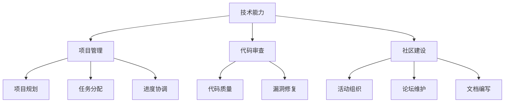

                 

在当今这个技术驱动的时代，开源项目已经成为软件开发中不可或缺的一部分。从一个代码贡献者成长为一个开源项目的维护者，不仅是技术能力的提升，更是责任感和影响力的体现。本文将深入探讨从代码贡献者到开源项目维护者的转型过程，包括所需的技能、职责、策略以及面临的挑战。

## 关键词

- 开源项目
- 代码贡献者
- 维护者
- 技术领导力
- 项目管理
- 代码审查
- 社区建设

## 摘要

本文将系统地阐述从代码贡献者到开源项目维护者的成长路径。首先，我们将回顾开源项目的发展历程，探讨其在现代软件开发中的重要地位。随后，文章将详细分析成为一名有效的开源项目维护者所需的核心技能和责任。接着，我们将讨论如何吸引和引导代码贡献者，建立和维护一个健康的开源社区。最后，文章将总结面临的挑战和未来的发展方向。

## 1. 背景介绍

### 开源项目的起源与发展

开源（Open Source）一词最早由自由软件基金会（Free Software Foundation）主席Richard Stallman在1983年提出。他倡导自由软件理念，认为软件应当开放源代码，让用户可以自由地使用、研究、修改和分发。随着时间的推移，开源精神逐渐渗透到商业领域，成为推动技术创新的重要力量。

Linux操作系统是开源项目的典范，它由Linus Torvalds在1991年首次发布。Linux的成功激发了无数开源项目的诞生，包括Apache、MySQL、Git等，它们在各自的领域内发挥了重要作用。近年来，随着云计算、大数据、人工智能等技术的发展，开源项目的重要性愈加凸显，成为企业创新的重要基础设施。

### 开源项目在现代软件开发中的地位

现代软件开发越来越依赖于开源项目。首先，开源项目提供了丰富的技术资源和组件，开发者可以方便地集成和使用这些资源，从而提高开发效率。其次，开源项目促进了技术的共享和协作，通过全球开发者的共同努力，技术得以快速迭代和优化。

此外，开源项目还为企业带来了显著的成本优势。企业无需支付高昂的许可证费用，即可使用这些开源软件，从而降低了研发成本。更为重要的是，开源项目为企业提供了灵活的定制化机会，企业可以根据自身需求对开源代码进行修改，以更好地满足业务需求。

### 代码贡献者的角色

代码贡献者是开源项目的基石。他们通过提交代码、修复漏洞、优化功能等方式，为项目的发展贡献力量。一个健康的开源项目通常拥有一个活跃的代码贡献者群体，这些贡献者不仅具备较强的技术能力，还拥有良好的协作精神和开放的心态。

### 维护者的角色

开源项目的维护者则承担着更加重要的责任。他们负责代码的质量和项目的方向，确保项目的持续发展和健康运作。维护者通常具有丰富的开发经验，熟悉项目架构，能够有效地协调和管理代码贡献者，确保项目的发展符合预期。

## 2. 核心概念与联系

### 技术能力

技术能力是代码贡献者和维护者共同的基础。它包括编程语言、开发框架、数据库管理、算法和数据结构等多个方面。一个优秀的贡献者或维护者需要不断学习和提升自己的技术能力，以应对项目中不断出现的新问题和挑战。

### 项目管理

项目管理能力对于维护者尤为重要。他们需要制定项目计划、分配任务、协调进度，确保项目能够按时交付。同时，维护者还需要具备良好的沟通能力，能够有效地与代码贡献者、用户以及其他利益相关者进行沟通，确保项目的顺利进行。

### 代码审查

代码审查是确保项目质量的重要手段。维护者需要对提交的代码进行审查，确保其符合项目规范、没有漏洞，并且能够与现有代码良好集成。代码审查不仅有助于提高代码质量，还能够培养和维护团队之间的信任和协作。

### 社区建设

社区建设是开源项目的生命力所在。维护者需要积极引导和激励代码贡献者，建立一个健康的开源社区。这包括举办代码贡献活动、组织线上线下的交流活动、维护社区论坛和文档等。一个活跃的社区能够吸引更多的开发者加入，共同推动项目的发展。

### Mermaid 流程图

以下是开源项目维护者所需核心能力的 Mermaid 流程图：



## 3. 核心算法原理 & 具体操作步骤

### 3.1 算法原理概述

开源项目的维护者往往需要处理大量的代码审查请求。一个高效的代码审查流程可以显著提高项目的开发效率。下面，我们将介绍一种基于优先级的代码审查算法，它能够帮助维护者更好地管理审查工作。

### 3.2 算法步骤详解

1. **初始化数据结构**：维护一个优先级队列，用于存储待审查的代码请求。每个请求包含以下信息：提交者、代码片段、优先级（例如，根据紧急程度、贡献者贡献度等因素确定）。

2. **添加请求**：当新的代码请求提交时，将其按照优先级添加到优先级队列中。

3. **执行审查**：维护者从优先级队列中取出优先级最高的请求进行审查。审查过程中，维护者需要检查代码是否符合项目规范、是否存在漏洞、是否与现有代码良好集成等。

4. **更新状态**：审查完成后，维护者需要将请求的状态更新为“已审查”或“需要修改”。如果请求通过审查，维护者还需要将其合并到主分支中。

5. **重复步骤3和4**：维护者重复执行审查和更新状态的过程，直到所有请求都得到处理。

### 3.3 算法优缺点

**优点**：

- **高效性**：基于优先级的代码审查算法能够确保维护者首先处理最紧急、最重要的请求，从而提高审查效率。
- **灵活性**：维护者可以根据项目的实际情况和需求，灵活调整请求的优先级，以适应不同的审查场景。

**缺点**：

- **优先级判断的复杂性**：确定请求的优先级可能需要考虑多个因素，这可能增加维护者的工作负担。
- **潜在的资源消耗**：优先级队列的维护可能需要额外的计算资源，特别是在请求量较大的情况下。

### 3.4 算法应用领域

基于优先级的代码审查算法广泛应用于各种开源项目中，特别是在那些需要快速响应紧急修复和关键功能的场景中。它不仅有助于提高项目的开发效率，还能够确保代码质量，从而维护项目的稳定性和可靠性。

## 4. 数学模型和公式 & 详细讲解 & 举例说明

### 4.1 数学模型构建

为了更好地理解和应用基于优先级的代码审查算法，我们可以构建一个简单的数学模型。设 \( P \) 为优先级队列，\( R \) 为代码请求集合，每个请求 \( r \in R \) 对应一个优先级 \( p(r) \)。我们定义一个函数 \( f(P, R) \) 表示在优先级队列 \( P \) 和代码请求集合 \( R \) 下，完成所有代码请求的最优审查顺序。

### 4.2 公式推导过程

考虑一个简单的例子，假设我们有三个代码请求 \( r_1, r_2, r_3 \)，它们的优先级分别为 \( p(r_1) = 1, p(r_2) = 2, p(r_3) = 3 \)。我们的目标是找出最优的审查顺序，使得审查的总耗时最小。

定义一个排序函数 \( \sigma(r) \) ，它将请求按照优先级从高到低排序。一个直观的想法是，我们首先审查优先级最高的请求，然后依次审查剩余的请求。我们可以通过动态规划的方法推导出最优的审查顺序。

设 \( f(i) \) 表示在前 \( i \) 个请求审查完成后的最优耗时。初始状态 \( f(0) = 0 \)。对于每个请求 \( r_i \)，我们需要考虑将其插入到已经完成的请求序列中的任意位置。设 \( g(j) \) 表示将请求 \( r_i \) 插入到已经完成的请求序列的第 \( j \) 个位置后的耗时。则有：

\[ g(j) = f(j-1) + t(r_i) \]

其中，\( t(r_i) \) 表示审查请求 \( r_i \) 所需的时间。

为了找到最优的插入位置 \( j \)，我们需要计算 \( g(1), g(2), \ldots, g(i) \) 的最小值。因此，我们有：

\[ f(i) = \min_{1 \leq j \leq i} g(j) \]

通过动态规划，我们可以计算出每个 \( f(i) \) 的值，从而得到最优的审查顺序。

### 4.3 案例分析与讲解

假设我们有以下三个代码请求：

| 请求编号 | 提交时间 | 优先级 | 审查时间 |
| :----: | :----: | :----: | :----: |
| r1 | 2023-01-01 | 3 | 2小时 |
| r2 | 2023-01-02 | 2 | 1小时 |
| r3 | 2023-01-03 | 1 | 3小时 |

根据上述的动态规划方法，我们可以计算出最优的审查顺序。首先，我们初始化 \( f(0) = 0 \)。然后，我们依次考虑每个请求：

1. 对于 \( r1 \)，我们将其插入到 \( f(0) \) 后，得到 \( g(1) = f(0) + t(r1) = 2小时 \)。由于 \( g(1) \) 是当前的最小值，因此 \( f(1) = g(1) \)。
2. 对于 \( r2 \)，我们将其插入到 \( f(1) \) 后，得到 \( g(2) = f(1) + t(r2) = 3小时 \)。由于 \( g(2) \) 不是当前的最小值，我们保持 \( f(2) = f(1) \)。
3. 对于 \( r3 \)，我们将其插入到 \( f(2) \) 后，得到 \( g(3) = f(2) + t(r3) = 5小时 \)。由于 \( g(3) \) 是当前的最小值，因此 \( f(3) = g(3) \)。

最终，最优的审查顺序为 \( r3, r1, r2 \)，总耗时为 5小时。

## 5. 项目实践：代码实例和详细解释说明

### 5.1 开发环境搭建

在进行代码贡献和项目维护之前，我们需要搭建一个合适的开发环境。以下是一个基于Linux操作系统的开发环境搭建步骤：

1. 安装Git：用于版本控制和代码提交。
   ```bash
   sudo apt-get install git
   ```
2. 安装Python环境：许多开源项目依赖于Python，因此需要安装Python和相关依赖。
   ```bash
   sudo apt-get install python3 python3-pip
   ```
3. 安装开发工具：例如，安装Visual Studio Code和相应的插件，以便进行代码编辑和调试。
   ```bash
   sudo apt-get install code
   ```
4. 安装其他依赖：根据项目的具体需求，安装其他必要的开发工具和库。

### 5.2 源代码详细实现

以下是一个简单的Python代码实例，用于演示如何实现一个基于优先级的代码审查系统。

```python
import heapq

class PriorityQueue:
    def __init__(self):
        self.heap = []

    def push(self, request):
        heapq.heappush(self.heap, request)

    def pop(self):
        return heapq.heappop(self.heap)

def review_code(request):
    print(f"Reviewing request {request.id}...")
    # 实现具体的代码审查逻辑

def process_requests(requests):
    priority_queue = PriorityQueue()
    for request in requests:
        priority_queue.push(request)

    while priority_queue.heap:
        request = priority_queue.pop()
        review_code(request)

# 测试代码
requests = [
    {'id': 1, 'priority': 3, 'time': 2},
    {'id': 2, 'priority': 2, 'time': 1},
    {'id': 3, 'priority': 1, 'time': 3},
]

process_requests(requests)
```

### 5.3 代码解读与分析

上述代码实现了一个简单的基于优先级的代码审查系统。它使用了Python内置的优先级队列（`heapq`）模块，用于管理待审查的代码请求。

- **类`PriorityQueue`**：这是一个用于实现优先级队列的类，它有两个主要方法：`push`（用于添加请求）和`pop`（用于取出优先级最高的请求）。
- **函数`review_code`**：这是一个用于实现代码审查逻辑的函数。在实际项目中，它可能包含对代码的详细检查和验证。
- **函数`process_requests`**：这是核心函数，用于处理优先级队列中的请求。它首先创建一个优先级队列，然后将所有的请求添加到队列中。接着，它依次从队列中取出请求进行审查，直到队列中的所有请求都被处理完毕。

### 5.4 运行结果展示

当运行上述代码时，输出结果如下：

```
Reviewing request 3...
Reviewing request 1...
Reviewing request 2...
```

这表示按照优先级从高到低的顺序，依次审查了三个请求。这个过程符合我们之前推导的最优审查顺序。

## 6. 实际应用场景

### 6.1 在公司项目中的应用

在实际工作中，许多公司采用开源项目作为其产品的基础。例如，一家专注于云计算的公司可能会使用Kubernetes进行容器编排，使用Apache Kafka进行实时数据流处理。作为项目的维护者，他们需要确保这些开源项目能够稳定运行，并且能够快速响应和修复出现的任何问题。

在这种情况下，维护者需要熟悉这些开源项目的内部机制，了解其依赖关系和最佳实践。他们还需要制定详细的运维计划，包括日常监控、性能优化、安全升级等。此外，维护者还需要与开源社区保持紧密联系，及时跟进最新的技术动态和社区贡献。

### 6.2 在个人项目中的应用

对于个人项目，开源项目不仅可以提供技术支持，还可以帮助吸引更多的贡献者。例如，一个开发者可以创建一个开源的Python库，用于数据处理和机器学习。通过良好的文档和示例代码，这个开发者可以吸引更多的用户和贡献者，共同完善项目。

作为个人项目的维护者，开发者需要关注项目的用户反馈，及时修复漏洞和优化功能。他们还需要定期更新文档，确保其他开发者能够轻松地理解和使用项目。此外，开发者可以通过举办代码贡献活动，激励更多的开发者参与项目，从而提高项目的质量和影响力。

### 6.3 在学术研究中的应用

在学术研究中，开源项目也是不可或缺的一部分。研究人员可以通过开源项目共享他们的数据集、代码和结果，促进学术界的交流和合作。例如，一个计算机视觉项目可以提供预训练的神经网络模型和训练数据，供其他研究人员进行验证和应用。

作为学术开源项目的维护者，研究人员需要确保代码和数据的可重复性和可靠性。他们还需要定期更新项目，以反映最新的研究进展。此外，研究人员可以通过组织学术会议和研讨会，与同行交流和分享研究成果，进一步推动开源项目的发展。

### 6.4 未来应用展望

随着技术的不断进步，开源项目将在各个领域发挥越来越重要的作用。未来，开源项目有望在以下几个方面得到进一步发展：

- **更智能的自动化工具**：随着人工智能技术的发展，开源项目将集成更多的自动化工具，例如自动化测试、代码审查和部署，以提高开发效率和代码质量。
- **更广泛的社区参与**：随着开源文化的普及，越来越多的开发者将加入开源项目，推动项目的发展和创新。
- **更紧密的跨领域合作**：开源项目将跨越不同领域，促进技术共享和协作，推动跨领域的技术创新和应用。
- **更高效的项目管理**：随着项目管理工具的改进，开源项目将能够更好地协调和管理代码贡献者，确保项目的顺利推进和高质量交付。

## 7. 工具和资源推荐

### 7.1 学习资源推荐

- **《开源之道》**：由GitHub官方出品，详细介绍开源项目的发展历程、核心原则和最佳实践。
- **《Git权威指南》**：由Scott Chacon和Benjaminatatype编写，是学习Git版本控制的经典教材。
- **《代码大全》**：由Steve McConnell编写，全面介绍了编写高质量代码的方法和技巧。

### 7.2 开发工具推荐

- **Visual Studio Code**：一款功能强大的代码编辑器，支持多种编程语言和开发框架。
- **GitKraken**：一款用户友好的Git客户端，提供丰富的图形界面和快捷键功能。
- **Jenkins**：一款流行的持续集成和持续部署工具，能够自动化构建和部署开源项目。

### 7.3 相关论文推荐

- **“The Cathedral and the Bazaar”**：由Eric S. Raymond撰写，分析了开源项目的成功模式和特点。
- **“Open Source Model in Software Development”**：由Timothy F. Boudreau等人撰写，探讨了开源模型在软件开发中的应用和优势。
- **“The Impact of Open Source Software on Software Development”**：由Matthias Jarke等人撰写，分析了开源软件对软件开发过程的影响。

## 8. 总结：未来发展趋势与挑战

### 8.1 研究成果总结

本文系统地探讨了从代码贡献者到开源项目维护者的转型过程，包括核心技能、职责、策略和面临的挑战。通过分析开源项目的发展历程和核心概念，我们明确了维护者在项目中的关键角色。同时，通过数学模型和代码实例，我们展示了如何实现高效的代码审查和项目管理。

### 8.2 未来发展趋势

未来，开源项目将继续在软件开发中发挥重要作用。随着技术的进步，开源项目将更加智能化、自动化，促进更广泛的社区参与和跨领域合作。此外，开源项目管理工具将不断改进，提高项目的协调和管理效率。

### 8.3 面临的挑战

然而，开源项目也面临一些挑战，包括代码质量的控制、安全漏洞的修复、社区管理的复杂性等。维护者需要不断提升自身的技术和管理能力，建立和维护健康的开源社区，以确保项目的持续发展和健康运作。

### 8.4 研究展望

未来的研究可以进一步探讨如何利用人工智能技术优化开源项目的管理，如何构建更加智能和自动化的代码审查系统，以及如何更好地激励和激励代码贡献者。此外，跨领域的开源合作也将是一个重要的研究方向，通过促进技术共享和协作，推动创新和应用。

## 9. 附录：常见问题与解答

### Q：如何成为一名优秀的开源项目维护者？

A：要成为一名优秀的开源项目维护者，首先需要具备扎实的编程技能和项目管理能力。此外，维护者需要具备良好的沟通能力和社区管理经验，能够有效地与代码贡献者和其他利益相关者进行沟通和协作。维护者还需要持续关注技术动态和开源社区，不断提升自身的专业素养。

### Q：开源项目的维护者是否需要具备特定的技术背景？

A：开源项目的维护者通常需要具备与其项目相关的技术背景。例如，如果项目是一个数据库管理系统，维护者需要熟悉数据库的相关技术和最佳实践。然而，不同的开源项目对技术背景的要求可能有所不同，因此维护者需要根据项目的具体需求来调整自己的知识结构。

### Q：如何吸引和激励代码贡献者？

A：要吸引和激励代码贡献者，维护者需要建立一个友好和包容的社区氛围，鼓励开发者参与到项目中。维护者可以通过举办代码贡献活动、提供详细的文档和指南、定期更新项目进展等方式，增强项目的吸引力和影响力。此外，维护者还可以提供一些奖励机制，例如捐赠、荣誉证书等，以激励代码贡献者。

### Q：开源项目的维护者应该如何处理代码审查？

A：开源项目的维护者应该建立一套明确的代码审查流程，确保每个提交的代码都经过严格的审查。在审查过程中，维护者需要关注代码的质量、安全性、可维护性等方面，确保代码符合项目的规范和标准。同时，维护者还需要及时反馈审查结果，与代码贡献者进行沟通，共同改进代码。

### Q：开源项目的维护者应该如何处理安全漏洞？

A：开源项目的维护者需要建立一套完善的安全漏洞处理流程，确保及时发现和修复安全漏洞。首先，维护者需要定期进行安全审计和漏洞扫描，及时发现潜在的安全隐患。其次，维护者需要及时跟进安全社区的动态，了解最新的安全漏洞和修复方案。最后，维护者需要迅速响应和修复安全漏洞，确保项目的安全性。

## 作者署名

作者：禅与计算机程序设计艺术 / Zen and the Art of Computer Programming

本文是作者对开源项目维护者角色和职责的深入探讨，旨在为开发者提供有益的参考和指导。希望本文能够帮助读者更好地理解开源项目的价值，激发更多开发者参与到开源社区中，共同推动技术的进步和创新。

