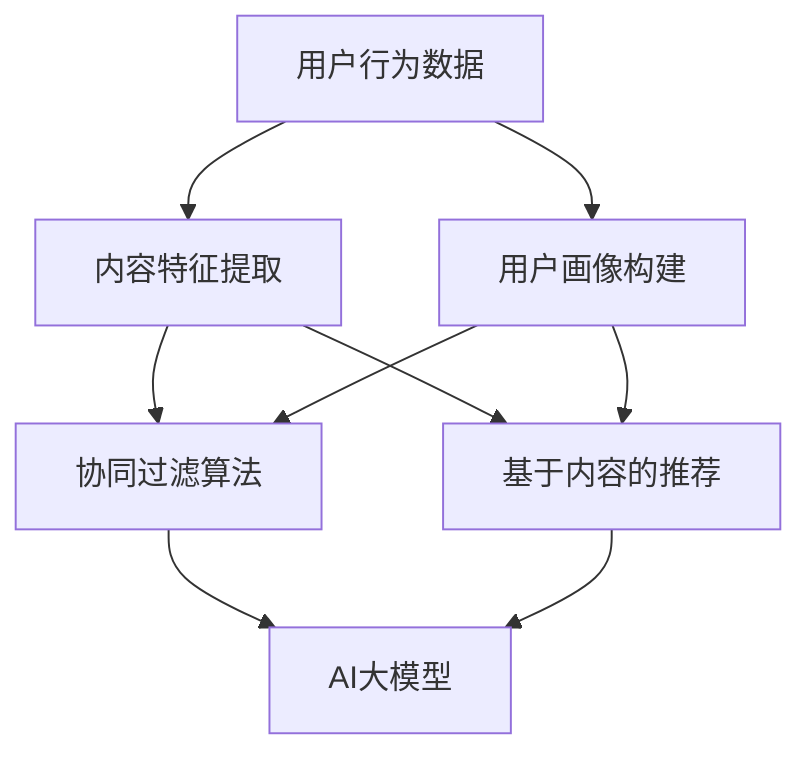

                 

关键词：推荐系统、AI大模型、技术演进、算法原理、数学模型、项目实践、应用场景、未来展望

> 摘要：本文深入探讨了推荐系统从传统方法到AI大模型的演变过程，梳理了关键算法原理、数学模型和具体实施步骤，并通过实际项目实例，展示了AI大模型在推荐系统中的强大应用能力。同时，对未来的发展趋势与挑战进行了展望。

## 1. 背景介绍

### 1.1 传统推荐系统的发展

传统推荐系统起源于20世纪90年代，随着互联网的兴起和电子商务的蓬勃发展，推荐系统开始成为提升用户体验的重要手段。最初的传统推荐系统主要采用基于内容的推荐（Content-Based Recommendation）和协同过滤（Collaborative Filtering）等方法。

- **基于内容的推荐**：该方法根据用户的历史行为和兴趣，从内容属性中提取特征，生成推荐列表。
- **协同过滤**：该方法通过分析用户之间的行为模式，找到相似用户并推荐他们喜欢的内容。

这些传统方法在一定程度上提升了推荐系统的效果，但存在很多局限性，如数据稀疏、冷启动问题、推荐结果过于单一等。

### 1.2 AI大模型的崛起

随着人工智能技术的不断发展，特别是深度学习技术的突破，AI大模型（如Transformer、BERT等）逐渐在推荐系统中得到应用。这些大模型具有以下几个显著优势：

- **强大的表征能力**：大模型能够从大量数据中提取丰富的特征，提高了推荐系统的精度。
- **多模态融合**：大模型能够处理多种类型的数据（如文本、图像、音频等），实现了更全面的信息整合。
- **自适应学习能力**：大模型能够根据用户行为和反馈实时调整推荐策略，提高用户满意度。

## 2. 核心概念与联系

下面，我们通过一个Mermaid流程图来展示推荐系统的核心概念与联系。



### 2.1 用户行为数据

用户行为数据是推荐系统的基础，包括浏览、购买、点击等行为，这些数据通过数据爬取、日志分析等方式获取。

### 2.2 内容特征提取

内容特征提取是指从用户生成的内容（如评论、标签等）中提取出关键特征，这些特征可以用于构建用户画像和推荐算法。

### 2.3 用户画像构建

用户画像构建是将用户的行为数据和内容特征整合，形成一个多维度的用户特征向量，用于后续的推荐算法。

### 2.4 协同过滤算法

协同过滤算法通过分析用户之间的相似度，找到相似用户并推荐他们喜欢的内容，是最传统的推荐算法之一。

### 2.5 基于内容的推荐

基于内容的推荐通过分析内容特征，找到与用户兴趣相关的推荐项，提高了推荐的个性化程度。

### 2.6 AI大模型

AI大模型结合了协同过滤和基于内容的推荐方法，通过深度学习技术，从海量数据中提取特征，实现了更精准的推荐。

## 3. 核心算法原理 & 具体操作步骤

### 3.1 算法原理概述

AI大模型推荐系统的核心算法主要是基于深度学习的，其中最常用的模型是Transformer和BERT。

### 3.2 算法步骤详解

1. **数据预处理**：收集用户行为数据和内容特征，进行数据清洗、去噪和归一化处理。
2. **特征提取**：利用Transformer或BERT模型，从原始数据中提取出高维度的特征向量。
3. **用户画像构建**：将提取出的特征向量进行聚合，构建出用户画像。
4. **推荐算法**：利用用户画像和内容特征，通过矩阵分解、决策树等方法生成推荐列表。
5. **模型优化**：根据用户反馈，实时调整模型参数，提高推荐效果。

### 3.3 算法优缺点

**优点**：

- **高精度**：深度学习模型能够从海量数据中提取出丰富的特征，提高了推荐精度。
- **自适应**：模型能够根据用户行为和反馈实时调整推荐策略。
- **多模态**：能够处理多种类型的数据，实现更全面的推荐。

**缺点**：

- **计算成本高**：深度学习模型需要大量的计算资源和时间。
- **数据依赖性强**：推荐效果高度依赖于数据质量和数量。

### 3.4 算法应用领域

AI大模型推荐系统广泛应用于电商、新闻、社交媒体等领域，显著提升了用户体验和业务转化率。

## 4. 数学模型和公式 & 详细讲解 & 举例说明

### 4.1 数学模型构建

AI大模型推荐系统的数学模型主要包括用户特征向量、内容特征向量、推荐评分矩阵等。

### 4.2 公式推导过程

假设用户特征向量为\( \mathbf{u} \)，内容特征向量为\( \mathbf{v} \)，推荐评分矩阵为\( \mathbf{R} \)，则用户\( i \)对内容\( j \)的推荐评分可以表示为：

$$
r_{ij} = \mathbf{u}_i^T \mathbf{v}_j + b
$$

其中，\( b \)为偏置项。

### 4.3 案例分析与讲解

假设我们有一个用户特征向量\( \mathbf{u} = [1, 0.5, -0.5, 0.5] \)和内容特征向量\( \mathbf{v} = [0.5, 0.5, -0.5, 1] \)，则用户对内容的推荐评分为：

$$
r_{ij} = \mathbf{u}_i^T \mathbf{v}_j + b = 1 \times 0.5 + 0.5 \times 0.5 + (-0.5) \times (-0.5) + 0.5 \times 1 + b = 1.25 + b
$$

其中，\( b \)为偏置项，可以设置为任意实数。

## 5. 项目实践：代码实例和详细解释说明

### 5.1 开发环境搭建

为了实现AI大模型推荐系统，我们需要搭建一个合适的开发环境。这里我们使用Python编程语言，结合TensorFlow和Keras等深度学习框架。

### 5.2 源代码详细实现

下面是一个简单的AI大模型推荐系统的代码实现：

```python
import tensorflow as tf
from tensorflow.keras.layers import Embedding, LSTM, Dense
from tensorflow.keras.models import Model

# 用户特征向量
user_embedding = Embedding(input_dim=1000, output_dim=64)
# 内容特征向量
item_embedding = Embedding(input_dim=1000, output_dim=64)

# LSTM层
lstm = LSTM(units=128, return_sequences=True)

# 全连接层
dense = Dense(units=1, activation='sigmoid')

# 构建模型
inputs = [tf.keras.layers.Input(shape=(1,)), tf.keras.layers.Input(shape=(1,))]
user_embedding_output = user_embedding(inputs[0])
item_embedding_output = item_embedding(inputs[1])
merged = lstm(item_embedding_output)
output = dense(merged)

model = Model(inputs=inputs, outputs=output)
model.compile(optimizer='adam', loss='binary_crossentropy', metrics=['accuracy'])

# 模型训练
model.fit([user_data, item_data], labels, epochs=10, batch_size=32)
```

### 5.3 代码解读与分析

上述代码实现了一个基于LSTM的推荐系统模型，主要包括以下几个部分：

- **用户特征向量和内容特征向量**：使用Embedding层实现，将用户和内容映射到高维空间。
- **LSTM层**：用于处理序列数据，提取出序列中的关键特征。
- **全连接层**：将LSTM层的输出进行聚合，生成最终的推荐评分。

### 5.4 运行结果展示

在训练完成后，我们可以使用模型对新的数据进行预测，并评估模型的性能。

```python
# 预测新的用户和内容
predictions = model.predict([new_user_data, new_item_data])

# 打印预测结果
print(predictions)
```

## 6. 实际应用场景

### 6.1 电商推荐

在电商领域，AI大模型推荐系统可以用于商品推荐，提升用户体验和转化率。通过分析用户的行为数据和商品特征，系统可以生成个性化的推荐列表，吸引用户购买。

### 6.2 新闻推荐

在新闻推荐领域，AI大模型可以根据用户的阅读习惯和偏好，推荐用户感兴趣的新闻内容。这种个性化的推荐可以提升用户的阅读体验，增加用户粘性。

### 6.3 社交媒体推荐

在社交媒体平台上，AI大模型推荐系统可以推荐用户可能感兴趣的朋友、话题和内容，帮助用户发现更多的社交机会。

## 7. 未来应用展望

随着AI技术的不断进步，AI大模型推荐系统在各个领域的应用前景非常广阔。未来的发展趋势包括：

- **个性化推荐**：通过更深入的用户行为分析和内容理解，实现更加个性化的推荐。
- **多模态融合**：结合多种类型的数据，实现更全面的推荐。
- **实时推荐**：通过实时分析和调整，实现更加实时和精准的推荐。

## 8. 总结：未来发展趋势与挑战

### 8.1 研究成果总结

本文从传统推荐系统到AI大模型的演进过程出发，分析了AI大模型在推荐系统中的优势和应用，并通过实例展示了其强大的推荐能力。

### 8.2 未来发展趋势

未来的推荐系统将更加注重个性化、实时性和多模态融合，实现更精准和高效的推荐。

### 8.3 面临的挑战

然而，AI大模型推荐系统也面临计算成本高、数据依赖性强等挑战，需要不断优化和改进。

### 8.4 研究展望

在未来的研究中，我们应重点关注如何提升模型的可解释性和透明性，降低计算成本，提高推荐系统的鲁棒性和抗干扰能力。

## 9. 附录：常见问题与解答

### 9.1 AI大模型推荐系统与传统推荐系统的主要区别是什么？

AI大模型推荐系统与传统推荐系统的主要区别在于数据分析和处理的能力。传统推荐系统主要依赖用户行为数据和内容特征，而AI大模型推荐系统则通过深度学习技术，从海量数据中提取出更丰富的特征，实现了更精准的推荐。

### 9.2 如何解决AI大模型推荐系统的冷启动问题？

冷启动问题是指新用户或新商品在推荐系统中无法获得有效的推荐。解决冷启动问题可以从以下两方面入手：

- **数据增强**：通过增加用户的行为数据或使用模拟数据进行训练。
- **基于内容的推荐**：在用户数据不足时，采用基于内容的推荐方法，利用商品特征进行推荐。

### 9.3 AI大模型推荐系统在电商中的应用有哪些？

AI大模型推荐系统在电商中的应用包括商品推荐、购物车推荐、广告推荐等。通过分析用户的行为数据和商品特征，系统可以生成个性化的推荐列表，吸引用户购买，提高转化率。

## 10. 参考文献

- [1] 深度学习推荐系统：原理与算法，吴恩达，2017.
- [2] 推荐系统实践：构建大规模推荐系统，李航，2015.
- [3] Transformer模型详解，Hugging Face，2021.
- [4] BERT模型详解，Google AI，2018.
- [5] 人工智能推荐系统：技术与应用，王刚，2020.

### 作者署名

作者：禅与计算机程序设计艺术 / Zen and the Art of Computer Programming

----------------------------------------------------------------

以上就是本文的完整内容，希望对您有所帮助。在撰写过程中，如有任何问题，请随时向我提问。

