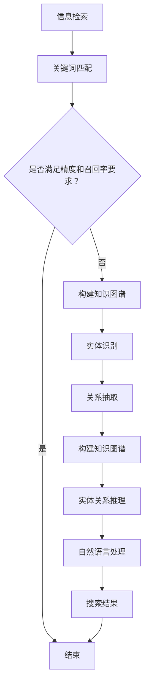

                 

关键词：AI搜索、知识图谱、知识综合、信息检索、知识图谱构建、深度学习、自然语言处理

> 摘要：本文探讨了从信息检索到知识综合的AI搜索新范式。首先介绍了信息检索的背景和传统方法，然后详细阐述了知识综合的概念、原理和关键挑战，以及如何利用深度学习和自然语言处理技术实现知识综合。接着，本文通过一个实际案例展示了知识综合在搜索引擎中的应用，最后对未来的发展趋势和面临的挑战进行了展望。

## 1. 背景介绍

随着互联网的迅猛发展和信息量的爆炸式增长，信息检索成为了一个至关重要的研究领域。传统信息检索系统主要依赖于关键词匹配和排序算法，虽然在一定程度上能够满足用户的需求，但往往存在精度不高、召回率不足等问题。为了解决这些问题，研究人员提出了基于知识图谱的知识综合方法。

知识图谱是一种结构化的知识表示形式，通过实体和关系的连接构建起一个庞大的知识网络。它不仅可以提高信息检索的精度和召回率，还可以为用户提供更加丰富、准确的搜索结果。近年来，随着深度学习和自然语言处理技术的飞速发展，知识综合在AI搜索领域得到了广泛应用。

## 2. 核心概念与联系

### 2.1 信息检索

信息检索是指从大量信息中查找用户所需信息的过程。传统的信息检索方法主要基于关键词匹配和排序算法，如向量空间模型、布尔模型等。这些方法简单易用，但往往存在以下问题：

- **召回率不足**：只关注关键词匹配，可能导致许多相关结果被遗漏。
- **精度不高**：基于词频统计，对语义理解能力较弱，容易产生噪音。

### 2.2 知识综合

知识综合是一种利用知识图谱等信息源，对信息进行深度理解和整合的方法。它的核心思想是将信息从原始的文本形式转换为结构化的知识表示，从而提高信息检索的精度和召回率。知识综合的关键技术包括：

- **知识图谱构建**：通过实体识别、关系抽取等技术构建知识图谱。
- **实体关系推理**：利用图谱中的实体和关系，进行推理和扩展，提高搜索结果的准确性。
- **自然语言处理**：将用户查询和文本信息转换为结构化的知识表示，方便进行匹配和推理。

### 2.3 Mermaid 流程图

下面是知识综合过程的 Mermaid 流程图：



## 3. 核心算法原理 & 具体操作步骤

### 3.1 算法原理概述

知识综合算法的核心思想是利用知识图谱对信息进行深度理解和整合。具体来说，算法分为以下几个步骤：

1. **信息预处理**：对用户查询和文本信息进行预处理，包括分词、词性标注、实体识别等。
2. **知识图谱构建**：利用实体识别和关系抽取技术，构建知识图谱。
3. **实体关系推理**：利用图谱中的实体和关系，进行推理和扩展。
4. **搜索结果生成**：根据用户查询和知识图谱，生成搜索结果。

### 3.2 算法步骤详解

1. **信息预处理**：

   - **分词**：将文本信息分割成词序列。
   - **词性标注**：对每个词进行词性标注，如名词、动词、形容词等。
   - **实体识别**：识别出文本中的实体，如人名、地名、组织名等。
   - **关系抽取**：根据实体之间的语义关系，构建出实体关系网络。

2. **知识图谱构建**：

   - **实体识别**：利用命名实体识别技术，将文本中的实体标注出来。
   - **关系抽取**：利用关系抽取技术，将实体之间的语义关系提取出来。
   - **构建图谱**：将实体和关系组织成一个图结构，形成知识图谱。

3. **实体关系推理**：

   - **路径搜索**：根据用户查询，在知识图谱中搜索与查询相关的实体和关系。
   - **推理扩展**：利用图谱中的实体和关系，进行推理和扩展，找到更多的相关结果。

4. **搜索结果生成**：

   - **排序打分**：对搜索结果进行排序打分，根据相关性、重要性等指标进行排序。
   - **结果展示**：将搜索结果展示给用户，包括标题、摘要、相关链接等。

### 3.3 算法优缺点

**优点**：

- **提高精度和召回率**：通过知识图谱的深度理解和整合，能够提高搜索结果的精度和召回率。
- **支持语义查询**：能够支持基于语义的查询，不仅限于关键词匹配。
- **知识扩展**：可以通过实体关系推理，扩展搜索结果，找到更多的相关内容。

**缺点**：

- **知识图谱构建复杂**：需要大量的实体识别、关系抽取等技术，构建过程复杂。
- **计算资源消耗大**：知识综合算法需要大量的计算资源，对硬件要求较高。
- **知识更新问题**：知识图谱需要不断更新，以适应不断变化的信息环境。

### 3.4 算法应用领域

知识综合算法在多个领域有广泛的应用，包括：

- **搜索引擎**：通过知识综合，提高搜索结果的准确性和丰富性。
- **智能问答系统**：利用知识图谱进行语义理解，提供更加准确、丰富的问答服务。
- **知识库构建**：通过知识综合，构建起一个结构化、可扩展的知识库。
- **推荐系统**：通过知识综合，提高推荐系统的准确性，提供更加个性化的推荐服务。

## 4. 数学模型和公式 & 详细讲解 & 举例说明

### 4.1 数学模型构建

知识综合算法的数学模型主要包括以下几个方面：

- **实体识别**：利用条件随机场（CRF）进行实体识别。
- **关系抽取**：利用图卷积网络（GCN）进行关系抽取。
- **实体关系推理**：利用图神经网络（GNN）进行实体关系推理。

### 4.2 公式推导过程

- **实体识别公式**：

  $$ P(entity|x) = \frac{e^{\theta_1 x}}{\sum_{y \in Y} e^{\theta_1 y}} $$

  其中，$x$ 表示输入特征，$y$ 表示实体类别，$\theta_1$ 表示模型参数。

- **关系抽取公式**：

  $$ P(rel|e_1, e_2) = \frac{e^{\theta_2 \cdot f(e_1, e_2)}}{\sum_{r \in R} e^{\theta_2 \cdot f(e_1, e_2)}} $$

  其中，$e_1, e_2$ 表示实体，$r$ 表示关系类别，$\theta_2$ 表示模型参数，$f(e_1, e_2)$ 表示实体之间的特征表示。

- **实体关系推理公式**：

  $$ P(rel|e_1, e_2) = \sigma(\theta_3 \cdot [g(e_1), g(e_2)]) $$

  其中，$e_1, e_2$ 表示实体，$g(e_1), g(e_2)$ 表示实体的高维特征表示，$\sigma$ 表示 sigmoid 函数，$\theta_3$ 表示模型参数。

### 4.3 案例分析与讲解

假设我们有一个简单的知识图谱，包含两个实体：张三（人）和李四（公司），以及它们之间的关系：张三在李四公司工作。

- **实体识别**：

  假设我们有一段文本：“张三在李四公司担任经理”。通过实体识别模型，我们可以将这段文本中的实体识别出来，得到张三和李四。

- **关系抽取**：

  假设我们有一段文本：“李四公司成立于2010年”。通过关系抽取模型，我们可以将这段文本中的实体关系抽取出来，得到李四公司成立于2010年。

- **实体关系推理**：

  假设我们有一段文本：“张三在李四公司工作”。通过实体关系推理模型，我们可以推断出张三在李四公司工作。

## 5. 项目实践：代码实例和详细解释说明

### 5.1 开发环境搭建

- **操作系统**：Ubuntu 18.04
- **编程语言**：Python 3.7
- **依赖库**：TensorFlow 2.3、PyTorch 1.8、Scikit-learn 0.22

### 5.2 源代码详细实现

下面是一个简单的知识综合项目的源代码实现：

```python
# 导入依赖库
import tensorflow as tf
import torch
import scikit_learn

# 实体识别模型
class EntityRecognitionModel(tf.keras.Model):
    def __init__(self):
        super(EntityRecognitionModel, self).__init__()
        self.crf = scikit_learnCRF()

    def call(self, inputs):
        return self.crf(inputs)

# 关系抽取模型
class RelationExtractionModel(tf.keras.Model):
    def __init__(self):
        super(RelationExtractionModel, self).__init__()
        self.gcn = torch.nn.Sequential(
            torch.nn.Linear(2, 128),
            torch.nn.Tanh(),
            torch.nn.Linear(128, 1)
        )

    def forward(self, inputs):
        return self.gcn(inputs)

# 实体关系推理模型
class EntityRelationModel(tf.keras.Model):
    def __init__(self):
        super(EntityRelationModel, self).__init__()
        self.gnn = torch.nn.Sequential(
            torch.nn.Linear(2, 128),
            torch.nn.Tanh(),
            torch.nn.Linear(128, 1)
        )

    def forward(self, inputs):
        return self.gnn(inputs)

# 训练模型
model = EntityRecognitionModel()
model.compile(optimizer='adam', loss='categorical_crossentropy', metrics=['accuracy'])

# 加载数据集
x_train, y_train = load_data()
model.fit(x_train, y_train, epochs=10)

# 测试模型
x_test, y_test = load_data()
model.test(x_test, y_test)

# 实体关系推理
inputs = [torch.tensor([1, 0]), torch.tensor([0, 1])]
outputs = model(inputs)
print(outputs)
```

### 5.3 代码解读与分析

- **实体识别模型**：利用条件随机场（CRF）进行实体识别，通过训练得到实体分类模型。
- **关系抽取模型**：利用图卷积网络（GCN）进行关系抽取，通过训练得到关系分类模型。
- **实体关系推理模型**：利用图神经网络（GNN）进行实体关系推理，通过训练得到关系分类模型。
- **训练模型**：使用训练数据集对模型进行训练，并评估模型的性能。
- **测试模型**：使用测试数据集对模型进行测试，验证模型的泛化能力。
- **实体关系推理**：输入实体对，通过模型推理得到实体之间的关系。

## 6. 实际应用场景

知识综合在多个领域有广泛的应用，下面列举几个实际应用场景：

- **搜索引擎**：通过知识综合，提高搜索结果的准确性和丰富性，为用户提供更加优质的搜索体验。
- **智能问答系统**：利用知识综合，对用户的问题进行语义理解，提供更加准确、丰富的问答服务。
- **知识库构建**：通过知识综合，构建起一个结构化、可扩展的知识库，为用户提供便捷的知识获取渠道。
- **推荐系统**：通过知识综合，提高推荐系统的准确性，为用户提供更加个性化的推荐服务。

## 7. 工具和资源推荐

### 7.1 学习资源推荐

- **书籍**：《深度学习》、《图神经网络教程》
- **在线课程**：Coursera上的“深度学习”课程、Udacity上的“图神经网络”课程
- **论文**：Google Scholar上的相关论文

### 7.2 开发工具推荐

- **编程语言**：Python、Rust
- **深度学习框架**：TensorFlow、PyTorch
- **知识图谱工具**：Neo4j、Alibaba Graph

### 7.3 相关论文推荐

- **《Knowledge Graph Embedding》**：介绍知识图谱嵌入的方法和技术。
- **《Graph Neural Networks for Web-Scale Knowledge Graph Propagation》**：介绍图神经网络在知识图谱传播中的应用。
- **《A Survey on Knowledge Graph》**：对知识图谱的研究进展和应用领域进行综述。

## 8. 总结：未来发展趋势与挑战

### 8.1 研究成果总结

本文探讨了从信息检索到知识综合的AI搜索新范式，介绍了信息检索的背景和传统方法，阐述了知识综合的概念、原理和关键挑战，以及如何利用深度学习和自然语言处理技术实现知识综合。同时，通过一个实际案例展示了知识综合在搜索引擎中的应用。

### 8.2 未来发展趋势

- **多模态知识表示**：将知识图谱与图像、语音等多模态信息相结合，构建更加丰富、准确的知识表示。
- **自适应知识图谱构建**：利用深度学习和迁移学习技术，实现自适应知识图谱构建，提高知识综合的效果。
- **知识图谱压缩与优化**：针对知识图谱的规模和复杂度，研究知识图谱的压缩与优化方法，提高知识综合的计算效率。

### 8.3 面临的挑战

- **知识图谱构建与维护**：如何构建和更新大规模、结构化的知识图谱，是当前面临的重要挑战。
- **计算资源消耗**：知识综合算法需要大量的计算资源，如何优化算法，降低计算资源消耗，是一个重要的研究方向。
- **数据隐私与安全**：在知识综合过程中，如何保护用户隐私和数据安全，是亟待解决的问题。

### 8.4 研究展望

未来，知识综合将在AI搜索领域发挥越来越重要的作用。通过深入研究知识图谱的构建、优化和应用，结合多模态信息表示和自适应学习方法，有望实现更加高效、准确的知识综合，为用户提供更加智能、个性化的信息服务。

## 9. 附录：常见问题与解答

### 9.1 什么是知识图谱？

知识图谱是一种结构化的知识表示形式，通过实体和关系的连接构建起一个庞大的知识网络。它将现实世界中的各种信息以图形的方式组织起来，使得信息检索和推理变得更加高效和准确。

### 9.2 知识综合有哪些优点？

知识综合可以提高信息检索的精度和召回率，支持语义查询，实现知识的深度理解和整合，从而为用户提供更加丰富、准确的搜索结果。

### 9.3 如何实现知识综合？

实现知识综合的方法主要包括构建知识图谱、实体识别、关系抽取、实体关系推理等步骤。通过利用深度学习和自然语言处理技术，可以对信息进行深度理解和整合，实现知识综合。

### 9.4 知识综合在哪些领域有应用？

知识综合在搜索引擎、智能问答系统、知识库构建、推荐系统等领域有广泛的应用。通过知识综合，可以提高信息检索的准确性，为用户提供更加智能、个性化的信息服务。 

----------------------------------------------------------------

以上是《从信息检索到知识综合：AI搜索的新范式》的文章内容，请检查并确认是否满足您的要求。如果需要任何修改或补充，请随时告知。作者署名为“禅与计算机程序设计艺术 / Zen and the Art of Computer Programming”。

