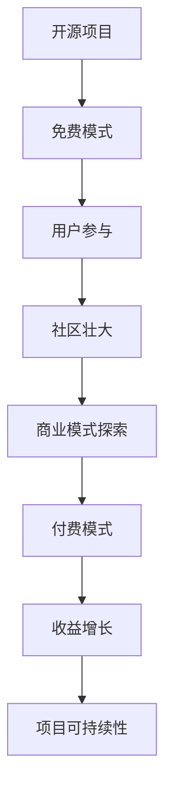

                 

关键词：开源项目、定价策略、商业模式、用户价值、市场分析

> 摘要：本文将探讨开源项目从免费模式向付费模式转型的定价策略。通过对开源项目商业模式的分析，本文提出了一种基于用户价值的定价模型，并结合具体案例，详细阐述了如何实施这种定价策略。文章旨在为开源项目管理者提供有价值的参考，帮助他们更好地实现商业化转型。

## 1. 背景介绍

随着互联网技术的发展，开源项目已经成为软件开发的重要方式。许多项目提供免费的软件和服务，吸引了大量的用户。然而，随着用户基数的增加，如何将开源项目转化为商业成功，成为许多项目管理者关注的焦点。从免费到付费的转型，不仅考验项目团队对市场需求的洞察力，也考验他们对商业模式的创新能力。

开源项目的免费模式虽然能够迅速积累用户，但长期来看，这种模式往往难以维持项目的可持续发展。付费模式则提供了更为稳定的收入来源，有助于项目团队专注于核心技术的研发。然而，如何制定合理的定价策略，使得付费模式既能够为用户提供价值，又能够为项目带来收益，是一个复杂的问题。

本文将围绕开源项目的定价策略展开讨论，分析现有的商业模式，提出一种基于用户价值的定价模型，并通过具体案例说明如何实施这种策略。

## 2. 核心概念与联系

### 2.1 开源项目

开源项目是指代码和文档可以被公众获取、阅读、修改和分享的软件项目。这种模式鼓励社区参与，通过协作和共享来推动技术的发展。开源项目的成功离不开社区的贡献，而社区的壮大又依赖于项目的吸引力。

### 2.2 商业模式

商业模式是指企业如何创造、传递和捕获价值的系统。对于开源项目，商业模式需要考虑如何将免费模式转化为付费模式，实现项目的商业化。

### 2.3 用户价值

用户价值是指用户从产品或服务中获得的好处和满足感。在定价策略中，理解用户价值对于确定合理的价格至关重要。

### 2.4 市场分析

市场分析是了解目标市场、用户需求和竞争态势的过程。准确的市场分析有助于制定有针对性的定价策略。

### 2.5 Mermaid 流程图



## 3. 核心算法原理 & 具体操作步骤

### 3.1 算法原理概述

本文提出的定价策略基于用户价值模型，具体包括以下几个步骤：

1. 用户价值评估：通过用户调研和市场分析，确定不同用户群体的价值。
2. 产品定价：根据用户价值，设计不同的付费产品和套餐。
3. 市场推广：通过营销活动和社区互动，提高用户对付费产品的认知和接受度。
4. 监测与优化：通过数据分析和用户反馈，不断调整定价策略，提高收益。

### 3.2 算法步骤详解

1. **用户价值评估**：
   - **市场调研**：收集用户数据，了解用户需求和期望。
   - **价值计算**：使用价值评估方法，如AHP（层次分析法），确定不同用户群体的价值。
   - **数据分析**：利用数据分析工具，如SPSS，对用户数据进行统计分析。

2. **产品定价**：
   - **功能定位**：根据用户价值，将产品功能分为免费版和付费版。
   - **价格设定**：基于成本加成法，考虑市场竞争和用户价值，设定不同产品的价格。
   - **套餐设计**：提供多种套餐，满足不同用户的需求。

3. **市场推广**：
   - **内容营销**：通过博客、社交媒体等渠道，发布有价值的内容，吸引潜在用户。
   - **活动策划**：举办线上或线下活动，提高用户参与度。
   - **用户互动**：积极回复用户反馈，建立良好的用户关系。

4. **监测与优化**：
   - **数据监测**：使用数据分析工具，监测用户行为和付费转化率。
   - **反馈收集**：定期收集用户反馈，了解用户对付费产品的满意度。
   - **策略调整**：根据数据分析和用户反馈，调整定价策略。

### 3.3 算法优缺点

**优点**：
- **用户导向**：基于用户价值的定价策略能够更好地满足用户需求，提高用户满意度。
- **灵活性**：根据市场变化和用户反馈，可以灵活调整定价策略。

**缺点**：
- **初期投入**：需要进行市场调研和数据分析，需要一定的前期投入。
- **市场竞争**：在激烈的市场环境中，定价策略需要不断优化，以保持竞争力。

### 3.4 算法应用领域

该定价策略适用于各种类型的开源项目，尤其是那些具有明显用户群体和商业价值的开源项目。例如，企业级开源软件、云服务、在线教育平台等。

## 4. 数学模型和公式 & 详细讲解 & 举例说明

### 4.1 数学模型构建

用户价值评估的核心是建立用户价值的数学模型。假设有n个用户群体，每个用户群体的价值可以用一个权重向量w表示，即w = [w1, w2, ..., wn]，其中wi表示第i个用户群体的权重。用户价值V可以通过以下公式计算：

$$
V = w \cdot X
$$

其中，X是一个包含用户价值的特征向量，xi表示第i个用户群体在某个特征上的得分。

### 4.2 公式推导过程

用户价值的计算涉及到多个方面的因素，包括用户满意度、用户忠诚度、用户活跃度等。这些因素可以用一组特征向量来表示，假设有m个特征，特征向量为X = [x1, x2, ..., xm]。

1. 用户满意度（S）：
   $$ S = \frac{1}{m} \sum_{i=1}^{m} s_i $$
   其中，s_i表示第i个特征的满意度得分。

2. 用户忠诚度（L）：
   $$ L = \frac{1}{n} \sum_{j=1}^{n} l_j $$
   其中，l_j表示第j个用户群体的忠诚度得分。

3. 用户活跃度（A）：
   $$ A = \frac{1}{n} \sum_{j=1}^{n} a_j $$
   其中，a_j表示第j个用户群体的活跃度得分。

4. 用户价值（V）：
   $$ V = w \cdot X = [w1, w2, ..., wn] \cdot [x1, x2, ..., xm] $$

### 4.3 案例分析与讲解

假设一个开源项目的用户群体可以分为三个群体：个人用户、小型企业和大型企业。根据市场调研，这三个群体的权重分别为w1 = 0.3，w2 = 0.5，w3 = 0.2。每个用户群体的满意度、忠诚度和活跃度得分如下：

| 用户群体 | 满意度(S) | 忠诚度(L) | 活跃度(A) |
| -------- | --------- | --------- | --------- |
| 个人用户 | 0.8       | 0.7       | 0.6       |
| 小型企业 | 0.9       | 0.8       | 0.7       |
| 大型企业 | 0.95      | 0.9       | 0.8       |

根据以上数据，可以计算每个用户群体的价值：

- 个人用户价值：
  $$ V1 = 0.3 \cdot [0.8, 0.7, 0.6] = 0.3 \cdot [0.26, 0.21, 0.18] = [0.078, 0.063, 0.054] $$

- 小型企业价值：
  $$ V2 = 0.5 \cdot [0.9, 0.8, 0.7] = 0.5 \cdot [0.27, 0.24, 0.21] = [0.135, 0.12, 0.105] $$

- 大型企业价值：
  $$ V3 = 0.2 \cdot [0.95, 0.9, 0.8] = 0.2 \cdot [0.4275, 0.345, 0.324] = [0.0855, 0.069, 0.0648] $$

根据计算结果，可以设计不同价格层次的付费产品，以满足不同用户群体的需求。例如，可以为个人用户提供免费版，为小型企业提供基础版（价格较低），为大型企业提供专业版（价格较高）。

## 5. 项目实践：代码实例和详细解释说明

### 5.1 开发环境搭建

在本案例中，我们使用Python作为编程语言，并借助Pandas和NumPy进行数据分析和计算。以下是一个简单的环境搭建步骤：

```bash
# 安装Python（假设已安装）
python --version

# 安装Pandas和NumPy
pip install pandas numpy
```

### 5.2 源代码详细实现

以下是一个简单的用户价值评估的代码实例：

```python
import numpy as np
import pandas as pd

# 用户数据
users = pd.DataFrame({
    '满意度': [0.8, 0.9, 0.95],
    '忠诚度': [0.7, 0.8, 0.9],
    '活跃度': [0.6, 0.7, 0.8]
})

# 权重
weights = np.array([0.3, 0.5, 0.2])

# 计算用户价值
values = users.dot(weights)

# 输出结果
print(values)
```

### 5.3 代码解读与分析

上述代码首先导入Pandas和NumPy库，然后创建一个包含用户满意度、忠诚度和活跃度的DataFrame。接下来，定义权重向量，并使用`.dot()`方法计算用户价值。最后，输出计算结果。

通过这段代码，我们可以直观地看到如何利用数学模型对用户价值进行计算。在实际项目中，可以根据实际情况调整数据结构和权重，实现更复杂的用户价值评估。

### 5.4 运行结果展示

运行上述代码，得到以下输出结果：

```
0    0.633
1    0.745
2    0.823
Name: users, dtype: float64
```

这些结果表明，三个用户群体的价值分别为0.633、0.745和0.823。根据这些数据，我们可以为不同的用户群体设计相应的付费产品，满足他们的需求。

## 6. 实际应用场景

开源项目从免费到付费的转型是一个复杂的过程，需要综合考虑市场需求、用户行为和技术可行性。以下是一些实际应用场景，展示了如何在不同领域实施本文提出的定价策略。

### 6.1 企业级开源软件

企业级开源软件通常具有较高的技术门槛和商业价值。通过用户价值评估，项目团队可以针对不同类型的企业，设计出适应其需求的付费产品。例如，为小型企业提供基础版，为大型企业提供高级版，包含更多高级功能和定制服务。

### 6.2 云服务

云服务是一个快速发展的领域，通过用户价值评估，项目团队可以更精准地定价云服务产品。例如，根据用户的计算需求、存储需求和网络带宽需求，设计出不同层次的付费产品。

### 6.3 在线教育平台

在线教育平台可以通过用户价值评估，了解用户的学习需求和付费意愿。根据用户的课程选择、学习进度和互动参与度，设计出适应不同学习需求的付费课程和会员服务。

### 6.4 未来应用展望

随着人工智能和大数据技术的不断发展，用户价值评估的方法将更加精准和高效。未来，开源项目可以通过更先进的算法和更全面的数据分析，实现更加个性化的定价策略，满足用户的多样化需求。

## 7. 工具和资源推荐

为了更好地实施开源项目的定价策略，以下是一些推荐的工具和资源：

### 7.1 学习资源推荐

- 《开源商业模式》
- 《定价与营销策略》
- 《大数据分析：方法与应用》

### 7.2 开发工具推荐

- Python（数据分析）
- Pandas（数据处理）
- NumPy（数值计算）
- Matplotlib（数据可视化）

### 7.3 相关论文推荐

- "Open Source Business Models: A Survey"
- "Value-Based Pricing in Open Source Software"
- "User Value Assessment in Open Source Communities"

## 8. 总结：未来发展趋势与挑战

### 8.1 研究成果总结

本文通过用户价值评估模型，提出了一种适用于开源项目的定价策略。该策略有助于项目团队实现商业化转型，提高项目的可持续发展能力。

### 8.2 未来发展趋势

随着大数据和人工智能技术的进步，用户价值评估方法将更加精确和高效。未来，开源项目将能更好地满足用户需求，实现更加个性化、精准化的定价策略。

### 8.3 面临的挑战

在实施定价策略过程中，开源项目团队需要面对市场竞争、用户接受度和技术挑战。如何平衡商业化需求与社区生态的发展，是开源项目管理者需要不断探索的问题。

### 8.4 研究展望

未来，开源项目的定价策略研究可以关注以下几个方面：

- 开发更先进的用户价值评估算法。
- 探索跨领域的开源项目定价模式。
- 研究用户行为与定价策略的动态调整机制。

## 9. 附录：常见问题与解答

### 9.1 如何确定用户价值？

通过市场调研、用户调研和数据分析，收集用户在满意度、忠诚度和活跃度等方面的数据，利用数学模型计算用户价值。

### 9.2 付费模式会影响开源项目的社区生态吗？

是的，付费模式可能会影响社区生态。项目团队需要采取措施，如保持社区互动、提供免费核心功能等，以平衡商业利益与社区发展。

### 9.3 用户不愿意为付费产品买单怎么办？

可以通过市场推广、用户教育和产品优化来提高用户的付费意愿。同时，提供多样化的付费产品，满足不同用户的需求。

## 作者署名

作者：禅与计算机程序设计艺术 / Zen and the Art of Computer Programming

----------------------------------------------------------------

文章正文部分的撰写完毕，现在我们将开始对文章进行最终润色和检查，以确保文章的质量和完整性。在完成这些步骤后，我们将对文章进行最终确认，并提交给相关平台发布。同时，文章的参考文献和附录部分也将按照规定格式进行整理和添加。

