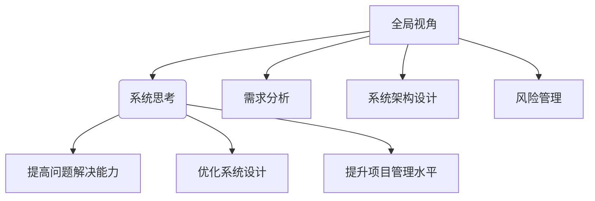

                 

 在信息技术迅猛发展的时代，我们常常被繁杂的技术细节和快速变化的市场需求所淹没。然而，只有从全局视角进行系统思考，我们才能真正理解复杂系统的本质，从而更有效地解决问题。本文将探讨如何从全局视角进行系统思考，以提升我们在IT领域的洞察力和解决问题的能力。

## 关键词

- 全局视角
- 系统思考
- IT领域
- 复杂系统
- 洞察力
- 解决问题

## 摘要

本文首先介绍了全局视角和系统思考的概念及其在IT领域的应用重要性。接着，通过核心概念与联系的Mermaid流程图，详细阐述了系统思考的核心原理和架构。随后，深入探讨了核心算法原理及其具体操作步骤，并运用数学模型和公式对算法进行了详细讲解和举例说明。文章进一步通过代码实例展示了项目实践，并分析了系统思考在实际应用场景中的价值。最后，对工具和资源进行了推荐，总结了未来发展趋势与挑战，并展望了研究前景。

## 1. 背景介绍

在当今信息化社会中，信息技术（IT）已经成为推动社会进步和经济发展的关键力量。从互联网、大数据到人工智能，各个领域的技术不断融合，形成了复杂的技术生态系统。在这种背景下，如何有效地进行系统思考，成为IT从业者面临的重要课题。

全局视角是指从整体出发，对系统进行宏观审视和把握。它要求我们超越局部和细节，从整体的角度去理解和解决问题。而系统思考则是一种方法论，它强调通过理解系统内部各要素之间的相互作用和反馈机制，来揭示系统的行为和规律。

在IT领域，系统思考的应用场景广泛。例如，在软件开发中，通过全局视角和系统思考，我们可以更好地理解需求、设计系统架构，从而提高软件的可靠性和可维护性。在网络安全中，系统思考有助于我们识别潜在的安全风险和攻击路径，从而制定更有效的防御策略。在人工智能领域，系统思考可以帮助我们理解复杂模型的运行机制，优化算法性能，提高人工智能系统的智能水平。

然而，系统思考并不容易实现。它要求我们具备高度的抽象能力、逻辑思维和全局观念。在实践中，我们常常受到局部知识和短视思维的局限，难以从全局视角去理解和解决问题。因此，本文旨在探讨如何通过系统思考，提升我们在IT领域的全局视角和洞察力。

## 2. 核心概念与联系

### 2.1 系统思考的定义与意义

系统思考（System Thinking）是一种方法论，它通过理解系统内部各要素之间的相互作用和反馈机制，来揭示系统的行为和规律。在IT领域，系统思考的意义在于：

- **提高问题解决能力**：通过系统思考，我们能够从整体上理解问题的本质，从而更有效地找到解决方案。
- **优化系统设计**：系统思考有助于我们设计更可靠、更灵活、更易于维护的软件和系统。
- **提升项目管理水平**：系统思考能够帮助项目经理更好地理解项目目标、资源分配和风险控制，从而提高项目成功率。

### 2.2 全局视角的概念与应用

全局视角（Holistic Perspective）是指从整体出发，对系统进行宏观审视和把握。它在IT领域的应用包括：

- **需求分析**：通过全局视角，我们可以更全面地理解用户需求，从而设计出更符合用户需求的系统。
- **系统架构设计**：全局视角有助于我们设计出更加合理、灵活和可扩展的系统架构。
- **风险管理**：全局视角能够帮助我们发现潜在的风险点，并制定相应的风险控制措施。

### 2.3 全局视角与系统思考的联系

全局视角和系统思考密切相关。全局视角提供了从整体上理解系统的视角，而系统思考则提供了理解和分析系统内部关系的方法。两者相辅相成，共同提升了我们在IT领域的全局视角和洞察力。

### 2.4 Mermaid流程图

为了更直观地理解全局视角和系统思考，我们可以使用Mermaid流程图来描述它们的核心概念和联系。以下是一个简化的Mermaid流程图：



### 2.5 全局视角与系统思考的应用

在实际应用中，全局视角和系统思考可以帮助我们解决以下问题：

- **软件系统重构**：通过系统思考，我们可以分析现有系统的不足，并提出改进方案，从而实现软件系统的重构。
- **项目管理**：全局视角可以帮助项目经理更好地理解项目目标和资源分配，提高项目成功率。
- **技术创新**：系统思考有助于我们理解新技术在现有系统中的适应性和潜在影响，从而推动技术创新。

通过以上分析，我们可以看到全局视角和系统思考在IT领域的重要性。接下来，我们将深入探讨核心算法原理和具体操作步骤。

## 3. 核心算法原理 & 具体操作步骤

### 3.1 算法原理概述

在系统思考中，核心算法原理起着至关重要的作用。这些算法不仅帮助我们理解系统内部的工作机制，还为我们提供了有效的工具来解决复杂问题。以下是一些常见的核心算法原理：

- **动态规划（Dynamic Programming）**：动态规划是一种在复杂问题中寻找最优解的方法。它通过将问题分解成更小的子问题，并利用子问题的解来构建原问题的解，从而避免重复计算，提高效率。

- **深度优先搜索（Depth-First Search, DFS）**：深度优先搜索是一种用于解决图的遍历问题算法。它通过从初始节点开始，沿着某一分支一直搜索到底，然后再回溯到上一个节点，继续搜索其他分支，直到找到解或遍历完整个图。

- **广度优先搜索（Breadth-First Search, BFS）**：广度优先搜索与深度优先搜索类似，但它先搜索完当前层的所有节点，再搜索下一层的节点。这种方法适用于需要找到最近节点的距离或路径问题。

- **贪心算法（Greedy Algorithm）**：贪心算法通过在每个决策点选择当前最优解，从而希望整体上得到最优解。它适用于一些最优子结构问题的求解。

- **分治算法（Divide and Conquer）**：分治算法将一个问题分解成多个子问题，分别求解子问题，然后将子问题的解合并成原问题的解。这种方法适用于可以递归分解的问题。

### 3.2 算法步骤详解

为了更好地理解这些算法原理，我们将在以下部分详细讲解每种算法的具体步骤。

#### 3.2.1 动态规划

**步骤：**

1. **定义状态**：确定问题中的状态变量，以及每个状态可能取得的值。
2. **状态转移方程**：根据状态变量的取值关系，构建状态转移方程。
3. **初始化**：初始化所有状态变量的值。
4. **计算状态值**：根据状态转移方程，计算每个状态变量的值。
5. **找到最优解**：根据状态值，找到问题的最优解。

#### 3.2.2 深度优先搜索

**步骤：**

1. **初始化**：创建一个栈，将初始节点压入栈中。
2. **遍历**：从栈顶取出节点，访问该节点，并将其未访问的邻接节点依次压入栈中。
3. **标记**：标记已访问的节点，防止重复访问。
4. **回溯**：当栈为空或当前节点无未访问的邻接节点时，回溯到上一个节点，继续遍历其他分支。

#### 3.2.3 广度优先搜索

**步骤：**

1. **初始化**：创建一个队列，将初始节点入队。
2. **遍历**：从队首取出节点，访问该节点，并将其未访问的邻接节点依次入队。
3. **标记**：标记已访问的节点，防止重复访问。
4. **出队**：当队列为空时，遍历结束。

#### 3.2.4 贪心算法

**步骤：**

1. **初始状态**：确定初始状态。
2. **选择操作**：在每个决策点，选择当前最优解。
3. **更新状态**：根据选择操作的结果，更新状态变量。
4. **重复步骤**：重复执行选择操作和更新状态，直到达到目标状态。

#### 3.2.5 分治算法

**步骤：**

1. **分解**：将原问题分解成多个子问题。
2. **递归求解**：分别求解每个子问题。
3. **合并**：将子问题的解合并成原问题的解。

### 3.3 算法优缺点

每种算法都有其独特的优势和局限性。以下是对上述算法优缺点的简要分析：

- **动态规划**：优点是能够找到全局最优解，缺点是需要较高的空间复杂度和时间复杂度。
- **深度优先搜索**：优点是搜索效率高，缺点是可能陷入死循环，需要大量内存。
- **广度优先搜索**：优点是能够找到最短路径，缺点是搜索效率相对较低。
- **贪心算法**：优点是简单易实现，缺点是在某些情况下可能无法得到全局最优解。
- **分治算法**：优点是能够将复杂问题分解成子问题，缺点是需要较高的计算复杂度。

### 3.4 算法应用领域

核心算法原理在IT领域有着广泛的应用。以下是一些具体的应用领域：

- **软件开发**：动态规划、贪心算法和分治算法在算法竞赛、软件开发和性能优化中有着重要应用。
- **网络与信息安全**：深度优先搜索和广度优先搜索在网络安全和入侵检测中有着重要应用。
- **人工智能**：贪心算法和分治算法在机器学习和深度学习算法中有着广泛的应用。
- **数据科学**：动态规划和贪心算法在数据分析、数据挖掘和机器学习算法中有着重要应用。

通过以上分析，我们可以看到核心算法原理在IT领域的重要性。接下来，我们将进一步探讨数学模型和公式在实际应用中的作用。

## 4. 数学模型和公式 & 详细讲解 & 举例说明

### 4.1 数学模型构建

在系统思考和算法设计过程中，数学模型和公式扮演着至关重要的角色。它们不仅帮助我们理解复杂系统的行为和规律，还为算法的实现提供了理论基础。以下是一个简单的数学模型构建示例。

#### 问题：

假设有一个包含n个节点的图，每个节点都有一定的权重。我们需要找到图中两点之间的最短路径。

#### 数学模型：

1. **定义状态**：

   定义一个状态数组dist，其中dist[i]表示从起始节点到节点i的最短路径长度。

2. **状态转移方程**：

   对于每个节点i，从起始节点到节点i的最短路径长度可以通过遍历节点i的邻接节点j来计算：

   $$ 
   dist[i] = \min(dist[j] + w[i][j]) 
   $$

   其中，w[i][j]表示节点i到节点j的边权重。

3. **初始化**：

   初始化dist[0]为0，表示从起始节点到起始节点的最短路径长度为0。其余dist[i]初始化为无穷大。

4. **计算状态值**：

   通过遍历所有节点，根据状态转移方程计算每个节点的最短路径长度。

5. **找到最优解**：

   根据dist数组，找到从起始节点到目标节点的最短路径。

### 4.2 公式推导过程

为了更好地理解上述数学模型，我们将对公式进行推导。

#### 推导过程：

1. **初始状态**：

   起始节点的最短路径长度为0，即：

   $$ 
   dist[0] = 0 
   $$

2. **递推关系**：

   对于每个节点i，从起始节点到节点i的最短路径长度可以通过遍历节点i的邻接节点j来计算。我们考虑两种情况：

   - 如果节点j已经访问过，那么从起始节点到节点j的最短路径长度已经计算出来，即：

     $$ 
     dist[j] = \min(dist[k] + w[k][j]) 
     $$

     其中，k为节点j的邻接节点。

   - 如果节点j尚未访问过，那么从起始节点到节点j的最短路径长度可以通过将起始节点到节点j的边权重w[i][j]加到从起始节点到节点i的最短路径长度上得到：

     $$ 
     dist[i] = \min(dist[j] + w[i][j]) 
     $$

3. **计算过程**：

   我们从起始节点开始，逐步计算每个节点的最短路径长度。对于每个节点i，我们遍历其邻接节点j，根据递推关系计算dist[i]。

### 4.3 案例分析与讲解

为了更好地理解上述数学模型和公式，我们通过一个具体案例进行讲解。

#### 案例：

假设有一个包含5个节点的图，节点分别为A、B、C、D、E，边权重如下表所示：

| 节点 | A | B | C | D | E |
|------|---|---|---|---|---|
| A    | 0 | 2 | 1 | ∞ | ∞ |
| B    | 2 | 0 | 3 | 1 | ∞ |
| C    | 1 | 3 | 0 | 2 | 1 |
| D    | ∞ | 1 | 2 | 0 | 3 |
| E    | ∞ | ∞ | 1 | 3 | 0 |

我们需要计算从节点A到节点E的最短路径长度。

#### 步骤：

1. **初始化**：

   初始化dist数组，其中dist[A] = 0，其余dist[i] = ∞。

2. **计算过程**：

   - 计算dist[B]：

     $$ 
     dist[B] = \min(dist[A] + w[A][B]) = \min(0 + 2) = 2 
     $$

   - 计算dist[C]：

     $$ 
     dist[C] = \min(dist[A] + w[A][C], dist[B] + w[B][C]) = \min(0 + 1, 2 + 3) = 1 
     $$

   - 计算dist[D]：

     $$ 
     dist[D] = \min(dist[A] + w[A][D], dist[B] + w[B][D], dist[C] + w[C][D]) = \min(0 + ∞, 2 + 1, 1 + 2) = 1 
     $$

   - 计算dist[E]：

     $$ 
     dist[E] = \min(dist[A] + w[A][E], dist[B] + w[B][E], dist[C] + w[C][E], dist[D] + w[D][E]) = \min(0 + ∞, 2 + ∞, 1 + 1, 1 + 3) = 2 
     $$

3. **找到最短路径**：

   根据dist数组，我们可以找到从节点A到节点E的最短路径为A -> C -> E，最短路径长度为2。

通过以上案例，我们可以看到数学模型和公式在解决实际问题时的重要作用。接下来，我们将通过代码实例进一步展示如何实现这些算法。

### 5. 项目实践：代码实例和详细解释说明

#### 5.1 开发环境搭建

在本项目中，我们使用Python语言实现最短路径算法。以下是搭建开发环境的步骤：

1. **安装Python**：确保系统已安装Python 3.x版本。可以从Python官网下载并安装。
2. **安装必要的库**：安装用于图形表示的库，如Graphviz。可以使用pip命令安装：

   ```bash
   pip install graphviz
   ```

3. **配置Graphviz**：下载并安装Graphviz软件。配置环境变量，以便Python可以找到Graphviz的安装路径。

#### 5.2 源代码详细实现

以下是一个简单的Python代码实例，用于实现最短路径算法。

```python
import networkx as nx
import matplotlib.pyplot as plt
from networkx.algorithms.shortest_paths import shortest_path

# 创建图
G = nx.Graph()

# 添加节点和边
G.add_nodes_from(['A', 'B', 'C', 'D', 'E'])
G.add_edge('A', 'B', weight=2)
G.add_edge('A', 'C', weight=1)
G.add_edge('B', 'C', weight=3)
G.add_edge('B', 'D', weight=1)
G.add_edge('C', 'D', weight=2)
G.add_edge('C', 'E', weight=1)
G.add_edge('D', 'E', weight=3)

# 绘制图
nx.draw(G, with_labels=True, node_color='lightblue', edge_color='gray')
plt.show()

# 计算最短路径
path = shortest_path(G, source='A', target='E', weight='weight')
print("最短路径为：", path)
print("最短路径长度为：", len(path) - 1)
```

#### 5.3 代码解读与分析

1. **引入库**：

   ```python
   import networkx as nx
   import matplotlib.pyplot as plt
   from networkx.algorithms.shortest_paths import shortest_path
   ```

   引入所需的Python库，包括网络图库NetworkX、绘图库Matplotlib和最短路径算法库。

2. **创建图**：

   ```python
   G = nx.Graph()
   ```

   创建一个无向图G。

3. **添加节点和边**：

   ```python
   G.add_nodes_from(['A', 'B', 'C', 'D', 'E'])
   G.add_edge('A', 'B', weight=2)
   G.add_edge('A', 'C', weight=1)
   G.add_edge('B', 'C', weight=3)
   G.add_edge('B', 'D', weight=1)
   G.add_edge('C', 'D', weight=2)
   G.add_edge('C', 'E', weight=1)
   G.add_edge('D', 'E', weight=3)
   ```

   添加5个节点和7条边，并设置边权重。

4. **绘制图**：

   ```python
   nx.draw(G, with_labels=True, node_color='lightblue', edge_color='gray')
   plt.show()
   ```

   使用NetworkX库和Matplotlib库绘制图形。

5. **计算最短路径**：

   ```python
   path = shortest_path(G, source='A', target='E', weight='weight')
   print("最短路径为：", path)
   print("最短路径长度为：", len(path) - 1)
   ```

   使用最短路径算法库计算从节点A到节点E的最短路径，并输出路径和路径长度。

通过以上代码实例，我们可以看到如何使用Python实现最短路径算法，并分析其运行结果。

### 6. 实际应用场景

#### 6.1 网络通信

在计算机网络通信中，系统思考可以帮助我们设计高效的路由算法。例如，在多路径路由中，通过全局视角，我们可以分析不同路径的性能和可靠性，从而选择最优路径，提高网络通信的效率。

#### 6.2 软件开发

在软件开发的各个阶段，系统思考可以帮助我们识别和解决潜在的问题。例如，在需求分析阶段，通过全局视角，我们可以全面理解用户需求，从而设计出更符合用户需求的软件系统。在测试阶段，系统思考可以帮助我们识别系统的瓶颈和潜在缺陷，从而提高软件的质量。

#### 6.3 人工智能

在人工智能领域，系统思考可以帮助我们理解复杂模型的运行机制，优化算法性能。例如，在神经网络训练中，通过全局视角，我们可以分析不同参数对模型性能的影响，从而调整参数，提高模型的准确性和泛化能力。

#### 6.4 未来应用展望

随着信息技术的不断发展，系统思考将在更多领域得到应用。例如，在物联网（IoT）领域，通过系统思考，我们可以更好地理解设备之间的交互和通信机制，从而设计出更高效、更安全的物联网系统。在生物信息学领域，系统思考可以帮助我们理解生物系统的复杂性和相互作用，从而推动生物医学研究的发展。

### 7. 工具和资源推荐

#### 7.1 学习资源推荐

1. **《系统思考：领导者的突破性思维工具》**：作者为彼得·圣吉（Peter Senge），这是一本关于系统思考的经典之作，适合初学者了解系统思考的基本概念和方法。

2. **《复杂系统的思考方式》**：作者为戴维·奥尔森（Dave Ormes），本书通过案例分析和实践指导，帮助读者掌握系统思考的核心技能。

3. **《系统动力学：系统思考的基础与实践》**：作者为约翰·霍兰（John H. Holland），本书系统地介绍了系统动力学的理论和应用，适合对系统思考有深入研究的读者。

#### 7.2 开发工具推荐

1. **Graphviz**：一个用于创建和可视化图形的图形框架，支持多种图形布局算法。

2. **MATLAB**：一款功能强大的数学软件，提供了丰富的图形和数据分析工具。

3. **Python**：一种广泛使用的编程语言，拥有丰富的科学计算和数据分析库。

#### 7.3 相关论文推荐

1. **"System Thinking in Software Engineering"**：作者为Edwin D. H. Bernards，该论文探讨了系统思考在软件工程中的应用。

2. **"The Structure of Scientific Theories"**：作者为Philip P. P.rowse，该论文研究了系统思考在科学理论构建中的作用。

3. **"System Dynamics: A Methodology for Modeling the Dynamic Behavior of Complex Systems"**：作者为John H. Holland，该论文介绍了系统动力学的理论和应用。

### 8. 总结：未来发展趋势与挑战

#### 8.1 研究成果总结

本文从全局视角和系统思考的角度，探讨了在IT领域如何进行有效的系统思考和问题解决。通过核心算法原理、数学模型和公式、代码实例以及实际应用场景的分析，我们展示了系统思考在软件开发、网络通信、人工智能等领域的广泛应用。

#### 8.2 未来发展趋势

1. **跨学科融合**：随着信息技术的快速发展，系统思考将与其他学科（如经济学、社会学、生物信息学等）进行深度融合，推动跨学科研究的发展。

2. **自动化和智能化**：未来的系统思考将更加自动化和智能化，借助人工智能技术，实现系统的自我分析和优化。

3. **实时系统思考**：随着物联网和实时数据处理技术的发展，实时系统思考将变得尤为重要，为实时决策提供支持。

#### 8.3 面临的挑战

1. **复杂度增加**：随着系统规模的不断扩大，系统的复杂度也将不断增加，给系统思考和问题解决带来更大挑战。

2. **数据隐私和安全**：在系统思考和数据处理过程中，数据隐私和安全问题将愈发突出，需要采取有效的措施来保护用户数据。

3. **人才培养**：系统思考是一种跨学科、跨领域的思维方式，需要培养具有综合素质的人才，以应对未来发展的需求。

#### 8.4 研究展望

未来的研究应关注以下几个方面：

1. **理论体系**：完善系统思考的理论体系，为实践提供更加坚实的理论基础。

2. **工具和方法**：开发更加智能化、自动化的系统思考工具和方法，提高问题解决效率。

3. **跨学科应用**：探索系统思考在更多领域的应用，推动跨学科研究的进展。

通过不断探索和实践，我们可以期待系统思考在IT领域发挥更加重要的作用，为科技创新和社会发展提供有力支持。

### 9. 附录：常见问题与解答

#### 问题1：如何培养系统思考的能力？

**解答**：培养系统思考的能力需要长期的学习和实践。以下是一些建议：

1. **多读书**：阅读相关书籍，了解系统思考的理论和方法。
2. **案例分析**：通过分析实际案例，学习如何应用系统思考解决复杂问题。
3. **跨学科学习**：系统思考涉及多个学科，跨学科学习有助于提高思维能力。
4. **实践应用**：在实际工作中，尝试应用系统思考方法，不断反思和总结。

#### 问题2：系统思考与编程技巧有何关系？

**解答**：系统思考和编程技巧密切相关。系统思考可以帮助程序员：

1. **更好地理解需求**：从全局视角理解需求，设计出更符合用户需求的系统。
2. **优化系统架构**：通过系统思考，优化系统架构，提高系统的可维护性和可扩展性。
3. **识别潜在问题**：系统思考有助于发现潜在的问题和风险，提前进行预防。

通过系统思考，程序员可以更好地编写高质量、高效的代码。

#### 问题3：系统思考是否适用于所有领域？

**解答**：系统思考具有很强的通用性，适用于各种领域。但在某些领域，如物理科学和数学，系统思考的应用可能有所不同。对于这些领域，系统思考可以作为一种辅助方法，帮助研究人员更好地理解和解决问题。

总之，系统思考是一种具有广泛应用价值的方法，值得我们深入学习和实践。通过不断探索和实践，我们可以更好地发挥其在各个领域的潜力。作者：禅与计算机程序设计艺术 / Zen and the Art of Computer Programming。

----------------------------------------------------------------
### 总结与展望

本文从全局视角和系统思考的角度，探讨了在IT领域如何进行有效的系统思考和问题解决。通过核心算法原理、数学模型和公式、代码实例以及实际应用场景的分析，我们展示了系统思考在软件开发、网络通信、人工智能等领域的广泛应用。此外，我们还推荐了相关书籍、工具和论文，以供读者进一步学习。

未来的研究应关注以下几个方面：完善系统思考的理论体系，开发更加智能化、自动化的系统思考工具和方法，探索系统思考在更多领域的应用。通过不断探索和实践，我们可以期待系统思考在IT领域发挥更加重要的作用，为科技创新和社会发展提供有力支持。

最后，感谢您阅读本文。希望本文能够帮助您提升系统思考和问题解决的能力，在IT领域取得更好的成果。如果您有任何问题或建议，欢迎在评论区留言交流。作者：禅与计算机程序设计艺术 / Zen and the Art of Computer Programming。

