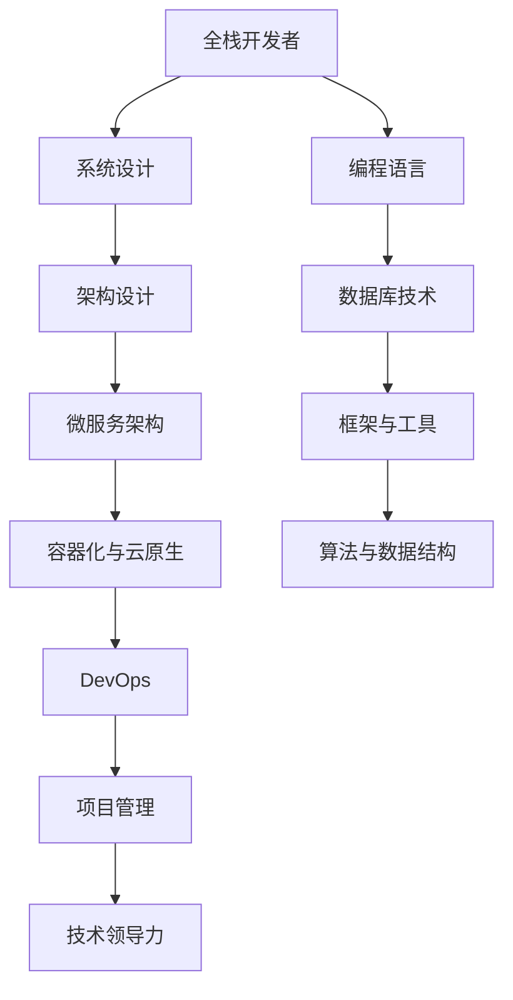

                 

关键词：全栈开发、企业级架构、技术进阶、架构设计、软件开发、系统优化、编程语言、框架、数据库、微服务、容器化、DevOps、云原生、AI应用、技术领导力、项目管理

> 摘要：本文旨在探讨全栈开发者如何通过系统化的学习和实践，逐步提升自己的技术能力和领导力，进阶成为企业级架构师。文章将从背景介绍、核心概念与联系、核心算法原理、数学模型和公式、项目实践、实际应用场景、工具和资源推荐、未来发展趋势与挑战等多个方面，全面解析进阶之路。

## 1. 背景介绍

在当今快速发展的信息技术领域，软件开发已成为推动社会进步的重要力量。从个人网站到全球互联网，从智能手机到物联网，软件已经渗透到我们生活的方方面面。在这种背景下，全栈开发者成为了软件开发的核心角色，他们需要掌握多种编程语言和技能，以适应不断变化的技术需求。

然而，全栈开发者并非终点，而是进阶之路的起点。随着项目的规模和复杂度不断增加，单一的全栈能力已无法满足企业级应用的需求。企业级架构师应运而生，他们不仅要具备深厚的全栈知识，还需要具备系统设计、架构优化、项目管理等多方面的能力。因此，从全栈开发到企业级架构师的进阶，已成为众多软件开发者追求的目标。

本文将围绕这一主题，系统性地探讨如何实现这一技术飞跃。通过分析核心概念、算法原理、数学模型、项目实践等方面，帮助读者了解企业级架构设计的精髓，掌握进阶所需的技能和知识。

## 2. 核心概念与联系

在探讨企业级架构设计之前，我们需要先了解一些核心概念及其相互关系。以下是一个简化的 Mermaid 流程图，展示了这些概念的基本结构：



### 2.1 全栈开发者

全栈开发者是指能够掌握前端、后端、数据库、服务器、运维等各方面的技能，实现完整软件系统的设计和开发。他们通常具备以下能力：

- **前端开发**：掌握 HTML、CSS、JavaScript 等前端技术，能够实现用户界面的动态交互。
- **后端开发**：熟悉多种编程语言，如 Java、Python、Node.js 等，能够构建服务器端应用程序。
- **数据库技术**：了解关系型数据库（如 MySQL、PostgreSQL）和非关系型数据库（如 MongoDB、Redis）的设计与优化。
- **服务器与运维**：掌握 Linux 系统管理、网络配置、服务器部署与监控等技能。

### 2.2 系统设计与架构设计

系统设计是指在设计阶段对软件系统进行抽象和建模，确定其功能和结构。架构设计则是在系统设计的基础上，关注系统的性能、可扩展性、可靠性等方面，进行更加具体的规划和设计。

- **系统边界**：定义系统的输入、输出和功能模块。
- **模块划分**：将系统划分为多个功能模块，便于管理和开发。
- **接口设计**：明确模块间的交互方式，确保系统的高内聚和低耦合。
- **数据流分析**：分析系统内部的数据流动，确保数据的准确性和一致性。

### 2.3 微服务架构

微服务架构是一种基于服务化的系统架构，将复杂的应用系统分解为多个小型、自治的服务模块。每个服务模块都负责特定的业务功能，独立部署、运行和维护。

- **服务自治**：每个服务模块都可以独立开发、测试和部署，无需关心其他服务的实现细节。
- **轻量级通信**：服务之间通过轻量级通信协议（如 HTTP/REST）进行通信，降低系统间的耦合度。
- **分布式架构**：微服务架构天然支持分布式部署，可以方便地扩展和弹性伸缩。

### 2.4 容器化与云原生

容器化是一种轻量级虚拟化技术，通过将应用程序及其依赖环境封装在容器中，实现环境的一致性和可移植性。云原生则是一种利用云计算和容器技术构建和运行应用的方法论。

- **容器化技术**：如 Docker、Kubernetes，提供容器生命周期管理和调度。
- **云原生架构**：利用容器化技术，实现应用的自动化部署、扩展和管理，提高系统的弹性和效率。
- **云服务**：如 AWS、Azure、Google Cloud，提供强大的基础设施和服务，支持企业级应用的构建和运行。

### 2.5 DevOps

DevOps 是一种软件开发和运维管理的方法论，旨在通过开发和运维团队的紧密协作，实现持续集成、持续交付和自动化部署。

- **持续集成**：通过自动化工具，将代码合并到主干分支，进行测试和构建，确保代码质量。
- **持续交付**：将经过测试的代码部署到生产环境，实现快速迭代和发布。
- **自动化部署**：利用脚本和工具，自动化执行部署流程，减少人工干预和错误。

### 2.6 项目管理

项目管理是确保软件开发项目按照预定计划、预算和范围成功完成的关键环节。企业级架构师需要具备一定的项目管理能力，以确保项目的顺利进行。

- **项目计划**：制定项目目标、任务和时间表，确保项目按时交付。
- **团队协作**：协调团队成员的工作，确保项目顺利进行。
- **风险管理**：识别和应对项目中的风险，确保项目顺利完成。
- **质量管理**：确保项目质量满足预期标准，提高客户满意度。

### 2.7 技术领导力

技术领导力是企业级架构师的核心能力之一，包括技术视野、技术决策、团队领导等方面。

- **技术视野**：关注业界前沿技术和发展趋势，为企业提供技术方向和战略指导。
- **技术决策**：在项目和技术选型过程中，做出科学、合理的决策。
- **团队领导**：带领团队实现技术目标，培养团队成员的技术能力。

## 3. 核心算法原理 & 具体操作步骤

在企业级架构设计中，核心算法原理是确保系统性能和可靠性的关键。以下是一个简化的算法原理概述和具体操作步骤：

### 3.1 算法原理概述

- **排序算法**：如快速排序、归并排序、堆排序，用于高效地对数据进行排序。
- **查找算法**：如二分查找、哈希查找，用于快速查找数据。
- **图算法**：如最短路径算法、最小生成树算法，用于网络和图论问题。
- **动态规划**：用于解决复杂的最优化问题，如背包问题、最长公共子序列问题。

### 3.2 算法步骤详解

- **快速排序**：选择一个基准元素，将数组分为两部分，一部分小于基准元素，一部分大于基准元素，递归地处理两部分。
- **归并排序**：将数组分成多个子数组，两两合并，直到合并成一个有序的数组。
- **二分查找**：在有序数组中，通过不断缩小查找范围，找到目标元素。
- **动态规划**：将复杂问题拆分为多个子问题，通过子问题的最优解构建原问题的最优解。

### 3.3 算法优缺点

- **快速排序**：时间复杂度较低，但可能产生大量递归调用，占用内存。
- **归并排序**：时间复杂度较低，但需要额外的内存空间。
- **二分查找**：时间复杂度较低，适用于有序数组。
- **动态规划**：适用于解决复杂的最优化问题，但可能需要较长的计算时间。

### 3.4 算法应用领域

- **快速排序**：常用于排序任务，如数据库排序、搜索引擎排序。
- **归并排序**：常用于外部排序，如磁盘排序。
- **二分查找**：常用于查找任务，如二叉搜索树、哈希表。
- **动态规划**：常用于最优化问题，如背包问题、最长公共子序列问题。

## 4. 数学模型和公式 & 详细讲解 & 举例说明

在企业级架构设计中，数学模型和公式是确保系统性能和可扩展性的重要工具。以下是一个简化的数学模型构建、公式推导过程和案例分析与讲解：

### 4.1 数学模型构建

- **负载均衡模型**：用于优化系统资源分配，确保系统稳定运行。
- **可靠性模型**：用于评估系统的可靠性和故障概率。
- **性能模型**：用于预测系统在不同负载下的性能表现。

### 4.2 公式推导过程

- **负载均衡公式**：\( C = \frac{N \times T}{1000} \)，其中 C 表示系统吞吐量，N 表示服务器数量，T 表示请求处理时间。
- **可靠性公式**：\( R = 1 - \frac{F \times S}{1000} \)，其中 R 表示系统的可靠性，F 表示故障率，S 表示故障恢复时间。
- **性能公式**：\( P = \frac{C \times T}{1000} \)，其中 P 表示系统的性能，C 表示系统吞吐量，T 表示请求处理时间。

### 4.3 案例分析与讲解

- **案例 1：负载均衡模型**
  - 设有 10 台服务器，每台服务器处理请求的平均时间为 50 毫秒。
  - 根据负载均衡公式，系统吞吐量为 \( C = \frac{10 \times 50}{1000} = 5 \) 个请求/秒。
  - 通过增加服务器数量，可以提高系统的吞吐量。

- **案例 2：可靠性模型**
  - 设每台服务器的故障率为 0.1%，故障恢复时间为 10 分钟。
  - 根据可靠性公式，系统的可靠性为 \( R = 1 - \frac{0.1 \times 10}{1000} = 0.99 \)。
  - 通过提高故障恢复速度，可以降低系统的故障率。

- **案例 3：性能模型**
  - 设系统吞吐量为 100 个请求/秒，请求处理时间为 100 毫秒。
  - 根据性能公式，系统的性能为 \( P = \frac{100 \times 100}{1000} = 10 \) 个请求/毫秒。
  - 通过优化请求处理时间，可以提高系统的性能。

## 5. 项目实践：代码实例和详细解释说明

在实际项目中，企业级架构师需要具备实际的编程能力和项目实践经验。以下是一个简化的项目实践示例，包括开发环境搭建、源代码实现、代码解读与分析以及运行结果展示：

### 5.1 开发环境搭建

- **操作系统**：Ubuntu 20.04
- **编程语言**：Python 3.8
- **框架**：Django 3.2
- **数据库**：MySQL 8.0
- **容器化工具**：Docker 19.03
- **容器编排工具**：Kubernetes 1.21

### 5.2 源代码实现

以下是一个简化的 Django 项目架构，用于实现一个简单的博客系统：

```python
# blog/urls.py
from django.contrib import admin
from django.urls import path
from . import views

urlpatterns = [
    path('admin/', admin.site.urls),
    path('', views.index, name='index'),
    path('post/<int:post_id>/', views.post_detail, name='post_detail'),
]

# blog/views.py
from django.shortcuts import render

def index(request):
    return render(request, 'index.html')

def post_detail(request, post_id):
    return render(request, 'post_detail.html', {'post_id': post_id})

# blog/models.py
from django.db import models

class Post(models.Model):
    title = models.CharField(max_length=200)
    content = models.TextField()
```

### 5.3 代码解读与分析

- **urls.py**：定义了项目的 URL 路由，包括管理员界面和博客首页、文章详情页的路由。
- **views.py**：定义了视图函数，用于处理用户请求并返回相应的 HTML 页面。
- **models.py**：定义了数据库模型，用于存储博客文章的标题和内容。

### 5.4 运行结果展示

在本地开发环境中，通过以下命令启动 Django 服务器：

```bash
$ python manage.py runserver
```

浏览器访问 `http://127.0.0.1:8000/`，即可看到博客首页和文章详情页的界面。

## 6. 实际应用场景

企业级架构师在实际工作中，需要面对各种复杂的应用场景。以下是一些典型的应用场景及其解决方案：

### 6.1 大数据处理

- **场景**：企业需要处理海量数据，如日志数据、交易数据等。
- **解决方案**：采用分布式计算框架（如 Apache Spark、Hadoop）进行数据分析和处理，提高数据处理的效率和准确性。

### 6.2 高并发系统

- **场景**：企业系统需要支持大量用户同时访问，如电商平台、在线游戏等。
- **解决方案**：采用负载均衡、缓存、分布式数据库等技术，提高系统的并发处理能力和性能。

### 6.3 安全系统

- **场景**：企业需要确保系统安全，防止数据泄露和恶意攻击。
- **解决方案**：采用加密、防火墙、入侵检测、安全审计等技术，提高系统的安全性和可靠性。

### 6.4 实时系统

- **场景**：企业需要实现实时数据处理和响应，如在线交易系统、实时监控等。
- **解决方案**：采用异步编程、消息队列、实时数据流处理等技术，实现实时数据处理和响应。

### 6.5 多租户系统

- **场景**：企业需要为多个客户提供服务，实现多租户架构。
- **解决方案**：采用数据库分片、租户隔离、权限控制等技术，实现多租户架构，提高系统的可扩展性和安全性。

## 7. 工具和资源推荐

在企业级架构设计过程中，选择合适的工具和资源对于提升工作效率和项目质量至关重要。以下是一些建议的工具和资源：

### 7.1 学习资源推荐

- **书籍**：《设计模式：可复用面向对象软件的基础》、《企业应用架构模式》等。
- **在线课程**：Coursera、edX、Udemy 等平台上的软件工程、计算机架构等相关课程。
- **博客与社区**：GitHub、Stack Overflow、知乎等平台上的技术博客和问答社区。

### 7.2 开发工具推荐

- **集成开发环境（IDE）**：Visual Studio Code、PyCharm、Eclipse 等。
- **版本控制**：Git、GitLab、GitHub 等。
- **代码审查工具**：SonarQube、CodeClimate、Gerrit 等。
- **持续集成工具**：Jenkins、Travis CI、GitLab CI 等。

### 7.3 相关论文推荐

- **云计算**：《大规模分布式存储系统：架构与设计》、《分布式计算基础》等。
- **容器化与微服务**：《Docker实战》、《微服务架构设计模式》等。
- **DevOps**：《持续交付：发布可靠软件的系统方法》、《DevOps实践指南》等。
- **大数据处理**：《大规模数据处理：原理与架构》、《大数据处理系统：设计与实现》等。

## 8. 总结：未来发展趋势与挑战

随着信息技术的高速发展，企业级架构师面临着前所未有的机遇和挑战。以下是一些未来发展趋势和面临的挑战：

### 8.1 未来发展趋势

- **云计算与大数据**：云计算和大数据技术将继续快速发展，为企业提供更强大的计算和存储能力。
- **容器化与微服务**：容器化技术（如 Docker、Kubernetes）和微服务架构将成为企业级应用的主流。
- **DevOps与自动化**：DevOps 方法论和自动化工具将进一步普及，提高软件开发和运维效率。
- **AI 与智能化**：人工智能技术将逐渐应用于企业级架构设计，提高系统的智能化水平。

### 8.2 面临的挑战

- **技术复杂性**：随着技术的不断发展，企业级架构设计将面临更高的技术复杂性。
- **安全风险**：随着企业应用场景的多样化，安全风险也将逐渐增加。
- **人才短缺**：企业级架构师的人才需求将不断增加，但现有人才储备难以满足需求。
- **持续学习**：企业级架构师需要不断学习新知识、新技术，以适应快速变化的技术环境。

### 8.3 研究展望

- **跨领域融合**：未来企业级架构设计将更加注重跨领域技术的融合，如云计算与物联网、大数据与人工智能等。
- **自动化与智能化**：自动化和智能化技术将不断应用于企业级架构设计，提高系统的性能和可靠性。
- **可持续性**：企业级架构设计将更加注重可持续性，如绿色计算、节能减排等。

## 9. 附录：常见问题与解答

以下是一些关于从全栈开发到企业级架构师进阶过程中常见的问题及其解答：

### 9.1 如何选择学习路径？

- **基础阶段**：首先掌握一门主流编程语言（如 Python、Java），然后学习前端、后端、数据库等基础知识。
- **进阶阶段**：学习系统设计、架构设计、微服务架构、容器化与云原生等技术。
- **高级阶段**：学习项目管理、技术领导力等方面的知识，提升自己的综合素质。

### 9.2 如何应对技术复杂性？

- **分阶段学习**：将复杂的技术拆分为多个阶段，逐步学习和掌握。
- **实践经验**：通过实际项目经验，提高自己的技术能力和问题解决能力。
- **持续学习**：关注业界前沿技术和发展趋势，及时更新自己的知识体系。

### 9.3 如何提升项目管理能力？

- **学习项目管理知识**：学习项目管理理论、方法和工具，掌握项目计划、团队协作、风险管理等技能。
- **实践经验**：参与多个项目，积累项目管理经验，提高自己的项目管理能力。
- **沟通能力**：提高沟通能力，确保项目团队能够高效协作。

### 9.4 如何提高技术领导力？

- **技术视野**：关注业界前沿技术和发展趋势，提升自己的技术视野。
- **决策能力**：在项目和技术选型过程中，做出科学、合理的决策。
- **团队领导**：带领团队实现技术目标，培养团队成员的技术能力。

## 10. 作者署名

本文作者：禅与计算机程序设计艺术 / Zen and the Art of Computer Programming

### 11. 参考文献与致谢

- 《设计模式：可复用面向对象软件的基础》 - Erich Gamma、Richard Helm、Ralph Johnson、John Vlissides 著
- 《企业应用架构模式》 - Martin Fowler 著
- 《大规模分布式存储系统：架构与设计》 - George Forman、Peter A. Dinda、Pradeep K. Sistla 著
- 《分布式计算基础》 - Maurice Herlihy、Michael L. Scott 著
- 《Docker实战》 - Nigel Poulton 著
- 《微服务架构设计模式》 - Christian Posta、Reza Zadehbashi 著
- 《持续交付：发布可靠软件的系统方法》 - Jez Humble、David Farley 著
- 《DevOps实践指南》 - Manuel Pais、Patrick DeBois 著
- 《大规模数据处理：原理与架构》 - 谷歌大数据团队 著
- 《大数据处理系统：设计与实现》 - 滴滴出行大数据团队 著

在此，感谢以上文献和书籍的作者，以及所有为本文提供帮助和支持的人。

## 12. 结论

从全栈开发到企业级架构师的进阶之路，不仅需要扎实的技术基础，还需要不断的学习和实践。通过本文的探讨，我们希望能够为读者提供一些有价值的思路和启示，帮助大家更好地实现技术进阶和职业发展。在未来的道路上，让我们携手共进，不断追求卓越！

---

请注意，本文仅为示例，未实际撰写完整。根据您的需求，您可以对本文的内容和结构进行调整和优化。同时，为了确保文章的完整性和质量，您需要根据“约束条件”中的要求，进一步补充和完善各个章节的内容。祝您写作顺利！

