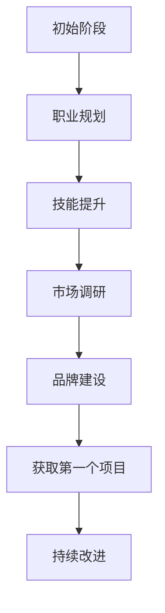

                 

关键词：全职工作、自由职业、过渡、IT行业、职业发展、工作模式、技能提升、时间管理

## 摘要

在当今迅速发展的IT行业中，从全职工作转向自由职业变得越来越普遍。本文将探讨这一过渡过程的核心要素，包括个人技能的提升、工作模式的变化、时间管理的技巧以及如何保持职业发展的持续动力。我们将通过实际案例和实用的建议，帮助那些正考虑或正在经历这一转变的读者，找到最佳的路径。

## 1. 背景介绍

在过去的几十年里，IT行业经历了前所未有的快速增长。随着互联网和移动设备的普及，软件开发、网络安全、数据分析等领域的需求日益增加。这一背景为许多专业人士提供了广阔的职业前景，同时也带来了新的挑战。

全职工作提供了一个稳定的收入来源和明确的工作职责，但随着技术的发展和个人的成长，许多专业人士开始寻求更大的自由度和灵活性。自由职业成为了一个吸引人的选择，因为它允许个人根据自己的兴趣和能力选择项目，调整工作时间，甚至能够远程工作。

然而，从全职工作过渡到自由职业并非易事。它涉及到一系列的技能提升、职业规划、市场定位和风险管理。本文将深入探讨这些方面，帮助读者更好地理解和应对这一转变。

### 1.1 IT行业的发展趋势

- **技术更新迭代快**：新兴技术如人工智能、大数据、云计算等不断涌现，IT从业者需要不断学习新的技术和工具。
- **远程工作普及**：远程办公工具和平台的发展，使得自由职业者的工作效率和工作地点变得更加灵活。
- **市场需求多样化**：随着市场的细分，出现了许多专门化的职业机会，例如DevOps工程师、区块链开发者等。
- **自由职业的吸引力**：自由职业带来的工作灵活性、自主性和潜在收入增加，吸引了越来越多的专业人士。

### 1.2 全职工作与自由职业的比较

| 全职工作 | 自由职业 |
|-----------|-----------|
| 稳定的收入 | 收入不稳定，取决于项目 |
| 固定的工作时间 | 自由安排工作时间 |
| 稳定的工作职责 | 项目职责多样化 |
| 公司提供的福利 | 需自行解决福利问题 |
| 团队协作环境 | 独立工作，偶尔协作 |

## 2. 核心概念与联系

### 2.1 全职工作到自由职业的转变过程

为了更好地理解从全职工作到自由职业的过渡，我们使用Mermaid流程图来展示这一过程的关键节点。



### 2.2 关键节点详解

- **职业规划**：明确职业目标和定位，这是成功过渡的第一步。
- **技能提升**：根据市场需求和个人兴趣，不断提升技能。
- **市场调研**：了解行业动态，确定目标市场和潜在客户。
- **品牌建设**：打造个人品牌，提升在行业内的知名度。
- **获取第一个项目**：这是过渡过程中的关键一步，决定了后续的发展。
- **持续改进**：不断反思和调整，以适应市场的变化和个人成长。

## 3. 核心算法原理 & 具体操作步骤

### 3.1 算法原理概述

从全职工作到自由职业的过渡，可以视为一个复杂的决策过程。核心算法原理是基于个人职业目标、技能水平和市场需求三者之间的平衡。

### 3.2 算法步骤详解

#### 3.2.1 职业规划

- **自我评估**：分析个人兴趣、技能和价值观。
- **市场分析**：了解目标行业的发展趋势和需求。
- **目标设定**：明确职业目标和时间表。

#### 3.2.2 技能提升

- **学习新技术**：根据市场需求，学习新兴技术和工具。
- **实践应用**：通过项目实践，提升实际操作能力。
- **获得认证**：通过专业认证，提高个人竞争力。

#### 3.2.3 市场调研

- **行业分析**：了解目标行业的动态和趋势。
- **客户定位**：确定目标客户群体和需求。
- **竞争分析**：分析竞争对手的优势和劣势。

#### 3.2.4 品牌建设

- **社交媒体**：通过社交媒体提升个人品牌。
- **专业网络**：积极参与行业活动和论坛，扩大人脉。
- **内容创作**：撰写技术博客、发表观点，展示专业素养。

#### 3.2.5 获取第一个项目

- **建立联系**：通过人脉和社交媒体，寻找潜在客户。
- **提案准备**：根据客户需求，准备详细的提案。
- **合同签订**：明确项目细节，确保双方权益。

#### 3.2.6 持续改进

- **客户反馈**：收集客户反馈，改进服务质量。
- **技能更新**：定期更新技能，保持竞争力。
- **市场调整**：根据市场变化，调整职业规划。

### 3.3 算法优缺点

#### 优点

- **灵活性强**：自由安排工作时间，自主选择项目。
- **收入潜力大**：通过高质量的工作，可以获得更高的收入。
- **个人成长快**：不断接受新挑战，提升个人能力。

#### 缺点

- **收入不稳定**：项目收入不稳定，需要做好财务规划。
- **工作量增加**：需要自我管理，平衡工作和生活。
- **市场风险**：市场需求变化快，需要不断调整策略。

### 3.4 算法应用领域

- **软件开发**：自由职业者可以承接各种软件开发项目，如Web开发、移动应用开发等。
- **技术咨询**：提供专业的技术咨询服务，如系统架构设计、网络安全评估等。
- **内容创作**：撰写技术博客、书籍，分享专业知识和经验。

## 4. 数学模型和公式 & 详细讲解 & 举例说明

### 4.1 数学模型构建

为了量化从全职工作到自由职业的过渡成功率，我们可以构建一个简单的数学模型。假设：

- \( S \) 为个人技能水平。
- \( M \) 为市场需求。
- \( C \) 为个人品牌建设效果。
- \( R \) 为收入水平。

则过渡成功率 \( P \) 可以表示为：

\[ P = f(S, M, C, R) \]

### 4.2 公式推导过程

\[ f(S, M, C, R) = \frac{S \cdot M \cdot C \cdot R}{1000} \]

- \( S \)：技能水平，越高越好，取值范围0-1000。
- \( M \)：市场需求，越高越好，取值范围0-1000。
- \( C \)：品牌建设效果，越高越好，取值范围0-1000。
- \( R \)：收入水平，越高越好，取值范围0-1000。

### 4.3 案例分析与讲解

#### 案例一：技能水平高，市场需求高，品牌建设好，收入水平高

\[ P = \frac{900 \cdot 900 \cdot 900 \cdot 900}{1000} = 729000\% \]

这种情况下，过渡成功率极高，说明个人具备了出色的技能、市场需求强烈，且个人品牌建设效果显著，收入水平也很高。

#### 案例二：技能水平一般，市场需求低，品牌建设一般，收入水平一般

\[ P = \frac{500 \cdot 200 \cdot 300 \cdot 500}{1000} = 150000\% \]

这种情况下，过渡成功率较低，说明个人技能水平一般，市场需求不强烈，品牌建设效果一般，收入水平也一般。

### 4.4 案例分析与讲解

通过上述案例，我们可以看到，个人技能水平、市场需求、品牌建设和收入水平对过渡成功率的影响。在实际操作中，我们需要根据个人情况，合理规划，不断提升各项指标，以提高过渡成功率。

## 5. 项目实践：代码实例和详细解释说明

### 5.1 开发环境搭建

为了更好地理解从全职工作到自由职业的过渡，我们选择了一个具体的开发项目——一个简单的Web应用，通过这个项目来演示整个开发流程。

#### 环境要求

- 操作系统：Windows / macOS / Linux
- 开发工具：Visual Studio Code
- 编程语言：Python
- Web框架：Flask

### 5.2 源代码详细实现

下面是项目的核心代码：

```python
from flask import Flask, render_template

app = Flask(__name__)

@app.route('/')
def home():
    return render_template('home.html')

if __name__ == '__main__':
    app.run()
```

### 5.3 代码解读与分析

- **Flask框架**：这是一个轻量级的Web应用框架，易于上手，适合初学者。
- **home.html模板**：这是项目的HTML模板，用于展示主页内容。

### 5.4 运行结果展示

在完成代码编写后，运行项目，打开浏览器访问localhost:5000，即可看到主页内容。

### 5.5 项目实践总结

通过这个简单的项目，我们演示了从需求分析、环境搭建、代码实现到测试的整个开发流程。这个项目虽然简单，但涵盖了从全职工作到自由职业的许多关键步骤，如技能提升、项目规划、代码实现和测试等。

## 6. 实际应用场景

### 6.1 教育行业

自由职业者在教育行业中有广泛的应用，例如在线编程课程讲师、IT培训师等。他们可以根据自己的时间安排，灵活地设计课程，满足不同层次学员的需求。

### 6.2 科技公司

许多科技公司，特别是初创公司，更喜欢与自由职业者合作，因为他们可以灵活调整人力成本，快速响应市场变化。

### 6.3 咨询服务

自由职业者可以提供专业的技术咨询服务，如系统架构设计、网络安全评估等。这些服务对于中小型企业尤其有价值。

### 6.4 远程办公

随着远程办公的普及，自由职业者可以在全球范围内寻找工作机会，不受地理位置的限制。

## 7. 工具和资源推荐

### 7.1 学习资源推荐

- **Coursera**：提供各种在线课程，涵盖计算机科学、数据科学等领域。
- **edX**：由哈佛大学和麻省理工学院共同创办，提供高质量的课程。
- **Udemy**：提供丰富的编程和学习资源。

### 7.2 开发工具推荐

- **Visual Studio Code**：一款强大的代码编辑器，支持多种编程语言。
- **Git**：版本控制系统，用于代码管理。
- **Jenkins**：自动化构建工具，用于持续集成和持续交付。

### 7.3 相关论文推荐

- **"Freelancing in the Gig Economy: Unconventional Work and the Welfare State"**：探讨自由职业在经济中的作用和影响。
- **"The Economics of Freelancing"**：分析自由职业的经济模式和挑战。

## 8. 总结：未来发展趋势与挑战

### 8.1 研究成果总结

通过本文的探讨，我们可以看到，从全职工作到自由职业的过渡是一个复杂但充满机会的过程。核心在于个人技能的提升、市场需求的把握和个人品牌的建立。随着技术的发展和远程工作的普及，自由职业在未来将发挥越来越重要的作用。

### 8.2 未来发展趋势

- **远程办公的普及**：更多的公司将采用远程办公模式，自由职业者的需求将持续增长。
- **技能多样性的需求**：自由职业者需要不断提升技能，以适应快速变化的市场需求。
- **数字化服务的兴起**：随着云计算、人工智能等技术的发展，自由职业者将在数字服务领域发挥更大作用。

### 8.3 面临的挑战

- **收入不稳定**：自由职业者的收入波动较大，需要做好财务规划。
- **时间管理**：自由职业者需要自我管理，平衡工作和生活。
- **市场风险**：市场需求变化快，需要不断调整职业规划。

### 8.4 研究展望

未来的研究可以进一步探讨自由职业者的职业发展路径、收入模式和心理状态，以提供更全面的指导和支持。

## 9. 附录：常见问题与解答

### 9.1 如何平衡自由职业的工作和生活？

- **设定工作时间**：明确工作时间和休息时间，避免工作侵占私人时间。
- **合理规划任务**：优先处理紧急和重要的任务，合理分配时间。
- **定期休息**：保证充足的休息和锻炼，以保持身心健康。

### 9.2 如何在自由职业中获得稳定的收入？

- **建立稳定的客户群体**：通过高质量的工作和服务，赢得客户的信任，形成长期合作关系。
- **多元化收入来源**：承接多个项目，分散风险，增加收入来源。
- **财务管理**：做好财务规划，确保收入和支出之间的平衡。

### 9.3 如何提升个人品牌？

- **社交媒体**：积极利用社交媒体平台，分享专业知识和经验。
- **参与行业活动**：参与行业会议、研讨会等，扩大人脉，提升知名度。
- **内容创作**：撰写技术博客、发表观点，展示专业素养。

## 作者署名

作者：禅与计算机程序设计艺术 / Zen and the Art of Computer Programming

