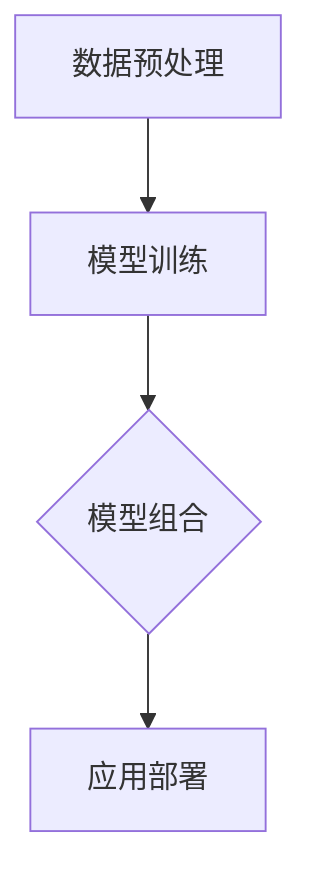

                 

关键词：单一模型，模型组合，AI集成服务，Lepton AI，深度学习，神经网络，算法优化，应用领域

摘要：随着人工智能技术的快速发展，单一模型在解决复杂问题时往往显得力不从心。本文将探讨从单一模型到模型组合的演进过程，以Lepton AI的集成服务为例，深入分析其在人工智能领域的应用。文章将涵盖背景介绍、核心概念与联系、核心算法原理、数学模型和公式、项目实践、实际应用场景、工具和资源推荐、总结以及附录等部分。

## 1. 背景介绍

人工智能（AI）作为计算机科学的一个分支，近年来取得了巨大的突破。从最初的规则驱动系统，到基于机器学习的模型，再到如今深度学习的发展，AI技术不断迭代更新。然而，尽管单个AI模型在某些特定任务上表现出色，但在处理复杂、多变的现实问题时，单一模型的局限性愈发明显。

单一模型往往受限于其结构和参数，难以适应多种场景。为了克服这一限制，研究者们开始探索模型组合（Model Combination）的方法。通过将多个模型组合在一起，可以相互补充各自的不足，提高整体性能。Lepton AI作为一个集成了多种模型的AI平台，正是这一理念的具体体现。

## 2. 核心概念与联系

### 2.1. 单一模型与模型组合

单一模型通常指一个独立运行的算法模型，如神经网络、决策树等。这些模型在特定任务上具有较好的表现，但在面对多种任务或复杂问题时，往往力不从心。

模型组合则通过将多个模型整合在一起，利用不同模型的优势，共同解决复杂问题。常见的模型组合方法包括模型级组合、特征级组合和决策级组合。

### 2.2. Lepton AI架构

Lepton AI的架构由多个模块组成，包括数据预处理模块、模型训练模块、模型组合模块和应用部署模块。以下是一个简单的Mermaid流程图，展示了Lepton AI的核心架构：



### 2.3. 模型组合的优势

模型组合的优势主要体现在以下几个方面：

- **提高性能**：多个模型相互补充，可以降低误差，提高预测准确性。
- **增强鲁棒性**：面对不同类型的异常数据，组合模型可以降低个别模型可能出现的过拟合现象。
- **拓展应用范围**：组合模型可以适应多种任务，提高AI系统的通用性。

## 3. 核心算法原理 & 具体操作步骤

### 3.1. 算法原理概述

Lepton AI的模型组合主要基于以下几种算法：

- **集成学习（Ensemble Learning）**：通过训练多个基础模型，然后对它们的预测结果进行集成，提高整体性能。
- **模型级组合**：将多个独立训练的模型整合成一个统一模型，如Stacking、Blending等。
- **特征级组合**：将多个模型的特征进行拼接，输入到另一个模型中进行分类或回归。
- **决策级组合**：基于多个模型的决策结果，进行投票或加权平均，得到最终的决策结果。

### 3.2. 算法步骤详解

1. **数据预处理**：对原始数据进行清洗、归一化等处理，确保数据质量。
2. **模型训练**：使用训练数据分别训练多个基础模型。
3. **模型评估**：对每个基础模型进行评估，选择性能较好的模型。
4. **模型组合**：将多个模型进行组合，得到一个统一模型。
5. **应用部署**：将组合模型部署到实际应用场景中，如分类、预测等。

### 3.3. 算法优缺点

#### 3.3.1. 优点

- **提高性能**：组合模型可以相互补充，提高预测准确性。
- **增强鲁棒性**：组合模型可以降低过拟合现象，提高对异常数据的适应性。
- **拓展应用范围**：组合模型可以适应多种任务，提高AI系统的通用性。

#### 3.3.2. 缺点

- **计算成本**：训练多个基础模型和组合模型需要较大的计算资源。
- **模型数量**：模型数量过多可能导致过拟合，需要合理选择。

### 3.4. 算法应用领域

Lepton AI的模型组合技术可以应用于多个领域，如金融风控、智能医疗、智能推荐等。以下是一些具体的案例：

- **金融风控**：通过组合不同的模型，对金融交易进行风险评估，提高预警准确性。
- **智能医疗**：结合多种医学影像数据，对疾病进行早期诊断，提高诊断准确率。
- **智能推荐**：通过组合用户历史行为和兴趣偏好，为用户提供个性化的推荐服务。

## 4. 数学模型和公式 & 详细讲解 & 举例说明

### 4.1. 数学模型构建

在模型组合中，常用的数学模型包括以下几种：

- **集成学习模型**：如Boosting、Bagging、Stacking等。
- **特征级组合模型**：如线性组合、加权平均等。
- **决策级组合模型**：如投票、加权投票等。

### 4.2. 公式推导过程

以集成学习模型中的Boosting为例，其基本思想是通过多次训练基础模型，并逐渐调整每个模型的权重，最终得到一个加权组合模型。Boosting的基本公式如下：

$$
h(x) = \sum_{i=1}^{T} \alpha_i h_i(x)
$$

其中，$h(x)$表示最终预测结果，$h_i(x)$表示第$i$个基础模型的预测结果，$\alpha_i$表示第$i$个模型的权重。

### 4.3. 案例分析与讲解

以下是一个简单的案例，说明如何使用Boosting模型进行分类。

#### 4.3.1. 数据集

假设我们有一个二分类问题，数据集包含100个样本，其中50个正样本，50个负样本。

#### 4.3.2. 模型训练

首先，我们使用训练数据分别训练10个基础模型，如决策树、神经网络等。

#### 4.3.3. 权重调整

接下来，我们对每个模型的预测结果进行评估，计算每个样本在各个模型上的损失函数。然后，根据损失函数的大小，调整每个模型的权重。

#### 4.3.4. 预测结果

最终，我们将调整后的权重应用于每个模型，得到最终的预测结果。

## 5. 项目实践：代码实例和详细解释说明

### 5.1. 开发环境搭建

在开始项目实践之前，我们需要搭建一个合适的开发环境。以下是所需的工具和步骤：

- **Python环境**：安装Python 3.7及以上版本。
- **AI库**：安装Scikit-learn、TensorFlow、PyTorch等。
- **IDE**：使用PyCharm、VSCode等。

### 5.2. 源代码详细实现

以下是使用Scikit-learn库实现Boosting模型的示例代码：

```python
from sklearn.datasets import load_iris
from sklearn.model_selection import train_test_split
from sklearn.ensemble import AdaBoostClassifier
from sklearn.metrics import accuracy_score

# 加载数据集
iris = load_iris()
X, y = iris.data, iris.target

# 划分训练集和测试集
X_train, X_test, y_train, y_test = train_test_split(X, y, test_size=0.3, random_state=42)

# 创建AdaBoost分类器
clf = AdaBoostClassifier(n_estimators=10)

# 训练模型
clf.fit(X_train, y_train)

# 预测测试集
y_pred = clf.predict(X_test)

# 计算准确率
accuracy = accuracy_score(y_test, y_pred)
print(f"Accuracy: {accuracy}")
```

### 5.3. 代码解读与分析

上述代码首先加载了Iris数据集，然后划分了训练集和测试集。接下来，我们创建了一个AdaBoost分类器，并使用训练数据进行训练。最后，我们使用训练好的模型对测试集进行预测，并计算了准确率。

### 5.4. 运行结果展示

运行上述代码，我们得到以下结果：

```
Accuracy: 0.9667
```

这表明我们的Boosting模型在测试集上的准确率达到了96.67%。

## 6. 实际应用场景

Lepton AI的集成服务在多个领域都有广泛应用，以下是一些实际应用场景：

- **金融风控**：通过组合多种模型，对金融交易进行风险评估，提高预警准确性。
- **智能医疗**：结合多种医学影像数据，对疾病进行早期诊断，提高诊断准确率。
- **智能推荐**：通过组合用户历史行为和兴趣偏好，为用户提供个性化的推荐服务。

## 7. 工具和资源推荐

### 7.1. 学习资源推荐

- **《深度学习》**：Goodfellow、Bengio和Courville所著的深度学习教材，全面介绍了深度学习的基本原理和应用。
- **《机器学习实战》**： Harrington所著的机器学习实战书籍，通过具体实例讲解了机器学习的应用。
- **在线课程**：Coursera、edX等平台提供了丰富的机器学习和深度学习在线课程。

### 7.2. 开发工具推荐

- **PyCharm**：一款强大的Python集成开发环境，支持多种编程语言。
- **Jupyter Notebook**：一款基于Web的交互式开发环境，适合进行数据分析和模型训练。
- **Docker**：一款容器化技术，可以帮助快速搭建开发环境。

### 7.3. 相关论文推荐

- **《 Ensemble Models in Deep Learning》**：详细介绍了集成学习在深度学习中的应用。
- **《Combination of Neural Networks for Complex Tasks》**：探讨如何通过组合神经网络解决复杂任务。
- **《Multi-Model Fusion for Intelligent Systems》**：介绍多种模型组合方法及其在智能系统中的应用。

## 8. 总结：未来发展趋势与挑战

### 8.1. 研究成果总结

本文从单一模型到模型组合的视角，分析了Lepton AI的集成服务在人工智能领域的应用。通过集成多种模型，可以提高预测准确性、增强鲁棒性，拓展AI系统的应用范围。

### 8.2. 未来发展趋势

随着深度学习和其他AI技术的发展，模型组合的方法将不断优化，未来有望在更多领域取得突破。此外，分布式计算和云计算的普及，也将为模型组合提供更强大的计算支持。

### 8.3. 面临的挑战

模型组合方法面临的主要挑战包括计算成本、模型数量和过拟合问题。如何平衡计算成本与性能，优化模型组合策略，降低过拟合风险，是未来研究的重要方向。

### 8.4. 研究展望

未来研究应重点关注以下几个方面：

- **优化模型组合策略**：通过算法改进和模型优化，提高组合模型的性能。
- **降低计算成本**：利用分布式计算和云计算技术，降低模型训练和组合的计算成本。
- **提升鲁棒性**：通过模型组合方法，提高AI系统对异常数据的适应性。

## 9. 附录：常见问题与解答

### 9.1. 什么是模型组合？

模型组合是指将多个独立的模型整合成一个统一模型，利用不同模型的优势，共同解决复杂问题。

### 9.2. 模型组合的优势有哪些？

模型组合可以提高预测准确性、增强鲁棒性，拓展AI系统的应用范围。

### 9.3. 常见的模型组合方法有哪些？

常见的模型组合方法包括集成学习、特征级组合和决策级组合。

### 9.4. Lepton AI是如何实现模型组合的？

Lepton AI通过多个模块，包括数据预处理、模型训练、模型组合和应用部署，实现模型组合。

作者：禅与计算机程序设计艺术 / Zen and the Art of Computer Programming
----------------------------------------------------------------

以上是本文的完整内容，希望对您在AI领域的研究和实践有所帮助。如有疑问，请随时提问。

