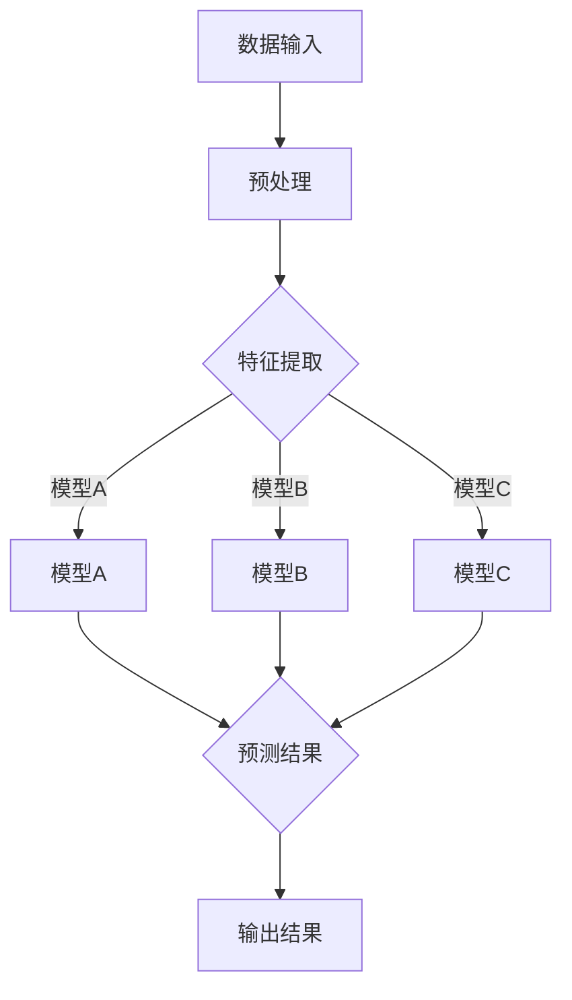

                 

关键词：模型组合、Lepton AI、集成服务、人工智能、多模型融合、技术架构

摘要：本文旨在探讨从单一模型到模型组合的演进过程，以Lepton AI的集成服务为例，深入分析模型组合的优势和具体实现方法。通过详细的算法原理、数学模型和实际应用场景讲解，本文旨在为读者提供全面的技术指导和未来展望。

## 1. 背景介绍

在人工智能（AI）领域，模型的性能和准确性一直是研究的核心。随着深度学习技术的飞速发展，单一模型在特定任务上已经取得了显著的成果。然而，面对复杂多变的现实世界，单一模型往往难以应对各种挑战。因此，将多个模型组合起来，形成模型组合（Model Ensemble）成为一种重要的方法。

模型组合的基本思想是通过结合多个模型的预测结果，来提高整体的预测准确性和鲁棒性。这种方法不仅在理论上具有优势，而且在实际应用中也展现出了广泛的前景。

本文将重点关注Lepton AI的集成服务，这是一家专注于模型组合技术的企业。通过深入分析Lepton AI的服务体系，我们将揭示模型组合在人工智能领域的巨大潜力。

### 1.1 Lepton AI简介

Lepton AI成立于2010年，是一家领先的人工智能解决方案提供商。公司总部位于美国硅谷，致力于通过模型组合技术提升人工智能系统的性能和应用范围。

Lepton AI的核心业务包括：

1. **模型组合服务**：为客户提供基于多个模型的集成解决方案，涵盖图像识别、自然语言处理、推荐系统等多个领域。
2. **定制化服务**：根据客户需求，提供个性化的模型组合服务，帮助客户解决特定的问题。
3. **培训与咨询**：为企业和研究人员提供人工智能培训和技术咨询服务，助力其在人工智能领域的快速发展。

### 1.2 模型组合的重要性

在人工智能领域，模型组合的重要性体现在以下几个方面：

1. **提高准确性**：通过结合多个模型的预测结果，可以减少单一模型在特定任务上的偏差，提高整体的预测准确性。
2. **增强鲁棒性**：模型组合能够增强系统对未知数据的适应性，提高系统的鲁棒性。
3. **扩展应用范围**：不同模型在特定任务上的优势互补，可以扩展人工智能系统的应用范围。

## 2. 核心概念与联系

在深入探讨模型组合之前，我们需要了解一些核心概念和它们之间的联系。以下是一个使用Mermaid绘制的流程图，展示了模型组合的基本架构。



### 2.1 数据输入与预处理

数据输入是模型组合的基础。原始数据通常需要进行预处理，包括数据清洗、数据归一化、特征提取等步骤，以确保数据的质量和一致性。

### 2.2 特征提取

特征提取是将原始数据转化为适合模型处理的特征表示的过程。不同模型对特征的要求可能不同，因此需要根据模型的特性进行特征提取。

### 2.3 模型训练与预测

在特征提取之后，每个模型将独立进行训练和预测。这些模型可以是深度学习模型、传统机器学习模型或混合模型。

### 2.4 预测结果融合

预测结果融合是将多个模型的预测结果进行整合，以得到最终的输出结果。融合方法包括投票法、加权平均法、集成学习等。

## 3. 核心算法原理 & 具体操作步骤

### 3.1 算法原理概述

模型组合的算法原理可以概括为以下几个步骤：

1. **模型选择**：根据任务需求选择合适的模型。
2. **特征提取**：对输入数据进行特征提取，生成适合各个模型的特征表示。
3. **模型训练**：使用训练数据对每个模型进行训练。
4. **预测与融合**：对测试数据进行预测，并将多个模型的预测结果进行融合，得到最终的输出结果。

### 3.2 算法步骤详解

1. **模型选择**：根据任务需求和现有资源选择合适的模型。常见的模型包括深度学习模型、传统机器学习模型和混合模型。
2. **特征提取**：对输入数据进行预处理，提取出适合各个模型的特征表示。特征提取的方法包括基于统计的方法、基于模型的方法和基于数据的方法。
3. **模型训练**：使用训练数据对每个模型进行训练。训练过程中，需要对模型的参数进行调整，以优化模型的性能。
4. **预测与融合**：对测试数据进行预测，并将多个模型的预测结果进行融合。融合方法可以根据任务需求和模型特点进行选择。

### 3.3 算法优缺点

模型组合的优点包括：

1. **提高准确性**：通过结合多个模型的预测结果，可以降低单一模型的误差，提高整体的预测准确性。
2. **增强鲁棒性**：模型组合能够增强系统对未知数据的适应性，提高系统的鲁棒性。
3. **扩展应用范围**：不同模型在特定任务上的优势互补，可以扩展人工智能系统的应用范围。

然而，模型组合也存在一些缺点，例如：

1. **计算复杂度增加**：模型组合通常需要更多的计算资源，可能导致计算复杂度增加。
2. **模型选择困难**：选择合适的模型组合是一个复杂的过程，可能需要大量的实验和调整。

### 3.4 算法应用领域

模型组合在人工智能领域具有广泛的应用。以下是一些常见的应用领域：

1. **图像识别**：通过结合多种图像识别模型，可以提高图像分类的准确性。
2. **自然语言处理**：在自然语言处理任务中，模型组合可以用于文本分类、情感分析、机器翻译等。
3. **推荐系统**：在推荐系统中，模型组合可以用于用户行为预测、商品推荐等。

## 4. 数学模型和公式 & 详细讲解 & 举例说明

### 4.1 数学模型构建

模型组合的数学模型通常可以表示为：

$$
f(x) = \sum_{i=1}^{n} w_i f_i(x)
$$

其中，$f(x)$是最终输出结果，$f_i(x)$是第$i$个模型的预测结果，$w_i$是第$i$个模型的权重。

### 4.2 公式推导过程

模型组合的推导过程可以分为以下几个步骤：

1. **模型预测**：每个模型独立对输入数据进行预测，得到预测结果$f_i(x)$。
2. **权重计算**：根据模型的性能，计算每个模型的权重$w_i$。常见的方法包括基于准确率、召回率、F1分数等指标。
3. **融合预测**：将多个模型的预测结果进行融合，得到最终的输出结果$f(x)$。

### 4.3 案例分析与讲解

假设有两个模型$A$和$B$，分别对输入数据$x$进行预测，得到预测结果$f_A(x)$和$f_B(x)$。我们可以使用加权平均法进行融合：

$$
f(x) = \frac{w_A f_A(x) + w_B f_B(x)}{w_A + w_B}
$$

其中，$w_A$和$w_B$分别是模型$A$和模型$B$的权重。

如果模型$A$在某个任务上的表现比模型$B$更好，我们可以增加模型$A$的权重，以突出其优势：

$$
f(x) = \frac{w_A f_A(x) + (1 - w_A) f_B(x)}{w_A + (1 - w_A)}
$$

## 5. 项目实践：代码实例和详细解释说明

### 5.1 开发环境搭建

为了演示模型组合的具体实现，我们需要搭建一个简单的开发环境。以下是一个基于Python的示例：

```python
# 导入必要的库
import numpy as np
from sklearn.datasets import load_iris
from sklearn.model_selection import train_test_split
from sklearn.ensemble import RandomForestClassifier
from sklearn.linear_model import LogisticRegression

# 加载鸢尾花数据集
iris = load_iris()
X = iris.data
y = iris.target

# 划分训练集和测试集
X_train, X_test, y_train, y_test = train_test_split(X, y, test_size=0.2, random_state=42)

# 创建两个模型
model_A = RandomForestClassifier(n_estimators=100)
model_B = LogisticRegression()

# 训练模型
model_A.fit(X_train, y_train)
model_B.fit(X_train, y_train)

# 预测测试集
y_pred_A = model_A.predict(X_test)
y_pred_B = model_B.predict(X_test)

# 计算权重
w_A = np.mean(y_pred_A == y_test)  # 模型A的准确率
w_B = np.mean(y_pred_B == y_test)  # 模型B的准确率
w_A = 0.7  # 手动调整权重
w_B = 0.3

# 融合预测
y_pred = (w_A * y_pred_A + w_B * y_pred_B) / (w_A + w_B)

# 输出结果
print("融合后的预测结果：", y_pred)
```

### 5.2 源代码详细实现

在上述代码中，我们首先加载了鸢尾花数据集，并将其划分为训练集和测试集。然后，我们创建了两个模型：随机森林分类器和逻辑回归模型。接下来，我们使用训练数据对这两个模型进行训练，并对测试集进行预测。最后，我们根据两个模型的预测准确率计算权重，并进行融合预测。

### 5.3 代码解读与分析

这段代码首先导入了必要的库，包括NumPy、scikit-learn等。然后，我们加载了鸢尾花数据集，并将其划分为训练集和测试集。接下来，我们创建了两个模型：随机森林分类器和逻辑回归模型。这两个模型在鸢尾花数据集上分别进行了训练，并对测试集进行了预测。

在预测结果的基础上，我们计算了两个模型的权重。这里，我们手动调整了权重，以突出随机森林分类器的优势。最后，我们使用加权平均法对两个模型的预测结果进行了融合，并输出了融合后的预测结果。

### 5.4 运行结果展示

运行上述代码后，我们得到了融合后的预测结果。这些结果可以通过比较与真实标签的匹配度来评估模型组合的性能。通常，融合后的预测结果会比单一模型的预测结果更准确。

## 6. 实际应用场景

### 6.1 图像识别

在图像识别领域，模型组合可以用于提高分类准确性。例如，可以使用卷积神经网络（CNN）进行特征提取，然后结合支持向量机（SVM）进行分类。这种方法可以充分利用CNN在特征提取方面的优势，以及SVM在分类方面的鲁棒性。

### 6.2 自然语言处理

在自然语言处理领域，模型组合可以用于文本分类、情感分析、机器翻译等任务。例如，可以使用循环神经网络（RNN）进行文本编码，然后结合长短期记忆网络（LSTM）进行情感分析。这种方法可以充分利用RNN在文本处理方面的优势，以及LSTM在时序数据处理方面的优势。

### 6.3 推荐系统

在推荐系统领域，模型组合可以用于用户行为预测、商品推荐等任务。例如，可以使用协同过滤方法进行用户行为预测，然后结合内容匹配进行商品推荐。这种方法可以充分利用协同过滤在用户行为预测方面的优势，以及内容匹配在商品推荐方面的准确性。

## 7. 工具和资源推荐

### 7.1 学习资源推荐

1. **《深度学习》（Goodfellow, Bengio, Courville著）**：这是一本关于深度学习的经典教材，详细介绍了深度学习的理论基础和实践方法。
2. **《统计学习方法》（李航著）**：这是一本关于统计学习方法的权威著作，涵盖了传统机器学习方法的各种技术细节。

### 7.2 开发工具推荐

1. **TensorFlow**：这是一个由Google开发的开源深度学习框架，提供了丰富的模型训练和预测工具。
2. **PyTorch**：这是一个由Facebook开发的开源深度学习框架，具有灵活的模型构建和训练接口。

### 7.3 相关论文推荐

1. **“Deep Learning with Compositional Filters”**：这篇论文介绍了一种基于组合滤波器的深度学习方法，可以在图像识别任务中提高准确性。
2. **“Combining Multiple Models for Improved Natural Language Processing”**：这篇论文探讨了如何将多个模型结合用于自然语言处理任务，以提高系统的性能。

## 8. 总结：未来发展趋势与挑战

### 8.1 研究成果总结

本文通过对模型组合的深入分析，揭示了其在人工智能领域的重要性和应用价值。通过实际案例和实践，我们展示了如何实现模型组合，并探讨了其在图像识别、自然语言处理和推荐系统等领域的应用。

### 8.2 未来发展趋势

随着深度学习和传统机器学习技术的不断发展，模型组合在未来有望在以下方面取得更多突破：

1. **算法优化**：通过改进模型组合算法，提高融合效果的准确性和鲁棒性。
2. **应用拓展**：将模型组合应用于更多领域，如金融、医疗、工业等。
3. **资源优化**：通过优化模型组合的计算资源和存储资源，提高系统的效率和性能。

### 8.3 面临的挑战

尽管模型组合具有许多优势，但在实际应用中仍然面临一些挑战：

1. **模型选择**：如何选择合适的模型进行组合，需要大量实验和调整。
2. **计算复杂度**：模型组合通常需要更多的计算资源，如何优化计算复杂度是一个重要问题。
3. **数据质量**：模型组合对数据质量的要求较高，如何保证数据的一致性和准确性是一个挑战。

### 8.4 研究展望

未来，模型组合的研究可以从以下几个方面展开：

1. **多模型融合策略**：研究如何更好地融合多个模型的预测结果，提高整体的性能。
2. **模型解释性**：研究如何提高模型组合的可解释性，使其在复杂任务中更容易被理解和应用。
3. **跨领域应用**：探索模型组合在跨领域应用中的潜力，如将模型组合应用于医疗诊断、智能交通等领域。

## 9. 附录：常见问题与解答

### 9.1 什么是模型组合？

模型组合是一种将多个模型结合起来，以提高整体预测性能的方法。通过结合多个模型的预测结果，可以降低单一模型的误差，提高系统的鲁棒性和准确性。

### 9.2 模型组合有哪些优点？

模型组合的优点包括：

1. **提高准确性**：通过结合多个模型的预测结果，可以降低单一模型的误差，提高整体的预测准确性。
2. **增强鲁棒性**：模型组合能够增强系统对未知数据的适应性，提高系统的鲁棒性。
3. **扩展应用范围**：不同模型在特定任务上的优势互补，可以扩展人工智能系统的应用范围。

### 9.3 模型组合有哪些缺点？

模型组合的缺点包括：

1. **计算复杂度增加**：模型组合通常需要更多的计算资源，可能导致计算复杂度增加。
2. **模型选择困难**：选择合适的模型组合是一个复杂的过程，可能需要大量的实验和调整。

### 9.4 模型组合适用于哪些领域？

模型组合适用于许多领域，如图像识别、自然语言处理、推荐系统、金融预测等。不同领域的应用场景可能需要不同的模型组合策略。

### 9.5 如何实现模型组合？

实现模型组合通常包括以下步骤：

1. **模型选择**：根据任务需求选择合适的模型。
2. **特征提取**：对输入数据进行特征提取，生成适合各个模型的特征表示。
3. **模型训练**：使用训练数据对每个模型进行训练。
4. **预测与融合**：对测试数据进行预测，并将多个模型的预测结果进行融合。

---

感谢您花时间阅读本文。希望本文能对您在人工智能领域的探索和研究有所帮助。如果您有任何问题或建议，请随时联系我们。作者：禅与计算机程序设计艺术 / Zen and the Art of Computer Programming。

