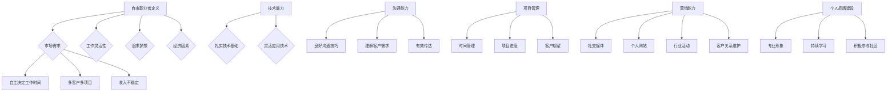

                 

关键词：自由职业者、独立开发者、技术转型、职业规划、个人品牌

> 摘要：本文将探讨在信息技术领域从一名员工转变为自由职业者的过程。我们将分析这一转变的原因、所需技能、市场策略和个人品牌建设等方面，并给出具体的实践建议。通过这篇文章，希望帮助读者更好地理解自由职业者的生活方式，以及如何在IT行业中成功实现这一转变。

## 1. 背景介绍

在当今信息技术飞速发展的时代，越来越多的IT专业人士选择从传统全职岗位转向自由职业。这种趋势不仅仅是因为互联网提供了更多的机会，更是因为自由职业所带来的灵活性和自主性受到了广泛的认可。从员工到自由职业者的转变，不仅意味着职业身份的变化，更是对个人生活方式、职业规划和未来发展的重新思考。

### 1.1 转变原因

- **市场需求**：互联网和远程工作的普及，使得远程开发和自由职业成为可能。越来越多的企业倾向于采用外部服务，以减少运营成本和人力资源的约束。
- **工作灵活性**：自由职业者可以根据自己的时间表工作，享受更多的自由和灵活性。
- **追求梦想**：很多人追求创造自己的项目或者参与自己感兴趣的技术领域，而不愿意受限于单一雇主。
- **经济因素**：一些专业人士希望通过自由职业获得更高的收入，尤其是在技能和经验积累到一定程度后。

### 1.2 转变挑战

- **收入不稳定**：自由职业者的收入来源不如全职工作稳定，需要做好财务规划。
- **自我管理**：自由职业者需要良好的时间管理和项目管理能力，以保持工作的效率和进度。
- **个人品牌建设**：在竞争激烈的自由职业市场中，建立和维护个人品牌至关重要。

## 2. 核心概念与联系

为了更好地理解从员工到自由职业者的转变，我们需要了解以下几个核心概念：

### 2.1 自由职业者定义

自由职业者是指在一段特定时间内，为多个客户或项目提供服务，而非全职为单一雇主工作的人。他们通常拥有以下几个特点：

- **自主决定工作时间**：自由职业者可以根据自己的喜好和工作进度安排工作时间。
- **多客户多项目**：自由职业者通常会同时参与多个项目，服务于不同的客户。
- **收入不稳定**：收入受项目完成情况和客户需求的影响，可能存在波动。

### 2.2 技能要求

- **技术能力**：作为自由职业者，必须具备扎实的技术基础，能够在多个项目中灵活应用。
- **沟通能力**：良好的沟通技巧有助于与客户建立良好的关系，理解客户需求并有效传达。
- **项目管理**：自由职业者需要具备项目管理能力，确保项目按时完成并满足客户期望。
- **营销能力**：自由职业者需要掌握一定的市场营销技能，通过社交媒体、个人网站等方式吸引潜在客户。

### 2.3 市场策略

- **建立个人品牌**：通过在社交媒体上分享专业知识和成果，建立个人品牌。
- **开发个人网站**：展示专业技能和以往的项目经验，便于潜在客户了解。
- **参加行业活动**：参与行业会议、讲座等活动，扩大人脉，增加曝光率。
- **客户关系维护**：与现有客户保持良好关系，获取口碑推荐。

### 2.4 个人品牌建设

- **专业形象**：保持专业形象，包括个人着装、语言表达等方面。
- **持续学习**：不断更新知识和技能，保持竞争力。
- **积极参与社区**：参与技术社区、开源项目等，增加影响力。

以下是关于自由职业者核心概念的 Mermaid 流程图：



## 3. 核心算法原理 & 具体操作步骤

### 3.1 算法原理概述

从员工到自由职业者的转变过程，可以视为一个复杂的决策过程。这个过程涉及到多个因素，包括个人技能、市场需求、经济状况、心理因素等。以下是一个简化的决策模型，用于指导这一转变过程。

### 3.2 算法步骤详解

#### 步骤1：自我评估

- **技能评估**：对自己在技术、沟通、项目管理等方面的能力进行评估，确定自己的核心竞争力。
- **兴趣评估**：分析自己对哪些技术领域感兴趣，以及是否愿意为这些领域投入时间和精力。

#### 步骤2：市场调研

- **行业趋势**：了解当前市场对自由职业者的需求，特别是自己在技术领域的市场前景。
- **竞争对手**：研究同行的工作方式、定价策略、客户来源等，以了解市场环境。

#### 步骤3：制定计划

- **短期目标**：设定在自由职业者初期需要实现的目标，如收入目标、客户数量、项目类型等。
- **长期规划**：考虑自己的职业发展路径，以及如何在未来几年内实现这一目标。

#### 步骤4：品牌建设

- **建立个人网站**：展示自己的技能、经验和成就，方便客户了解。
- **社交媒体运营**：在LinkedIn、Twitter、GitHub等平台上分享专业知识和项目成果。
- **参与社区**：参与技术社区，贡献代码、撰写文章，提升影响力。

#### 步骤5：实施策略

- **寻找客户**：通过各种渠道寻找潜在客户，如参加行业会议、加入相关群组、发布招聘广告等。
- **项目管理**：确保项目按时完成，并满足客户期望，以获取良好的口碑。
- **持续学习**：不断更新知识和技能，以适应市场需求的变化。

### 3.3 算法优缺点

#### 优点

- **灵活性**：自由职业者可以根据自己的时间表工作，享有更高的自由度。
- **经济收益**：在市场需求旺盛的情况下，自由职业者可以获得较高的收入。
- **职业成长**：自由职业者可以参与多个项目，从中学习到不同的技能和经验。

#### 缺点

- **收入不稳定**：自由职业者的收入受项目数量和市场需求的影响，可能存在波动。
- **自我管理**：自由职业者需要具备良好的时间管理和项目管理能力。
- **品牌建设**：自由职业者需要投入大量时间和精力来建立个人品牌。

### 3.4 算法应用领域

- **软件开发**：自由职业者在软件开发领域有着广泛的应用，包括Web开发、移动应用开发、游戏开发等。
- **数据分析**：自由职业者在数据分析领域也具有很高的需求，特别是在数据挖掘、机器学习等方面。
- **网站设计**：自由职业者在网站设计领域有着广阔的市场，提供网站建设、SEO优化等服务。

## 4. 数学模型和公式 & 详细讲解 & 举例说明

### 4.1 数学模型构建

为了更好地理解自由职业者的收益模型，我们可以构建一个简单的收益模型。假设一个自由职业者的月收入 \( R \) 与客户数量 \( C \) 和项目利润率 \( P \) 有关，可以用以下公式表示：

\[ R = C \times P \]

其中：
- \( R \)：月收入（单位：美元）；
- \( C \)：月客户数量；
- \( P \)：项目利润率（单位：美元/客户）。

### 4.2 公式推导过程

为了推导上述公式，我们需要考虑以下因素：

- **客户数量**：客户数量直接影响月收入。每个客户都可能带来一定金额的利润。
- **项目利润率**：项目利润率决定了每个客户能带来的利润。

通过上述分析，我们可以得到月收入 \( R \) 与客户数量 \( C \) 和项目利润率 \( P \) 的关系。

### 4.3 案例分析与讲解

假设一位自由职业者在一个月内完成了3个客户的项目，每个客户的项目利润率均为100美元。那么，该自由职业者的月收入可以计算如下：

\[ R = 3 \times 100 = 300 \text{ 美元} \]

如果我们希望提高收入，可以采取以下策略：

- **增加客户数量**：通过扩大市场、参加活动、提升个人品牌等方式吸引更多客户。
- **提高项目利润率**：通过提升自身技能、优化项目流程、降低成本等方式提高项目利润率。

### 4.4 模型扩展

在实际应用中，我们还可以扩展上述模型，考虑以下因素：

- **项目类型**：不同类型的项目可能会有不同的利润率。
- **客户类型**：不同类型的客户可能会有不同的利润贡献。
- **工作时长**：工作时长可能影响月收入，因为某些项目可能需要更多的时间来完成。

通过扩展模型，我们可以更准确地预测自由职业者的月收入，并为策略调整提供依据。

## 5. 项目实践：代码实例和详细解释说明

### 5.1 开发环境搭建

为了实现上述收益模型的计算，我们需要搭建一个简单的开发环境。以下是一个基于Python的示例：

- **Python环境**：确保安装了Python 3.6或以上版本。
- **IDE**：可以使用PyCharm、VS Code等IDE。

### 5.2 源代码详细实现

以下是一个简单的Python代码实现，用于计算自由职业者的月收入：

```python
def calculate_monthly_income(customers, profit_per_customer):
    """
    计算月收入
    :param customers: 客户数量
    :param profit_per_customer: 每个客户的利润
    :return: 月收入
    """
    return customers * profit_per_customer

# 示例数据
customers = 3
profit_per_customer = 100

# 计算月收入
monthly_income = calculate_monthly_income(customers, profit_per_customer)
print(f"月收入：{monthly_income}美元")
```

### 5.3 代码解读与分析

- **函数定义**：`calculate_monthly_income` 函数用于计算月收入，输入参数为客户数量和每个客户的利润。
- **示例数据**：通过设置`customers`和`profit_per_customer`的值，我们可以计算具体的月收入。
- **输出结果**：函数返回计算得到的月收入，并通过打印输出。

### 5.4 运行结果展示

运行上述代码，输出结果如下：

```
月收入：300美元
```

这表示，在一个月内完成3个客户的项目，每个客户的项目利润率为100美元时，自由职业者的月收入为300美元。

## 6. 实际应用场景

### 6.1 软件开发

在软件开发领域，自由职业者可以通过提供Web开发、移动应用开发、游戏开发等服务来获得收入。以下是一些实际应用场景：

- **Web开发**：为企业或个人提供网站建设、SEO优化、内容管理系统（如WordPress）等服务。
- **移动应用开发**：为iOS和Android平台开发应用程序，提供游戏、工具、社交媒体等类型的应用。
- **游戏开发**：参与游戏开发项目，提供游戏设计、编程、美术设计等服务。

### 6.2 数据分析

在数据分析领域，自由职业者可以为企业提供数据挖掘、机器学习、统计分析等服务。以下是一些实际应用场景：

- **数据挖掘**：帮助企业发现数据中的模式和趋势，为决策提供支持。
- **机器学习**：开发机器学习模型，实现预测、分类、聚类等功能。
- **统计分析**：提供数据分析和报告，帮助企业了解业务状况和市场需求。

### 6.3 网站设计

在网站设计领域，自由职业者可以提供网站设计、用户体验（UX）设计、用户界面（UI）设计等服务。以下是一些实际应用场景：

- **网站设计**：为企业或个人设计专业的网站，提升品牌形象。
- **用户体验设计**：优化网站的用户体验，提高用户留存率和转化率。
- **用户界面设计**：设计吸引人的用户界面，提升用户的使用体验。

## 7. 未来应用展望

### 7.1 人工智能与自由职业者的结合

随着人工智能技术的发展，自由职业者可以利用人工智能工具提高工作效率。例如：

- **自动化编程**：使用生成式人工智能工具自动编写代码，提高开发效率。
- **智能项目管理**：使用人工智能工具进行项目进度监控和风险管理。
- **智能沟通**：利用自然语言处理技术，实现与客户的智能对话，提高沟通效率。

### 7.2 区块链在自由职业者中的应用

区块链技术为自由职业者提供了安全的交易和支付方式。以下是一些应用场景：

- **数字身份验证**：通过区块链技术验证个人身份，提高信任度。
- **智能合约**：使用智能合约自动化执行合同条款，减少纠纷。
- **跨境支付**：利用区块链实现快速、安全的跨境支付。

### 7.3 自由职业者的职业发展

随着自由职业者市场的不断发展，未来的自由职业者将面临更多的职业发展机会。以下是一些建议：

- **技能提升**：不断学习新技术，提升自身技能，以适应市场需求。
- **专业认证**：获取专业认证，提高市场竞争力。
- **多元化发展**：在技术领域内探索新的方向，如咨询、培训、社区管理等。

## 8. 工具和资源推荐

### 8.1 学习资源推荐

- **在线课程**：Coursera、Udemy、edX等平台上提供丰富的IT课程。
- **技术社区**：GitHub、Stack Overflow、Reddit等，提供最新的技术讨论和学习资源。
- **专业书籍**：购买或借阅相关领域的专业书籍，系统地学习知识。

### 8.2 开发工具推荐

- **集成开发环境（IDE）**：PyCharm、VS Code等，提供强大的开发功能。
- **版本控制系统**：Git、GitHub等，用于代码管理和协作开发。
- **测试工具**：Selenium、JUnit等，用于自动化测试和代码质量保证。

### 8.3 相关论文推荐

- **人工智能领域**：《深度学习》（Deep Learning），Ian Goodfellow等著。
- **数据分析领域**：《数据挖掘：实用工具和技术》（Data Mining: Practical Machine Learning Tools and Techniques），Ibnayhmed等著。
- **区块链领域**：《区块链技术指南》（Blockchain: Blueprint for a New Economy），Melanie Swan著。

## 9. 总结：未来发展趋势与挑战

### 9.1 研究成果总结

本文探讨了从员工到自由职业者的转变过程，分析了转变的原因、核心概念、算法原理、数学模型、实际应用场景、未来发展趋势和工具资源。通过这些分析，我们认识到自由职业者在信息技术领域有着广阔的发展前景。

### 9.2 未来发展趋势

- **市场需求增加**：随着远程工作和数字经济的普及，自由职业者的市场需求将不断增加。
- **技术工具升级**：人工智能、区块链等新技术将为自由职业者提供更多工具和机会。
- **职业多元化**：自由职业者的职业领域将逐渐多元化，覆盖更多的技术和业务领域。

### 9.3 面临的挑战

- **收入不稳定**：自由职业者的收入受项目数量和市场波动的影响，需要做好财务规划。
- **自我管理**：自由职业者需要良好的时间管理和项目管理能力，以保持工作进度和效率。
- **品牌建设**：在竞争激烈的自由职业市场中，建立和维护个人品牌至关重要。

### 9.4 研究展望

未来的研究可以进一步探讨自由职业者在不同技术和行业中的应用，以及如何更好地利用新技术提高工作效率。同时，研究如何帮助自由职业者建立有效的个人品牌，提高市场竞争力，也是值得关注的领域。

## 10. 附录：常见问题与解答

### 10.1 如何开始自由职业？

**解答**：开始自由职业的第一步是明确自己的技能和兴趣。接下来，可以通过以下步骤：

1. **自我评估**：确定自己在哪些领域具有优势。
2. **建立个人品牌**：通过个人网站、社交媒体等渠道展示自己的技能和成就。
3. **寻找客户**：通过参加行业活动、加入相关社区、发布招聘广告等方式寻找潜在客户。
4. **项目管理**：学习项目管理技巧，确保项目按时完成并满足客户期望。

### 10.2 自由职业者的收入如何保障？

**解答**：自由职业者的收入来源多样，可以通过以下方式保障：

1. **多元化客户**：与多个客户建立合作关系，减少收入波动。
2. **积累项目经验**：通过不断完成项目，提升自己的技能和市场价值。
3. **提高项目利润率**：通过提升工作效率、优化项目流程、降低成本等方式提高项目利润率。
4. **财务规划**：做好财务规划，确保有足够的储备金应对不确定的收入波动。

### 10.3 自由职业者如何保持竞争力？

**解答**：自由职业者要保持竞争力，可以从以下几个方面入手：

1. **持续学习**：不断更新知识和技能，紧跟行业发展趋势。
2. **专业认证**：获取专业认证，提高市场认可度。
3. **积极参与社区**：参与技术社区、开源项目等，扩大人脉和影响力。
4. **个性化服务**：根据客户需求提供定制化的服务，提升客户满意度。

### 10.4 自由职业者的税收问题如何处理？

**解答**：自由职业者需要了解自己所在国家的税收政策，并遵循相关规定。以下是一些建议：

1. **注册税务登记**：在所在国家或地区注册税务登记，确保合法合规。
2. **了解税种**：了解需要缴纳的税种，如所得税、社会保险费等。
3. **保留凭证**：保存所有收入和支出的凭证，以便进行税务申报。
4. **咨询专业税务顾问**：如有需要，可以咨询专业税务顾问，确保符合当地税收政策。

## 作者署名

本文作者：禅与计算机程序设计艺术 / Zen and the Art of Computer Programming

---

本文围绕从员工到自由职业者的转变展开讨论，包括转变的原因、所需技能、市场策略和个人品牌建设等方面。通过具体的实践案例和数学模型，我们深入分析了自由职业者的收入保障和竞争力保持方法。此外，文章还展望了未来发展趋势，并推荐了相关的学习资源、开发工具和论文。希望本文能为有意从事自由职业的IT专业人士提供有益的参考。

