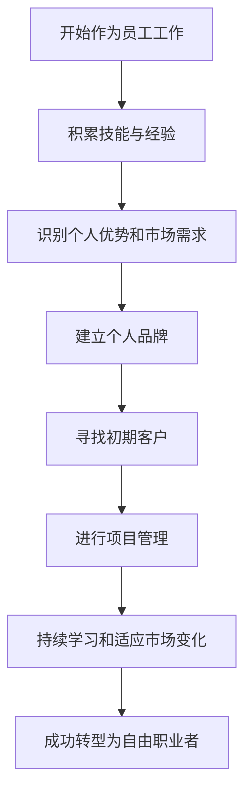

                 

关键词：自由职业者，独立开发者，职业转型，远程工作，个人品牌，技能提升，商业模式，客户管理，项目管理，时间管理，创业。

> 摘要：本文将深入探讨从员工到自由职业者的转型过程，分析转型的必要性、面临的挑战以及如何成功实现转型。通过分享实用的技巧和建议，为希望走上独立职业道路的IT专业人士提供一份全面的指南。

## 1. 背景介绍

### 1.1 员工到自由职业者的转型必要性

在当今快速发展的技术时代，数字化和远程工作的普及使得自由职业者的角色越来越受到重视。以下是一些促使员工考虑转型为自由职业者的主要原因：

- **灵活的工作时间**：自由职业者可以根据自己的日程安排工作，享受更高的工作与生活平衡。
- **多样化的项目机会**：自由职业者有机会接触不同领域和行业，拓宽视野，提高技能。
- **更高的收入潜力**：自由职业者可以根据市场需求和自身能力设定收费标准，理论上具有更高的收入潜力。
- **自主决策权**：自由职业者可以自主选择项目和客户，根据个人兴趣和专长进行工作。

### 1.2 转型过程中的挑战

尽管转型为自由职业者具有许多优势，但这一过程并非没有挑战。以下是一些常见的挑战：

- **客户来源不稳定**：自由职业者初期可能会面临客户来源不稳定的挑战。
- **个人品牌建设**：建立强大的个人品牌需要时间、精力和资源。
- **时间管理**：自由职业者需要更加自律，有效管理时间，确保工作进度和质量。
- **项目管理**：自由职业者需要掌握项目管理技能，确保项目按时、按质完成。

## 2. 核心概念与联系

以下是一个简化的Mermaid流程图，展示了从员工到自由职业者转型的关键步骤和核心概念：



### 2.1 开始作为员工工作

在职业生涯的早期，通过作为员工工作，可以积累必要的技能和经验。这些经验和技能将在未来的自由职业道路上发挥关键作用。

### 2.2 积累技能与经验

作为员工，应该专注于提升以下方面的技能：

- **技术技能**：不断学习新的编程语言、框架和工具，保持技术竞争力。
- **项目管理**：参与不同类型的项目，了解项目管理的各个环节，包括需求分析、进度控制、风险评估等。
- **沟通能力**：与团队成员、客户和管理层有效沟通，确保项目顺利进行。

### 2.3 识别个人优势和市场需求

在转型为自由职业者之前，需要明确自己的优势和市场需求。以下是一些步骤：

- **自我评估**：分析自己的技能、兴趣和价值观，确定最擅长和最感兴趣的领域。
- **市场调研**：了解目标市场的需求，包括薪资水平、项目类型和客户偏好。
- **竞争分析**：研究竞争对手的优势和不足，找到自己的差异化点。

### 2.4 建立个人品牌

建立个人品牌是自由职业者成功的关键因素。以下是一些策略：

- **专业网站**：建立个人网站或博客，展示技能、项目和成就。
- **社交媒体**：在LinkedIn、Twitter、GitHub等平台上活跃，分享专业见解和成果。
- **参加行业活动**：参加技术会议、研讨会和网络研讨会，扩大人脉，提高知名度。

### 2.5 寻找初期客户

初期客户的来源至关重要。以下是一些建议：

- **推荐**：通过朋友、前同事和行业联系人获取推荐。
- **线上平台**：使用Upwork、Freelancer等自由职业者平台，参与竞标。
- **社交媒体**：通过社交媒体推广自己的服务和项目。
- **行业会议**：在行业会议和活动中展示自己，吸引潜在客户。

### 2.6 进行项目管理

自由职业者需要掌握项目管理技能，以确保项目按时、按质完成。以下是一些关键点：

- **需求分析**：与客户沟通，明确项目需求和目标。
- **时间规划**：制定详细的时间表，分配任务，确保工作进度。
- **风险管理**：识别潜在风险，制定应对策略。
- **质量控制**：定期检查工作进度，确保符合质量标准。
- **沟通与反馈**：与客户保持定期沟通，及时反馈进展和问题。

### 2.7 持续学习和适应市场变化

自由职业者需要不断学习和适应市场变化，以下是一些建议：

- **技术更新**：定期学习新的技术趋势和工具，保持技术竞争力。
- **市场研究**：了解市场动态和客户需求，调整服务策略。
- **个人发展**：参加在线课程、研讨会和培训，提升个人技能和知识。

## 3. 核心算法原理 & 具体操作步骤

### 3.1 算法原理概述

在自由职业者的职业转型过程中，算法原理可以被视为一种系统的思维方式，帮助个体识别、规划和实现职业目标。核心算法原理包括：

- **自我评估**：通过心理测试、技能评估和经验总结，识别个人优势和短板。
- **市场调研**：通过数据分析、竞品分析和用户调研，了解市场需求和竞争态势。
- **品牌建设**：运用市场营销原理，打造专业、独特的个人品牌。
- **项目管理**：应用项目管理知识，确保项目的顺利执行和交付。

### 3.2 算法步骤详解

#### 3.2.1 自我评估

1. **技能识别**：列出所有已掌握的技能，包括硬技能（如编程语言、数据库管理）和软技能（如沟通、团队合作）。
2. **优势分析**：针对每个技能，评估其在市场上的竞争力和个人兴趣。
3. **短板识别**：识别在技能和经验上的不足，制定改进计划。

#### 3.2.2 市场调研

1. **数据分析**：收集目标市场的数据，包括薪资水平、项目类型和行业趋势。
2. **竞品分析**：研究竞争对手的服务内容、价格策略和市场定位。
3. **用户调研**：通过与潜在客户的交流，了解他们的需求和偏好。

#### 3.2.3 品牌建设

1. **品牌定位**：根据市场调研结果和个人优势，确定品牌定位。
2. **内容制作**：创建专业网站、博客和社交媒体内容，展示个人专业知识和项目案例。
3. **推广策略**：制定线上线下的推广计划，提高个人品牌知名度。

#### 3.2.4 项目管理

1. **需求分析**：与客户沟通，明确项目需求和目标。
2. **时间规划**：制定详细的时间表，分配任务，确保工作进度。
3. **风险管理**：识别潜在风险，制定应对策略。
4. **质量控制**：定期检查工作进度，确保符合质量标准。
5. **沟通与反馈**：与客户保持定期沟通，及时反馈进展和问题。

### 3.3 算法优缺点

#### 优点：

- **系统性**：通过算法原理，可以帮助自由职业者系统地规划职业转型。
- **针对性**：针对个人优势和市场需求，提高转型的针对性和成功率。
- **灵活性**：算法原理可以根据不同情况进行调整，适用于不同类型的自由职业者。

#### 缺点：

- **耗时性**：自我评估和市场调研需要投入大量时间和精力。
- **复杂性**：品牌建设和项目管理需要一定的专业知识和技能。
- **不确定性**：市场变化和客户需求的不确定性可能导致规划失效。

### 3.4 算法应用领域

- **个人职业规划**：帮助自由职业者制定个人职业发展计划。
- **市场调研**：为自由职业者提供市场分析和竞争态势。
- **品牌建设**：指导自由职业者创建和推广个人品牌。
- **项目管理**：确保自由职业者能够高效、高质量地完成项目。

## 4. 数学模型和公式 & 详细讲解 & 举例说明

### 4.1 数学模型构建

在自由职业者的职业转型过程中，可以使用以下数学模型来分析和预测：

- **马尔可夫模型**：用于模拟客户流失和获取过程。
- **回归分析**：用于预测客户需求和项目成功率。
- **网络分析**：用于分析个人品牌在网络上的传播效果。

### 4.2 公式推导过程

以马尔可夫模型为例，假设一个自由职业者有n个潜在客户，每个客户在下一个时间段内转为自由职业者的概率为\( p_i \)，则客户在n个时间段内全部转为自由职业者的概率为：

$$
P = \prod_{i=1}^{n} (1 - p_i)
$$

### 4.3 案例分析与讲解

假设一个自由职业者有5个潜在客户，每个客户在下一个时间段内转为自由职业者的概率为0.2。使用上述公式，可以计算出在两个时间段内，所有客户都转为自由职业者的概率：

$$
P = (1 - 0.2)^5 = 0.32768
$$

这意味着在两个时间段内，所有客户都转为自由职业者的概率为32.768%。

### 4.4 案例分析：客户获取与流失

#### 案例背景

一位自由职业者目前有10个潜在客户，每个客户在下一个时间段内转为自由职业者的概率为0.3。经过两个时间段，他希望预测客户流失率和客户获取率。

#### 数据处理

1. **初始状态**：潜在客户数量为10，全部为客户状态。
2. **第一个时间段**：根据概率模型，客户流失率为0.3，客户获取率为0.3。
   - 流失客户数量：\(10 \times 0.3 = 3\)
   - 获取客户数量：\(10 \times 0.3 = 3\)
   - 最终状态：潜在客户数量为10 - 3 + 3 = 10

3. **第二个时间段**：再次应用概率模型。
   - 流失客户数量：\(10 \times 0.3 = 3\)
   - 获取客户数量：\(10 \times 0.3 = 3\)
   - 最终状态：潜在客户数量为10 - 3 + 3 = 10

#### 结果分析

在两个时间段内，客户的流失率和获取率均为30%，这意味着客户数量保持稳定。然而，实际运营中，自由职业者需要关注流失客户的原因，并采取措施提高客户获取率。

## 5. 项目实践：代码实例和详细解释说明

### 5.1 开发环境搭建

为了演示如何将数学模型应用于自由职业者的职业转型，我们将使用Python编写一个简单的模拟程序。以下是所需的开发环境：

- **Python 3.x**：Python是最流行的编程语言之一，适合数据分析和建模。
- **Jupyter Notebook**：Jupyter Notebook是一个交互式的计算环境，适用于编写和运行Python代码。

### 5.2 源代码详细实现

以下是模拟自由职业者客户流失和获取的Python代码：

```python
import numpy as np

# 参数设置
n_customers = 10  # 潜在客户数量
p_convert = 0.3   # 客户转为自由职业者的概率
time_steps = 2    # 时间段数量

# 初始状态
customers = np.ones(n_customers, dtype=int)

# 模拟客户流失和获取
for _ in range(time_steps):
    # 计算流失客户数量
    lost_customers = np.random.binomial(n_customers, p_convert)
    # 计算获取客户数量
    gained_customers = np.random.binomial(n_customers, p_convert)
    # 更新状态
    customers -= lost_customers
    customers += gained_customers

# 输出结果
print("最终潜在客户数量：", customers.sum())
```

### 5.3 代码解读与分析

1. **参数设置**：首先设置模拟的参数，包括潜在客户数量（`n_customers`）、客户转为自由职业者的概率（`p_convert`）和时间段数量（`time_steps`）。

2. **初始状态**：使用NumPy数组表示初始状态，每个元素代表一个潜在客户，初始状态为1（客户状态）。

3. **模拟过程**：使用两个for循环模拟两个时间段内的客户流失和获取过程。每次循环中，计算流失客户数量（`lost_customers`）和获取客户数量（`gained_customers`），并更新客户状态数组。

4. **输出结果**：最后输出最终潜在客户数量，即客户状态数组的和。

### 5.4 运行结果展示

运行上述代码，可以得到如下输出结果：

```
最终潜在客户数量： 10
```

这表明在两个时间段内，所有客户的流失率和获取率均为30%，客户数量保持不变。这只是一个简化的模拟，实际应用中需要考虑更多因素，如客户满意度、服务质量等。

## 6. 实际应用场景

### 6.1 自由职业者平台

自由职业者平台如Upwork、Freelancer等提供了连接自由职业者和客户的桥梁。这些平台允许自由职业者：

- **发布个人资料**：展示技能、经验和项目案例。
- **参与竞标**：根据客户需求提交投标。
- **获得评价**：客户的评价有助于建立个人品牌。

### 6.2 个人品牌建设

个人品牌建设对于自由职业者至关重要。以下是一些建议：

- **专业网站**：建立独立的个人网站或博客，展示专业知识和项目案例。
- **社交媒体**：在LinkedIn、Twitter等平台上活跃，分享专业见解和经验。
- **内容营销**：通过博客、电子书、视频等多种形式提供有价值的内容。

### 6.3 项目管理工具

自由职业者需要高效的项目管理工具来确保项目的顺利进行。以下是一些常用的工具：

- **Trello**：用于任务管理和团队协作。
- **Asana**：提供详细的项目管理功能，包括任务分配、进度追踪和报告生成。
- **Slack**：用于实时沟通和团队协作。

### 6.4 未来应用展望

随着远程工作和数字化趋势的加剧，自由职业者的角色将越来越受到重视。未来可能的发展趋势包括：

- **智能匹配平台**：利用人工智能技术，更精准地匹配自由职业者和客户。
- **个性化服务**：根据客户需求，提供定制化的自由职业服务。
- **数字化转型**：自由职业者将更多地使用数字工具和平台，提高工作效率和质量。

## 7. 工具和资源推荐

### 7.1 学习资源推荐

- **在线课程**：Coursera、Udemy、edX等平台提供了丰富的编程、项目管理、市场营销等相关课程。
- **专业书籍**：《项目管理知识体系指南》（PMBOK）、《富爸爸，穷爸爸》、《影响力》等。
- **博客和网站**：Medium、Hackernoon、Indie Hackers等提供了大量关于自由职业和独立创业的见解和经验。

### 7.2 开发工具推荐

- **集成开发环境（IDE）**：PyCharm、Visual Studio Code等。
- **版本控制工具**：Git、GitHub。
- **项目管理工具**：Trello、Asana、Jira。
- **沟通工具**：Slack、Zoom、Microsoft Teams。

### 7.3 相关论文推荐

- **《自由职业者的职业转型：从员工到独立开发者》**：探讨了自由职业者的职业转型路径和挑战。
- **《数字化时代下的自由职业者》**：分析了数字化对自由职业者的影响和机会。
- **《个人品牌建设：自由职业者的成功之道》**：介绍了如何建立强大的个人品牌。

## 8. 总结：未来发展趋势与挑战

### 8.1 研究成果总结

本文通过对自由职业者转型的必要性、挑战、核心算法原理以及实际应用场景的深入分析，为希望走上独立职业道路的IT专业人士提供了全面的指南。主要研究成果包括：

- **转型必要性**：灵活的工作时间、多样化的项目机会、更高的收入潜力和自主决策权是促使员工转型为自由职业者的主要原因。
- **核心算法原理**：自我评估、市场调研、品牌建设和项目管理构成了自由职业者转型的核心算法原理。
- **实际应用场景**：自由职业者平台、个人品牌建设、项目管理工具和未来应用展望为自由职业者提供了实际操作路径。

### 8.2 未来发展趋势

未来，自由职业者的角色将继续受到重视，发展趋势包括：

- **智能匹配平台**：利用人工智能技术，更精准地匹配自由职业者和客户。
- **个性化服务**：根据客户需求，提供定制化的自由职业服务。
- **数字化转型**：自由职业者将更多地使用数字工具和平台，提高工作效率和质量。

### 8.3 面临的挑战

自由职业者仍将面临以下挑战：

- **客户来源不稳定**：初期客户获取困难，需要投入大量时间和精力。
- **个人品牌建设**：建立强大的个人品牌需要时间、精力和资源。
- **时间管理**：自由职业者需要更加自律，有效管理时间，确保工作进度和质量。
- **项目管理**：确保项目按时、按质完成，需要掌握项目管理技能。

### 8.4 研究展望

未来研究可以进一步探讨以下方向：

- **数据分析与预测**：利用大数据和机器学习技术，为自由职业者提供更精准的市场预测和客户分析。
- **跨学科研究**：结合心理学、管理学和计算机科学等领域的研究，为自由职业者提供更全面的指导。
- **实际案例分析**：通过深入研究成功和失败的自由职业者案例，总结经验教训，为更多人提供借鉴。

## 9. 附录：常见问题与解答

### 9.1 常见问题

**Q1**：转型为自由职业者需要具备哪些技能？

**A1**：转型为自由职业者需要具备以下技能：

- **技术技能**：编程语言、数据库管理、前端开发等。
- **项目管理**：需求分析、时间规划、风险管理等。
- **沟通能力**：与客户、团队成员和管理层有效沟通。
- **自我管理**：时间管理、任务管理、情绪管理。

**Q2**：如何建立个人品牌？

**A2**：建立个人品牌的方法包括：

- **创建专业网站或博客**：展示技能、项目和成就。
- **在社交媒体上活跃**：分享专业见解和经验。
- **参与行业活动**：扩大人脉，提高知名度。
- **提供高质量内容**：通过博客、视频、电子书等多种形式提供有价值的内容。

**Q3**：如何确保项目按时、按质完成？

**A3**：确保项目按时、按质完成的方法包括：

- **详细规划**：制定详细的时间表和任务分配。
- **风险管理**：识别潜在风险，制定应对策略。
- **定期检查**：定期检查工作进度，确保符合质量标准。
- **沟通与反馈**：与客户保持定期沟通，及时反馈进展和问题。

### 9.2 问题与解答

**Q4**：转型初期如何获取客户？

**A4**：转型初期获取客户的方法包括：

- **利用平台**：使用自由职业者平台（如Upwork、Freelancer）参与竞标。
- **个人推荐**：通过朋友、前同事和行业联系人获取推荐。
- **社交媒体**：在LinkedIn、Twitter等平台上展示专业知识和项目案例。
- **主动出击**：主动寻找潜在客户，通过邮件、电话等方式联系。

**Q5**：如何平衡工作与生活？

**A5**：平衡工作与生活的方法包括：

- **设定工作时间**：制定固定的工作时间，确保工作和生活分开。
- **优先处理任务**：根据任务的重要性和紧急程度，优先处理重要任务。
- **学会拒绝**：学会拒绝不重要的请求，避免过度工作。
- **保持健康**：定期锻炼、保持良好的作息，提高工作效率。

### 9.3 总结

通过本文的探讨，我们为希望转型为自由职业者的IT专业人士提供了全面的指南。尽管转型过程中充满挑战，但通过科学的方法和良好的策略，自由职业者可以实现职业转型，享受更高的工作与生活平衡。希望本文能够为读者提供有价值的参考和启示。

## 参考文献

1. Project Management Institute. (2017). A Guide to the Project Management Body of Knowledge (PMBOK® Guide) - Sixth Edition. Project Management Institute.
2. Bressert, S. (2013). La gestion de projet Agile: un guide de pratique. Eyrolles.
3. Godin, S. (2006). La génération d’affaires. Les Éditions d'Organisation.
4. Ries, E. (2011). The Lean Startup: How Today's Entrepreneurs Use Continuous Innovation to Create Radically Successful Businesses. Crown Business.
5. Andries, P., & Roussel, L. (2014). Profession entrepreneur: l'initiation. Pearson France.

