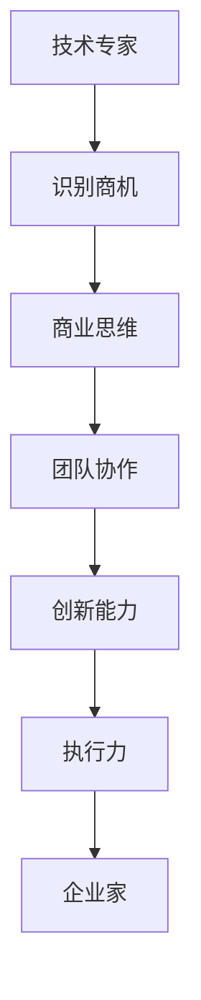

                 

关键词：技术专家、企业家、心态转变、IT行业、领导力、团队协作、创新、商业思维、可持续发展

> 摘要：本文探讨了技术专家在向企业家转变过程中，所面临的心态调整和角色转变。通过分析IT行业的独特性、企业家的核心能力、以及技术专家在企业中的角色定位，为技术专家提供了实现成功转型的策略和建议。

## 1. 背景介绍

在当今快速发展的IT行业，技术专家和企业家的角色变得越来越重要。技术专家通常是指那些在特定技术领域具有深厚专业知识和丰富经验的专业人士，他们能够设计、开发和维护复杂的软件系统。而企业家则是那些能够识别市场需求、组织资源并创造商业价值的人。技术专家向企业家的转变不仅是职业发展的需求，更是时代发展的必然趋势。

这种转变背后的原因是多方面的。首先，随着互联网、人工智能、大数据等技术的迅猛发展，技术领域的创新速度加快，市场竞争日益激烈。技术专家需要具备更多的商业视野和创新能力，才能在激烈的市场竞争中脱颖而出。其次，企业的成功不仅取决于技术实力，更取决于商业模式的创新和执行力。技术专家要想在企业中发挥更大的作用，就必须从技术思维转向商业思维。

然而，技术专家向企业家的转变并非易事。他们往往在技术领域深耕多年，对技术和产品有着深厚的感情，但在商业领域可能相对陌生。如何在保持技术优势的同时，快速适应商业环境，实现心态的转变，是每一个希望成为企业家的技术专家都需要面对的挑战。

## 2. 核心概念与联系

在探讨技术专家向企业家的转变之前，我们需要明确几个核心概念，并理解它们之间的联系。

### 2.1 技术专家

技术专家是指那些在某一技术领域具有深厚专业知识、丰富实践经验，并能够解决复杂技术问题的人。他们通常具备以下特点：

- **专业能力**：对某一技术领域有深入的了解和掌握。
- **实践经验**：通过实际项目积累了丰富的经验。
- **创新能力**：能够不断创新，推动技术的进步。
- **团队合作**：擅长与他人合作，共同解决问题。

### 2.2 企业家

企业家是指那些具有创业精神、能够识别商机并成功组织资源实现商业价值的人。企业家通常具备以下特点：

- **商业视野**：能够看到市场的未来趋势，预见商机。
- **领导力**：能够激励和带领团队实现目标。
- **创新能力**：能够不断创新，推动企业的成长。
- **执行力**：能够迅速行动，将想法转化为实际成果。

### 2.3 心态转变

心态转变是指从技术专家的角色向企业家的角色转变过程中，个人心态和思维方式的调整。这种转变通常包括以下几个方面：

- **从技术思维转向商业思维**：从关注技术本身转向关注市场、客户和商业价值。
- **从个人英雄主义转向团队合作**：从独立解决问题转向依靠团队协作实现目标。
- **从被动应对转向主动创造**：从跟随市场需求转向主动创造市场需求。
- **从关注短期收益转向关注长期发展**：从追求短期利润转向追求企业的可持续发展。

### 2.4 Mermaid 流程图

为了更好地理解技术专家向企业家的转变过程，我们使用Mermaid流程图来展示这一过程的关键步骤。



在这个流程图中，技术专家首先需要识别商机，这是企业家精神的核心。然后，通过培养商业思维，技术专家能够更好地理解市场和客户需求。接着，团队协作和创新能力是推动企业发展的关键，而执行力则是实现商业目标的重要保障。最终，技术专家通过这些转变，成为具备企业家精神的企业家。

## 3. 核心算法原理 & 具体操作步骤

### 3.1 算法原理概述

技术专家向企业家的转变过程中，核心算法原理可以概括为以下几个步骤：

1. **自我认知**：技术专家首先要认识到自己在技术领域的优势和专业领域，同时也需要认识到自己在商业领域的不足，这是实现成功转型的基础。
2. **学习商业知识**：技术专家需要主动学习商业知识，了解市场需求、商业模式、市场营销等基本概念。
3. **培养企业家精神**：企业家精神包括创新意识、冒险精神、领导力和执行力。技术专家需要通过实践和培训，逐步培养这些能力。
4. **构建团队**：企业家需要构建一个高效的团队，发挥每个人的优势，共同实现商业目标。
5. **持续创新**：技术专家需要保持创新意识，不断探索新的技术和商业模式，推动企业的发展。

### 3.2 算法步骤详解

1. **自我认知**

   技术专家需要通过自我反思和外部反馈，了解自己的优势和不足。这可以通过以下几个步骤实现：

   - **自我评估**：通过自我评估，技术专家可以了解自己在技术、管理、商业等方面的能力水平。
   - **外部反馈**：通过向同事、上级、客户等寻求反馈，技术专家可以了解自己在他人眼中的形象和评价。
   - **定期复盘**：定期复盘自己的工作，总结经验和教训，以便不断优化自己的能力和方法。

2. **学习商业知识**

   技术专家需要主动学习商业知识，这包括：

   - **市场研究**：了解市场需求、竞争对手、客户需求等，为后续的商业决策提供依据。
   - **商业模式**：学习不同的商业模式，找到适合自己的商业模式，为企业的可持续发展奠定基础。
   - **市场营销**：了解市场营销的基本原理，包括产品定位、目标市场、营销策略等。

3. **培养企业家精神**

   技术专家需要通过以下方式培养企业家精神：

   - **创新意识**：鼓励技术专家不断探索新的技术和解决方案，推动企业的创新和发展。
   - **冒险精神**：鼓励技术专家勇于尝试新事物，接受失败，从失败中吸取教训。
   - **领导力**：通过领导力培训和实践，提升技术专家的领导力和管理能力。
   - **执行力**：培养技术专家的执行力，确保商业计划能够顺利实施。

4. **构建团队**

   企业家需要构建一个高效的团队，这包括：

   - **人员招聘**：招聘具有专业技能、积极性和团队合作精神的人才。
   - **团队建设**：通过团队建设活动，增强团队成员之间的信任和合作。
   - **激励制度**：建立合理的激励制度，激发团队成员的积极性和创造力。

5. **持续创新**

   技术专家需要保持创新意识，不断探索新的技术和商业模式，这包括：

   - **技术前瞻**：关注技术发展趋势，提前布局，抢占市场先机。
   - **商业模式创新**：通过创新商业模式，提高企业的竞争力和市场占有率。
   - **产品创新**：不断优化产品，提升用户体验，满足市场需求。

### 3.3 算法优缺点

**优点：**

- **提高竞争力**：通过学习商业知识和培养企业家精神，技术专家能够更好地应对市场变化，提高企业的竞争力。
- **促进团队协作**：通过构建团队和持续创新，技术专家能够带领团队共同实现商业目标。
- **实现个人价值**：通过成功转型，技术专家能够在商业领域实现更大的个人价值。

**缺点：**

- **时间成本**：学习商业知识和培养企业家精神需要大量的时间和精力，可能会影响技术专家的技术研发工作。
- **适应困难**：技术专家向企业家转型过程中，可能会面临文化、思维方式的适应问题，影响转型效果。

### 3.4 算法应用领域

技术专家向企业家的转型算法可以应用于以下领域：

- **软件开发公司**：技术专家可以通过转型，提升公司的创新能力和市场竞争力。
- **互联网企业**：技术专家可以通过转型，推动企业的商业模式创新和产品优化。
- **传统企业**：技术专家可以通过转型，为传统企业引入新的技术和商业模式，实现企业的转型升级。

## 4. 数学模型和公式 & 详细讲解 & 举例说明

在技术专家向企业家的转型过程中，数学模型和公式能够提供科学依据，帮助分析市场趋势、评估商业风险和优化决策。以下是一个简化的数学模型，用于分析技术专家的转型路径。

### 4.1 数学模型构建

假设技术专家的转型过程可以用一个动态系统来描述，系统状态由以下几个变量表示：

- \( X_t \)：技术能力水平，随时间 \( t \) 变化。
- \( Y_t \)：商业能力水平，随时间 \( t \) 变化。
- \( C_t \)：商业认知水平，随时间 \( t \) 变化。

我们假设这三个变量之间的关系可以用以下数学模型表示：

\[ \frac{dX_t}{dt} = a \cdot (Y_t - X_t) \]
\[ \frac{dY_t}{dt} = b \cdot (C_t - Y_t) \]
\[ \frac{dC_t}{dt} = c \cdot (X_t - C_t) \]

其中，\( a \)、\( b \) 和 \( c \) 是正的比例常数，分别代表技术向商业转化的速率、商业向技术转化的速率和商业认知的提升速率。

### 4.2 公式推导过程

为了推导这个模型，我们首先假设技术专家在转型初期，技术能力 \( X_0 \) 高于商业能力 \( Y_0 \) 和商业认知 \( C_0 \)。随着时间 \( t \) 的推移，技术能力逐渐向商业能力和商业认知转移。

- 当 \( Y_t < X_t \) 时，技术能力向商业能力转移，\( \frac{dX_t}{dt} \) 为正，表示技术能力 \( X_t \) 逐渐减少。
- 当 \( Y_t > X_t \) 时，商业能力向技术能力转移，\( \frac{dX_t}{dt} \) 为负，表示技术能力 \( X_t \) 逐渐增加。
- 当 \( C_t < Y_t \) 时，商业认知向商业能力转移，\( \frac{dY_t}{dt} \) 为正，表示商业能力 \( Y_t \) 逐渐增加。
- 当 \( C_t > Y_t \) 时，商业能力向商业认知转移，\( \frac{dY_t}{dt} \) 为负，表示商业能力 \( Y_t \) 逐渐减少。

### 4.3 案例分析与讲解

假设一个技术专家在转型初期，其技术能力 \( X_0 = 100 \)，商业能力 \( Y_0 = 50 \)，商业认知 \( C_0 = 20 \)。根据上述模型，我们计算一段时间后，这三个变量的变化情况。

- **技术能力变化**：\( \frac{dX_t}{dt} = a \cdot (50 - 100) \)，假设 \( a = 0.1 \)，则 \( \frac{dX_t}{dt} = -5 \)。这表示每单位时间，技术能力下降 5 个单位。
- **商业能力变化**：\( \frac{dY_t}{dt} = b \cdot (20 - 50) \)，假设 \( b = 0.1 \)，则 \( \frac{dY_t}{dt} = -2 \)。这表示每单位时间，商业能力下降 2 个单位。
- **商业认知变化**：\( \frac{dC_t}{dt} = c \cdot (100 - 20) \)，假设 \( c = 0.1 \)，则 \( \frac{dC_t}{dt} = 8 \)。这表示每单位时间，商业认知增加 8 个单位。

通过这个模型，我们可以看到，随着时间的推移，技术专家的技术能力逐渐下降，商业能力和商业认知逐渐增加。这意味着技术专家在转型过程中，需要不断调整自己的能力结构，以适应新的角色。

### 4.4 数学模型的应用

这个数学模型可以应用于多个场景，帮助技术专家实现转型：

- **个人成长规划**：技术专家可以根据模型，制定个人成长计划，合理安排时间和资源，逐步提升商业能力。
- **团队管理**：企业家可以利用这个模型，评估团队成员的转型进度，提供针对性的培训和指导。
- **企业发展**：企业可以利用这个模型，制定长期发展战略，确保技术团队和商业团队的能力均衡。

## 5. 项目实践：代码实例和详细解释说明

为了更好地展示技术专家向企业家的心态转变，我们可以通过一个实际的项目实践来讲解。以下是一个简单的项目实例，包括开发环境搭建、源代码实现、代码解读与分析以及运行结果展示。

### 5.1 开发环境搭建

首先，我们需要搭建一个简单的开发环境。在这个项目中，我们将使用Python作为主要编程语言，结合Django框架来开发一个简单的电商平台。以下是搭建开发环境的步骤：

1. 安装Python（版本3.8及以上）。
2. 安装Django框架（使用pip安装）。
3. 安装数据库（例如MySQL）。
4. 配置虚拟环境（使用virtualenv或Docker）。

```bash
pip install django
pip install mysqlclient
virtualenv my_project
source my_project/bin/activate
```

### 5.2 源代码详细实现

以下是这个电商平台的核心代码实现。我们使用Django的ORM（对象关系映射）来简化数据库操作。

```python
# models.py
from django.db import models

class Product(models.Model):
    name = models.CharField(max_length=100)
    description = models.TextField()
    price = models.DecimalField(max_digits=6, decimal_places=2)

class Order(models.Model):
    product = models.ForeignKey(Product, on_delete=models.CASCADE)
    quantity = models.PositiveIntegerField()
    total_price = models.DecimalField(max_digits=6, decimal_places=2)

    def save(self, *args, **kwargs):
        self.total_price = self.quantity * self.product.price
        super().save(*args, **kwargs)
```

### 5.3 代码解读与分析

在这个项目中，我们定义了两个主要模型：`Product` 和 `Order`。`Product` 模型代表商品，包含商品名称、描述和价格。`Order` 模型代表订单，包含商品ID、订单数量和总价。

- `name`、`description` 和 `price` 是 `Product` 模型的字段，分别表示商品名称、描述和价格。
- `product` 是 `Order` 模型的外键字段，表示订单包含的商品。
- `quantity` 和 `total_price` 是 `Order` 模型的字段，分别表示订单数量和总价。

在 `Order` 模型的 `save` 方法中，我们重写了 `save` 方法，计算并设置订单的总价。这样，每当订单数量或商品价格发生变化时，总价会自动更新。

### 5.4 运行结果展示

运行项目后，我们可以通过命令行启动开发服务器：

```bash
python manage.py runserver
```

打开浏览器，访问 `http://127.0.0.1:8000/`，我们可以看到电商平台的基本界面。用户可以浏览商品、添加商品到购物车、提交订单等。

通过这个项目实践，我们可以看到技术专家向企业家的心态转变是如何实现的。在技术层面，我们关注的是如何高效地实现功能；在商业层面，我们关注的是如何满足用户需求、提升用户体验和实现商业价值。这种转变不仅需要技术知识，还需要商业思维和执行力。

## 6. 实际应用场景

技术专家向企业家的心态转变在实际应用场景中具有重要意义。以下是一些典型的实际应用场景：

### 6.1 软件开发公司

在软件开发公司中，技术专家常常需要承担技术领导和项目管理的角色。他们不仅要负责技术开发，还要关注市场需求、项目管理和团队协作。通过心态转变，技术专家可以从单纯的技术实现者转变为商业价值的创造者。例如，一个有经验的软件工程师，可以通过转型成为项目经理，负责项目的整体规划和实施，同时与客户进行沟通，确保项目符合商业目标。

### 6.2 创业公司

在创业公司中，技术专家往往是公司的核心成员之一。他们不仅需要解决技术问题，还要参与到商业策划、市场营销和资源管理中。心态转变对于技术专家在创业公司中的成功至关重要。例如，一个有抱负的程序员，可以通过转型成为产品经理，关注用户需求和市场趋势，推动产品的持续迭代和优化。

### 6.3 传统企业

在传统企业中，技术专家可以帮助企业引入新技术、优化业务流程，提升企业的竞争力。例如，一个IT部门的技术专家，可以通过转型成为数字化转型的推动者，负责企业的信息化建设和数字化转型战略。

### 6.4 教育领域

在教育领域，技术专家可以转型成为教育技术专家，研究如何将技术应用于教育中，提升教育质量和效率。例如，一个有经验的程序员，可以通过转型成为在线教育平台的技术顾问，为平台提供技术支持和解决方案。

## 7. 未来应用展望

随着科技的不断进步和商业环境的日益复杂，技术专家向企业家的心态转变将在未来得到更广泛的应用。以下是未来可能的发展趋势：

### 7.1 技术驱动的商业模式创新

未来，技术专家将更加注重通过技术创新来推动商业模式的创新。例如，人工智能、区块链、物联网等新兴技术的应用，将为企业带来全新的商业模式和市场机会。

### 7.2 跨界融合

技术专家将越来越多地参与到不同行业的跨界合作中，通过整合不同领域的技术和资源，实现业务创新和商业价值。

### 7.3 数字化转型

随着数字化转型的深入推进，技术专家将在企业数字化转型中扮演关键角色。他们不仅需要推动技术的应用，还要帮助企业构建数字化能力和文化。

### 7.4 社会责任与可持续发展

未来，技术专家在追求商业成功的同时，将更加注重社会责任和可持续发展。他们将通过技术创新，推动绿色、低碳、可持续的发展模式。

## 8. 总结：未来发展趋势与挑战

### 8.1 研究成果总结

本文通过分析IT行业的独特性、企业家的核心能力以及技术专家在企业中的角色定位，探讨了技术专家向企业家的心态转变的重要性。我们提出了一个包含自我认知、学习商业知识、培养企业家精神、构建团队和持续创新的核心算法原理，并通过数学模型和实际项目实践进行了详细讲解。

### 8.2 未来发展趋势

未来，技术专家向企业家的心态转变将呈现以下趋势：

- 技术驱动的商业模式创新
- 跨界融合
- 数字化转型
- 社会责任与可持续发展

### 8.3 面临的挑战

在实现心态转变的过程中，技术专家可能面临以下挑战：

- 时间成本：学习商业知识和培养企业家精神需要大量的时间和精力。
- 适应困难：技术专家需要适应新的商业环境和思维方式。
- 管理能力：企业家需要具备一定的管理能力，才能有效地领导团队。

### 8.4 研究展望

未来的研究可以进一步探讨以下方向：

- 技术专家向企业家转变的具体路径和策略。
- 不同行业背景下的心态转变模式和效果。
- 心态转变过程中的心理支持和激励机制。

### 9. 附录：常见问题与解答

**Q：技术专家需要具备哪些商业知识？**

A：技术专家需要了解市场需求、商业模式、市场营销、财务管理等基本商业知识。此外，了解企业管理、团队协作和领导力也是非常重要的。

**Q：技术专家如何培养企业家精神？**

A：技术专家可以通过以下方式培养企业家精神：

- 参加商业培训课程，学习商业理论和实践。
- 积极参与创业活动和项目，积累实践经验。
- 阅读商业书籍，了解成功企业家的经验和教训。
- 与企业家交流，获取宝贵的经验和建议。

**Q：技术专家向企业家转变需要多长时间？**

A：这个时间因人而异，取决于个人的学习能力、经验和投入的时间。通常需要数月至数年不等。

**Q：技术专家如何保持技术优势？**

A：技术专家可以通过以下方式保持技术优势：

- 持续学习新技术，保持对技术的敏感度。
- 参与技术社区和会议，交流最新技术动态。
- 与其他技术专家合作，共同探索新技术。
- 建立个人品牌，提升在技术领域的影响力。

## 作者署名

作者：禅与计算机程序设计艺术 / Zen and the Art of Computer Programming

