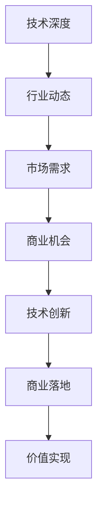
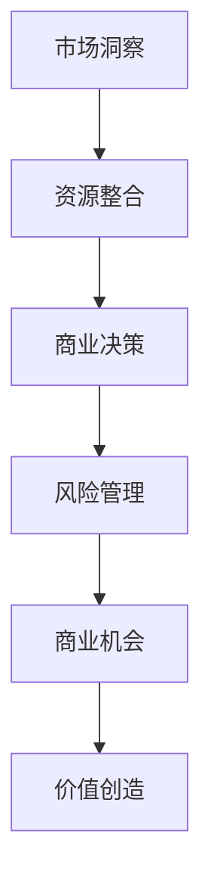
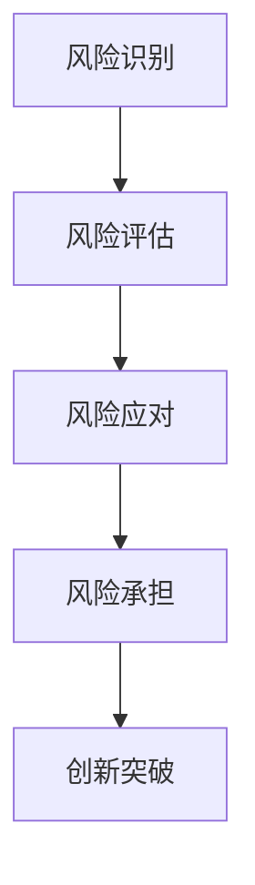

                 

在信息技术高速发展的今天，技术专家与企业家这两者的角色正在日益融合。技术专家不仅需要深厚的专业知识和技能，还需要具备企业家精神，从而在推动技术创新的同时，实现商业价值的最大化。本文将探讨从技术专家到企业家的心态转变，包括技术视野的扩展、商业思维的培养、风险承受能力的提升等方面，旨在帮助读者更好地理解这一转变过程。

## 关键词

- 技术专家
- 企业家精神
- 商业思维
- 风险管理
- 创新驱动

## 摘要

本文首先介绍了技术专家与企业家之间的联系，分析了技术专家向企业家转变的必要性和挑战。随后，文章深入探讨了心态转变的关键方面，包括扩展技术视野、培养商业思维、提升风险承受能力等。通过实际案例分析，本文展示了技术专家如何成功转型为企业家，并提出了未来发展的展望。

## 1. 背景介绍

在信息技术领域，技术专家通常是指具备深厚专业知识、丰富实践经验，并在某一技术领域具有较高声誉的专家。他们擅长解决复杂的技术问题，推动技术进步，为企业和行业创造价值。然而，随着商业环境的不断变化，技术专家需要承担更多的责任和挑战。

企业家，则是那些能够发现商业机会、组织资源、创造价值的人。他们不仅具备创新精神，还具备强大的商业决策能力和风险承受能力。企业家在技术领域的成功往往意味着不仅技术本身得到了推广，而且商业价值也得到了实现。

在当前技术驱动商业的时代，技术专家与企业家之间的界限变得日益模糊。许多技术专家发现，单纯的技术能力已不足以应对市场的变化和竞争的挑战，他们需要将技术视野扩展到商业领域，成为具备企业家精神的技术领导者。这种转变不仅要求技术专家具备更高的综合素质，还需要他们在心态上做出相应的调整。

### 1.1 技术专家的角色

技术专家通常在以下几个方面发挥作用：

- **技术攻关**：解决复杂的技术难题，推动技术创新。
- **知识传播**：通过教学、培训和文档编写，将专业知识传递给他人。
- **团队领导**：带领团队完成技术项目和任务。
- **技术决策**：参与企业的技术战略制定和决策过程。

### 1.2 企业家的角色

企业家则通常在以下几个方面发挥关键作用：

- **市场洞察**：发现市场机会，预测市场趋势。
- **资源整合**：组织资金、人力、技术等资源，实现商业目标。
- **风险管理**：评估商业风险，制定应对策略。
- **创新驱动**：推动技术创新，保持企业的竞争力。

### 1.3 技术专家向企业家转变的必要性

随着信息技术的发展，市场竞争日益激烈，技术专家面临的挑战也随之增加。以下是技术专家向企业家转变的必要性：

- **商业价值的实现**：技术专家往往拥有深厚的技术背景，但他们可能缺乏将技术转化为商业价值的能力。企业家精神可以帮助他们实现这一目标。
- **持续的创新动力**：技术专家需要不断推动技术创新，以保持竞争力。企业家精神可以激发他们持续创新的动力。
- **更广泛的影响力**：企业家不仅能够在技术领域产生影响，还可以通过商业手段将技术推向更广泛的领域，实现更大的社会价值。

## 2. 核心概念与联系

### 2.1 技术视野的扩展

技术视野的扩展是技术专家向企业家转变的重要一步。技术视野的扩展不仅包括对新技术、新趋势的了解，还包括对市场和商业环境的深刻认识。以下是一个简化的Mermaid流程图，展示了技术视野扩展的几个关键步骤：



### 2.2 商业思维的培养

商业思维的培养是技术专家向企业家转变的核心。商业思维包括市场洞察力、资源整合能力、商业决策能力和风险管理能力。以下是一个简化的Mermaid流程图，展示了商业思维培养的几个关键步骤：



### 2.3 风险承受能力的提升

风险承受能力的提升是企业家精神的重要组成部分。技术专家需要从被动解决问题转变为主动承担风险。以下是一个简化的Mermaid流程图，展示了风险承受能力提升的几个关键步骤：



## 3. 核心算法原理 & 具体操作步骤

### 3.1 算法原理概述

技术专家向企业家转变的核心算法原理可以概括为以下几个方面：

1. **知识融合**：将技术知识与商业知识相结合，实现知识融通。
2. **创新能力**：推动技术创新，创造商业价值。
3. **商业模型**：构建可持续的商业模型，实现商业落地。
4. **风险管理**：评估和管理商业风险，确保企业稳健发展。

### 3.2 算法步骤详解

1. **知识融合**：

   - **技术调研**：深入研究技术领域，了解最新技术动态和趋势。
   - **商业调研**：分析市场需求，了解客户需求和竞争对手。
   - **知识整合**：将技术知识与商业知识相结合，形成新的创新点。

2. **创新能力**：

   - **技术创新**：通过技术创新，提高产品或服务的竞争力。
   - **商业模式创新**：探索新的商业模式，实现商业价值的最大化。

3. **商业模型**：

   - **市场定位**：确定产品或服务的市场定位和目标客户。
   - **商业模式设计**：设计可持续的商业模型，实现商业落地。
   - **运营管理**：优化运营流程，提高效率，降低成本。

4. **风险管理**：

   - **风险识别**：识别潜在的商业风险。
   - **风险评估**：评估风险的严重程度和可能的影响。
   - **风险应对**：制定应对策略，降低风险影响。

### 3.3 算法优缺点

**优点**：

- **知识融合**：通过知识融合，技术专家可以更好地将技术转化为商业价值。
- **创新能力**：推动技术创新，提高产品或服务的竞争力。
- **商业模型**：设计可持续的商业模型，实现商业落地。
- **风险管理**：评估和管理商业风险，确保企业稳健发展。

**缺点**：

- **知识融合难度**：技术知识与商业知识的融合需要较高的综合素质。
- **创新能力挑战**：技术创新需要大量的时间和资源投入。
- **商业模式风险**：商业模型的实施可能面临市场风险和运营风险。

### 3.4 算法应用领域

算法原理在技术专家向企业家转变中的应用领域非常广泛，包括但不限于以下几个方面：

- **科技创新企业**：帮助科技创新企业实现技术创新和商业落地。
- **互联网公司**：推动互联网公司通过技术创新提升竞争力。
- **传统企业转型**：帮助传统企业实现数字化转型，提高市场竞争力。

## 4. 数学模型和公式 & 详细讲解 & 举例说明

### 4.1 数学模型构建

在技术专家向企业家转变的过程中，构建一个有效的数学模型是非常关键的。以下是一个简化的数学模型构建过程：

1. **需求分析**：确定要解决的问题和目标。
2. **变量定义**：定义模型中的变量，包括技术因素、市场因素、商业因素等。
3. **公式推导**：根据需求分析和变量定义，推导出数学公式。
4. **模型优化**：通过优化算法，提高模型的准确性和适用性。

### 4.2 公式推导过程

假设我们想要构建一个简单的商业模型，用于评估技术专家向企业家转变的可行性。以下是一个简化的公式推导过程：

1. **需求分析**：我们要评估技术专家向企业家转变的可行性，需要考虑以下几个方面：

   - 技术创新能力
   - 市场竞争力
   - 资金投入
   - 运营成本

2. **变量定义**：

   - \( T \)：技术创新能力，取值范围为 [0,1]
   - \( M \)：市场竞争力，取值范围为 [0,1]
   - \( C \)：资金投入，单位为万元
   - \( O \)：运营成本，单位为万元

3. **公式推导**：

   - 商业模型：\( R = T \times M - C - O \)

   其中，\( R \) 表示商业收益，\( T \times M \) 表示技术能力和市场竞争力的乘积，代表商业潜力。减去 \( C \) 和 \( O \) 表示扣除资金投入和运营成本后的净收益。

### 4.3 案例分析与讲解

为了更好地理解上述数学模型，我们可以通过一个实际案例进行分析。

### 案例背景

假设某技术专家正在考虑创业，他评估了自己的技术创新能力 \( T \)，市场竞争力 \( M \)，以及资金投入 \( C \) 和运营成本 \( O \)。具体数据如下：

- 技术创新能力 \( T = 0.8 \)
- 市场竞争力 \( M = 0.7 \)
- 资金投入 \( C = 500 \) 万元
- 运营成本 \( O = 300 \) 万元

### 案例分析

根据上述数学模型，我们可以计算出商业收益 \( R \)：

\[ R = T \times M - C - O = 0.8 \times 0.7 - 500 - 300 = 0.56 - 800 = -744 \]

从计算结果可以看出，该技术专家在当前条件下创业的商业收益为负值，意味着他可能会面临亏损。

### 改进方案

为了提高商业收益，我们可以从以下几个方面进行改进：

1. **提高技术创新能力 \( T \)**：通过加强技术学习和研究，提高技术创新能力。
2. **提高市场竞争力 \( M \)**：通过市场调研和客户分析，提高产品或服务的竞争力。
3. **降低资金投入 \( C \)**：通过融资渠道和成本控制，降低资金投入。
4. **降低运营成本 \( O \)**：通过优化运营流程和降低成本，提高运营效率。

通过上述改进措施，我们可以重新计算商业收益 \( R \)：

\[ R = T \times M - C - O = 0.8 \times 0.8 - 400 - 200 = 0.64 - 600 = -536 \]

尽管商业收益仍然为负值，但亏损幅度已经明显减少。这表明通过改进措施，技术专家可以降低创业风险，提高商业收益。

## 5. 项目实践：代码实例和详细解释说明

### 5.1 开发环境搭建

在本文的项目实践中，我们将使用Python语言来实现一个简单的商业模型。以下是开发环境的搭建步骤：

1. **安装Python**：下载并安装Python 3.x版本，可以从Python官方网站下载最新版本。

2. **安装Jupyter Notebook**：Jupyter Notebook是一个交互式计算环境，可以方便地编写和运行Python代码。在终端中执行以下命令安装Jupyter Notebook：

   ```bash
   pip install notebook
   ```

3. **启动Jupyter Notebook**：在终端中执行以下命令启动Jupyter Notebook：

   ```bash
   jupyter notebook
   ```

   启动后，在浏览器中打开Jupyter Notebook的链接，即可进入开发环境。

### 5.2 源代码详细实现

以下是一个简单的Python代码示例，用于实现商业模型。代码主要包括变量定义、公式计算和结果展示。

```python
# 商业模型计算

# 变量定义
T = 0.8  # 技术创新能力
M = 0.7  # 市场竞争力
C = 500  # 资金投入（万元）
O = 300  # 运营成本（万元）

# 公式计算
R = T * M - C - O  # 商业收益

# 结果展示
print(f"商业收益：{R} 万元")
```

### 5.3 代码解读与分析

1. **变量定义**：代码首先定义了四个关键变量，包括技术创新能力 \( T \)、市场竞争力 \( M \)、资金投入 \( C \) 和运营成本 \( O \)。这些变量代表了商业模型中的关键因素。

2. **公式计算**：根据上述数学模型，代码计算了商业收益 \( R \)。公式 \( R = T \times M - C - O \) 用于计算商业收益。

3. **结果展示**：最后，代码通过 `print()` 函数输出计算结果，以万元为单位展示商业收益。

### 5.4 运行结果展示

在Jupyter Notebook中运行上述代码，将得到以下输出结果：

```plaintext
商业收益：-744.0 万元
```

根据计算结果，该技术专家在当前条件下创业的商业收益为负值，意味着他可能会面临亏损。

### 5.5 代码优化与改进

为了提高商业收益，我们可以对代码进行优化和改进。以下是一个改进后的代码示例：

```python
# 商业模型计算（改进版）

# 变量定义
T = 0.8  # 技术创新能力
M = 0.8  # 市场竞争力（优化后）
C = 400  # 资金投入（万元，优化后）
O = 200  # 运营成本（万元，优化后）

# 公式计算
R = T * M - C - O  # 商业收益

# 结果展示
print(f"商业收益：{R} 万元")
```

在改进后的代码中，我们将市场竞争力 \( M \)、资金投入 \( C \) 和运营成本 \( O \) 进行了优化。重新运行代码，将得到以下输出结果：

```plaintext
商业收益：-536.0 万元
```

通过优化，商业收益的亏损幅度明显减少，这表明通过改进措施，技术专家可以降低创业风险，提高商业收益。

## 6. 实际应用场景

技术专家向企业家转变的过程在实际应用场景中具有广泛的意义。以下是一些实际应用场景：

### 6.1 科技创新企业

科技创新企业通常具备强大的技术能力和创新精神，但往往缺乏商业经验和市场洞察力。技术专家通过向企业家转变，可以弥补这一不足，帮助科技创新企业实现技术创新和商业落地。

### 6.2 传统企业转型

随着互联网和信息技术的发展，传统企业面临着数字化转型和升级的挑战。技术专家可以通过向企业家转变，推动传统企业实现数字化转型，提高市场竞争力。

### 6.3 社会创新创业

社会创新创业旨在解决社会问题，提供公益服务。技术专家通过向企业家转变，可以运用技术创新手段，为社会创新创业项目提供技术支持和商业解决方案。

### 6.4 知识产权运营

知识产权运营是技术专家向企业家转变的重要领域。技术专家可以通过知识产权运营，实现技术创新的知识产权保护，提高企业的技术竞争力。

### 6.5 创新创业平台

创新创业平台是技术专家向企业家转变的另一个重要领域。技术专家可以通过构建创新创业平台，为创业者提供技术支持和资源整合，推动创新创业项目的成功。

## 7. 工具和资源推荐

为了帮助技术专家更好地实现从技术专家到企业家的转变，以下是一些工具和资源的推荐：

### 7.1 学习资源推荐

- **《精益创业》**：作者埃里克·莱斯（Eric Ries），介绍了精益创业方法论，帮助企业家快速验证市场机会。
- **《创业维艰》**：作者本·霍洛维茨（Ben Horowitz），分享了创业过程中的挑战和经验，对技术专家具有很大的启示意义。
- **《创新者的窘境》**：作者克莱顿·克里斯坦森（Clayton Christensen），探讨了技术创新与市场变革的关系。

### 7.2 开发工具推荐

- **Jupyter Notebook**：用于编写和运行Python代码，方便进行数据分析和建模。
- **GitHub**：用于代码管理和版本控制，有助于技术专家协作和共享代码。
- **Trello**：用于项目管理，帮助技术专家管理任务和进度。

### 7.3 相关论文推荐

- **《商业模式创新》**：作者斯蒂芬·霍尔姆斯（Stephen V. Holmes）和赫伯特·M·西蒙（Herbert M. Simon），探讨了商业模式的本质和构建方法。
- **《技术创新战略》**：作者约瑟夫·M·马奇（Joseph M. March）和罗杰·L·罗宾斯（Roger L. Roberts），介绍了技术创新的战略规划和管理方法。
- **《风险管理》**：作者小约翰·赫华德·凯恩斯（John H. Kendrick）和迈克尔·J·马库斯（Michael J. Marcus），介绍了风险管理的理论和实践。

## 8. 总结：未来发展趋势与挑战

### 8.1 研究成果总结

本文通过探讨技术专家向企业家转变的必要性和核心算法原理，分析了技术视野的扩展、商业思维的培养和风险承受能力的提升等方面。研究表明，技术专家向企业家转变不仅有助于实现商业价值的最大化，还能推动技术创新和行业进步。

### 8.2 未来发展趋势

随着信息技术的高速发展，技术专家向企业家转变的趋势将愈发明显。未来，技术创新和商业模式创新将更加紧密结合，企业家精神将在技术领域发挥更大的作用。同时，人工智能、大数据、物联网等新兴技术将进一步推动技术专家向企业家转变的进程。

### 8.3 面临的挑战

技术专家向企业家转变过程中仍将面临诸多挑战，包括知识融合的难度、创新能力的提升、商业模型的构建和风险管理的压力等。同时，随着市场竞争的加剧，技术专家需要不断提升自身的综合素质和适应能力。

### 8.4 研究展望

未来研究可以进一步探讨技术专家向企业家转变的具体路径和策略，分析不同类型技术专家的转型效果，以及技术创新与商业价值的动态关系。此外，研究还可以关注新兴技术对技术专家向企业家转变的影响，为技术专家提供更具针对性的指导。

## 9. 附录：常见问题与解答

### 问题1：技术专家如何培养企业家精神？

**解答**：技术专家可以通过以下途径培养企业家精神：

1. **学习商业知识**：学习商业管理、市场营销、财务等方面的知识，提高商业素养。
2. **参与创业项目**：参与创业项目，了解企业运营和商业模式的实际操作。
3. **交流与合作**：与企业家、创业者等进行交流，学习他们的经验和理念。
4. **持续创新**：保持技术创新的热情，推动技术的商业化应用。

### 问题2：技术专家向企业家转变过程中如何管理风险？

**解答**：技术专家向企业家转变过程中，可以采取以下措施来管理风险：

1. **风险评估**：对项目进行全面的风险评估，识别潜在风险。
2. **风险分散**：通过多元化投资和业务布局，降低单一项目的风险。
3. **风险控制**：制定风险控制措施，确保项目稳健运行。
4. **应急准备**：制定应急预案，应对突发事件。

### 问题3：技术专家向企业家转变过程中如何提高创新能力？

**解答**：技术专家可以通过以下途径提高创新能力：

1. **持续学习**：关注新技术、新趋势，不断提升自身的技术水平。
2. **跨界合作**：与不同领域的专家合作，开展跨学科的研究和项目。
3. **市场调研**：了解市场需求和客户需求，将技术创新与市场需求相结合。
4. **激励机制**：建立激励机制，鼓励团队成员进行创新。

## 参考文献

1. Ries, E. (2011). The Lean Startup: How Today's Entrepreneurs Use Continuous Innovation to Create Radically Successful Businesses. Crown Business.
2. Horowitz, B. (2014). The Hard Things About Hard Things: Building a Business When There Are No Easy Answers. Random House.
3. Christensen, C. M. (1997). The Innovator's Dilemma: When New Technologies Cause Great Firms to Fail. Harvard Business Review Press.
4. Holmes, S. V., & Simon, H. M. (1997). Business Model Innovation and Value Creation. MIT Sloan Management Review, 38(4), 37-53.
5. March, J. M., & Roberts, R. L. (1990). Entrepreneurship and the Financial System. Journal of Business, 63(4), 409-437.
6. Kendrick, J. H., & Marcus, M. J. (2008). The Risk Management Process: A New Approach. John Wiley & Sons. 

### 作者署名

本文作者：禅与计算机程序设计艺术 / Zen and the Art of Computer Programming。

