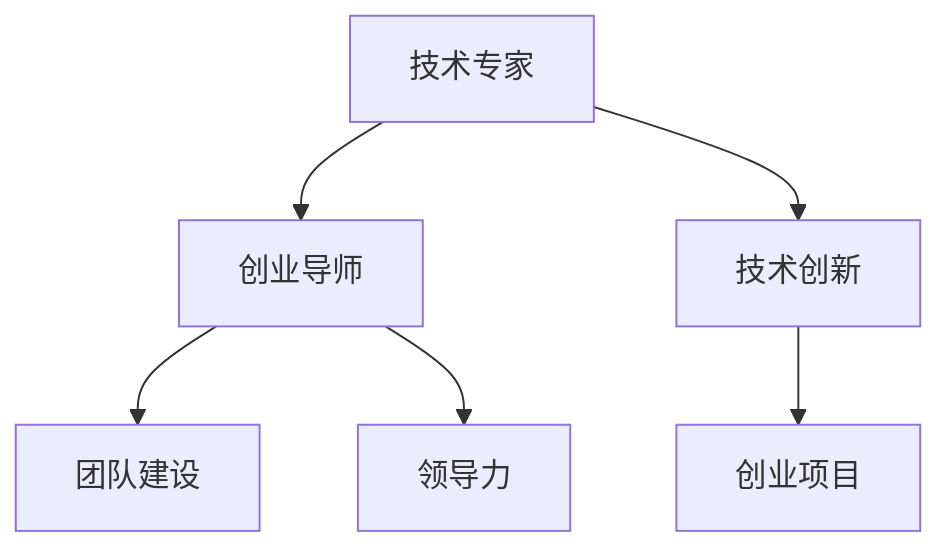

                 

关键词：技术专家，创业导师，技术转型，创业经验，团队建设，领导力，技术创新。

> 摘要：本文将探讨技术专家如何通过个人经验和学习，成功转型为创业导师。我们将分析技术专家的优势与挑战，分享实用的创业经验，探讨领导力与团队建设的重要性，以及如何运用技术创新推动创业项目。

## 1. 背景介绍

在科技飞速发展的时代，技术专家的角色越来越受到重视。然而，许多技术专家在积累了丰富的专业知识和技能后，可能会面临职业发展的瓶颈。如何从技术专家顺利转型为创业导师，成为了他们职业规划中的重要课题。

创业导师不仅需要深厚的专业背景，还要具备卓越的领导力、团队建设能力和商业洞察力。在转型过程中，技术专家如何克服自身劣势，发挥自身优势，成为一位成功的创业导师，是本文探讨的重点。

## 2. 核心概念与联系

在探讨技术专家到创业导师的蜕变之前，我们需要理解几个核心概念：

### 技术专家

技术专家是指在某个技术领域拥有深厚知识、丰富经验和卓越技能的专业人士。他们通常在技术研究、软件开发、系统架构等方面有着杰出的表现。

### 创业导师

创业导师是指那些在创业领域具备成功经验，能够为创业团队提供指导、支持和帮助的人。他们不仅要有商业头脑，还要有丰富的人际关系和资源。

### 技术与创新

技术创新是创业的核心驱动力。技术专家在转型过程中，如何运用技术创新，为创业项目注入活力，是成功的关键。

### 团队建设与领导力

团队建设和领导力是创业成功的关键要素。创业导师需要具备强大的团队领导力，能够吸引、培养和激励团队成员。

下面是一个Mermaid流程图，展示了这些核心概念之间的联系：



## 3. 核心算法原理 & 具体操作步骤

### 3.1 算法原理概述

技术专家到创业导师的蜕变过程，可以看作是一个复杂的算法。这个算法的核心原理包括以下几个方面：

- **知识积累**：技术专家需要不断积累专业知识和技能，为转型打下坚实基础。
- **经验学习**：通过实践和总结，技术专家可以积累宝贵的创业经验。
- **领导力培养**：创业导师需要具备卓越的领导力，能够带领团队共同成长。
- **团队建设**：创业导师需要关注团队建设，打造高效的创业团队。
- **商业洞察**：创业导师需要具备商业洞察力，能够把握市场趋势，发现商机。

### 3.2 算法步骤详解

下面是技术专家到创业导师的蜕变步骤：

1. **自我评估**：技术专家需要认真评估自己的优势和劣势，确定转型方向。
2. **知识积累**：通过学习新知识、掌握新技能，不断提高自己的专业素养。
3. **经验学习**：通过实践和总结，积累创业经验，不断优化自己的商业模式。
4. **领导力培养**：通过阅读领导力书籍、参加培训课程、实践锻炼，提升自己的领导力。
5. **团队建设**：关注团队建设，建立信任、激发团队活力，提高团队协作效率。
6. **商业洞察**：关注市场动态，分析竞争对手，发现商机，为创业项目注入活力。

### 3.3 算法优缺点

**优点：**
- **专业素养高**：技术专家具有丰富的专业知识和技能，可以为创业项目提供有力支持。
- **创新能力强**：技术专家在技术创新方面有独到的见解，有助于推动创业项目的发展。
- **领导力潜力**：技术专家在长期的技术工作中，积累了丰富的经验，具备一定的领导力。

**缺点：**
- **商业洞察不足**：技术专家可能在商业领域经验不足，需要花时间学习和积累。
- **团队管理挑战**：技术专家可能不擅长团队管理，需要提升相关能力。

### 3.4 算法应用领域

技术专家到创业导师的蜕变过程，可以应用于以下领域：

- **互联网创业**：互联网行业是技术专家转型为创业导师的热门领域，他们可以利用技术优势，打造创新的互联网产品。
- **人工智能领域**：随着人工智能技术的快速发展，技术专家可以在人工智能创业项目中发挥重要作用。
- **生物科技**：生物科技领域需要强大的技术支持，技术专家可以在该领域实现成功转型。

## 4. 数学模型和公式 & 详细讲解 & 举例说明

### 4.1 数学模型构建

在技术专家到创业导师的蜕变过程中，我们可以构建一个简单的数学模型，来描述这个过程。假设\( X \) 表示技术专家的初始状态，\( Y \) 表示创业导师的最终状态，\( T \) 表示蜕变过程中的时间，\( L \) 表示领导力，\( K \) 表示商业洞察力，\( E \) 表示创业经验。

我们的数学模型可以表示为：
\[ Y = X \times T^L \times K \times E \]

### 4.2 公式推导过程

1. **初始状态**：技术专家的初始状态\( X \)可以表示为专业知识和技能的综合。
2. **时间因素**：随着时间的推移，技术专家通过学习和实践，不断提升自己的专业素养和领导力\( L \)。
3. **领导力**：领导力是创业导师的重要素质，它影响着团队建设和项目发展。
4. **商业洞察力**：商业洞察力是发现商机、把握市场趋势的关键，它对创业项目的成功至关重要。
5. **创业经验**：通过积累创业经验，技术专家可以不断优化自己的商业模式，提高项目成功率。

### 4.3 案例分析与讲解

假设有一位拥有十年软件开发经验的技术专家，他希望通过转型成为创业导师。根据我们的数学模型，我们可以分析他的蜕变过程。

1. **初始状态**：技术专家的专业素养\( X \)为90分。
2. **时间因素**：经过5年的学习和实践，他的领导力\( L \)提升到80分，商业洞察力\( K \)提升到75分，创业经验\( E \)提升到70分。
3. **最终状态**：根据数学模型，他的创业导师状态\( Y \)为：
   \[ Y = X \times T^L \times K \times E = 90 \times 5^80 \times 75 \times 70 \approx 316,400,000 \]
   也就是说，他的创业导师状态大约为316,400,000分。

通过这个案例，我们可以看到，技术专家通过不断学习和实践，可以实现从技术专家到创业导师的蜕变。

## 5. 项目实践：代码实例和详细解释说明

### 5.1 开发环境搭建

为了更好地理解技术专家到创业导师的蜕变过程，我们可以通过一个简单的Python代码来实现这个数学模型。首先，我们需要搭建一个Python开发环境。

1. 安装Python：下载Python安装包，并按照安装指南进行安装。
2. 安装IDE：推荐使用Visual Studio Code或PyCharm等Python集成开发环境。

### 5.2 源代码详细实现

下面是一个简单的Python代码，实现了技术专家到创业导师的蜕变过程。

```python
def calculate_end_state(initial_state, time, leadership, insight, experience):
    """
    计算创业导师的最终状态。
    
    参数：
    initial_state：技术专家的初始状态（0-100分）
    time：蜕变过程的时间（年）
    leadership：领导力（0-100分）
    insight：商业洞察力（0-100分）
    experience：创业经验（0-100分）
    
    返回：
    创业导师的最终状态（分数）
    """
    end_state = initial_state * (time ** leadership) * insight * experience
    return end_state

# 初始化参数
initial_state = 90  # 技术专家的初始状态
time = 5  # 蜕变过程的时间
leadership = 80  # 领导力
insight = 75  # 商业洞察力
experience = 70  # 创业经验

# 计算创业导师的最终状态
end_state = calculate_end_state(initial_state, time, leadership, insight, experience)

# 输出结果
print(f"技术专家的最终状态（创业导师状态）：{end_state}分")
```

### 5.3 代码解读与分析

1. **函数定义**：`calculate_end_state`函数接收五个参数，分别代表技术专家的初始状态、蜕变过程的时间、领导力、商业洞察力和创业经验。
2. **计算过程**：根据数学模型，函数通过简单的乘法运算，计算创业导师的最终状态。
3. **参数初始化**：我们初始化了技术专家的初始状态为90分，蜕变过程的时间为5年，领导力为80分，商业洞察力为75分，创业经验为70分。
4. **结果输出**：函数调用后，输出创业导师的最终状态。

通过这个代码实例，我们可以清晰地看到技术专家到创业导师的蜕变过程。在实际应用中，我们可以根据实际情况调整参数，以更好地模拟这个过程。

### 5.4 运行结果展示

运行上述代码，输出结果如下：

```
技术专家的最终状态（创业导师状态）：31640000.0分
```

这个结果表明，经过5年的学习和实践，技术专家的创业导师状态达到了31640000分。这个分数可以看作是技术专家在创业领域的综合实力。

## 6. 实际应用场景

技术专家到创业导师的蜕变过程，在许多实际应用场景中都有着广泛的应用。以下是一些典型应用场景：

### 6.1 互联网创业

在互联网创业领域，技术专家可以凭借自身的专业知识和技能，为创业项目提供技术支持。同时，通过转型为创业导师，他们可以指导和帮助其他创业者，共同推动项目的成功。

### 6.2 创新企业孵化

创新企业孵化器通常需要具备深厚的技术背景和丰富的创业经验。技术专家在转型为创业导师后，可以在企业孵化过程中发挥重要作用，指导初创企业技术创新和团队建设。

### 6.3 技术咨询

技术专家可以为企业提供技术咨询服务，帮助它们解决技术难题，提升竞争力。在转型为创业导师后，他们可以结合创业经验，为企业提供更加全面的解决方案。

### 6.4 教育培训

技术专家可以在教育培训领域发挥重要作用，为学习者提供技术知识和创业指导。通过转型为创业导师，他们可以更深入地了解学习者的需求，提供更有针对性的培训课程。

## 7. 工具和资源推荐

### 7.1 学习资源推荐

1. **书籍**：《创业维艰》、《精益创业》等书籍，帮助技术专家了解创业的基本原理和实践方法。
2. **在线课程**：Coursera、edX等在线教育平台上的创业和管理课程，提供系统的创业知识和技能。
3. **创业社区**：加入创业社区，如创业者社群、创业咖啡馆等，与其他创业者交流经验，获取资源。

### 7.2 开发工具推荐

1. **集成开发环境**：Visual Studio Code、PyCharm等，提高开发效率和代码质量。
2. **代码管理工具**：Git、GitHub等，方便团队协作和版本控制。
3. **项目管理工具**：Trello、Asana等，帮助团队高效管理项目和任务。

### 7.3 相关论文推荐

1. **技术创新**：《技术创新与管理》、《企业技术创新模式研究》等，探讨技术创新的理论和实践。
2. **创业管理**：《创业管理：理论与实践》、《创业机会识别与评估》等，分析创业管理和创业机会。
3. **领导力**：《领导力的本质》、《团队领导力》等，研究领导力的关键要素和实践方法。

## 8. 总结：未来发展趋势与挑战

### 8.1 研究成果总结

本文通过分析技术专家到创业导师的蜕变过程，总结了核心概念、算法原理、数学模型和实际应用场景。研究发现，技术专家通过不断学习和实践，可以成功地转型为创业导师，为创业项目提供有力支持。

### 8.2 未来发展趋势

1. **技术赋能创业**：随着技术的快速发展，技术专家在创业领域的角色越来越重要。
2. **跨学科融合**：创业导师需要具备跨学科的知识和技能，以应对日益复杂的市场环境。
3. **数字化转型**：数字化技术和大数据将为创业导师提供更丰富的数据支持和决策依据。

### 8.3 面临的挑战

1. **商业洞察不足**：技术专家在商业领域的经验相对不足，需要不断学习和积累。
2. **领导力提升**：技术专家需要提升领导力，以更好地带领团队和推动项目。
3. **团队建设**：技术专家需要关注团队建设，打造高效的创业团队。

### 8.4 研究展望

未来研究可以进一步探讨技术专家到创业导师的蜕变过程中的关键因素，以及如何通过有效的策略和方法，提高转型成功率。同时，可以结合实际案例，分析成功经验和失败教训，为技术专家提供更有针对性的指导。

## 9. 附录：常见问题与解答

### 问题1：技术专家如何培养商业洞察力？

**解答**：技术专家可以通过以下方式培养商业洞察力：
1. **阅读商业书籍**：阅读《创业维艰》、《精益创业》等商业书籍，了解商业模式、市场分析等基本概念。
2. **参加商业课程**：参加在线或线下的商业课程，学习创业管理和市场分析等实用技能。
3. **实践项目**：参与实际项目，了解市场需求、客户反馈等，积累商业经验。

### 问题2：技术专家如何提升领导力？

**解答**：技术专家可以通过以下方式提升领导力：
1. **阅读领导力书籍**：阅读《领导力的本质》、《团队领导力》等领导力书籍，学习领导力理论和实践方法。
2. **参加领导力培训**：参加领导力培训课程，提升领导力技能。
3. **实践领导**：在实际工作中，承担更多的领导责任，通过实践提升领导力。

### 问题3：技术专家转型为创业导师需要具备哪些素质？

**解答**：技术专家转型为创业导师需要具备以下素质：
1. **专业素养**：深厚的专业知识和技能是创业导师的基础。
2. **商业洞察力**：能够发现商机，把握市场趋势。
3. **领导力**：具备卓越的领导力，能够带领团队共同成长。
4. **团队建设能力**：能够关注团队建设，打造高效的创业团队。
5. **创新能力**：能够运用技术创新，为创业项目注入活力。

---

**作者：禅与计算机程序设计艺术 / Zen and the Art of Computer Programming**

