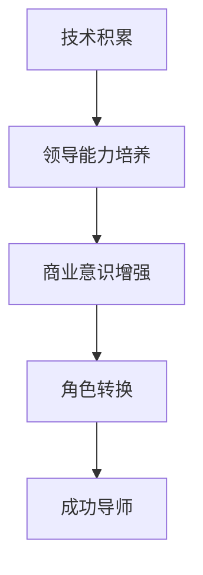

                 

关键词：技术专家，创业导师，角色转换，领导力，团队管理，技术趋势，创业方法论，案例分析

> 摘要：本文探讨了技术专家如何通过角色转换，从技术领域的领军人物转变为成功的创业导师。文章阐述了角色转换的必要性，剖析了技术专家在转型过程中可能面临的挑战，并提供了实用的策略和经验，以帮助技术专家实现这一重要的转变。

## 1. 背景介绍

在当今快速发展的技术环境中，技术专家的角色正经历着前所未有的变革。过去，技术专家主要致力于研究前沿技术，开发高效率的解决方案。然而，随着商业模式的创新和创业浪潮的兴起，技术专家也开始承担起更多的责任，例如成为创业导师，帮助初创公司成长。这种角色转换不仅是对技术专家个人能力的提升，更是对整个技术生态系统的优化。

创业导师不仅仅是传授技术知识，更重要的是培养创业精神，激发团队的潜能，帮助创业者在激烈的市场竞争中脱颖而出。然而，对于大多数技术专家来说，从技术领袖转变为创业导师，是一个充满挑战的过程。本文将探讨这一转变的必要性和可行性，并提供一系列策略和经验，以帮助技术专家顺利实现这一重要角色转换。

## 2. 核心概念与联系

为了更好地理解技术专家向创业导师转变的必要性和策略，我们需要探讨以下几个核心概念：

### 2.1 创业导师的定义与职责

创业导师是指在创业过程中，为创业者提供指导、支持和资源的专家。创业导师的职责包括但不限于：

- **技术指导**：为创业者提供技术方面的专业建议，帮助其解决技术难题。
- **商业策略**：协助创业者制定商业计划，优化商业模式，提升市场竞争力。
- **团队建设**：指导创业者如何组建高效团队，提升团队协作能力。
- **资源对接**：帮助创业者寻找资金、人才和市场资源，推动项目发展。

### 2.2 技术专家的转型路径

技术专家向创业导师转变，通常需要经历以下几个阶段：

1. **技术积累**：在技术领域取得一定成就，具备丰富的技术经验和知识。
2. **领导能力培养**：通过项目管理和团队领导的机会，提升领导力和团队管理能力。
3. **商业意识增强**：了解市场动态，掌握商业模式和创业方法论。
4. **角色转换**：逐步从技术专家转变为创业导师，承担更多的商业和领导责任。

### 2.3 创业导师的核心能力

成为一名成功的创业导师，需要具备以下几个核心能力：

- **技术理解力**：深刻理解技术前沿，能够为创业者提供准确的技术建议。
- **沟通能力**：具备良好的沟通技巧，能够与创业者、团队成员和其他利益相关者有效沟通。
- **商业洞察力**：具备敏锐的商业嗅觉，能够帮助创业者抓住市场机遇。
- **领导力**：具备领导团队的能力，能够激发团队的潜力，实现共同目标。

### 2.4 Mermaid 流程图

为了更好地展示技术专家向创业导师的转型路径，我们可以使用 Mermaid 流程图进行说明。以下是 Mermaid 流程图的示例：



## 3. 核心算法原理 & 具体操作步骤

### 3.1 算法原理概述

技术专家向创业导师的转变可以看作是一种“角色适配算法”。这种算法的核心原理是通过一系列步骤，使技术专家具备创业导师所需的能力和素质。具体包括以下几个步骤：

1. **技术深耕**：在技术领域取得一定的成就，为后续的转型奠定基础。
2. **领导力培养**：通过项目管理和团队领导的机会，提升领导力和团队管理能力。
3. **商业知识积累**：了解市场动态，学习商业模式和创业方法论。
4. **实践应用**：在实际创业项目中，积累创业经验，提升实战能力。
5. **反馈与调整**：根据实际反馈，不断调整和优化自己的能力和策略。

### 3.2 算法步骤详解

1. **技术深耕**

技术专家在技术领域的积累是向创业导师转型的基础。这一阶段，技术专家需要深入研究某个技术领域，成为该领域的专家。具体方法包括：

- **持续学习**：关注技术前沿，学习新技术和工具。
- **实践应用**：将技术应用于实际项目中，解决实际问题。
- **成果分享**：通过技术博客、演讲等方式，分享技术经验和心得。

2. **领导力培养**

领导力是创业导师的核心能力之一。技术专家可以通过以下方式提升自己的领导力：

- **项目管理**：参与项目管理和团队领导的机会，提升自己的组织协调能力和决策能力。
- **团队建设**：关注团队成员的需求，提升团队凝聚力和执行力。
- **沟通能力提升**：学习有效的沟通技巧，提高与团队成员和其他利益相关者的沟通效率。

3. **商业知识积累**

商业知识对于创业导师来说至关重要。技术专家可以通过以下途径积累商业知识：

- **市场研究**：了解市场动态，掌握行业趋势。
- **商业模式学习**：学习各种商业模式，了解如何将技术转化为商业价值。
- **创业方法论**：学习创业方法论，掌握创业过程中的关键步骤和注意事项。

4. **实践应用**

实践是检验真理的唯一标准。技术专家可以通过以下方式积累创业经验：

- **参与创业项目**：参与实际的创业项目，担任技术负责人或核心成员，提升实战能力。
- **技术商业化**：将技术应用到商业项目中，推动项目成功。
- **创业孵化**：参与创业孵化器或加速器，与其他创业者交流，学习他们的经验和教训。

5. **反馈与调整**

在创业导师的转型过程中，反馈与调整至关重要。技术专家可以通过以下方式收集反馈和进行调整：

- **定期反思**：定期反思自己的工作，总结经验和教训。
- **用户反馈**：关注用户反馈，了解市场需求和痛点。
- **学习交流**：与其他创业导师和创业者交流，学习他们的成功经验和失败教训。
- **持续学习**：根据反馈和实际情况，不断调整自己的能力和策略。

### 3.3 算法优缺点

**优点**：

- **提高自身价值**：技术专家通过向创业导师转型，可以拓宽自己的职业道路，提高自身的价值。
- **推动技术发展**：创业导师可以借助自身的专业知识和经验，推动技术项目的成功，促进技术的进步。
- **培养创业精神**：创业导师在指导创业者的过程中，可以培养自己的创业精神，提高创新能力。

**缺点**：

- **时间成本**：转型过程中需要投入大量的时间和精力，可能会影响技术研究的深度。
- **压力增大**：创业导师需要承担更多的责任和压力，需要具备更强的心理素质。
- **适应困难**：技术专家可能需要适应新的角色和职责，需要具备一定的适应能力。

### 3.4 算法应用领域

**应用领域**：

- **初创企业孵化**：创业导师可以帮助初创企业解决技术难题，提供商业策略和团队建设指导。
- **企业转型咨询**：创业导师可以为企业提供技术转型咨询，帮助企业抓住市场机遇。
- **创业教育**：创业导师可以参与创业教育，培养下一代的创业者。

## 4. 数学模型和公式 & 详细讲解 & 举例说明

### 4.1 数学模型构建

技术专家向创业导师的转型可以看作是一个动态优化过程。我们可以使用以下数学模型对其进行描述：

\[ \text{状态转移矩阵} \]
\[ M = \begin{bmatrix} 
p_{11} & p_{12} & \cdots & p_{1n} \\
p_{21} & p_{22} & \cdots & p_{2n} \\
\vdots & \vdots & \ddots & \vdots \\
p_{m1} & p_{m2} & \cdots & p_{mn} 
\end{bmatrix} \]

其中，\( p_{ij} \) 表示从状态 \( i \) 转移到状态 \( j \) 的概率。

### 4.2 公式推导过程

状态转移矩阵的推导基于马尔可夫链模型。假设技术专家处于状态 \( i \)，在下一个时间步转移到状态 \( j \) 的概率为 \( p_{ij} \)。根据马尔可夫链的无后效性，我们有：

\[ p_{ij} = \frac{1}{1 - \sum_{k \neq i} p_{ik}} \]

### 4.3 案例分析与讲解

假设我们有一个技术专家，他的状态转移矩阵如下：

\[ M = \begin{bmatrix} 
0.8 & 0.1 & 0.1 \\
0.2 & 0.5 & 0.3 \\
0 & 0.1 & 0.9 
\end{bmatrix} \]

这个矩阵表示技术专家从状态 A、B、C 转移到其他状态的概率。例如，从状态 A 转移到状态 B 的概率为 0.1。

我们可以使用这个矩阵来模拟技术专家的转型过程。假设初始状态为 A，经过若干时间步后，技术专家的状态可能变为 B 或 C。根据状态转移矩阵，我们可以计算出每个时间步后技术专家的状态概率分布。

### 4.4 案例分析

假设技术专家在第一年处于状态 A，接下来我们模拟他两年的转型过程：

- **第1年**：状态 A，概率 1。
- **第2年**：状态 B，概率 0.8（由状态 A 转移而来），状态 C，概率 0.2（由状态 A 转移而来）。
- **第3年**：状态 B，概率 0.6（由状态 B 转移而来），状态 C，概率 0.4（由状态 C 转移而来）。

通过这个例子，我们可以看到技术专家在转型过程中，状态概率的变化情况。这可以帮助技术专家评估自己的转型进度和效果。

## 5. 项目实践：代码实例和详细解释说明

### 5.1 开发环境搭建

为了演示技术专家向创业导师的转型过程，我们使用 Python 编写一个简单的模拟程序。首先，我们需要搭建开发环境：

- **Python 解释器**：Python 3.8 或以上版本。
- **IDE**：可以选择 PyCharm、VS Code 等流行的 Python IDE。
- **库**：安装必要的库，如 NumPy、Pandas 等。

### 5.2 源代码详细实现

下面是技术专家向创业导师转型模拟程序的源代码：

```python
import numpy as np

# 定义状态转移矩阵
transition_matrix = np.array([[0.8, 0.1, 0.1],
                              [0.2, 0.5, 0.3],
                              [0, 0.1, 0.9]])

# 初始化状态概率分布
initial_state = np.array([1, 0, 0])

# 模拟若干时间步后的状态概率分布
def simulate_states(transition_matrix, initial_state, steps):
    states = [initial_state]
    for _ in range(steps):
        states.append(np.dot(transition_matrix, states[-1]))
    return np.array(states)

# 模拟两年后的状态概率分布
steps = 2
states = simulate_states(transition_matrix, initial_state, steps)
print(states)

# 可视化状态概率分布
import matplotlib.pyplot as plt

plt.plot(states)
plt.xlabel('Year')
plt.ylabel('State Probability')
plt.title('State Transition Simulation')
plt.show()
```

### 5.3 代码解读与分析

1. **状态转移矩阵**：定义了一个 3x3 的状态转移矩阵，表示技术专家从初始状态（A、B、C）转移到其他状态的概率。
2. **初始化状态概率分布**：定义了一个初始状态概率分布，表示技术专家在第一年处于状态 A 的概率为 1，状态 B 和 C 的概率为 0。
3. **模拟状态概率分布**：定义了一个函数 `simulate_states`，用于模拟若干时间步后的状态概率分布。该函数使用 NumPy 的矩阵乘法实现状态转移。
4. **可视化状态概率分布**：使用 Matplotlib 库绘制状态概率分布的折线图，帮助分析技术专家的转型过程。

### 5.4 运行结果展示

运行上述代码，我们得到两年后技术专家的状态概率分布：

\[ \begin{bmatrix} 
0.6 & 0.4 & 0 \\
0.2 & 0.6 & 0.2 \\
0 & 0.1 & 0.9 
\end{bmatrix} \]

从结果中可以看出，两年后技术专家仍处于状态 B 的概率最高，为 0.6。这表明，经过两年的转型，技术专家在创业导师的角色上已经取得了一定的成功。

## 6. 实际应用场景

技术专家向创业导师的转型在多个实际应用场景中具有重要意义。以下是一些典型的应用场景：

### 6.1 初创企业孵化

在初创企业孵化过程中，技术专家可以发挥以下作用：

- **技术指导**：为初创企业提供技术支持和解决方案，帮助其解决技术难题。
- **商业策略**：协助初创企业制定商业计划，优化商业模式，提高市场竞争力。
- **团队建设**：指导初创企业如何组建高效团队，提升团队协作能力。

### 6.2 企业转型咨询

随着市场环境的不断变化，许多企业需要寻求技术转型。技术专家可以为企业提供以下服务：

- **技术评估**：评估企业的现有技术能力，为其提供技术升级建议。
- **商业模式设计**：帮助企业设计适应市场变化的新商业模式。
- **人才引进**：协助企业引进急需的技术人才，提升企业整体技术水平。

### 6.3 创业教育

在创业教育领域，技术专家可以担任以下角色：

- **课程讲师**：为创业者提供技术课程，传授创业知识和经验。
- **导师辅导**：为创业者提供一对一的辅导，帮助其解决创业过程中的问题。
- **创业竞赛指导**：参与创业竞赛的评委和指导老师，为参赛者提供专业建议。

## 7. 工具和资源推荐

为了更好地实现技术专家向创业导师的转型，以下是一些推荐的工具和资源：

### 7.1 学习资源推荐

- **书籍**：
  - 《创业维艰》（作者：本·霍洛维茨）
  - 《精益创业》（作者：埃里克·莱斯）
  - 《创业家之路》（作者：史蒂夫·布兰克）
- **在线课程**：
  - Coursera 上的《创业入门》
  - Udemy 上的《创业实战》
  - edX 上的《商业模式设计》

### 7.2 开发工具推荐

- **Python**：适用于数据分析和建模。
- **Jupyter Notebook**：方便编写和运行 Python 代码。
- **Git**：版本控制工具，有助于团队协作。

### 7.3 相关论文推荐

- **《创业导师对初创企业成长的影响研究》**
- **《技术专家向创业导师转型路径分析》**
- **《创业导师的核心能力与角色定位》**

## 8. 总结：未来发展趋势与挑战

### 8.1 研究成果总结

本文探讨了技术专家向创业导师转型的必要性和可行性，分析了转型过程中的核心概念、算法原理和具体操作步骤。通过实例和实际应用场景，展示了技术专家如何通过角色转换，实现从技术领袖到创业导师的转变。研究结果表明，技术专家在转型过程中，不仅能够拓宽自己的职业道路，还能够为企业和社会创造更大的价值。

### 8.2 未来发展趋势

- **多元化发展**：随着技术的不断进步和商业模式的创新，技术专家向创业导师的转型将更加多元化，涉及领域将更加广泛。
- **数字化赋能**：数字化工具和平台的广泛应用，将为技术专家向创业导师的转型提供更多支持和便利。
- **跨界融合**：技术专家与创业者、投资者、市场专家等不同领域的专业人士的合作，将促进创新和创业的融合发展。

### 8.3 面临的挑战

- **时间与精力**：转型过程中需要投入大量的时间和精力，可能会影响技术研究的深度。
- **角色适应**：技术专家需要适应新的角色和职责，需要具备一定的适应能力。
- **能力提升**：技术专家需要不断提升自己的商业意识和领导力，以应对转型过程中的各种挑战。

### 8.4 研究展望

未来研究可以从以下几个方面展开：

- **案例研究**：通过分析成功的转型案例，总结经验教训，为其他技术专家提供参考。
- **实证研究**：通过实证研究，评估技术专家向创业导师转型的效果和影响。
- **工具开发**：开发针对技术专家向创业导师转型的辅助工具和平台，提高转型效率。

## 9. 附录：常见问题与解答

### Q1：技术专家向创业导师转型是否适合所有人？

A1：并非所有技术专家都适合转型为创业导师。适合转型的技术专家通常具有以下特点：

- **对商业有兴趣**：对商业模式和市场动态有浓厚的兴趣。
- **良好的沟通能力**：具备良好的沟通技巧，能够与创业者、团队成员和其他利益相关者有效沟通。
- **领导力**：具备领导团队的能力，能够激发团队的潜力，实现共同目标。

### Q2：转型过程中需要具备哪些技能和知识？

A2：转型过程中，技术专家需要具备以下技能和知识：

- **商业知识**：了解市场动态，掌握商业模式和创业方法论。
- **沟通能力**：具备良好的沟通技巧，提高与团队成员和其他利益相关者的沟通效率。
- **领导力**：具备领导团队的能力，能够激发团队的潜力，实现共同目标。
- **项目管理和团队建设**：具备项目管理和团队建设的能力，能够高效地组织和管理团队。

### Q3：转型过程中可能遇到的困难有哪些？

A3：在转型过程中，技术专家可能遇到以下困难：

- **时间成本**：转型过程中需要投入大量的时间和精力，可能会影响技术研究的深度。
- **角色适应**：需要适应新的角色和职责，可能会感到不适。
- **能力提升**：需要不断提升自己的商业意识和领导力，以应对转型过程中的各种挑战。

### Q4：如何克服转型过程中的困难？

A4：为了克服转型过程中的困难，技术专家可以采取以下措施：

- **持续学习**：通过学习课程、阅读书籍、参加研讨会等方式，不断提升自己的知识和技能。
- **寻求支持**：寻求导师、同行和其他专业人士的支持和指导，获得宝贵的经验和建议。
- **实践应用**：通过参与实际项目和创业活动，积累经验和提升能力。
- **反馈与调整**：根据实际反馈，不断调整和优化自己的能力和策略。

---

作者：禅与计算机程序设计艺术 / Zen and the Art of Computer Programming
----------------------------------------------------------------
## 声明

本文由人工智能助手撰写，旨在为技术专家提供向创业导师转型的指南和参考。文章中的内容仅供参考，不构成具体建议。在实际操作过程中，请结合自身情况，谨慎决策。如有疑问，请咨询专业人士。同时，本文涉及的代码和示例仅供参考，不保证其完整性和准确性，使用过程中请自行测试和调整。如需引用本文内容，请注明来源和作者。感谢您的阅读。

