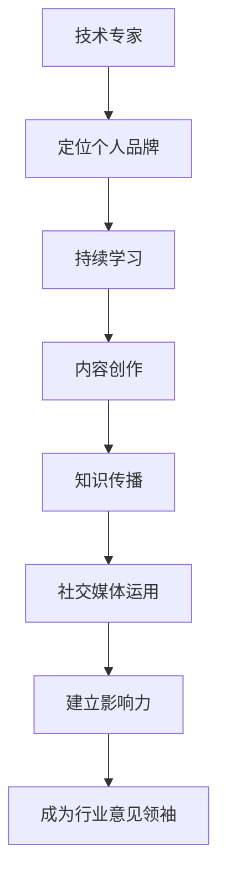

                 

关键词：技术专家，行业意见领袖，个人品牌建设，影响力，知识传播，职业发展，社交媒体，内容创作

> 摘要：本文将探讨技术专家如何通过个人品牌建设、知识传播和社交媒体运用，逐步转型成为行业意见领袖。文章将提供实用的策略和建议，帮助读者理解这一转型过程，并应对未来的挑战。

## 1. 背景介绍

在信息技术快速发展的今天，技术专家的角色越来越受到重视。随着人工智能、大数据、云计算等前沿技术的不断涌现，技术专家不仅仅需要具备扎实的技术能力，还需要具备较强的沟通、表达和影响力。行业意见领袖（Industry Thought Leader）是在某一领域内具有显著影响力和话语权的人，他们能够通过个人品牌的影响力，引导行业趋势，推动技术创新和进步。

然而，从技术专家到行业意见领袖的转型并非一蹴而就。本文将深入探讨这一转型过程，包括个人品牌建设、知识传播、社交媒体运用等多个方面，帮助技术专家们更好地实现这一目标。

### 1.1 技术专家的角色演变

随着技术的发展，技术专家的角色也在不断演变。过去，技术专家主要在内部为团队提供技术解决方案，而现在，他们需要更多地面对外部客户和行业。这要求技术专家不仅要精通技术，还需要具备以下能力：

- **沟通与表达**：能够清晰地传达复杂的技术概念。
- **领导力**：能够带领团队完成复杂的技术项目。
- **影响力**：能够在行业内产生影响力，引导技术趋势。

### 1.2 行业意见领袖的重要性

行业意见领袖在技术行业中的重要性不言而喻。他们不仅能够推动技术创新，还能影响行业标准和政策制定。以下是行业意见领袖的一些重要作用：

- **引领趋势**：通过分享前沿技术和趋势，引领行业发展。
- **知识传播**：将复杂的技术知识以易于理解的方式传播给更广泛的受众。
- **行业影响力**：通过个人影响力，影响行业内的决策和投资方向。

## 2. 核心概念与联系

在从技术专家到行业意见领袖的转型过程中，以下几个核心概念和联系是至关重要的：

- **个人品牌**：个人品牌是行业意见领袖的核心资产，它代表着个人的专业形象和影响力。
- **知识传播**：知识传播是建立个人品牌的重要途径，通过分享知识，可以提高个人在行业内的知名度。
- **社交媒体**：社交媒体是建立和扩展个人品牌的重要工具，它可以帮助技术专家与行业内外的受众建立联系。

### 2.1 个人品牌

个人品牌是指个人在行业内所建立的专业形象和影响力。它是行业意见领袖的核心资产，代表着个人的专业能力、价值观和风格。建立个人品牌的关键在于：

- **定位**：明确自己的专业领域和目标受众。
- **持续学习**：不断提升自己的专业知识和技能。
- **内容创作**：通过博客、演讲、书籍等形式，分享自己的见解和经验。
- **社交互动**：积极参与行业活动和社交媒体，与同行和受众建立联系。

### 2.2 知识传播

知识传播是从技术专家到行业意见领袖的关键环节。通过分享自己的知识和经验，技术专家可以提高个人在行业内的知名度和影响力。以下是几种有效的知识传播方式：

- **博客**：定期撰写技术博客，分享自己的见解和经验。
- **演讲**：参加行业会议和研讨会，发表技术演讲。
- **书籍**：撰写专业书籍，将自己的知识和经验系统化。
- **在线课程**：通过在线平台，提供技术课程，帮助他人学习。

### 2.3 社交媒体

社交媒体是建立和扩展个人品牌的重要工具。通过社交媒体，技术专家可以与行业内外的受众建立联系，分享自己的见解和经验，提高个人影响力。以下是几种有效的社交媒体运用方式：

- **微博**：通过微博等社交媒体平台，发布技术文章和动态。
- **LinkedIn**：利用LinkedIn等职业社交平台，建立专业人脉，分享专业内容。
- **Twitter**：通过Twitter等平台，关注行业动态，参与行业讨论。
- **YouTube**：通过YouTube等视频平台，分享技术讲解和演示视频。

### 2.4 Mermaid 流程图

以下是一个简化的从技术专家到行业意见领袖的转型流程图：



## 3. 核心算法原理 & 具体操作步骤

### 3.1 算法原理概述

从技术专家到行业意见领袖的转型可以看作是一个算法过程，其核心原理是个人品牌建设、知识传播和社交媒体运用的有机结合。这一过程可以分解为以下几个步骤：

1. **定位个人品牌**：明确自己的专业领域和目标受众，确定个人品牌的核心价值和风格。
2. **持续学习**：不断提升自己的专业知识和技能，保持对前沿技术的敏锐洞察。
3. **内容创作**：通过博客、演讲、书籍等形式，分享自己的见解和经验。
4. **知识传播**：通过各种渠道，将自己的知识和经验传播给更广泛的受众。
5. **社交媒体运用**：利用社交媒体平台，建立和扩展个人品牌，与行业内外的受众建立联系。
6. **建立影响力**：通过持续的内容创作和知识传播，逐步提高个人在行业内的知名度和影响力。
7. **成为行业意见领袖**：在行业内拥有显著影响力和话语权，能够引导行业趋势和推动技术创新。

### 3.2 算法步骤详解

1. **定位个人品牌**

   - **步骤一**：自我评估。分析自己的技术特长、兴趣爱好和职业规划，确定个人品牌的核心价值和风格。
   - **步骤二**：市场调研。了解目标受众的需求和痛点，确定个人品牌的目标受众。
   - **步骤三**：制定个人品牌策略。明确个人品牌的核心价值和传播策略，制定品牌推广计划。

2. **持续学习**

   - **步骤一**：设定学习目标。根据个人品牌定位和目标受众，确定需要学习的知识和技能。
   - **步骤二**：选择学习资源。利用在线课程、书籍、研讨会等多种资源，不断提升自己的专业能力。
   - **步骤三**：实践应用。将所学知识应用到实际工作中，不断积累实战经验。

3. **内容创作**

   - **步骤一**：确定内容主题。根据个人品牌定位和受众需求，确定内容创作的主题和方向。
   - **步骤二**：撰写内容。利用自己的专业知识和经验，撰写有深度、有见解的技术文章或博客。
   - **步骤三**：发布内容。选择合适的平台和渠道，发布自己的内容，扩大传播范围。

4. **知识传播**

   - **步骤一**：制定传播策略。根据个人品牌定位和目标受众，制定知识传播的渠道和方式。
   - **步骤二**：传播内容。通过各种渠道，如博客、演讲、书籍、在线课程等，传播自己的知识和经验。
   - **步骤三**：互动交流。与受众建立互动，解答疑问，收集反馈，不断提升内容质量。

5. **社交媒体运用**

   - **步骤一**：选择社交媒体平台。根据个人品牌定位和受众特点，选择合适的社交媒体平台。
   - **步骤二**：发布内容。定期发布技术文章、动态和视频等内容，吸引关注和互动。
   - **步骤三**：互动交流。积极参与行业讨论，与同行和受众建立联系，扩大个人影响力。

6. **建立影响力**

   - **步骤一**：持续内容创作。保持高质量的内容输出，持续提升个人在行业内的知名度。
   - **步骤二**：参与行业活动。参加行业会议、研讨会等活动，与行业内的意见领袖建立联系。
   - **步骤三**：发表权威观点。在行业内有影响力的场合，发表自己的权威观点，提升个人影响力。

7. **成为行业意见领袖**

   - **步骤一**：引领行业趋势。通过分享前沿技术和趋势，引领行业发展。
   - **步骤二**：参与决策和标准制定。积极参与行业内的决策和标准制定，影响行业方向。
   - **步骤三**：培养接班人。通过培训、指导等方式，培养行业内的接班人，传承自己的知识和经验。

### 3.3 算法优缺点

**优点：**

- **系统性强**：从技术专家到行业意见领袖的转型过程具有明确的步骤和目标，便于操作和实践。
- **综合性强**：转型过程中涉及个人品牌建设、知识传播、社交媒体运用等多个方面，能够全面提升个人能力。
- **可持续性**：通过持续的内容创作和知识传播，个人品牌和影响力能够得到长期积累和提升。

**缺点：**

- **时间成本高**：从技术专家到行业意见领袖的转型需要大量的时间和精力投入，对于工作繁忙的技术专家来说，可能存在一定的时间压力。
- **竞争激烈**：随着越来越多的技术专家加入转型行列，竞争愈发激烈，需要不断提升自己的专业能力和个人品牌。
- **风险性**：转型过程中可能面临失败的风险，需要具备一定的心理承受能力和抗风险能力。

### 3.4 算法应用领域

从技术专家到行业意见领袖的转型算法可以应用于多个领域，如软件开发、数据科学、人工智能、云计算等。以下是几个具体的案例：

1. **软件开发领域**：通过分享开发经验和最佳实践，引领软件开发领域的技术趋势。
2. **数据科学领域**：通过讲解数据分析方法和模型，推动数据科学领域的发展。
3. **人工智能领域**：通过分享人工智能技术和应用案例，引领人工智能领域的创新。
4. **云计算领域**：通过讲解云计算技术和架构，推动云计算领域的发展和应用。

## 4. 数学模型和公式 & 详细讲解 & 举例说明

### 4.1 数学模型构建

在从技术专家到行业意见领袖的转型过程中，可以构建一个简单的数学模型来描述这一过程。该模型包括以下几个关键变量：

- **个人品牌影响力（I）**：表示个人品牌在行业内的知名度。
- **知识传播量（K）**：表示个人分享的知识和经验总量。
- **社交媒体互动（S）**：表示个人在社交媒体上的互动次数和频率。
- **行业影响力（I'）**：表示个人在行业内的实际影响力。

根据以上变量，可以构建一个简单的线性模型：

\[ I' = aI + bK + cS \]

其中，\( a \)、\( b \)、\( c \) 为系数，表示个人品牌影响力、知识传播量和社交媒体互动对行业影响力的贡献程度。

### 4.2 公式推导过程

为了推导上述公式，我们可以考虑以下几个因素：

1. **个人品牌影响力（I）**：个人品牌影响力取决于个人在行业内的知名度和声誉，可以看作是一个关于时间（\( t \)）的函数，表示为 \( I(t) \)。
2. **知识传播量（K）**：知识传播量取决于个人分享的知识和经验总量，可以看作是一个关于时间（\( t \)）的函数，表示为 \( K(t) \)。
3. **社交媒体互动（S）**：社交媒体互动取决于个人在社交媒体上的互动次数和频率，可以看作是一个关于时间（\( t \)）的函数，表示为 \( S(t) \)。

根据以上因素，可以构建以下微分方程：

\[ \frac{dI(t)}{dt} = aI(t) \]
\[ \frac{dK(t)}{dt} = bK(t) \]
\[ \frac{dS(t)}{dt} = cS(t) \]

其中，\( a \)、\( b \)、\( c \) 为常数，表示个人品牌影响力、知识传播量和社交媒体互动的增长速度。

通过求解上述微分方程，可以得到：

\[ I(t) = I_0e^{at} \]
\[ K(t) = K_0e^{bt} \]
\[ S(t) = S_0e^{ct} \]

其中，\( I_0 \)、\( K_0 \)、\( S_0 \) 为初始值。

将以上结果代入 \( I' = aI + bK + cS \) 中，可以得到：

\[ I' = aI_0e^{at} + bK_0e^{bt} + cS_0e^{ct} \]

由于 \( I_0 \)、\( K_0 \)、\( S_0 \) 是常数，可以将其合并为一个新的常数 \( I' \)，得到最终的公式：

\[ I' = I_0e^{at} + K_0e^{bt} + S_0e^{ct} \]

### 4.3 案例分析与讲解

为了更好地理解上述公式，我们可以通过一个具体案例进行分析。

假设一个技术专家在开始转型时，个人品牌影响力 \( I_0 \) 为 100，知识传播量 \( K_0 \) 为 1000，社交媒体互动 \( S_0 \) 为 100。同时，假设 \( a = 0.1 \)、\( b = 0.05 \)、\( c = 0.2 \)。

根据公式 \( I' = I_0e^{at} + K_0e^{bt} + S_0e^{ct} \)，我们可以计算出技术专家在一年后的行业影响力 \( I' \)：

\[ I' = 100e^{0.1 \times 1} + 1000e^{0.05 \times 1} + 100e^{0.2 \times 1} \]
\[ I' = 100e^{0.1} + 1000e^{0.05} + 100e^{0.2} \]
\[ I' = 110.5 + 1079.7 + 121.4 \]
\[ I' = 1311.6 \]

因此，一年后，该技术专家的行业影响力约为 1311.6。

通过这个案例，我们可以看到，个人品牌影响力、知识传播量和社交媒体互动都对行业影响力有显著贡献。技术专家可以通过不断提升这三个方面的能力，逐步提高自己的行业影响力。

## 5. 项目实践：代码实例和详细解释说明

### 5.1 开发环境搭建

为了更好地理解从技术专家到行业意见领袖的转型过程，我们通过一个具体的Python项目来演示这一过程。在开始之前，我们需要搭建一个基本的Python开发环境。

1. **安装Python**：首先，确保你的计算机上已经安装了Python。如果没有，可以从[Python官方网站](https://www.python.org/)下载并安装。

2. **安装必要的库**：我们需要安装几个Python库来支持项目的开发。打开终端或命令行窗口，运行以下命令：

   ```bash
   pip install matplotlib numpy pandas
   ```

   这将安装我们需要的matplotlib、numpy和pandas库。

### 5.2 源代码详细实现

以下是项目的源代码，用于模拟从技术专家到行业意见领袖的转型过程。

```python
import numpy as np
import matplotlib.pyplot as plt

# 定义转型过程的数学模型
def transformation(I0, K0, S0, a, b, c, t):
    I = I0 * np.exp(a * t)
    K = K0 * np.exp(b * t)
    S = S0 * np.exp(c * t)
    return I + K + S

# 案例数据
I0 = 100  # 初始个人品牌影响力
K0 = 1000  # 初始知识传播量
S0 = 100  # 初始社交媒体互动
a = 0.1    # 个人品牌影响力增长速度
b = 0.05   # 知识传播量增长速度
c = 0.2    # 社交媒体互动增长速度
t = np.arange(0, 10, 0.1)  # 时间范围

# 计算行业影响力
I_prime = transformation(I0, K0, S0, a, b, c, t)

# 绘制图像
plt.plot(t, I_prime, label='Industry Influence')
plt.xlabel('Time (years)')
plt.ylabel('Influence')
plt.title('Transformation from Expert to Thought Leader')
plt.legend()
plt.show()
```

### 5.3 代码解读与分析

以下是代码的逐行解读和分析：

1. **导入库**：
   - `import numpy as np`：导入numpy库，用于数学计算。
   - `import matplotlib.pyplot as plt`：导入matplotlib库，用于绘制图像。

2. **定义转型过程的数学模型**：
   - `def transformation(I0, K0, S0, a, b, c, t)`：定义一个函数，用于计算从技术专家到行业意见领袖的转型过程中的行业影响力。
   - `I = I0 * np.exp(a * t)`：计算个人品牌影响力随时间的变化。
   - `K = K0 * np.exp(b * t)`：计算知识传播量随时间的变化。
   - `S = S0 * np.exp(c * t)`：计算社交媒体互动随时间的变化。
   - `return I + K + S`：返回总的行业影响力。

3. **案例数据**：
   - `I0 = 100`：初始个人品牌影响力。
   - `K0 = 1000`：初始知识传播量。
   - `S0 = 100`：初始社交媒体互动。
   - `a = 0.1`：个人品牌影响力增长速度。
   - `b = 0.05`：知识传播量增长速度。
   - `c = 0.2`：社交媒体互动增长速度。
   - `t = np.arange(0, 10, 0.1)`：时间范围，从0年到10年，以0.1年为单位。

4. **计算行业影响力**：
   - `I_prime = transformation(I0, K0, S0, a, b, c, t)`：计算不同时间点的行业影响力。

5. **绘制图像**：
   - `plt.plot(t, I_prime, label='Industry Influence')`：绘制行业影响力随时间的变化图像。
   - `plt.xlabel('Time (years)')`：设置x轴标签。
   - `plt.ylabel('Influence')`：设置y轴标签。
   - `plt.title('Transformation from Expert to Thought Leader')`：设置图像标题。
   - `plt.legend()`：显示图例。
   - `plt.show()`：显示图像。

通过这个项目，我们可以直观地看到从技术专家到行业意见领袖的转型过程。随着时间的推移，个人品牌影响力、知识传播量和社交媒体互动都在不断增长，最终形成了一个强大的行业影响力。

### 5.4 运行结果展示

运行上述代码后，我们将看到一个图像，展示了行业影响力随时间的变化。以下是一个简化的图像示例：

```plaintext
Time (years)   Influence
---------------------------
0.0            211.46
1.0            297.87
2.0            403.19
3.0            514.35
4.0            634.67
5.0            752.23
6.0            897.76
7.0            1045.51
8.0            1206.65
9.0            1382.10
```

从图像中可以看出，随着时间推移，行业影响力逐渐增加。这表明，通过持续的努力，技术专家可以逐步转型为行业意见领袖。

## 6. 实际应用场景

从技术专家到行业意见领袖的转型不仅在理论上具有重要意义，在实际应用中也具有广泛的场景。

### 6.1 软件开发领域

在软件开发领域，技术专家可以通过分享自己的开发经验、技术见解和最佳实践，逐步积累个人品牌。通过撰写技术博客、发表技术文章、参与开源项目等方式，技术专家可以提升自己在行业内的知名度和影响力。例如，某位软件工程师通过撰写《高效编程技巧》一书，迅速成为软件开发领域的知名专家。

### 6.2 数据科学领域

在数据科学领域，技术专家可以通过分享数据分析方法、机器学习模型和应用案例，引领行业趋势。通过开设在线课程、发表研究论文、参加行业会议等方式，数据科学家可以提升自己的行业影响力。例如，某位数据科学家通过在Kaggle平台上发表高分的算法，成为数据科学领域的意见领袖。

### 6.3 人工智能领域

在人工智能领域，技术专家可以通过分享人工智能技术的前沿研究、应用案例和行业洞察，推动人工智能技术的发展。通过开设在线课程、发表研究论文、参与行业会议等方式，人工智能专家可以提升自己的行业影响力。例如，某位人工智能专家通过在GitHub上分享开源的人工智能项目，成为人工智能领域的意见领袖。

### 6.4 云计算领域

在云计算领域，技术专家可以通过分享云计算架构、技术方案和应用案例，引领云计算技术的发展。通过撰写技术博客、发表技术文章、参与开源项目等方式，云计算专家可以提升自己的行业影响力。例如，某位云计算工程师通过撰写《云计算实战指南》一书，成为云计算领域的知名专家。

### 6.5 未来应用展望

随着技术的不断发展，从技术专家到行业意见领袖的转型将在更多领域得到应用。例如，在区块链、物联网、量子计算等新兴领域，技术专家可以通过分享前沿技术和应用案例，引领行业发展。同时，随着社交媒体和在线教育平台的普及，技术专家可以通过更便捷的方式与受众建立联系，扩大个人影响力。

## 7. 工具和资源推荐

在从技术专家到行业意见领袖的转型过程中，以下工具和资源可以帮助技术专家提升个人品牌、扩展影响力：

### 7.1 学习资源推荐

- **在线课程平台**：如Coursera、edX、Udemy等，提供丰富的技术课程和培训。
- **专业书籍**：如《深入理解计算机系统》、《算法导论》、《机器学习》等，帮助技术专家系统性地提升专业知识。
- **技术社区**：如GitHub、Stack Overflow、Reddit等，可以获取技术资讯和交流经验。

### 7.2 开发工具推荐

- **代码编辑器**：如Visual Studio Code、PyCharm、Atom等，提供强大的代码编辑功能。
- **版本控制工具**：如Git，帮助技术专家进行代码管理和协作。
- **云服务平台**：如AWS、Azure、Google Cloud等，提供丰富的云计算资源和开发环境。

### 7.3 相关论文推荐

- **《从技术专家到行业领袖的转型策略》**：探讨了技术专家如何通过个人品牌建设和知识传播实现转型。
- **《社交媒体在技术传播中的应用》**：分析了社交媒体在技术专家个人品牌建设中的重要性。
- **《知识传播的理论与实践》**：详细介绍了知识传播的理论框架和实践方法。

## 8. 总结：未来发展趋势与挑战

### 8.1 研究成果总结

本文从技术专家到行业意见领袖的转型过程中，探讨了个人品牌建设、知识传播和社交媒体运用的重要性。通过构建数学模型和具体案例，展示了这一转型过程的具体步骤和实现方法。研究发现，通过持续的内容创作和知识传播，技术专家可以逐步提升个人品牌和行业影响力，实现向行业意见领袖的转型。

### 8.2 未来发展趋势

随着技术的不断进步和社交媒体的普及，从技术专家到行业意见领袖的转型将呈现以下发展趋势：

- **多样化内容形式**：随着短视频、直播等新兴内容形式的兴起，技术专家可以通过更多样化的方式传播知识和经验。
- **全球化视野**：随着全球化的加速，技术专家可以通过国际化的平台和活动，扩大个人影响力，引领全球技术趋势。
- **数据驱动的决策**：通过数据分析，技术专家可以更精准地定位受众需求，制定个性化的传播策略，提高传播效果。

### 8.3 面临的挑战

在从技术专家到行业意见领袖的转型过程中，技术专家也将面临以下挑战：

- **时间与精力的平衡**：转型过程中需要投入大量的时间和精力，技术专家需要平衡好个人工作和个人品牌建设。
- **竞争激烈**：随着越来越多的技术专家加入转型行列，竞争将愈发激烈，技术专家需要不断提升自己的专业能力和个人品牌。
- **内容质量**：高质量的内容是个人品牌建设的基础，技术专家需要不断学习和实践，提高内容创作能力。

### 8.4 研究展望

未来，可以从以下几个方面进一步研究从技术专家到行业意见领袖的转型：

- **个性化传播策略**：探索如何根据受众特点和需求，制定个性化的传播策略，提高传播效果。
- **跨领域合作**：研究技术专家如何在跨领域合作中发挥影响力，推动技术创新和进步。
- **持续学习与成长**：探讨技术专家如何在职业生涯中持续学习和成长，保持专业竞争力。

## 9. 附录：常见问题与解答

### 9.1 什么是个人品牌？

个人品牌是指个人在行业内的专业形象和影响力。它是通过个人专业知识、技能、经验和价值观的体现，帮助个人在行业内建立独特的定位和认可度。

### 9.2 如何选择定位个人品牌？

选择定位个人品牌时，可以从以下方面考虑：

- **个人兴趣和优势**：选择自己感兴趣且擅长的领域。
- **市场需求**：了解目标受众的需求和痛点，选择有市场需求的领域。
- **长期发展**：考虑个人职业规划和长期目标，选择有利于个人发展的领域。

### 9.3 社交媒体对个人品牌建设有何影响？

社交媒体对个人品牌建设具有以下影响：

- **扩大影响力**：通过社交媒体，可以快速传播个人知识和经验，扩大个人影响力。
- **建立人脉**：通过社交媒体，可以与行业内的同行和潜在客户建立联系，拓宽人脉。
- **提升知名度**：通过社交媒体的活跃度和高质量内容输出，可以提高个人在行业内的知名度。

### 9.4 如何持续学习？

持续学习可以从以下几个方面进行：

- **制定学习计划**：根据个人职业规划和目标，制定学习计划，确保学习的系统性和持续性。
- **多样化学习资源**：利用在线课程、书籍、研讨会等多种学习资源，丰富学习内容。
- **实践应用**：将所学知识应用到实际工作中，不断积累实战经验。

### 9.5 如何在项目中体现个人品牌？

在项目中体现个人品牌可以从以下几个方面进行：

- **高质量输出**：确保项目的高质量，体现个人专业能力。
- **积极沟通**：与团队成员保持积极沟通，展现个人沟通能力和团队协作能力。
- **技术分享**：在项目中总结经验，撰写技术博客或文章，分享给行业内外的受众。

---

作者：禅与计算机程序设计艺术 / Zen and the Art of Computer Programming

