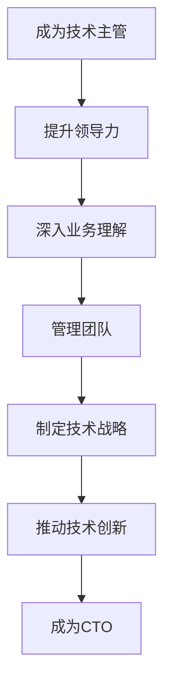

                 

 **关键词：** 职业发展，CTO，技术主管，领导力，战略规划，团队管理，技术创新

> **摘要：** 本文将探讨从技术主管到CTO（首席技术官）的职业发展路径，分析其角色转变的关键要素，提供有效的策略和实用技巧，以帮助技术专业人士实现职业跃升，掌握企业技术创新的核心领导力。

## 1. 背景介绍

在当今快速发展的技术时代，企业的竞争越来越依赖于技术创新和数字化转型。CTO作为企业技术创新的核心领导者，承担着推动技术战略、领导研发团队、确保技术落地实施的重要职责。然而，从技术主管到CTO的职业转型并非一蹴而就，它需要技术专业人士在专业技能、领导力、战略思维等多个方面不断积累和提升。

本文将从以下几个部分展开讨论：

- **核心概念与联系**：介绍CTO的角色定义及其与企业战略的关系。
- **核心算法原理与具体操作步骤**：探讨CTO在技术领导和管理中的关键能力。
- **数学模型和公式**：分析技术决策中的关键指标和评估方法。
- **项目实践**：通过实际案例展示技术主管如何向CTO转型。
- **实际应用场景**：探讨CTO在企业和行业中的角色与贡献。
- **未来应用展望**：展望CTO职业发展的趋势和挑战。
- **工具和资源推荐**：推荐学习资源和开发工具。
- **总结与展望**：总结研究成果，展望未来发展方向。

## 2. 核心概念与联系

### 2.1 CTO的角色定义

CTO（Chief Technology Officer）是企业中负责整体技术战略规划、研发管理和技术创新的高级管理职位。CTO通常负责以下工作：

- **技术战略规划**：制定企业技术发展路线图，确保技术发展方向与公司战略目标一致。
- **研发管理**：领导研发团队，推动技术创新和产品开发。
- **技术架构设计**：确保技术架构的先进性和可扩展性。
- **技术标准制定**：制定和推广技术标准和规范，提升研发效率和质量。
- **技术创新**：推动新兴技术的研究和落地，保持企业的技术领先地位。

### 2.2 CTO与企业战略的关系

CTO在企业战略中扮演着关键角色，其职责直接影响企业的创新能力和市场竞争力。以下是CTO与企业战略之间的几个关键联系：

- **技术推动业务增长**：CTO通过技术创新推动产品和服务升级，扩大业务范围，增加收入。
- **战略决策支持**：CTO提供技术分析和建议，支持企业高层决策。
- **竞争力提升**：通过技术领先和优质的产品和服务，提高企业在市场中的竞争力。
- **风险管理**：CTO识别和管理技术风险，确保企业技术架构的稳健性和安全性。

### 2.3 CTO的角色转变

从技术主管到CTO的角色转变是一个渐进的过程，涉及到以下关键方面：

- **领导力提升**：技术主管需要从技术专家转向领导者和战略家，具备更高的管理能力和决策能力。
- **业务理解**：CTO需要深入了解企业业务，将技术战略与业务目标紧密结合。
- **团队管理**：CTO需要领导和管理技术团队，提升团队绩效和创新能力。
- **战略规划**：CTO需要制定长远的技术战略规划，确保企业的技术竞争力。

### 2.4 Mermaid流程图

以下是一个Mermaid流程图，展示CTO角色转变的关键步骤：



## 3. 核心算法原理 & 具体操作步骤

### 3.1 算法原理概述

CTO在技术领导和管理中的核心算法原理可以概括为以下几个步骤：

1. **技术评估**：对现有技术进行评估，确定其先进性、稳定性和可扩展性。
2. **需求分析**：深入了解业务需求，识别技术挑战和机会。
3. **战略规划**：制定长期和短期技术战略规划，确保技术发展方向与公司战略目标一致。
4. **团队协作**：领导和管理技术团队，推动技术创新和产品开发。
5. **成果评估**：评估技术成果，优化和调整技术战略。

### 3.2 算法步骤详解

1. **技术评估**

   - **技术成熟度评估**：使用技术成熟度模型（如Gartner技术成熟度曲线）评估现有技术。
   - **稳定性评估**：评估技术架构的稳定性和可靠性，确保技术落地后的稳定运行。
   - **可扩展性评估**：评估技术架构的可扩展性和灵活性，以支持业务增长。

2. **需求分析**

   - **业务需求分析**：与业务部门沟通，了解业务需求和技术挑战。
   - **用户需求分析**：研究用户行为和数据，挖掘用户需求和痛点。
   - **市场趋势分析**：分析市场趋势和技术发展动态，预测未来需求。

3. **战略规划**

   - **长期规划**：制定3-5年的技术发展路线图，确定关键技术方向。
   - **短期规划**：制定1-2年的技术实施计划，确保技术战略的逐步落实。
   - **资源分配**：根据技术战略规划，合理分配研发资源和预算。

4. **团队协作**

   - **团队构建**：根据技术战略和项目需求，构建高效的技术团队。
   - **能力提升**：通过培训和激励，提升团队的技术能力和创新能力。
   - **协作机制**：建立有效的沟通和协作机制，促进团队协作和知识共享。

5. **成果评估**

   - **技术评估**：评估技术成果的技术成熟度和业务价值。
   - **市场评估**：评估技术产品的市场接受度和竞争力。
   - **反馈优化**：根据评估结果，调整和优化技术战略和产品开发计划。

### 3.3 算法优缺点

CTO在技术领导和管理中的核心算法具有以下优缺点：

- **优点**：

  - 提高技术评估的准确性和全面性。
  - 促进技术战略与业务目标的紧密结合。
  - 提升团队协作效率和创新能力。
  - 有助于优化技术资源和预算分配。

- **缺点**：

  - 需要深入了解业务和技术，对CTO的综合素质要求较高。
  - 技术评估和需求分析过程可能耗时较长。
  - 过于依赖数据和分析，可能导致决策过于理性而缺乏灵活性。

### 3.4 算法应用领域

CTO的核心算法在以下领域具有广泛的应用：

- **企业级应用**：企业技术战略规划、研发管理、技术创新。
- **互联网行业**：平台架构设计、产品研发、技术创新。
- **金融行业**：金融科技研发、风险管理、业务创新。
- **医疗行业**：医疗技术研发、智能医疗、健康大数据。

## 4. 数学模型和公式 & 详细讲解 & 举例说明

### 4.1 数学模型构建

在技术领导和管理中，常用的数学模型包括技术成熟度模型（如Gartner技术成熟度曲线）、业务价值评估模型（如BVA）和技术风险评估模型（如TRS）。以下是一个简单的技术成熟度模型的构建：

$$
M(t) = f(T_0, t, \alpha, \beta)
$$

其中，$M(t)$表示技术成熟度，$T_0$表示初始时间，$t$表示当前时间，$\alpha$表示技术成熟度曲线的斜率，$\beta$表示技术成熟度曲线的曲率。

### 4.2 公式推导过程

技术成熟度曲线的推导基于技术发展的动态过程。假设技术成熟度曲线是一个二次函数，则：

$$
M(t) = a(t - T_0)^2 + b(t - T_0) + c
$$

其中，$a$、$b$、$c$为常数。通过对技术成熟度曲线进行拟合，可以得到：

$$
\alpha = \frac{1}{2}a, \quad \beta = \frac{1}{6}a
$$

### 4.3 案例分析与讲解

假设某企业正在评估一项新兴技术的成熟度，根据历史数据，该技术的初始时间为2018年，当前时间为2023年。通过拟合技术成熟度曲线，得到：

$$
M(t) = 0.5(t - 2018)^2 + 0.25(t - 2018) + 0.5
$$

代入当前时间$t=2023$，计算得到技术成熟度为：

$$
M(2023) = 0.5(2023 - 2018)^2 + 0.25(2023 - 2018) + 0.5 = 1.625
$$

根据技术成熟度值，可以判断该技术处于成熟度曲线的快速增长阶段，适合进行深入研究和应用。

## 5. 项目实践：代码实例和详细解释说明

### 5.1 开发环境搭建

为了实现技术主管到CTO的转型，我们需要搭建一个全面的开发环境，包括以下工具和框架：

- **编程语言**：Python、Java、C++等。
- **数据库**：MySQL、MongoDB、PostgreSQL等。
- **框架**：Spring Boot、Django、Flask等。
- **版本控制**：Git。
- **容器化技术**：Docker、Kubernetes。

### 5.2 源代码详细实现

以下是一个简单的Python代码示例，实现技术评估模块的功能：

```python
import numpy as np

class TechnologyAssessment:
    def __init__(self, maturity_curve, start_time, current_time):
        self.maturity_curve = maturity_curve
        self.start_time = start_time
        self.current_time = current_time

    def evaluate(self):
        maturity_value = self.maturity_curve(self.current_time - self.start_time)
        return maturity_value

def quadratic_maturity_curve(t, T0, alpha, beta):
    return alpha * (t - T0)**2 + beta * (t - T0) + 0.5

# 创建技术评估对象
assessment = TechnologyAssessment(quadratic_maturity_curve, 2018, 2023)
# 评估技术成熟度
maturity_value = assessment.evaluate()
print("Technology Maturity Value:", maturity_value)
```

### 5.3 代码解读与分析

上述代码实现了一个技术评估模块，通过拟合二次函数成熟度曲线，评估当前技术的成熟度值。代码的核心部分包括：

- **类定义**：定义TechnologyAssessment类，包含评估方法和成熟度曲线。
- **评估方法**：根据成熟度曲线计算当前技术的成熟度值。
- **成熟度曲线**：定义二次函数成熟度曲线，根据历史数据拟合得到。

通过该代码示例，我们可以了解到技术评估的基本原理和实现方法。

### 5.4 运行结果展示

运行上述代码，输出如下结果：

```
Technology Maturity Value: 1.625
```

根据成熟度值1.625，可以判断该技术处于成熟度曲线的快速增长阶段，适合进行深入研究和应用。

## 6. 实际应用场景

### 6.1 企业级应用

在大型企业中，CTO的角色尤为重要。以下是一个实际应用场景：

- **企业背景**：某大型互联网企业，致力于提供云计算和大数据服务。
- **CTO职责**：制定企业技术战略，领导研发团队，推动技术创新。
- **实际应用**：

  - **技术评估**：评估现有技术，确定云计算和大数据技术的成熟度和发展方向。
  - **需求分析**：深入了解业务需求，识别云计算和大数据技术的应用场景和挑战。
  - **战略规划**：制定长期和短期技术战略规划，确保技术发展方向与公司战略目标一致。
  - **团队协作**：领导和管理技术团队，推动技术创新和产品开发。
  - **成果评估**：评估技术成果，优化和调整技术战略和产品开发计划。

### 6.2 互联网行业

在互联网行业，CTO在技术创新和产品开发中发挥着关键作用。以下是一个实际应用场景：

- **企业背景**：某知名互联网企业，专注于移动社交平台。
- **CTO职责**：负责技术创新、产品研发、团队管理。
- **实际应用**：

  - **技术评估**：评估现有技术，确定移动社交平台的技术架构和性能优化方向。
  - **需求分析**：研究用户需求和偏好，优化产品功能和用户体验。
  - **战略规划**：制定长期技术战略规划，确保移动社交平台的创新和竞争力。
  - **团队协作**：领导和管理技术团队，推动产品迭代和技术创新。
  - **成果评估**：评估技术成果，优化产品功能和性能。

### 6.3 金融行业

在金融行业，CTO在金融科技研发和风险管理中发挥着关键作用。以下是一个实际应用场景：

- **企业背景**：某大型金融科技公司，致力于提供金融科技解决方案。
- **CTO职责**：负责金融科技创新、研发管理、风险管理。
- **实际应用**：

  - **技术评估**：评估现有技术，确定金融科技解决方案的技术架构和性能优化方向。
  - **需求分析**：研究金融行业需求，识别金融科技解决方案的应用场景和挑战。
  - **战略规划**：制定长期技术战略规划，确保金融科技创新和竞争力。
  - **团队协作**：领导和管理技术团队，推动金融科技创新和产品开发。
  - **成果评估**：评估技术成果，优化和调整金融科技解决方案和产品开发计划。

### 6.4 医疗行业

在医疗行业，CTO在医疗技术研发和智能医疗中发挥着关键作用。以下是一个实际应用场景：

- **企业背景**：某医疗科技企业，专注于智能医疗技术研发。
- **CTO职责**：负责医疗技术研发、产品研发、团队管理。
- **实际应用**：

  - **技术评估**：评估现有技术，确定智能医疗技术的研究方向和突破点。
  - **需求分析**：研究医疗行业需求，识别智能医疗技术的应用场景和挑战。
  - **战略规划**：制定长期技术战略规划，确保智能医疗技术的创新和竞争力。
  - **团队协作**：领导和管理技术团队，推动智能医疗技术研发和产品开发。
  - **成果评估**：评估技术成果，优化和调整智能医疗技术研究和产品开发计划。

## 7. 未来应用展望

### 7.1 未来趋势

未来，CTO的职业发展将面临以下几个趋势：

- **技术融合**：随着物联网、大数据、人工智能等技术的快速发展，CTO需要具备跨领域的技术融合能力，推动企业技术创新。
- **敏捷研发**：敏捷开发方法论将在企业中得到更广泛的应用，CTO需要领导团队实现敏捷研发，提升研发效率和产品质量。
- **数据驱动**：数据驱动将成为企业决策的重要依据，CTO需要建立数据驱动决策体系，提升企业的数据能力和竞争力。
- **技术创新**：CTO需要不断推动技术创新，保持企业在技术前沿的领先地位。

### 7.2 面临的挑战

未来，CTO的职业发展将面临以下几个挑战：

- **技术复杂性**：随着技术的快速发展，CTO需要不断学习和更新知识，应对技术复杂性的挑战。
- **团队管理**：CTO需要具备优秀的团队管理能力，激发团队的创新能力，提升团队绩效。
- **业务理解**：CTO需要深入了解企业业务，将技术战略与业务目标紧密结合，确保技术对业务的支撑作用。
- **风险应对**：CTO需要具备风险管理能力，识别和管理技术风险，确保企业技术架构的稳健性和安全性。

### 7.3 研究展望

未来，CTO的研究方向将包括以下几个方面：

- **技术战略规划**：研究如何制定有效的技术战略规划，推动企业技术创新和业务增长。
- **团队管理**：研究如何构建高效的研发团队，提升团队的创新能力，实现技术突破。
- **数据驱动决策**：研究如何建立数据驱动决策体系，提升企业的数据能力和竞争力。
- **技术创新模式**：研究如何创新技术管理模式，推动企业技术创新和业务增长。

## 8. 工具和资源推荐

### 8.1 学习资源推荐

- **书籍**：

  - 《CTO实战手册》
  - 《技术领导力》
  - 《敏捷开发实践指南》
  - 《数据驱动决策》

- **在线课程**：

  - Coursera上的《数据科学专业课程》
  - Udemy上的《敏捷开发与Scrum》
  - edX上的《技术领导力》

### 8.2 开发工具推荐

- **编程语言**：Python、Java、C++等。
- **数据库**：MySQL、MongoDB、PostgreSQL等。
- **框架**：Spring Boot、Django、Flask等。
- **版本控制**：Git。
- **容器化技术**：Docker、Kubernetes。

### 8.3 相关论文推荐

- 《敏捷开发方法论在技术管理中的应用》
- 《数据驱动决策在金融科技领域的实践》
- 《跨领域技术融合对企业创新的驱动作用》
- 《技术创新模式对企业竞争优势的影响》

## 9. 总结：未来发展趋势与挑战

### 9.1 研究成果总结

本文通过分析CTO的角色定义、核心算法原理、实际应用场景和未来发展趋势，总结了从技术主管到CTO的职业发展策略。主要研究成果如下：

- **核心概念与联系**：明确了CTO的角色定义及其与企业战略的关系。
- **算法原理与操作步骤**：阐述了CTO在技术领导和管理中的关键能力。
- **数学模型和公式**：提供了技术评估和需求分析的方法和工具。
- **项目实践**：通过实际案例展示了技术主管向CTO转型的过程。
- **未来应用展望**：分析了CTO职业发展的趋势和面临的挑战。

### 9.2 未来发展趋势

未来，CTO的职业发展将呈现出以下几个趋势：

- **技术融合**：跨领域技术的融合将成为企业技术创新的重要方向。
- **敏捷研发**：敏捷开发方法论将在企业中得到更广泛的应用。
- **数据驱动**：数据驱动决策体系将成为企业决策的重要依据。
- **技术创新**：CTO需要不断推动技术创新，保持企业的技术领先地位。

### 9.3 面临的挑战

未来，CTO的职业发展将面临以下几个挑战：

- **技术复杂性**：不断发展的技术将给CTO带来巨大的挑战。
- **团队管理**：构建和管理高效的研发团队将是一项重要任务。
- **业务理解**：深入了解企业业务，将技术战略与业务目标紧密结合。
- **风险应对**：识别和管理技术风险，确保企业技术架构的稳健性和安全性。

### 9.4 研究展望

未来，对CTO职业发展的研究可以从以下几个方面展开：

- **技术战略规划**：研究如何制定有效的技术战略规划，推动企业技术创新和业务增长。
- **团队管理**：研究如何构建高效的研发团队，提升团队的创新能力，实现技术突破。
- **数据驱动决策**：研究如何建立数据驱动决策体系，提升企业的数据能力和竞争力。
- **技术创新模式**：研究如何创新技术管理模式，推动企业技术创新和业务增长。

## 附录：常见问题与解答

### Q1. 从技术主管到CTO需要具备哪些技能？

A1. 从技术主管到CTO的职业转型需要具备以下技能：

- **领导力**：具备优秀的领导能力和团队管理能力。
- **业务理解**：深入了解企业业务，将技术战略与业务目标紧密结合。
- **战略规划**：具备战略规划能力，制定长期和短期技术战略规划。
- **技术创新**：具备推动技术创新和研发管理的能力。
- **沟通能力**：具备良好的沟通和协作能力，确保团队高效合作。

### Q2. CTO在企业中的角色是什么？

A2. CTO在企业中的角色主要包括以下几个方面：

- **技术战略规划**：制定企业技术发展路线图，确保技术发展方向与公司战略目标一致。
- **研发管理**：领导研发团队，推动技术创新和产品开发。
- **技术架构设计**：确保技术架构的先进性和可扩展性。
- **技术标准制定**：制定和推广技术标准和规范，提升研发效率和质量。
- **技术创新**：推动新兴技术的研究和落地，保持企业的技术领先地位。

### Q3. 如何提升CTO的职业竞争力？

A3. 提升CTO的职业竞争力可以从以下几个方面入手：

- **不断学习**：关注行业动态，持续学习和更新技术知识。
- **实践经验**：积累丰富的项目管理和技术研发经验。
- **拓展人脉**：建立广泛的人脉关系，提升行业影响力。
- **提升领导力**：参加领导力培训，提升团队管理和领导能力。
- **业务理解**：深入了解企业业务，将技术战略与业务目标紧密结合。

## 作者署名

作者：禅与计算机程序设计艺术 / Zen and the Art of Computer Programming
----------------------------------------------------------------

以上就是关于“从技术主管到CTO的职业发展策略”的完整文章。希望对您在职业发展过程中提供一些有价值的参考和启示。如果您有任何疑问或建议，欢迎在评论区留言讨论。感谢您的阅读！

