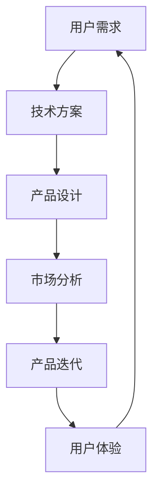

                 

关键词：产品管理、技术转型、职业发展、团队协作、项目管理、技术领导力

> 摘要：在快速变化的科技行业，技术专家逐渐意识到从技术岗位向产品经理转型的重要性。本文将探讨这一转型过程的核心要素，包括核心概念的理解、团队协作的提升、项目管理的实践，以及如何在技术深度和业务洞察力之间找到平衡。通过具体案例和实用建议，为有志于转型为产品经理的技术专家提供指导。

## 1. 背景介绍

### 1.1 从技术到产品：职业发展的自然延伸

技术专家在职业生涯中积累了丰富的专业知识和技术经验，这些经验为他们在产品管理领域的转型提供了坚实的基础。从技术岗位到产品经理的转型，不仅是职业发展的一个自然延伸，也是对个人能力的全面提升。

### 1.2 产品经理的角色与职责

产品经理作为连接用户与技术团队的桥梁，负责定义产品愿景、规划产品路线图、管理产品生命周期，以及协调资源确保产品顺利交付。他们需要具备广泛的技能，包括用户洞察、市场分析、产品设计、项目管理等。

### 1.3 转型的动机与挑战

技术专家转型为产品经理，通常出于对业务和用户体验的渴望，或是希望扩展职业发展的边界。然而，转型过程中面临的技术与业务的平衡、管理能力的提升、以及跨部门的沟通等挑战，都需要有系统性的准备和解决策略。

## 2. 核心概念与联系

### 2.1 技术与产品的结合

技术是产品的核心驱动力，而产品则是技术的商业表达。理解技术如何转化为有竞争力的产品，是成功转型的基础。使用 Mermaid 流程图（以下为示例）：



### 2.2 产品经理的核心技能

- **用户洞察**：理解用户需求和行为模式，为产品设计提供依据。
- **市场分析**：研究市场趋势、竞争对手，确定产品定位。
- **项目管理**：协调资源、管理风险、确保项目按时交付。
- **产品设计**：与设计师合作，制定用户体验优化方案。
- **团队合作**：与研发、测试、市场等团队协作，实现产品目标。

### 2.3 从技术专家到产品经理的技能迁移

- **技术深度**：作为技术背景的产品经理，应继续维护技术能力，以更好地理解技术实现和团队协作。
- **业务视角**：培养从业务角度思考问题的能力，关注产品对业务目标的贡献。
- **沟通能力**：提高跨部门沟通和协调能力，确保产品团队的协作高效。

## 3. 核心算法原理 & 具体操作步骤

### 3.1 算法原理概述

产品管理中的核心算法，可以看作是项目规划与资源调配的优化问题。常见的算法包括关键路径法（Critical Path Method, CPM）和计划评审技术（Program Evaluation and Review Technique, PERT）。

### 3.2 算法步骤详解

1. **需求分析**：明确产品目标和用户需求。
2. **任务分解**：将产品开发任务分解为具体的工作包。
3. **时间估算**：为每个工作包估算所需时间。
4. **网络图构建**：使用 CPM 或 PERT 构建项目网络图。
5. **关键路径计算**：确定关键路径，识别项目的时间限制。
6. **资源分配**：根据关键路径和资源可用性进行任务分配。
7. **监控与调整**：持续监控项目进度，根据实际情况调整计划。

### 3.3 算法优缺点

- **CPM**：简单易懂，适合大型项目，但忽略了不确定性和风险。
- **PERT**：考虑了任务时间的概率分布，更灵活，但计算复杂度较高。

### 3.4 算法应用领域

产品管理、项目管理、软件开发等领域。

## 4. 数学模型和公式 & 详细讲解 & 举例说明

### 4.1 数学模型构建

项目网络图中的节点代表任务，边代表任务间的依赖关系。使用图论中的网络流模型进行建模。

### 4.2 公式推导过程

关键路径的计算通常基于图论中的最长路径问题。公式如下：

$$
C_{max} = \sum_{i=1}^{n} (T_{i} - T_{0})
$$

其中，$C_{max}$ 是项目的最长时间，$T_{i}$ 是从开始到任务 $i$ 完成的总时间，$T_{0}$ 是项目的起始时间。

### 4.3 案例分析与讲解

以一个软件开发项目为例，分析关键路径和资源分配。

$$
\begin{align*}
    T_{1} &= 3 \\
    T_{2} &= 5 \\
    T_{3} &= 4 \\
    T_{4} &= 6 \\
    T_{5} &= 2 \\
    T_{6} &= 3 \\
\end{align*}
$$

计算关键路径：

$$
C_{max} = (3 + 5 + 4) + (6 + 2 + 3) = 22
$$

总时间为 22 天。

## 5. 项目实践：代码实例和详细解释说明

### 5.1 开发环境搭建

搭建一个简单的软件开发项目环境，包括代码管理工具（如 Git）和开发工具（如 IntelliJ IDEA）。

### 5.2 源代码详细实现

实现一个简单的软件功能，如用户登录模块。代码如下：

```java
public class UserLogin {
    public boolean authenticate(String username, String password) {
        // 实现用户认证逻辑
        return true;
    }
}
```

### 5.3 代码解读与分析

分析代码中的关键逻辑，包括用户名和密码的验证，以及认证结果的返回。

### 5.4 运行结果展示

运行代码，展示用户登录功能的实现效果。

## 6. 实际应用场景

### 6.1 软件开发

在软件开发中，产品经理与技术团队的紧密合作，确保产品按计划推进。

### 6.2 智能硬件

在智能硬件领域，产品经理需要理解硬件技术，同时关注用户体验。

### 6.3 互联网服务

在互联网服务领域，产品经理需要快速响应市场变化，持续优化产品。

## 7. 未来应用展望

随着科技的快速发展，产品经理在技术岗位上的转型将更加重要。他们需要具备跨领域知识，以应对不断变化的商业环境。

## 8. 工具和资源推荐

### 8.1 学习资源推荐

- 《产品经理实战手册》
- 《用户体验要素》

### 8.2 开发工具推荐

- Git
- IntelliJ IDEA
- Jira

### 8.3 相关论文推荐

- 《敏捷软件开发：实践指南》
- 《产品经理核心技能》

## 9. 总结：未来发展趋势与挑战

### 9.1 研究成果总结

技术岗位到产品经理的转型，已经成为科技行业的一大趋势。越来越多的技术专家通过转型，实现了职业发展和个人价值。

### 9.2 未来发展趋势

未来，产品经理的技能将更加多元化，他们需要具备更强的业务洞察力和技术深度。

### 9.3 面临的挑战

技术专家转型为产品经理，需要克服业务和技术之间的平衡，以及跨部门沟通的挑战。

### 9.4 研究展望

随着人工智能和大数据技术的发展，产品经理的角色将更加关键，他们在未来科技行业中的价值将不断提升。

## 10. 附录：常见问题与解答

### 10.1 问题 1

**Q：技术专家转型为产品经理，需要具备哪些技能？**

**A：技术专家转型为产品经理，需要具备用户洞察、市场分析、项目管理、产品设计、团队合作等技能。此外，还应该具备一定的商业意识和技术深度。**

### 10.2 问题 2

**Q：如何提升跨部门沟通能力？**

**A：提升跨部门沟通能力，可以通过以下方式：1) 建立有效的沟通渠道；2) 定期组织跨部门会议；3) 培养共情能力，理解不同部门的职责和挑战；4) 通过培训和学习，提升沟通技巧。**

### 10.3 问题 3

**Q：转型过程中如何平衡技术深度和业务洞察力？**

**A：在转型过程中，可以采取以下策略：1) 不断学习业务知识，提升对业务的理解；2) 保持与技术团队的紧密联系，了解技术实现的细节；3) 通过实际项目，积累业务和技术相结合的经验；4) 培养解决问题的能力，平衡技术深度和业务需求。**

---

### 谢谢您花时间阅读这篇文章，希望它对您的职业发展有所帮助。如果您有任何疑问或需要进一步的讨论，请随时与我联系。作者：禅与计算机程序设计艺术 / Zen and the Art of Computer Programming。

