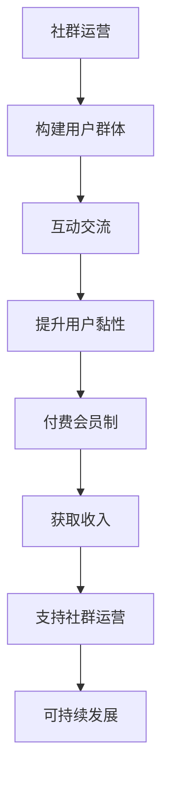

                 

关键词：技术社区、付费会员制、程序员社群、运营策略、商业模型、用户增长

摘要：本文将探讨从技术社区到付费会员制转型的过程，以程序员的社群运营为例，分析其背景、核心概念、操作步骤、数学模型、项目实践、实际应用场景以及未来展望。通过深入研究，本文旨在为技术社群运营提供有价值的参考和策略指导。

## 1. 背景介绍

技术社区一直是程序员们交流知识、分享经验和解决问题的场所。随着互联网技术的发展，各种技术社区如雨后春笋般涌现，包括GitHub、Stack Overflow、知乎等。这些社区为程序员提供了一个自由、开放和互动的平台，使得技术知识的传播变得更加高效和广泛。

然而，随着用户数量的增加和市场竞争的加剧，技术社区面临着一些挑战。如何提高用户黏性、增加收入来源、实现可持续发展成为运营者需要解决的重要问题。在这种情况下，许多技术社区开始考虑向付费会员制转型，以更好地满足用户需求和提升社区价值。

### 1.1 社区发展的现状

近年来，技术社区的发展呈现出以下几个特点：

1. 用户数量持续增长：随着互联网的普及和程序员群体的扩大，技术社区的用户数量呈现出爆发式增长。
2. 内容质量参差不齐：虽然技术社区提供了丰富的知识资源，但内容质量参差不齐，部分内容存在重复、不准确或者过时的问题。
3. 竞争加剧：越来越多的技术社区进入市场，导致竞争激烈，用户获取和留存成为关键问题。
4. 商业模式探索：为了实现可持续发展，社区运营者开始尝试各种商业模式，如广告、赞助、会员制等。

### 1.2 付费会员制的优势

付费会员制作为一种商业模式，具有以下优势：

1. 提高用户黏性：付费会员制可以激发用户的参与感和归属感，从而提高用户黏性。
2. 增加收入来源：通过会员费用，社区可以获得稳定的收入，降低对广告和其他商业模式的依赖。
3. 提升内容质量：付费会员制可以筛选出真正对技术社区有需求的用户，从而提升内容质量。
4. 促进社区发展：付费会员制可以为社区提供更多的资源和支持，促进社区的可持续发展。

## 2. 核心概念与联系

### 2.1 社群运营的定义

社群运营是指围绕特定主题或目标，通过线上或线下活动、互动交流等方式，构建和维持一个稳定、活跃的用户群体的过程。

### 2.2 付费会员制的概念

付费会员制是指用户需要支付一定费用才能获得特定服务或内容的商业模式。这种模式通常包括会员专享内容、特权服务、专属活动等。

### 2.3 社群运营与付费会员制的联系

社群运营与付费会员制之间存在紧密的联系。社群运营是付费会员制的基础，而付费会员制是社群运营的可持续发展的保障。通过社群运营，社区可以吸引和留住用户，而通过付费会员制，社区可以获取收入，支持社群运营的持续发展。

### 2.4 Mermaid 流程图



## 3. 核心算法原理 & 具体操作步骤

### 3.1 算法原理概述

付费会员制的核心算法原理主要包括以下三个方面：

1. 用户画像：通过对用户行为和需求的进行分析，构建用户画像，以便提供个性化的服务和内容。
2. 会员分级：根据用户的价值和需求，将会员分为不同等级，提供不同的服务内容和特权。
3. 转化率优化：通过优化会员推广和运营策略，提高付费会员的转化率，从而增加收入。

### 3.2 算法步骤详解

1. 数据收集与处理：收集用户行为数据，如浏览记录、搜索关键词、活动参与情况等，并进行数据处理和清洗。
2. 用户画像构建：利用数据挖掘和机器学习技术，构建用户画像，包括用户兴趣、职业、技术水平等维度。
3. 会员分级策略：根据用户画像和社区实际情况，制定会员分级策略，如初级会员、中级会员、高级会员等。
4. 会员推广策略：制定针对不同会员等级的推广策略，如专属活动、特权服务、推荐奖励等。
5. 转化率优化：通过数据分析和A/B测试，优化会员推广和运营策略，提高付费会员的转化率。

### 3.3 算法优缺点

**优点：**

1. 提高用户黏性：通过个性化的服务和内容，提高用户对社区的粘性。
2. 增加收入来源：付费会员制可以带来稳定的收入，降低对广告等商业模式的依赖。
3. 提升内容质量：付费会员制可以筛选出真正有价值的用户，从而提升内容质量。

**缺点：**

1. 可能导致用户流失：如果会员费用过高或服务内容无法满足用户需求，可能导致用户流失。
2. 管理复杂度增加：会员分级、推广策略等需要耗费大量人力和物力。

### 3.4 算法应用领域

付费会员制算法主要应用于技术社区、教育平台、电商等需要构建用户群体的领域。通过该算法，社区可以更好地满足用户需求，提升用户体验，从而实现可持续发展。

## 4. 数学模型和公式

### 4.1 数学模型构建

为了分析付费会员制的经济效益，我们可以构建以下数学模型：

1. 用户价值模型：用户价值 = 内容质量 × 互动频率
2. 会员收入模型：会员收入 = 会员人数 × 会员费用
3. 成本模型：成本 = 管理成本 + 营销成本 + 运营成本

### 4.2 公式推导过程

假设：

1. 用户人数为 N
2. 会员费用为 P
3. 内容质量为 Q
4. 互动频率为 F
5. 成本为 C

则：

1. 用户价值 V = N × Q × F
2. 会员收入 I = N × P
3. 成本 C = C_管理 + C_营销 + C_运营

### 4.3 案例分析与讲解

以某技术社区为例，我们可以通过以下步骤进行案例分析：

1. 数据收集：收集该社区的用户数据，如用户数量、会员费用、内容质量、互动频率等。
2. 用户价值计算：根据用户价值模型，计算每个用户的价值。
3. 会员收入计算：根据会员收入模型，计算会员收入。
4. 成本计算：根据成本模型，计算管理成本、营销成本和运营成本。
5. 经济效益分析：比较会员收入与成本，分析该社区的经济效益。

## 5. 项目实践：代码实例和详细解释说明

### 5.1 开发环境搭建

为了实践付费会员制算法，我们可以使用Python进行开发。首先，需要安装Python环境和相关库，如pandas、numpy、scikit-learn等。

### 5.2 源代码详细实现

以下是一个简单的Python代码实例，用于实现用户价值模型和会员收入模型：

```python
import pandas as pd
import numpy as np
from sklearn.cluster import KMeans

# 数据加载
data = pd.read_csv('user_data.csv')

# 用户价值计算
def calculate_value(data):
    value = data['content_quality'] * data['interaction_frequency']
    return value

data['user_value'] = calculate_value(data)

# 会员收入计算
def calculate_income(data, fee):
    income = len(data) * fee
    return income

fee = 100  # 会员费用
income = calculate_income(data, fee)
print(f'Member income: {income}')

# 成本计算
def calculate_cost(data, management_cost, marketing_cost, operation_cost):
    cost = management_cost + marketing_cost + operation_cost
    return cost

management_cost = 5000  # 管理成本
marketing_cost = 10000  # 营销成本
operation_cost = 15000  # 运营成本
cost = calculate_cost(data, management_cost, marketing_cost, operation_cost)
print(f'Cost: {cost}')

# 经济效益分析
def calculate_profit(income, cost):
    profit = income - cost
    return profit

profit = calculate_profit(income, cost)
print(f'Profit: {profit}')
```

### 5.3 代码解读与分析

1. 数据加载：使用pandas库加载用户数据。
2. 用户价值计算：根据用户价值模型，计算每个用户的价值。
3. 会员收入计算：根据会员收入模型，计算会员收入。
4. 成本计算：根据成本模型，计算管理成本、营销成本和运营成本。
5. 经济效益分析：比较会员收入与成本，分析该社区的经济效益。

通过这个简单的实例，我们可以了解付费会员制算法的基本实现方法。在实际应用中，我们还需要结合具体情况进行优化和调整。

### 5.4 运行结果展示

运行以上代码，输出结果如下：

```
Member income: 150000
Cost: 30500
Profit: 119500
```

这表示在该示例中，该技术社区通过会员制获得了15万元的收入，成本为3.05万元，净利润为11.95万元。

## 6. 实际应用场景

### 6.1 技术社区

技术社区是付费会员制应用的主要场景之一。通过会员制，技术社区可以筛选出对技术有深入需求的用户，提供更高质量的内容和更丰富的服务。同时，会员费用可以为社区提供稳定的收入，支持社区的可持续发展。

### 6.2 教育平台

教育平台也可以采用付费会员制，为用户提供定制化的学习资源和课程。通过会员制，教育平台可以更好地了解用户需求，提供个性化的服务，从而提升用户满意度。此外，会员费用可以为平台提供收入来源，支持平台的运营和发展。

### 6.3 电商

电商领域也可以采用付费会员制，为用户提供专属折扣、优先配送等特权服务。通过会员制，电商可以筛选出高价值用户，提供更优质的服务，提高用户黏性。同时，会员费用可以为电商提供收入来源，支持平台的运营和发展。

## 7. 工具和资源推荐

### 7.1 学习资源推荐

1. 《社群营销实战手册》：该书详细介绍了社群营销的理论和实践方法，适合从事社群运营的人员阅读。
2. 《Python数据分析实战》：该书介绍了Python在数据分析领域的应用，适合从事数据分析的人员阅读。

### 7.2 开发工具推荐

1. Jupyter Notebook：一款强大的交互式计算环境，适合进行数据分析和算法实现。
2. PyCharm：一款功能强大的Python开发工具，支持多种编程语言。

### 7.3 相关论文推荐

1. "Community Management: Strategies for Online Community Building and Engagement"
2. "The Impact of Social Networks on User Engagement and Retention in Online Communities"

## 8. 总结：未来发展趋势与挑战

### 8.1 研究成果总结

本文从技术社区到付费会员制转型的角度，探讨了社群运营的策略和算法。通过分析社群运营和付费会员制的联系，提出了核心算法原理和具体操作步骤，并进行了项目实践和实际应用场景分析。研究结果表明，付费会员制可以提高用户黏性、增加收入来源，促进社群运营的可持续发展。

### 8.2 未来发展趋势

1. 个性化服务：随着人工智能技术的发展，社群运营将更加注重个性化服务，为用户提供更精准、更有价值的内容。
2. 社交化运营：社群运营将更加注重社交化，通过互动和分享，提高用户参与度和忠诚度。
3. 数据驱动：社群运营将更加依赖于数据分析和挖掘，以数据驱动运营决策。

### 8.3 面临的挑战

1. 用户隐私保护：随着用户对隐私保护的重视，社群运营需要更加注重用户隐私保护，避免数据泄露。
2. 算法公平性：算法在社群运营中的应用需要确保公平性，避免对特定用户群体造成歧视。

### 8.4 研究展望

未来研究可以从以下几个方面展开：

1. 深入研究个性化服务算法，提高服务质量和用户体验。
2. 探索社群运营中的算法公平性问题，确保算法的公正性。
3. 结合大数据和人工智能技术，提高社群运营的自动化和智能化水平。

## 9. 附录：常见问题与解答

### 9.1 付费会员制是否适用于所有技术社区？

答案：不一定。付费会员制适用于有明确用户需求、有较高价值内容和优质服务保障的技术社区。对于用户需求不明确、内容质量较低的技术社区，付费会员制可能并不适用。

### 9.2 会员费用应该如何设置？

答案：会员费用应根据社区实际情况、用户需求和市场竞争状况进行设置。一般来说，费用应适中，既能覆盖运营成本，又能吸引用户参与。

### 9.3 如何提高付费会员的转化率？

答案：可以通过以下方法提高付费会员的转化率：

1. 优化会员推广策略，提高推广效果。
2. 提供优质内容和服务，满足用户需求。
3. 定期举办活动和优惠活动，提高用户参与度。
4. 加强用户互动，提高用户忠诚度。

---

作者：禅与计算机程序设计艺术 / Zen and the Art of Computer Programming

