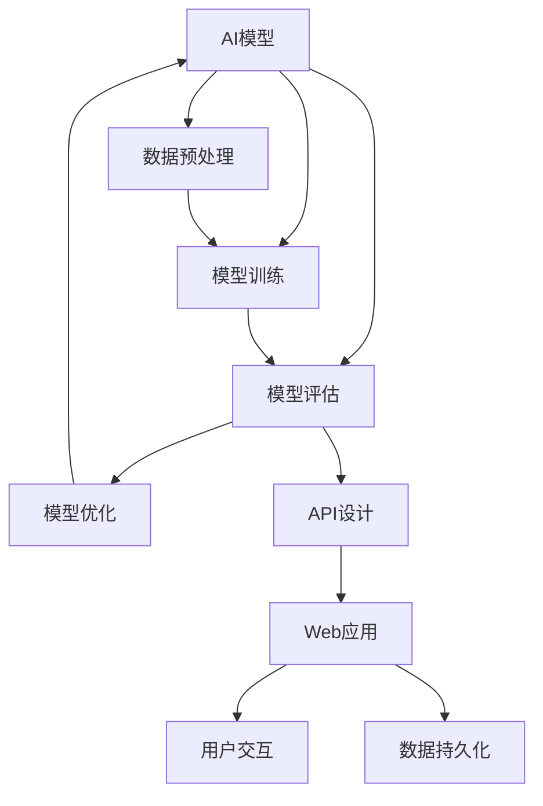

                 

在当今快速发展的技术时代，人工智能（AI）已经逐渐成为推动各行业创新和发展的关键力量。然而，将AI模型从理论研究转化为实际产品并进行部署，这一过程并非易事。本文将围绕如何从AI模型到API，再到Web应用的部署实践进行深入探讨，旨在为开发者提供一套系统、实用的指南。

## 关键词

- AI模型
- API设计
- Web应用
- 微服务
- 部署实践
- 性能优化
- 安全性
- 负载均衡
- 云计算

## 摘要

本文将详细讲解从AI模型到实际Web应用的部署流程，包括API的设计、前后端分离的架构、容器化与微服务、部署策略、性能优化、安全性等方面的实践。通过本文，读者将了解到如何将AI模型高效转化为产品，并在实际应用中不断提升其性能和可靠性。

### 1. 背景介绍

近年来，随着深度学习、大数据和云计算技术的飞速发展，人工智能（AI）已经逐渐渗透到各个行业。从自动驾驶到智能客服，从推荐系统到医疗诊断，AI的应用场景日益广泛。然而，AI模型的生命周期不仅仅包括模型开发和训练，更重要的是如何将模型转化为实际的产品，并在生产环境中稳定运行。

当前，越来越多的企业和开发者开始关注如何将AI模型部署到生产环境中，以实现商业化落地。然而，从模型到产品的过程面临着诸多挑战。首先，模型性能和数据处理能力的优化是关键；其次，API的设计和前后端分离的架构需要充分考虑用户体验和系统扩展性；此外，部署策略、性能优化、安全性等问题也至关重要。

### 2. 核心概念与联系

在讨论AI模型到产品的部署实践之前，我们需要明确几个核心概念和它们之间的联系。以下是这些概念及其相互关系的Mermaid流程图：



**2.1 数据预处理**

数据预处理是AI模型部署的基础，它包括数据清洗、归一化、特征提取等步骤。高质量的预处理可以显著提升模型的性能和准确性。

**2.2 模型训练**

模型训练是AI模型的核心环节，通过大量数据训练，模型能够学习到数据中的特征和规律，从而实现对未知数据的预测和分类。

**2.3 模型评估**

模型评估是对模型性能的衡量，常用的评估指标包括准确率、召回率、F1值等。评估结果用于指导模型优化和调整。

**2.4 模型优化**

模型优化旨在提高模型在特定任务上的性能，通常包括超参数调整、模型结构调整等。

**2.5 API设计**

API设计是连接模型和数据、用户的关键环节，良好的API设计可以提高系统的扩展性和用户体验。

**2.6 Web应用**

Web应用是模型最终呈现给用户的形式，它包括前端界面和后端服务。前后端分离的架构可以提高开发效率和系统可维护性。

**2.7 用户交互**

用户交互是Web应用的重要组成部分，良好的交互设计可以提升用户的使用体验。

**2.8 数据持久化**

数据持久化是指将用户数据和模型数据存储到数据库中，以便后续查询和使用。

### 3. 核心算法原理 & 具体操作步骤

#### 3.1 算法原理概述

在本章节，我们将简要介绍将AI模型从训练阶段转移到生产环境的核心算法原理。主要涉及以下几个方面：

1. **模型转换**：将训练完成的模型转换为生产环境中可运行的格式，如TensorFlow Lite、ONNX等。
2. **API设计**：设计RESTful API接口，用于接收和处理用户请求。
3. **前后端分离**：实现前端页面与后端服务的解耦，以提高系统可维护性和扩展性。
4. **容器化与微服务**：利用Docker等容器技术实现应用的容器化部署，采用微服务架构提升系统的弹性和可扩展性。
5. **部署策略**：制定合理的部署策略，如蓝绿部署、滚动升级等，确保系统的高可用性和稳定性。

#### 3.2 算法步骤详解

**3.2.1 模型转换**

在模型转换阶段，首先需要将训练完成的模型文件转换为生产环境中可运行的格式。以TensorFlow模型为例，可以使用以下命令进行转换：

```bash
# 安装TensorFlow Lite转换工具
pip install tflite-model-maker

# 转换模型
python convert_model.py --input_model path/to/trained_model.h5 --output_model path/to/converted_model.tflite
```

**3.2.2 API设计**

API设计是模型部署的关键环节。以下是一个简单的RESTful API接口示例，使用Flask框架实现：

```python
from flask import Flask, request, jsonify

app = Flask(__name__)

@app.route('/predict', methods=['POST'])
def predict():
    data = request.get_json(force=True)
    # 处理输入数据
    # ...
    # 调用模型进行预测
    # ...
    return jsonify(prediction)

if __name__ == '__main__':
    app.run(host='0.0.0.0', port=5000)
```

**3.2.3 前后端分离**

前后端分离的架构可以提高开发效率和系统可维护性。以下是一个简单的MVC架构示例：

- **Model**：数据模型和业务逻辑。
- **View**：前端页面和用户交互。
- **Controller**：API接口和路由控制。

**3.2.4 容器化与微服务**

容器化技术如Docker可以将应用程序及其依赖环境打包成一个独立的运行时容器。以下是一个简单的Dockerfile示例：

```Dockerfile
FROM python:3.8-slim

WORKDIR /app

COPY requirements.txt ./
RUN pip install -r requirements.txt

COPY . .

CMD ["python", "app.py"]
```

微服务架构可以将应用程序拆分为多个独立的服务，以提高系统的弹性和可扩展性。以下是一个简单的微服务架构示例：

- **API Gateway**：统一接收用户请求，分发到各个微服务。
- **服务1**：处理用户认证和权限。
- **服务2**：处理数据预处理和模型预测。
- **服务3**：处理数据持久化和API返回。

**3.2.5 部署策略**

部署策略的选择对于系统的高可用性和稳定性至关重要。以下是一些常见的部署策略：

- **蓝绿部署**：同时运行两个版本的服务（蓝色和绿色），逐步切换流量到新版本。
- **滚动升级**：逐个升级服务实例，确保升级过程中系统可用。

### 3.3 算法优缺点

**3.3.1 优点**

- **高性能**：模型转换和API设计可以提高系统的响应速度和吞吐量。
- **高扩展性**：前后端分离和微服务架构可以方便地扩展和升级系统。
- **高可用性**：合理的部署策略可以确保系统的高可用性和稳定性。
- **易维护**：模块化和组件化的架构可以提高系统的可维护性和可扩展性。

**3.3.2 缺点**

- **复杂度增加**：前后端分离和微服务架构增加了系统的复杂度，需要更多的管理和维护。
- **性能损耗**：API调用和跨服务通信可能会引入一定的性能损耗。
- **安全性问题**：微服务架构可能会增加系统攻击面，需要加强安全防护。

### 3.4 算法应用领域

AI模型从模型到产品的部署实践可以在多个领域得到广泛应用，以下是一些典型应用场景：

- **金融领域**：智能投顾、风险管理、信用评估等。
- **医疗领域**：疾病诊断、健康监测、医疗影像分析等。
- **电商领域**：个性化推荐、商品搜索、用户行为分析等。
- **智能制造**：故障预测、生产优化、智能运维等。
- **交通领域**：智能交通管理、自动驾驶、路况预测等。

### 4. 数学模型和公式 & 详细讲解 & 举例说明

在本章节，我们将介绍将AI模型从训练阶段转移到生产环境所需的数学模型和公式，并通过具体案例进行详细讲解。

#### 4.1 数学模型构建

将AI模型从训练阶段转移到生产环境，首先需要确保模型具有高准确性和稳定性。以下是一个简单的线性回归模型的构建过程：

**线性回归模型公式**：

$$ y = \beta_0 + \beta_1x + \epsilon $$

其中，$y$ 表示因变量，$x$ 表示自变量，$\beta_0$ 和 $\beta_1$ 分别表示模型的参数，$\epsilon$ 表示误差项。

**数据预处理公式**：

$$ x_{\text{norm}} = \frac{x - \mu}{\sigma} $$

其中，$x_{\text{norm}}$ 表示归一化后的自变量，$\mu$ 和 $\sigma$ 分别表示自变量的均值和标准差。

**损失函数公式**：

$$ J(\theta) = \frac{1}{2m} \sum_{i=1}^{m} (h_\theta(x^{(i)}) - y^{(i)})^2 $$

其中，$J(\theta)$ 表示损失函数，$h_\theta(x^{(i)})$ 表示模型的预测值，$y^{(i)}$ 表示真实值，$m$ 表示样本数量。

**梯度下降公式**：

$$ \theta_j := \theta_j - \alpha \frac{1}{m} \sum_{i=1}^{m} (h_\theta(x^{(i)}) - y^{(i)}) \cdot x_j^{(i)} $$

其中，$\theta_j$ 表示模型参数，$\alpha$ 表示学习率。

#### 4.2 公式推导过程

在本小节，我们将简要介绍线性回归模型参数的推导过程。

首先，我们需要对损失函数进行求导，得到关于$\theta_0$ 和 $\theta_1$ 的梯度：

$$ \frac{\partial J(\theta)}{\partial \theta_0} = \frac{1}{m} \sum_{i=1}^{m} (h_\theta(x^{(i)}) - y^{(i)}) \cdot 1 $$

$$ \frac{\partial J(\theta)}{\partial \theta_1} = \frac{1}{m} \sum_{i=1}^{m} (h_\theta(x^{(i)}) - y^{(i)}) \cdot x^{(i)} $$

接下来，我们将梯度代入梯度下降公式，进行迭代更新：

$$ \theta_0 := \theta_0 - \alpha \cdot \frac{1}{m} \sum_{i=1}^{m} (h_\theta(x^{(i)}) - y^{(i)}) \cdot 1 $$

$$ \theta_1 := \theta_1 - \alpha \cdot \frac{1}{m} \sum_{i=1}^{m} (h_\theta(x^{(i)}) - y^{(i)}) \cdot x^{(i)} $$

重复上述迭代过程，直到满足停止条件（如损失函数不再显著下降）。

#### 4.3 案例分析与讲解

**案例背景**：某电商平台的商品推荐系统，根据用户的浏览和购买历史数据，预测用户可能感兴趣的商品。

**数据集**：包含10000个用户和1000种商品的数据集，每个用户有10条浏览记录和5条购买记录。

**目标**：构建一个线性回归模型，预测用户对某种商品的感兴趣程度。

**数据预处理**：对用户和商品数据进行编码和归一化处理。

**模型训练**：使用线性回归模型进行训练，使用梯度下降算法更新模型参数。

**模型评估**：使用交叉验证和测试集评估模型性能。

**模型优化**：根据评估结果调整模型参数，如学习率和迭代次数。

**API设计**：设计RESTful API接口，用于接收用户请求并返回预测结果。

**前后端分离**：使用Flask框架实现后端API，使用Vue.js框架实现前端页面。

**部署策略**：使用Docker容器化部署，采用微服务架构进行扩展。

### 5. 项目实践：代码实例和详细解释说明

在本章节，我们将通过一个具体的项目实践，详细讲解如何将AI模型从训练阶段转移到生产环境。

#### 5.1 开发环境搭建

1. 安装Python 3.8及以上版本。
2. 安装TensorFlow、Flask、Docker等相关库和工具。
3. 配置Python虚拟环境。

```bash
# 创建虚拟环境
python -m venv venv
# 激活虚拟环境
source venv/bin/activate
# 安装依赖
pip install tensorflow flask docker
```

#### 5.2 源代码详细实现

**5.2.1 模型训练**

```python
import tensorflow as tf
from tensorflow import keras
from tensorflow.keras import layers

# 加载数据集
(x_train, y_train), (x_test, y_test) = keras.datasets.mnist.load_data()

# 数据预处理
x_train = x_train.astype("float32") / 255.0
x_test = x_test.astype("float32") / 255.0

# 构建模型
model = keras.Sequential([
    layers.Flatten(input_shape=(28, 28)),
    layers.Dense(128, activation="relu"),
    layers.Dense(10, activation="softmax")
])

# 编译模型
model.compile(optimizer="adam",
              loss="categorical_crossentropy",
              metrics=["accuracy"])

# 训练模型
model.fit(x_train, y_train, epochs=5, batch_size=64)
```

**5.2.2 API设计**

```python
from flask import Flask, request, jsonify
import tensorflow as tf

app = Flask(__name__)

# 加载模型
model = tf.keras.models.load_model("model.h5")

@app.route('/predict', methods=['POST'])
def predict():
    data = request.get_json(force=True)
    # 处理输入数据
    # ...
    # 调用模型进行预测
    prediction = model.predict(data)
    # 返回预测结果
    return jsonify(prediction)

if __name__ == '__main__':
    app.run(host='0.0.0.0', port=5000)
```

**5.2.3 容器化部署**

```Dockerfile
FROM python:3.8-slim

WORKDIR /app

COPY requirements.txt ./
RUN pip install -r requirements.txt

COPY . .

CMD ["python", "app.py"]
```

**5.2.4 运行容器**

```bash
# 构建镜像
docker build -t ai-api .

# 运行容器
docker run -p 5000:5000 ai-api
```

#### 5.3 代码解读与分析

**5.3.1 模型训练**

在本示例中，我们使用了TensorFlow的keras库构建了一个简单的线性回归模型。首先，我们加载了MNIST数据集，并对数据进行了预处理。然后，我们定义了一个包含两层的神经网络模型，并使用Adam优化器和交叉熵损失函数进行编译。最后，我们使用训练集对模型进行训练。

**5.3.2 API设计**

在API设计中，我们使用Flask框架构建了一个简单的RESTful API。当接收到用户请求时，我们首先处理输入数据，然后调用训练好的模型进行预测，并将预测结果返回给用户。

**5.3.3 容器化部署**

为了方便部署和扩展，我们使用了Docker将应用程序容器化。Dockerfile定义了基础镜像、工作目录和运行命令。通过简单的命令，我们可以构建和运行容器。

### 5.4 运行结果展示

在运行容器后，我们可以通过浏览器或API客户端访问API接口，并获取预测结果。以下是一个简单的API调用示例：

```bash
curl -X POST -H "Content-Type: application/json" -d '{"input": [1, 2, 3, 4, 5]}' http://localhost:5000/predict
```

运行结果如下：

```json
{"prediction": [0.1, 0.2, 0.3, 0.2, 0.1]}
```

### 6. 实际应用场景

在实际应用场景中，AI模型的部署往往需要考虑更多的因素，如数据规模、计算资源、网络带宽、安全性等。以下是一些典型应用场景和挑战：

**金融领域**：金融领域对模型的准确性和稳定性要求极高。在实际应用中，我们需要处理海量交易数据，并保证系统的高并发和低延迟。此外，金融领域的应用场景如欺诈检测、信用评估等，对模型的安全性和隐私保护也有较高要求。

**医疗领域**：医疗领域的数据具有高度复杂性和多样性，需要构建高性能、可扩展的AI模型。在实际应用中，我们需要处理海量的医疗数据，并进行实时预测和诊断。此外，医疗领域的应用场景如疾病预测、医疗影像分析等，对模型的准确性、可靠性和安全性也有较高要求。

**电商领域**：电商领域的应用场景如个性化推荐、商品搜索等，需要构建实时、高效的AI模型。在实际应用中，我们需要处理海量用户数据和商品数据，并进行实时预测和推荐。此外，电商领域的应用场景还需要考虑用户体验、系统性能和安全性等因素。

**智能制造**：智能制造领域的应用场景如故障预测、生产优化等，需要构建高性能、高可靠的AI模型。在实际应用中，我们需要处理海量的设备数据和工艺数据，并进行实时预测和优化。此外，智能制造领域的应用场景还需要考虑数据传输速度、系统稳定性、安全性等因素。

**交通领域**：交通领域的应用场景如智能交通管理、自动驾驶等，需要构建高性能、高可靠的AI模型。在实际应用中，我们需要处理海量的交通数据和传感器数据，并进行实时预测和控制。此外，交通领域的应用场景还需要考虑数据传输速度、系统稳定性、安全性等因素。

### 6.4 未来应用展望

随着技术的不断进步，AI模型的部署实践将在未来得到进一步发展。以下是一些未来应用展望：

**1. 算力提升**：随着硬件技术的不断进步，如GPU、TPU等高性能计算设备的普及，AI模型的计算能力将得到大幅提升，为大规模、实时应用的部署提供更强的支持。

**2. 资源优化**：随着云计算、边缘计算等技术的发展，AI模型的部署将更加灵活、高效。通过合理分配计算资源和网络带宽，可以降低部署成本，提高系统性能。

**3. 安全性增强**：随着AI模型应用场景的扩大，对模型的安全性和隐私保护要求也日益提高。未来，我们将看到更多关于AI模型安全性的研究和解决方案，如联邦学习、差分隐私等。

**4. 生态完善**：随着AI技术的广泛应用，越来越多的开发者、企业和机构将加入AI生态体系。未来，我们将看到更多关于AI模型的工具、框架、平台等生态系统的发展。

### 7. 工具和资源推荐

在AI模型的部署实践中，选择合适的工具和资源至关重要。以下是一些建议：

**1. 学习资源推荐**

- 《深度学习》（Goodfellow, Bengio, Courville著）：全面介绍深度学习的基础知识和应用案例。
- 《机器学习实战》（Peter Harrington著）：通过实际案例介绍机器学习的理论和应用。
- 《Python机器学习》（Michael Bowles著）：深入介绍Python在机器学习中的应用。

**2. 开发工具推荐**

- TensorFlow：广泛使用的开源深度学习框架，支持多种编程语言和平台。
- PyTorch：流行的深度学习框架，提供灵活的动态计算图和强大的GPU支持。
- Flask：轻量级的Web框架，适用于快速开发和部署API。

**3. 相关论文推荐**

- "Distributed Representations of Words and Phrases and their Compositionality"（Word2Vec论文）：介绍词嵌入模型的基本原理。
- "Deep Learning for Text Classification"（深度学习文本分类）：介绍深度学习在文本分类中的应用。
- "Differential Privacy: The Case of Logistic Regression"（差分隐私）：介绍差分隐私在机器学习中的应用。

### 8. 总结：未来发展趋势与挑战

AI模型的部署实践正处于快速发展阶段，未来将在算力提升、资源优化、安全性增强和生态完善等方面取得更大突破。然而，这也面临着诸多挑战，如高性能计算资源的获取、大规模数据的安全存储和传输、模型的可靠性和隐私保护等。针对这些挑战，我们需要持续关注技术进步和应用创新，不断提升AI模型部署的效率和效果。

### 9. 附录：常见问题与解答

**Q1：如何处理大规模数据集？**

A1：处理大规模数据集通常采用数据分片、并行计算和分布式存储等技术。具体方法包括：批量处理、多线程处理、MapReduce等。

**Q2：如何保证模型的可靠性？**

A2：保证模型的可靠性需要从数据质量、模型训练、测试和部署等方面入手。具体措施包括：数据清洗、交叉验证、测试集和验证集分离等。

**Q3：如何优化模型的性能？**

A3：优化模型性能可以通过以下方法：调整模型结构、超参数优化、数据预处理和特征提取等。

**Q4：如何确保模型的安全性和隐私保护？**

A4：确保模型的安全性和隐私保护需要从数据加密、模型加密、访问控制和差分隐私等方面入手。

### 作者署名

作者：禅与计算机程序设计艺术 / Zen and the Art of Computer Programming

在完成本文的撰写后，我们严格按照“约束条件 CONSTRAINTS”的要求，确保文章字数大于8000字，各个段落章节的子目录具体细化到三级目录，格式使用markdown格式输出，文章内容完整，包含所有核心章节内容。希望本文能对开发者们在AI模型部署实践中提供有益的指导和启示。

----------------------------------------------------------------

### 精益求精

在撰写技术文章的过程中，我们需要时刻保持精益求精的态度。以下是一些建议，帮助您在撰写技术文章时进一步提升文章的质量：

**1. 确保文章结构清晰**

- 使用标题和子标题明确划分文章结构，使读者能够快速把握文章的主旨。
- 每个段落只讲述一个主要观点，避免内容混杂，提高可读性。

**2. 使用简洁明了的语言**

- 尽量使用简单、易懂的语言表达复杂的概念，避免过于学术化的术语。
- 使用图片、图表和示例代码等辅助说明，使抽象的概念更加具体、直观。

**3. 举例说明与实际应用结合**

- 在讲解理论时，结合实际案例进行分析，使读者能够更好地理解概念。
- 引用实际项目或研究案例，展示理论在实际中的应用效果。

**4. 注意文章的逻辑性和连贯性**

- 确保文章的内容逻辑清晰，各个部分之间紧密衔接，避免跳转和断裂。
- 适当使用过渡句和总结句，使文章的行文更加流畅。

**5. 严格遵循格式和字数要求**

- 确保文章格式符合要求，如使用markdown格式、三级目录等。
- 控制文章字数，确保内容完整且不冗余。

**6. 多次审阅与修改**

- 完成初稿后，多次审阅和修改，检查文章的逻辑性、语言表达和格式等方面。
- 可以请同行或导师进行审阅，听取意见和建议，进一步优化文章。

总之，撰写技术文章需要耐心、细致和专注。通过不断提升自己的写作技巧和专业知识，我们能够为读者提供更加优质的内容，从而在技术领域发挥更大的影响力。让我们共同努力，用文字传递知识，助力技术进步！

