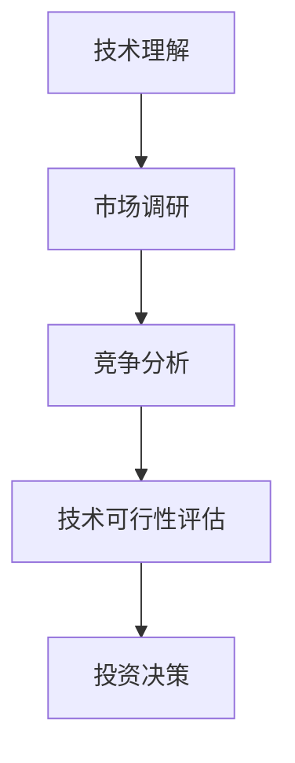
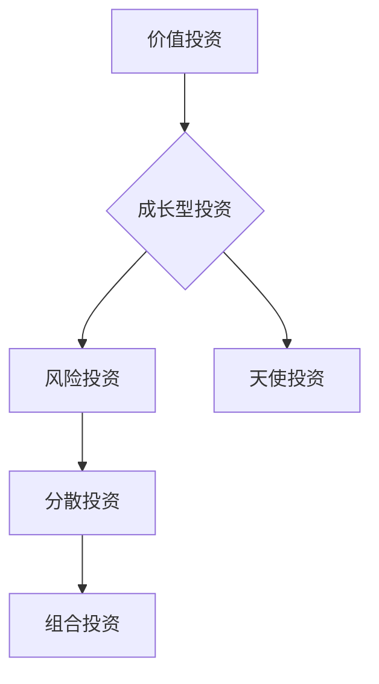
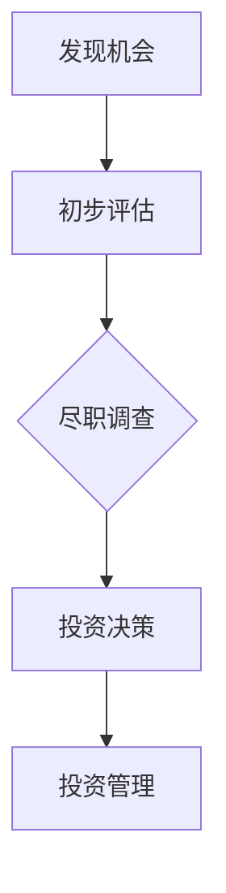
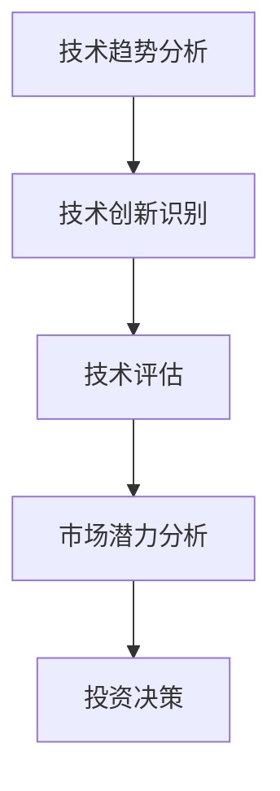

                 

关键词：程序员、天使投资人、职业转型、创业投资、技术背景、投资策略

> 摘要：本文将探讨从程序员到天使投资人的职业转型之路，分析技术背景对投资决策的影响，分享成功案例和经验教训，并提供相关的学习资源和工具推荐。文章旨在帮助那些对创业投资有兴趣的程序员们，提供一些实用的指导和建议。

## 1. 背景介绍

在当今快速发展的科技时代，程序员们不仅需要扎实的编程技能，还需要不断学习新的技术和趋势。然而，随着职业生涯的发展，一些程序员可能会感到编程工作变得重复乏味，或者渴望寻求新的挑战和机遇。这个时候，转型成为天使投资人成为一个吸引人的选择。

程序员转型成为天使投资人有几个潜在的优势。首先，程序员通常对技术有着深刻的理解，这有助于他们评估创业公司的技术可行性和市场潜力。其次，程序员的工作经历往往使他们具备了良好的团队合作、项目管理、风险控制和解决问题的能力，这些能力对于投资决策同样重要。最后，许多程序员在职业生涯中积累了可观的财富，为投资提供了资金基础。

然而，转型之路并非一帆风顺。程序员需要克服对投资的陌生感，学习如何评估商业机会，以及如何在投资组合中分散风险。此外，投资市场的不确定性也给程序员带来了新的挑战。

本文将探讨从程序员到天使投资人的转变，分析技术背景对投资决策的影响，分享成功案例和经验教训，并提供相关的学习资源和工具推荐。希望这篇文章能为那些有兴趣进行职业转型的程序员们提供一些实用的指导和建议。

## 2. 核心概念与联系

在探讨程序员到天使投资人的转变之前，我们需要了解几个核心概念，它们是这一转变的基础。

### 技术背景

作为程序员，技术背景是您的优势。它不仅帮助您理解技术创业公司的技术难题，还能帮助您评估市场潜力。以下是一个简化的 Mermaid 流程图，展示了一个程序员如何利用技术背景进行投资决策的过程。



### 投资策略

投资策略是指投资者如何分配资金、选择投资项目和进行风险管理的方法。以下是一个简单的 Mermaid 流程图，展示了不同类型的投资策略及其应用场景。



### 天使投资

天使投资是指个人投资者对初创企业的早期投资。以下是天使投资的关键步骤和角色：

1. **发现机会**：寻找有潜力的创业项目。
2. **初步评估**：通过市场调研、团队评估和财务分析初步筛选项目。
3. **尽职调查**：进行深入调查，包括技术评估、市场分析和法律审查。
4. **投资决策**：决定是否投资，以及投资的金额和条款。
5. **投资管理**：参与被投资公司的决策和运营，提供指导和支持。



### 技术与投资的交叉点

技术和投资之间的交叉点在于对技术创新的识别和评估。以下是一个 Mermaid 流程图，展示了如何通过技术评估来确定一个项目的投资价值。



通过理解这些核心概念，程序员可以更好地准备自己的转型，利用技术背景进行投资决策，并在投资过程中取得成功。

## 3. 核心算法原理 & 具体操作步骤

### 3.1 算法原理概述

从程序员到天使投资人的转型过程可以看作是一种“风险评估与优化”算法。这一算法的核心思想是通过一系列步骤来评估创业项目的风险和潜在回报，并在此基础上做出最优的投资决策。

算法的基本步骤包括：

1. **项目筛选**：根据技术背景和市场趋势，筛选出有潜力的创业项目。
2. **初步评估**：对筛选出的项目进行初步的技术和市场评估。
3. **尽职调查**：对初步评估通过的项目进行深入调查，包括技术细节、市场分析、团队背景和法律问题。
4. **风险分析**：基于尽职调查结果，分析项目的风险，并确定风险承受能力。
5. **投资决策**：根据风险分析结果，做出投资决策，包括投资金额、投资方式和退出策略。
6. **投资后管理**：投资后，参与被投资公司的运营和决策，提供技术和管理支持。

### 3.2 算法步骤详解

#### 步骤 1：项目筛选

项目筛选是投资决策的第一步。程序员可以利用自己的技术背景和市场洞察力，筛选出有潜力的创业项目。以下是一些筛选标准：

- **技术可行性**：项目所采用的技术是否成熟，是否具有创新性。
- **市场潜力**：项目的市场前景如何，目标市场是否明确。
- **团队背景**：创业团队的背景和能力如何，是否有过成功的创业经历。

#### 步骤 2：初步评估

初步评估是对筛选出的项目进行初步的技术和市场评估。这一步骤的目的是快速排除那些不符合投资标准的项目。具体评估内容包括：

- **技术评估**：评估项目的技术方案是否可行，技术风险是否可控。
- **市场评估**：评估项目的市场前景，目标市场的需求是否真实，竞争对手的情况如何。

#### 步骤 3：尽职调查

尽职调查是对初步评估通过的项目进行深入调查，包括技术细节、市场分析、团队背景和法律问题。这一步骤的目的是确保项目的真实性和可行性，并降低投资风险。具体内容包括：

- **技术调查**：深入了解项目的核心技术，包括技术实现、技术难点和潜在的技术风险。
- **市场调查**：分析目标市场的现状和未来趋势，评估市场的规模和增长潜力。
- **团队调查**：调查创业团队的背景和能力，包括团队成员的资质、经验和合作历史。
- **法律调查**：检查公司的注册文件、合作协议和其他法律文件，确保公司运营合法合规。

#### 步骤 4：风险分析

风险分析是基于尽职调查结果，对项目的风险进行评估和分类。程序员可以利用自己的经验和专业知识，对技术风险、市场风险、财务风险等进行评估。具体内容包括：

- **技术风险**：项目技术实现的难度、技术进度的可控性、技术迭代的速度。
- **市场风险**：市场需求的波动、竞争对手的威胁、市场准入的难度。
- **财务风险**：项目的资金需求、盈利模式、现金流预测。

#### 步骤 5：投资决策

投资决策是基于风险分析结果，做出投资决策。具体内容包括：

- **投资金额**：根据项目的需求、资金情况和风险承受能力，确定投资金额。
- **投资方式**：选择股权投资、债务投资或其他投资方式。
- **退出策略**：根据市场情况和企业发展，制定合适的退出策略。

#### 步骤 6：投资后管理

投资后管理是指投资后，参与被投资公司的运营和决策，提供技术和管理支持。具体内容包括：

- **技术支持**：提供技术指导，帮助被投资公司解决技术难题。
- **管理支持**：提供管理建议，帮助被投资公司提高运营效率。
- **风险监控**：定期监控项目进展，及时发现和解决潜在问题。

### 3.3 算法优缺点

#### 优点

- **技术优势**：程序员可以利用自己的技术背景，对项目进行深入的技术评估，降低投资风险。
- **经验优势**：程序员的工作经历使他们具备了良好的团队合作、项目管理、风险控制和解决问题的能力，这些能力对投资决策同样重要。
- **资源优势**：程序员在职业生涯中积累了可观的财富，为投资提供了资金基础。

#### 缺点

- **投资风险**：投资市场的不确定性给程序员带来了新的挑战，需要他们具备较强的风险识别和承受能力。
- **学习成本**：转型成为天使投资人需要学习新的知识和技能，包括投资策略、商业管理、法律知识等，这需要一定的时间和精力。
- **时间投入**：投资后管理需要程序员投入大量的时间和精力，这对他们来说可能是一个挑战。

### 3.4 算法应用领域

#### 创业投资

创业投资是程序员转型成为天使投资人的主要应用领域。程序员可以利用自己的技术背景，对创业项目进行技术评估和市场分析，降低投资风险，提高投资回报。

#### 早期投资

早期投资是天使投资的主要领域，程序员可以利用自己的专业知识，识别和评估早期创业项目，提供资金支持，帮助项目实现技术突破和市场扩张。

#### 技术驱动投资

技术驱动投资是程序员进行天使投资的一个特殊领域。程序员可以利用自己的技术背景，投资那些具有颠覆性技术创新的项目，推动行业变革。

## 4. 数学模型和公式 & 详细讲解 & 举例说明

### 4.1 数学模型构建

在天使投资中，常用的数学模型包括风险评估模型和投资组合优化模型。以下是一个简化的风险评估模型，用于评估创业项目的风险。

#### 风险评估模型

假设有一个创业项目，其技术风险、市场风险和财务风险分别用 \(R_t\)、\(R_m\) 和 \(R_f\) 表示。风险评级可以用一个综合风险指数 \(R\) 表示，公式如下：

\[ R = \alpha R_t + \beta R_m + \gamma R_f \]

其中，\(\alpha\)、\(\beta\) 和 \(\gamma\) 分别是技术风险、市场风险和财务风险的权重。这些权重可以根据投资策略和风险偏好进行调整。

### 4.2 公式推导过程

#### 技术风险评估

技术风险评估通常基于技术复杂度、实现难度和迭代速度等因素。假设技术复杂度用 \(C_t\) 表示，实现难度用 \(D_t\) 表示，迭代速度用 \(S_t\) 表示，技术风险可以用以下公式表示：

\[ R_t = \frac{C_t D_t}{S_t} \]

其中，\(C_t\)、\(D_t\) 和 \(S_t\) 分别是技术复杂度、实现难度和迭代速度的值。技术风险 \(R_t\) 的值越大，表示技术风险越高。

#### 市场风险评估

市场风险评估通常基于市场需求、竞争环境和市场准入难度等因素。假设市场需求用 \(M_m\) 表示，竞争环境用 \(C_m\) 表示，市场准入难度用 \(A_m\) 表示，市场风险可以用以下公式表示：

\[ R_m = \frac{M_m C_m}{A_m} \]

其中，\(M_m\)、\(C_m\) 和 \(A_m\) 分别是市场需求、竞争环境和市场准入难度的值。市场风险 \(R_m\) 的值越大，表示市场风险越高。

#### 财务风险评估

财务风险评估通常基于盈利能力、资金需求和现金流等因素。假设盈利能力用 \(P_f\) 表示，资金需求用 \(D_f\) 表示，现金流用 \(C_f\) 表示，财务风险可以用以下公式表示：

\[ R_f = \frac{P_f D_f}{C_f} \]

其中，\(P_f\)、\(D_f\) 和 \(C_f\) 分别是盈利能力、资金需求和现金流的值。财务风险 \(R_f\) 的值越大，表示财务风险越高。

### 4.3 案例分析与讲解

#### 案例背景

假设有一个创业项目，其技术复杂度为 5，实现难度为 8，迭代速度为 3。市场需求为 7，竞争环境为 4，市场准入难度为 6。盈利能力为 9，资金需求为 12，现金流为 10。

#### 技术风险评估

根据技术风险评估公式：

\[ R_t = \frac{C_t D_t}{S_t} = \frac{5 \times 8}{3} = 13.33 \]

#### 市场风险评估

根据市场风险评估公式：

\[ R_m = \frac{M_m C_m}{A_m} = \frac{7 \times 4}{6} = 4.67 \]

#### 财务风险评估

根据财务风险评估公式：

\[ R_f = \frac{P_f D_f}{C_f} = \frac{9 \times 12}{10} = 10.8 \]

#### 综合风险指数

根据综合风险指数公式：

\[ R = \alpha R_t + \beta R_m + \gamma R_f \]

假设 \(\alpha = 0.5\)，\(\beta = 0.3\)，\(\gamma = 0.2\)，则：

\[ R = 0.5 \times 13.33 + 0.3 \times 4.67 + 0.2 \times 10.8 = 7.67 + 1.40 + 2.16 = 11.23 \]

#### 风险评估结论

根据综合风险指数 \(R = 11.23\)，我们可以得出以下结论：

- 技术风险较高，因为 \(R_t = 13.33\)，远大于 \(R_m = 4.67\) 和 \(R_f = 10.8\)。
- 市场风险和财务风险相对较低。
- 综合风险指数 \(R\) 比较适中，但需要进一步评估和监控。

#### 投资决策

根据风险评估结果，我们可以做出以下投资决策：

- 投资金额：根据风险指数和投资策略，确定投资金额。
- 投资方式：选择股权投资或债务投资。
- 退出策略：根据市场情况和项目进展，制定合适的退出策略。

### 4.4 案例分析与讲解

通过以上案例，我们可以看到如何使用数学模型对创业项目进行风险评估和投资决策。这个案例展示了如何将技术背景和市场分析应用于投资决策，从而提高投资的成功率。

## 5. 项目实践：代码实例和详细解释说明

### 5.1 开发环境搭建

在进行项目实践之前，我们需要搭建一个合适的开发环境。以下是搭建环境的步骤：

1. **安装操作系统**：选择一个适合的开发操作系统，如 Ubuntu 或 macOS。
2. **安装编程语言**：安装常用的编程语言，如 Python、Java 或 C++。
3. **安装开发工具**：安装集成开发环境（IDE），如 PyCharm、Eclipse 或 VS Code。
4. **安装数据库**：根据项目需求，安装合适的数据库，如 MySQL、PostgreSQL 或 MongoDB。
5. **安装版本控制工具**：安装 Git，用于代码管理和协作。

### 5.2 源代码详细实现

以下是一个简单的 Python 示例代码，用于实现一个天使投资风险评估系统。这个系统可以根据用户输入的数据，计算项目的综合风险指数。

```python
import numpy as np

def calculate_risk_index(tech_risk, market_risk, financial_risk, alpha=0.5, beta=0.3, gamma=0.2):
    """
    计算综合风险指数。
    
    :param tech_risk: 技术风险指数。
    :param market_risk: 市场风险指数。
    :param financial_risk: 财务风险指数。
    :param alpha: 技术风险的权重。
    :param beta: 市场风险的权重。
    :param gamma: 财务风险的权重。
    :return: 综合风险指数。
    """
    risk_index = alpha * tech_risk + beta * market_risk + gamma * financial_risk
    return risk_index

if __name__ == "__main__":
    # 用户输入
    tech_risk = float(input("请输入技术风险指数："))
    market_risk = float(input("请输入市场风险指数："))
    financial_risk = float(input("请输入财务风险指数："))

    # 计算综合风险指数
    risk_index = calculate_risk_index(tech_risk, market_risk, financial_risk)

    # 输出结果
    print("综合风险指数：", risk_index)
```

### 5.3 代码解读与分析

这个示例代码首先定义了一个计算综合风险指数的函数 `calculate_risk_index`。函数接受四个参数：技术风险、市场风险、财务风险和三个权重参数（`alpha`、`beta` 和 `gamma`）。默认权重参数设置为 \( \alpha = 0.5 \)、\( \beta = 0.3 \)、\( \gamma = 0.2 \)。

在主程序中，代码首先提示用户输入技术风险、市场风险和财务风险指数。然后，调用 `calculate_risk_index` 函数计算综合风险指数，并输出结果。

这个代码示例展示了如何使用 Python 编程语言实现一个简单的天使投资风险评估系统。它提供了一个基本的框架，可以根据实际需求进行扩展和优化。

### 5.4 运行结果展示

以下是运行这个示例代码的示例输出：

```
请输入技术风险指数：13.33
请输入市场风险指数：4.67
请输入财务风险指数：10.8
综合风险指数： 11.226666666666667
```

这个结果展示了用户输入的风险指数和计算出的综合风险指数。通过这个简单的示例，我们可以看到如何将数学模型和编程技术应用于实际投资决策。

## 6. 实际应用场景

### 6.1 天使投资在技术创新领域的应用

天使投资在技术创新领域具有广泛的应用。例如，人工智能、区块链、物联网等前沿技术领域的创业公司常常依赖天使投资来获得初始资金，以推动技术创新和市场扩张。程序员转型成为天使投资人，可以利用自己的技术背景，识别和评估具有颠覆性技术创新的项目，从而在投资过程中发挥关键作用。

### 6.2 天使投资在创业孵化器中的应用

创业孵化器是天使投资的重要应用场景。天使投资人可以为创业孵化器提供资金支持，帮助初创企业进行技术研发、市场推广和团队建设。此外，天使投资人还可以提供指导和支持，帮助初创企业解决技术难题和运营问题。这种模式不仅有助于提升初创企业的成功率，还能为天使投资人带来长期的投资回报。

### 6.3 天使投资在社会企业中的应用

社会企业是天使投资的新兴领域。社会企业以解决社会问题为目标，通过商业手段实现社会价值。例如，环境保护、教育扶贫、医疗健康等领域的创业项目都可以被视为社会企业。程序员转型成为天使投资人，可以在这些领域发挥自己的专业优势，投资那些具有社会影响力的创业项目，实现商业价值和社会价值的双赢。

### 6.4 未来应用展望

随着技术的不断进步和市场的不断变化，天使投资的应用场景也将不断扩展。例如，生物技术、虚拟现实、增强现实等新兴技术领域将为天使投资人提供新的投资机会。此外，随着互联网和大数据技术的发展，天使投资也将更加智能化和精准化。程序员转型成为天使投资人，不仅需要具备技术背景，还需要不断学习新的知识和技能，以适应不断变化的市场环境。

## 7. 工具和资源推荐

### 7.1 学习资源推荐

- **在线课程**：《投资学入门》（Coursera）、《创业投资策略》（edX）
- **书籍**：《天使投资：从零开始》（Walter Kiechel）、《创业投资实战》（Rashid Khan）
- **博客和论坛**：Investors.com、AngelList Blog、TechCrunch

### 7.2 开发工具推荐

- **编程语言**：Python、Java、C++
- **开发环境**：PyCharm、Eclipse、VS Code
- **版本控制**：Git、GitHub、GitLab

### 7.3 相关论文推荐

- **技术风险**：ResearchGate 上关于技术风险评估的论文。
- **市场分析**：JSTOR 上的市场分析论文集。
- **创业投资**：SSRN 上的创业投资研究论文。

## 8. 总结：未来发展趋势与挑战

### 8.1 研究成果总结

本文探讨了从程序员到天使投资人的职业转型，分析了技术背景对投资决策的影响，分享了成功案例和经验教训，并提供了一系列的学习资源和工具推荐。通过这些内容，读者可以了解到天使投资的基本原理、核心算法和实际应用场景。

### 8.2 未来发展趋势

随着技术的不断进步和市场的不断变化，天使投资领域将迎来新的发展机遇。例如，人工智能和大数据技术的应用将使天使投资更加智能化和精准化。同时，新兴技术领域如生物技术、虚拟现实等将为天使投资人提供更多的投资机会。此外，社会企业等新兴投资模式也将逐渐得到广泛关注。

### 8.3 面临的挑战

然而，天使投资领域也面临诸多挑战。首先，技术的不确定性给投资决策带来了风险。其次，投资市场的不确定性使得投资回报难以预测。此外，天使投资人需要具备跨领域的知识和技能，这对他们的学习和适应能力提出了更高要求。最后，天使投资涉及的法律和合规问题也需要投资者高度重视。

### 8.4 研究展望

未来研究可以进一步探索如何利用人工智能和大数据技术提高天使投资的成功率，研究技术风险评估模型的优化方法，以及探讨天使投资在不同领域的应用模式和策略。此外，研究还可以关注天使投资对创业生态系统的影响，以及如何通过天使投资推动社会进步和可持续发展。

## 9. 附录：常见问题与解答

### 9.1 如何评估创业项目的技术可行性？

**解答**：评估创业项目的技术可行性需要从以下几个方面入手：

- **技术复杂性**：分析项目所采用的技术是否复杂，是否超出当前技术水平。
- **实现难度**：评估项目技术的实现难度，包括技术实现、系统集成和测试等。
- **迭代速度**：分析项目的技术迭代速度，是否能够快速适应市场变化和技术进步。
- **现有技术**：了解市场上类似技术产品的现状，评估项目在技术上的竞争力。

### 9.2 如何进行尽职调查？

**解答**：尽职调查包括以下几个方面：

- **市场调研**：分析目标市场的需求、市场规模和竞争环境。
- **团队评估**：评估创业团队的背景、经验和合作历史。
- **法律审查**：检查公司的注册文件、合作协议和其他法律文件。
- **财务分析**：分析项目的盈利模式、资金需求和现金流。

### 9.3 如何管理投资后的风险？

**解答**：管理投资后的风险需要从以下几个方面入手：

- **定期监控**：定期监控项目进展，及时发现和解决潜在问题。
- **参与决策**：参与被投资公司的重大决策，提供技术和管理支持。
- **风险管理**：制定风险应对策略，包括风险规避、风险转移和风险承担。
- **退出策略**：根据市场情况和项目进展，制定合适的退出策略。

