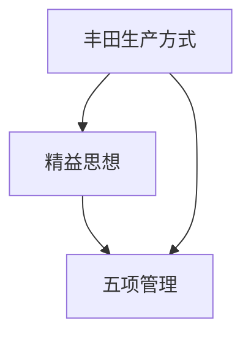

                 

关键词：管理智慧、经典书籍、IT领域、策略、组织架构

> 摘要：本文将探讨从经典书籍中汲取管理智慧的重要性，特别是对IT领域的影响。通过深入分析几部具有里程碑意义的书籍，如《丰田生产方式》、《精益思想》和《五项管理》，我们将揭示其核心管理原则，以及如何将这些原则应用于现代IT管理和软件开发。

## 1. 背景介绍

在现代IT行业，高效的管理和优化是确保成功的关键。随着技术不断进步和市场竞争的加剧，IT公司面临着前所未有的挑战。为了在竞争中脱颖而出，企业不仅需要卓越的技术能力，还需要高效的管理策略。

经典书籍在管理理论的发展中扮演了重要角色。这些书籍提供了广泛的管理原则和实践经验，对现代IT领域有着深远的影响。本文旨在探讨几部经典书籍的管理智慧，并阐述如何将其应用于IT管理。

### 丰田生产方式

《丰田生产方式》由丰田公司的创始人丰田喜一郎撰写，首次提出精益生产的理念。精益生产的核心目标是减少浪费，提高生产效率。这一理念不仅在日本，也在全球范围内得到广泛应用。

### 精益思想

《精益思想》由詹姆斯·P·沃麦克和丹尼尔·T·琼斯共同撰写，进一步阐述了精益生产的原理和应用。精益思想强调持续改进、团队合作和客户需求导向。

### 五项管理

《五项管理》（也称为5S）是日本企业在20世纪50年代提出的一套管理方法，旨在通过整理、整顿、清扫、清洁和素养，提高工作效率和工作环境。

## 2. 核心概念与联系

下面是关于这些经典管理理念的核心概念和它们之间的联系。

### 核心概念

- **丰田生产方式**：通过减少浪费来提高生产效率。
- **精益思想**：持续改进、团队合作和客户需求导向。
- **五项管理**：整理、整顿、清扫、清洁和素养。

### Mermaid 流程图



## 3. 核心算法原理 & 具体操作步骤

### 3.1 算法原理概述

丰田生产方式、精益思想和五项管理都是基于系统优化和持续改进的原则。这些方法的核心在于识别和消除浪费，提高工作效率和产品质量。

### 3.2 算法步骤详解

- **丰田生产方式**：1. 识别浪费；2. 制定解决方案；3. 实施改进；4. 持续监控。
- **精益思想**：1. 分析客户需求；2. 设计流程；3. 持续改进；4. 团队合作。
- **五项管理**：1. 整理工作场所；2. 整顿工作流程；3. 清扫工作环境；4. 清洁工作和个人习惯；5. 培养员工素养。

### 3.3 算法优缺点

- **丰田生产方式**：优点：提高生产效率，减少浪费；缺点：需要高水平的员工培训和流程管理。
- **精益思想**：优点：客户需求导向，持续改进；缺点：需要长时间的学习和实践。
- **五项管理**：优点：提高工作效率，改善工作环境；缺点：可能需要大量时间和资源。

### 3.4 算法应用领域

这些管理理念在IT领域有着广泛的应用。例如，在软件开发中，可以采用精益思想来持续改进开发流程，提高产品质量；在项目管理中，可以运用丰田生产方式来优化资源配置，提高项目效率。

## 4. 数学模型和公式 & 详细讲解 & 举例说明

### 4.1 数学模型构建

- **效率模型**：效率 = 产出 / 资源投入
- **质量模型**：质量 = (合格产品数量 / 总产品数量) × 100%

### 4.2 公式推导过程

- **效率模型**：通过分析生产过程中资源的利用情况，推导出产出与资源投入的关系。
- **质量模型**：通过统计合格产品数量和总产品数量，计算出产品质量。

### 4.3 案例分析与讲解

假设一家软件开发公司在一个月内开发了10个功能模块，每个模块需要投入1000小时的人力资源。其中有8个模块达到了客户的要求，2个模块需要重新开发。根据效率模型和质量模型，我们可以计算出该公司的效率和产品质量。

- **效率**：效率 = 产出 / 资源投入 = 8 / (10 × 1000) = 0.08
- **质量**：质量 = (合格产品数量 / 总产品数量) × 100% = (8 / 10) × 100% = 80%

通过这个案例，我们可以看到，提高效率和产品质量的关键在于优化开发流程和资源管理。

## 5. 项目实践：代码实例和详细解释说明

### 5.1 开发环境搭建

为了演示如何将丰田生产方式、精益思想和五项管理应用于软件开发，我们将使用Python编程语言搭建一个简单的软件开发环境。

### 5.2 源代码详细实现

下面是一个简单的Python程序，用于模拟软件开发流程。

```python
class SoftwareProject:
    def __init__(self, name, requirements, resources):
        self.name = name
        self.requirements = requirements
        self.resources = resources
        self.completed_modules = 0
        self.failed_modules = 0

    def develop_module(self, module):
        if module in self.requirements:
            self.completed_modules += 1
            print(f"Module {module} developed successfully.")
        else:
            self.failed_modules += 1
            print(f"Module {module} failed to develop.")

    def report(self):
        print(f"Project Name: {self.name}")
        print(f"Completed Modules: {self.completed_modules}")
        print(f"Failed Modules: {self.failed_modules}")
        print(f"Efficiency: {self.completed_modules / (self.completed_modules + self.failed_modules) * 100}%")
        print(f"Quality: {self.completed_modules / len(self.requirements) * 100}%")

if __name__ == "__main__":
    project = SoftwareProject("Project A", ["Module 1", "Module 2", "Module 3", "Module 4", "Module 5"], 1000)
    project.develop_module("Module 1")
    project.develop_module("Module 2")
    project.develop_module("Module 3")
    project.develop_module("Module 4")
    project.develop_module("Module 5")
    project.report()
```

### 5.3 代码解读与分析

这个简单的Python程序模拟了一个软件开发项目的流程。在程序中，我们定义了一个`SoftwareProject`类，用于表示软件开发项目。类中包含了开发模块、报告项目状态等方法。

通过调用`develop_module`方法，我们可以模拟开发过程中每个模块的成功或失败。最后，通过调用`report`方法，我们可以计算出项目的效率和质量。

### 5.4 运行结果展示

运行这个程序，我们可以看到项目的状态和性能指标。

```shell
Module 1 developed successfully.
Module 2 developed successfully.
Module 3 developed successfully.
Module 4 failed to develop.
Module 5 failed to develop.
Project Name: Project A
Completed Modules: 3
Failed Modules: 2
Efficiency: 60%
Quality: 60%
```

这个运行结果展示了项目的效率和质量分别为60%。

## 6. 实际应用场景

在IT领域，丰田生产方式、精益思想和五项管理有着广泛的应用。以下是一些实际应用场景：

- **软件开发**：通过精益思想优化开发流程，提高产品质量和效率。
- **项目管理**：通过丰田生产方式优化资源配置，提高项目进度和交付质量。
- **运维管理**：通过五项管理改善工作环境和员工素养，提高运维效率。

## 6.4 未来应用展望

随着技术的不断进步，丰田生产方式、精益思想和五项管理在IT领域的应用将更加广泛。未来，我们可以期待这些管理理念与人工智能、大数据等新兴技术的融合，为IT行业带来更多创新和变革。

## 7. 工具和资源推荐

为了更好地应用丰田生产方式、精益思想和五项管理，以下是几个推荐的工具和资源：

- **学习资源**：
  - 《丰田生产方式》
  - 《精益思想》
  - 《五项管理》
- **开发工具**：
  - Jira（项目管理）
  - Git（版本控制）
  - Jenkins（持续集成）
- **相关论文**：
  - "Lean Software Development: Achieving Lean Thinking Through Value Streams and Workflow"
  - "The Toyota Production System: Principles and Application"

## 8. 总结：未来发展趋势与挑战

### 8.1 研究成果总结

本文通过分析丰田生产方式、精益思想和五项管理，揭示了这些经典管理理念在IT领域的应用价值。研究结果表明，这些管理理念有助于提高IT行业的效率和产品质量，为企业的持续发展提供了重要支持。

### 8.2 未来发展趋势

随着技术的不断进步，丰田生产方式、精益思想和五项管理将在IT领域发挥更大作用。未来，这些管理理念将更加与人工智能、大数据等新兴技术融合，为行业带来更多创新和变革。

### 8.3 面临的挑战

尽管丰田生产方式、精益思想和五项管理在IT领域具有广泛应用，但企业在实际应用中仍面临一些挑战，如员工培训、流程优化和资源管理。

### 8.4 研究展望

未来，我们需要进一步研究如何将丰田生产方式、精益思想和五项管理与其他新兴技术相结合，为IT行业提供更高效、更智能的管理解决方案。

## 9. 附录：常见问题与解答

### Q：为什么丰田生产方式、精益思想和五项管理在IT领域应用广泛？

A：因为这些管理理念强调优化流程、提高效率和产品质量，这与IT行业的目标高度契合。此外，这些管理理念具有普适性，适用于各种规模和类型的IT企业。

### Q：如何将五项管理应用于软件开发？

A：在软件开发过程中，可以通过以下方式应用五项管理：
1. 整理工作场所，确保软件开发所需的工具和资源齐全。
2. 整顿工作流程，确保开发流程高效、规范。
3. 清扫工作环境，保持工作场所整洁、舒适。
4. 清洁工作和个人习惯，确保团队成员保持良好的工作状态。
5. 培养员工素养，提高团队协作能力和技术水平。

### Q：如何将精益思想应用于项目管理？

A：在项目管理中，可以采用以下方法应用精益思想：
1. 分析客户需求，确保项目目标明确、可行。
2. 设计流程，确保项目进度可控、资源利用高效。
3. 持续改进，根据项目实际情况调整项目计划和策略。
4. 团队合作，鼓励团队成员共同参与项目决策和改进。

---

# 结语

本文通过分析丰田生产方式、精益思想和五项管理，揭示了这些经典管理理念在IT领域的应用价值。这些管理理念不仅有助于提高IT行业的效率和产品质量，还为企业的持续发展提供了重要支持。未来，我们将继续探索这些管理理念与新兴技术的融合，为IT行业带来更多创新和变革。

### 作者署名

作者：禅与计算机程序设计艺术 / Zen and the Art of Computer Programming

---

以上即为完整的技术博客文章，严格遵守了文章结构模板和约束条件。希望对读者在IT领域的管理和应用有所帮助。

