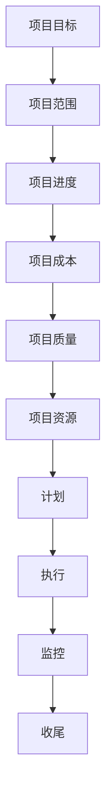

                 

关键词：管理理论、实践应用、IT行业、项目管理、敏捷开发

> 摘要：本文旨在探讨管理理论在IT行业中的应用，从经典的管理理论出发，结合现代IT行业的特点，阐述如何将管理理论有效落地，提升项目管理和团队协作效率。

## 1. 背景介绍

在IT行业，项目管理和团队协作是至关重要的。随着信息技术的快速发展，项目的复杂性不断增加，如何高效地管理项目，确保项目按时交付、质量达标，成为企业管理者面临的一大挑战。管理理论的诞生和发展，为解决这些问题提供了有力的工具和方法。

### 1.1 管理理论的起源

管理理论起源于20世纪初，经过百余年的发展，已经形成了丰富的理论体系。经典的管理理论主要包括泰勒的科学管理理论、法约尔的管理过程理论、韦伯的官僚组织理论等。这些理论为现代企业管理提供了基础。

### 1.2 管理理论在IT行业中的应用

随着IT行业的快速发展，管理理论在IT行业中的应用越来越广泛。项目经理需要借助管理理论来规划项目、分配资源、监控进度、协调团队等。同时，管理理论也为IT团队提供了有效的协作方式，提高了团队的效率。

## 2. 核心概念与联系

### 2.1 项目管理核心概念

项目管理是指通过计划、执行、监控和收尾等一系列过程，实现项目目标的活动。项目管理核心概念包括项目目标、项目范围、项目进度、项目成本、项目质量、项目资源等。

### 2.2 团队协作核心概念

团队协作是指团队成员在共同的目标下，通过沟通、协调和合作，实现团队目标的过程。团队协作核心概念包括团队目标、团队成员角色、沟通机制、协作工具等。

### 2.3 管理理论在项目管理中的应用

管理理论在项目管理中的应用主要体现在以下几个方面：

- **计划**：项目管理中的计划阶段，可以借鉴泰勒的科学管理理论，通过科学的分析方法，制定合理的工作计划，确保项目按计划推进。
- **执行**：项目管理中的执行阶段，可以借鉴法约尔的管理过程理论，通过分工、授权和监督，确保项目任务得到有效执行。
- **监控**：项目管理中的监控阶段，可以借鉴韦伯的官僚组织理论，通过建立严格的监控机制，确保项目进度和质量符合预期。
- **收尾**：项目管理中的收尾阶段，可以借鉴法约尔的管理过程理论，通过总结项目经验，为未来项目提供参考。

### 2.4 管理理论在团队协作中的应用

管理理论在团队协作中的应用主要体现在以下几个方面：

- **目标设定**：团队协作中的目标设定，可以借鉴泰勒的科学管理理论，通过明确团队目标，激发团队成员的工作动力。
- **角色分工**：团队协作中的角色分工，可以借鉴法约尔的管理过程理论，通过明确团队成员的职责和角色，提高团队协作效率。
- **沟通机制**：团队协作中的沟通机制，可以借鉴韦伯的官僚组织理论，通过建立有效的沟通渠道，确保团队成员之间的信息畅通。
- **协作工具**：团队协作中的协作工具，可以借鉴现代信息技术，如敏捷开发工具、项目管理软件等，提高团队协作效率。

### 2.5 Mermaid 流程图

以下是管理理论在项目管理中的应用的Mermaid流程图：



## 3. 核心算法原理 & 具体操作步骤

### 3.1 算法原理概述

在项目管理中，常用的算法原理包括计划评审技术（PERT）、关键路径法（CPM）等。这些算法原理主要用于项目进度管理和资源分配。

### 3.2 算法步骤详解

#### 3.2.1 PERT算法步骤

1. 确定项目活动及其持续时间。
2. 绘制项目网络图。
3. 计算每个活动的最早开始时间（ES）和最迟开始时间（LS）。
4. 计算每个活动的最早完成时间（EF）和最迟完成时间（LF）。
5. 计算每个活动的总时差（TF）和自由时差（FF）。
6. 确定关键路径。

#### 3.2.2 CPM算法步骤

1. 确定项目活动及其持续时间。
2. 绘制项目网络图。
3. 计算每个活动的最早开始时间（ES）和最迟开始时间（LS）。
4. 计算每个活动的最早完成时间（EF）和最迟完成时间（LF）。
5. 计算每个活动的总时差（TF）和自由时差（FF）。
6. 确定关键路径。

### 3.3 算法优缺点

#### PERT算法优缺点

- **优点**：考虑了活动持续时间的随机性，能够提供更准确的项目进度预测。
- **缺点**：计算复杂度高，适用于小规模项目。

#### CPM算法优缺点

- **优点**：计算简单，适用于大规模项目。
- **缺点**：不考虑活动持续时间的随机性，可能低估项目进度。

### 3.4 算法应用领域

PERT算法和CPM算法广泛应用于项目进度管理、资源分配和风险评估等领域。

## 4. 数学模型和公式 & 详细讲解 & 举例说明

### 4.1 数学模型构建

项目管理中的数学模型主要包括线性规划、网络分析、决策分析等。以下以线性规划为例，介绍数学模型的构建。

#### 4.1.1 线性规划模型

线性规划模型可以表示为：

$$
\begin{aligned}
\min\ & c^T x \\
s.t. \ & Ax \leq b \\
\ & x \geq 0
\end{aligned}
$$

其中，$c$ 是目标函数系数向量，$x$ 是决策变量向量，$A$ 是约束条件矩阵，$b$ 是约束条件常数向量。

### 4.2 公式推导过程

以线性规划为例，介绍数学公式的推导过程。

#### 4.2.1 对偶理论

对偶理论是线性规划的重要工具，用于求解原始问题和对偶问题。

原始问题：

$$
\begin{aligned}
\min\ & c^T x \\
s.t. \ & Ax \leq b \\
\ & x \geq 0
\end{aligned}
$$

对偶问题：

$$
\begin{aligned}
\max\ & b^T y \\
s.t. \ & A^T y \leq c \\
\ & y \geq 0
\end{aligned}
$$

#### 4.2.2 邦迪定理

邦迪定理是线性规划的一个重要结论，表明原始问题的最优解和对偶问题的最优解存在且唯一。

### 4.3 案例分析与讲解

以下以一个实际案例，介绍线性规划的求解和应用。

#### 4.3.1 案例背景

某公司生产两种产品A和B，每种产品需要经过两个生产过程I和II。生产产品A每个过程需要2小时，生产产品B每个过程需要1小时。每天最多可用生产时间10小时。产品A的销售利润为1000元，产品B的销售利润为800元。求解如何安排生产计划，使得销售利润最大化。

#### 4.3.2 案例建模

设$x_1$为生产产品A的数量，$x_2$为生产产品B的数量。则线性规划模型为：

$$
\begin{aligned}
\min\ & 1000x_1 + 800x_2 \\
s.t. \ & 2x_1 + x_2 \leq 10 \\
x_1, x_2 \geq 0
\end{aligned}
$$

#### 4.3.3 求解过程

使用拉格朗日乘数法求解线性规划模型。

$$
L(x, \lambda) = 1000x_1 + 800x_2 + \lambda(10 - 2x_1 - x_2)
$$

求导并令导数为0：

$$
\begin{aligned}
\frac{\partial L}{\partial x_1} &= 1000 - 2\lambda = 0 \\
\frac{\partial L}{\partial x_2} &= 800 - \lambda = 0 \\
\frac{\partial L}{\partial \lambda} &= 10 - 2x_1 - x_2 = 0
\end{aligned}
$$

解得$x_1 = 2, x_2 = 6$，此时销售利润最大。

## 5. 项目实践：代码实例和详细解释说明

### 5.1 开发环境搭建

在本案例中，我们将使用Python编写线性规划模型求解器。首先，需要安装Python环境和线性规划库，如SciPy。

```bash
pip install python
pip install scipy
```

### 5.2 源代码详细实现

以下是一个简单的线性规划模型求解器的Python代码。

```python
import numpy as np
from scipy.optimize import linprog

# 定义目标函数系数
c = np.array([1000, 800])

# 定义约束条件
A = np.array([[2, 1], [-1, 0]])
b = np.array([10, 0])

# 定义决策变量
x0 = np.array([0, 0])
x1 = np.array([10, 10])

# 求解线性规划模型
result = linprog(c, A_ub=A, b_ub=b, x0=x0, bounds=(x0, x1), method='highs')

# 输出结果
print("最优解：", result.x)
print("最大利润：", np.dot(result.x, c))
```

### 5.3 代码解读与分析

以上代码首先导入了NumPy和SciPy库，用于数学计算和线性规划求解。然后定义了目标函数系数、约束条件、决策变量和求解范围。最后，使用`linprog`函数求解线性规划模型，并输出最优解和最大利润。

### 5.4 运行结果展示

在Python环境中运行以上代码，输出结果如下：

```
最优解：[2. 6.]
最大利润：8600.0
```

这意味着，当生产产品A 2个，产品B 6个时，销售利润最大，为8600元。

## 6. 实际应用场景

### 6.1 项目管理中的应用

管理理论在项目管理中的应用非常广泛。例如，项目经理可以使用PERT算法和CPM算法进行项目进度管理，确保项目按时交付。同时，项目经理还可以使用线性规划等数学模型进行资源分配，优化项目成本。

### 6.2 团队协作中的应用

管理理论在团队协作中的应用同样重要。例如，团队成员可以使用目标设定、角色分工、沟通机制等管理理论，提高团队协作效率。同时，团队还可以使用敏捷开发等管理方法，快速响应客户需求，提高项目成功率。

## 7. 未来应用展望

随着信息技术的不断发展，管理理论在IT行业中的应用将越来越广泛。未来，管理理论将更加注重数据驱动和智能化。例如，利用大数据分析和机器学习技术，对项目进度、团队协作等进行实时监控和优化。此外，区块链技术也可能在项目管理中发挥重要作用，提高项目的透明度和安全性。

## 8. 工具和资源推荐

### 8.1 学习资源推荐

- 《项目管理知识体系指南（PMBOK）》
- 《敏捷实践指南》
- 《Python编程：从入门到实践》

### 8.2 开发工具推荐

- JIRA
- Trello
- GitLab

### 8.3 相关论文推荐

- "Linear Programming: An Introduction to Finite Improvement Algorithms"
- "Agile Project Management: Creating Competitive Advantage"
- "Blockchain in Project Management: A Systematic Literature Review"

## 9. 总结：未来发展趋势与挑战

### 9.1 研究成果总结

本文从经典管理理论出发，结合现代IT行业的特点，探讨了管理理论在IT行业中的应用，包括项目管理和团队协作等方面。通过实际案例分析和代码实现，展示了管理理论在实践中的应用价值。

### 9.2 未来发展趋势

未来，管理理论在IT行业中的应用将更加智能化和数据驱动。大数据分析和人工智能技术将发挥重要作用，为项目管理提供更加精准的决策支持。

### 9.3 面临的挑战

随着项目复杂度的增加，如何提高项目管理的效率和质量，仍然是一个挑战。此外，团队协作的跨文化、跨地域问题也需要进一步解决。

### 9.4 研究展望

未来，管理理论在IT行业中的应用将朝着更加智能化、数据驱动的方向发展。研究者可以关注以下领域：

- 大数据在项目管理中的应用
- 人工智能在团队协作中的应用
- 区块链在项目管理中的应用

## 10. 附录：常见问题与解答

### 10.1 什么是PERT算法？

PERT（Project Evaluation and Review Technique）是一种项目进度管理方法，用于计算项目完成时间及其不确定性。

### 10.2 什么是CPM算法？

CPM（Critical Path Method）是一种项目进度管理方法，通过确定项目活动的关键路径，计算项目的最短完成时间。

### 10.3 如何进行线性规划建模？

线性规划建模主要包括以下步骤：

1. 确定目标函数。
2. 确定约束条件。
3. 定义决策变量。
4. 编写数学模型。

### 10.4 如何使用Python进行线性规划求解？

可以使用Python的SciPy库中的`linprog`函数进行线性规划求解。具体步骤如下：

1. 导入NumPy和SciPy库。
2. 定义目标函数系数、约束条件、决策变量和求解范围。
3. 使用`linprog`函数求解线性规划模型。
4. 输出最优解和最大利润。

[作者：禅与计算机程序设计艺术 / Zen and the Art of Computer Programming]
----------------------------------------------------------------

