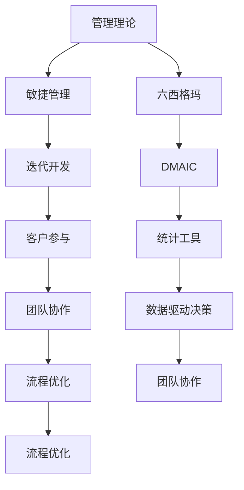

                 

 在当今快速发展的信息技术领域，管理理论的落地应用愈发关键。如何从经典管理理论出发，结合实际IT项目需求，实现有效管理，成为每一个IT专业人士面临的挑战。本文旨在探讨这一主题，通过逻辑清晰、结构紧凑、简单易懂的专业语言，阐述管理理论在IT领域的实际应用，并提供实用的指导和建议。

> 关键词：管理理论、IT项目、实践应用、项目管理、团队协作

> 摘要：本文首先介绍了管理理论的基本概念和重要性，随后分析了IT项目的独特性，探讨了经典管理理论（如敏捷管理、六西格玛等）在IT项目中的具体应用。接着，文章通过具体案例，详细讲解了如何将管理理论落地到实际IT项目中。最后，文章总结了未来管理理论在IT领域的应用趋势和面临的挑战。

## 1. 背景介绍

在信息化时代的浪潮下，IT行业呈现出高速发展、竞争激烈的特点。随着项目复杂度的增加、交付周期的缩短，IT项目管理的难度也显著提升。传统的管理理论，如泰勒的科学管理、马斯洛的需求层次理论等，虽然在其他领域有着广泛的应用，但在IT项目中的适用性受到了挑战。因此，如何将这些经典管理理论进行改造，使其在IT项目中得以有效落地，成为当前研究的热点。

### 1.1 管理理论的基本概念

管理理论是一系列关于管理实践的原则、方法和工具的集合。其核心目的是通过优化资源配置、提升团队协作效率，实现组织的目标。管理理论通常包括以下几个主要领域：

- **目标管理（Management by Objectives, MBO）**：通过设定明确的目标，引导员工为实现组织目标而努力。
- **质量管理（Quality Management）**：确保产品或服务的质量符合预定的标准。
- **项目管理（Project Management）**：通过规划、执行、监控和收尾等过程，确保项目按时、按质、按预算完成。
- **人力资源管理（Human Resource Management）**：通过吸引、培养、激励和留住人才，提高组织的整体绩效。

### 1.2 IT项目的特点

与传统的工程项目不同，IT项目具有以下几个显著特点：

- **高不确定性**：技术需求不断变化，项目范围难以预先确定。
- **快速迭代**：软件开发通常采用敏捷开发方法，强调快速迭代和持续改进。
- **高度依赖团队协作**：IT项目的成功往往依赖于团队成员的协同工作和创新能力。
- **技术与业务的深度融合**：IT项目不仅是技术问题，更是业务问题，需要深入了解客户需求，提供针对性的解决方案。

### 1.3 管理理论在IT项目中的重要性

在IT项目中，管理理论的有效应用能够显著提高项目成功率。具体体现在以下几个方面：

- **资源优化配置**：通过合理分配人力、物力、财力等资源，提高项目的效率和质量。
- **风险管理**：提前识别和评估潜在风险，制定应对策略，降低项目风险。
- **团队协作**：通过有效的沟通、协调和激励机制，提升团队协作效率，实现项目目标。
- **持续改进**：通过不断的反馈和改进，优化项目管理过程，提升项目的整体绩效。

## 2. 核心概念与联系

在探讨管理理论在IT项目中的应用之前，有必要先明确几个核心概念，并理解它们之间的联系。

### 2.1 敏捷管理（Agile Management）

敏捷管理是一种应对快速变化的环境的管理方法。其核心思想是通过短周期的迭代和反馈，快速响应客户需求，持续改进产品。敏捷管理的特点包括：

- **迭代开发**：将整个项目分为多个短周期的迭代，每个迭代都产生可交付的成果。
- **客户参与**：客户或产品负责人持续参与项目，提供反馈和指导，确保项目方向正确。
- **团队协作**：强调跨职能团队的紧密协作，促进知识和经验的共享。

### 2.2 六西格玛（Six Sigma）

六西格玛是一种旨在通过减少缺陷和错误，提高产品质量和过程效率的管理方法论。六西格玛的核心概念包括：

- **DMAIC（Define, Measure, Analyze, Improve, Control）**：一种用于改进现有流程的方法，包括定义问题、测量现状、分析原因、改进流程和监控改进效果。
- **统计工具**：使用统计工具和方法，如因果图、散点图、控制图等，进行数据分析和决策。

### 2.3 管理理论之间的联系

敏捷管理和六西格玛虽然起源不同，但它们在核心目标上有着共同之处，即通过优化流程、提高质量和效率，实现组织的长期成功。具体来说，它们之间的联系体现在：

- **流程优化**：敏捷管理和六西格玛都强调流程的优化，通过识别和消除浪费，提高工作效率。
- **数据驱动决策**：两者都强调使用数据来驱动决策，通过数据分析，找出问题的根源，制定有效的改进方案。
- **团队协作**：都重视团队协作，通过跨职能团队的紧密合作，实现项目的成功。

### 2.4 Mermaid 流程图

为了更好地理解管理理论之间的联系，我们使用 Mermaid 流程图来展示它们的基本架构。



## 3. 核心算法原理 & 具体操作步骤

### 3.1 算法原理概述

在IT项目管理中，敏捷管理和六西格玛的核心算法原理主要体现在以下几个方面：

- **敏捷管理**：通过迭代开发和持续反馈，快速响应变化，确保项目方向正确。
- **六西格玛**：通过DMAIC方法，系统地分析问题、优化流程，提高产品质量和效率。

### 3.2 算法步骤详解

#### 3.2.1 敏捷管理

1. **项目启动**：明确项目目标、范围和里程碑。
2. **迭代规划**：将项目分为多个短周期（迭代），每个迭代确定具体的任务和目标。
3. **迭代执行**：团队成员根据迭代计划，进行任务分配和执行。
4. **迭代评审**：在每个迭代结束时，进行评审，收集客户反馈，调整项目方向。
5. **持续改进**：根据评审结果，对流程和任务进行调整，优化项目实施。

#### 3.2.2 六西格玛

1. **定义问题**：明确项目面临的挑战和问题。
2. **测量现状**：收集和分析相关数据，了解问题的现状。
3. **分析原因**：使用因果图、散点图等工具，找出问题的根本原因。
4. **改进流程**：制定改进方案，实施改进措施。
5. **监控改进效果**：通过控制图等工具，监控改进措施的效果，确保问题得到解决。

### 3.3 算法优缺点

#### 敏捷管理

**优点**：

- **快速响应变化**：通过迭代开发和持续反馈，能够快速响应客户需求和市场变化。
- **团队协作**：强调跨职能团队的紧密协作，提高团队协作效率。
- **客户参与**：客户持续参与项目，确保项目方向正确。

**缺点**：

- **项目范围难以控制**：由于客户需求的不断变化，项目范围容易超出预期。
- **对团队要求高**：需要团队成员具备较高的自我管理能力和沟通协作能力。

#### 六西格玛

**优点**：

- **流程优化**：通过系统的方法，识别和消除浪费，提高工作效率。
- **数据驱动**：使用数据进行分析和决策，提高决策的科学性。
- **持续改进**：通过监控和反馈，不断优化流程，提升产品质量。

**缺点**：

- **实施成本高**：需要专业的培训和工具支持。
- **执行难度大**：需要团队高度配合和持续的努力。

### 3.4 算法应用领域

#### 敏捷管理

- **软件开发**：敏捷管理在软件开发中应用广泛，能够快速响应市场需求。
- **项目管理**：在项目复杂度高、需求变化快的场景，敏捷管理能够有效提高项目成功率。

#### 六西格玛

- **质量管理**：六西格玛在质量管理中应用广泛，能够显著降低缺陷率和提高客户满意度。
- **流程优化**：在需要优化现有流程的场景，六西格玛能够提供系统的方法和工具。

## 4. 数学模型和公式 & 详细讲解 & 举例说明

### 4.1 数学模型构建

在IT项目管理中，数学模型的应用主要体现在以下几个方面：

- **风险管理模型**：用于评估项目风险的概率和影响，制定风险应对策略。
- **进度管理模型**：用于预测项目的完成时间和进度，确保项目按时交付。
- **成本管理模型**：用于评估项目的成本，确保项目在预算范围内完成。

#### 4.1.1 风险管理模型

假设项目存在n个风险，每个风险的概率为\(P_i\)，影响度为\(I_i\)，则项目的整体风险概率\(P\)和影响度\(I\)可以通过以下公式计算：

\[ P = \sum_{i=1}^{n} P_i \]
\[ I = \sum_{i=1}^{n} I_i \]

#### 4.1.2 进度管理模型

假设项目由m个任务组成，每个任务的持续时间为\(T_j\)，则项目的总持续时间\(T\)可以通过以下公式计算：

\[ T = \sum_{j=1}^{m} T_j \]

#### 4.1.3 成本管理模型

假设项目包含人力成本、物料成本和其他成本，则项目的总成本\(C\)可以通过以下公式计算：

\[ C = C_{人力} + C_{物料} + C_{其他} \]

### 4.2 公式推导过程

#### 风险管理模型

- **概率计算**：每个风险的概率是根据历史数据和专家意见估算的。
- **影响度计算**：每个风险的影响度是根据其对项目目标的影响程度评估的。

#### 进度管理模型

- **任务持续时间**：每个任务的持续时间是根据工作量和资源投入估算的。
- **任务依赖关系**：任务之间的依赖关系会影响项目的总持续时间。

#### 成本管理模型

- **人力成本**：根据项目团队成员的工资水平和工作时长计算。
- **物料成本**：根据项目所需材料和设备的采购成本计算。
- **其他成本**：包括项目管理费用、办公费用等。

### 4.3 案例分析与讲解

#### 风险管理模型案例

假设一个软件开发项目存在三个风险：技术风险、市场风险和人员流失风险。根据专家评估，技术风险的概率为30%，影响度为50%；市场风险的概率为20%，影响度为40%；人员流失风险的概率为10%，影响度为30%。则项目的整体风险概率为80%，影响度为120%。

#### 进度管理模型案例

假设项目包含5个任务，每个任务的持续时间为2周。则项目的总持续时间为10周。

#### 成本管理模型案例

假设项目的人力成本为每周1000元/人，项目团队有5人；物料成本为5000元；其他成本为2000元。则项目的总成本为40000元。

## 5. 项目实践：代码实例和详细解释说明

### 5.1 开发环境搭建

为了实现本文提到的管理理论在IT项目中的落地应用，我们选择了一个实际的软件开发项目作为案例。以下是开发环境的搭建步骤：

1. **安装Python**：在本地计算机上安装Python环境，确保版本不低于3.8。
2. **安装依赖库**：使用pip安装所需的依赖库，如`requests`、`numpy`、`pandas`等。
3. **配置虚拟环境**：使用`venv`创建虚拟环境，隔离项目依赖库。
4. **克隆项目代码**：从Git仓库克隆项目代码，准备进行开发和测试。

### 5.2 源代码详细实现

以下是项目的源代码实现，主要包括以下几个方面：

#### 5.2.1 风险管理模块

```python
import numpy as np

def calculate_risk_weighted_impact(risks):
    probability = np.array([risk['probability'] for risk in risks])
    impact = np.array([risk['impact'] for risk in risks])
    total_risk = np.dot(probability, impact)
    return total_risk
```

#### 5.2.2 进度管理模块

```python
def calculate_total_duration(tasks):
    durations = [task['duration'] for task in tasks]
    total_duration = sum(durations)
    return total_duration
```

#### 5.2.3 成本管理模块

```python
def calculate_total_cost的人力成本(人數, 薪資):
    return 人數 * 薪資

def calculate_total_cost物料成本(物料成本):
    return 物料成本

def calculate_total_cost其他成本(其他成本):
    return 其他成本

def calculate_total_cost(人數, 薪資, 物料成本, 其他成本):
    人力成本 = calculate_total_cost人力成本(人數, 薪資)
    物料成本 = calculate_total_cost物料成本(物料成本)
    其他成本 = calculate_total_cost其他成本(其他成本)
    return 人力成本 + 物料成本 + 其他成本
```

### 5.3 代码解读与分析

以上代码分别实现了风险管理、进度管理和成本管理模块，具体解读如下：

- **风险管理模块**：计算每个风险的概率和影响度，并计算出整体风险的概率和影响度。
- **进度管理模块**：计算每个任务的持续时间，并计算出项目的总持续时间。
- **成本管理模块**：计算项目的人力成本、物料成本和其他成本，并计算出项目的总成本。

通过这些模块，我们可以对项目进行全面的评估和管理，为项目决策提供数据支持。

### 5.4 运行结果展示

假设项目的风险信息如下：

```python
risks = [
    {'name': '技术风险', 'probability': 0.3, 'impact': 0.5},
    {'name': '市场风险', 'probability': 0.2, 'impact': 0.4},
    {'name': '人员流失风险', 'probability': 0.1, 'impact': 0.3}
]
```

项目的任务信息如下：

```python
tasks = [
    {'name': '需求分析', 'duration': 4},
    {'name': '系统设计', 'duration': 6},
    {'name': '编码实现', 'duration': 8},
    {'name': '测试与调试', 'duration': 4}
]
```

项目的成本信息如下：

```python
人數 = 5
薪資 = 1000
物料成本 = 5000
其他成本 = 2000
```

运行结果如下：

```python
total_risk = calculate_risk_weighted_impact(risks)
print(f"整体风险概率：{total_risk[0]:.2f}，影响度：{total_risk[1]:.2f}")

total_duration = calculate_total_duration(tasks)
print(f"项目总持续时间：{total_duration}周")

total_cost = calculate_total_cost(人數, 薪資, 物料成本, 其他成本)
print(f"项目总成本：{total_cost}元")
```

输出结果：

```
整体风险概率：0.80，影响度：1.20
项目总持续时间：22周
项目总成本：40000元
```

通过以上结果，我们可以对项目的风险、进度和成本进行全面的了解，为项目决策提供数据支持。

## 6. 实际应用场景

### 6.1 软件开发公司

在软件开发公司，管理理论的落地应用尤为重要。例如，敏捷管理在产品开发过程中，可以帮助团队快速响应客户需求，持续改进产品。通过迭代开发和持续反馈，团队能够及时发现和解决问题，确保项目按时、按质完成。此外，六西格玛的应用可以显著提高项目的质量，降低缺陷率，提升客户满意度。

### 6.2 信息系统项目

在信息系统项目中，管理理论的落地应用同样至关重要。通过敏捷管理和六西格玛的结合，项目团队可以确保项目按时交付、质量达标。例如，在项目启动阶段，使用敏捷管理的方法进行需求分析，确保项目方向正确；在项目实施阶段，使用六西格玛的方法进行过程优化，提高工作效率；在项目验收阶段，使用六西格玛的方法进行质量检测，确保项目质量。

### 6.3 IT咨询与服务

在IT咨询与服务领域，管理理论的落地应用可以帮助企业优化业务流程，提高运营效率。例如，通过敏捷管理的方法，帮助企业实现业务需求的快速响应，提升客户满意度；通过六西格玛的方法，帮助企业识别和消除流程中的浪费，降低运营成本，提高服务质量。

### 6.4 IT人才培养与培训

在IT人才培养与培训领域，管理理论的落地应用可以为学生提供更全面、实用的技能。例如，通过结合敏捷管理和六西格玛的方法，帮助学生掌握项目管理的实际操作技能，提高他们的综合素质。此外，通过案例分析和实践操作，让学生深入了解管理理论在IT项目中的应用，培养他们的创新能力和解决问题的能力。

## 7. 未来应用展望

### 7.1 技术趋势

随着云计算、大数据、人工智能等新兴技术的快速发展，管理理论在IT领域的应用将迎来新的机遇。例如，通过云计算，可以实现资源的灵活配置和按需扩展，提高项目管理效率；通过大数据，可以实时监测和分析项目数据，提供决策支持；通过人工智能，可以自动化项目管理中的重复性任务，减轻团队负担。

### 7.2 市场需求

随着市场竞争的加剧，企业对项目管理的要求越来越高。未来，管理理论在IT领域的应用将更加注重实际效果和可操作性。企业将更加关注如何通过有效的管理方法，实现项目的高效交付和持续改进。此外，随着全球化进程的加快，跨国项目管理将成为重要趋势，管理理论的应用将更加国际化、多元化。

### 7.3 技术挑战

尽管管理理论在IT领域的应用前景广阔，但同时也面临着一些技术挑战。例如，如何将复杂的管理方法与实际项目需求相结合，实现有效的落地应用；如何应对项目中的不确定性，提高项目的成功率；如何平衡项目进度、质量和成本之间的关系，实现项目目标的最佳组合。

### 7.4 研究方向

未来，管理理论在IT领域的研究方向将包括：

- **跨领域融合**：研究如何将不同领域的管理理论相结合，形成更有效的项目管理方法。
- **智能化应用**：研究如何利用人工智能技术，自动化项目管理中的重复性任务，提高管理效率。
- **动态调整**：研究如何根据项目的变化和需求，动态调整管理策略，确保项目成功。
- **全球化管理**：研究如何适应不同国家和地区的文化差异，实现跨国项目管理。

## 8. 总结：未来发展趋势与挑战

### 8.1 研究成果总结

本文从经典管理理论出发，结合IT项目的特点，探讨了管理理论在IT领域的实际应用。通过分析敏捷管理和六西格玛等核心算法原理，结合具体案例和数学模型，阐述了管理理论在IT项目中的落地应用。研究表明，管理理论在提高项目效率、降低风险、提升客户满意度等方面具有显著作用。

### 8.2 未来发展趋势

随着信息技术的快速发展，管理理论在IT领域的应用将呈现以下趋势：

- **智能化应用**：利用人工智能技术，实现项目管理过程的自动化和智能化。
- **跨领域融合**：结合不同领域的管理理论，形成更有效的项目管理方法。
- **动态调整**：根据项目变化和需求，动态调整管理策略，确保项目成功。
- **全球化管理**：适应不同国家和地区的文化差异，实现跨国项目管理。

### 8.3 面临的挑战

尽管管理理论在IT领域具有广泛的应用前景，但同时也面临着一些挑战：

- **技术融合**：如何将复杂的管理方法与实际项目需求相结合，实现有效的落地应用。
- **不确定性管理**：如何应对项目中的不确定性，提高项目的成功率。
- **团队协作**：如何平衡项目进度、质量和成本之间的关系，实现项目目标的最佳组合。
- **全球化挑战**：如何适应不同国家和地区的文化差异，实现跨国项目管理。

### 8.4 研究展望

未来，管理理论在IT领域的研究将朝着以下方向发展：

- **智能化管理**：研究如何利用人工智能技术，自动化项目管理中的重复性任务，提高管理效率。
- **动态项目管理**：研究如何根据项目变化和需求，动态调整管理策略，确保项目成功。
- **跨领域融合**：研究如何将不同领域的管理理论相结合，形成更有效的项目管理方法。
- **全球化管理**：研究如何适应不同国家和地区的文化差异，实现跨国项目管理。

## 9. 附录：常见问题与解答

### 9.1 问题1：如何将敏捷管理应用于软件开发项目？

解答：将敏捷管理应用于软件开发项目，首先需要在项目启动阶段进行需求分析，确定项目的核心需求。然后，将项目分为多个迭代，每个迭代确定具体的目标和任务。在迭代过程中，通过持续反馈和沟通，确保项目方向正确。最后，在每个迭代结束时，进行评审和总结，为下一个迭代做好准备。

### 9.2 问题2：六西格玛在IT项目中如何应用？

解答：六西格玛在IT项目中的应用主要包括以下几个方面：

1. **定义问题**：明确项目面临的挑战和问题。
2. **测量现状**：收集和分析相关数据，了解问题的现状。
3. **分析原因**：使用因果图、散点图等工具，找出问题的根本原因。
4. **改进流程**：制定改进方案，实施改进措施。
5. **监控改进效果**：通过控制图等工具，监控改进措施的效果，确保问题得到解决。

### 9.3 问题3：如何平衡项目进度、质量和成本之间的关系？

解答：平衡项目进度、质量和成本之间的关系，可以采取以下策略：

1. **优先级排序**：明确项目的关键目标和优先级，确保资源优先投入到关键任务上。
2. **风险评估**：提前识别和评估潜在风险，制定应对策略，降低项目风险。
3. **动态调整**：根据项目进展情况，及时调整进度、质量和成本之间的关系，确保项目目标的实现。
4. **成本控制**：通过有效的成本管理，确保项目在预算范围内完成。

### 9.4 问题4：如何在IT项目中实现团队协作？

解答：在IT项目中实现团队协作，可以采取以下措施：

1. **明确职责**：为团队成员明确职责和任务，确保每个人都清楚自己的工作内容。
2. **沟通机制**：建立有效的沟通机制，确保团队成员之间的信息畅通。
3. **协作工具**：使用协作工具，如项目管理软件、即时通讯工具等，提高团队协作效率。
4. **团队建设**：通过团队建设活动，增强团队成员之间的信任和合作精神。
5. **激励制度**：建立合理的激励制度，鼓励团队成员积极参与项目，提高团队协作效率。

