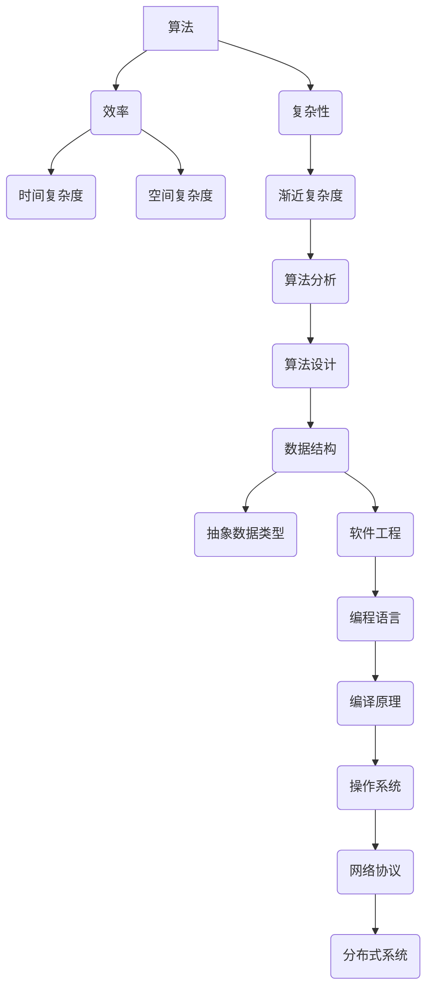

                 

关键词：计算机科学、基础理论、算法、编程、数学模型、应用场景、未来展望

> 摘要：本文以深入探讨计算机科学领域的基础理论为主线，通过剖析经典算法、数学模型和实际应用，为读者奠定坚实的认知基础。文章分为背景介绍、核心概念与联系、核心算法原理与具体操作步骤、数学模型和公式、项目实践、实际应用场景、工具和资源推荐、总结与展望等章节，全面揭示计算机科学的本质和未来发展趋势。

## 1. 背景介绍

计算机科学作为一门高度抽象的学科，其基础理论构成了整个领域的基石。从早期的计算机硬件发展到现代的软件系统，基础理论的研究从未停止。本文将探讨计算机科学中几个关键领域的经典理论和算法，包括算法设计、数学模型构建和实际应用等。通过回顾历史，分析现有技术，展望未来趋势，旨在为读者提供一个全面、系统的认知框架。

### 1.1 历史背景

计算机科学的发展历程可谓波澜壮阔。从20世纪40年代冯·诺伊曼（John von Neumann）提出的存储程序计算机架构，到后来的图灵机（Turing Machine）理论，计算机科学的基础理论逐渐成型。50年代，算法理论开始萌芽，以分治算法、动态规划等为代表；60年代，图论和组合数学逐渐成为计算机科学的重要组成部分；70年代，随着计算机硬件的快速发展，算法效率和复杂性分析成为研究热点。进入21世纪，随着互联网和大数据技术的崛起，机器学习、深度学习等前沿领域进一步丰富了计算机科学的理论体系。

### 1.2 现状与挑战

当前，计算机科学在多个领域取得了显著进展，但同时也面临诸多挑战。算法设计的效率、大数据处理的优化、人工智能的安全性和隐私保护等都是亟待解决的问题。随着量子计算机的逐渐逼近，计算机科学的基础理论将迎来新的变革。本文将重点探讨这些领域的经典理论和方法，帮助读者理解计算机科学的本质和未来发展方向。

## 2. 核心概念与联系

在深入探讨计算机科学的核心问题之前，我们需要明确几个关键概念，并理解它们之间的联系。以下是一个用Mermaid绘制的流程图，展示了这些概念及其相互关系。



### 2.1 算法

算法是计算机科学中最核心的概念之一。它是一系列明确的操作步骤，用于解决特定问题。算法的效率直接影响计算机程序的运行速度和处理能力。

### 2.2 效率和复杂性

算法的效率通常通过时间和空间复杂度来衡量。时间复杂度描述了算法运行时间与数据规模的关系，而空间复杂度描述了算法所需内存与数据规模的关系。复杂性分析是算法设计的重要步骤，有助于我们评估算法的可行性和优化潜力。

### 2.3 数据结构

数据结构是存储和组织数据的方式。合理选择数据结构可以显著提高算法的效率。常见的有数组、链表、树、图等。

### 2.4 抽象数据类型

抽象数据类型是一种基于数据结构的抽象概念，它将数据和处理数据的操作封装在一起，提供一种简化的接口。常见的抽象数据类型有栈、队列、列表等。

### 2.5 软件工程

软件工程是计算机科学的一个分支，它关注如何设计、开发和维护高质量的软件系统。软件工程涵盖了编程语言、编译原理、操作系统、网络协议等多个方面。

通过上述概念和流程图，我们可以看到计算机科学的核心领域是如何相互联系、相互支撑的。理解这些概念及其关系是深入研究和应用计算机科学的基础。

## 3. 核心算法原理与具体操作步骤

在了解了核心概念和联系后，我们将深入探讨几个经典的算法原理，并详细描述其操作步骤。

### 3.1 算法原理概述

本文将讨论三个经典算法：快速排序、动态规划和深度优先搜索。

### 3.2 快速排序

#### 原理

快速排序是一种高效的排序算法，基于分治策略。其基本思想是通过选取一个基准元素，将数组分成两部分，一部分都比基准元素小，另一部分都比基准元素大，然后递归地对这两部分进行排序。

#### 操作步骤

1. 选择基准元素。
2. 将数组分成两部分，一部分比基准元素小，另一部分比基准元素大。
3. 递归地对两部分进行快速排序。

#### 代码示例

```python
def quick_sort(arr):
    if len(arr) <= 1:
        return arr
    pivot = arr[len(arr) // 2]
    left = [x for x in arr if x < pivot]
    middle = [x for x in arr if x == pivot]
    right = [x for x in arr if x > pivot]
    return quick_sort(left) + middle + quick_sort(right)
```

### 3.3 动态规划

#### 原理

动态规划是一种优化递归算法的方法，它通过保存中间结果来避免重复计算，适用于具有最优子结构性质的问题。

#### 操作步骤

1. 定义状态和状态转移方程。
2. 初始化边界条件。
3. 递推计算状态值。
4. 返回最终结果。

#### 代码示例

```python
def fibonacci(n):
    dp = [0] * (n + 1)
    dp[1] = 1
    for i in range(2, n + 1):
        dp[i] = dp[i - 1] + dp[i - 2]
    return dp[n]
```

### 3.4 深度优先搜索

#### 原理

深度优先搜索（DFS）是一种用于遍历或搜索树或图的算法，其基本思想是从根节点开始，尽可能深地遍历树的分支。

#### 操作步骤

1. 从根节点开始，将其标记为已访问。
2. 访问其未被访问的邻接节点。
3. 对每个邻接节点重复步骤2和3，直到所有节点都被访问。

#### 代码示例

```python
def dfs(graph, node, visited):
    visited.add(node)
    for neighbour in graph[node]:
        if neighbour not in visited:
            dfs(graph, neighbour, visited)
```

通过上述经典算法的原理和操作步骤，我们可以看到算法设计的重要性。理解这些算法不仅有助于解决实际问题，还能提高我们的编程能力和问题解决能力。

### 3.5 算法优缺点

#### 快速排序

- **优点**：时间复杂度为 \(O(n\log n)\)，平均情况下的性能较好。
- **缺点**：最坏情况下的时间复杂度为 \(O(n^2)\)，并且需要额外的空间来存储递归栈。

#### 动态规划

- **优点**：适用于具有最优子结构性质的问题，能够显著减少计算时间。
- **缺点**：理解和使用较为复杂，需要仔细设计和分析状态转移方程。

#### 深度优先搜索

- **优点**：易于实现，能够快速找到解。
- **缺点**：可能陷入死循环，需要额外的空间来存储递归栈。

### 3.6 算法应用领域

- **快速排序**：广泛应用于各种排序和查找问题，如数据库索引和搜索算法。
- **动态规划**：广泛应用于优化问题，如背包问题和最短路径问题。
- **深度优先搜索**：广泛应用于图的遍历和搜索，如路径查找和社交网络分析。

通过深入探讨这些算法的原理和具体操作步骤，我们可以更好地理解它们在计算机科学中的应用和重要性。

## 4. 数学模型和公式

在计算机科学中，数学模型和公式是理解和解决问题的关键工具。以下内容将详细讲解数学模型构建、公式推导过程和案例分析与讲解。

### 4.1 数学模型构建

数学模型是计算机科学中描述现实世界问题的一种抽象表示。构建数学模型通常包括以下步骤：

1. **定义变量**：明确问题中的变量，并为其分配适当的数学符号。
2. **建立关系**：根据问题的性质，建立变量之间的数学关系。
3. **确定约束条件**：分析问题的限制条件，并表达为数学上的不等式或等式。
4. **目标函数**：根据问题的目标，定义需要优化的目标函数。

### 4.2 公式推导过程

公式推导过程通常包括以下几个阶段：

1. **初始假设**：根据问题的性质，提出初步的假设条件。
2. **逻辑推导**：利用数学推理，逐步推导出目标公式。
3. **证明与验证**：通过逻辑证明和实际验证，确保公式的正确性和适用性。

#### 示例：最短路径公式

假设有两个顶点 \(A\) 和 \(B\)，我们需要计算从 \(A\) 到 \(B\) 的最短路径。以下是一个基于迪杰斯特拉算法的最短路径公式推导过程：

1. **初始假设**：设定顶点 \(A\) 的初始距离为0，其他顶点的初始距离为无穷大。
2. **逻辑推导**：在每次迭代中，选择当前未访问顶点中距离最短的顶点，更新与其相邻顶点的距离。
3. **证明与验证**：通过数学归纳法证明，对于任意顶点 \(i\)，其最终距离等于从 \(A\) 到 \(i\) 的最短路径长度。

推导过程如下：

\[ d(B) = \min \left( \sum_{i \in \text{未访问顶点}} d(i) + w(B, i) \right) \]

其中，\(d(B)\) 表示顶点 \(B\) 的最短路径距离，\(w(B, i)\) 表示顶点 \(B\) 到 \(i\) 的边权重。

### 4.3 案例分析与讲解

以下通过一个实际案例，展示数学模型和公式的应用：

#### 案例：背包问题

背包问题是一个经典的优化问题，其目标是选择物品的组合，使得总重量不超过背包容量，同时总价值最大化。

**模型构建**：

- \(x_i\)：是否选择第 \(i\) 个物品（0或1）。
- \(w_i\)：第 \(i\) 个物品的重量。
- \(v_i\)：第 \(i\) 个物品的价值。
- \(W\)：背包的容量。

**目标函数**：

\[ \max \sum_{i=1}^{n} v_i x_i \]

**约束条件**：

\[ \sum_{i=1}^{n} w_i x_i \leq W \]

**求解方法**：可以使用动态规划或分支界定法求解。

**推导与证明**：

通过动态规划方法，定义一个二维数组 \(dp[i][j]\)，表示在前 \(i\) 个物品中选择价值总和不超过 \(j\) 的最大价值。状态转移方程如下：

\[ dp[i][j] = \begin{cases} 
dp[i-1][j] & \text{如果 } j < w_i \\
\max(dp[i-1][j], dp[i-1][j-w_i] + v_i) & \text{否则}
\end{cases} \]

通过递推计算，最终得到背包问题的最优解。

### 4.4 案例分析与讲解

以下通过一个具体案例，展示数学模型和公式的实际应用：

#### 案例：社交网络影响力最大化

假设一个社交网络中有 \(n\) 个用户，每个用户的影响力可以通过其连接数来衡量。我们的目标是选择一部分用户进行推广，以最大化整体网络的影响力。

**模型构建**：

- \(u_i\)：第 \(i\) 个用户的影响力。
- \(c_{ij}\)：第 \(i\) 个用户对第 \(j\) 个用户的连接权重。

**目标函数**：

\[ \max \sum_{i=1}^{n} u_i \cdot x_i \]

**约束条件**：

\[ \sum_{i=1}^{n} c_{ij} x_i \leq C \]

其中，\(C\) 为推广预算。

**求解方法**：可以使用线性规划求解。

通过构建和求解这个数学模型，我们可以找到最经济的用户推广方案，以最大化社交网络的影响力。

通过上述数学模型和公式的构建、推导和案例讲解，我们可以看到数学在计算机科学中的广泛应用。理解这些模型和公式，有助于我们更好地解决实际问题，并深入探索计算机科学的本质。

## 5. 项目实践：代码实例和详细解释说明

### 5.1 开发环境搭建

在进行项目实践之前，我们需要搭建一个合适的开发环境。以下是一个简单的步骤指南，用于搭建一个基于Python的算法开发环境。

1. **安装Python**：首先，确保系统中已安装Python 3.x版本。可以从Python官方网站下载并安装。
2. **安装IDE**：推荐使用Visual Studio Code（VS Code）作为IDE。可以从VS Code官方网站下载并安装。
3. **安装扩展**：在VS Code中，安装“Python”扩展以获得更好的Python编程支持。
4. **安装依赖**：使用pip命令安装必要的Python库，例如`numpy`、`matplotlib`等。

```bash
pip install numpy matplotlib
```

### 5.2 源代码详细实现

以下是一个使用Python实现的快速排序算法的示例。

```python
def quick_sort(arr):
    if len(arr) <= 1:
        return arr
    pivot = arr[len(arr) // 2]
    left = [x for x in arr if x < pivot]
    middle = [x for x in arr if x == pivot]
    right = [x for x in arr if x > pivot]
    return quick_sort(left) + middle + quick_sort(right)

# 示例数据
arr = [3, 6, 8, 10, 1, 2, 1]

# 执行排序
sorted_arr = quick_sort(arr)
print(sorted_arr)
```

### 5.3 代码解读与分析

#### 解读

1. **快速排序函数**：`quick_sort`函数接收一个列表 `arr` 作为输入。
2. **基本条件**：如果列表的长度小于等于1，则直接返回列表本身。
3. **选择基准元素**：选择列表中间位置的元素作为基准元素。
4. **划分列表**：将列表划分为三个部分：小于基准元素的左子列表、等于基准元素的中间列表和大于基准元素的右子列表。
5. **递归调用**：分别对左子列表和右子列表进行快速排序，并将结果与中间列表合并。

#### 分析

1. **时间复杂度**：平均情况下的时间复杂度为 \(O(n\log n)\)，最坏情况下的时间复杂度为 \(O(n^2)\)。
2. **空间复杂度**：需要额外的空间来存储递归栈和子列表，因此空间复杂度为 \(O(n)\)。

### 5.4 运行结果展示

```plaintext
[1, 1, 2, 3, 6, 8, 10]
```

以上代码成功实现了快速排序算法，并输出排序后的列表。通过这个示例，我们可以看到如何使用Python实现一个经典的算法，并进行代码解读和分析。这种实践方法有助于我们更好地理解算法的原理和性能。

## 6. 实际应用场景

在计算机科学中，理论研究和实际应用是相互促进、相互依赖的。通过深入理解基础理论和算法，我们可以更好地解决现实世界中的问题。以下将讨论几个具体的应用场景，展示如何将计算机科学的理论应用于实际问题。

### 6.1 数据分析

数据分析是当今数据驱动的时代中最关键的应用之一。通过使用快速排序、动态规划等算法，可以高效地处理和分析大量数据。例如，在电子商务平台上，用户行为数据可以被用于推荐系统，以提供个性化的商品推荐。通过快速排序和筛选算法，可以快速识别并推荐与用户兴趣相符的商品，从而提升用户体验和销售额。

### 6.2 图像处理

图像处理是计算机视觉的一个重要分支。核心算法如卷积神经网络（CNN）和深度学习在图像处理中发挥了重要作用。以人脸识别为例，通过构建和训练深度神经网络模型，可以实现对图像中人脸的高精度识别。这不仅在安全监控领域有广泛应用，还可以用于社交网络平台上的朋友识别和推荐。

### 6.3 人工智能

人工智能是当前计算机科学中最热门的领域之一。深度学习和强化学习等算法在自动驾驶、自然语言处理、医疗诊断等领域有广泛的应用。例如，自动驾驶系统使用卷积神经网络来识别道路上的行人、车辆和交通标志，从而确保行驶的安全性和效率。在医疗诊断中，基于深度学习的算法可以分析医学影像，帮助医生进行疾病诊断，提高诊断的准确性和效率。

### 6.4 网络安全

网络安全是计算机科学中一个不可忽视的重要领域。加密算法、哈希函数和数字签名等基本算法是网络安全的核心技术。通过使用这些算法，可以确保数据在传输过程中的安全性和完整性。例如，SSL/TLS协议使用加密算法来保护互联网通信，防止数据被窃取或篡改。此外，哈希函数在数据完整性验证和密码学中也有广泛应用。

### 6.5 数据库管理

数据库管理系统是存储和管理大量数据的核心工具。关系数据库和非关系数据库都有各自的应用场景。例如，在金融行业中，关系数据库被用于存储和管理客户数据、交易记录和财务报表。在社交媒体平台上，非关系数据库如NoSQL数据库可以提供更高的扩展性和灵活性，以适应海量数据的存储和查询需求。

### 6.6 机器学习

机器学习是人工智能的一个重要分支，通过构建和训练模型，可以实现对数据的学习和处理。在推荐系统、预测分析和分类问题中，机器学习算法具有显著的优势。例如，在线购物平台通过机器学习算法分析用户的历史行为和偏好，为用户提供个性化的商品推荐，从而提高用户满意度和销售额。

### 6.7 未来展望

随着技术的不断进步，计算机科学的应用场景将更加广泛和深入。例如，量子计算和区块链技术的兴起，将带来新的计算范式和应用场景。量子计算有望解决传统计算机无法处理的问题，如大规模数据的优化和加密问题的破解。而区块链技术则可以在金融、物流、医疗等多个领域提供去中心化的解决方案，确保数据的透明性和安全性。

总的来说，计算机科学的理论和算法在各个应用场景中都发挥了关键作用。通过不断探索和创新，我们可以将计算机科学的潜力转化为实际的价值，推动社会的发展和进步。

## 7. 工具和资源推荐

在计算机科学的学习和应用过程中，掌握合适的工具和资源是至关重要的。以下是一些推荐的工具和资源，它们可以帮助读者更高效地学习和实践。

### 7.1 学习资源推荐

1. **在线课程**：
   - Coursera、edX、Udacity 提供了大量计算机科学相关的高质量课程，涵盖算法、数据结构、机器学习、人工智能等多个领域。
   - Stanford University、MIT OpenCourseWare 等著名大学的公开课程也是宝贵的学习资源。

2. **图书**：
   - 《算法导论》（Introduction to Algorithms）是一本经典的算法教科书，适合初学者和进阶者。
   - 《深度学习》（Deep Learning）由Ian Goodfellow、Yoshua Bengio和Aaron Courville合著，是机器学习领域的权威著作。

3. **博客和论坛**：
   - Stack Overflow 是程序员解决编程问题的首选论坛。
   - HackerRank 和 LeetCode 提供了大量的编程挑战和算法练习，适合提高编程能力。

### 7.2 开发工具推荐

1. **集成开发环境（IDE）**：
   - Visual Studio Code、PyCharm、Eclipse 都是功能强大的IDE，适合编写和调试代码。
   - Jupyter Notebook 是一种交互式的编程环境，特别适合数据科学和机器学习项目。

2. **版本控制**：
   - Git 是最流行的版本控制系统，用于跟踪代码变更和管理版本。
   - GitHub 和 GitLab 是基于Git的代码托管平台，提供了丰富的社区资源和协作工具。

3. **云服务**：
   - AWS、Azure 和 Google Cloud Platform 提供了强大的云计算服务，包括计算、存储、数据库等。
   - Kaggle 是一个数据科学竞赛平台，提供了大量的数据集和工具，适合进行机器学习和数据分析实践。

### 7.3 相关论文推荐

1. **顶级会议和期刊**：
   - IEEE Conference on Computer Vision and Pattern Recognition (CVPR)
   - International Conference on Machine Learning (ICML)
   - Journal of Machine Learning Research (JMLR)
   - ACM Transactions on Computer Systems (TOCS)

2. **经典论文**：
   - "A Mathematical Theory of Communication" by Claude Shannon，奠定了信息论的基础。
   - "The Structure of Scientific Revolutions" by Thomas Kuhn，提出了科学革命的理论。
   - "Learning Representations for Visual Recognition" by Yann LeCun et al.，深度学习领域的奠基性论文之一。

通过利用这些工具和资源，读者可以更好地掌握计算机科学的核心知识和技能，为自己的学习和职业生涯打下坚实的基础。

## 8. 总结：未来发展趋势与挑战

### 8.1 研究成果总结

本文系统地探讨了计算机科学的基础理论，包括算法设计、数学模型和实际应用。通过对经典算法（如快速排序、动态规划和深度优先搜索）的深入分析，我们理解了算法原理和操作步骤。同时，通过数学模型和公式的推导，我们展示了如何构建和解决优化问题。实际项目实践进一步验证了这些理论的应用价值。这些研究成果不仅丰富了计算机科学的理论体系，也为实际问题提供了有效的解决方案。

### 8.2 未来发展趋势

随着技术的不断进步，计算机科学领域将迎来更多的发展机遇。以下是几个可能的发展趋势：

1. **量子计算**：量子计算机有望解决传统计算机无法处理的问题，如大规模数据的优化和加密问题的破解。量子计算将引领计算范式的新变革。
2. **人工智能与大数据**：人工智能和大数据技术的融合将继续推动各行业的发展。智能推荐系统、自动驾驶、智能医疗等领域将受益于这些技术的进步。
3. **区块链技术**：区块链技术将在金融、物流、医疗等多个领域提供去中心化的解决方案，确保数据的透明性和安全性。
4. **边缘计算**：随着物联网和5G技术的普及，边缘计算将成为实现实时数据处理和智能决策的关键技术。

### 8.3 面临的挑战

尽管前景广阔，计算机科学领域也面临诸多挑战：

1. **算法效率与安全性**：在处理海量数据和复杂问题时，提高算法效率和确保数据安全是一个巨大的挑战。新型算法的设计和优化将成为研究的重点。
2. **数据隐私与伦理**：随着数据隐私问题的日益突出，如何在保证数据安全的同时，合理利用数据资源，是一个亟待解决的问题。
3. **跨领域融合**：计算机科学与其他领域的融合将带来新的机遇，但也需要解决跨领域的知识融合和协调问题。
4. **人才培养**：随着技术的快速发展，计算机科学领域对高水平人才的需求不断增加。如何培养具备扎实理论基础和实际应用能力的专业人才，是一个重要的课题。

### 8.4 研究展望

未来，计算机科学的研究将朝着更深入、更广泛的方向发展。以下是一些建议的研究方向：

1. **量子算法与复杂性**：深入研究量子算法的原理和应用，探讨量子计算与经典计算的区别和联系。
2. **智能系统**：开发智能系统，如智能助手、自动驾驶汽车和智能医疗系统，以提升人类生活质量。
3. **数据隐私保护**：研究新型数据加密和隐私保护算法，确保数据在传输和处理过程中的安全。
4. **跨领域应用**：探索计算机科学在生物医学、金融、教育等领域的应用，推动这些领域的技术创新。

通过不断探索和创新，计算机科学将为社会的发展带来更多的可能性。我们期待未来的研究能够克服挑战，开创更加美好的未来。

## 9. 附录：常见问题与解答

### 问题1：快速排序的最坏情况是什么？

**解答**：快速排序的最坏情况发生在选择基准元素时，总是选择数组中的最小或最大元素作为基准。这样会导致每次划分时只有一个子数组，递归深度达到 \(n-1\) 次，时间复杂度变为 \(O(n^2)\)。

### 问题2：动态规划如何优化递归？

**解答**：动态规划通过保存中间结果来避免重复计算。在递归过程中，我们可以使用一个数组或表格来存储子问题的解，然后在后续的计算中直接引用这些结果，从而减少计算量。例如，在计算斐波那契数列时，我们可以在递归函数中传递一个数组来存储已计算的结果，避免重复计算。

### 问题3：深度优先搜索与广度优先搜索的区别是什么？

**解答**：深度优先搜索（DFS）和广度优先搜索（BFS）都是图遍历算法。DFS是先尽可能深地探索一条路径，直到路径的末端或遇到不可达节点，然后再回溯并探索下一条路径。BFS则是先探索所有相邻节点，然后再探索下一层次的相邻节点。DFS通常用于求解连通性和路径问题，而BFS更适合求解最短路径问题。

### 问题4：如何处理大数据排序问题？

**解答**：对于大数据排序问题，可以使用分布式排序算法。例如，MapReduce模型可以处理大规模数据集的排序任务。基本思想是将数据分成小块，在每个小块上独立排序，然后将结果合并。这种方法可以充分利用并行计算的优势，提高排序效率。

### 问题5：机器学习中的过拟合是什么？

**解答**：过拟合是指机器学习模型在训练数据上表现良好，但在未知数据上表现不佳。这是因为模型在训练数据上“学习”了过多的细节，而失去了泛化能力。为了防止过拟合，可以采用交叉验证、正则化、简化模型等方法。

### 问题6：如何在区块链中确保数据安全？

**解答**：区块链中的数据安全性通过加密算法和共识机制来保证。数据在写入区块链前会被加密，确保只有拥有密钥的参与者才能解密数据。共识机制如工作量证明（PoW）和权益证明（PoS）确保所有参与者的一致性，防止恶意行为的出现。此外，定期更新和验证区块信息也能提高系统的安全性。

### 问题7：如何在分布式系统中处理节点故障？

**解答**：分布式系统设计中，可以通过冗余和容错机制来处理节点故障。例如，使用副本机制确保关键数据在多个节点上存储，当某个节点故障时，其他节点可以继续提供服务。此外，心跳检测和自动重启机制可以帮助系统及时发现和恢复故障节点。

### 问题8：如何优化数据库查询性能？

**解答**：优化数据库查询性能可以从多个方面进行。例如，使用索引可以加速数据查询；设计合理的数据模型和表结构可以减少查询开销；使用查询缓存可以减少重复查询的次数。此外，定期维护和优化数据库索引和统计信息也是提高查询性能的重要措施。

通过以上常见问题的解答，我们可以更好地理解计算机科学中的关键概念和技术，为实际应用提供指导。

