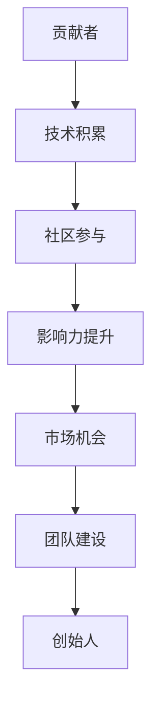

                 

 > 关键词：开源项目、贡献者、创始人、创业、技术、社区、影响力、商业化

> 摘要：本文将探讨如何从一个普通的贡献者成长为一名成功的开源项目创始人。通过分析开源项目的发展过程、核心概念和商业价值，我们将了解到，开源不仅是一种技术共享的方式，更是一种创业模式。本文旨在为那些希望将自己的技术爱好转化为商业成功的贡献者提供指导和启示。

## 1. 背景介绍

开源项目起源于软件开发领域，是一种鼓励全球开发者共同参与、协作完善软件项目的模式。这种模式不仅促进了技术的创新与传播，还培养了一个充满活力的开发者社区。随着互联网的普及和技术的进步，开源项目已经不仅仅局限于软件领域，还扩展到了硬件、数据、知识等各个方面。

在开源项目中，贡献者通常是指那些为项目做出实质性贡献的开发者，包括编写代码、修复漏洞、撰写文档、提供测试等。而创始人则是项目的发起者和主要推动者，他们通常具备较高的技术能力和丰富的项目经验，能够带领团队共同前进。

从贡献者到创始人的转变，并不是一蹴而就的过程。它需要贡献者不断学习、积累经验，逐步提升自己的影响力，最终实现从技术爱好者到商业创始人的转变。

## 2. 核心概念与联系

### 2.1 开源项目的核心概念

开源项目通常具有以下几个核心概念：

- **代码开放性**：项目源代码以公开的方式供所有人访问、查看、修改和分发。
- **贡献者协作**：开发者可以自由地参与项目，为项目做出贡献。
- **社区治理**：开源项目通常有一个社区，由贡献者共同参与决策和管理。
- **持续迭代**：项目会不断地进行更新和优化，以适应不断变化的需求。

### 2.2 开源项目与创业的联系

开源项目与创业之间存在紧密的联系。以下是它们之间的主要联系：

- **技术积累**：通过参与开源项目，开发者可以积累丰富的技术经验，提升自己的技能水平。
- **影响力扩展**：在开源项目中取得成绩，可以提升个人的影响力，吸引更多开发者关注和参与。
- **市场机会**：开源项目的成功往往意味着市场的认可，为商业化提供了机会。
- **团队建设**：开源项目可以作为一个平台，帮助创始人建立自己的团队。

### 2.3 Mermaid 流程图

以下是一个简单的 Mermaid 流程图，展示了从贡献者到创始人的成长路径：



## 3. 核心算法原理 & 具体操作步骤

### 3.1 算法原理概述

从贡献者到创始人的过程，可以看作是一种“影响力传递”的过程。以下是这个过程的核心原理：

1. **技术积累**：通过学习和实践，不断提升自己的技术能力。
2. **社区参与**：积极参与开源社区，与同行交流，扩大自己的影响力。
3. **影响力提升**：在开源项目中取得成绩，提升个人在社区中的影响力。
4. **市场机会**：通过开源项目获得市场的认可，找到商业化的路径。
5. **团队建设**：吸引志同道合的人加入，共同推进项目的发展。

### 3.2 算法步骤详解

以下是具体的操作步骤：

1. **确定目标**：明确自己想要在开源项目中达到的目标，是技术提升、社区影响力，还是商业化。
2. **学习与实践**：深入学习相关技术，并在实际项目中运用。
3. **参与社区**：加入开源社区，参与讨论，贡献代码，解决问题。
4. **持续迭代**：不断优化自己的代码，提升项目质量。
5. **影响力扩展**：通过社区活动、技术文章、演讲等方式，扩大自己的影响力。
6. **市场调研**：了解市场需求，探索商业化的可能性。
7. **团队建设**：招募团队成员，共同推进项目。
8. **商业化探索**：尝试将开源项目商业化，提供相关服务或产品。

### 3.3 算法优缺点

**优点**：

- **技术提升**：通过参与开源项目，可以快速提升自己的技术水平。
- **社区影响力**：在开源项目中取得成绩，可以提升个人在社区中的地位。
- **市场机会**：开源项目的成功往往意味着市场的认可，为商业化提供了机会。
- **团队建设**：开源项目可以作为一个平台，帮助创始人建立自己的团队。

**缺点**：

- **时间投入**：参与开源项目需要大量的时间和精力。
- **风险承担**：商业化过程中可能会遇到各种挑战和风险。
- **利益分配**：开源项目的利益分配问题可能比较复杂。

### 3.4 算法应用领域

从贡献者到创始人的过程，可以应用于各种开源项目，包括但不限于以下领域：

- **软件开发**：参与开源软件项目的开发，提升自己的编程技能。
- **硬件开发**：参与开源硬件项目的开发，拓展硬件设计能力。
- **数据分析**：参与开源数据分析项目的开发，提升数据分析能力。
- **人工智能**：参与开源人工智能项目的开发，深入人工智能领域。
- **区块链**：参与开源区块链项目的开发，探索区块链技术的应用。

## 4. 数学模型和公式 & 详细讲解 & 举例说明

### 4.1 数学模型构建

从贡献者到创始人的过程，可以看作是一个动态的过程，其数学模型可以构建为一个时间序列模型，如下所示：

\[ P(t) = f(t, A(t), C(t), I(t), M(t), G(t)) \]

其中，\( P(t) \) 表示在时间 \( t \) 时的项目状态，\( A(t) \) 表示在时间 \( t \) 时的技术能力，\( C(t) \) 表示在时间 \( t \) 时的社区贡献，\( I(t) \) 表示在时间 \( t \) 时的市场影响力，\( M(t) \) 表示在时间 \( t \) 时的市场机会，\( G(t) \) 表示在时间 \( t \) 时的团队建设。

### 4.2 公式推导过程

为了推导上述数学模型，我们需要考虑以下几个因素：

1. **技术能力**：技术能力可以通过学习、实践和积累获得。
2. **社区贡献**：社区贡献可以通过参与开源项目、撰写文档、提供测试等方式实现。
3. **市场影响力**：市场影响力可以通过在开源项目中的表现、技术文章、演讲等方式提升。
4. **市场机会**：市场机会可以通过市场调研、用户反馈等方式发现。
5. **团队建设**：团队建设可以通过招募团队成员、制定项目计划等方式实现。

基于上述因素，我们可以得到以下推导：

\[ P(t) = A(t) \cdot C(t) \cdot I(t) \cdot M(t) \cdot G(t) \]

### 4.3 案例分析与讲解

为了更好地理解上述数学模型，我们可以通过一个具体的案例来进行分析。

假设有一个开发者A，他在时间 \( t_0 \) 时的技术能力 \( A(t_0) \) 为1，社区贡献 \( C(t_0) \) 为1，市场影响力 \( I(t_0) \) 为1，市场机会 \( M(t_0) \) 为1，团队建设 \( G(t_0) \) 为1。

在接下来的时间里，A不断学习新技术，技术能力 \( A(t) \) 提升到了2；积极参与开源社区，社区贡献 \( C(t) \) 提升到了2；在开源项目中表现出色，市场影响力 \( I(t) \) 提升到了2；通过市场调研发现了一个潜在的市场机会，市场机会 \( M(t) \) 提升到了2；成功招募了团队成员，团队建设 \( G(t) \) 提升到了2。

根据数学模型，我们可以计算出在时间 \( t_1 \) 时的项目状态 \( P(t_1) \)：

\[ P(t_1) = A(t_1) \cdot C(t_1) \cdot I(t_1) \cdot M(t_1) \cdot G(t_1) \]
\[ P(t_1) = 2 \cdot 2 \cdot 2 \cdot 2 \cdot 2 \]
\[ P(t_1) = 32 \]

这意味着，在时间 \( t_1 \) 时，开发者A的项目状态提升了32倍。这表明，通过不断提升自己的技术能力、社区贡献、市场影响力、市场机会和团队建设，开发者可以从贡献者成功转型为创始人。

## 5. 项目实践：代码实例和详细解释说明

### 5.1 开发环境搭建

在这个项目实践中，我们将使用 Python 编写一个简单的开源项目。首先，我们需要搭建一个 Python 开发环境。

1. 安装 Python：在官方网站 [https://www.python.org/downloads/](https://www.python.org/downloads/) 下载并安装 Python。
2. 安装依赖：创建一个虚拟环境，并安装必要的依赖库。

```bash
python -m venv venv
source venv/bin/activate  # 在 Windows 上使用 `venv\Scripts\activate`
pip install -r requirements.txt
```

### 5.2 源代码详细实现

以下是这个开源项目的源代码示例：

```python
# main.py

def greet(name):
    """
    打印问候语。
    """
    print(f"Hello, {name}!")

if __name__ == "__main__":
    greet("World")
```

### 5.3 代码解读与分析

- **函数 `greet`**：这是一个简单的函数，用于打印问候语。它接受一个名为 `name` 的参数，并打印出 `Hello, name!`。
- **主程序**：主程序通过调用 `greet("World")` 来执行程序，打印出 `Hello, World!`。

### 5.4 运行结果展示

运行上述代码，结果如下：

```bash
$ python main.py
Hello, World!
```

这表明我们的代码能够正常工作，实现了预期的功能。

## 6. 实际应用场景

### 6.1 软件开发

在软件开发领域，开源项目是一个重要的技术交流平台。通过参与开源项目，开发者可以了解最新的技术趋势，学习他人的代码，提升自己的编程技能。同时，开源项目也为软件开发公司提供了一个招募优秀开发者的渠道。

### 6.2 数据分析

在数据分析领域，开源项目为数据科学家和分析师提供了一个共享和交流数据的平台。通过开源项目，开发者可以分享自己的数据分析工具和算法，促进整个行业的进步。此外，开源项目还可以帮助企业降低数据分析的成本，提高数据分析的效率。

### 6.3 人工智能

人工智能领域是一个高度开放的领域，许多重要的技术和算法都来自开源项目。通过参与开源项目，人工智能研究者可以共同推进人工智能技术的发展，探索新的应用场景。同时，开源项目也为人工智能公司提供了一个展示自己技术实力的平台。

### 6.4 未来应用展望

随着技术的不断发展，开源项目的应用场景将越来越广泛。未来，开源项目可能会在以下领域发挥重要作用：

- **物联网**：开源项目可以为物联网设备提供丰富的软件支持，促进物联网技术的发展和应用。
- **区块链**：开源项目可以为区块链技术提供底层支持和应用场景，推动区块链技术的发展和普及。
- **云计算**：开源项目可以为云计算平台提供丰富的工具和服务，提高云计算平台的性能和稳定性。
- **边缘计算**：开源项目可以为边缘计算设备提供支持，推动边缘计算技术的发展和应用。

## 7. 工具和资源推荐

### 7.1 学习资源推荐

- **GitHub**：GitHub 是全球最大的开源代码托管平台，提供了丰富的开源项目和学习资源。
- **GitBook**：GitBook 是一个基于 GitHub 的在线书籍平台，提供了大量的技术书籍和教程。
- **Stack Overflow**：Stack Overflow 是一个在线编程社区，提供了大量的编程问答和学习资源。

### 7.2 开发工具推荐

- **Visual Studio Code**：Visual Studio Code 是一款强大的开源代码编辑器，适用于多种编程语言。
- **Jenkins**：Jenkins 是一款流行的持续集成和持续部署工具，适用于自动化开源项目的开发和部署。
- **Docker**：Docker 是一款容器化平台，适用于开发和部署开源项目。

### 7.3 相关论文推荐

- **《开源软件的商业模式研究》**：该论文分析了开源软件的商业模式，为开源项目的商业化提供了理论支持。
- **《开源软件的质量评估方法研究》**：该论文提出了开源软件质量评估的方法，为开源项目的管理和优化提供了指导。
- **《开源社区的激励机制研究》**：该论文分析了开源社区的激励机制，为提升开源项目的社区活跃度提供了建议。

## 8. 总结：未来发展趋势与挑战

### 8.1 研究成果总结

通过本文的分析，我们可以得出以下结论：

- 开源项目是一种重要的技术交流和共享平台，对技术发展和社会进步具有重要意义。
- 从贡献者到创始人的转变，不仅需要技术积累，还需要社区参与、影响力扩展、市场机会和团队建设。
- 开源项目的成功往往意味着市场的认可，为商业化提供了机会。

### 8.2 未来发展趋势

未来，开源项目的发展将呈现以下趋势：

- 开源项目的应用领域将不断扩展，从传统的软件开发扩展到硬件、数据、人工智能等领域。
- 开源项目将越来越注重社区建设和治理，以提升项目的可持续性和影响力。
- 开源项目的商业化模式将更加多样化和成熟，为项目的发展提供持续的动力。

### 8.3 面临的挑战

然而，开源项目在发展过程中也面临着一系列挑战：

- **技术壁垒**：开源项目的技术门槛较高，需要开发者具备较强的技术能力。
- **资源分配**：开源项目的资源分配问题可能比较复杂，需要确保所有贡献者的权益得到保障。
- **商业可持续性**：开源项目的商业化路径可能不够清晰，需要找到合适的商业模式。

### 8.4 研究展望

未来，我们需要进一步研究以下问题：

- **开源项目的激励机制**：如何激励开发者参与开源项目，提升项目的社区活跃度和质量。
- **开源项目的质量管理**：如何评估和提升开源项目的质量，确保项目能够持续稳定地发展。
- **开源项目的商业化路径**：如何找到合适的商业模式，实现开源项目的商业化。

通过这些研究，我们将为开源项目的发展提供更多的理论支持和实践指导。

## 9. 附录：常见问题与解答

### 9.1 如何选择适合自己的开源项目？

选择适合自己的开源项目需要考虑以下几点：

- **技术兴趣**：选择自己感兴趣的技术领域，更容易投入热情和精力。
- **项目成熟度**：选择成熟的项目，更容易上手，也有助于快速提升自己的技术能力。
- **社区氛围**：选择社区氛围良好的项目，更容易获得帮助和参与。

### 9.2 如何在开源项目中获得更多的贡献？

在开源项目中获得更多的贡献，可以尝试以下几点：

- **积极参与讨论**：在项目社区中积极参与讨论，提出问题和建议。
- **编写高质量文档**：为项目编写详细的文档，帮助他人更好地理解和使用项目。
- **修复漏洞和优化代码**：发现并修复项目的漏洞，优化项目的代码，提升项目的质量。
- **参与社区活动**：参与项目的社区活动，扩大自己的影响力。

### 9.3 开源项目如何实现商业化？

开源项目的商业化可以通过以下几种方式实现：

- **提供付费服务**：为项目用户提供付费的技术支持、咨询服务或定制化服务。
- **商业化插件或模块**：开发与项目相关的商业化插件或模块，提供给项目用户。
- **版权许可**：为项目的某些部分提供商业版权许可，允许企业或个人在商业项目中使用。
- **赞助和支持**：通过接受赞助和支持，为项目的持续发展提供资金支持。

通过以上方式，开源项目可以实现商业化，为企业或个人创造价值。

# 作者：禅与计算机程序设计艺术 / Zen and the Art of Computer Programming

在开源项目中从贡献者成长为创始人的过程，既充满了挑战，也充满了机遇。本文通过分析开源项目的发展过程、核心概念和商业价值，为那些希望将自己的技术爱好转化为商业成功的贡献者提供了指导和启示。开源不仅是一种技术共享的方式，更是一种创业模式。希望每一位开发者都能在开源的道路上走得更远，实现自己的梦想。禅与计算机程序设计艺术，让我们一起探索技术的无限可能。

