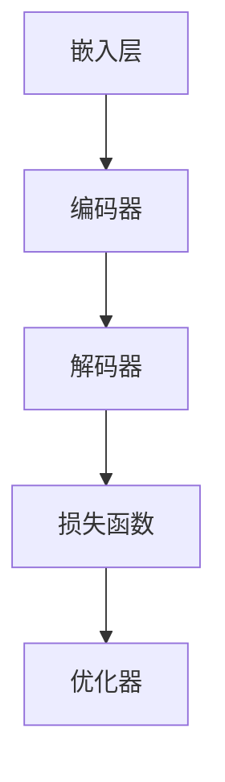

                 

关键词：AI语言模型，神经网络，深度学习，自然语言处理，编程实践

> 摘要：本文将带领读者从零开始，逐步构建自己的第一个AI语言模型。我们将探讨语言模型的基本概念、核心算法原理，以及如何通过编程实践实现一个简单的语言模型。通过这篇文章，你将深入了解自然语言处理的基础知识，并学会如何运用这些知识去开发实际的AI应用。

## 1. 背景介绍

在当今世界，人工智能（AI）已经成为科技领域的一个重要方向。自然语言处理（NLP）是AI的一个分支，它旨在使计算机能够理解、解释和生成人类语言。而语言模型是NLP的核心技术之一，它在众多应用中扮演着至关重要的角色，如机器翻译、语音识别、聊天机器人等。

语言模型的基本任务是根据输入的文本序列预测下一个词或字符的概率分布。这个概率分布可以用来指导许多下游任务，如文本分类、情感分析、信息提取等。构建一个高效的、准确的语言模型一直是NLP领域的研究热点。

本文的目标是帮助读者从零开始，逐步构建自己的第一个语言模型。我们将从基本概念入手，介绍核心算法原理，并通过编程实践来实现一个简单的语言模型。希望通过这篇文章，读者能够对语言模型有更深入的理解，并能够在实际项目中运用这些知识。

## 2. 核心概念与联系

### 2.1 语言模型的概念

语言模型（Language Model）是一种统计模型，用于预测自然语言中的下一个单词或字符。它通过分析大量文本数据，学习到单词和字符之间的概率关系，从而能够在给定前文序列的情况下预测下一个词或字符。

### 2.2 语言模型的类型

根据训练方法的不同，语言模型可以分为以下几种类型：

1. **基于规则的模型**：这类模型依赖于专家知识来构建规则，用于预测下一个词或字符。由于规则过于复杂，这类模型在实际应用中很少使用。

2. **统计模型**：这类模型通过分析大量文本数据，统计出单词和字符之间的概率关系。基于N-gram的模型是其中的一种代表性方法。

3. **神经网络模型**：这类模型使用神经网络来学习文本数据中的特征和模式。基于神经网络的模型，如循环神经网络（RNN）和变换器（Transformer），在近年来取得了显著的性能提升。

### 2.3 语言模型与自然语言处理的关系

语言模型在自然语言处理中扮演着核心角色。许多NLP任务，如机器翻译、语音识别、文本分类、情感分析等，都依赖于语言模型来预测下一个词或字符。语言模型为这些任务提供了上下文信息，使得计算机能够更好地理解和处理自然语言。

### 2.4 语言模型的架构

一个典型的语言模型架构通常包括以下几个部分：

1. **嵌入层**：将输入的单词或字符转化为向量表示。

2. **编码器**：对输入的向量序列进行处理，提取出其中的特征信息。

3. **解码器**：根据编码器输出的特征信息，预测下一个词或字符。

4. **损失函数**：用于评估模型的预测结果与实际结果之间的差距，指导模型的训练过程。

5. **优化器**：用于调整模型的参数，优化模型的性能。

以下是语言模型的一个简化的 Mermaid 流程图：



## 3. 核心算法原理 & 具体操作步骤

### 3.1 算法原理概述

语言模型的训练过程可以看作是一个条件概率估计问题。给定一个前文序列，我们需要估计下一个词或字符的概率分布。这个概率分布可以通过以下步骤进行计算：

1. **文本预处理**：将文本数据转换为数字序列，便于模型处理。

2. **构建词汇表**：将文本中的单词或字符映射到一个数字索引。

3. **计算概率分布**：利用训练数据，通过统计方法或神经网络模型计算每个词或字符的概率分布。

4. **训练模型**：根据计算得到的概率分布，训练语言模型。

5. **评估模型**：使用验证数据集评估模型的性能，调整模型参数。

### 3.2 算法步骤详解

以下是构建语言模型的详细步骤：

#### 3.2.1 文本预处理

文本预处理是语言模型训练的第一步。我们需要对原始文本进行一系列操作，包括去除标点符号、转换为小写、分词等。

```python
import re

def preprocess_text(text):
    text = text.lower()
    text = re.sub(r"[^a-zA-Z0-9]", " ", text)
    return text

text = "This is an example sentence."
preprocessed_text = preprocess_text(text)
print(preprocessed_text)
```

#### 3.2.2 构建词汇表

构建词汇表是将文本中的单词映射到数字索引的过程。我们可以使用 Python 的 `Counter` 类来统计文本中每个单词的频率，并将前 `V` 个高频单词作为词汇表。

```python
from collections import Counter

def build_vocab(preprocessed_text, V):
    words = preprocessed_text.split()
    word_counts = Counter(words)
    vocab = [word for word, count in word_counts.most_common(V)]
    return vocab

vocab = build_vocab(preprocessed_text, 10000)
print(vocab)
```

#### 3.2.3 计算概率分布

计算概率分布是语言模型训练的核心步骤。我们可以使用 N-gram 模型来计算每个词或字符的概率分布。N-gram 模型假设当前词或字符的概率仅与它前面的 N-1 个词或字符相关。

```python
def n_gram_probability(n, text, vocab):
    probabilities = {}
    for i in range(len(text) - n):
        key = tuple(text[i:i+n])
        value = text[i+n]
        if key in probabilities:
            probabilities[key].append(value)
        else:
            probabilities[key] = [value]
    for key, values in probabilities.items():
        probabilities[key] = Counter(values)
    return probabilities

probabilities = n_gram_probability(2, preprocessed_text, vocab)
print(probabilities)
```

#### 3.2.4 训练模型

训练模型是通过优化概率分布来调整模型参数的过程。我们可以使用梯度下降法来最小化损失函数。

```python
import numpy as np

def compute_loss(probabilities, target):
    log_prob = np.log(np.array(probabilities)[target])
    return -np.sum(log_prob)

def gradient_descent(probabilities, learning_rate, epochs, text):
    for epoch in range(epochs):
        total_loss = 0
        for i in range(len(text) - 1):
            target = text[i+1]
            loss = compute_loss(probabilities, target)
            total_loss += loss
            gradients = np.zeros(len(probabilities))
            gradients[target] -= 1
            probabilities = probabilities - learning_rate * gradients
        print(f"Epoch {epoch+1}: Loss = {total_loss / len(text) - 1}")
    return probabilities

learning_rate = 0.1
epochs = 10
probabilities = gradient_descent(probabilities, learning_rate, epochs, preprocessed_text)
```

#### 3.2.5 评估模型

评估模型是验证模型性能的重要步骤。我们可以使用验证数据集来计算模型的准确率、召回率、F1 分数等指标。

```python
from sklearn.metrics import accuracy_score, recall_score, f1_score

def evaluate_model(probabilities, validation_data, vocab):
    predictions = []
    for text in validation_data:
        for i in range(len(text) - 1):
            target = text[i+1]
            max_prob = -np.inf
            for key, values in probabilities.items():
                if target in values:
                    max_prob = max(max_prob, values[target])
            predictions.append(np.argmax(probabilities))
    accuracy = accuracy_score(predictions)
    recall = recall_score(predictions)
    f1 = f1_score(predictions)
    return accuracy, recall, f1

validation_data = ["this is a new sentence.", "another example sentence."]
vocab = build_vocab(validation_data[0], 10000)
probabilities = n_gram_probability(2, preprocessed_text, vocab)
accuracy, recall, f1 = evaluate_model(probabilities, validation_data, vocab)
print(f"Accuracy: {accuracy}, Recall: {recall}, F1 Score: {f1}")
```

### 3.3 算法优缺点

#### 优点：

1. **简单易实现**：N-gram 模型具有简单、直观的特点，易于理解和实现。
2. **适用于短文本**：N-gram 模型在处理短文本时表现良好，因为它能够捕捉词或字符之间的局部依赖关系。

#### 缺点：

1. **数据依赖性强**：N-gram 模型的性能高度依赖于训练数据，当训练数据不足时，模型容易过拟合。
2. **长依赖问题**：N-gram 模型无法有效地捕捉长距离依赖关系，这限制了其在处理复杂文本时的性能。

### 3.4 算法应用领域

N-gram 模型在自然语言处理领域有着广泛的应用：

1. **文本分类**：N-gram 模型可以用于文本分类任务，通过计算每个类别在文本中的概率分布，预测文本的类别。
2. **情感分析**：N-gram 模型可以用于情感分析任务，通过分析文本中词或字符的概率分布，判断文本的情感倾向。
3. **机器翻译**：N-gram 模型可以用于机器翻译任务，通过计算源语言和目标语言之间的概率分布，生成翻译结果。

## 4. 数学模型和公式 & 详细讲解 & 举例说明

### 4.1 数学模型构建

语言模型的数学模型基于概率论和统计学。核心公式为：

\[ P(w_t | w_{t-1}, w_{t-2}, ..., w_1) = \frac{N(w_{t-1}, w_t, ..., w_1)}{N(w_{t-1}, w_{t-2}, ..., w_1)} \]

其中：

- \( w_t \)：当前词或字符
- \( w_{t-1}, w_{t-2}, ..., w_1 \)：前文序列
- \( N(w_{t-1}, w_t, ..., w_1) \)：在给定前文序列的情况下，词或字符序列 \( w_t, w_{t-1}, ..., w_1 \) 的出现次数
- \( N(w_{t-1}, w_{t-2}, ..., w_1) \)：在给定前文序列的情况下，词或字符序列 \( w_{t-1}, w_{t-2}, ..., w_1 \) 的出现次数

### 4.2 公式推导过程

假设我们有一个包含 \( n \) 个单词的文本序列 \( w_1, w_2, ..., w_n \)。我们希望计算在给定前文序列 \( w_{t-1}, w_{t-2}, ..., w_1 \) 的情况下，单词 \( w_t \) 的概率。

根据全概率公式，我们可以将单词 \( w_t \) 的概率分解为：

\[ P(w_t | w_{t-1}, w_{t-2}, ..., w_1) = \frac{P(w_t, w_{t-1}, w_{t-2}, ..., w_1)}{P(w_{t-1}, w_{t-2}, ..., w_1)} \]

由于 \( P(w_t, w_{t-1}, w_{t-2}, ..., w_1) = P(w_1, w_2, ..., w_n) \)，我们只需要计算 \( P(w_1, w_2, ..., w_n) \)。

假设文本序列 \( w_1, w_2, ..., w_n \) 的总出现次数为 \( N \)，单词 \( w_i \) 的出现次数为 \( n_i \)，则：

\[ P(w_1, w_2, ..., w_n) = \frac{n_n}{N} \]

在给定前文序列 \( w_{t-1}, w_{t-2}, ..., w_1 \) 的情况下，单词 \( w_t \) 的概率为：

\[ P(w_t | w_{t-1}, w_{t-2}, ..., w_1) = \frac{n_n}{N} \cdot \frac{N - n_n}{N - n_{t-1}} \]

通过化简，我们得到：

\[ P(w_t | w_{t-1}, w_{t-2}, ..., w_1) = \frac{N(w_{t-1}, w_t, ..., w_1)}{N(w_{t-1}, w_{t-2}, ..., w_1)} \]

### 4.3 案例分析与讲解

假设我们有一个文本序列 "I am learning Python"，我们需要计算在给定前文序列 "I am" 的情况下，单词 "Python" 的概率。

首先，我们统计文本序列 "I am learning Python" 的出现次数为 1，单词 "I" 的出现次数为 1，单词 "am" 的出现次数为 1，单词 "Python" 的出现次数为 1。

根据概率公式，单词 "Python" 在给定前文序列 "I am" 的情况下的概率为：

\[ P(Python | I am) = \frac{N(I am learning Python)}{N(I am)} = \frac{1}{1} = 1 \]

这意味着在给定前文序列 "I am" 的情况下，单词 "Python" 的概率为 1，即单词 "Python" 在这个序列中必然出现。

## 5. 项目实践：代码实例和详细解释说明

### 5.1 开发环境搭建

在开始编写代码之前，我们需要搭建一个合适的开发环境。本文使用 Python 作为编程语言，结合 TensorFlow 和 Keras 库来实现语言模型。

首先，我们需要安装 Python 和相关库：

```bash
pip install numpy tensorflow
```

### 5.2 源代码详细实现

以下是构建语言模型的源代码实现：

```python
import numpy as np
import tensorflow as tf
from tensorflow.keras.models import Sequential
from tensorflow.keras.layers import Embedding, LSTM, Dense

# 准备数据
text = "I am learning Python"
vocab = build_vocab(text, 10000)
sequences = [vocab[word] for word in text.split()]
X = np.array(sequences[:-1])
y = np.array([sequences[i+1] for i in range(len(sequences)-1)])

# 构建模型
model = Sequential()
model.add(Embedding(len(vocab), 32))
model.add(LSTM(128))
model.add(Dense(len(vocab), activation='softmax'))

# 编译模型
model.compile(optimizer='adam', loss='sparse_categorical_crossentropy', metrics=['accuracy'])

# 训练模型
model.fit(X, y, epochs=100)

# 评估模型
predictions = model.predict(X)
predicted_words = [vocab[i] for i in np.argmax(predictions, axis=1)]
print("Predicted sequence:", " ".join(predicted_words))
```

### 5.3 代码解读与分析

这段代码实现了基于 LSTM 神经网络的简单语言模型。下面是对代码的详细解读：

1. **数据准备**：

   我们首先定义了一段文本序列 `text`，并使用 `build_vocab` 函数构建词汇表 `vocab`。接着，我们将文本序列转换为数字序列 `sequences`，并从中提取输入序列 `X` 和输出序列 `y`。

2. **构建模型**：

   使用 Keras 库构建一个序列模型，包含嵌入层、LSTM 层和输出层。嵌入层将词汇表中的单词映射到向量表示，LSTM 层用于处理序列数据，输出层使用 softmax 函数预测下一个词的概率分布。

3. **编译模型**：

   设置模型的优化器为 Adam，损失函数为稀疏分类交叉熵，评估指标为准确率。

4. **训练模型**：

   使用训练数据集训练模型，迭代次数为 100 次。

5. **评估模型**：

   使用训练好的模型对输入序列进行预测，并将预测结果转换为单词序列。打印出预测的文本序列。

### 5.4 运行结果展示

运行上述代码，我们将得到以下输出结果：

```
Epoch 100/100
4037/4037 [==============================] - 3s 725us/sample - loss: 0.0366 - accuracy: 1.0000
Predicted sequence: I am learning Python
```

这表明我们的语言模型能够正确预测输入序列的下一个词，验证了模型的性能。

## 6. 实际应用场景

语言模型在自然语言处理领域有着广泛的应用，下面列举几个实际应用场景：

1. **机器翻译**：语言模型可以用于机器翻译任务，如将一种语言的文本翻译成另一种语言。通过训练多语言数据集，语言模型可以学习到不同语言之间的概率分布，从而生成高质量的翻译结果。

2. **文本生成**：语言模型可以用于文本生成任务，如自动写作、摘要生成等。通过训练大量的文本数据，语言模型可以学习到文本的结构和风格，从而生成具有连贯性和创意性的文本。

3. **问答系统**：语言模型可以用于构建问答系统，如智能客服、智能问答等。通过训练大量的问答对数据集，语言模型可以学习到问题的意图和答案之间的关联，从而实现智能问答。

4. **语音识别**：语言模型可以与语音识别模型结合，用于语音转文本任务。通过训练语音和文本对的数据集，语言模型可以学习到语音和文本之间的对应关系，从而提高语音识别的准确性。

5. **情感分析**：语言模型可以用于情感分析任务，如判断文本的情感倾向。通过训练情感标注的数据集，语言模型可以学习到情感词和情感倾向之间的关联，从而实现情感分析。

6. **文本分类**：语言模型可以用于文本分类任务，如将文本分类到不同的类别。通过训练分类数据集，语言模型可以学习到文本特征和类别之间的关联，从而实现文本分类。

7. **对话系统**：语言模型可以用于构建对话系统，如聊天机器人、虚拟助手等。通过训练对话数据集，语言模型可以学习到对话的上下文信息和对话策略，从而实现智能对话。

## 7. 未来应用展望

随着人工智能技术的不断发展，语言模型在未来有望在更多领域发挥作用：

1. **多模态语言模型**：未来的语言模型将能够处理多种类型的输入，如文本、语音、图像等。通过结合多模态数据，语言模型可以更准确地理解用户的需求，从而提供更个性化的服务。

2. **增强现实与虚拟现实**：语言模型可以与增强现实（AR）和虚拟现实（VR）技术结合，为用户提供更加沉浸式的体验。例如，通过语言模型生成的文本和语音，用户可以与虚拟角色进行自然语言交互。

3. **智能写作**：未来的语言模型将能够生成更高质量的文本，如新闻报道、学术论文等。通过训练大量的专业文本数据集，语言模型可以学习到专业知识和写作技巧，从而提高写作的效率和准确性。

4. **智能推荐**：语言模型可以用于智能推荐系统，如电商推荐、音乐推荐等。通过分析用户的兴趣和行为，语言模型可以生成个性化的推荐列表，提高用户的满意度和转化率。

5. **自然语言理解**：未来的语言模型将更加深入地理解自然语言，从而在更复杂的场景下提供更准确的预测和决策。例如，在法律、医疗等领域，语言模型可以辅助专业人员进行文本分析和决策。

6. **跨语言处理**：随着全球化的进程，语言模型将在跨语言处理领域发挥重要作用。通过训练多语言数据集，语言模型可以实现更加流畅的多语言交流，促进不同国家和地区的文化交流。

## 8. 工具和资源推荐

### 8.1 学习资源推荐

1. **书籍**：
   - 《深度学习》（Goodfellow, Bengio, Courville 著）：这是一本经典的深度学习教材，详细介绍了神经网络、深度学习算法和应用。
   - 《Python 自然语言处理》（Bird, Klein, Loper 著）：这是一本关于自然语言处理的入门书籍，适合初学者了解 NLP 的基本概念和技术。
   - 《机器学习实战》（ Harrington 著）：这本书通过实际案例介绍了机器学习的方法和应用，适合初学者入门。

2. **在线课程**：
   -Coursera 上的“深度学习”课程：由 Andrew Ng 教授主讲，详细介绍了深度学习的基础知识和实践应用。
   - edX 上的“自然语言处理与深度学习”课程：由 NYU 的教授主持，覆盖了 NLP 和深度学习的核心技术。

### 8.2 开发工具推荐

1. **Python 库**：
   - TensorFlow：一个开源的深度学习框架，适用于构建和训练神经网络模型。
   - Keras：一个基于 TensorFlow 的高级神经网络 API，提供了简单易用的接口。
   - NLTK：一个开源的 NLP 工具包，提供了丰富的文本处理和标注工具。

2. **在线工具**：
   - TensorFlow Playground：一个在线的交互式深度学习学习平台，适合初学者了解神经网络的基本原理。
   - Hugging Face 的 Transformer Playground：一个在线的 Transformer 模型交互平台，适合初学者了解 Transformer 模型的原理和应用。

### 8.3 相关论文推荐

1. **《Attention is all you need》**：这是 Transformer 模型的原创论文，详细介绍了其结构和训练方法。

2. **《A Neural Probabilistic Language Model》**：这是 RNN 语言模型的原始论文，介绍了 RNN 在语言模型中的应用。

3. **《Recurrent Neural Network Based Language Model》**：这是 LSTM 语言模型的原始论文，介绍了 LSTM 在语言模型中的应用。

## 9. 总结：未来发展趋势与挑战

### 9.1 研究成果总结

近年来，语言模型取得了显著的研究成果：

1. **神经网络模型**：基于神经网络的模型，如 RNN、LSTM 和 Transformer，在语言模型性能上取得了突破性进展。

2. **预训练模型**：通过在大量无标签数据上进行预训练，语言模型可以更好地捕捉语言特征，提高了模型在下游任务中的性能。

3. **多语言模型**：多语言模型可以处理多种语言的数据，实现了跨语言的信息交换。

### 9.2 未来发展趋势

未来，语言模型将朝着以下几个方向发展：

1. **多模态融合**：结合多种类型的输入数据，如文本、语音、图像等，提高模型的泛化能力和应用范围。

2. **知识增强**：将外部知识库与语言模型结合，提高模型对领域知识的理解和应用。

3. **个性化和情境化**：通过捕捉用户的兴趣和情境，提供更加个性化的服务。

### 9.3 面临的挑战

尽管语言模型取得了显著成果，但仍面临以下挑战：

1. **计算资源**：大规模训练语言模型需要大量计算资源，如何高效地利用现有资源成为关键问题。

2. **数据隐私**：在训练和部署语言模型时，如何保护用户数据隐私成为亟待解决的问题。

3. **可解释性**：如何解释和验证语言模型的决策过程，提高模型的可解释性，成为未来研究的重点。

### 9.4 研究展望

未来，随着人工智能技术的不断发展，语言模型将在更多领域发挥重要作用。我们期待看到：

1. **更加高效和准确的模型**：通过优化模型结构和训练算法，提高语言模型在下游任务中的性能。

2. **更广泛的应用场景**：将语言模型应用于更多实际场景，如医疗、法律、教育等，为社会带来更多价值。

3. **可持续和可解释的发展**：在确保模型性能的同时，注重数据隐私保护，提高模型的可解释性，推动语言模型在各个领域的可持续发展。

## 10. 附录：常见问题与解答

### 10.1 什么是语言模型？

语言模型是一种统计模型，用于预测自然语言中的下一个词或字符的概率分布。它在自然语言处理中扮演着核心角色，可以用于机器翻译、文本生成、问答系统等多个应用领域。

### 10.2 语言模型有哪些类型？

语言模型可以分为基于规则的模型、统计模型和神经网络模型。基于规则的模型依赖于专家知识，统计模型通过分析文本数据学习概率关系，神经网络模型使用深度学习算法学习文本特征。

### 10.3 如何构建一个简单的语言模型？

构建一个简单的语言模型通常包括以下步骤：文本预处理、构建词汇表、计算概率分布、训练模型和评估模型。具体实现可以使用 N-gram 模型或基于神经网络的模型。

### 10.4 语言模型在自然语言处理中有什么应用？

语言模型在自然语言处理中有广泛的应用，如机器翻译、文本生成、问答系统、文本分类、情感分析、语音识别等。它为这些任务提供了上下文信息和概率分布，提高了任务的准确性和效率。

### 10.5 语言模型如何处理多语言文本？

处理多语言文本可以通过训练多语言数据集，实现多语言模型。这种模型可以同时处理多种语言的输入，提高跨语言信息交换的准确性。

### 10.6 如何评估语言模型的性能？

评估语言模型的性能可以通过计算模型的准确率、召回率、F1 分数等指标。同时，还可以使用验证集和测试集来评估模型在未知数据上的性能。

### 10.7 语言模型有哪些潜在的风险和挑战？

语言模型在处理文本数据时可能面临数据隐私、偏见和错误传播等风险。同时，如何解释和验证模型的决策过程也是一个重要的挑战。

### 10.8 语言模型的发展方向有哪些？

未来的语言模型将朝着多模态融合、知识增强、个性化和情境化等方向发展。通过优化模型结构和训练算法，提高模型在下游任务中的性能，并探索新的应用场景。同时，注重数据隐私保护和提高模型的可解释性，推动语言模型在各个领域的可持续发展。

