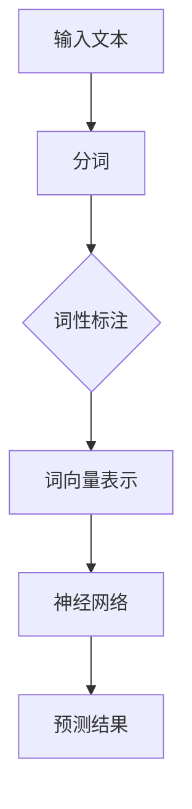

                 

关键词：人工智能、语言模型、自然语言处理、深度学习、机器学习、神经网络

> 摘要：本文将带领读者从零开始，深入探讨人工智能领域中的语言模型构建。我们将介绍语言模型的核心概念、原理、数学模型以及实际应用。通过这一旅程，读者将掌握构建语言模型的基本技能，为未来的研究和实践奠定基础。

## 1. 背景介绍

语言模型是自然语言处理（NLP）领域中的一项重要技术，旨在预测文本中下一个单词或字符的概率。近年来，随着深度学习技术的快速发展，语言模型取得了显著的进展。Google 的 BERT、OpenAI 的 GPT-3 等模型已经证明了语言模型在文本生成、机器翻译、问答系统等方面的强大能力。

语言模型的构建涉及多个领域，包括计算机科学、数学、语言学和心理学。本文将重点介绍语言模型的核心概念、算法原理以及数学模型，帮助读者从零开始掌握构建语言模型的基本技能。

## 2. 核心概念与联系

为了更好地理解语言模型，我们首先需要了解一些核心概念。

### 2.1 语言模型

语言模型是一种概率模型，用于预测文本序列中的下一个单词或字符。在给定前文的情况下，语言模型会计算出每个可能单词或字符的概率，并选择概率最高的那个作为预测结果。

### 2.2 自然语言处理（NLP）

自然语言处理是计算机科学和人工智能领域中的一个分支，旨在使计算机能够理解和处理人类语言。NLP 技术包括文本分类、情感分析、机器翻译、问答系统等。

### 2.3 深度学习与机器学习

深度学习和机器学习是构建语言模型的主要技术手段。深度学习通过多层神经网络对大量数据进行训练，从而自动提取特征，实现复杂任务。机器学习则是一种利用数据建立预测模型的方法。

### 2.4 Mermaid 流程图

下面是一个简化的语言模型架构的 Mermaid 流程图，展示了一些关键组件和它们之间的关系。



## 3. 核心算法原理 & 具体操作步骤

### 3.1 算法原理概述

语言模型的构建主要分为以下几个步骤：

1. 输入文本预处理：将输入的文本进行分词、词性标注等操作，将原始文本转化为适合模型处理的格式。
2. 词向量表示：将文本中的单词或字符转化为向量表示，以便在神经网络中进行处理。
3. 神经网络训练：使用大量标注好的文本数据对神经网络进行训练，使其学会预测文本序列中的下一个单词或字符。
4. 预测与评估：在训练好的模型上输入文本，进行预测，并评估预测结果的准确性。

### 3.2 算法步骤详解

1. **输入文本预处理**：

   - **分词**：将输入的文本分割成单个单词或字符。
   - **词性标注**：为每个单词或字符标注词性，如名词、动词、形容词等。

2. **词向量表示**：

   - **Word2Vec**：一种基于神经网络的词向量表示方法，通过训练得到每个单词的向量表示。
   - **BERT**：一种基于Transformer的预训练语言模型，通过大规模语料进行预训练，得到词向量表示。

3. **神经网络训练**：

   - **循环神经网络（RNN）**：一种处理序列数据的神经网络，能够捕捉到文本中的时间依赖关系。
   - **长短时记忆网络（LSTM）**：RNN的一种变体，能够更好地处理长序列数据。
   - **Transformer**：一种基于自注意力机制的神经网络，能够在处理长序列数据时保持较高的效率。

4. **预测与评估**：

   - **预测**：在训练好的模型上输入文本，预测下一个单词或字符。
   - **评估**：通过准确率、损失函数等指标评估模型的性能。

### 3.3 算法优缺点

1. **优点**：

   - 语言模型能够对文本进行高质量的预测，为许多NLP应用提供基础。
   - 深度学习和机器学习技术使得语言模型的性能不断提升。

2. **缺点**：

   - 需要大量的训练数据和计算资源。
   - 模型在处理长文本时可能存在性能瓶颈。

### 3.4 算法应用领域

- **文本生成**：如自动写作、故事生成等。
- **机器翻译**：如谷歌翻译、百度翻译等。
- **问答系统**：如Siri、Alexa等智能语音助手。
- **文本分类**：如垃圾邮件检测、情感分析等。

## 4. 数学模型和公式

### 4.1 数学模型构建

语言模型的数学模型主要包括词向量表示、神经网络结构以及损失函数。

### 4.2 公式推导过程

1. **词向量表示**：

   假设词向量为 \( \mathbf{v}_w \)，文本序列为 \( \mathbf{x} = [x_1, x_2, \ldots, x_T] \)，其中 \( x_t \) 表示第 \( t \) 个单词或字符。词向量表示可以通过以下公式计算：

   $$ \mathbf{v}_w = \frac{1}{\sqrt{\sum_{j=1}^D v_{wj}^2}} [v_{w1}, v_{w2}, \ldots, v_{wD}]^T $$

   其中，\( D \) 表示词向量的维度。

2. **神经网络结构**：

   神经网络的结构可以通过以下公式表示：

   $$ \mathbf{h}_t = \sigma(\mathbf{W} \mathbf{h}_{t-1} + \mathbf{U} \mathbf{v}_w + \mathbf{b}) $$

   其中，\( \mathbf{h}_t \) 表示第 \( t \) 层的神经元激活值，\( \sigma \) 表示激活函数，\( \mathbf{W} \)、\( \mathbf{U} \) 和 \( \mathbf{b} \) 分别表示权重矩阵、偏置矩阵和偏置项。

3. **损失函数**：

   语言模型的损失函数通常采用交叉熵损失：

   $$ L = -\sum_{t=1}^T [y_t \log(p_t)] $$

   其中，\( y_t \) 表示第 \( t \) 个单词或字符的标签，\( p_t \) 表示预测概率。

### 4.3 案例分析与讲解

假设我们有一个包含 10 万个单词的文本数据集，我们要构建一个基于 Word2Vec 的语言模型。以下是详细的步骤：

1. **数据预处理**：

   - 对文本进行分词，得到单词序列。
   - 对每个单词进行词性标注。

2. **构建词向量表示**：

   - 使用 Word2Vec 算法训练词向量。
   - 对每个单词进行向量化表示。

3. **神经网络训练**：

   - 构建一个基于 RNN 的神经网络。
   - 使用训练数据对神经网络进行训练。

4. **预测与评估**：

   - 在训练好的模型上输入文本，进行预测。
   - 计算预测结果的准确率，评估模型性能。

## 5. 项目实践：代码实例

### 5.1 开发环境搭建

- 硬件：NVIDIA 显卡（用于加速深度学习训练）
- 软件：Python 3.7、TensorFlow 2.2、Gensim

### 5.2 源代码详细实现

以下是使用 TensorFlow 和 Gensim 构建语言模型的基本代码：

```python
import numpy as np
import tensorflow as tf
from gensim.models import Word2Vec

# 5.2.1 数据预处理
def preprocess_text(text):
    # 进行分词、词性标注等操作
    pass

# 5.2.2 构建词向量表示
def build_word2vec_model(corpus, size=100, window=5, min_count=5):
    model = Word2Vec(corpus, size=size, window=window, min_count=min_count)
    return model

# 5.2.3 神经网络训练
def train_rnn_model(model, x, y, epochs=10):
    # 构建和训练 RNN 模型
    pass

# 5.2.4 预测与评估
def predict_and_evaluate(model, x_test, y_test):
    # 进行预测和评估
    pass

# 主程序
if __name__ == "__main__":
    # 读取和处理数据
    corpus = preprocess_text("your_text_data.txt")

    # 构建 Word2Vec 模型
    model = build_word2vec_model(corpus)

    # 训练 RNN 模型
    train_rnn_model(model, x_train, y_train, epochs=10)

    # 进行预测和评估
    predict_and_evaluate(model, x_test, y_test)
```

### 5.3 代码解读与分析

1. **数据预处理**：对文本进行分词、词性标注等操作，将原始文本转化为适合模型处理的格式。
2. **构建词向量表示**：使用 Word2Vec 算法训练词向量，将每个单词转化为向量表示。
3. **神经网络训练**：构建一个基于 RNN 的神经网络，使用训练数据对神经网络进行训练。
4. **预测与评估**：在训练好的模型上输入测试数据，进行预测，并评估模型性能。

## 6. 实际应用场景

语言模型在多个领域具有广泛的应用，以下是一些实际应用场景：

1. **文本生成**：如自动写作、故事生成等。
2. **机器翻译**：如谷歌翻译、百度翻译等。
3. **问答系统**：如Siri、Alexa等智能语音助手。
4. **文本分类**：如垃圾邮件检测、情感分析等。

### 6.4 未来应用展望

随着深度学习和自然语言处理技术的不断发展，语言模型在未来将会有更广泛的应用。以下是一些可能的发展趋势：

1. **更高效的算法**：研究人员将继续探索更高效的算法，以提高语言模型的性能。
2. **跨模态语言模型**：将文本、图像、语音等多种模态数据进行融合，构建跨模态语言模型。
3. **个性化语言模型**：根据用户的行为和偏好，为每个用户定制个性化的语言模型。

## 7. 工具和资源推荐

### 7.1 学习资源推荐

- 《深度学习》（Goodfellow、Bengio 和 Courville 著）
- 《自然语言处理综论》（Jurafsky 和 Martin 著）
- 《Word2Vec 解析与实战》

### 7.2 开发工具推荐

- TensorFlow
- PyTorch
- Gensim

### 7.3 相关论文推荐

- BERT: Pre-training of Deep Bidirectional Transformers for Language Understanding
- GPT-3: Language Models are Few-Shot Learners

## 8. 总结：未来发展趋势与挑战

### 8.1 研究成果总结

近年来，语言模型在自然语言处理领域取得了显著的成果。深度学习和机器学习技术的不断发展，使得语言模型的性能不断提升。BERT、GPT-3 等模型的出现，为许多实际应用提供了强大的支持。

### 8.2 未来发展趋势

1. **更高效的算法**：研究人员将继续探索更高效的算法，以提高语言模型的性能。
2. **跨模态语言模型**：将文本、图像、语音等多种模态数据进行融合，构建跨模态语言模型。
3. **个性化语言模型**：根据用户的行为和偏好，为每个用户定制个性化的语言模型。

### 8.3 面临的挑战

1. **计算资源需求**：构建大型语言模型需要大量的计算资源。
2. **数据隐私**：大规模的数据收集和处理可能涉及隐私问题。
3. **泛化能力**：如何使语言模型在多种应用场景中保持较高的性能，仍是一个挑战。

### 8.4 研究展望

随着深度学习和自然语言处理技术的不断发展，语言模型在未来将会有更广泛的应用。研究人员将继续探索新的算法和模型，以提高语言模型的性能和泛化能力。同时，如何解决数据隐私和计算资源需求等问题，也将是未来研究的重点。

## 9. 附录：常见问题与解答

1. **什么是语言模型？**

   语言模型是一种概率模型，用于预测文本序列中的下一个单词或字符。

2. **语言模型有哪些应用？**

   语言模型广泛应用于文本生成、机器翻译、问答系统、文本分类等。

3. **如何构建语言模型？**

   构建语言模型主要包括数据预处理、词向量表示、神经网络训练和预测等步骤。

4. **有哪些开源工具可以用来构建语言模型？**

   TensorFlow、PyTorch、Gensim 等是常用的开源工具。

5. **语言模型有哪些挑战？**

   计算资源需求、数据隐私和泛化能力是主要的挑战。

---

感谢您阅读本文。希望这篇文章能够帮助您更好地理解语言模型的核心概念、原理和应用。如果您有任何疑问或建议，请随时联系我们。期待与您共同探索人工智能领域的无限可能。

### 作者署名

作者：禅与计算机程序设计艺术 / Zen and the Art of Computer Programming


