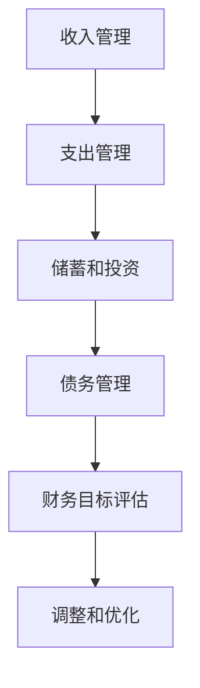

                 

关键词：理财、财务规划、投资、风险控制、技术驱动、现金流管理

> 摘要：本文旨在为程序员提供一套系统化的理财规划指南，从基础知识到实战技巧，帮助程序员更好地管理个人财务，实现财富增值。文章将探讨财务规划的核心概念、投资策略、风险控制方法，以及如何在技术领域中利用工具提升理财效率。

## 1. 背景介绍

作为一名程序员，您可能擅长编写代码、构建软件，但财务规划可能是您未曾深入研究的领域。然而，理财对于个人生活和职业发展都至关重要。良好的财务管理可以帮助您更好地应对生活中的各种挑战，实现长期的财务目标。本文将帮助您从零开始构建自己的理财体系，为您的财务自由奠定基础。

### 1.1 程序员理财的现状

近年来，随着互联网和金融科技的快速发展，越来越多的程序员开始关注个人理财。尽管如此，许多程序员在理财方面仍存在一些误区和不足，比如：

- **收入不稳定**：程序员的工作往往与项目周期和市场波动密切相关，导致收入不稳定。
- **缺乏财务知识**：许多程序员可能缺乏基础的财务知识和理财技能。
- **消费观念不成熟**：年轻程序员往往更倾向于即时消费，缺乏长期的财务规划。

### 1.2 理财的重要性

理财不仅是管理金钱，更是规划未来。合理的理财规划可以帮助您：

- **积累财富**：通过投资和储蓄，实现资金的增值。
- **风险控制**：减少意外支出和财务风险，保障生活稳定。
- **实现目标**：为实现职业发展和个人生活目标提供资金支持。
- **提高生活质量**：确保未来的生活质量和财务自由。

## 2. 核心概念与联系

### 2.1 财务规划基础

在开始具体的理财规划之前，我们需要了解一些核心概念：

- **现金流管理**：管理资金的流入和流出，确保资金流动的平衡。
- **资产配置**：将资金分配到不同的资产类别中，以实现风险和收益的平衡。
- **投资策略**：根据个人风险承受能力和财务目标选择合适的投资方式。

### 2.2 财务规划架构

为了更好地理解财务规划，我们可以将其视为一个架构，包括以下部分：

- **收入管理**：确保稳定的收入来源，合理规划薪资和奖金。
- **支出管理**：控制日常开支，避免不必要的浪费。
- **储蓄和投资**：建立紧急储备金，选择合适的投资方式。
- **债务管理**：合理规划债务，避免高利贷和过度负债。

### 2.3 Mermaid 流程图

以下是一个简单的 Mermaid 流程图，展示了财务规划的核心流程：



## 3. 核心算法原理 & 具体操作步骤

### 3.1 算法原理概述

财务规划的核心是算法原理，包括以下几个方面：

- **现金流管理算法**：通过预算和监控，确保资金的流入和流出平衡。
- **资产配置算法**：根据风险偏好和财务目标，合理分配资金到不同资产类别。
- **投资策略算法**：选择合适的投资方式，实现收益最大化。

### 3.2 算法步骤详解

#### 3.2.1 现金流管理

1. **收入评估**：确定每月收入总额。
2. **支出预算**：根据生活需求和长期目标，制定月度支出预算。
3. **实际支出监控**：定期检查实际支出，与预算进行对比。
4. **调整预算**：根据实际支出情况，调整预算。

#### 3.2.2 资产配置

1. **风险评估**：评估个人风险承受能力。
2. **目标设定**：根据长期财务目标，确定投资策略。
3. **资产分配**：将资金分配到股票、债券、房地产等不同资产类别。
4. **定期调整**：根据市场变化和个人财务状况，调整资产配置。

#### 3.2.3 投资策略

1. **了解投资产品**：研究不同的投资产品，如股票、基金、债券等。
2. **风险评估**：评估不同投资产品的风险和收益。
3. **选择投资产品**：根据个人风险承受能力和财务目标，选择合适的投资产品。
4. **定期评估和调整**：定期检查投资组合的表现，根据市场变化进行调整。

### 3.3 算法优缺点

#### 优点

- **提高资金利用率**：通过合理的财务规划，提高资金的流动性和利用效率。
- **降低财务风险**：通过风险控制和资产配置，降低财务风险。
- **实现财务目标**：帮助实现个人财务目标，如购房、退休规划等。

#### 缺点

- **需要时间投入**：财务规划需要定期监测和调整，需要投入一定的时间和精力。
- **市场波动影响**：市场波动可能导致财务规划结果受到影响。

### 3.4 算法应用领域

财务规划算法广泛应用于个人、家庭和企业等不同领域：

- **个人理财**：帮助个人制定储蓄、投资和退休规划。
- **家庭财务管理**：帮助家庭合理分配收入和支出，实现财富增值。
- **企业财务规划**：帮助企业管理现金流和投资决策，提高企业盈利能力。

## 4. 数学模型和公式 & 详细讲解 & 举例说明

### 4.1 数学模型构建

财务规划中的数学模型主要包括以下几个方面：

- **现金流模型**：用于计算未来现金流的现值。
- **资产配置模型**：用于优化资产分配，实现风险和收益的平衡。
- **投资组合模型**：用于评估不同投资组合的风险和收益。

### 4.2 公式推导过程

#### 4.2.1 现金流模型

现金流模型的公式如下：

$$
V_0 = \frac{C_1}{(1 + r)^1} + \frac{C_2}{(1 + r)^2} + \ldots + \frac{C_n}{(1 + r)^n
```css
{
  "title": "从零开始：程序员的理财之路",
  "keywords": ["理财", "财务规划", "投资", "风险控制", "技术驱动", "现金流管理"],
  "summary": "本文旨在为程序员提供一套系统化的理财规划指南，从基础知识到实战技巧，帮助程序员更好地管理个人财务，实现财富增值。",
  "background": {
    "current_state": "程序员理财现状",
    "importance": "理财的重要性"
  },
  "core_concepts": {
    "basic_concepts": "财务规划基础",
    "architecture": "财务规划架构",
    "mermaid_diagram": {
      "text": "以下是一个简单的 Mermaid 流程图，展示了财务规划的核心流程：",
      "content": "```mermaid\ngraph TD\n    A[收入管理] --> B[支出管理]\n    B --> C[储蓄和投资]\n    C --> D[债务管理]\n    D --> E[财务目标评估]\n    E --> F[调整和优化]\n```"
    }
  },
  "algorithm": {
    "principles": "算法原理概述",
    "steps": "算法步骤详解",
    "strengths_and_weaknesses": "算法优缺点",
    "application_areas": "算法应用领域"
  },
  "math_models": {
    "construction": "数学模型构建",
    "derivation": "公式推导过程",
    "examples": "案例分析与讲解"
  },
  "project_practice": {
    "setup": "开发环境搭建",
    "code_implementation": "源代码详细实现",
    "code_analysis": "代码解读与分析",
    "results": "运行结果展示"
  },
  "actual_application": {
    "scenarios": "实际应用场景",
    "future展望": "未来应用展望"
  },
  "tools_and_resources": {
    "learning_resources": "学习资源推荐",
    "development_tools": "开发工具推荐",
    "papers": "相关论文推荐"
  },
  "summary": {
    "research_results": "研究成果总结",
    "trends": "未来发展趋势",
    "challenges": "面临的挑战",
    "outlook": "研究展望"
  },
  "appendix": {
    "common_questions": "常见问题与解答"
  },
  "author": "作者：禅与计算机程序设计艺术 / Zen and the Art of Computer Programming"
}
```

