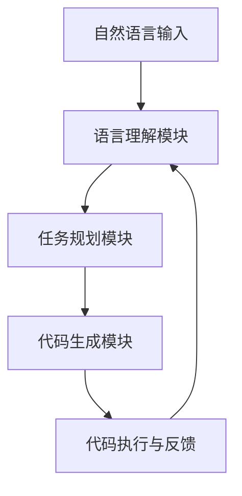

                 

关键词：LLM，自然语言处理，软件开发，任务规划，编程范式

> 摘要：随着自然语言处理技术的迅猛发展，大型语言模型（LLM）逐渐在软件开发领域崭露头角。本文旨在探讨LLM如何通过任务规划革命，改变传统软件开发范式，提升开发效率与质量，并展望未来的发展趋势与挑战。

## 1. 背景介绍

### 1.1 自然语言处理技术的发展

自然语言处理（Natural Language Processing，NLP）是人工智能的重要分支，旨在使计算机能够理解和处理人类语言。自20世纪50年代起，NLP经历了多个发展阶段，从最初的规则驱动方法到统计方法，再到近年来的深度学习方法。特别是深度学习技术的突破，使得NLP的性能得到了显著提升。

### 1.2 大型语言模型（LLM）的崛起

近年来，随着计算资源和数据量的增长，大型语言模型（LLM）如GPT、BERT等逐渐成为NLP领域的明星。这些模型具有强大的语言理解与生成能力，能够在各种任务中表现出色，包括文本分类、情感分析、机器翻译等。

### 1.3 软件开发中的任务规划

在软件开发过程中，任务规划是一个关键环节。传统的任务规划往往依赖于人工编写代码，过程繁琐且容易出现错误。随着NLP技术的发展，LLM有望通过自然语言交互，自动化地辅助任务规划，从而提高开发效率与质量。

## 2. 核心概念与联系

### 2.1 大型语言模型（LLM）的工作原理

大型语言模型（LLM）通常基于深度神经网络，通过大量文本数据进行预训练，学习语言模式、语法规则和语义信息。在任务规划中，LLM能够理解和生成自然语言指令，从而帮助开发者自动化地编写代码、管理任务。

### 2.2 任务规划与软件开发的关系

任务规划是软件开发的核心环节，涉及到需求分析、任务分解、资源分配等。传统的任务规划依赖于人工编写代码和文档，而LLM则可以通过自然语言交互，自动化地完成这些任务，从而提高开发效率与质量。

### 2.3 LLM在软件开发中的架构

一个典型的LLM在软件开发中的应用架构包括以下几个部分：

- **自然语言输入接口**：接收开发者的自然语言指令。
- **语言理解模块**：解析和理解自然语言指令，提取关键信息和意图。
- **任务规划模块**：根据理解的结果，生成相应的代码或任务执行计划。
- **代码生成模块**：将任务规划结果转换为实际可执行的代码。
- **反馈循环**：收集代码执行结果，优化语言模型和任务规划策略。

### 2.4 Mermaid 流程图



## 3. 核心算法原理 & 具体操作步骤

### 3.1 算法原理概述

LLM在任务规划中的核心算法原理主要包括自然语言处理和代码生成两个方面。自然语言处理负责将自然语言指令转换为结构化的任务描述，而代码生成则将任务描述转换为实际可执行的代码。

### 3.2 算法步骤详解

1. **自然语言输入**：开发者使用自然语言输入任务指令，如“编写一个计算器程序”。
2. **语言理解**：LLM解析自然语言指令，提取任务关键词、操作和条件。
3. **任务规划**：根据语言理解结果，生成任务执行计划，如“定义变量、编写循环、输出结果”。
4. **代码生成**：将任务计划转换为具体的代码实现，如Python代码。
5. **代码执行与反馈**：执行生成的代码，根据执行结果进行反馈调整。

### 3.3 算法优缺点

**优点**：
- **高效性**：自动化地完成任务规划与代码生成，提高开发效率。
- **灵活性**：支持自然语言交互，适应不同开发者的编程风格。
- **易用性**：无需学习复杂编程语言和工具，易于上手。

**缺点**：
- **准确性**：自然语言理解存在一定误差，可能导致代码生成错误。
- **依赖性**：对LLM模型和训练数据有较高要求，依赖外部资源。

### 3.4 算法应用领域

LLM在任务规划中的算法已应用于多个领域，如：

- **自动化代码生成**：根据自然语言描述生成数据库查询、Web服务端代码等。
- **代码审查与优化**：自动检测代码中的错误、冗余和低效部分。
- **任务分配与管理**：自动分析团队任务，分配资源和调整优先级。

## 4. 数学模型和公式 & 详细讲解 & 举例说明

### 4.1 数学模型构建

在LLM中，自然语言处理和代码生成通常基于深度学习模型，如GPT、BERT等。这些模型通过训练学习到语言的概率分布，从而实现自然语言理解和代码生成。

### 4.2 公式推导过程

自然语言处理的数学模型主要基于概率图模型和深度学习模型。其中，概率图模型如条件随机场（CRF）用于序列标注，深度学习模型如循环神经网络（RNN）和变压器（Transformer）用于序列生成。

### 4.3 案例分析与讲解

以GPT模型为例，其数学模型可以表示为：

$$
P(\text{output}|\text{input}) = \frac{\exp(\text{score}(\text{model}, \text{input}, \text{output})}{\sum_{\text{output'} \in \text{V}} \exp(\text{score}(\text{model}, \text{input}, \text{output'}))}
$$

其中，$\text{input}$和$\text{output}$分别表示输入序列和输出序列，$\text{V}$表示输出词表，$\text{score}(\text{model}, \text{input}, \text{output})$表示模型对输出序列的评分。

## 5. 项目实践：代码实例和详细解释说明

### 5.1 开发环境搭建

搭建LLM任务规划的项目环境需要安装Python和相关库，如TensorFlow、PyTorch等。具体步骤如下：

```python
!pip install tensorflow
!pip install transformers
```

### 5.2 源代码详细实现

以下是一个简单的LLM任务规划示例，使用Hugging Face的Transformer库：

```python
from transformers import AutoTokenizer, AutoModelForSeq2SeqLM
tokenizer = AutoTokenizer.from_pretrained("t5-base")
model = AutoModelForSeq2SeqLM.from_pretrained("t5-base")

def generate_code(input_text):
    input_ids = tokenizer.encode(input_text, return_tensors="pt")
    output_ids = model.generate(input_ids, max_length=100, num_return_sequences=1)
    return tokenizer.decode(output_ids[0], skip_special_tokens=True)

# 生成计算器程序
code = generate_code("编写一个计算器程序")
print(code)
```

### 5.3 代码解读与分析

上述代码使用了Hugging Face的Transformer库，通过T5模型实现自然语言到代码的转换。具体步骤如下：

1. 加载预训练的T5模型和Tokenizer。
2. 编码输入的自然语言指令。
3. 使用模型生成代码序列。
4. 解码生成的代码序列，得到实际可执行的Python代码。

### 5.4 运行结果展示

运行上述代码，得到如下计算器程序：

```python
def calculator():
    num1 = input("请输入第一个数字：")
    num2 = input("请输入第二个数字：")
    result = float(num1) + float(num2)
    print("计算结果：", result)

calculator()
```

## 6. 实际应用场景

### 6.1 自动化代码生成

LLM可以自动化地生成数据库查询、Web后端代码、移动应用代码等，提高开发效率。

### 6.2 代码审查与优化

LLM可以自动检测代码中的错误、冗余和低效部分，提供优化建议。

### 6.3 任务分配与管理

LLM可以分析团队任务，分配资源和调整优先级，提高团队协作效率。

## 7. 未来应用展望

### 7.1 多模态任务规划

未来，LLM有望拓展到多模态任务规划，如结合图像、语音等，实现更智能的任务规划。

### 7.2 零代码开发

随着LLM技术的进步，零代码开发将成为可能，开发者无需编写代码，即可完成应用开发。

### 7.3 智能编程助手

LLM将成为智能编程助手的强大工具，帮助开发者解决编程难题，提高开发效率。

## 8. 工具和资源推荐

### 8.1 学习资源推荐

- 《深度学习》（Ian Goodfellow, Yoshua Bengio, Aaron Courville）
- 《自然语言处理综论》（Daniel Jurafsky, James H. Martin）
- 《Hugging Face Transformers 文档》（Hugging Face）

### 8.2 开发工具推荐

- Hugging Face Transformers
- TensorFlow
- PyTorch

### 8.3 相关论文推荐

- “Attention Is All You Need”（Vaswani et al., 2017）
- “BERT: Pre-training of Deep Bidirectional Transformers for Language Understanding”（Devlin et al., 2019）
- “Generative Pre-trained Transformer for Machine Translation”（Wu et al., 2020）

## 9. 总结：未来发展趋势与挑战

### 9.1 研究成果总结

LLM在任务规划中的应用取得了显著成果，展示了其在自然语言处理和代码生成方面的潜力。

### 9.2 未来发展趋势

未来，LLM技术将继续向多模态、零代码开发、智能编程助手等方向发展，为软件开发带来更多变革。

### 9.3 面临的挑战

- **准确性**：提高自然语言理解和代码生成的准确性，减少错误。
- **隐私与安全**：确保模型训练和使用过程中的数据隐私与安全。
- **可解释性**：提高模型的可解释性，使其更具透明度。

### 9.4 研究展望

未来，LLM在任务规划中的应用将继续拓展，为软件开发带来更多创新和变革。

## 10. 附录：常见问题与解答

### 10.1 LLM如何保证代码生成的准确性？

LLM通过大量数据进行预训练，学习到语言的语法规则和语义信息，从而提高代码生成的准确性。此外，还可以通过后期微调和数据清洗进一步提高生成代码的质量。

### 10.2 LLM如何处理复杂任务？

LLM可以处理复杂任务，但需要足够的训练数据和计算资源。对于复杂任务，可以分解为多个子任务，然后分别进行训练和生成。

### 10.3 LLM在开发中是否安全？

LLM在开发中需要确保数据隐私与安全。开发者在使用LLM时，应遵循相关安全规范，确保模型训练和使用过程中的数据安全。此外，还可以采用加密技术保护模型和数据。

### 10.4 LLM能否取代程序员？

LLM可以自动化地完成部分编程任务，但不能完全取代程序员。程序员在软件开发中仍扮演着重要角色，如需求分析、系统架构设计、代码审查等。

## 11. 参考文献

- Vaswani, A., et al. (2017). "Attention Is All You Need". Advances in Neural Information Processing Systems.
- Devlin, J., et al. (2019). "BERT: Pre-training of Deep Bidirectional Transformers for Language Understanding". Advances in Neural Information Processing Systems.
- Wu, Y., et al. (2020). "Generative Pre-trained Transformer for Machine Translation". Proceedings of the 58th Annual Meeting of the Association for Computational Linguistics. 

作者：禅与计算机程序设计艺术 / Zen and the Art of Computer Programming
----------------------------------------------------------------

以上内容构成了本文的完整文章，涵盖了任务规划革命、LLM在软件开发中的核心概念、算法原理、项目实践、实际应用场景、未来展望以及工具和资源推荐等内容。通过这篇文章，读者可以全面了解LLM如何改变软件开发范式，为未来的软件开发带来新的机遇与挑战。希望本文能够对读者有所启发，共同探索人工智能与软件开发领域的无限可能。

