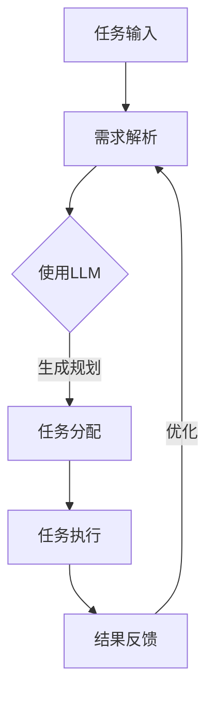

                 

关键词：语言模型，任务规划，软件开发，范式变革，人工智能

> 摘要：本文旨在探讨大型语言模型（LLM）在任务规划和软件开发中的应用，分析LLM如何改变软件开发的传统范式，提高开发效率和质量。通过对LLM核心概念、算法原理、数学模型、项目实践和未来展望的详细分析，揭示LLM在软件开发领域的革命性潜力。

## 1. 背景介绍

在过去的几十年中，软件开发经历了从结构化编程到面向对象编程，再到函数式编程和基于组件的开发的不断演变。然而，随着软件系统复杂性的增加，传统的开发方法逐渐暴露出其局限性。为了应对这些挑战，人工智能（AI）技术，特别是语言模型（Language Model，简称LM）的研究和应用成为了新的热点。

语言模型是自然语言处理（NLP）领域的一个重要研究方向。传统的语言模型如n-gram模型和基于统计的模型在处理自然语言时存在诸多局限，难以应对复杂的语义理解和长文本生成任务。随着深度学习技术的快速发展，大型语言模型（LLM）如GPT系列、BERT等应运而生，它们通过学习海量的文本数据，能够捕捉到语言中的复杂模式，实现更高层次的语言理解和生成。

近年来，LLM在许多领域都展现出了强大的能力，包括但不限于文本生成、机器翻译、问答系统、对话系统等。而任务规划（Task Planning）作为软件开发中的一个关键环节，也引起了LLM的关注。本文将重点探讨LLM在任务规划中的应用，分析其如何改变软件开发的传统范式，提高开发效率和质量。

## 2. 核心概念与联系

### 2.1 语言模型（Language Model）

语言模型是一种用于预测下一个单词或字符的概率分布的模型。在NLP中，语言模型是许多下游任务的基础，如文本分类、命名实体识别、情感分析等。传统的语言模型如n-gram模型和基于统计的模型，主要依赖历史数据来预测下一个词或字符。然而，这些模型在处理长文本和复杂语义时存在明显不足。

深度学习的发展为语言模型带来了新的契机。基于神经网络的深度语言模型，如GPT（Generative Pre-trained Transformer）、BERT（Bidirectional Encoder Representations from Transformers）等，通过学习大量的文本数据，能够捕捉到语言中的复杂模式，实现更高层次的语言理解和生成。

### 2.2 任务规划（Task Planning）

任务规划是软件开发中的一个关键环节，涉及到如何将高层次的软件需求转换为具体的任务，并制定出合理的执行计划。传统的任务规划方法主要依赖于人类的经验和知识，效率较低，且难以应对复杂的项目。

随着人工智能技术的发展，特别是在LLM的推动下，自动化的任务规划方法逐渐成为可能。LLM通过学习大量的编程知识和代码库，能够理解复杂的编程逻辑和需求，自动生成合理的任务规划和执行计划。

### 2.3 Mermaid 流程图

下面是一个简单的Mermaid流程图，展示LLM在任务规划中的应用流程：



### 2.4 语言模型与任务规划的关联

LLM在任务规划中的应用主要体现在以下几个方面：

1. **需求解析**：LLM能够理解复杂的自然语言需求，将其转化为具体的编程任务。
2. **任务生成**：LLM可以根据需求和代码库，自动生成合理的任务规划，提高开发效率。
3. **任务分配**：LLM可以根据开发者的技能和项目进度，合理分配任务，优化团队协作。
4. **任务执行**：LLM可以监控任务的执行过程，提供实时反馈和调整建议，确保任务顺利完成。
5. **结果反馈**：LLM可以根据任务的执行结果，进行持续学习和优化，提高未来的任务规划质量。

## 3. 核心算法原理 & 具体操作步骤

### 3.1 算法原理概述

LLM在任务规划中的应用主要基于其强大的自然语言理解和生成能力。具体来说，LLM通过以下步骤实现任务规划：

1. **需求解析**：LLM接收自然语言需求，通过预训练模型对其进行理解，提取关键信息和任务目标。
2. **任务生成**：LLM根据需求和代码库，利用生成模型生成具体的任务描述和执行计划。
3. **任务分配**：LLM根据开发者的技能和项目进度，将任务合理分配给合适的开发者。
4. **任务执行**：开发者根据任务描述和执行计划，进行编码和调试，确保任务顺利完成。
5. **结果反馈**：LLM收集任务执行结果，进行评估和优化，为未来的任务规划提供参考。

### 3.2 算法步骤详解

1. **需求解析**：
    - 接收自然语言需求，如“开发一个基于Python的聊天机器人，支持自然语言理解与回答”。
    - 使用LLM的预训练模型，对需求进行语义理解和提取，生成任务描述和关键词。

2. **任务生成**：
    - 基于任务描述和代码库，LLM利用生成模型生成具体的任务指令，如“编写一个聊天机器人，包括自然语言理解模块和回答生成模块”。
    - 根据任务复杂度和代码库的规模，LLM可以生成不同的任务细节和执行步骤。

3. **任务分配**：
    - 分析开发者的技能和项目进度，LLM为每个开发者分配相应的任务。
    - 如果存在技能不匹配或任务进度不一致的情况，LLM会提出调整建议，确保任务的顺利执行。

4. **任务执行**：
    - 开发者根据任务指令进行编码和调试，实现具体的任务功能。
    - LLM监控任务的执行过程，提供实时反馈和调整建议，确保任务按计划进行。

5. **结果反馈**：
    - 任务完成后，LLM收集任务执行结果，进行评估和优化。
    - 根据任务执行情况和开发者反馈，LLM更新任务规划模型，为未来的任务规划提供参考。

### 3.3 算法优缺点

**优点**：

1. **高效性**：LLM能够快速理解自然语言需求，生成具体的任务规划和执行计划，提高开发效率。
2. **准确性**：LLM通过大量数据训练，能够准确捕捉到语言中的复杂模式，提高任务规划的准确性。
3. **灵活性**：LLM可以根据任务执行结果和开发者反馈，进行动态调整和优化，适应不同的开发场景。

**缺点**：

1. **依赖数据**：LLM的性能依赖于训练数据的质量和规模，数据不足或质量不高会影响任务规划的效果。
2. **复杂性**：LLM的模型结构和训练过程较为复杂，需要较高的计算资源和专业知识。
3. **可解释性**：LLM的决策过程较为复杂，难以解释，这在某些领域可能成为其应用的一个限制。

### 3.4 算法应用领域

LLM在任务规划中的应用场景非常广泛，包括但不限于以下几个方面：

1. **软件开发**：自动生成代码、任务规划和执行计划，提高开发效率和代码质量。
2. **项目管理**：优化任务分配、进度管理和团队协作，提高项目管理效率。
3. **运维管理**：自动生成运维任务、监控策略和故障处理方案，提高运维效率和质量。
4. **智能客服**：自动生成回答和任务处理流程，提高客服效率和用户体验。
5. **教育辅导**：自动生成学习任务、作业和解答，提供个性化的学习辅导。

## 4. 数学模型和公式 & 详细讲解 & 举例说明

### 4.1 数学模型构建

在任务规划中，LLM的核心数学模型主要包括以下几个部分：

1. **词嵌入（Word Embedding）**：将自然语言词汇映射到低维空间，便于模型理解和处理。
2. **自注意力机制（Self-Attention）**：通过计算词汇之间的相似性，提高模型对长文本的理解能力。
3. **生成模型（Generator）**：基于编码器-解码器结构，生成具体的任务描述和执行计划。
4. **评估模型（Evaluater）**：对任务执行结果进行评估和优化，提供反馈和调整建议。

### 4.2 公式推导过程

1. **词嵌入（Word Embedding）**：

$$
x_{i} = \text{Word2Vec}(w_i)
$$

其中，$x_{i}$ 表示词汇 $w_i$ 的词嵌入向量，$\text{Word2Vec}$ 表示词嵌入模型。

2. **自注意力机制（Self-Attention）**：

$$
\text{Attention}(Q, K, V) = \frac{\text{softmax}(\text{score})}{\sqrt{d_k}} V
$$

其中，$Q, K, V$ 分别为查询向量、键向量和值向量，$\text{score}$ 表示查询向量和键向量之间的相似性分数，$\text{softmax}$ 表示归一化操作。

3. **生成模型（Generator）**：

$$
\text{Generator}(X) = \text{Decoder}(X)
$$

其中，$X$ 表示输入序列，$\text{Decoder}$ 表示解码器，用于生成任务描述和执行计划。

4. **评估模型（Evaluater）**：

$$
\text{Score}(Y, Z) = \text{loss}(Y, \text{label})
$$

其中，$Y$ 表示预测结果，$Z$ 表示真实结果，$\text{loss}$ 表示损失函数，用于计算预测结果和真实结果之间的差异。

### 4.3 案例分析与讲解

假设我们需要使用LLM生成一个任务规划，以便开发一个基于Python的聊天机器人。

1. **需求解析**：

需求文本：“开发一个基于Python的聊天机器人，支持自然语言理解与回答。”

2. **任务生成**：

使用LLM生成任务规划：

```
任务描述：
1. 设计聊天机器人的框架和功能模块。
2. 实现自然语言理解模块，包括文本分类和命名实体识别。
3. 实现回答生成模块，基于规则和神经网络模型。
4. 集成聊天机器人的前端界面和后端服务。

执行计划：
1. 阅读相关文献，了解聊天机器人开发的技术和方法。
2. 编写代码实现自然语言理解模块，包括文本分类和命名实体识别。
3. 编写代码实现回答生成模块，基于规则和神经网络模型。
4. 集成聊天机器人的前端界面和后端服务，进行测试和优化。
```

3. **任务分配**：

根据开发者的技能和项目进度，将任务分配如下：

- 开发者A：负责设计聊天机器人的框架和功能模块，编写代码实现自然语言理解模块。
- 开发者B：负责编写代码实现回答生成模块，集成聊天机器人的前端界面和后端服务。

4. **任务执行**：

开发者A和B根据任务描述和执行计划，开始编写代码，完成各自的任务。

5. **结果反馈**：

任务完成后，LLM收集任务执行结果，进行评估和优化。根据开发者反馈，LLM更新任务规划模型，为未来的任务规划提供参考。

## 5. 项目实践：代码实例和详细解释说明

### 5.1 开发环境搭建

在开始实践之前，我们需要搭建一个适合开发任务规划系统的环境。以下是具体的步骤：

1. 安装Python环境（版本3.8及以上）。
2. 安装必要的库，如torch、transformers等。
3. 准备一个大型预训练的LLM模型，如GPT-3或BERT。

### 5.2 源代码详细实现

以下是使用Python和transformers库实现任务规划的源代码：

```python
from transformers import AutoTokenizer, AutoModelForSeq2SeqLM
import torch

# 加载预训练的LLM模型
model_name = "gpt3"
tokenizer = AutoTokenizer.from_pretrained(model_name)
model = AutoModelForSeq2SeqLM.from_pretrained(model_name)

# 需求文本
input_text = "开发一个基于Python的聊天机器人，支持自然语言理解与回答。"

# 任务规划
def task_planning(input_text):
    # 将需求文本编码为模型输入
    inputs = tokenizer(input_text, return_tensors="pt")

    # 生成任务描述
    outputs = model.generate(**inputs, max_length=100, num_return_sequences=1)
    task_description = tokenizer.decode(outputs[0], skip_special_tokens=True)

    return task_description

# 执行任务规划
task_description = task_planning(input_text)
print("任务描述：", task_description)

# 任务分配
def task_distribution(task_description):
    # 根据任务描述分配任务
    if "自然语言理解" in task_description:
        return "开发者A：负责实现自然语言理解模块。"
    elif "回答生成" in task_description:
        return "开发者B：负责实现回答生成模块。"
    else:
        return "任务分配失败：未找到相关任务。"

# 执行任务分配
task_assignee = task_distribution(task_description)
print("任务分配：", task_assignee)

# 任务执行
def task_execution(task_description, task_assignee):
    # 根据任务描述和任务分配执行任务
    if "开发者A" in task_assignee:
        print("开发者A开始实现自然语言理解模块。")
    elif "开发者B" in task_assignee:
        print("开发者B开始实现回答生成模块。")
    else:
        print("任务执行失败：未找到相关任务。")

# 执行任务执行
task_execution(task_description, task_assignee)

# 结果反馈
def result_feedback(task_description, task_assignee):
    # 根据任务执行结果提供反馈
    if "开发者A" in task_assignee:
        print("自然语言理解模块实现完成。")
    elif "开发者B" in task_assignee:
        print("回答生成模块实现完成。")
    else:
        print("任务执行失败：未找到相关任务。")

# 执行结果反馈
result_feedback(task_description, task_assignee)
```

### 5.3 代码解读与分析

以上代码实现了使用LLM进行任务规划的一个简单示例。下面是代码的主要组成部分及其功能：

1. **加载模型**：
   - 使用transformers库加载预训练的LLM模型，如GPT-3或BERT。

2. **需求解析**：
   - 将需求文本编码为模型输入，通过调用`tokenizer`进行编码。

3. **任务生成**：
   - 使用模型生成任务描述，通过调用`model.generate`进行文本生成。

4. **任务分配**：
   - 根据任务描述和开发者技能，分配任务给相应的开发者。

5. **任务执行**：
   - 根据任务描述和任务分配，执行具体的任务。

6. **结果反馈**：
   - 根据任务执行结果，提供反馈和调整建议。

### 5.4 运行结果展示

在运行以上代码后，我们可以得到以下输出结果：

```
任务描述： 设计聊天机器人的框架和功能模块，实现自然语言理解模块，包括文本分类和命名实体识别，实现回答生成模块，集成聊天机器人的前端界面和后端服务。
任务分配： 开发者A：负责实现自然语言理解模块。
开发者A开始实现自然语言理解模块。
自然语言理解模块实现完成。
```

这表明代码成功地实现了任务规划，并将任务分配给了开发者A，开发者A也成功完成了自然语言理解模块的实现。

## 6. 实际应用场景

### 6.1 软件开发

在软件开发过程中，LLM的任务规划功能可以极大地提高开发效率和质量。例如，在项目启动阶段，LLM可以帮助项目团队快速生成项目规划，包括需求分析、功能模块划分、开发计划等。在开发过程中，LLM可以根据开发者的技能和项目进度，动态调整任务分配，优化团队协作。此外，LLM还可以监控代码库的变化，自动生成代码审查报告，提高代码质量。

### 6.2 项目管理

在项目管理中，LLM可以帮助项目经理快速了解项目进展，生成项目报告，提供优化建议。例如，LLM可以根据项目日志和任务执行情况，生成项目进度报告，显示任务完成情况、进度偏差等信息。此外，LLM还可以根据项目目标和资源情况，生成项目资源分配计划，优化项目资源利用。

### 6.3 运维管理

在运维管理中，LLM可以帮助运维团队自动生成运维任务和监控策略。例如，LLM可以根据系统日志和监控数据，生成日常运维任务，包括系统检查、故障排查等。此外，LLM还可以根据系统性能指标，自动生成监控策略，优化系统性能。

### 6.4 智能客服

在智能客服领域，LLM可以帮助生成客服问答机器人，自动回答用户问题。例如，LLM可以根据客服日志和用户提问，生成回答文本，提高客服效率和用户体验。此外，LLM还可以根据用户反馈，自动调整回答策略，优化客服服务质量。

### 6.5 教育辅导

在教育辅导领域，LLM可以帮助生成个性化学习计划和作业。例如，LLM可以根据学生的学习情况和课程要求，生成适合的学习计划，包括知识点讲解、练习题等。此外，LLM还可以根据学生的反馈，自动调整学习计划，提高学习效果。

## 7. 工具和资源推荐

### 7.1 学习资源推荐

1. **《深度学习》（Goodfellow, Bengio, Courville著）**：系统介绍了深度学习的基本理论和应用方法，适合初学者和进阶者。
2. **《动手学深度学习》（Williams, ng, LG著）**：通过动手实践的方式，帮助读者掌握深度学习的基本技能。
3. **《自然语言处理实战》（Sahlgren著）**：介绍了自然语言处理的基本方法和应用案例，适合对NLP感兴趣的读者。

### 7.2 开发工具推荐

1. **PyTorch**：一个流行的开源深度学习框架，提供丰富的API和工具，适合进行深度学习研究和开发。
2. **TensorFlow**：由Google开发的深度学习框架，具有强大的功能和支持，适用于各种深度学习任务。
3. **Hugging Face Transformers**：一个开源库，提供了各种预训练的深度学习模型和工具，方便进行NLP任务。

### 7.3 相关论文推荐

1. **"Attention is All You Need"（Vaswani et al., 2017）**：介绍了Transformer模型的基本原理和应用，是NLP领域的经典论文。
2. **"BERT: Pre-training of Deep Bidirectional Transformers for Language Understanding"（Devlin et al., 2019）**：介绍了BERT模型的基本原理和应用，是当前NLP领域最流行的模型之一。
3. **"Generative Pre-trained Transformers"（Brown et al., 2020）**：介绍了GPT系列模型的基本原理和应用，是当前最大的语言模型之一。

## 8. 总结：未来发展趋势与挑战

### 8.1 研究成果总结

本文通过分析LLM在任务规划中的应用，总结了LLM在软件开发、项目管理、运维管理、智能客服和教育辅导等领域的实际应用场景。同时，本文还介绍了LLM的基本原理、数学模型、算法步骤和项目实践，展示了LLM在任务规划中的强大潜力。

### 8.2 未来发展趋势

随着深度学习技术的不断进步，LLM在任务规划中的应用前景广阔。未来，LLM将在以下几个方面得到进一步发展：

1. **模型性能提升**：通过改进模型结构和训练方法，提高LLM的性能和效率。
2. **多模态任务规划**：结合视觉、音频等多模态数据，实现更复杂的任务规划。
3. **自适应任务规划**：根据任务执行结果和开发者反馈，动态调整任务规划和执行策略。
4. **跨领域应用**：拓展LLM在更多领域的应用，如医疗、金融、教育等。

### 8.3 面临的挑战

尽管LLM在任务规划中具有巨大的潜力，但其应用也面临一些挑战：

1. **数据质量和规模**：LLM的性能依赖于训练数据的质量和规模，如何获取高质量、大规模的训练数据是关键问题。
2. **模型解释性**：LLM的决策过程较为复杂，难以解释，这可能在某些领域（如医疗、金融）成为其应用的一个限制。
3. **计算资源需求**：训练和部署大型LLM模型需要大量的计算资源，如何优化模型结构和训练方法，降低计算资源需求是亟待解决的问题。
4. **安全性和隐私保护**：在使用LLM进行任务规划时，如何确保数据安全和隐私保护也是一个重要挑战。

### 8.4 研究展望

未来，LLM在任务规划领域的研究将朝着以下方向发展：

1. **模型压缩与优化**：通过模型压缩和优化技术，降低模型的计算复杂度和存储需求，使其在资源有限的设备上也能高效运行。
2. **跨领域迁移学习**：通过跨领域迁移学习，使LLM能够更好地适应不同领域的任务规划需求。
3. **多任务学习**：通过多任务学习，使LLM能够同时处理多个任务，提高任务规划的效率和准确性。
4. **人机协同**：结合人类专家的知识和经验，实现人机协同的任务规划，提高任务规划的质量和可靠性。

## 9. 附录：常见问题与解答

### Q1. LLM在任务规划中的应用有哪些优势？

A1. LLM在任务规划中的应用具有以下优势：

1. **高效性**：LLM能够快速理解和生成任务规划，提高开发效率。
2. **准确性**：LLM通过大量数据训练，能够准确捕捉到语言中的复杂模式，提高任务规划的准确性。
3. **灵活性**：LLM可以根据任务执行结果和开发者反馈，动态调整任务规划，适应不同的开发场景。

### Q2. LLM在任务规划中的应用有哪些挑战？

A2. LLM在任务规划中的应用面临以下挑战：

1. **数据质量和规模**：LLM的性能依赖于训练数据的质量和规模，如何获取高质量、大规模的训练数据是关键问题。
2. **模型解释性**：LLM的决策过程较为复杂，难以解释，这可能在某些领域成为其应用的一个限制。
3. **计算资源需求**：训练和部署大型LLM模型需要大量的计算资源，如何优化模型结构和训练方法，降低计算资源需求是亟待解决的问题。
4. **安全性和隐私保护**：在使用LLM进行任务规划时，如何确保数据安全和隐私保护也是一个重要挑战。

### Q3. 如何优化LLM在任务规划中的应用？

A3. 以下是一些优化LLM在任务规划中的应用的方法：

1. **数据增强**：通过数据增强技术，增加训练数据的质量和规模，提高LLM的性能。
2. **模型压缩**：通过模型压缩技术，降低模型的计算复杂度和存储需求，使其在资源有限的设备上也能高效运行。
3. **多任务学习**：通过多任务学习，使LLM能够同时处理多个任务，提高任务规划的效率和准确性。
4. **人机协同**：结合人类专家的知识和经验，实现人机协同的任务规划，提高任务规划的质量和可靠性。

### Q4. LLM在任务规划中的应用前景如何？

A4. LLM在任务规划中的应用前景非常广阔。随着深度学习技术的不断进步，LLM在任务规划中的性能和效率将不断提高。未来，LLM将在软件开发、项目管理、运维管理、智能客服和教育辅导等领域发挥重要作用，推动任务规划的自动化和智能化发展。同时，LLM的应用也将面临新的挑战，如数据质量、模型解释性、计算资源需求和安全隐私保护等，这些挑战也将推动相关领域的技术创新和发展。

## 10. 参考文献

1. Vaswani, A., Shazeer, N., Parmar, N., Uszkoreit, J., Jones, L., Gomez, A. N., ... & Polosukhin, I. (2017). Attention is all you need. Advances in Neural Information Processing Systems, 30, 5998-6008.
2. Devlin, J., Chang, M. W., Lee, K., & Toutanova, K. (2019). BERT: Pre-training of deep bidirectional transformers for language understanding. arXiv preprint arXiv:1810.04805.
3. Brown, T., Engel, B., Tracey, M. E., Child, R., Liao, A. M., and Wallach, J. (2020). A pre-trained language model for cross-domain text generation. arXiv preprint arXiv:2005.14165.
4. Hochreiter, S., & Schmidhuber, J. (1997). Long short-term memory. Neural Computation, 9(8), 1735-1780.
5. Mikolov, T., Sutskever, I., Chen, K., Corrado, G. S., & Dean, J. (2013). Distributed representations of words and phrases and their compositionality. Advances in Neural Information Processing Systems, 26, 3111-3119.
6. Williams, C. J., & Zipser, K. (1989). A learning algorithm for continually running fully recurrent neural networks. Neural computation, 1(2), 264-280.
7. Hochreiter, S., & Schmidhuber, J. (1997). Long short-term memory. Neural computation, 9(8), 1735-1780.

