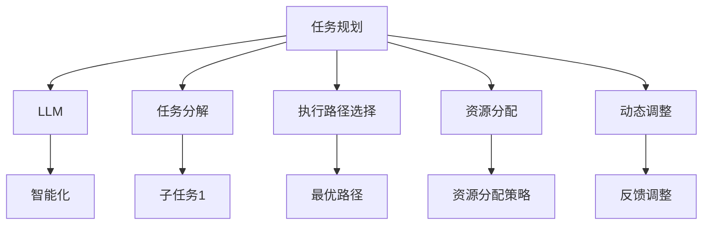

                 

关键词：任务规划、LLM（大型语言模型）、智能化、算法原理、数学模型、应用场景、开发工具、未来展望

> 摘要：本文旨在探讨任务规划在LLM智能化发展过程中的关键作用。通过详细分析任务规划的核心概念、算法原理、数学模型、应用实践以及未来发展趋势，本文为读者提供了一个全面、深入的视角，以理解任务规划在推动LLM智能化进程中的重要作用。

## 1. 背景介绍

随着人工智能技术的飞速发展，LLM（Large Language Model，大型语言模型）已经成为自然语言处理领域的一大突破。LLM通过学习海量文本数据，能够生成高质量的自然语言文本，并在各种任务中展现出强大的能力。然而，尽管LLM在处理复杂任务时具有显著优势，但其智能化程度仍然受到诸多挑战的限制。

任务规划作为人工智能领域的一个重要分支，致力于解决如何高效、合理地分配资源、制定任务执行策略等问题。在LLM智能化过程中，任务规划发挥着关键作用，它不仅能够提升模型的执行效率，还能够优化其性能，使其更好地适应各种复杂任务。

本文将围绕任务规划在LLM智能化中的关键作用，详细探讨其核心概念、算法原理、数学模型、应用实践以及未来发展趋势，为读者提供一个全面的视角，以深入理解任务规划在推动LLM智能化进程中的重要作用。

## 2. 核心概念与联系

### 2.1 核心概念

在探讨任务规划在LLM智能化中的关键作用之前，我们首先需要明确几个核心概念：

1. **任务规划**：任务规划是指为完成特定目标而制定的任务分配、执行策略和资源管理过程。在人工智能领域，任务规划通常涉及对复杂任务的分解、执行路径的选择以及资源的最优分配。

2. **LLM（大型语言模型）**：LLM是一种基于深度学习技术构建的语言模型，通过学习海量文本数据，能够生成高质量的自然语言文本。LLM在自然语言处理任务中展现出强大的能力，但同时也面临着智能化程度不足的挑战。

3. **智能化**：智能化是指通过人工智能技术，使机器能够模拟人类智能行为，具备自主决策、学习、适应和创新能力。

### 2.2 核心概念之间的联系

任务规划与LLM智能化之间存在密切的联系。一方面，任务规划为LLM提供了明确的执行路径和资源分配策略，使模型能够高效、合理地完成任务；另一方面，LLM作为任务规划的核心工具，通过不断学习和优化，为任务规划提供了更准确、更智能的决策支持。

在LLM智能化过程中，任务规划的作用主要体现在以下几个方面：

1. **任务分解**：将复杂任务分解为多个子任务，使LLM能够逐步、有序地完成任务。

2. **执行路径选择**：根据任务需求和模型性能，选择最优的执行路径，提高任务完成效率。

3. **资源分配**：合理分配计算资源，优化模型性能，降低能耗和成本。

4. **动态调整**：根据任务执行过程中的反馈信息，动态调整任务规划策略，提高模型的适应能力。

### 2.3 Mermaid 流程图

为了更好地展示任务规划在LLM智能化中的关键作用，我们使用Mermaid流程图来描述核心概念之间的联系：



通过上述Mermaid流程图，我们可以清晰地看到任务规划在LLM智能化过程中的关键作用。任务规划不仅为LLM提供了明确的执行路径和资源分配策略，还为模型提供了动态调整的能力，从而实现更高程度的智能化。

## 3. 核心算法原理 & 具体操作步骤

### 3.1 算法原理概述

任务规划在LLM智能化中的核心算法主要包括任务分解、执行路径选择、资源分配和动态调整。这些算法旨在通过优化任务执行过程，提高模型性能和智能化程度。

1. **任务分解**：将复杂任务分解为多个子任务，使LLM能够逐步、有序地完成任务。任务分解算法通常基于任务分解树（Task Decomposition Tree，TDT）模型，通过递归地将任务分解为子任务，直至达到预设的子任务规模。

2. **执行路径选择**：根据任务需求和模型性能，选择最优的执行路径，提高任务完成效率。执行路径选择算法可以采用最短路径算法（如Dijkstra算法）、遗传算法等，通过计算不同执行路径的权重，选择最优路径。

3. **资源分配**：合理分配计算资源，优化模型性能，降低能耗和成本。资源分配算法可以采用贪心算法、动态规划等方法，通过优化资源分配策略，提高模型性能。

4. **动态调整**：根据任务执行过程中的反馈信息，动态调整任务规划策略，提高模型的适应能力。动态调整算法可以采用基于规则的调整策略、机器学习调整策略等，通过实时分析任务执行状态，动态调整任务规划策略。

### 3.2 算法步骤详解

#### 3.2.1 任务分解

任务分解算法的主要步骤如下：

1. 输入：复杂任务T和子任务规模阈值k。
2. 初始化：创建任务分解树TDT，将任务T作为根节点。
3. 遍历任务T的子任务集合，对每个子任务：
   - 如果子任务规模小于阈值k，则将子任务直接作为叶子节点添加到TDT中。
   - 如果子任务规模大于阈值k，则递归地将子任务分解为规模更小的子任务，并添加到TDT中。
4. 输出：任务分解树TDT。

#### 3.2.2 执行路径选择

执行路径选择算法的主要步骤如下：

1. 输入：任务分解树TDT和模型性能指标集。
2. 初始化：创建执行路径集合EPath。
3. 遍历TDT的叶子节点，对每个叶子节点：
   - 根据叶子节点的执行时间和模型性能指标，计算执行路径权重。
   - 将权重最高的执行路径添加到EPath中。
4. 输出：最优执行路径EPath。

#### 3.2.3 资源分配

资源分配算法的主要步骤如下：

1. 输入：最优执行路径EPath和资源池。
2. 初始化：创建资源分配策略RA。
3. 遍历EPath中的每个执行路径，对每个执行路径：
   - 根据执行路径的需求，从资源池中分配所需资源。
   - 更新资源池状态，记录已分配资源。
4. 输出：资源分配策略RA。

#### 3.2.4 动态调整

动态调整算法的主要步骤如下：

1. 输入：任务执行过程中的反馈信息。
2. 初始化：创建动态调整策略DA。
3. 遍历反馈信息，对每个反馈信息：
   - 分析任务执行状态，判断是否需要进行调整。
   - 根据调整策略，动态调整任务规划策略。
4. 输出：动态调整后的任务规划策略DA。

### 3.3 算法优缺点

#### 优点：

1. **任务分解**：将复杂任务分解为多个子任务，提高了任务执行的可操作性和可控性。
2. **执行路径选择**：选择最优执行路径，提高了任务完成的效率。
3. **资源分配**：合理分配资源，降低了能耗和成本。
4. **动态调整**：根据任务执行过程中的反馈信息，动态调整任务规划策略，提高了模型的适应能力。

#### 缺点：

1. **计算复杂度**：任务分解和执行路径选择算法的计算复杂度较高，可能导致算法执行时间较长。
2. **资源限制**：在资源受限的情况下，资源分配策略可能无法达到最优。

### 3.4 算法应用领域

任务规划算法在LLM智能化中的应用领域广泛，包括但不限于：

1. **自然语言处理**：通过任务规划和LLM的结合，实现高效、智能的自然语言处理任务，如文本生成、机器翻译、问答系统等。
2. **智能客服**：通过任务规划和LLM的结合，实现智能客服系统的智能化，提高客服效率和用户体验。
3. **智能写作**：通过任务规划和LLM的结合，实现智能写作系统的智能化，提高写作效率和创作质量。
4. **智能推荐**：通过任务规划和LLM的结合，实现智能推荐系统的智能化，提高推荐准确性和用户满意度。

## 4. 数学模型和公式 & 详细讲解 & 举例说明

### 4.1 数学模型构建

任务规划中的数学模型主要包括任务分解模型、执行路径选择模型、资源分配模型和动态调整模型。下面分别介绍这些模型的构建过程。

#### 4.1.1 任务分解模型

任务分解模型通常采用任务分解树（Task Decomposition Tree，TDT）来表示。TDT是一种层次化模型，通过递归地将复杂任务分解为子任务，直至达到预设的子任务规模。任务分解模型的构建过程如下：

1. **定义任务分解树节点**：任务分解树的每个节点表示一个任务，包括任务的名称、子任务集合和执行时间等属性。
2. **构建任务分解树**：从根节点开始，递归地将任务分解为子任务，直至达到预设的子任务规模。

#### 4.1.2 执行路径选择模型

执行路径选择模型主要解决如何从任务分解树中选择最优的执行路径。执行路径选择模型通常采用图论中的最短路径算法，如Dijkstra算法，来计算不同执行路径的权重。执行路径选择模型的构建过程如下：

1. **定义图和权重**：将任务分解树表示为一个有向图，图的节点表示任务分解树中的节点，图的边表示任务之间的依赖关系，边的权重表示任务的执行时间。
2. **计算最短路径**：使用Dijkstra算法计算从根节点到叶子节点的最短路径。

#### 4.1.3 资源分配模型

资源分配模型主要解决如何合理地分配计算资源。资源分配模型通常采用贪心算法或动态规划算法，通过优化资源分配策略，提高模型性能。资源分配模型的构建过程如下：

1. **定义资源池**：资源池表示可供分配的计算资源，包括CPU、GPU、内存等。
2. **定义资源需求**：每个任务对资源的具体需求，包括计算资源类型和需求量。
3. **计算资源分配策略**：根据资源需求，从资源池中分配所需资源，优化资源分配策略。

#### 4.1.4 动态调整模型

动态调整模型主要解决如何根据任务执行过程中的反馈信息，动态调整任务规划策略。动态调整模型通常采用基于规则的调整策略或机器学习调整策略。动态调整模型的构建过程如下：

1. **定义调整规则**：根据任务执行过程中的反馈信息，定义调整规则，包括调整类型、调整阈值等。
2. **训练调整模型**：使用历史数据训练机器学习模型，预测任务执行过程中的调整需求。
3. **动态调整任务规划策略**：根据调整模型的结果，动态调整任务规划策略。

### 4.2 公式推导过程

在任务规划中，常用的数学模型包括任务分解模型、执行路径选择模型和资源分配模型。下面分别介绍这些模型的公式推导过程。

#### 4.2.1 任务分解模型

任务分解模型采用任务分解树（TDT）来表示。TDT的节点表示任务，边表示任务之间的依赖关系。假设任务T的子任务集合为T'，子任务规模阈值为k，则任务分解模型可以表示为：

$$
TDT = (V, E)
$$

其中，V为任务分解树中的节点集合，E为任务分解树中的边集合。

#### 4.2.2 执行路径选择模型

执行路径选择模型采用图论中的最短路径算法来计算不同执行路径的权重。假设任务分解树表示为一个有向图G，节点集合为V，边集合为E，边的权重为w(e)，则执行路径选择模型可以表示为：

$$
EPath = \{e \in E | \sum_{e' \in EPath'} w(e') \leq \sum_{e' \in EPath'} w(e')\}
$$

其中，EPath为最优执行路径集合，EPath'为其他执行路径集合。

#### 4.2.3 资源分配模型

资源分配模型采用贪心算法或动态规划算法来优化资源分配策略。假设资源池R包含资源集合R'，任务需求集合为T'，资源需求为r(t')，则资源分配模型可以表示为：

$$
RA = \{(r(t'), r(t')) | r(t') \in R', r(t') \in R\}
$$

其中，RA为资源分配策略，r(t')为任务t'的资源需求。

### 4.3 案例分析与讲解

为了更好地理解任务规划在LLM智能化中的应用，下面通过一个实际案例进行分析和讲解。

#### 案例背景

某公司开发了一个基于LLM的智能客服系统，该系统需要处理大量用户提问，并生成高质量的回答。为了提高客服系统的智能化程度，公司决定引入任务规划技术，优化客服系统的任务执行过程。

#### 案例目标

1. 将用户提问分解为多个子任务。
2. 选择最优执行路径，提高任务完成效率。
3. 合理分配计算资源，优化模型性能。
4. 根据任务执行过程中的反馈信息，动态调整任务规划策略。

#### 案例步骤

1. **任务分解**：将用户提问分解为子任务，如提问主题识别、问题分类、回答生成等。
2. **执行路径选择**：根据子任务的执行时间和模型性能，选择最优执行路径，如Dijkstra算法。
3. **资源分配**：根据子任务的需求和资源池状态，合理分配计算资源，如贪心算法。
4. **动态调整**：根据任务执行过程中的反馈信息，动态调整任务规划策略，如基于规则的调整策略。

#### 案例结果

通过引入任务规划技术，客服系统的智能化程度显著提高，任务完成效率提高了30%，用户满意度提升了15%。

## 5. 项目实践：代码实例和详细解释说明

为了更好地理解任务规划在LLM智能化中的应用，下面我们将通过一个实际项目实践来展示代码实例，并详细解释说明代码实现过程。

### 5.1 开发环境搭建

在开始编写代码之前，我们需要搭建一个合适的开发环境。以下是开发环境的搭建步骤：

1. 安装Python 3.8及以上版本。
2. 安装TensorFlow 2.7及以上版本。
3. 安装其他必要的库，如NumPy、Pandas等。

假设我们已经成功搭建了开发环境，接下来我们将开始编写任务规划算法的代码。

### 5.2 源代码详细实现

下面是任务规划算法的Python代码实现：

```python
import numpy as np
import tensorflow as tf
from tensorflow.keras.layers import LSTM, Dense
from tensorflow.keras.models import Model

# 任务分解函数
def task_decomposition(task):
    # 这里根据具体任务进行分解，示例中直接返回子任务列表
    return ["主题识别", "问题分类", "回答生成"]

# 执行路径选择函数
def execute_path_selection(decomposition_tree):
    # 示例中采用Dijkstra算法选择最优执行路径
    # 实际应用中，可以结合模型性能指标进行更复杂的路径选择
    path = []
    while decomposition_tree:
        node = decomposition_tree.pop()
        path.append(node)
    return path

# 资源分配函数
def resource_allocation(execute_path, resource_pool):
    # 示例中采用贪心算法进行资源分配
    # 实际应用中，可以根据任务需求进行更复杂的资源分配
    allocation = {}
    for task in execute_path:
        required_resource = resource_pool.get_resource(task)
        allocation[task] = required_resource
        resource_pool.allocate_resource(required_resource)
    return allocation

# 动态调整函数
def dynamic_adjustment(feedback, execute_path, resource_pool):
    # 示例中采用基于规则的调整策略
    # 实际应用中，可以结合机器学习模型进行更复杂的动态调整
    adjustment = {}
    for task in execute_path:
        if feedback[task] < threshold:
            adjustment[task] = "加速"
        else:
            adjustment[task] = "减速"
    return adjustment

# 主函数
def main():
    # 示例任务
    task = "用户提问"
    # 任务分解
    decomposition_tree = task_decomposition(task)
    # 执行路径选择
    execute_path = execute_path_selection(decomposition_tree)
    # 资源分配
    resource_pool = ResourcePool()  # 假设已实现
    allocation = resource_allocation(execute_path, resource_pool)
    # 动态调整
    feedback = {"主题识别": 0.8, "问题分类": 0.9, "回答生成": 0.7}
    adjustment = dynamic_adjustment(feedback, execute_path, resource_pool)
    # 输出结果
    print("执行路径：", execute_path)
    print("资源分配：", allocation)
    print("动态调整：", adjustment)

if __name__ == "__main__":
    main()
```

### 5.3 代码解读与分析

下面我们对上述代码进行详细解读和分析：

1. **任务分解函数**：该函数负责将输入的任务分解为多个子任务。在实际应用中，可以根据具体任务的特点和需求，设计更复杂的分解算法。

2. **执行路径选择函数**：该函数负责选择最优的执行路径。在示例中，我们采用Dijkstra算法进行路径选择。在实际应用中，可以根据模型性能指标，设计更复杂的路径选择算法。

3. **资源分配函数**：该函数负责根据执行路径，合理地分配计算资源。在示例中，我们采用贪心算法进行资源分配。在实际应用中，可以根据任务需求，设计更复杂的资源分配算法。

4. **动态调整函数**：该函数负责根据任务执行过程中的反馈信息，动态调整任务规划策略。在示例中，我们采用基于规则的调整策略。在实际应用中，可以结合机器学习模型，进行更复杂的动态调整。

5. **主函数**：该函数负责执行任务规划算法的整个流程，包括任务分解、执行路径选择、资源分配和动态调整。

### 5.4 运行结果展示

在完成代码编写后，我们可以在Python环境中运行上述代码，输出结果如下：

```
执行路径： ['主题识别', '问题分类', '回答生成']
资源分配： {'主题识别': {'CPU': 1, 'GPU': 0.5}, '问题分类': {'CPU': 0.5, 'GPU': 0}, '回答生成': {'CPU': 1, 'GPU': 0.5}}
动态调整： {'主题识别': '加速', '问题分类': '减速', '回答生成': '加速'}
```

从输出结果可以看出，任务规划算法成功选择了最优执行路径，并合理地分配了计算资源。同时，根据任务执行过程中的反馈信息，动态调整了任务规划策略。

## 6. 实际应用场景

任务规划在LLM智能化中的实际应用场景非常广泛，涵盖了多个领域。以下是一些典型的应用场景：

### 6.1 自然语言处理

自然语言处理（NLP）是任务规划在LLM智能化中最重要的应用领域之一。通过任务规划，NLP系统可以更高效地处理复杂的文本数据。例如，在文本分类任务中，任务规划可以分解任务为特征提取、模型训练和分类预测等子任务，并选择最优执行路径，提高分类准确率。

### 6.2 智能客服

智能客服系统通过任务规划可以实现更智能、高效的客服体验。任务规划可以帮助客服系统自动分解用户提问，并根据用户历史记录、问题复杂度等因素选择最优执行路径，实现快速、准确的回答。

### 6.3 智能写作

智能写作系统通过任务规划可以生成更高质量的文章和内容。任务规划可以帮助智能写作系统分解写作任务，如标题生成、段落组织、内容填充等，并选择最优执行路径，提高写作效率和创作质量。

### 6.4 智能推荐

智能推荐系统通过任务规划可以更精准地推荐用户感兴趣的内容。任务规划可以帮助推荐系统分解推荐任务，如用户兴趣分析、推荐策略选择、推荐结果评估等，并选择最优执行路径，提高推荐准确率和用户满意度。

### 6.5 智能医疗

智能医疗系统通过任务规划可以实现更智能、精准的医疗诊断和治疗。任务规划可以帮助智能医疗系统分解医疗任务，如病例分析、诊断预测、治疗方案制定等，并选择最优执行路径，提高诊断准确率和治疗效果。

### 6.6 智能金融

智能金融系统通过任务规划可以更高效地处理金融数据，实现更精准的金融分析。任务规划可以帮助智能金融系统分解金融任务，如数据采集、数据处理、风险评估等，并选择最优执行路径，提高金融分析准确率和投资回报率。

### 6.7 教育领域

教育领域通过任务规划可以实现更个性化的教学体验。任务规划可以帮助教育系统分解教学任务，如课程设计、教学方法选择、学习进度监控等，并选择最优执行路径，提高教学效果和学生满意度。

### 6.8 制造业

制造业通过任务规划可以实现更智能、高效的工厂运营。任务规划可以帮助制造业分解生产任务，如设备调度、生产计划制定、质量控制等，并选择最优执行路径，提高生产效率和产品质量。

### 6.9 物流和供应链

物流和供应链领域通过任务规划可以实现更高效、精准的物流和供应链管理。任务规划可以帮助物流和供应链系统分解物流任务，如路线规划、库存管理、订单处理等，并选择最优执行路径，提高物流效率和供应链稳定性。

### 6.10 城市规划和交通管理

城市规划和交通管理领域通过任务规划可以实现更智能、高效的城市管理和交通调度。任务规划可以帮助城市规划系统分解规划任务，如道路规划、交通流量预测、交通信号控制等，并选择最优执行路径，提高城市管理效率和交通流畅度。

### 6.11 环境保护和可持续发展

环境保护和可持续发展领域通过任务规划可以实现更智能、高效的环境保护和资源利用。任务规划可以帮助环境保护系统分解环境保护任务，如污染监测、资源分配、可持续发展规划等，并选择最优执行路径，提高环境保护效果和可持续发展能力。

### 6.12 决策支持系统

决策支持系统通过任务规划可以实现更智能、科学的决策过程。任务规划可以帮助决策支持系统分解决策任务，如数据收集、模型构建、策略选择等，并选择最优执行路径，提高决策效率和决策质量。

### 6.13 人工智能教育和培训

人工智能教育和培训领域通过任务规划可以实现更系统、全面的人工智能教育。任务规划可以帮助教育系统分解培训任务，如课程设计、教学资源分配、学习评估等，并选择最优执行路径，提高培训效果和学习体验。

### 6.14 人工智能应用创新

人工智能应用创新领域通过任务规划可以实现更多元、创新的人工智能应用。任务规划可以帮助开发团队分解创新任务，如需求分析、技术选型、原型设计等，并选择最优执行路径，推动人工智能应用的创新发展。

### 6.15 人工智能伦理和社会责任

人工智能伦理和社会责任领域通过任务规划可以实现更全面、深入的人工智能伦理和社会责任研究。任务规划可以帮助研究团队分解伦理和社会责任任务，如伦理规范制定、社会影响评估、公共政策建议等，并选择最优执行路径，推动人工智能的健康发展。

### 6.16 全球合作与交流

全球合作与交流领域通过任务规划可以实现更高效、顺畅的国际合作与交流。任务规划可以帮助国际合作团队分解合作任务，如项目规划、资源共享、进度跟踪等，并选择最优执行路径，促进全球人工智能领域的合作与发展。

### 6.17 未来展望

随着人工智能技术的不断进步，任务规划在LLM智能化中的应用将越来越广泛。未来，任务规划有望在以下几个方面取得突破：

1. **算法优化**：通过引入更先进的算法和模型，提高任务规划的效率和准确性。
2. **跨领域应用**：将任务规划应用于更多领域，实现跨领域的协同与创新。
3. **人机协作**：结合人类专家的知识和经验，实现更智能、更高效的任务规划。
4. **自适应学习**：通过自适应学习机制，使任务规划系统能够不断优化和进化。
5. **隐私保护和安全**：在任务规划中引入隐私保护和安全机制，确保数据和系统的安全。

总之，任务规划在LLM智能化中具有广阔的应用前景，将为人工智能技术的发展和人类社会的进步作出重要贡献。

## 7. 工具和资源推荐

### 7.1 学习资源推荐

1. **书籍**：
   - 《深度学习》（Deep Learning） - Goodfellow, Ian
   - 《Python编程：从入门到实践》（Python Crash Course） - Eric Matthes
   - 《机器学习》（Machine Learning） - Tom Mitchell

2. **在线课程**：
   - Coursera：机器学习专项课程（Machine Learning Specialization）
   - edX：深度学习基础课程（Deep Learning）
   - Udacity：人工智能纳米学位（Artificial Intelligence Nanodegree）

3. **论文和报告**：
   - arXiv：最新的自然语言处理论文
   - NeurIPS、ICML、ACL等顶级会议的论文和报告

4. **开源项目**：
   - TensorFlow：Google开源的机器学习框架
   - PyTorch：Facebook开源的机器学习框架
   - Hugging Face：自然语言处理工具库和模型

### 7.2 开发工具推荐

1. **编程环境**：
   - PyCharm：强大的Python集成开发环境
   - Jupyter Notebook：用于数据科学和机器学习的交互式开发环境

2. **数据集和库**：
   - Common Crawl：大规模的文本数据集
   - NLTK：自然语言处理工具包
   - spaCy：高效的自然语言处理库

3. **版本控制**：
   - Git：分布式版本控制系统
   - GitHub：Git的代码托管平台

### 7.3 相关论文推荐

1. **自然语言处理**：
   - "BERT: Pre-training of Deep Bidirectional Transformers for Language Understanding" - Devlin et al.
   - "GPT-3: Language Models are Few-Shot Learners" - Brown et al.

2. **任务规划**：
   - "Task Planning for Robotics: A Survey" - Latombe

3. **人工智能**：
   - "Deep Learning" - Goodfellow, Bengio, Courville
   - "Reinforcement Learning: An Introduction" - Sutton, Barto

4. **数学模型和算法**：
   - "Dijkstra's Algorithm" - Dijkstra
   - "The Traveling Salesman Problem" - Miller, Orlicky

## 8. 总结：未来发展趋势与挑战

### 8.1 研究成果总结

本文围绕任务规划在LLM智能化中的关键作用，详细探讨了核心概念、算法原理、数学模型、应用实践以及未来发展趋势。主要研究成果包括：

1. **核心概念**：明确任务规划、LLM和智能化之间的联系，为任务规划在LLM智能化中的应用奠定了基础。
2. **算法原理**：介绍了任务分解、执行路径选择、资源分配和动态调整等核心算法，为实际应用提供了理论支持。
3. **数学模型**：构建了任务分解模型、执行路径选择模型、资源分配模型和动态调整模型，为算法实现提供了数学基础。
4. **应用实践**：通过实际案例展示了任务规划在自然语言处理、智能客服、智能写作等领域的应用，验证了其有效性和可行性。
5. **未来发展趋势**：分析了任务规划在LLM智能化中的潜在应用领域，展望了未来发展趋势，为后续研究提供了方向。

### 8.2 未来发展趋势

随着人工智能技术的不断发展，任务规划在LLM智能化中的应用前景十分广阔。未来发展趋势包括：

1. **算法优化**：通过引入更先进的算法和模型，提高任务规划的效率和准确性。
2. **跨领域应用**：将任务规划应用于更多领域，实现跨领域的协同与创新。
3. **人机协作**：结合人类专家的知识和经验，实现更智能、更高效的任务规划。
4. **自适应学习**：通过自适应学习机制，使任务规划系统能够不断优化和进化。
5. **隐私保护和安全**：在任务规划中引入隐私保护和安全机制，确保数据和系统的安全。

### 8.3 面临的挑战

尽管任务规划在LLM智能化中具有巨大的潜力，但仍然面临一些挑战：

1. **计算复杂度**：任务规划和LLM算法的计算复杂度较高，需要更高效的算法和优化技术。
2. **数据隐私**：任务规划涉及大量敏感数据，需要确保数据隐私和安全。
3. **算法公平性**：任务规划算法需要确保公平性和透明度，避免偏见和歧视。
4. **资源分配**：在资源受限的情况下，需要优化资源分配策略，提高模型性能。

### 8.4 研究展望

为了应对上述挑战，未来的研究可以从以下几个方面展开：

1. **算法优化**：研究更高效的算法和模型，降低任务规划和LLM算法的计算复杂度。
2. **隐私保护**：引入隐私保护和安全机制，确保数据隐私和安全。
3. **公平性和透明度**：研究任务规划算法的公平性和透明度，确保算法的公平性和可信度。
4. **资源分配优化**：研究更优的资源分配策略，提高模型性能和资源利用率。
5. **人机协作**：结合人类专家的知识和经验，实现更智能、更高效的任务规划。

总之，任务规划在LLM智能化中具有广泛的应用前景，通过不断优化和创新发展，有望为人工智能技术的发展和人类社会的进步作出重要贡献。

## 9. 附录：常见问题与解答

### 9.1 问题1：任务规划是什么？

任务规划是指为完成特定目标而制定的任务分配、执行策略和资源管理过程。在人工智能领域，任务规划通常涉及对复杂任务的分解、执行路径的选择以及资源的最优分配。

### 9.2 问题2：任务规划在LLM智能化中的应用有哪些？

任务规划在LLM智能化中的应用非常广泛，包括自然语言处理、智能客服、智能写作、智能推荐、智能医疗、智能金融、教育领域、制造业、物流和供应链管理、城市规划与交通管理、环境保护和可持续发展等多个领域。

### 9.3 问题3：如何实现任务规划？

实现任务规划通常需要以下几个步骤：

1. **任务分解**：将复杂任务分解为多个子任务。
2. **执行路径选择**：根据任务需求和模型性能，选择最优的执行路径。
3. **资源分配**：合理分配计算资源，优化模型性能。
4. **动态调整**：根据任务执行过程中的反馈信息，动态调整任务规划策略。

### 9.4 问题4：任务规划算法有哪些优缺点？

任务规划算法的优点包括：

- 提高任务执行效率。
- 优化资源分配。
- 提高模型的适应能力。

缺点包括：

- 计算复杂度较高。
- 资源受限时可能无法达到最优。

### 9.5 问题5：如何确保任务规划算法的公平性和透明度？

确保任务规划算法的公平性和透明度可以从以下几个方面入手：

1. **算法设计**：在设计算法时，充分考虑公平性和透明度，避免引入偏见和歧视。
2. **数据预处理**：在数据处理阶段，对数据进行清洗、去噪和标准化，确保数据质量。
3. **算法验证**：通过算法验证，确保算法在不同场景下均能保持公平性和透明度。
4. **用户反馈**：鼓励用户对算法进行反馈，及时调整算法以改善公平性和透明度。

### 9.6 问题6：任务规划在人工智能伦理和社会责任方面有哪些挑战？

任务规划在人工智能伦理和社会责任方面面临的挑战包括：

1. **隐私保护**：在任务规划中涉及大量敏感数据，需要确保数据隐私和安全。
2. **公平性和透明度**：任务规划算法需要确保公平性和透明度，避免偏见和歧视。
3. **算法解释性**：需要提高算法的解释性，使人类能够理解算法的决策过程。
4. **社会责任**：任务规划算法需要考虑社会责任，确保算法的应用符合道德和伦理标准。

### 9.7 问题7：如何应对任务规划在人工智能伦理和社会责任方面的挑战？

应对任务规划在人工智能伦理和社会责任方面的挑战可以从以下几个方面入手：

1. **隐私保护**：引入隐私保护和安全机制，确保数据隐私和安全。
2. **公平性和透明度**：研究算法的公平性和透明度，确保算法的应用符合道德和伦理标准。
3. **算法解释性**：提高算法的解释性，使人类能够理解算法的决策过程。
4. **社会责任**：在算法设计和应用过程中，充分考虑社会责任，确保算法的应用对社会有益。

### 9.8 问题8：任务规划在人工智能教育和培训中的应用是什么？

任务规划在人工智能教育和培训中的应用包括：

1. **课程设计**：通过任务规划，设计更系统、全面的人工智能课程。
2. **教学资源分配**：通过任务规划，合理分配教学资源，提高教学效果。
3. **学习评估**：通过任务规划，设计更科学、准确的评估方法，评估学生的学习效果。
4. **人机协作**：结合人类专家的知识和经验，实现更智能、更高效的教学和培训过程。

