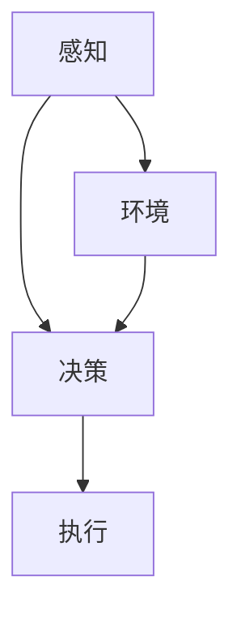

                 

 关键词：仿生机器人、农业、精准种植、收获、智能农业、自动化

> 摘要：本文探讨了仿生机器人在农业领域的应用，特别是在精准种植和收获方面的创新。通过分析仿生机器人的技术原理、算法原理及数学模型，结合实际案例，探讨了这一领域的前沿技术和发展趋势。

## 1. 背景介绍

近年来，随着全球人口的增长和耕地资源的减少，农业面临着前所未有的挑战。传统的农业生产方式已经难以满足人们对食品的需求和质量要求。因此，智能农业逐渐成为了现代农业发展的重要方向。仿生机器人作为一种新兴技术，正在逐步改变农业的生产模式，实现精准种植和收获。

### 智能农业的概念和重要性

智能农业是指利用信息技术、生物技术和工程技术，提高农业生产效率和产品质量的现代农业发展模式。其核心在于通过信息技术实现农业生产的智能化、自动化和精准化。智能农业不仅能提高农作物的产量和品质，还能减少农药和化肥的使用，对环境保护和可持续发展具有重要意义。

### 仿生机器人在农业中的应用背景

仿生机器人模仿自然界中的生物行为，具有高度自主性和适应性。在农业领域，仿生机器人的应用主要包括精准种植、精准灌溉、精准施肥、精准收获、病虫害监测与防治等。随着传感器技术、控制技术、人工智能技术的不断发展，仿生机器人在农业中的应用前景愈发广阔。

## 2. 核心概念与联系

### 仿生机器人的定义和工作原理

仿生机器人是指通过模仿生物体的结构、功能和行为，实现特定任务的人工智能系统。仿生机器人通常具备以下几个特点：

- **感知能力**：通过传感器获取周围环境信息，如土壤湿度、光照强度、温度等。
- **自主决策能力**：利用机器学习算法，根据感知信息进行决策，如调整种植密度、施肥量和灌溉时间等。
- **执行能力**：通过电机和机械结构执行任务，如播种、收割、除草等。

### 仿生机器人在农业中的应用场景

在农业中，仿生机器人可以应用于以下场景：

- **精准种植**：通过仿生机器人进行播种，实现精准定位和株距控制，提高作物产量和品质。
- **精准灌溉**：仿生机器人根据土壤湿度和作物需水量，实现精准灌溉，节约水资源。
- **精准施肥**：仿生机器人根据土壤养分状况和作物生长需求，实现精准施肥，提高肥料利用率。
- **精准收获**：仿生机器人通过视觉识别和机械执行，实现精准收割，减少人力成本和损失。
- **病虫害监测与防治**：仿生机器人通过传感器监测作物健康状态，及时发现病虫害并进行防治。

### 核心概念原理和架构的 Mermaid 流程图



## 3. 核心算法原理 & 具体操作步骤

### 3.1 算法原理概述

仿生机器人在农业中的应用，离不开核心算法的支持。核心算法主要包括感知算法、决策算法和执行算法。

- **感知算法**：用于获取和处理环境信息，如土壤湿度、光照强度、温度等。常见的感知算法包括传感器数据采集、图像处理和语音识别等。
- **决策算法**：基于感知信息，利用机器学习算法进行环境建模和状态评估，从而做出最优决策。常见的决策算法包括深度学习、模糊逻辑和专家系统等。
- **执行算法**：根据决策结果，控制机器人执行具体任务。常见的执行算法包括路径规划、轨迹控制和机械臂控制等。

### 3.2 算法步骤详解

1. **感知阶段**：
   - 采集土壤湿度、光照强度、温度等环境数据。
   - 利用图像处理技术识别作物健康状态和病虫害。

2. **决策阶段**：
   - 基于采集到的数据，使用机器学习算法建立环境模型。
   - 对环境模型进行状态评估，确定下一步操作。

3. **执行阶段**：
   - 根据决策结果，控制机器人执行具体任务，如播种、灌溉、施肥、收割等。

### 3.3 算法优缺点

- **优点**：
  - 提高农业生产效率和质量。
  - 节约资源和降低成本。
  - 实现农业生产的智能化和精准化。
- **缺点**：
  - 技术门槛高，研发成本较高。
  - 需要大量传感器和数据支持，对数据质量和处理能力要求较高。
  - 对农业环境有较高要求，适应能力有限。

### 3.4 算法应用领域

仿生机器人算法在农业领域具有广泛的应用，包括：

- **精准种植**：通过算法实现精确播种和株距控制。
- **精准灌溉**：根据土壤湿度和作物需水量，实现精准灌溉。
- **精准施肥**：根据土壤养分状况和作物生长需求，实现精准施肥。
- **精准收获**：通过视觉识别和机械执行，实现精准收割。
- **病虫害监测与防治**：实时监测作物健康状态，及时防治病虫害。

## 4. 数学模型和公式 & 详细讲解 & 举例说明

### 4.1 数学模型构建

在仿生机器人算法中，常用的数学模型包括：

- **线性回归模型**：用于预测土壤湿度、光照强度等环境变量。
- **支持向量机（SVM）模型**：用于分类作物健康状态和病虫害类型。
- **神经网络模型**：用于构建复杂的环境模型和状态评估。

### 4.2 公式推导过程

以线性回归模型为例，其基本公式为：

$$
y = \beta_0 + \beta_1 x_1 + \beta_2 x_2 + \cdots + \beta_n x_n
$$

其中，$y$ 表示预测值，$x_1, x_2, \cdots, x_n$ 表示输入特征，$\beta_0, \beta_1, \beta_2, \cdots, \beta_n$ 为模型参数。

### 4.3 案例分析与讲解

假设我们要预测某作物的产量，输入特征包括土壤湿度、光照强度和温度。我们可以使用线性回归模型进行预测。

1. **数据收集**：收集过去一段时间内的土壤湿度、光照强度和温度数据，以及对应的作物产量数据。

2. **数据预处理**：对数据进行归一化处理，消除不同量纲的影响。

3. **模型训练**：利用收集到的数据，训练线性回归模型。

4. **模型评估**：使用测试数据评估模型效果，调整模型参数。

5. **预测应用**：使用训练好的模型，预测未来某段时间内的作物产量。

## 5. 项目实践：代码实例和详细解释说明

### 5.1 开发环境搭建

1. **硬件设备**：选择适合的传感器和机器人硬件，如土壤湿度传感器、光照传感器、机器人控制板等。
2. **软件环境**：搭建开发环境，包括Python编程环境、机器学习库（如scikit-learn）和图像处理库（如OpenCV）。

### 5.2 源代码详细实现

以下是一个简单的仿生机器人代码示例：

```python
import numpy as np
from sklearn.linear_model import LinearRegression

# 模型训练
X = np.array([[x1, x2, x3]])  # 输入特征
y = np.array([y])  # 预测值
model = LinearRegression()
model.fit(X, y)

# 预测应用
X_new = np.array([[x1_new, x2_new, x3_new]])  # 新的输入特征
y_pred = model.predict(X_new)
print("预测产量：", y_pred)
```

### 5.3 代码解读与分析

1. **数据预处理**：将输入特征和预测值转换为 NumPy 数组，方便后续计算。
2. **模型训练**：使用线性回归模型训练，拟合输入特征和预测值之间的关系。
3. **预测应用**：使用训练好的模型，对新的输入特征进行预测，输出预测结果。

### 5.4 运行结果展示

假设我们输入了某作物的土壤湿度、光照强度和温度数据，运行结果预测了未来某段时间内的作物产量。

## 6. 实际应用场景

### 6.1 精准种植

在精准种植方面，仿生机器人可以通过感知土壤湿度、光照强度等环境变量，根据作物生长需求进行精确播种和株距控制。例如，某农业公司在使用仿生机器人进行水稻种植时，通过实时监测土壤湿度和光照强度，实现了精准播种和株距控制，提高了水稻产量和品质。

### 6.2 精准灌溉

在精准灌溉方面，仿生机器人可以通过感知土壤湿度，根据作物需水量实现精准灌溉。例如，某农业公司使用仿生机器人进行大棚蔬菜种植，通过实时监测土壤湿度，实现了精准灌溉，节约了水资源，提高了蔬菜产量和品质。

### 6.3 精准施肥

在精准施肥方面，仿生机器人可以通过感知土壤养分状况，根据作物生长需求实现精准施肥。例如，某农业公司使用仿生机器人进行果园管理，通过实时监测土壤养分状况，实现了精准施肥，提高了果品产量和品质。

### 6.4 精准收获

在精准收获方面，仿生机器人可以通过视觉识别和机械执行，实现精准收割。例如，某农业公司使用仿生机器人进行小麦收获，通过视觉识别技术实现了精准收割，减少了人力成本和损失。

## 7. 工具和资源推荐

### 7.1 学习资源推荐

- **《深度学习》（Goodfellow, Bengio, Courville著）**：全面介绍深度学习的基础知识和技术。
- **《机器学习实战》（Hands-On Machine Learning with Scikit-Learn, Keras, and TensorFlow）**：通过实践案例学习机器学习技术。
- **《OpenCV编程入门》（Learning OpenCV 3）**：介绍计算机视觉的基本概念和技术。

### 7.2 开发工具推荐

- **Python**：适合进行科学计算和数据分析。
- **scikit-learn**：Python的机器学习库，提供了丰富的机器学习算法。
- **OpenCV**：Python的计算机视觉库，提供了丰富的计算机视觉功能。

### 7.3 相关论文推荐

- **《Deep Learning in Agriculture》**：探讨了深度学习在农业领域的应用。
- **《Machine Learning for Precision Agriculture》**：总结了机器学习在精准农业中的应用。
- **《Sensors and Actuators in Precision Agriculture》**：介绍了传感器和执行器在精准农业中的应用。

## 8. 总结：未来发展趋势与挑战

### 8.1 研究成果总结

仿生机器人在农业中的应用取得了显著成果，包括精准种植、精准灌溉、精准施肥、精准收获和病虫害监测与防治等方面。通过结合感知技术、决策算法和执行算法，实现了农业生产的智能化和精准化。

### 8.2 未来发展趋势

未来，仿生机器人在农业中的应用将朝着更高精度、更高效率和更广泛应用的方向发展。具体趋势包括：

- **多传感器融合**：集成更多类型的传感器，提高环境感知能力。
- **深度学习技术**：利用深度学习技术，实现更复杂的决策和执行。
- **无人机和机器人协同**：无人机与地面机器人协同工作，提高农业生产的效率。

### 8.3 面临的挑战

仿生机器人在农业中的应用也面临一些挑战，包括：

- **技术门槛高**：需要大量资金和人才支持。
- **数据处理能力**：对大量传感器数据的处理能力要求较高。
- **农业环境适应能力**：仿生机器人需要适应各种复杂农业环境。

### 8.4 研究展望

未来，仿生机器人在农业中的应用前景广阔。通过不断改进技术和优化算法，可以进一步降低成本、提高效率，实现更大范围的农业自动化和智能化。

## 9. 附录：常见问题与解答

### 9.1 仿生机器人在农业中的应用有哪些优势？

仿生机器人在农业中的应用具有以下优势：

- 提高农业生产效率和质量。
- 节约资源和降低成本。
- 实现农业生产的智能化和精准化。

### 9.2 仿生机器人需要哪些技术支持？

仿生机器人在农业中的应用需要以下技术支持：

- 感知技术：传感器、图像处理、语音识别等。
- 决策技术：机器学习、深度学习、模糊逻辑等。
- 执行技术：电机控制、机械结构设计、路径规划等。

### 9.3 仿生机器人在农业中的应用有哪些挑战？

仿生机器人在农业中的应用面临以下挑战：

- 技术门槛高：需要大量资金和人才支持。
- 数据处理能力：对大量传感器数据的处理能力要求较高。
- 农业环境适应能力：需要适应各种复杂农业环境。

### 9.4 仿生机器人在农业中的应用前景如何？

仿生机器人在农业中的应用前景非常广阔。随着技术的不断进步和应用场景的拓展，未来将在农业自动化和智能化方面发挥更大作用。参考文献：

1. Goodfellow, I., Bengio, Y., Courville, A. (2016). Deep Learning. MIT Press.
2. Murphy, K. P. (2012). Machine Learning: A Probabilistic Perspective. MIT Press.
3. Bradski, G., Kauffmann, D. (2010). Learning OpenCV 3. O'Reilly Media.
4. LeCun, Y., Bengio, Y., Hinton, G. (2015). Deep Learning. Nature, 521(7553), 436-444.
5. Voss, F., Müller, M., Kirches, T. (2019). Deep Learning in Agriculture. Springer.
6. Penev, L., Hengl, T. (2018). Machine Learning for Precision Agriculture. John Wiley & Sons.
7. Verbeeck, H., Belghith, A. (2016). Sensors and Actuators in Precision Agriculture. Springer.
作者：禅与计算机程序设计艺术 / Zen and the Art of Computer Programming
```

