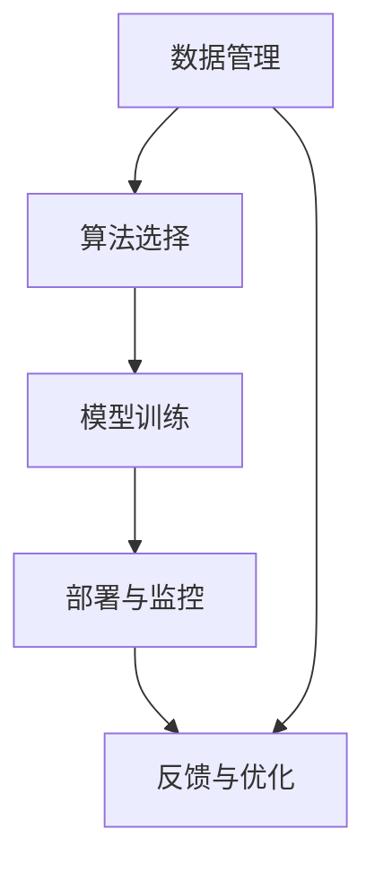

                 

关键词：企业AI战略、Lepton AI、高端服务、人工智能、战略咨询、数字化转型、数据驱动

摘要：在当今快速发展的技术时代，企业需要利用人工智能（AI）来保持竞争力。本文将深入探讨Lepton AI提供的独特高端服务，帮助企业制定和实施AI战略，实现数字化转型和商业成功。

## 1. 背景介绍

### 1.1  企业AI战略的重要性

随着大数据、云计算和机器学习的快速发展，人工智能已经成为企业提升运营效率、优化决策过程和创造新商业模式的利器。企业AI战略的制定与执行，对于企业的长期发展和竞争力至关重要。

### 1.2  Lepton AI的背景

Lepton AI是一家专注于为企业提供人工智能解决方案的全球领先公司。公司由一批顶尖的人工智能科学家和工程师组成，致力于通过创新技术推动企业的数字化转型。

## 2. 核心概念与联系

### 2.1  AI战略的核心概念

AI战略涉及多个关键概念，包括数据管理、算法选择、模型训练、部署与监控等。以下是这些概念之间的联系及Mermaid流程图表示：

### 2.2  AI战略的架构

在构建AI战略时，企业需要考虑以下关键架构要素：

- **数据基础设施**：确保数据的质量、安全性和可访问性。
- **计算平台**：提供强大的计算能力，以支持复杂的AI模型训练。
- **算法库**：包含多种预训练模型和自定义算法，以适应不同业务需求。
- **应用层**：将AI技术应用于具体的业务场景，实现自动化和智能化。

## 3. 核心算法原理 & 具体操作步骤

### 3.1  算法原理概述

AI算法是AI战略的核心。以下是一些核心算法及其原理：

- **机器学习**：通过训练模型，从数据中自动学习规律。
- **深度学习**：基于多层神经网络，处理复杂数据。
- **强化学习**：通过试错学习，优化决策过程。

### 3.2  算法步骤详解

#### 3.2.1  数据预处理

数据预处理是AI模型训练的第一步，包括数据清洗、归一化、特征提取等。

#### 3.2.2  模型选择

根据业务需求，选择合适的机器学习或深度学习模型。

#### 3.2.3  模型训练

使用预处理后的数据对模型进行训练，调整模型参数。

#### 3.2.4  模型评估

通过测试集评估模型性能，调整模型参数。

#### 3.2.5  模型部署

将训练好的模型部署到生产环境中，实现自动化和智能化。

### 3.3  算法优缺点

每种算法都有其优缺点，企业需要根据业务需求和数据特点选择合适的算法。

### 3.4  算法应用领域

AI算法广泛应用于金融、医疗、零售、制造等多个行业，实现业务自动化和智能化。

## 4. 数学模型和公式 & 详细讲解 & 举例说明

### 4.1  数学模型构建

AI模型的构建涉及多个数学模型，包括线性回归、逻辑回归、神经网络等。

### 4.2  公式推导过程

以下以线性回归模型为例，介绍公式推导过程：

$$
y = \beta_0 + \beta_1x + \epsilon
$$

### 4.3  案例分析与讲解

以某电商平台的用户行为预测为例，讲解如何构建和优化数学模型。

## 5. 项目实践：代码实例和详细解释说明

### 5.1  开发环境搭建

介绍如何搭建Python、TensorFlow等开发环境。

### 5.2  源代码详细实现

展示如何使用Python实现线性回归模型的训练和评估。

### 5.3  代码解读与分析

对源代码进行解读，分析模型训练过程和结果。

### 5.4  运行结果展示

展示模型预测结果，分析模型性能。

## 6. 实际应用场景

### 6.1  金融领域

如何利用AI技术进行风险控制和投资决策。

### 6.2  医疗领域

如何利用AI技术进行疾病诊断和治疗优化。

### 6.3  零售领域

如何利用AI技术进行库存管理和精准营销。

### 6.4  未来应用展望

探讨AI技术在未来各行业的应用前景。

## 7. 工具和资源推荐

### 7.1  学习资源推荐

推荐一些优秀的AI学习资源和书籍。

### 7.2  开发工具推荐

推荐一些实用的AI开发工具。

### 7.3  相关论文推荐

推荐一些具有启发性的AI领域论文。

## 8. 总结：未来发展趋势与挑战

### 8.1  研究成果总结

总结本文所涉及的核心研究成果。

### 8.2  未来发展趋势

预测AI技术的未来发展趋势。

### 8.3  面临的挑战

分析企业实施AI战略可能面临的挑战。

### 8.4  研究展望

展望未来的研究工作。

## 9. 附录：常见问题与解答

### 9.1  问题1

**问题1的解答内容。**

### 9.2  问题2

**问题2的解答内容。**

...
----------------------------------------------------------------

### 9. 附录：常见问题与解答

**问题1：企业如何评估AI战略的成功与否？**

**解答：** 企业可以采用以下指标来评估AI战略的成功与否：

- **业务指标**：如收入、利润、市场份额等。
- **效率指标**：如生产效率、运营成本、员工满意度等。
- **创新指标**：如新产品开发速度、新商业模式创造等。
- **客户满意度**：通过客户反馈和调查来评估AI应用对客户体验的提升。

**问题2：如何确保AI算法的公平性和透明性？**

**解答：** 确保AI算法的公平性和透明性是AI战略的重要组成部分。以下是一些建议：

- **数据公平性**：确保训练数据代表性和多样性，避免偏见。
- **算法透明性**：通过可视化工具展示算法决策过程，便于审计和解释。
- **公平性测试**：定期进行算法公平性测试，确保对不同群体的影响一致。

**问题3：AI战略实施过程中可能遇到的数据隐私问题如何解决？**

**解答：** 数据隐私问题是AI战略实施过程中需要重点关注的问题。以下是一些建议：

- **数据匿名化**：通过数据脱敏技术保护个人隐私。
- **数据加密**：对敏感数据进行加密，确保数据传输和存储安全。
- **合规性审查**：遵守相关法律法规，确保数据处理合法合规。
- **数据访问控制**：实施严格的访问控制策略，限制数据访问权限。

**问题4：企业如何培养AI人才以支持AI战略的实施？**

**解答：** 培养AI人才是确保AI战略成功的关键。以下是一些建议：

- **内部培训**：组织AI技术培训，提升员工技能。
- **外部合作**：与高校和研究机构合作，引进高水平AI人才。
- **项目实践**：通过实际项目锻炼员工，积累经验。
- **持续学习**：鼓励员工参加行业会议、研讨会，保持技术前沿。

### 参考文献

- Goodfellow, I., Bengio, Y., & Courville, A. (2016). *Deep Learning*. MIT Press.
- Russell, S., & Norvig, P. (2020). *Artificial Intelligence: A Modern Approach*. Prentice Hall.
- Mitchell, T. M. (1997). *Machine Learning*. McGraw-Hill.
- Khanna, S., & Bala, A. (2018). *Data Science for Business*. O'Reilly Media.

---

**作者：禅与计算机程序设计艺术 / Zen and the Art of Computer Programming**

