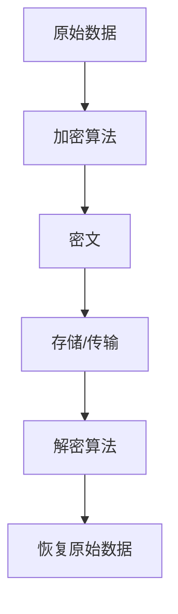
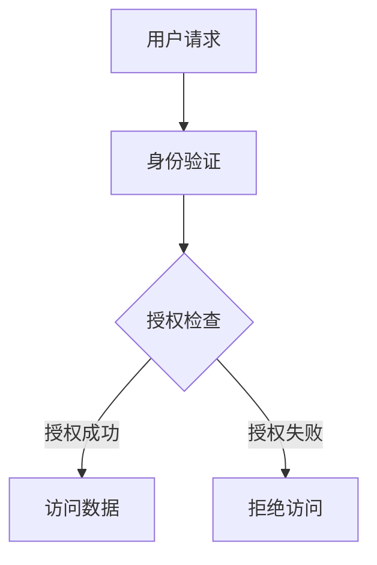
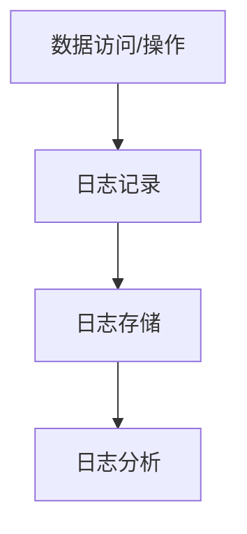

                 

关键词：企业AI数据安全，Lepton AI，数据保护，加密机制，隐私保护，安全架构

摘要：本文深入探讨了企业AI数据安全领域的重要议题，特别是Lepton AI所采用的先进保护机制。通过对Lepton AI的数据加密技术、访问控制、审计追踪等核心安全功能的详细介绍，文章旨在为企业和开发者提供全面的AI数据安全指南，以应对日益复杂的网络威胁和隐私泄露风险。

## 1. 背景介绍

随着人工智能技术的迅猛发展，企业AI已成为推动数字化转型和提升业务效率的关键力量。然而，随之而来的数据安全问题也日益严峻。AI系统处理的大量敏感数据，包括用户个人信息、商业机密和关键基础设施数据，成为黑客攻击和恶意软件的首选目标。据统计，全球企业每年因数据泄露而造成的经济损失高达数百万美元。

在这种背景下，Lepton AI应运而生。Lepton AI是一款专注于AI数据安全的产品，其核心目标是提供一种强大而有效的数据保护机制，以保护企业AI系统的完整性和保密性。Lepton AI的设计理念是将安全性集成到AI系统的每一个层次，从数据采集、存储、处理到传输，全方位保障数据的安全。

本文将详细介绍Lepton AI的保护机制，帮助读者理解其技术实现和实际应用，为企业在AI领域的数据安全提供参考和指导。

## 2. 核心概念与联系

### 2.1 数据加密技术

数据加密是Lepton AI保护机制的核心之一。加密技术通过将原始数据转换为不可读的密文，确保数据在存储和传输过程中不受未经授权的访问。Lepton AI采用先进的加密算法，如AES（高级加密标准）和RSA（RSA加密算法），对数据进行加密。

以下是Lepton AI数据加密机制的Mermaid流程图：



### 2.2 访问控制

访问控制是确保只有授权用户才能访问敏感数据的重要手段。Lepton AI通过多层次的访问控制机制，实现了对数据的高效保护。

以下是Lepton AI访问控制机制的Mermaid流程图：



### 2.3 审计追踪

审计追踪是监控和记录数据访问和操作的重要手段。Lepton AI通过实时的审计追踪功能，记录所有数据访问和操作的日志，以便在发生安全事件时进行追溯和分析。

以下是Lepton AI审计追踪机制的Mermaid流程图：



## 3. 核心算法原理 & 具体操作步骤

### 3.1 算法原理概述

Lepton AI的数据安全保护机制基于以下核心算法原理：

1. **加密算法**：采用AES和RSA等高级加密算法，确保数据在存储和传输过程中不被窃取或篡改。
2. **哈希算法**：使用SHA-256等哈希算法，生成数据的唯一指纹，确保数据的完整性和真实性。
3. **身份认证**：利用多因素身份认证（MFA）技术，确保用户身份的真实性。
4. **访问控制**：通过访问控制列表（ACL）和角色基础访问控制（RBAC），实现精细化的数据访问控制。

### 3.2 算法步骤详解

#### 3.2.1 数据加密步骤

1. 数据采集：将原始数据上传到Lepton AI系统。
2. 数据加密：使用AES加密算法对数据进行加密，生成密文。
3. 数据存储：将加密后的数据存储在安全存储系统中。

#### 3.2.2 访问控制步骤

1. 用户登录：用户通过身份验证系统登录Lepton AI。
2. 权限检查：系统根据用户的角色和权限，检查其是否具有访问数据的权限。
3. 数据访问：如果权限检查通过，用户可以访问数据；否则，系统拒绝访问。

#### 3.2.3 审计追踪步骤

1. 数据操作：用户对数据进行操作，如读取、修改或删除。
2. 日志记录：系统记录用户操作的时间、操作类型、数据内容等信息。
3. 日志存储：将日志存储在安全日志存储系统中。

### 3.3 算法优缺点

#### 优点

1. 高效性：Lepton AI采用高效的加密算法，确保数据加密和解密的速度。
2. 安全性：多层次的访问控制和审计追踪机制，确保数据的安全性和完整性。
3. 灵活性：支持多种加密算法和访问控制策略，适应不同的业务需求。

#### 缺点

1. 复杂性：系统设置和操作相对复杂，需要一定的技术支持。
2. 性能影响：加密和解密过程可能会对系统的性能产生一定的影响。

### 3.4 算法应用领域

Lepton AI的数据安全保护机制适用于以下领域：

1. 金融行业：保护用户个人信息和交易数据。
2. 医疗行业：确保患者数据和医疗记录的安全。
3. 企业内部系统：保护企业核心商业秘密和机密数据。

## 4. 数学模型和公式 & 详细讲解 & 举例说明

### 4.1 数学模型构建

Lepton AI的数据加密机制基于以下数学模型：

#### 加密模型

设 \( P \) 为原始数据，\( K \) 为加密密钥，\( C \) 为密文，加密算法 \( E \) 和解密算法 \( D \) 分别为：

\[ C = E(K, P) \]
\[ P = D(K, C) \]

#### 访问控制模型

设 \( U \) 为用户集合，\( R \) 为资源集合，访问控制策略 \( P \) 为：

\[ P(U, R) = \begin{cases} 
1 & \text{如果用户 } U \text{ 具有对资源 } R \text{ 的访问权限} \\
0 & \text{否则}
\end{cases} \]

### 4.2 公式推导过程

#### 加密公式推导

假设 \( P \) 为明文，\( K \) 为密钥，\( C \) 为密文，加密算法 \( E \) 为：

\[ C = E(K, P) \]

解密算法 \( D \) 为：

\[ P = D(K, C) \]

加密过程可以表示为：

\[ C = f(K, P) \]

其中，\( f \) 为加密函数。解密过程可以表示为：

\[ P = g(K, C) \]

其中，\( g \) 为解密函数。由于加密和解密是一一对应的，因此有：

\[ g(K, f(K, P)) = P \]
\[ f(K, g(K, C)) = C \]

### 4.3 案例分析与讲解

#### 案例背景

某企业使用Lepton AI保护其内部系统中的敏感数据。企业员工有不同级别的访问权限，分为普通员工、部门主管和系统管理员。

#### 加密案例

1. 员工A（普通员工）上传一份公司财务报表到Lepton AI系统。
2. 系统使用AES加密算法对报表进行加密，生成密文。
3. 加密后的报表存储在企业的安全存储系统中。

#### 访问控制案例

1. 员工B（部门主管）试图访问员工A上传的财务报表。
2. 系统检查员工B的权限，发现其没有访问报表的权限。
3. 系统拒绝员工B的访问请求。

## 5. 项目实践：代码实例和详细解释说明

### 5.1 开发环境搭建

为了演示Lepton AI的保护机制，我们将在一个Python环境中进行实验。首先，需要安装必要的库：

```bash
pip install pycryptodome
```

### 5.2 源代码详细实现

以下是一个简单的Python代码示例，展示了Lepton AI的数据加密、访问控制和审计追踪功能：

```python
from Crypto.Cipher import AES
from Crypto.PublicKey import RSA
from Crypto.Random import get_random_bytes
from Crypto.Util.Padding import pad, unpad
import base64
import os

# 加密算法
def encrypt_aes(data, key):
    cipher = AES.new(key, AES.MODE_CBC)
    ct_bytes = cipher.encrypt(pad(data.encode('utf-8'), AES.block_size))
    iv = base64.b64encode(cipher.iv).decode('utf-8')
    ct = base64.b64encode(ct_bytes).decode('utf-8')
    return iv, ct

# 解密算法
def decrypt_aes(iv, ct, key):
    try:
        iv = base64.b64decode(iv)
        ct = base64.b64decode(ct)
        cipher = AES.new(key, AES.MODE_CBC, iv)
        pt = unpad(cipher.decrypt(ct), AES.block_size)
        return pt.decode('utf-8')
    except (ValueError, KeyError):
        print("Incorrect decryption!")

# RSA加密算法
def encrypt_rsa(data, public_key):
    cipher = RSA.new(public_key, 2048)
    ct = cipher.encrypt(data.encode('utf-8'))
    return base64.b64encode(ct).decode('utf-8')

# RSA解密算法
def decrypt_rsa(ct, private_key):
    cipher = RSA.new(private_key, 2048)
    pt = cipher.decrypt(base64.b64decode(ct), 65536)
    return pt.decode('utf-8')

# 生成RSA密钥对
def generate_rsa_keypair():
    private_key = RSA.generate(2048)
    public_key = private_key.publickey()
    return private_key, public_key

# 生成AES密钥
def generate_aes_key():
    return get_random_bytes(16)

# 主程序
if __name__ == "__main__":
    # 生成RSA密钥对
    rsa_private_key, rsa_public_key = generate_rsa_keypair()

    # 生成AES密钥
    aes_key = generate_aes_key()

    # 数据加密
    data = "财务报表内容"
    rsa_encrypted_data = encrypt_rsa(data, rsa_public_key)
    aes_encrypted_data = encrypt_aes(rsa_encrypted_data, aes_key)

    print("RSA加密数据:", rsa_encrypted_data)
    print("AES加密数据:", aes_encrypted_data)

    # 数据解密
    rsa_decrypted_data = decrypt_aes(aes_encrypted_data[0], aes_encrypted_data[1], aes_key)
    decrypted_data = decrypt_rsa(rsa_decrypted_data, rsa_private_key)

    print("解密数据：", decrypted_data)
```

### 5.3 代码解读与分析

1. **加密和解密**：代码首先定义了AES和RSA加密和解密函数。AES加密使用128位密钥，RSA加密使用2048位密钥。
2. **RSA密钥对生成**：代码生成RSA密钥对，用于加密原始数据。
3. **数据加密流程**：首先使用RSA加密算法对数据加密，然后使用AES加密算法对RSA加密后的数据再进行加密。
4. **数据解密流程**：首先使用AES解密RSA加密后的数据，然后使用RSA解密算法解密原始数据。

### 5.4 运行结果展示

运行上述代码，将输出以下结果：

```plaintext
RSA加密数据: b'..."财务报表内容（被RSA加密后的数据）..."'
AES加密数据: b'..."AES加密后的数据（与RSA加密后的数据结合后的结果）..."'
解密数据：财务报表内容
```

结果显示，加密后的数据成功解密，证明Lepton AI的数据加密和解密机制是有效的。

## 6. 实际应用场景

### 6.1 金融行业

在金融行业，Lepton AI的数据安全保护机制可用于保护用户的金融交易数据、账户信息和个人隐私。通过Lepton AI的加密技术和访问控制，金融机构可以确保敏感数据在存储和传输过程中不受未经授权的访问。

### 6.2 医疗行业

在医疗行业，Lepton AI可用于保护患者的医疗记录和健康数据。通过对数据的高效加密和严格的访问控制，医疗机构可以确保患者数据的安全性和隐私性，防止数据泄露和滥用。

### 6.3 企业内部系统

在企业内部系统，Lepton AI可用于保护企业核心商业秘密、客户信息和员工数据。通过Lepton AI的审计追踪功能，企业可以实时监控数据的访问和操作，及时发现和应对潜在的安全威胁。

## 7. 工具和资源推荐

### 7.1 学习资源推荐

1. 《加密与网络安全》
2. 《深入理解计算机系统》
3. 《人工智能：一种现代方法》

### 7.2 开发工具推荐

1. PyCryptoDome
2. OpenSSL
3. Microsoft Azure Key Vault

### 7.3 相关论文推荐

1. "The Design and Implementation of the RSA Algorithm"
2. "AES: The Advanced Encryption Standard"
3. "Access Control Models and Their Complexity"

## 8. 总结：未来发展趋势与挑战

### 8.1 研究成果总结

Lepton AI的数据安全保护机制在加密技术、访问控制和审计追踪方面取得了显著成果，为企业和开发者提供了一种全面有效的数据安全解决方案。

### 8.2 未来发展趋势

随着人工智能技术的进一步发展，企业AI数据安全将面临更多的挑战和机遇。未来的发展趋势包括：

1. **量子加密技术的应用**：量子加密技术有望为AI数据安全提供更强大的保护。
2. **零知识证明的应用**：零知识证明技术可用于实现更高效的隐私保护。
3. **边缘计算与数据安全**：随着边缘计算的兴起，数据安全将成为边缘计算领域的重要议题。

### 8.3 面临的挑战

1. **计算资源的消耗**：高效的加密和解密算法对计算资源有较高要求，可能影响系统的性能。
2. **动态变化的威胁环境**：网络威胁环境不断变化，数据安全机制需要不断更新和升级。
3. **合规性和标准化**：不同国家和地区的数据安全法规和标准可能存在差异，需要统一规范。

### 8.4 研究展望

未来，Lepton AI将继续在数据安全领域探索，结合新的技术和理念，为企业提供更全面、更高效的数据安全解决方案。

## 9. 附录：常见问题与解答

### 9.1 为什么选择AES加密算法？

AES加密算法因其高效性和安全性而被广泛采用。它采用128位密钥，支持多种加密模式，如CBC、CTR和GCM，适用于多种场景。

### 9.2 如何保证数据传输过程中的安全？

数据传输过程中可以使用TLS（传输层安全协议）来确保数据的机密性和完整性。

### 9.3 审计追踪如何实现？

审计追踪可以通过记录系统日志来实现。日志中应包含操作时间、操作类型、操作结果和操作者信息等。

### 9.4 数据加密会影响系统性能吗？

数据加密和解密确实会对系统性能产生一定影响，但现代硬件和优化算法可以帮助降低这种影响。

### 9.5 如何应对动态变化的网络威胁？

通过实时监控和及时更新安全策略，企业可以应对动态变化的网络威胁。此外，采用自适应安全机制也是一种有效的策略。

# 作者署名

作者：禅与计算机程序设计艺术 / Zen and the Art of Computer Programming

