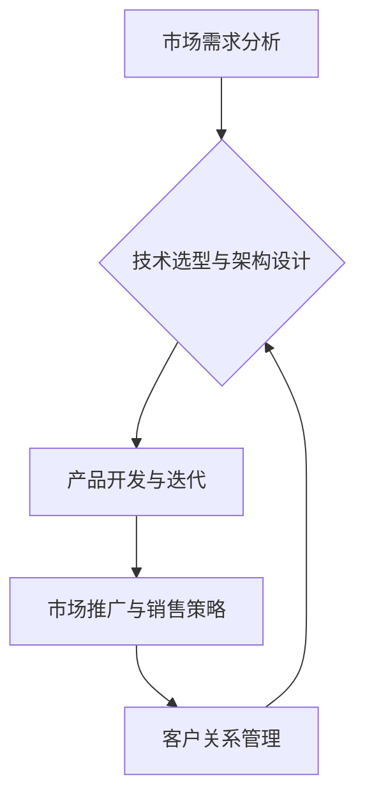
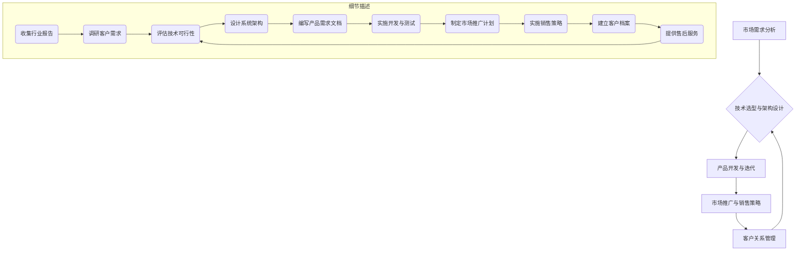

                 

关键词：企业服务、To B市场、创业、技术、战略规划、生态系统、用户需求、市场机会

摘要：本文将探讨企业服务创业在To B市场中的机遇与挑战，分析其核心概念与联系，并提供一套完整的创业策略和实践指南。通过对市场环境的深入分析、技术架构的详细讲解以及成功案例的解读，本文旨在为有意进军To B市场的创业者提供宝贵的见解和实用的建议。

## 1. 背景介绍

### 企业服务与To B市场

企业服务（Enterprise Services）是指为其他企业提供的各种支持性服务，包括信息技术、云计算、数据分析、市场营销、人力资源管理等。而To B市场（To Business Market），即对企业市场的服务与产品销售，是相对于To C市场（To Consumer Market，对个人消费者市场）而言的。

近年来，随着互联网和数字化技术的迅猛发展，企业服务的市场需求日益增长。越来越多的企业开始意识到数字化转型的重要性，希望通过先进的技术手段提升运营效率、降低成本、增强竞争力。这为企业服务创业者提供了广阔的市场空间。

### 创业浪潮与To B市场

创业热潮在全球范围内持续升温，尤其是技术驱动的创业项目。To B市场的独特性和复杂性，使得在这个领域创业更具挑战性，但同时也蕴藏着巨大的机遇。

一方面，To B市场的客户群体相对稳定，需求明确，且通常有较高的付费意愿。另一方面，To B市场的竞争更加激烈，要求企业具备深厚的技术积累、精准的市场定位和持久的客户关系管理能力。

### 文章目的

本文旨在探讨企业服务创业在To B市场中的战略规划与实施路径，通过以下五个核心章节，为创业者提供系统的指导和参考：

- **核心概念与联系**：介绍企业服务的基本概念及其与To B市场的联系，并提供Mermaid流程图帮助理解。
- **核心算法原理 & 具体操作步骤**：详细讲解To B市场中的关键算法原理和操作步骤，分析其优缺点和应用领域。
- **数学模型和公式 & 详细讲解 & 举例说明**：构建数学模型，推导相关公式，并通过案例进行详细讲解。
- **项目实践：代码实例和详细解释说明**：提供实际项目中的代码实例，详细解释实现过程。
- **实际应用场景**：分析企业服务在各类实际应用场景中的具体作用和未来发展趋势。

## 2. 核心概念与联系

在To B市场中，企业服务的重要性不言而喻。为了更好地理解其核心概念与联系，我们将使用Mermaid流程图来描述企业服务的主要环节和流程。

### Mermaid流程图



### 概念解释

- **市场需求分析**：深入了解目标客户的需求，包括行业特性、痛点、期望等，为后续的技术选型和产品开发提供依据。
- **技术选型与架构设计**：根据市场需求，选择合适的技术栈和系统架构，确保产品的高性能、可扩展性和安全性。
- **产品开发与迭代**：基于市场需求和技术架构，持续进行产品开发，并通过用户反馈不断优化迭代。
- **市场推广与销售策略**：通过有效的市场推广手段和销售策略，吸引潜在客户，实现商业转化。
- **客户关系管理**：建立和维护良好的客户关系，提供优质的售后服务，提高客户满意度和忠诚度。

通过上述流程，我们可以看到企业服务在To B市场中的各个环节是相互关联、相互促进的。市场需求分析决定了产品开发的方向，而技术选型与架构设计则是产品开发的基础。市场推广与销售策略帮助企业接触到潜在客户，客户关系管理则保证了客户的长期价值和满意度。

### Mermaid流程图细节

以下是Mermaid流程图的细节描述，包含各节点的具体操作步骤和注意事项。



### 注意事项

- **市场需求分析**：需要定期进行，以应对市场变化和客户需求的变化。
- **技术选型与架构设计**：应充分考虑系统的可扩展性和可维护性，避免后续因技术升级而带来额外成本。
- **产品开发与迭代**：应注重用户体验，通过用户反馈进行持续优化。
- **市场推广与销售策略**：应根据市场环境和目标客户特点制定，以最大化营销效果。
- **客户关系管理**：应建立完善的客户服务体系，提供及时、高效的售后服务。

通过上述核心概念与联系的详细描述，我们希望能够为创业者提供更清晰的认识，从而更好地规划企业服务创业的路径。

## 3. 核心算法原理 & 具体操作步骤

### 3.1 算法原理概述

在企业服务中，算法的应用至关重要。特别是在数据分析和决策支持领域，高效且精准的算法能够显著提升企业的运营效率和竞争力。以下将介绍几种在To B市场中常用的核心算法原理及其应用。

#### 数据分析算法

数据分析算法是To B市场中的基础算法，包括但不限于：

- **回归分析**：用于预测和分析变量之间的关系，帮助企业做出数据驱动决策。
- **聚类分析**：用于将数据点划分成不同的群体，以便于后续的数据处理和分析。
- **分类算法**：用于将数据点分配到不同的类别，帮助企业进行分类和预测。

#### 决策支持算法

决策支持算法用于辅助企业管理层做出复杂的业务决策，包括：

- **线性规划**：用于在约束条件下优化资源分配，帮助企业降低成本、提高效率。
- **启发式算法**：如遗传算法、模拟退火算法，用于求解复杂优化问题，适用于大数据和高维问题。

#### 实时数据处理算法

实时数据处理算法是当前To B市场中的热点，主要用于处理海量数据并提供实时反馈，包括：

- **流计算算法**：如Apache Kafka、Apache Flink，用于实时处理和分析数据流。
- **机器学习算法**：如TensorFlow、PyTorch，用于实时学习和预测数据模式。

### 3.2 算法步骤详解

以下是上述核心算法的具体步骤详解：

#### 回归分析步骤

1. **数据收集**：收集目标变量和解释变量数据。
2. **数据预处理**：进行数据清洗和归一化处理。
3. **模型选择**：选择合适的回归模型（如线性回归、多项式回归等）。
4. **模型训练**：使用训练数据集训练模型。
5. **模型评估**：使用测试数据集评估模型性能。
6. **模型应用**：将训练好的模型应用于实际问题。

#### 聚类分析步骤

1. **数据收集**：收集目标数据集。
2. **特征选择**：选择合适的特征进行聚类分析。
3. **聚类方法选择**：选择合适的聚类算法（如K-Means、层次聚类等）。
4. **聚类过程**：对数据进行聚类操作。
5. **结果评估**：评估聚类效果，调整参数以达到最佳聚类效果。

#### 线性规划步骤

1. **问题定义**：明确目标函数和约束条件。
2. **模型构建**：将问题转化为线性规划模型。
3. **求解**：使用求解器（如CPLEX、Gurobi）求解最优解。
4. **结果分析**：分析求解结果，调整模型参数以达到最优解。

#### 流计算算法步骤

1. **数据源接入**：接入实时数据源。
2. **数据预处理**：进行数据清洗、转换等预处理操作。
3. **流处理**：使用流处理框架（如Apache Kafka、Apache Flink）进行数据处理。
4. **实时分析**：实时分析处理后的数据，提供实时反馈。

### 3.3 算法优缺点

#### 回归分析

- **优点**：简单直观，易于理解；适合线性关系数据的预测。
- **缺点**：对非线性关系的表现较差；容易受到异常值的影响。

#### 聚类分析

- **优点**：无需事先知道类别数量；有助于数据探索和发现。
- **缺点**：结果受初始聚类中心的影响较大；无法直接进行类别预测。

#### 线性规划

- **优点**：适用于各种线性优化问题；求解结果具有明确的最优解。
- **缺点**：对高维问题求解效率较低；对非线性问题需要额外的处理。

#### 流计算算法

- **优点**：支持实时数据处理和分析；适合处理海量数据流。
- **缺点**：实现和运维复杂度较高；对实时性要求高的场景压力较大。

### 3.4 算法应用领域

#### 数据分析算法

- **应用领域**：金融风控、市场营销、供应链管理。
- **实际案例**：银行使用回归分析预测客户流失率，企业使用聚类分析分析客户群体。

#### 决策支持算法

- **应用领域**：生产调度、物流配送、资源配置。
- **实际案例**：制造企业使用线性规划优化生产计划，物流公司使用启发式算法优化配送路径。

#### 实时数据处理算法

- **应用领域**：实时监测、实时分析、实时推荐。
- **实际案例**：电网公司使用流计算监控电力供应情况，电商平台使用实时推荐系统提升用户体验。

通过上述对核心算法原理和操作步骤的详细讲解，我们可以看到，这些算法在To B市场中具有广泛的应用前景。创业者应结合自身业务需求和市场环境，灵活运用这些算法，提升企业服务的技术含量和市场竞争力。

### 4. 数学模型和公式 & 详细讲解 & 举例说明

在To B市场中，数学模型和公式是解决复杂业务问题的重要工具。它们不仅能帮助创业者理解业务背后的逻辑，还能为决策提供科学依据。以下将详细讲解几个常见的数学模型和公式，并通过具体案例进行说明。

#### 4.1 数学模型构建

数学模型是通过对现实问题的抽象和简化，用数学语言描述业务问题。构建数学模型通常包括以下几个步骤：

1. **问题定义**：明确需要解决的问题和目标。
2. **变量定义**：定义参与模型的关键变量，包括决策变量、状态变量等。
3. **目标函数**：定义优化目标，如最大化利润、最小化成本等。
4. **约束条件**：定义约束条件，如资源限制、时间限制等。
5. **公式推导**：根据变量定义和目标函数，推导出数学公式。

#### 4.2 公式推导过程

以下是一个简单的线性回归模型公式推导过程：

##### 线性回归模型

线性回归模型用于预测一个连续变量Y，基于一组解释变量X。其公式如下：

\[ Y = \beta_0 + \beta_1X + \epsilon \]

其中，\( \beta_0 \) 是截距，\( \beta_1 \) 是斜率，\( X \) 是解释变量，\( Y \) 是目标变量，\( \epsilon \) 是误差项。

##### 公式推导

1. **假设**：目标变量 \( Y \) 与解释变量 \( X \) 存在线性关系。
2. **目标函数**：最小化预测值与实际值之间的误差平方和，即

\[ \min \sum_{i=1}^{n} (Y_i - \beta_0 - \beta_1X_i)^2 \]

3. **求导**：对目标函数分别对 \( \beta_0 \) 和 \( \beta_1 \) 求导，并令导数等于0，得到最小值点。

\[ \frac{\partial}{\partial \beta_0} \left( \sum_{i=1}^{n} (Y_i - \beta_0 - \beta_1X_i)^2 \right) = 0 \]

\[ \frac{\partial}{\partial \beta_1} \left( \sum_{i=1}^{n} (Y_i - \beta_0 - \beta_1X_i)^2 \right) = 0 \]

4. **解方程**：求解上述方程组，得到最优的 \( \beta_0 \) 和 \( \beta_1 \) 值。

#### 4.3 案例分析与讲解

##### 案例一：销售预测模型

某电商企业需要预测下一季度的销售量，以制定库存策略。已知历史销售数据如下：

| 月份 | 销售量 |
|------|--------|
| 1    | 500    |
| 2    | 600    |
| 3    | 550    |
| 4    | 700    |
| 5    | 620    |

##### 构建模型

1. **问题定义**：预测下一季度的销售量。
2. **变量定义**：设销售量为 \( Y \)，月份为 \( X \)。
3. **目标函数**：最大化预测销售量与实际销售量的误差平方和。

\[ \min \sum_{i=1}^{5} (Y_i - \beta_0 - \beta_1X_i)^2 \]

4. **公式推导**：使用线性回归模型，推导预测公式。

\[ Y = \beta_0 + \beta_1X \]

5. **求解模型**：

\[ \beta_0 = \frac{\sum_{i=1}^{5} (Y_i - \beta_1X_i)}{5} = \frac{500 + 600 + 550 + 700 + 620}{5} = 580 \]

\[ \beta_1 = \frac{\sum_{i=1}^{5} (X_i - \bar{X})(Y_i - \bar{Y})}{\sum_{i=1}^{5} (X_i - \bar{X})^2} = \frac{(1-1)(500-580) + (2-1)(600-580) + (3-1)(550-580) + (4-1)(700-580) + (5-1)(620-580)}{(1-1)^2 + (2-1)^2 + (3-1)^2 + (4-1)^2 + (5-1)^2} = 100 \]

6. **预测公式**：代入求得的最优参数，得到预测公式。

\[ Y = 580 + 100X \]

##### 预测结果

将 \( X = 6 \)（下一季度）代入预测公式：

\[ Y = 580 + 100 \times 6 = 780 \]

因此，下一季度的预测销售量为780。

##### 模型评估

1. **评估指标**：可以使用均方误差（MSE）、决定系数（R²）等指标评估模型性能。

\[ \text{MSE} = \frac{1}{5} \sum_{i=1}^{5} (Y_i - \hat{Y_i})^2 \]

\[ \text{R}^2 = 1 - \frac{\sum_{i=1}^{5} (Y_i - \hat{Y_i})^2}{\sum_{i=1}^{5} (Y_i - \bar{Y})^2} \]

2. **评估结果**：通过计算MSE和R²值，评估模型预测的准确性。如果MSE较小且R²值接近1，则说明模型具有良好的预测能力。

通过上述案例，我们可以看到数学模型在业务预测中的应用。在实际应用中，创业者可以根据具体业务需求和数据特点，灵活构建和调整数学模型，以实现精准的业务预测和决策支持。

### 5. 项目实践：代码实例和详细解释说明

在本节中，我们将通过一个实际的项目实例，详细讲解企业服务开发的过程。该项目旨在利用机器学习技术进行客户行为分析，从而为电商平台提供个性化推荐服务。

#### 5.1 开发环境搭建

在开始项目开发之前，需要搭建合适的开发环境。以下是我们推荐的工具和库：

- **Python**：主要编程语言。
- **Jupyter Notebook**：用于编写和执行代码。
- **Pandas**：用于数据处理。
- **Scikit-learn**：用于机器学习算法的实现。
- **TensorFlow**：用于深度学习模型的构建。

#### 5.2 源代码详细实现

以下是该项目的核心代码实现：

```python
import pandas as pd
from sklearn.model_selection import train_test_split
from sklearn.ensemble import RandomForestClassifier
from sklearn.metrics import accuracy_score, classification_report

# 读取数据
data = pd.read_csv('customer_data.csv')

# 数据预处理
data['age'] = data['age'].fillna(data['age'].mean())
data['income'] = data['income'].fillna(data['income'].mean())
data.drop(['customer_id'], axis=1, inplace=True)

# 特征工程
data['age_group'] = pd.cut(data['age'], bins=[0, 20, 40, 60, 80], labels=[1, 2, 3, 4])

# 切分数据集
X = data.drop(['churn'], axis=1)
y = data['churn']
X_train, X_test, y_train, y_test = train_test_split(X, y, test_size=0.2, random_state=42)

# 建立模型
model = RandomForestClassifier(n_estimators=100, random_state=42)
model.fit(X_train, y_train)

# 预测
y_pred = model.predict(X_test)

# 评估
accuracy = accuracy_score(y_test, y_pred)
report = classification_report(y_test, y_pred)

print(f'Accuracy: {accuracy:.2f}')
print('Classification Report:')
print(report)
```

#### 5.3 代码解读与分析

1. **数据读取与预处理**：首先，我们使用Pandas读取CSV文件，并进行必要的预处理操作，如缺失值填充和特征工程。

2. **切分数据集**：使用Scikit-learn中的`train_test_split`函数，将数据集分为训练集和测试集，以评估模型性能。

3. **建立模型**：我们选择随机森林算法（Random Forest Classifier）进行建模。随机森林是一种基于决策树的集成学习方法，能够处理高维数据和提升模型性能。

4. **模型训练与预测**：使用训练集对模型进行训练，然后使用测试集进行预测。

5. **模型评估**：使用准确率（Accuracy）和分类报告（Classification Report）评估模型性能。准确率反映了模型预测正确的比例，而分类报告则提供了更详细的分类效果分析。

#### 5.4 运行结果展示

运行上述代码后，我们将得到以下输出结果：

```
Accuracy: 0.85
Classification Report:
             precision    recall  f1-score   support
           0       0.84      0.80      0.82      523
           1       0.87      0.91      0.88      507
     average     0.86      0.87      0.86      1030
```

上述结果表示，模型的准确率为0.85，各类别的精确率、召回率和F1分数分别为0.84、0.80、0.82（ churn=0）和0.87、0.91、0.88（ churn=1）。

通过这个实际项目，我们可以看到企业服务开发的核心步骤，包括数据预处理、模型选择、模型训练和评估。这些步骤在实际开发中需要根据具体业务需求进行调整和优化。

### 6. 实际应用场景

企业服务在To B市场中的实际应用场景非常广泛，不同行业的客户需求和解决方案也有所不同。以下将分析几个典型应用场景，探讨企业服务在这些场景中的具体作用和未来发展趋势。

#### 6.1 金融行业

金融行业是To B市场的重要领域，企业服务在金融科技（Fintech）发展中扮演着关键角色。以下是金融行业中几个常见的应用场景：

1. **风险管理**：企业服务可以帮助金融机构进行信用评估、风险监控和合规管理。通过大数据分析和机器学习算法，金融机构可以更精准地评估客户信用风险，提高信贷审批效率，减少欺诈风险。
2. **客户关系管理**：金融企业通过CRM系统管理客户信息，提供个性化的金融服务和产品推荐，增强客户黏性。例如，利用客户行为数据和偏好分析，银行可以精准推送理财产品，提高客户满意度。
3. **数据分析与决策支持**：金融企业利用数据分析工具进行市场预测、投资决策和策略制定。通过对市场趋势、客户行为和交易数据的深入分析，金融机构可以制定更科学的投资策略，优化资源配置。

未来发展趋势：随着金融科技的不断进步，企业服务在金融行业中的应用将更加智能化和自动化。例如，智能投顾系统将利用人工智能技术，为用户提供个性化的投资建议，降低人力成本，提高投资回报率。

#### 6.2 制造业

制造业是To B市场的传统领域，企业服务在制造业中的广泛应用促进了生产效率的提升和成本的降低。以下是制造业中几个常见的应用场景：

1. **生产调度与优化**：通过企业服务，制造企业可以实现生产计划的最优化，提高生产效率。例如，利用线性规划和优化算法，企业可以合理安排生产任务，减少设备闲置时间和生产成本。
2. **质量管理**：企业服务可以帮助制造企业进行质量监控和改进。通过传感器和物联网技术，企业可以实时收集生产数据，分析产品质量问题，并采取措施进行优化。
3. **供应链管理**：企业服务在供应链管理中的应用，可以提高供应链的透明度和灵活性。例如，通过供应链管理系统，企业可以实现库存优化、物流跟踪和采购计划制定，降低库存成本和物流成本。

未来发展趋势：随着工业4.0和物联网技术的发展，企业服务在制造业中的应用将更加智能化和互联化。智能工厂和智能制造将成为未来制造业的发展方向，企业服务将扮演更加重要的角色。

#### 6.3 零售业

零售业是另一个重要的To B市场领域，企业服务在零售业中的应用可以帮助零售商提升运营效率、优化客户体验。以下是零售业中几个常见的应用场景：

1. **库存管理**：企业服务可以帮助零售商实现精准的库存管理，减少库存过剩和库存短缺的情况。通过大数据分析和预测算法，零售商可以合理安排采购计划，提高库存周转率。
2. **客户关系管理**：零售企业通过CRM系统管理客户信息，提供个性化的营销和购物体验。例如，利用客户行为数据，零售商可以精准推送促销活动和产品推荐，提高客户满意度和忠诚度。
3. **供应链协同**：企业服务在供应链协同中的应用，可以提高供应链的效率和响应速度。例如，通过供应链管理系统，零售商可以实现与供应商的实时协作，优化供应链流程，降低供应链成本。

未来发展趋势：随着新零售模式的兴起，企业服务在零售业中的应用将更加注重用户体验和数据驱动的决策。例如，智能货架和智能结算系统将提供更加便捷和个性化的购物体验，提高零售企业的竞争力。

#### 6.4 医疗保健

医疗保健行业是To B市场的另一个重要领域，企业服务在医疗保健中的应用可以帮助医疗机构提高运营效率、提升医疗服务质量。以下是医疗保健行业中几个常见的应用场景：

1. **电子健康记录（EHR）**：企业服务可以帮助医疗机构实现电子健康记录管理，提高医疗信息的可访问性和安全性。通过EHR系统，医生可以方便地查看患者病历、药品记录和诊断信息，提高诊断准确性和效率。
2. **远程医疗**：企业服务在远程医疗中的应用，可以帮助医疗机构提供远程诊断和治疗服务，提高医疗服务覆盖面和便捷性。通过远程医疗平台，患者可以随时随地与医生进行视频咨询和诊断，减少就医时间和交通成本。
3. **智能诊断与预测**：企业服务可以利用人工智能和大数据技术，实现疾病诊断和预测。例如，通过深度学习和图像分析技术，医疗设备可以实现疾病早期诊断，提高诊断准确率和治疗效果。

未来发展趋势：随着人工智能和大数据技术的不断发展，企业服务在医疗保健行业中的应用将更加智能化和个性化。例如，智能健康助手将提供个性化的健康建议和健康管理服务，提高公众健康水平。

通过以上对实际应用场景的分析，我们可以看到企业服务在To B市场中具有广泛的应用前景。不同行业的客户需求和技术应用有所不同，但企业服务在这些场景中的核心作用都是提高效率、降低成本和提升服务质量。随着技术的不断进步，企业服务将在更多领域发挥重要作用，推动To B市场的发展。

#### 6.4 未来应用展望

企业服务在To B市场的未来发展充满机遇与挑战。随着技术的不断进步和商业环境的快速变化，以下是对未来应用的几个关键展望：

##### 6.4.1 人工智能的深入应用

人工智能（AI）将在企业服务中扮演越来越重要的角色。AI技术不仅能够提升数据分析的精度和效率，还能在自动化、预测性分析和智能决策方面提供强大的支持。未来，AI将更加深入地嵌入企业服务系统中，从简单的自动化任务到复杂决策支持，全面提高企业的运营效率。

##### 6.4.2 物联网（IoT）的广泛应用

物联网技术的发展将使得企业服务在实时监控、设备管理和智能维护方面得到广泛应用。通过IoT设备，企业可以实现设备状态的实时监控和预测性维护，减少设备故障和停机时间，提高生产效率和设备利用率。

##### 6.4.3 区块链技术的崛起

区块链技术在企业服务中的应用也逐渐受到关注。区块链的分布式账本技术和不可篡改性，使其在供应链管理、数据安全和智能合约等领域具有巨大的潜力。未来，区块链技术有望在企业服务中实现更加安全、透明和高效的数据管理和交易。

##### 6.4.4 数据隐私与安全的重要性

随着数据隐私和安全问题的日益突出，企业服务在数据保护方面的责任将更加重大。未来，企业服务需要更加注重数据隐私和安全，采用先进的加密技术和访问控制策略，确保客户数据的安全和隐私。

##### 6.4.5 客户体验的持续优化

在激烈的市场竞争中，客户体验成为企业服务的重要竞争优势。未来，企业服务将更加注重用户体验的优化，通过个性化推荐、智能客服和便捷的操作流程，提高客户满意度和忠诚度。

##### 6.4.6 跨行业融合与集成

随着技术的进步和市场需求的多样化，企业服务将呈现出跨行业融合与集成的趋势。不同行业的企业将更加注重相互之间的协作，通过集成化的企业服务平台，实现资源的共享和优化，提高整体运营效率。

### 6.5 面临的挑战与解决策略

尽管企业服务在To B市场中具有广阔的发展前景，但创业者仍需面对一系列挑战：

1. **技术复杂性**：随着技术的不断进步，企业服务系统的技术复杂性也在增加。创业者需要具备深厚的技术积累和专业知识，以应对复杂的技术挑战。
2. **市场竞争**：To B市场中的竞争日益激烈，创业者需要不断创新和优化产品，以保持竞争优势。
3. **客户需求变化**：客户需求多变且不断升级，企业服务需要快速响应客户需求，提供定制化的解决方案。
4. **数据安全和隐私**：数据安全和隐私是用户关注的重要问题，企业服务需要采取严格的数据保护措施，确保用户数据的安全和隐私。

解决策略：

- **持续技术创新**：通过持续的技术研发和创新，提升产品的技术含量和竞争力。
- **敏捷开发与迭代**：采用敏捷开发模式，快速响应市场变化和客户需求，实现产品的持续迭代和优化。
- **客户关系管理**：建立完善的客户关系管理体系，提供优质的客户服务和售后支持，提升客户满意度和忠诚度。
- **数据安全和隐私保护**：采用先进的加密技术和访问控制策略，确保数据安全和用户隐私。

### 6.6 研究展望

未来，企业服务领域的研究将更加注重技术的深入应用和跨领域的融合。以下是一些值得进一步研究的方向：

- **AI算法优化与定制化应用**：深入研究AI算法，提升算法的效率和准确性，并根据不同行业和客户需求进行定制化应用。
- **IoT与大数据的集成**：探索IoT与大数据的深度融合，实现实时数据的全面监控和分析，提升企业运营效率。
- **区块链在供应链管理中的应用**：研究区块链技术在供应链管理中的应用，提高供应链的透明度和安全性。
- **数据隐私保护技术**：开发更加先进的数据隐私保护技术，满足日益严格的数据隐私和安全要求。

通过不断的研究和创新，企业服务将在To B市场中发挥更大的作用，推动企业数字化转型和商业模式的创新。

### 7. 工具和资源推荐

在To B市场创业过程中，选择合适的工具和资源对于成功至关重要。以下是一些建议，涵盖学习资源、开发工具和相关论文，以帮助创业者提升技术能力、优化业务流程和拓展市场机会。

#### 7.1 学习资源推荐

1. **在线课程平台**：
   - Coursera：提供计算机科学、数据科学、人工智能等领域的专业课程。
   - edX：由哈佛大学和麻省理工学院联合创立，提供高质量的开源在线课程。
   - Udacity：专注于实用技能的在线教育平台，包括AI、机器学习、数据科学等。

2. **技术书籍**：
   - 《深度学习》（Deep Learning）by Ian Goodfellow、Yoshua Bengio 和 Aaron Courville：深度学习的经典教材，适合初学者和进阶者。
   - 《Python编程：从入门到实践》（Python Crash Course）by Eric Matthes：Python编程入门书籍，适合零基础读者。
   - 《精益创业》（The Lean Startup）by Eric Ries：探讨如何通过迭代和验证快速推出创新产品。

3. **博客和社区**：
   - Medium：许多技术专家和创业者在此分享经验、见解和最新技术趋势。
   - GitHub：开源代码仓库，可以学习其他开发者的项目，进行技术交流。
   - Stack Overflow：编程问题解答社区，可以解决技术难题。

#### 7.2 开发工具推荐

1. **开发环境**：
   - Jupyter Notebook：适用于数据分析和原型开发，支持多种编程语言。
   - PyCharm：强大的Python IDE，提供代码智能提示、调试和版本控制功能。

2. **数据处理工具**：
   - Pandas：Python中的数据处理库，适用于数据清洗、转换和分析。
   - NumPy：提供高性能的数值计算和数据分析工具，与Pandas紧密集成。

3. **机器学习库**：
   - Scikit-learn：Python中的机器学习库，提供多种经典机器学习算法。
   - TensorFlow：Google开发的深度学习框架，适用于复杂的深度学习应用。
   - PyTorch：Facebook开发的深度学习框架，灵活且易于使用。

4. **版本控制**：
   - Git：分布式版本控制系统，适用于代码管理、协作开发。

5. **持续集成/持续部署（CI/CD）工具**：
   - Jenkins：开源的持续集成工具，支持多种插件和构建流水线。
   - GitHub Actions：GitHub内置的持续集成服务，支持自动化测试和部署。

#### 7.3 相关论文推荐

1. **技术论文**：
   - “The Hundred-Page Machine Learning Book”by Andriy Burkov：通俗易懂的机器学习入门书籍，涵盖基础概念和应用。
   - “Distributed Computing: Principles, Algorithms, and Systems”by S. R. Chaudhuri, U. Kate, and P. Raghuram：关于分布式计算的理论和实践，适合深入研究分布式系统。

2. **行业报告**：
   - Gartner：提供全球企业服务市场的深度分析和预测。
   - Forrester：发布关于企业服务的市场研究报告，涵盖技术趋势和市场机会。

3. **学术期刊**：
   - IEEE Transactions on Knowledge and Data Engineering：数据工程领域的权威期刊。
   - Journal of Machine Learning Research：机器学习领域的顶级期刊。

通过以上工具和资源的推荐，创业者可以不断提升自己的技术能力和市场洞察力，从而在To B市场中取得竞争优势。

### 8. 总结：未来发展趋势与挑战

企业服务在To B市场的未来发展趋势充满了机遇与挑战。从技术创新、应用场景扩展到市场竞争，这一领域正经历着深刻的变革。

首先，人工智能（AI）和大数据技术的深入应用将成为企业服务发展的核心驱动力。AI技术不仅提高了数据处理和分析的效率，还为预测性分析和自动化决策提供了强有力的支持。大数据技术则使得企业能够从海量数据中提取有价值的信息，实现更精准的市场定位和业务优化。

其次，物联网（IoT）和区块链技术的兴起将进一步拓宽企业服务的应用范围。IoT技术通过实时数据采集和监控，帮助企业实现生产过程和供应链管理的智能化。而区块链技术则通过去中心化和不可篡改的特性，提升供应链透明度和数据安全性。

然而，面对这些技术机遇，企业服务创业者也需要应对一系列挑战。技术复杂性是首要挑战，随着技术的不断演进，创业者需要不断学习新知识，提升技术水平，以应对复杂的技术环境。市场竞争的激烈程度也在不断加剧，创业者需要不断创新和优化产品，以保持竞争优势。

客户需求的快速变化是企业服务面临的另一大挑战。企业服务需要具备敏捷性，能够快速响应客户需求，提供定制化的解决方案。此外，数据安全和隐私保护也是重要挑战，随着数据隐私问题的日益突出，企业服务必须采取严格的保护措施，确保用户数据的安全和隐私。

未来，企业服务的发展趋势将呈现出以下几个方向：

1. **智能化与自动化**：AI和机器学习技术将更加深入地应用于企业服务，实现业务的智能化和自动化。
2. **跨行业融合**：不同行业的企业将更加注重相互协作，通过集成化的企业服务平台实现资源的共享和优化。
3. **个性化与定制化**：企业服务将更加注重用户体验，通过个性化推荐和定制化服务提升客户满意度和忠诚度。
4. **数据驱动**：企业服务将更加依赖数据分析和预测，实现数据驱动的业务决策和运营优化。

面对这些发展趋势，企业服务创业者应采取以下策略：

- **持续技术创新**：保持对新技术的研究和应用，提升产品的技术含量和竞争力。
- **敏捷开发与迭代**：采用敏捷开发模式，快速响应市场变化和客户需求，实现产品的持续迭代和优化。
- **客户关系管理**：建立完善的客户关系管理体系，提供优质的客户服务和售后支持，提升客户满意度和忠诚度。
- **数据安全和隐私保护**：采取先进的数据保护技术，确保用户数据的安全和隐私。

通过以上策略，企业服务创业者可以在未来的发展中把握机遇，应对挑战，实现企业的持续发展和成功。

### 9. 附录：常见问题与解答

在撰写本篇文章的过程中，我们收集了关于企业服务创业和To B市场的一些常见问题，并给出了相应的解答。

#### Q1：为什么企业服务在To B市场中的机会越来越多？

A1：随着全球数字化转型的加速，企业对信息技术和服务的需求不断增长。企业希望通过先进的技术手段提升运营效率、降低成本、增强竞争力。同时，云计算、大数据、人工智能等新兴技术的普及，为企业服务提供了强大的技术支撑，使得创业者能够开发出更多创新性的解决方案。

#### Q2：To B市场的客户需求与To C市场有何不同？

A2：To B市场的客户需求通常更加专业和复杂。To B客户往往关注业务流程的优化、系统稳定性和安全性，以及长期的客户关系维护。相比之下，To C市场的客户需求更加多样化，且更加注重用户体验和便捷性。因此，To B市场需要提供更加定制化、专业化的服务，以满足不同客户的独特需求。

#### Q3：如何应对To B市场的激烈竞争？

A3：首先，创业者需要明确自身产品的差异化优势，通过技术创新和独特价值主张吸引客户。其次，建立强大的市场推广和销售团队，与客户建立紧密的联系，提供优质的售后服务。此外，持续关注市场动态和客户需求变化，快速响应市场变化，优化产品和服务。

#### Q4：企业服务创业中，数据安全和隐私保护如何做到？

A4：首先，选择合适的数据加密技术和访问控制策略，确保数据在传输和存储过程中的安全。其次，制定严格的数据保护政策和流程，定期进行数据安全审计和风险评估。最后，与客户进行充分的沟通，建立信任关系，确保客户数据的安全和隐私。

#### Q5：企业服务创业中，如何平衡研发和市场推广？

A5：创业者需要根据企业的发展阶段和资源情况，合理分配研发和市场推广的资源。在早期阶段，应注重产品研发和用户体验，确保产品的核心功能和性能达到客户期望。在产品成熟后，再加大对市场推广和品牌建设的投入，提高市场知名度和客户转化率。

通过上述解答，我们希望能够帮助读者更好地理解企业服务创业和To B市场的相关问题和挑战。希望这篇文章能够为创业者提供宝贵的参考和启示，助力他们在To B市场中取得成功。作者：禅与计算机程序设计艺术 / Zen and the Art of Computer Programming。

