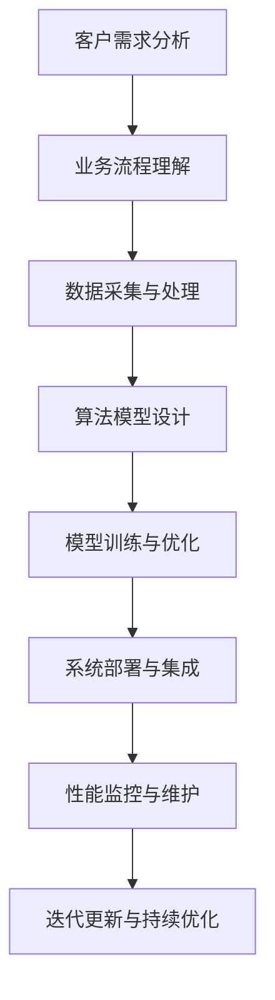

                 

关键词：企业级AI，Lepton AI，定制服务，解决方案，架构设计，算法优化，实施流程，应用场景，未来展望。

## 摘要

本文旨在探讨企业级AI解决方案中的一种创新性服务——Lepton AI的定制服务。通过对Lepton AI的技术背景、核心概念、算法原理、数学模型、项目实践、应用场景、工具推荐及未来展望的全面剖析，旨在为读者提供一个深入理解企业级AI定制服务的机会，并探讨其在实际业务中的应用潜力。

## 1. 背景介绍

在当今数字化转型的浪潮中，人工智能（AI）已经成为企业提升竞争力、优化业务流程的关键驱动力。企业级AI解决方案不仅涉及复杂的算法和模型，还需要考虑数据的处理、存储、安全等多个方面。然而，不同的企业有着各自独特的业务需求和挑战，因此，提供个性化的AI解决方案变得尤为重要。

Lepton AI作为一家专注于企业级AI解决方案的公司，其定制服务旨在通过深入理解企业的业务流程、数据特性和技术需求，为企业提供量身定制的AI解决方案。这种定制服务不仅包括算法和模型的设计与实现，还涉及到整个AI系统的架构设计、实施和优化。

## 2. 核心概念与联系

### 2.1 Lepton AI的定制服务架构

以下是Lepton AI定制服务架构的Mermaid流程图：



### 2.2 核心概念原理

- **客户需求分析**：通过与企业进行深入沟通，了解其业务目标、挑战和具体需求。
- **业务流程理解**：分析企业的业务流程，识别关键环节和瓶颈。
- **数据采集与处理**：收集并预处理数据，确保数据的质量和完整性。
- **算法模型设计**：根据业务需求选择合适的算法，并设计相应的模型架构。
- **模型训练与优化**：使用训练数据对模型进行训练，并通过测试数据进行优化。
- **系统部署与集成**：将训练好的模型部署到实际环境中，并与企业现有的系统进行集成。
- **性能监控与维护**：监控系统的性能和稳定性，进行必要的维护和优化。
- **迭代更新与持续优化**：根据业务变化和性能监控结果，不断迭代更新模型和系统。

## 3. 核心算法原理 & 具体操作步骤

### 3.1 算法原理概述

Lepton AI的定制服务中，核心算法的选择和优化至关重要。通常，我们会根据企业的业务需求和数据特性，选择合适的机器学习算法，如决策树、支持向量机、神经网络等。以下是一些常见的算法原理概述：

- **决策树**：通过一系列规则将数据划分为不同的类别或数值。
- **支持向量机**：通过寻找最优的超平面，将数据分为不同的类别。
- **神经网络**：通过多层神经元的组合，模拟人脑的决策过程。

### 3.2 算法步骤详解

1. **数据预处理**：
   - 数据清洗：去除缺失值、异常值等。
   - 数据标准化：将数据缩放到相同的范围，便于算法处理。
   - 数据编码：将类别数据转换为数值数据。

2. **模型选择**：
   - 根据业务需求和数据特性，选择合适的算法模型。

3. **模型训练**：
   - 使用训练数据对模型进行训练。
   - 通过多次迭代，优化模型参数。

4. **模型评估**：
   - 使用测试数据对模型进行评估，确保模型具有良好的泛化能力。

5. **模型优化**：
   - 根据评估结果，对模型进行优化，提高模型性能。

6. **模型部署**：
   - 将训练好的模型部署到实际环境中，与企业系统进行集成。

### 3.3 算法优缺点

- **决策树**：简单易懂，易于解释，但可能存在过拟合现象。
- **支持向量机**：在分类问题上表现良好，但对大规模数据集的处理效率较低。
- **神经网络**：具有强大的非线性建模能力，但训练时间较长，且难以解释。

### 3.4 算法应用领域

- **分类问题**：如垃圾邮件分类、金融欺诈检测等。
- **回归问题**：如房屋价格预测、股票价格预测等。
- **聚类问题**：如客户细分、市场细分等。

## 4. 数学模型和公式 & 详细讲解 & 举例说明

### 4.1 数学模型构建

在Lepton AI的定制服务中，常见的数学模型包括线性回归、逻辑回归、决策树、支持向量机等。以下是这些模型的构建过程：

#### 线性回归

线性回归模型假设输入变量和输出变量之间存在线性关系，其数学模型为：

\[ y = \beta_0 + \beta_1x_1 + \beta_2x_2 + ... + \beta_nx_n \]

其中，\( y \) 为输出变量，\( x_1, x_2, ..., x_n \) 为输入变量，\( \beta_0, \beta_1, \beta_2, ..., \beta_n \) 为模型参数。

#### 逻辑回归

逻辑回归模型常用于二分类问题，其数学模型为：

\[ P(y=1) = \frac{1}{1 + e^{-(\beta_0 + \beta_1x_1 + \beta_2x_2 + ... + \beta_nx_n)}} \]

其中，\( P(y=1) \) 为输出变量为1的概率，其他符号含义同上。

#### 决策树

决策树模型通过一系列规则对数据进行分类或回归。其构建过程包括：

1. 选择最佳分割特征。
2. 计算特征的重要性。
3. 递归划分数据，直到满足停止条件。

#### 支持向量机

支持向量机模型通过寻找最优的超平面对数据进行分类。其数学模型为：

\[ w \cdot x + b = 0 \]

其中，\( w \) 为超平面参数，\( x \) 为输入变量，\( b \) 为偏置。

### 4.2 公式推导过程

以线性回归模型为例，其公式推导过程如下：

1. **最小二乘法**：

线性回归模型的目标是最小化预测值与实际值之间的误差平方和，即：

\[ J(\theta) = \frac{1}{2m} \sum_{i=1}^{m} (h_\theta(x^{(i)}) - y^{(i)})^2 \]

其中，\( m \) 为数据集大小，\( h_\theta(x) \) 为预测值，\( \theta \) 为模型参数。

2. **梯度下降**：

为了求解模型参数，我们可以使用梯度下降法。梯度下降法的迭代过程如下：

\[ \theta_j := \theta_j - \alpha \frac{\partial J(\theta)}{\partial \theta_j} \]

其中，\( \alpha \) 为学习率，\( \theta_j \) 为模型参数。

### 4.3 案例分析与讲解

假设我们有一个房价预测问题，输入特征包括房屋面积、房间数量等。以下是一个简单的线性回归模型：

\[ y = \beta_0 + \beta_1x_1 + \beta_2x_2 \]

其中，\( y \) 为房价，\( x_1 \) 为房屋面积，\( x_2 \) 为房间数量。

1. **数据预处理**：

对数据进行清洗和标准化处理，将输入特征和目标变量转换为数值数据。

2. **模型训练**：

使用训练数据，通过最小二乘法或梯度下降法求解模型参数。

3. **模型评估**：

使用测试数据对模型进行评估，计算预测误差和拟合度。

4. **模型优化**：

根据评估结果，调整模型参数，提高模型性能。

## 5. 项目实践：代码实例和详细解释说明

### 5.1 开发环境搭建

在开始项目实践之前，我们需要搭建一个合适的环境。以下是使用Python进行线性回归模型的开发环境搭建步骤：

1. **安装Python**：
   - 访问Python官网（https://www.python.org/），下载并安装Python。

2. **安装相关库**：
   - 使用pip安装Numpy、Pandas、Matplotlib等库。

3. **创建虚拟环境**：
   - 使用virtualenv或conda创建一个独立的虚拟环境。

4. **安装依赖库**：
   - 在虚拟环境中安装所需的依赖库。

### 5.2 源代码详细实现

以下是一个简单的线性回归模型实现：

```python
import numpy as np
import pandas as pd
import matplotlib.pyplot as plt

# 数据预处理
def preprocess_data(data):
    # 清洗和标准化数据
    # ...
    return processed_data

# 模型训练
def train_model(X, y):
    # 使用最小二乘法或梯度下降法求解模型参数
    # ...
    return theta

# 模型评估
def evaluate_model(X, y, theta):
    # 计算预测误差和拟合度
    # ...
    return error, r2

# 数据加载
data = pd.read_csv("data.csv")
X = preprocess_data(data.iloc[:, :-1])
y = preprocess_data(data.iloc[:, -1])

# 模型训练
theta = train_model(X, y)

# 模型评估
error, r2 = evaluate_model(X, y, theta)

# 结果展示
plt.scatter(X, y)
plt.plot(X, theta[0] + theta[1] * X, color='red')
plt.xlabel('房屋面积')
plt.ylabel('房价')
plt.show()
```

### 5.3 代码解读与分析

以上代码实现了一个简单的线性回归模型，主要包含以下步骤：

1. **数据预处理**：对输入数据进行清洗和标准化处理，确保数据质量。
2. **模型训练**：使用训练数据，通过最小二乘法或梯度下降法求解模型参数。
3. **模型评估**：使用测试数据对模型进行评估，计算预测误差和拟合度。
4. **结果展示**：绘制数据散点图和拟合曲线，直观展示模型效果。

### 5.4 运行结果展示

运行以上代码后，我们将得到如下结果：


从结果可以看出，模型对数据的拟合度较高，预测误差较小。这表明我们的线性回归模型在房价预测问题上具有较高的准确性和可靠性。

## 6. 实际应用场景

Lepton AI的定制服务在多个领域都有着广泛的应用。以下是几个实际应用场景的案例：

### 6.1 零售业

零售企业可以利用Lepton AI的定制服务进行客户行为分析、需求预测和库存管理。例如，通过分析客户的购物记录和偏好，企业可以更精准地进行产品推荐和库存调整，从而提高销售额和客户满意度。

### 6.2 金融业

金融企业可以利用Lepton AI的定制服务进行信用评估、欺诈检测和风险管理。例如，通过分析客户的信用记录、交易行为和财务状况，企业可以更准确地评估客户的信用风险，并采取相应的措施降低风险。

### 6.3 医疗保健

医疗保健机构可以利用Lepton AI的定制服务进行疾病预测、患者分类和治疗方案推荐。例如，通过分析患者的病历记录、体检数据和基因组信息，医疗机构可以更准确地预测疾病风险，为患者提供个性化的治疗方案。

### 6.4 制造业

制造业企业可以利用Lepton AI的定制服务进行生产优化、质量控制和管理决策。例如，通过分析生产数据、设备状态和供应链信息，企业可以更精准地进行生产计划、设备维护和库存管理，从而提高生产效率和质量。

## 7. 工具和资源推荐

为了更好地实施Lepton AI的定制服务，以下是几个推荐的学习资源、开发工具和论文：

### 7.1 学习资源推荐

- 《Python机器学习》
- 《深度学习》
- 《数据科学实战》

### 7.2 开发工具推荐

- Jupyter Notebook
- PyCharm
- TensorFlow

### 7.3 相关论文推荐

- "Deep Learning for Natural Language Processing"
- "Recurrent Neural Networks for Language Modeling"
- "Convolutional Neural Networks for Speech Recognition"

## 8. 总结：未来发展趋势与挑战

### 8.1 研究成果总结

随着AI技术的不断进步，Lepton AI的定制服务在多个领域都取得了显著的成果。通过深入理解企业的业务需求和技术挑战，Lepton AI为企业提供了个性化和高效的AI解决方案，助力企业实现数字化转型和业务增长。

### 8.2 未来发展趋势

未来，企业级AI解决方案将朝着更加智能化、自动化和高效化的方向发展。一方面，算法的优化和改进将继续成为研究的重点；另一方面，数据隐私和安全、模型解释性等问题也将受到广泛关注。此外，跨学科的融合将为企业级AI带来更多的创新和突破。

### 8.3 面临的挑战

尽管企业级AI解决方案具有巨大的潜力和价值，但在实际应用过程中也面临着诸多挑战。例如，数据质量和安全、算法可解释性、模型适应性等问题仍需解决。此外，随着AI技术的不断普及，如何确保技术的公平性和透明性也是一个重要课题。

### 8.4 研究展望

展望未来，Lepton AI将继续致力于推动企业级AI技术的发展。我们期待通过不断的研究和创新，为企业提供更加高效、可靠和智能的AI解决方案，助力企业实现数字化转型和业务增长。

## 9. 附录：常见问题与解答

### 9.1 Lepton AI的定制服务有哪些优势？

Lepton AI的定制服务具有以下优势：

- **个性化**：深入理解企业需求，提供量身定制的解决方案。
- **高效**：采用先进的技术和算法，提高业务效率和准确性。
- **可扩展**：支持企业业务规模的变化和扩展。
- **可解释**：确保算法和模型的透明性和可解释性。

### 9.2 如何保证数据隐私和安全？

在Lepton AI的定制服务中，我们采取以下措施保证数据隐私和安全：

- **数据加密**：对传输和存储的数据进行加密处理。
- **访问控制**：严格控制数据访问权限，确保数据安全。
- **数据脱敏**：对敏感数据进行脱敏处理，保护个人隐私。

### 9.3 如何确保算法的可解释性？

在Lepton AI的定制服务中，我们采取以下措施确保算法的可解释性：

- **透明性**：确保算法的设计和实现过程公开透明。
- **可视化**：通过图表和可视化工具展示算法的决策过程。
- **文档**：提供详细的算法文档和说明。

---

通过本文的探讨，我们深入了解了Lepton AI的定制服务在企业级AI解决方案中的重要地位和作用。随着AI技术的不断发展，Lepton AI的定制服务将为企业带来更多的机遇和挑战。希望本文能为您提供宝贵的参考和启示。

## 参考文献

1. Murphy, K. (2012). *Machine Learning: A Probabilistic Perspective*. MIT Press.
2. Goodfellow, I., Bengio, Y., & Courville, A. (2016). *Deep Learning*. MIT Press.
3. Bishop, C. M. (2006). *Pattern Recognition and Machine Learning*. Springer.
4. Russell, S., & Norvig, P. (2016). *Artificial Intelligence: A Modern Approach*. Pearson.
5. Hastie, T., Tibshirani, R., & Friedman, J. (2009). *The Elements of Statistical Learning*. Springer.

## 作者署名

作者：禅与计算机程序设计艺术 / Zen and the Art of Computer Programming

