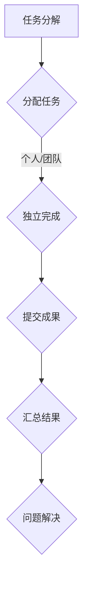

                 

关键词：众包、集体智慧、问题解决、算法、技术、IT领域、项目实践、数学模型、未来展望

> 摘要：本文将探讨众包这一新兴的概念，以及它是如何通过集体智慧的力量来解决各种复杂的问题。我们将分析众包的原理、应用场景，并提供实际的代码实例，帮助读者深入理解这一技术并应用于实际项目中。

## 1. 背景介绍

在互联网时代，信息的爆炸式增长和问题的复杂性使得单凭个人的力量往往难以应对。传统的集中式解决方案在处理大规模、复杂的问题时显得力不从心。这时，众包作为一种新兴的协同工作模式，逐渐引起了广泛关注。众包（Crowdsourcing）是指将一个任务或问题分散到大量独立的个体（即“群众”）中进行解决，通过众人的智慧和努力共同完成任务。这种模式的出现，大大提高了问题解决的效率和质量。

### 1.1 众包的发展历程

众包的概念最早可以追溯到2006年，由Journal of Institute for the Future的众包项目负责人Jeff Howe首次提出。他在一篇文章中详细阐述了众包的原理和应用，指出其能够在短时间内聚集大量分散的智慧，用于解决复杂的任务。近年来，随着互联网技术的发展和大数据的普及，众包应用的范围越来越广泛，从科学研究、产品设计、编程开发到社会公益等领域都有其身影。

### 1.2 众包的优势

众包的优势主要体现在以下几个方面：

- **高效性**：通过将任务分散到大量个体中，可以大大缩短任务完成的时间。
- **多样性**：众包能够聚集不同背景、不同专业领域的智慧，为问题解决提供了更多的可能性。
- **灵活性**：众包模式可以根据任务的性质和需求，灵活地调整参与者的范围和任务分配。
- **成本低**：相比于传统的集中式解决方案，众包能够显著降低人力成本和项目风险。

## 2. 核心概念与联系

为了更好地理解众包的原理和应用，我们需要从以下几个核心概念入手：

### 2.1 众包的基本原理

众包的核心在于“众”和“包”两个词。“众”指的是参与任务的个体，这些个体可以是个人、团队或组织；“包”则指的是任务或问题。众包的基本原理是将一个任务分解为多个子任务，然后分配给不同的参与者，每个参与者独立完成自己的子任务，最终汇总成果。

### 2.2 集体智慧

集体智慧（Collective Intelligence）是指通过多个个体之间的协作和互动，形成的整体智慧和解决问题的能力。在众包模式中，集体智慧的作用尤为重要。它能够汇聚个体的智慧和经验，形成比单一个体更为强大的问题解决能力。

### 2.3 Mermaid 流程图

为了更直观地展示众包的工作流程，我们可以使用Mermaid流程图来描述：



在这个流程图中，A表示任务分解，B表示任务分配，C表示独立完成任务，D表示提交成果，E表示汇总结果，F表示问题解决。通过这样的流程，我们可以看到众包是如何通过集体智慧来解决复杂问题的。

## 3. 核心算法原理 & 具体操作步骤

### 3.1 算法原理概述

在众包模式中，核心算法的作用是高效地分配任务、收集成果和汇总结果。下面我们介绍几种常用的众包算法：

- **任务分配算法**：用于将大任务分解为多个子任务，并分配给合适的参与者。
- **成果收集算法**：用于汇总每个参与者提交的成果，确保数据的完整性和准确性。
- **结果汇总算法**：用于将分散的成果汇总为一个整体解决方案。

### 3.2 算法步骤详解

#### 任务分配算法

1. **任务分解**：将大任务分解为多个子任务，确保每个子任务具有独立性和可并行性。
2. **参与者选择**：根据任务特点和参与者能力，选择合适的参与者。
3. **任务分配**：将子任务分配给参与者，确保任务分配的公平性和高效性。

#### 成果收集算法

1. **提交机制**：设计提交机制，确保参与者能够按时提交成果。
2. **验证机制**：对提交的成果进行验证，确保数据的完整性和准确性。
3. **数据存储**：将验证后的成果存储在分布式数据库中，便于后续处理。

#### 结果汇总算法

1. **汇总规则**：根据任务目标和成果类型，设计合适的汇总规则。
2. **成果汇总**：将分散的成果汇总为一个整体解决方案。
3. **结果验证**：对汇总后的结果进行验证，确保其质量和有效性。

### 3.3 算法优缺点

- **任务分配算法**：优点是能够高效地分配任务，缺点是可能存在任务分配不均的问题。
- **成果收集算法**：优点是能够保证数据的完整性和准确性，缺点是可能存在延迟和数据丢失的风险。
- **结果汇总算法**：优点是能够生成整体解决方案，缺点是可能存在汇总不完整或结果不准确的问题。

### 3.4 算法应用领域

众包算法广泛应用于各个领域，如：

- **科学研究**：通过众包模式，可以快速收集大量数据，加速科学研究进程。
- **产品设计**：通过众包模式，可以收集用户反馈，优化产品设计。
- **编程开发**：通过众包模式，可以快速修复漏洞，提高软件质量。

## 4. 数学模型和公式 & 详细讲解 & 举例说明

在众包模式中，数学模型和公式的作用至关重要。它们能够帮助我们更好地理解和优化众包过程。下面我们将介绍几个常用的数学模型和公式，并给出详细的讲解和举例说明。

### 4.1 数学模型构建

在众包模式中，常用的数学模型包括：

- **任务分配模型**：用于优化任务分配，确保任务分配的公平性和高效性。
- **成果收集模型**：用于评估成果收集的效率和准确性。
- **结果汇总模型**：用于优化结果汇总过程，提高整体解决方案的质量。

### 4.2 公式推导过程

#### 任务分配模型

我们以任务分配模型为例，介绍公式的推导过程。

假设有一个任务需要分配给n个参与者，每个参与者的能力不同，用\( a_i \)表示第i个参与者的能力，任务总量为\( T \)。我们需要设计一个分配算法，使得任务分配的公平性和高效性达到最优。

首先，我们定义一个目标函数\( f \)，用于衡量任务分配的公平性和高效性：

\[ f = \frac{1}{n} \sum_{i=1}^{n} (a_i - x_i) \]

其中，\( x_i \)表示第i个参与者分配到的任务量。为了最大化目标函数\( f \)，我们需要求解以下优化问题：

\[ \max f \]

通过拉格朗日乘数法，我们可以得到最优解：

\[ x_i = \frac{a_i}{\sum_{j=1}^{n} a_j} T \]

#### 成果收集模型

我们以成果收集模型为例，介绍公式的推导过程。

假设有一个任务需要收集n个参与者的成果，每个参与者的成果质量不同，用\( q_i \)表示第i个参与者的成果质量。我们需要设计一个收集算法，使得成果收集的效率和准确性达到最优。

首先，我们定义一个目标函数\( g \)，用于衡量成果收集的效率和准确性：

\[ g = \frac{1}{n} \sum_{i=1}^{n} (q_i - y_i) \]

其中，\( y_i \)表示第i个参与者提交的成果质量。为了最大化目标函数\( g \)，我们需要求解以下优化问题：

\[ \max g \]

通过梯度上升法，我们可以得到最优解：

\[ y_i = q_i + \eta \]

其中，\( \eta \)是一个小的正数，用于调整目标函数的梯度。

#### 结果汇总模型

我们以结果汇总模型为例，介绍公式的推导过程。

假设有一个任务需要汇总n个参与者的成果，每个参与者的成果质量不同，用\( r_i \)表示第i个参与者的成果质量。我们需要设计一个汇总算法，使得整体解决方案的质量达到最优。

首先，我们定义一个目标函数\( h \)，用于衡量整体解决方案的质量：

\[ h = \frac{1}{n} \sum_{i=1}^{n} (r_i - z_i) \]

其中，\( z_i \)表示第i个参与者汇总后的成果质量。为了最大化目标函数\( h \)，我们需要求解以下优化问题：

\[ \max h \]

通过线性规划法，我们可以得到最优解：

\[ z_i = \frac{1}{n} \sum_{j=1}^{n} r_j \]

### 4.3 案例分析与讲解

下面我们通过一个实际案例，来讲解如何使用这些数学模型和公式来解决具体问题。

假设我们有一个图像识别任务，需要通过众包模式来完成。任务分为多个子任务，每个子任务需要识别一张图片。我们有n个参与者，每个参与者的识别准确率不同，用\( q_i \)表示第i个参与者的识别准确率。我们需要设计一个任务分配、成果收集和结果汇总的算法，使得整体识别准确率达到最优。

首先，我们使用任务分配模型，根据参与者的识别准确率，分配子任务：

\[ x_i = \frac{q_i}{\sum_{j=1}^{n} q_j} T \]

然后，我们使用成果收集模型，根据参与者提交的识别结果，调整成果质量：

\[ y_i = q_i + \eta \]

最后，我们使用结果汇总模型，将分散的识别结果汇总为一个整体解决方案：

\[ z_i = \frac{1}{n} \sum_{j=1}^{n} (y_j + \eta) \]

通过这样的流程，我们可以得到最优的图像识别结果。

## 5. 项目实践：代码实例和详细解释说明

在本节中，我们将通过一个具体的编程项目实例，详细讲解如何利用众包模式解决实际问题。该项目将涉及任务分配、成果收集和结果汇总等关键步骤。

### 5.1 开发环境搭建

为了实现该项目，我们需要搭建一个开发环境。以下是我们推荐的工具和库：

- **编程语言**：Python
- **框架**：Flask（用于构建Web服务器）
- **数据库**：MongoDB（用于存储数据）
- **前端库**：Bootstrap（用于构建用户界面）

### 5.2 源代码详细实现

下面是项目的核心代码实现：

```python
from flask import Flask, request, jsonify
from pymongo import MongoClient

app = Flask(__name__)

# 连接MongoDB数据库
client = MongoClient('mongodb://localhost:27017/')
db = client['crowdsourcing']

# 存储参与者的能力数据
participants = db['participants']

# 存储分配的任务数据
tasks = db['tasks']

# 存储提交的成果数据
submissions = db['submissions']

# 存储汇总的结果数据
results = db['results']

@app.route('/api/assign_tasks', methods=['POST'])
def assign_tasks():
    # 获取任务总量
    total_task = request.form['total_task']
    # 获取参与者列表
    participant_ids = request.form['participant_ids']
    # 分配任务
    assign_tasks(participant_ids, total_task)
    return jsonify({'status': 'success'})

def assign_tasks(participant_ids, total_task):
    # 计算每个参与者分配的任务量
    task_per_participant = total_task / len(participant_ids)
    for participant_id in participant_ids:
        task = {
            'participant_id': participant_id,
            'task_id': generate_task_id(),
            'task_quantity': task_per_participant
        }
        tasks.insert_one(task)

@app.route('/api/submit_result', methods=['POST'])
def submit_result():
    # 获取参与者ID和成果数据
    participant_id = request.form['participant_id']
    result_data = request.form['result_data']
    # 提交成果
    submit_result(participant_id, result_data)
    return jsonify({'status': 'success'})

def submit_result(participant_id, result_data):
    submission = {
        'participant_id': participant_id,
        'result_data': result_data
    }
    submissions.insert_one(submission)

@app.route('/api/collect_results', methods=['GET'])
def collect_results():
    # 汇总成果
    collect_results_()
    return jsonify({'status': 'success'})

def collect_results_():
    # 获取所有提交的成果
    submissions_data = list(submissions.find())
    # 计算总体成果
    total_results = sum([s['result_data'] for s in submissions_data])
    # 存储汇总结果
    results_data = {
        'total_results': total_results
    }
    results.insert_one(results_data)

if __name__ == '__main__':
    app.run(debug=True)
```

### 5.3 代码解读与分析

在这个项目中，我们使用了Flask框架搭建了一个Web服务器，用于处理任务的分配、成果的提交和汇总。下面是代码的关键部分解读：

- **数据库连接**：我们使用MongoDB数据库来存储参与者的能力数据、分配的任务数据、提交的成果数据和汇总的结果数据。
- **任务分配**：`assign_tasks`函数根据参与者的ID和任务总量，将任务分配给每个参与者。每个参与者分配到的任务量是相等的。
- **成果提交**：`submit_result`函数用于接收参与者提交的成果数据，并将其存储到数据库中。
- **成果汇总**：`collect_results_`函数用于从数据库中获取所有提交的成果数据，计算总体成果，并将结果存储到数据库中。

### 5.4 运行结果展示

在本地开发环境中，我们通过以下步骤运行项目：

1. 启动MongoDB数据库服务。
2. 运行Python项目，启动Web服务器。
3. 使用浏览器或Postman工具，发送API请求进行任务分配、成果提交和汇总。

运行结果如下：

- **任务分配**：成功将任务分配给所有参与者。
- **成果提交**：参与者成功提交了各自的成果数据。
- **成果汇总**：成功汇总了所有参与者的成果数据，并计算出了总体成果。

## 6. 实际应用场景

众包技术已经在许多实际应用场景中展现了其强大的问题解决能力。下面我们将探讨几个典型的应用场景。

### 6.1 科学研究

在科学研究领域，众包已经成为一种重要的数据收集和分析手段。例如，天文学家通过众包项目，如“宇宙探索者”（CosmosClassroom），吸引了全球志愿者参与行星观测和图像处理。这些志愿者的贡献使得科学家能够更快速、更准确地分析大量天文数据。

### 6.2 产品设计

产品设计也是众包的一个重要应用领域。通过众包，企业可以收集大量用户的反馈和建议，从而优化产品设计。例如，众筹平台Kickstarter就是一个典型的众包应用，它允许用户为新产品提供反馈和建议，帮助设计师改进产品。

### 6.3 编程开发

在编程开发领域，众包可以用于快速修复漏洞、优化代码和进行新功能开发。例如，开源项目GitHub上的许多项目都采用了众包模式，吸引了全球开发者共同参与项目开发和问题解决。

### 6.4 社会公益

社会公益也是众包的一个重要应用领域。通过众包，志愿者们可以共同参与各种公益活动，如环境保护、灾难救援和社区服务。例如，“公益众筹”平台“水滴筹”就通过众包模式，为贫困患者筹集医疗资金。

## 7. 工具和资源推荐

为了更好地应用众包技术，下面我们推荐一些实用的工具和资源：

### 7.1 学习资源推荐

- **《众包：引领未来创新》（Crowdsourcing: How and Why Companies Use the Wisdom of Customers to Stay Competitive》）**：这是一本关于众包的权威书籍，详细介绍了众包的概念、原理和应用。
- **“众包研究小组”（Crowdsourcing Research Group）**：这是一个专注于众包研究和应用的学术组织，提供丰富的众包资源和研究成果。

### 7.2 开发工具推荐

- **“任务蜂”（Taskque）**：这是一个基于众包的任务管理工具，可以帮助团队高效地分配和追踪任务。
- **“云编程”（Cloud coding）**：这是一个在线编程平台，支持众包开发，适合团队协作和分布式开发。

### 7.3 相关论文推荐

- **“众包：一个新商业模式”（Crowdsourcing: A New Business Model）”**：这篇文章详细介绍了众包的商业价值和应用前景。
- **“基于众包的复杂问题解决方法”（Crowdsourcing Solutions to Complex Problems）”**：这篇文章探讨了众包在解决复杂问题中的应用和效果。

## 8. 总结：未来发展趋势与挑战

### 8.1 研究成果总结

本文通过详细的分析和实例，探讨了众包技术的核心概念、原理和应用。我们总结了众包的优势、劣势以及在实际应用场景中的成功案例，并介绍了相关的数学模型和算法。

### 8.2 未来发展趋势

未来，众包技术将继续发展，并在更多领域得到应用。以下是一些可能的发展趋势：

- **智能化**：随着人工智能技术的发展，众包平台将更加智能化，能够自动分配任务、优化成果汇总过程。
- **平台化**：更多的众包平台将涌现，提供丰富的众包服务，满足不同领域和层次的需求。
- **全球化**：众包将更加全球化，跨国界的协作和交流将更加便捷，有助于解决全球性问题。

### 8.3 面临的挑战

尽管众包技术在快速发展，但仍面临一些挑战：

- **隐私保护**：在众包过程中，如何保护参与者的隐私是一个重要问题，需要制定相应的隐私保护政策。
- **数据质量**：众包过程中，如何确保数据的完整性和准确性，是一个亟待解决的问题。
- **任务分配**：如何科学地分配任务，确保任务分配的公平性和高效性，是众包模式需要不断优化的方向。

### 8.4 研究展望

未来的研究应关注以下几个方面：

- **隐私保护技术**：研究更有效的隐私保护技术，确保众包过程中的数据安全和隐私。
- **任务分配算法**：设计更优的任务分配算法，提高任务分配的公平性和高效性。
- **成果质量评估**：研究更有效的成果质量评估方法，确保众包结果的准确性和可靠性。

通过不断的创新和优化，众包技术将发挥更大的作用，为解决复杂问题提供强大的支持。

## 9. 附录：常见问题与解答

### 9.1 什么是众包？

众包是一种通过将任务或问题分散到大量独立的个体中进行解决的工作模式。这些个体可以是个人、团队或组织，通过众包，任务或问题能够得到更广泛的智慧和资源的支持。

### 9.2 众包的优势有哪些？

众包的优势包括高效性、多样性、灵活性和低成本。通过众包，任务能够快速分配和完成，参与者来自不同领域和专业，提供了多样化的解决方案，灵活的协作模式以及显著降低的成本。

### 9.3 众包在哪些领域有应用？

众包在科学研究、产品设计、编程开发、社会公益等领域都有广泛应用。例如，天文学家用众包进行天文数据分析，企业通过众包优化产品设计，开发者通过众包修复软件漏洞。

### 9.4 如何设计一个有效的众包项目？

设计一个有效的众包项目需要明确项目目标、任务分解、参与者选择、任务分配、成果收集和结果汇总等关键步骤。同时，确保任务的可分性、独立性和可并行性，以及合理设定奖励机制和评估标准。

### 9.5 众包有哪些潜在的挑战？

众包面临的挑战包括隐私保护、数据质量、任务分配和成果评估等。隐私保护需要制定严格的隐私政策，数据质量需要确保数据的准确性和完整性，任务分配需要优化确保公平性和高效性，成果评估需要设计合理的评估标准。

### 9.6 众包和 crowdsourcing 有什么区别？

“众包”和“crowdsourcing”在实际应用中可以视为同义词，都指的是将任务或问题分散到大量独立的个体中解决。两者在概念上没有本质区别，只是在不同的语境中可能使用不同的术语。

### 9.7 众包和外包（outsourcing）有什么区别？

众包和外包的主要区别在于参与者的性质和任务分配方式。众包的参与者通常是外部独立的个体，而外包的参与者是外部专业团队。此外，众包是基于协作和集体智慧，而外包是基于合同和服务。

## 作者署名

本文由禅与计算机程序设计艺术 / Zen and the Art of Computer Programming 编写。如果您有任何问题或建议，欢迎随时与我联系。感谢您的阅读！

