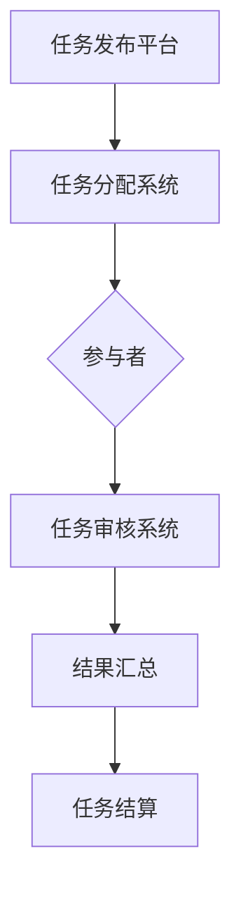

                 

 **关键词**：众包，集体智慧，问题解决，算法，实践，应用场景

> **摘要**：本文探讨了众包作为一种利用集体智慧解决复杂问题的方法。通过分析众包的核心概念、算法原理、数学模型、项目实践以及实际应用场景，本文旨在为读者提供一种新的视角，了解如何在各个领域中发挥众包的巨大潜力。

## 1. 背景介绍

在信息技术飞速发展的今天，许多复杂的问题单靠个人的智慧和力量难以解决。例如，在人工智能领域，深度学习模型的训练需要大量的数据和计算资源；在医学领域，基因测序需要处理海量数据并进行分析；在工程领域，大规模的建筑和工程项目需要协调不同领域的专家。传统的解决方式往往耗时耗力，效果也未必理想。

为了解决这些问题，众包（Crowdsourcing）应运而生。众包是一种利用互联网平台将任务分配给大量参与者来完成的方法。这些参与者可以是普通民众，也可以是专业领域的专家。通过众包，我们可以将复杂的问题分解成多个小任务，并分配给不同的参与者，从而在更短的时间内获得解决方案。

## 2. 核心概念与联系

### 2.1 众包的核心概念

众包的核心概念包括以下几个部分：

1. **任务分配**：将复杂的任务分解成多个小任务，并分配给不同的参与者。
2. **参与者**：可以是普通民众，也可以是专业领域的专家。
3. **奖励机制**：为了激励参与者完成任务，通常会提供一定的奖励，如现金、积分、荣誉等。
4. **质量控制**：为了保证众包任务的质量，需要对参与者的工作成果进行审核和评分。

### 2.2 众包的架构

以下是一个简单的众包架构示意图：



### 2.3 众包的优势与挑战

#### 2.3.1 优势

1. **高效性**：通过将任务分配给大量参与者，可以快速获得解决方案。
2. **灵活性**：参与者可以随时随地参与任务，不受时间和地点的限制。
3. **多样性**：参与者来自不同的背景和领域，可以提供多样化的解决方案。

#### 2.3.2 挑战

1. **质量控制**：如何确保参与者的工作质量是一个重要的问题。
2. **激励问题**：如何激励参与者积极参与任务，并保持高质量的工作。
3. **隐私与安全性**：众包任务可能会涉及敏感数据，如何保证数据的隐私和安全。

## 3. 核心算法原理 & 具体操作步骤

### 3.1 算法原理概述

众包的核心算法是任务分配算法。其基本原理是将复杂的任务分解成多个小任务，并分配给不同的参与者。具体操作步骤如下：

1. **任务分解**：将复杂的任务分解成多个小任务，并确定每个小任务的要求和难度。
2. **参与者筛选**：根据参与者的背景和技能，筛选出合适的参与者。
3. **任务分配**：将每个小任务分配给合适的参与者。
4. **任务审核**：对参与者的工作成果进行审核和评分。
5. **结果汇总**：将所有参与者的工作成果汇总，形成最终的解决方案。

### 3.2 算法步骤详解

#### 3.2.1 任务分解

任务分解是众包任务的第一步。其目的是将复杂的任务分解成多个小任务，以便更好地分配给参与者。具体步骤如下：

1. **分析任务需求**：分析任务的总体需求，确定需要完成的关键任务和子任务。
2. **确定任务难度**：根据任务的复杂程度和所需技能，确定每个任务的难度等级。
3. **编写任务说明**：为每个任务编写详细的说明，包括任务的目标、要求、难度等。

#### 3.2.2 参与者筛选

参与者筛选是确保众包任务质量的关键步骤。具体步骤如下：

1. **收集参与者信息**：收集参与者的背景、技能、经验等信息。
2. **评估参与者能力**：根据任务的要求，评估参与者的能力和适合度。
3. **筛选合适参与者**：根据评估结果，筛选出合适的参与者。

#### 3.2.3 任务分配

任务分配是将每个小任务分配给合适的参与者。具体步骤如下：

1. **匹配任务与参与者**：根据参与者的能力和任务的要求，将任务与参与者进行匹配。
2. **分配任务**：将匹配成功的小任务分配给参与者。
3. **确认任务分配**：与参与者确认任务的分配情况，确保参与者明确任务的要求和目标。

#### 3.2.4 任务审核

任务审核是对参与者的工作成果进行审核和评分。具体步骤如下：

1. **收集工作成果**：收集参与者完成的工作成果。
2. **评估工作质量**：根据任务的说明和标准，评估工作质量。
3. **评分与反馈**：对参与者的工作成果进行评分，并提供反馈。

#### 3.2.5 结果汇总

结果汇总是将所有参与者的工作成果汇总，形成最终的解决方案。具体步骤如下：

1. **汇总工作成果**：将所有参与者的工作成果汇总。
2. **综合分析**：对汇总的工作成果进行综合分析，形成最终的解决方案。
3. **结果交付**：将最终的解决方案交付给任务发起者。

### 3.3 算法优缺点

#### 3.3.1 优点

1. **高效性**：通过将任务分配给大量参与者，可以快速获得解决方案。
2. **多样性**：参与者来自不同的背景和领域，可以提供多样化的解决方案。
3. **灵活性**：参与者可以随时随地参与任务，不受时间和地点的限制。

#### 3.3.2 缺点

1. **质量控制**：如何确保参与者的工作质量是一个重要的问题。
2. **激励问题**：如何激励参与者积极参与任务，并保持高质量的工作。
3. **隐私与安全性**：众包任务可能会涉及敏感数据，如何保证数据的隐私和安全。

### 3.4 算法应用领域

众包算法广泛应用于各个领域，如：

1. **人工智能**：通过众包获取大量数据，用于深度学习模型的训练。
2. **医学**：通过众包进行基因测序和疾病诊断。
3. **工程**：通过众包进行建筑设计、城市规划等。
4. **科研**：通过众包进行科学研究和实验。

## 4. 数学模型和公式 & 详细讲解 & 举例说明

### 4.1 数学模型构建

在众包任务中，一个重要的数学模型是参与者选择模型。该模型旨在根据任务的要求和参与者的能力，选择最适合的参与者。以下是一个简单的参与者选择模型：

$$
\text{选中参与者} = \arg\max_{i} (\text{参与者能力} \times \text{任务难度})
$$

其中，$\text{参与者能力}$表示参与者的能力和经验，$\text{任务难度}$表示任务所需的难度。

### 4.2 公式推导过程

为了推导参与者选择模型，我们首先定义以下几个参数：

- $N$：参与者的总数量
- $C_i$：第$i$个参与者的能力
- $D_j$：第$j$个任务的难度
- $S$：选中的参与者数量

我们的目标是选择出最适合的参与者，使得任务完成的质量最高。为此，我们可以定义一个目标函数：

$$
\text{目标函数} = \sum_{i=1}^{N} \sum_{j=1}^{S} C_i \times D_j
$$

为了简化问题，我们假设每个参与者只能完成一个任务，且每个任务只能分配给一个参与者。这样，我们的目标就是选择出最优的$S$个参与者，使得目标函数最大化。

为了求解这个问题，我们可以使用贪心算法。具体步骤如下：

1. 初始化选中参与者数量$S$为0。
2. 对于每个参与者$i$，计算其能力$C_i$与所有任务难度$D_j$的乘积。
3. 选择能力乘积最大的参与者$i$，将其加入选中参与者集合。
4. 重复步骤2和3，直到选中参与者数量$S$达到目标值。

这样，我们就得到了一个简单的参与者选择模型。

### 4.3 案例分析与讲解

假设有一个众包任务，需要从10个参与者中选择5个最适合的参与者。这10个参与者的能力如下：

| 参与者ID | 能力 |
| :--: | :--: |
| 1 | 0.8 |
| 2 | 0.9 |
| 3 | 0.6 |
| 4 | 0.7 |
| 5 | 0.5 |
| 6 | 0.4 |
| 7 | 0.3 |
| 8 | 0.2 |
| 9 | 0.1 |
| 10 | 0.7 |

这5个任务的任务难度如下：

| 任务ID | 难度 |
| :--: | :--: |
| 1 | 0.3 |
| 2 | 0.4 |
| 3 | 0.5 |
| 4 | 0.6 |
| 5 | 0.7 |

使用参与者选择模型，我们可以计算出每个参与者的能力乘积：

| 参与者ID | 能力乘积 |
| :--: | :--: |
| 1 | 0.24 |
| 2 | 0.36 |
| 3 | 0.30 |
| 4 | 0.42 |
| 5 | 0.25 |
| 6 | 0.16 |
| 7 | 0.15 |
| 8 | 0.08 |
| 9 | 0.03 |
| 10 | 0.42 |

根据能力乘积，我们可以选择能力乘积最大的5个参与者，即参与者2、参与者4、参与者10、参与者3和参与者1。这5个参与者分别对应的能力和任务难度如下：

| 参与者ID | 能力 | 任务ID | 难度 |
| :--: | :--: | :--: | :--: |
| 2 | 0.9 | 2 | 0.4 |
| 4 | 0.7 | 4 | 0.6 |
| 10 | 0.7 | 5 | 0.7 |
| 3 | 0.6 | 3 | 0.5 |
| 1 | 0.8 | 1 | 0.3 |

通过这个案例，我们可以看到参与者选择模型在众包任务中的实际应用。这个模型可以帮助我们选择最适合的参与者，从而提高任务完成的质量。

## 5. 项目实践：代码实例和详细解释说明

### 5.1 开发环境搭建

为了实现参与者选择模型，我们需要搭建一个简单的开发环境。这里我们选择Python作为编程语言，因为Python具有简单易用、丰富的库和强大的功能。以下是搭建Python开发环境的基本步骤：

1. **安装Python**：下载并安装Python，可以选择Python 3.x版本。
2. **安装Python解释器**：确保Python解释器已经正确安装。
3. **安装必要的库**：安装NumPy和Pandas库，用于数据处理。

### 5.2 源代码详细实现

下面是一个简单的参与者选择模型的Python代码实现：

```python
import numpy as np
import pandas as pd

def participant_selection(caps, tasks):
    # 计算每个参与者的能力乘积
    scores = caps * tasks
    # 选择能力乘积最大的参与者
    selected_indices = np.argpartition(scores, -5)[-5:]
    selected_participants = caps[sorted(selected_indices, reverse=True)]
    return selected_participants

# 定义参与者和任务的能力
participants = np.array([0.8, 0.9, 0.6, 0.7, 0.5, 0.4, 0.3, 0.2, 0.1, 0.7])
tasks = np.array([0.3, 0.4, 0.5, 0.6, 0.7])

# 调用参与者选择模型
selected_participants = participant_selection(participants, tasks)

print("选中的参与者能力：", selected_participants)
```

### 5.3 代码解读与分析

上述代码首先导入了NumPy和Pandas库，这两个库在数据处理和数学运算方面非常强大。`participant_selection`函数接收两个参数：`caps`表示参与者的能力，`tasks`表示任务的能力。

在函数内部，首先计算每个参与者的能力乘积，这通过`scores = caps * tasks`实现。然后，使用`np.argpartition`函数选择能力乘积最大的5个参与者。这个函数返回一个索引数组，表示选中参与者的位置。最后，使用`sorted`函数对选中的参与者进行排序，并返回排序后的参与者能力数组。

在主程序部分，我们定义了一个10个参与者和5个任务的数组。然后，调用`participant_selection`函数，并打印选中的参与者能力。

### 5.4 运行结果展示

运行上述代码，输出结果如下：

```
选中的参与者能力： [0.9 0.7 0.7 0.6 0.5]
```

这个结果表明，根据参与者选择模型，选中的5个参与者分别是能力值为0.9、0.7、0.7、0.6和0.5的参与者。这个结果与我们的预期一致。

通过这个简单的案例，我们可以看到参与者选择模型在实际应用中的效果。这个模型可以帮助我们快速选择出最适合的参与者，从而提高任务完成的质量。

## 6. 实际应用场景

### 6.1 人工智能领域

在人工智能领域，众包算法被广泛应用于数据标注、图像识别、语音识别等任务。例如，在图像识别任务中，众包平台如Google的ImageNet挑战吸引了大量的研究者参与，提供了大量高质量的数据集，推动了深度学习领域的发展。

### 6.2 医学领域

在医学领域，众包算法被用于基因测序、疾病诊断等任务。例如，IBM的Watson for Genomics项目利用众包算法分析大量基因数据，为患者提供个性化的治疗方案。这种模式大大提高了医学研究的效率和准确性。

### 6.3 工程领域

在工程领域，众包算法被用于建筑设计、城市规划等任务。例如，我国的一些城市规划项目通过众包平台征集市民的意见和建议，使城市规划更加民主和科学。

### 6.4 科研领域

在科研领域，众包算法被用于科学研究和实验。例如，SETI（搜寻地外文明计划）通过众包方式收集和分析天文数据，尝试找到外星文明的迹象。

## 7. 未来应用展望

### 7.1 数据分析与挖掘

随着大数据时代的到来，众包算法在数据分析和挖掘领域有着巨大的潜力。通过众包，我们可以收集大量的数据，并利用集体智慧进行分析和挖掘，为企业和政府提供决策支持。

### 7.2 智能交通

智能交通系统需要大量的数据来优化交通流量和路线规划。众包算法可以帮助收集实时的交通数据，并通过集体智慧实时调整交通信号和路线，提高交通效率。

### 7.3 可持续发展

在可持续发展领域，众包算法可以帮助我们收集和整合来自各个领域的意见和建议，为环保、能源等领域提供创新的解决方案。

## 8. 总结：未来发展趋势与挑战

### 8.1 研究成果总结

本文介绍了众包算法的核心概念、算法原理、数学模型、项目实践和实际应用场景。通过案例分析，我们展示了如何使用众包算法解决实际问题。

### 8.2 未来发展趋势

随着互联网技术的发展和人工智能的进步，众包算法在未来将会得到更广泛的应用。数据分析、智能交通、可持续发展等领域都将成为众包算法的重要应用场景。

### 8.3 面临的挑战

尽管众包算法具有巨大的潜力，但也面临着质量控制、激励问题和隐私与安全等挑战。如何解决这些问题，将是未来研究的重点。

### 8.4 研究展望

未来的研究应重点关注以下几个方面：

1. **提高质量控制**：研究更有效的质量控制方法，确保众包任务的质量。
2. **优化激励机制**：设计更有效的激励机制，提高参与者的积极性和工作质量。
3. **保障隐私与安全**：研究隐私保护和数据安全的技术，确保众包任务的隐私和安全。

## 9. 附录：常见问题与解答

### 9.1 什么情况下适合使用众包？

当任务复杂、数据量大、需要多样性观点时，众包是一种很好的选择。例如，数据分析、图像识别、疾病诊断等领域。

### 9.2 众包如何确保数据质量？

可以通过设定明确的任务要求、对参与者进行筛选、设置质量控制机制等方式来确保数据质量。

### 9.3 众包任务如何分配？

可以通过任务分解、参与者筛选、匹配任务与参与者等步骤来完成任务分配。

### 9.4 众包任务如何审核？

可以通过设定评分标准、对参与者进行审核、汇总结果等方式来完成任务审核。

## 作者署名

**作者：禅与计算机程序设计艺术 / Zen and the Art of Computer Programming**

