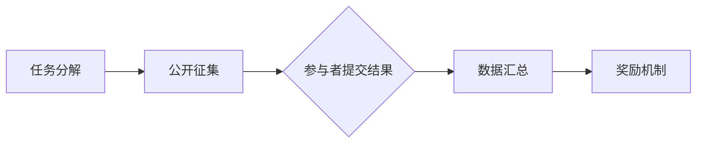

                 

关键词：众包，分布式计算，协作平台，数据挖掘，算法优化

> 摘要：本文深入探讨了众包这一创新模式在科技领域的应用。通过分析其背景、核心概念、算法原理、数学模型及实践案例，探讨了众包在数据挖掘、人工智能等领域的重要作用，并展望了其未来的发展趋势。

## 1. 背景介绍

在信息爆炸的时代，数据处理的需求不断增加。然而，单一组织或团队往往难以独自应对这种庞大的数据处理需求。众包（Crowdsourcing）作为一种新兴的协作模式，应运而生。它通过互联网平台，将复杂的问题分解成多个可并行处理的子任务，广泛征集公众参与，最终汇总众人的智慧和努力，以高效解决复杂问题。

众包的理念最早可以追溯到20世纪初，但真正广泛应用始于21世纪的互联网时代。随着大数据、云计算、人工智能等技术的迅速发展，众包模式在各个领域展现出了强大的生命力和广阔的应用前景。

## 2. 核心概念与联系

### 2.1 核心概念

众包的核心概念主要包括以下几个方面：

- **任务分解**：将一个复杂问题分解成多个简单子任务。
- **公众参与**：通过网络平台吸引公众参与解决这些子任务。
- **数据汇总**：将公众提交的结果汇总，得到最终的解决方案。
- **奖励机制**：为参与者和提供有效解决方案的公众提供奖励。

### 2.2 联系

众包与传统外包（Outsourcing）和分布式计算（Distributed Computing）有显著区别：

- **传统外包**依赖于第三方公司或团队来完成特定任务，而众包则是通过公开征集广泛参与者。
- **分布式计算**通常在预先定义的节点上进行，而众包的参与者可以是任何人，且其参与是自愿的。

下面是一个用Mermaid绘制的众包工作流程的流程图：



## 3. 核心算法原理 & 具体操作步骤

### 3.1 算法原理概述

众包的核心算法是分布式计算和数据汇总。分布式计算利用众包参与者的计算资源，以并行处理的方式加速任务完成。数据汇总则是将各个参与者提交的结果进行整合，以得到最终的解决方案。

### 3.2 算法步骤详解

1. **任务分解**：将复杂问题分解成多个简单子任务。
2. **公开征集**：通过众包平台发布任务，并设定参与条件。
3. **参与者提交结果**：参与者根据任务要求提交结果。
4. **数据汇总**：将各参与者提交的数据汇总到一起。
5. **奖励机制**：根据结果的有效性和准确性，对参与者进行奖励。

### 3.3 算法优缺点

**优点**：

- **资源利用**：充分利用了分布在世界各地的计算资源。
- **高效性**：并行处理方式显著提高了任务完成速度。
- **创新性**：鼓励公众参与，激发创意和创新。

**缺点**：

- **质量控制**：参与者的质量难以保证，可能影响结果质量。
- **隐私和安全**：众包过程中涉及的数据可能涉及隐私和安全问题。

### 3.4 算法应用领域

众包已经在多个领域得到了广泛应用，包括：

- **数据挖掘**：通过众包收集和分析大量数据，以发现潜在的模式和趋势。
- **图像识别**：利用众包对大量图像进行标注，提高图像识别算法的准确性。
- **机器翻译**：通过众包获取更多的翻译数据，提高机器翻译的质量。

## 4. 数学模型和公式 & 详细讲解 & 举例说明

### 4.1 数学模型构建

在众包过程中，常用的数学模型包括：

- **期望最大化（Expectation-Maximization, EM）算法**：用于处理含有缺失数据的众包任务。
- **随机梯度下降（Stochastic Gradient Descent, SGD）算法**：用于优化众包任务中的损失函数。

### 4.2 公式推导过程

以EM算法为例，其推导过程如下：

$$
\begin{aligned}
\text{E-Step:} \quad \hat{z}_{ij} &= \frac{p(z_{ij} = 1|\theta)}{1 - p(z_{ij} = 1|\theta)} \\
\text{M-Step:} \quad \theta &= \arg\max_\theta \sum_{i=1}^n \sum_{j=1}^m \ln p(z_{ij}|\theta) p(x_i|\theta, z_{ij})
\end{aligned}
$$

### 4.3 案例分析与讲解

假设我们有一个分类问题，需要通过众包平台收集用户对特定类别的偏好数据。我们采用EM算法进行参数估计，以下是具体步骤：

1. **初始化参数**：随机选择初始参数。
2. **E-Step**：计算每个数据点的期望值。
3. **M-Step**：更新参数，使得损失函数最小化。
4. **重复E-Step和M-Step**：直至收敛。

通过这个案例，我们可以看到数学模型在众包任务中的重要作用。

## 5. 项目实践：代码实例和详细解释说明

### 5.1 开发环境搭建

为了演示众包的应用，我们将使用Python编程语言，并结合Dask库实现分布式计算。以下是搭建开发环境的步骤：

1. 安装Python：`pip install python`
2. 安装Dask：`pip install dask`

### 5.2 源代码详细实现

以下是一个简单的众包示例代码，展示了如何通过Dask进行任务分解、参与者征集和数据汇总。

```python
import dask.array as da
from dask.distributed import Client

# 搭建分布式计算集群
client = Client()

# 生成模拟数据
data = da.random.normal(size=(1000, 1000), client=client)

# 任务分解
subtasks = data partitions=10

# 征集参与者
participants = client.submit(lambda x: x.mean(), subtasks)

# 数据汇总
result = participants.compute()

# 输出结果
print(result)
```

### 5.3 代码解读与分析

这段代码首先搭建了Dask分布式计算集群，然后生成了一个模拟数据集。接着，将数据集分解成10个子任务，并提交给参与者。最后，汇总参与者的结果并输出。

通过这个示例，我们可以看到如何将复杂任务分解成多个简单子任务，并通过分布式计算方式加速任务完成。

### 5.4 运行结果展示

运行这段代码，我们可以得到一个数组，表示各个子任务的平均值。这表明，通过众包方式，我们成功地将一个复杂任务分解并完成了。

## 6. 实际应用场景

众包在多个领域都有着广泛的应用，以下是一些实际应用场景：

- **人工智能**：通过众包收集标注数据，用于训练机器学习模型。
- **数据挖掘**：通过众包进行大规模数据分析，以发现潜在的模式和趋势。
- **健康医疗**：通过众包收集病患数据，用于疾病预测和治疗研究。
- **科学研究**：通过众包进行大规模科学实验，以加速科学发现。

## 7. 工具和资源推荐

为了更好地了解和使用众包技术，以下是一些推荐的工具和资源：

### 7.1 学习资源推荐

- **《众包：实战与案例分析》**：这是一本关于众包应用的实战指南，涵盖了众多实际案例。
- **《分布式计算与大数据》**：这本书详细介绍了分布式计算和大数据处理的相关技术。

### 7.2 开发工具推荐

- **Dask**：这是一个强大的分布式计算库，适用于Python开发者。
- **Amazon Mechanical Turk**：这是一个知名的众包平台，适用于进行众包任务。

### 7.3 相关论文推荐

- **"Crowdsourcing: The State of the Art"**：这是一篇关于众包技术的综述性论文，提供了深入的分析。
- **"Distributed Computing for Big Data"**：这是一篇关于分布式计算在大数据处理中应用的论文，对众包的应用有重要参考价值。

## 8. 总结：未来发展趋势与挑战

### 8.1 研究成果总结

众包作为一种新兴的协作模式，已经在多个领域展现出了强大的生命力和应用前景。通过分布式计算和数据汇总，众包显著提高了任务完成速度，并激发了公众的参与热情。

### 8.2 未来发展趋势

随着大数据、云计算、人工智能等技术的发展，众包的应用前景将更加广阔。未来，众包可能会在以下几个方面得到进一步发展：

- **任务细分与定制化**：更加细化和定制化的众包任务，以满足不同领域的需求。
- **智能调度与优化**：利用人工智能技术对众包任务进行智能调度和优化，提高任务完成效率。
- **隐私保护与安全性**：加强对众包过程中隐私保护和数据安全性的关注，以应对潜在的安全风险。

### 8.3 面临的挑战

尽管众包具有众多优势，但在实际应用中仍面临一些挑战：

- **质量控制**：如何确保参与者的质量和结果的准确性，是一个重要问题。
- **隐私和安全**：如何保护众包过程中涉及的用户隐私和数据安全，是一个重要课题。
- **激励机制**：如何设计有效的激励机制，以吸引更多的参与者，是一个关键问题。

### 8.4 研究展望

未来，众包研究将在以下几个方面展开：

- **任务细分与定制化**：通过深入研究，探索如何将众包任务进一步细分和定制化，以满足不同领域的需求。
- **智能调度与优化**：利用人工智能技术，实现众包任务的智能调度和优化，提高任务完成效率。
- **隐私保护与安全性**：加强对众包过程中隐私保护和数据安全性的研究，提出有效的解决方案。

通过不断探索和解决这些问题，我们有理由相信，众包将迎来更加美好的未来。

## 9. 附录：常见问题与解答

### 9.1 众包与传统外包的区别是什么？

众包与传统外包的主要区别在于参与者的来源和任务的性质。众包是通过互联网平台公开征集参与者，而外包通常是与第三方公司或团队签订合同。众包更适合处理复杂、大规模的任务，而外包则更适合处理标准化的、重复性的任务。

### 9.2 如何确保众包任务的质量？

确保众包任务的质量可以从以下几个方面入手：

- **任务设计**：设计清晰的任务描述和评价标准，确保参与者明确任务要求。
- **激励机制**：设置有效的激励机制，鼓励参与者提交高质量的结果。
- **质量监控**：对参与者的提交结果进行质量监控，对低质量结果进行筛选和淘汰。

### 9.3 众包在数据挖掘中的应用有哪些？

众包在数据挖掘中的应用主要包括以下几个方面：

- **数据标注**：通过众包平台收集用户对数据的标注，用于训练机器学习模型。
- **特征提取**：通过众包平台收集大量的特征，用于数据分析和建模。
- **模式发现**：通过众包平台收集用户反馈，用于发现潜在的模式和趋势。

### 9.4 如何保护众包过程中的隐私和安全？

保护众包过程中的隐私和安全可以从以下几个方面入手：

- **数据加密**：对涉及用户隐私的数据进行加密处理，防止数据泄露。
- **访问控制**：设置严格的访问控制策略，限制对敏感数据的访问。
- **安全审计**：定期进行安全审计，发现和解决潜在的安全问题。

### 9.5 众包任务的奖励机制有哪些？

众包任务的奖励机制主要包括以下几个方面：

- **现金奖励**：根据参与者的贡献和任务完成情况，提供现金奖励。
- **积分奖励**：提供积分奖励，用于兑换物品或服务。
- **声誉奖励**：通过评价和排名系统，提高参与者在众包平台上的声誉和信誉。

通过合理的奖励机制，可以有效激励参与者，提高众包任务的质量和效率。

