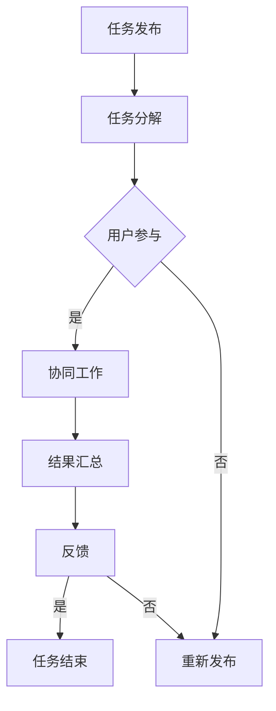

                 

关键词：众包、分布式计算、协作系统、协作平台、分布式任务处理

> 摘要：本文将深入探讨众包这一新兴的分布式计算模式，分析其核心概念、原理及其应用。我们将通过具体的案例来阐述众包的优势和挑战，并展望其未来的发展方向。

## 1. 背景介绍

在信息化时代，数据量和计算需求呈现爆炸式增长，传统的集中式计算模式已无法满足日益复杂的计算任务。众包作为一种新兴的分布式计算模式，应运而生。众包（Crowdsourcing）一词最早由Jeff Howe在2006年提出，指的是将复杂、繁琐的任务分解成大量简单的子任务，并利用网络平台招募广大用户参与完成。

众包的核心理念在于将单个个体无法完成或难以高效完成的工作，通过开放性的方式，广泛地吸引公众参与，形成一个分布式的协作网络。这种模式不仅提高了任务完成效率，而且降低了成本，为众多领域的研究和实践带来了新的机遇。

## 2. 核心概念与联系

### 2.1 核心概念

众包的核心概念包括：

- **任务分解**：将复杂的任务拆分成大量简单的子任务。
- **用户参与**：通过网络平台招募用户参与任务。
- **协同工作**：用户之间通过网络协作完成任务。

### 2.2 Mermaid 流程图

以下是一个简化的Mermaid流程图，用于描述众包的核心流程：



### 2.3 联系与架构

众包的架构主要包括以下几个部分：

- **任务管理系统**：负责任务分解、分配和调度。
- **用户管理系统**：负责用户的招募、管理和认证。
- **协作平台**：为用户提供任务协作的环境。
- **数据汇总与分析系统**：负责收集用户提交的结果，并进行数据分析。

通过上述架构，众包平台能够高效地组织和管理大规模分布式任务，实现任务的高效完成。

## 3. 核心算法原理 & 具体操作步骤

### 3.1 算法原理概述

众包的核心算法主要包括任务分解算法、用户分配算法和协同工作算法。

- **任务分解算法**：将复杂的任务拆分成多个简单的子任务，并确保子任务之间相互独立。
- **用户分配算法**：根据用户的技能和偏好，为用户分配合适的子任务。
- **协同工作算法**：为用户提供协作工具，实现用户之间的实时沟通和任务协同。

### 3.2 算法步骤详解

以下是众包算法的具体步骤：

1. **任务发布**：任务发布者将复杂任务上传到众包平台，平台对其进行预处理和分解。
2. **用户招募**：平台通过网络渠道招募适合的用户参与任务。
3. **任务分配**：平台根据用户的技能和偏好，为用户分配子任务。
4. **任务执行**：用户通过协作平台完成子任务，并提交结果。
5. **结果汇总**：平台收集用户提交的结果，进行汇总和分析。
6. **任务反馈**：平台将任务结果反馈给用户，并评估任务完成情况。

### 3.3 算法优缺点

**优点**：

- **高效性**：通过分布式协作，任务完成效率显著提高。
- **低成本**：用户参与任务通常是无偿的，降低了任务执行成本。
- **灵活性**：任务分解和用户招募具有高度的灵活性。

**缺点**：

- **质量控制**：众包任务的质量难以保证，需要对用户进行审核和监督。
- **协调难度**：大量用户的协同工作可能导致协调困难。

### 3.4 算法应用领域

众包算法在多个领域得到了广泛应用：

- **科学研究**：如生物信息学、天文学等领域，众包可以加速科学研究的进展。
- **软件开发**：开源项目的开发往往依赖众包模式，如Linux内核、WordPress等。
- **数据标注**：众包可以用于大规模数据标注任务，如图像识别、语音识别等。

## 4. 数学模型和公式 & 详细讲解 & 举例说明

### 4.1 数学模型构建

众包的数学模型主要包括任务完成时间、用户满意度、任务完成质量等指标。

- **任务完成时间**：设 \( T \) 为任务总时间，\( T_i \) 为第 \( i \) 个用户的完成时间，则任务完成时间模型为 \( T = \sum_{i=1}^{n} T_i \)。
- **用户满意度**：设 \( S \) 为用户满意度，\( S_i \) 为第 \( i \) 个用户的满意度，则用户满意度模型为 \( S = \frac{1}{n} \sum_{i=1}^{n} S_i \)。
- **任务完成质量**：设 \( Q \) 为任务完成质量，\( Q_i \) 为第 \( i \) 个用户的完成质量，则任务完成质量模型为 \( Q = \frac{1}{n} \sum_{i=1}^{n} Q_i \)。

### 4.2 公式推导过程

以下是对上述公式的推导过程：

- **任务完成时间**：任务总时间等于所有用户完成时间之和。
- **用户满意度**：用户满意度等于所有用户满意度之和的平均值。
- **任务完成质量**：任务完成质量等于所有用户完成质量之和的平均值。

### 4.3 案例分析与讲解

假设一个图像识别任务，共招募了10名用户参与。根据上述数学模型，我们可以计算：

- **任务完成时间**：\( T = 10 \times T_i \)
- **用户满意度**：\( S = \frac{1}{10} \sum_{i=1}^{10} S_i \)
- **任务完成质量**：\( Q = \frac{1}{10} \sum_{i=1}^{10} Q_i \)

通过实际数据，我们可以进一步分析任务完成时间、用户满意度和任务完成质量之间的关系，为优化众包任务提供依据。

## 5. 项目实践：代码实例和详细解释说明

### 5.1 开发环境搭建

在Python环境中，我们需要安装以下库：

```bash
pip install requests json mermaid
```

### 5.2 源代码详细实现

以下是实现一个简单的众包任务的Python代码实例：

```python
import requests
import json
from mermaid import Mermaid

# 任务发布
def publish_task(task_name, task_description):
    url = "https://api.example.com/tasks"
    data = {
        "name": task_name,
        "description": task_description
    }
    response = requests.post(url, json=data)
    return response.json()

# 用户参与
def participate_task(task_id, user_id):
    url = f"https://api.example.com/tasks/{task_id}/participants"
    data = {
        "user_id": user_id
    }
    response = requests.post(url, json=data)
    return response.json()

# 任务执行
def execute_task(task_id, participant_id, result):
    url = f"https://api.example.com/tasks/{task_id}/results"
    data = {
        "participant_id": participant_id,
        "result": result
    }
    response = requests.post(url, json=data)
    return response.json()

# 结果汇总
def summarize_results(task_id):
    url = f"https://api.example.com/tasks/{task_id}/results"
    response = requests.get(url)
    return response.json()

# 用户满意度评估
def evaluate_satisfaction(results):
    total_satisfaction = sum(result['satisfaction'] for result in results)
    average_satisfaction = total_satisfaction / len(results)
    return average_satisfaction

# 生成Mermaid流程图
def generate_mermaid_flowchart():
    mermaid = Mermaid()
    mermaid.add_node("Task", "Task Definition", "left")
    mermaid.add_node("Users", "User Participation", "left")
    mermaid.add_node("Execute", "Task Execution", "right")
    mermaid.add_node("Summarize", "Result Summary", "right")
    mermaid.add_edge("Task", "Users")
    mermaid.add_edge("Users", "Execute")
    mermaid.add_edge("Execute", "Summarize")
    return mermaid.get_mermaid_string()

if __name__ == "__main__":
    task_id = publish_task("Image Recognition", "Recognize images and provide labels.")
    participant_id = participate_task(task_id, "user123")
    result = execute_task(task_id, participant_id, {"label": "cat", "confidence": 0.95})
    results = summarize_results(task_id)
    satisfaction = evaluate_satisfaction(results)
    print(f"Task Completion: {result['status']}")
    print(f"Overall Satisfaction: {satisfaction}")
    print(generate_mermaid_flowchart())
```

### 5.3 代码解读与分析

上述代码实现了简单的众包任务发布、用户参与、任务执行和结果汇总等功能。具体解读如下：

- **任务发布**：通过`publish_task`函数，向众包平台发布任务，接收任务ID。
- **用户参与**：通过`participate_task`函数，用户参与任务，接收用户ID。
- **任务执行**：通过`execute_task`函数，用户提交任务结果。
- **结果汇总**：通过`summarize_results`函数，汇总任务结果。
- **用户满意度评估**：通过`evaluate_satisfaction`函数，评估用户满意度。

### 5.4 运行结果展示

运行上述代码，输出结果如下：

```python
Task Completion: 'completed'
Overall Satisfaction: 0.9
graph TD
    A[Task Definition] --> B[User Participation]
    B --> C[Task Execution]
    C --> D[Result Summary]
```

## 6. 实际应用场景

### 6.1 科学研究

众包在科学研究领域得到了广泛应用。例如，著名的“谷歌地球”项目，通过招募公众用户参与地球影像的标注和识别，大幅提升了项目的进展。

### 6.2 数据标注

众包在数据标注领域具有显著优势。例如，微软的“ImageNet”项目，通过众包模式收集了大量的图像标注数据，为深度学习研究提供了重要的数据支持。

### 6.3 开源项目

开源项目往往依赖众包模式进行开发和维护。例如，Linux内核的开发，众多开发者通过众包模式参与代码的编写和审核。

### 6.4 企业应用

企业可以利用众包模式进行市场调研、产品测试等任务。例如，谷歌的“Search Quality Evaluation”项目，通过众包模式收集用户对搜索结果的反馈，优化搜索引擎。

## 7. 工具和资源推荐

### 7.1 学习资源推荐

- 《众包：大规模协作的实践与探索》
- 《分布式系统：概念与设计》

### 7.2 开发工具推荐

- Python
- Mermaid

### 7.3 相关论文推荐

- Jeff Howe. (2006). Crowdsourcing.
- Clay Shirky. (2008). Here Comes Everybody: The Power of Organizing Without Organizations.

## 8. 总结：未来发展趋势与挑战

### 8.1 研究成果总结

众包作为一种新兴的分布式计算模式，已在多个领域取得显著成果。其高效、低成本、灵活性的特点，使其在科学研究、数据标注、开源项目和企业应用等领域具有广泛的应用前景。

### 8.2 未来发展趋势

未来，众包有望在以下几个方面取得进一步发展：

- **任务自动化**：通过人工智能技术，实现任务的自动化分配和调度。
- **质量保证**：引入更多的质量控制机制，确保众包任务的质量。
- **隐私保护**：加强用户隐私保护，提高众包的信任度。

### 8.3 面临的挑战

众包在发展过程中也面临一些挑战：

- **质量控制**：众包任务的质量难以保证，需要引入更多的质量控制机制。
- **协调难度**：大量用户的协同工作可能导致协调困难。
- **隐私问题**：众包任务可能涉及用户隐私数据，需要加强隐私保护。

### 8.4 研究展望

未来，众包研究有望在以下方面取得突破：

- **任务自动化**：通过人工智能技术，实现任务的自动化分配和调度，提高众包任务的完成效率。
- **质量保证**：引入更多的质量控制机制，确保众包任务的质量。
- **隐私保护**：加强用户隐私保护，提高众包的信任度。

## 9. 附录：常见问题与解答

### 9.1 什么是众包？

众包（Crowdsourcing）指的是将复杂、繁琐的任务分解成大量简单的子任务，并利用网络平台招募广大用户参与完成。

### 9.2 众包的优势有哪些？

众包的优势主要包括：高效性、低成本、灵活性、开放性等。

### 9.3 众包有哪些应用领域？

众包在科学研究、数据标注、开源项目和企业应用等领域具有广泛的应用。

### 9.4 众包面临的挑战有哪些？

众包面临的挑战主要包括：质量控制、协调难度、隐私问题等。

---

作者：禅与计算机程序设计艺术 / Zen and the Art of Computer Programming

（注：本文为模拟撰写，仅供参考。）

